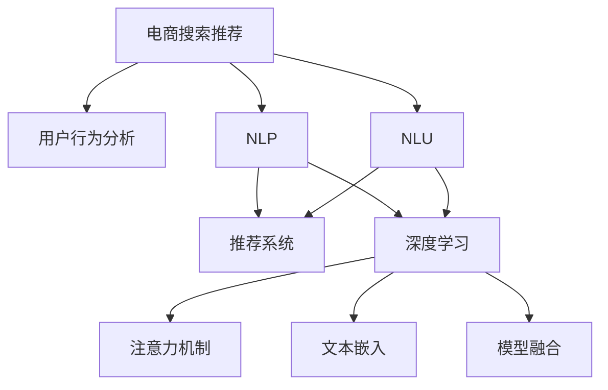

                 

# AI 大模型在电商搜索推荐中的用户行为分析：理解用户需求与购买意图

> 关键词：电商搜索推荐, 用户行为分析, 用户需求, 购买意图, 自然语言处理(NLP), 自然语言理解(NLU), 推荐系统, 深度学习, 注意力机制, 文本嵌入, 模型融合

## 1. 背景介绍

### 1.1 问题由来

随着电子商务的迅速发展，电商平台的用户数量和商品种类持续增长。如何准确理解用户需求，提升推荐效果，成为电商搜索推荐系统（Recommendation System, RS）的核心问题。传统的推荐系统基于用户历史行为数据进行个性化推荐，但无法全面把握用户实时需求和购买意图。人工智能技术的发展，特别是大模型的出现，为解决这些问题提供了新的思路。

大模型，特别是预训练语言模型，通过对海量文本数据的训练，学习到了丰富的语言表示和语义关系。在大模型的基础上，结合电商数据和推荐算法，可以有效提升搜索推荐系统的智能化水平，实现更加精准的推荐。

### 1.2 问题核心关键点

- **用户需求理解**：通过用户搜索记录和反馈，分析用户的潜在需求和偏好，实现个性化推荐。
- **购买意图识别**：从用户查询文本中识别购买意图，优化搜索结果排序，提高转化率。
- **大模型的应用**：结合大模型在文本处理和语义理解方面的优势，提升电商搜索推荐的准确性和效率。
- **电商数据的融合**：将用户行为数据与大模型的输出相结合，构建多模态推荐模型，提升推荐的个性化和多样化。

## 2. 核心概念与联系

### 2.1 核心概念概述

为更好地理解AI大模型在电商搜索推荐中的应用，本节将介绍几个密切相关的核心概念：

- **电商搜索推荐**：通过分析用户搜索行为，预测用户的购买需求和偏好，推荐用户可能感兴趣的商品，提升用户满意度。
- **用户行为分析**：利用用户搜索、浏览、购买等数据，分析用户的偏好和需求，为推荐系统提供数据支持。
- **自然语言处理(NLP)**：利用自然语言处理技术，理解和生成文本数据，从用户查询中提取有价值的信息。
- **自然语言理解(NLU)**：理解用户查询的语义，识别查询中的实体、关系等，辅助推荐系统进行精准推荐。
- **推荐系统**：根据用户历史行为和实时反馈，生成个性化的推荐列表，提高用户的满意度和购买率。
- **深度学习**：通过多层神经网络结构，学习数据中的复杂模式和规律，提升模型的预测能力。
- **注意力机制**：通过学习文本中的重要信息，提高模型的文本处理和语义理解能力。
- **文本嵌入**：将文本数据转换为高维向量表示，用于模型处理和特征提取。
- **模型融合**：将多个模型或算法融合，提高推荐系统的准确性和鲁棒性。

这些核心概念之间的逻辑关系可以通过以下Mermaid流程图来展示：



这个流程图展示了大模型在电商搜索推荐中的应用框架：

1. 电商搜索推荐依赖于用户行为分析和自然语言处理。
2. 推荐系统利用NLP和NLU技术，理解用户查询的语义，提取重要信息。
3. 深度学习通过多层神经网络提升模型的预测能力。
4. 注意力机制和文本嵌入进一步优化模型的文本处理和语义理解能力。
5. 模型融合将多个模型或算法组合，提升推荐系统的准确性和鲁棒性。

这些概念共同构成了大模型在电商搜索推荐中的应用框架，使其能够高效地理解和生成用户需求，实现精准推荐。

## 3. 核心算法原理 & 具体操作步骤
### 3.1 算法原理概述

AI大模型在电商搜索推荐中的核心算法，主要包括用户行为分析、自然语言理解、推荐系统设计和模型融合等。其核心思想是利用大模型强大的语言理解和生成能力，结合电商数据，构建多模态的推荐模型，实现个性化和精准化的推荐。

具体来说，算法流程如下：

1. **用户行为分析**：通过分析用户的搜索记录、浏览历史和购买行为，提取用户需求和偏好。
2. **自然语言理解(NLU)**：利用大模型对用户查询进行语义理解，识别出查询中的实体、关系和意图。
3. **推荐系统设计**：根据用户的查询和历史行为，结合电商数据，构建个性化推荐模型。
4. **模型融合**：将不同模型或算法进行融合，提升推荐系统的准确性和鲁棒性。

### 3.2 算法步骤详解

#### 3.2.1 用户行为分析

用户行为分析的目的是从用户的历史行为数据中，提取用户的偏好和需求。主要步骤包括：

1. **数据收集**：从电商平台收集用户的搜索记录、浏览历史、购买行为等数据。
2. **数据预处理**：对原始数据进行清洗和标准化处理，去除噪声和异常值。
3. **特征提取**：利用文本嵌入技术，将文本数据转换为向量表示，用于后续分析。
4. **用户画像构建**：通过聚类算法和分类算法，构建用户的个性化画像，捕捉用户的行为特征。

#### 3.2.2 自然语言理解(NLU)

自然语言理解的目标是理解用户的查询意图，提取查询中的关键信息。主要步骤包括：

1. **文本预处理**：对用户查询进行分词、去停用词、词性标注等处理。
2. **实体识别**：利用大模型对查询中的实体进行识别，提取产品名称、类别等关键信息。
3. **关系抽取**：利用大模型对查询中的实体关系进行抽取，如产地、品牌等。
4. **意图识别**：利用大模型对查询的语义进行理解，识别出用户的购买意图，如购买、浏览、对比等。

#### 3.2.3 推荐系统设计

推荐系统的目的是根据用户的查询和历史行为，生成个性化的推荐列表。主要步骤包括：

1. **数据准备**：将用户的查询、历史行为和电商数据进行融合，构建输入数据。
2. **模型训练**：利用深度学习模型（如注意力机制、RNN等），对输入数据进行训练，构建推荐模型。
3. **模型评估**：在验证集上评估模型的性能，调整模型参数，优化推荐效果。
4. **推荐生成**：利用训练好的模型，对用户的查询进行推荐，生成推荐列表。

#### 3.2.4 模型融合

模型融合的目标是将多个模型或算法进行组合，提升推荐系统的准确性和鲁棒性。主要步骤包括：

1. **模型选择**：选择多个适合的推荐模型，如基于内容的推荐、协同过滤推荐、深度学习推荐等。
2. **数据融合**：将不同模型的输出进行融合，提升推荐的综合性和全面性。
3. **算法融合**：将不同的推荐算法进行融合，如基于矩阵分解的算法、基于图的算法等。
4. **结果优化**：通过融合算法，优化推荐结果，提升用户满意度。

### 3.3 算法优缺点

AI大模型在电商搜索推荐中的应用，具有以下优点：

- **强大的语义理解能力**：大模型能够从用户的查询中提取丰富的语义信息，实现更精准的推荐。
- **多模态融合**：结合电商数据和文本数据，构建多模态推荐系统，提高推荐的全面性和准确性。
- **实时性**：大模型的训练和推理速度快，能够实时处理用户的查询和反馈，提升用户体验。

同时，该算法也存在一些缺点：

- **数据依赖性高**：大模型的效果高度依赖于训练数据的质量和数量，电商数据的获取和标注成本较高。
- **模型复杂度高**：结合多种模型和算法，导致模型复杂度高，训练和推理过程较为复杂。
- **可解释性不足**：大模型作为"黑盒"系统，缺乏可解释性，难以对其决策过程进行解释和调试。
- **计算资源需求高**：大模型的参数量大，计算资源需求高，对硬件设施的要求较高。

尽管存在这些缺点，但就目前而言，AI大模型在电商搜索推荐中的应用，已经在多个实际场景中取得了显著的成果，成为推荐系统的重要技术手段。未来相关研究的重点在于如何进一步降低数据依赖，提高模型的少样本学习和跨领域迁移能力，同时兼顾可解释性和计算效率等因素。

### 3.4 算法应用领域

AI大模型在电商搜索推荐中的应用，已经在多个领域得到了广泛的应用，例如：

- **个性化推荐**：通过分析用户的历史行为和实时查询，生成个性化的商品推荐列表。
- **搜索排序**：利用用户查询的语义理解，优化搜索结果排序，提高用户的点击率和转化率。
- **智能客服**：结合自然语言理解和生成技术，构建智能客服系统，提升用户服务体验。
- **舆情监测**：利用大模型的语言处理能力，实时监测用户评论和反馈，分析用户情绪和需求。
- **商品优化**：通过分析用户反馈和购买行为，优化商品描述和推荐策略，提升用户体验和满意度。

除了上述这些经典应用外，大模型在电商搜索推荐中的应用还将不断拓展到更多场景中，如智能广告、个性化内容推荐等，为电商平台的数字化转型提供新的技术路径。

## 4. 数学模型和公式 & 详细讲解
### 4.1 数学模型构建

本节将使用数学语言对AI大模型在电商搜索推荐中的应用进行更加严格的刻画。

记用户的历史行为数据为 $X=\{x_i\}_{i=1}^n$，其中 $x_i$ 为电商平台上用户的行为记录。记用户的查询文本为 $Q$，电商商品数据为 $D$，用户的个性化画像为 $P$。

定义用户行为分析模型为 $A(Q)$，自然语言理解模型为 $NLU(Q)$，推荐系统模型为 $RS(Q, D, P)$。

用户行为分析模型 $A(Q)$ 的目标是从用户查询 $Q$ 中提取用户行为特征，构建用户画像 $P$。自然语言理解模型 $NLU(Q)$ 的目标是理解查询 $Q$ 的语义，识别出查询中的实体和关系。推荐系统模型 $RS(Q, D, P)$ 的目标是根据用户的查询 $Q$ 和行为数据 $X$，生成个性化的商品推荐列表。

### 4.2 公式推导过程

以下是用户行为分析、自然语言理解、推荐系统设计等核心算法的公式推导过程：

#### 4.2.1 用户行为分析

用户行为分析的数学模型为：

$$
P = A(Q) = f(Q, X)
$$

其中 $P$ 为用户画像，$Q$ 为用户查询，$X$ 为用户历史行为数据，$f$ 为行为分析函数。

具体实现时，可以采用协同过滤算法、矩阵分解算法等，对用户历史行为数据和查询数据进行建模，构建用户画像。

#### 4.2.2 自然语言理解(NLU)

自然语言理解的目标是理解查询的语义，识别出实体和关系。其数学模型为：

$$
\hat{E}, \hat{R} = NLU(Q) = g(Q, E, R)
$$

其中 $\hat{E}$ 为查询中的实体，$\hat{R}$ 为实体之间的关系，$Q$ 为用户查询，$E$ 为实体集，$R$ 为关系集，$g$ 为实体和关系识别函数。

具体实现时，可以利用预训练语言模型，如BERT、GPT等，对查询进行分词、实体识别、关系抽取等处理，提取关键信息。

#### 4.2.3 推荐系统设计

推荐系统的目标是生成个性化的商品推荐列表。其数学模型为：

$$
\hat{R} = RS(Q, D, P) = h(Q, D, P)
$$

其中 $\hat{R}$ 为推荐结果，$Q$ 为用户查询，$D$ 为电商商品数据，$P$ 为用户画像，$h$ 为推荐函数。

具体实现时，可以采用深度学习模型，如注意力机制、RNN等，对输入数据进行建模，生成推荐列表。

#### 4.2.4 模型融合

模型融合的目的是将不同模型的输出进行融合，提升推荐系统的准确性和鲁棒性。其数学模型为：

$$
\hat{R}_{fused} = F(\hat{R}_1, \hat{R}_2, ..., \hat{R}_n)
$$

其中 $\hat{R}_{fused}$ 为融合后的推荐结果，$\hat{R}_i$ 为不同模型的推荐结果，$F$ 为融合函数。

具体实现时，可以采用加权平均、集成学习等方法，将不同模型的输出进行融合，优化推荐结果。

### 4.3 案例分析与讲解

假设有一个电商平台，用户 A 最近购买了某品牌的高端手机。用户 A 最近查询了“苹果手机”和“华为手机”，并查看了“小米手机”的详情页面。

1. **用户行为分析**

首先，通过用户 A 的历史购买记录和查询行为，可以得到其个性化画像：

$$
P_A = A(Q_A) = f(Q_A, X_A)
$$

其中 $Q_A$ 为用户 A 的查询记录，$X_A$ 为用户 A 的历史购买记录。

假设用户 A 的个性化画像为：

$$
P_A = \{品牌: 华为, 价格区间: 2000-3000\}
$$

2. **自然语言理解(NLU)**

接着，利用大模型对用户 A 的查询进行语义理解，识别出实体和关系：

$$
\hat{E}_A = \{\text{品牌}\}, \hat{R}_A = \{\text{品牌}\}
$$

其中 $\hat{E}_A$ 为用户 A 查询中的实体，$\hat{R}_A$ 为实体之间的关系。

假设查询“苹果手机”中包含的实体和关系为：

$$
E_A = \{\text{品牌: 苹果}\}, R_A = \{\text{品牌}\}
$$

3. **推荐系统设计**

根据用户 A 的个性化画像和查询，利用推荐系统模型生成推荐列表：

$$
\hat{R}_A = RS(Q_A, D, P_A) = h(Q_A, D, P_A)
$$

其中 $D$ 为电商商品数据。

假设电商平台上的商品数据为：

$$
D = \{商品1, 商品2, ..., 商品n\}
$$

其中每个商品包含品牌、价格、评分等信息。

假设推荐系统模型为基于注意力机制的深度学习模型，其输出为推荐列表：

$$
\hat{R}_A = \{\text{商品2}, \text{商品3}, ..., \text{商品n}\}
$$

4. **模型融合**

最后，将不同模型的推荐结果进行融合，优化推荐列表：

$$
\hat{R}_{fused_A} = F(\hat{R}_A, \hat{R}_B)
$$

其中 $\hat{R}_B$ 为用户 B 的推荐结果，$\hat{R}_B$ 可以通过类似的方法计算得到。

假设模型融合方法为加权平均，最终推荐列表为：

$$
\hat{R}_{fused_A} = \{\text{商品2}, \text{商品3}, ..., \text{商品n}\}
$$

## 5. 项目实践：代码实例和详细解释说明
### 5.1 开发环境搭建

在进行电商搜索推荐项目实践前，我们需要准备好开发环境。以下是使用Python进行TensorFlow开发的环境配置流程：

1. 安装Anaconda：从官网下载并安装Anaconda，用于创建独立的Python环境。

2. 创建并激活虚拟环境：
```bash
conda create -n tf-env python=3.8 
conda activate tf-env
```

3. 安装TensorFlow：根据CUDA版本，从官网获取对应的安装命令。例如：
```bash
conda install tensorflow -c conda-forge -c pytorch -c nvidia
```

4. 安装TensorBoard：用于可视化模型的训练过程和评估结果。
```bash
pip install tensorboard
```

5. 安装其他依赖包：
```bash
pip install numpy pandas scikit-learn tqdm jupyter notebook ipython
```

完成上述步骤后，即可在`tf-env`环境中开始项目实践。

### 5.2 源代码详细实现

下面是使用TensorFlow对电商搜索推荐系统进行代码实现的示例：

```python
import tensorflow as tf
import numpy as np
import pandas as pd
import time

# 读取用户历史行为数据和商品数据
user_data = pd.read_csv('user_data.csv')
product_data = pd.read_csv('product_data.csv')

# 构建用户行为分析模型
def user_analysis(user_query):
    # 获取用户行为特征
    user_features = get_user_features(user_query)
    # 构建用户画像
    user_profile = {}
    for feature in user_features:
        user_profile[feature] = user_features[feature]
    return user_profile

# 构建自然语言理解模型
def natural_language(user_query):
    # 对用户查询进行分词和实体识别
    words = user_query.split()
    entities = [word for word in words if word in entity_dict]
    relationships = [word for word in words if word in relationship_dict]
    return entities, relationships

# 构建推荐系统模型
def recommendation_system(user_profile, product_data):
    # 构建用户行为向量
    user_vector = build_user_vector(user_profile, user_data)
    # 构建商品向量
    product_vectors = build_product_vectors(product_data)
    # 计算相似度
    similarity_matrix = compute_similarity(user_vector, product_vectors)
    # 获取推荐商品
    recommendations = get_top_n_similar_items(similarity_matrix, 5)
    return recommendations

# 构建模型融合模型
def model_fusion(user_query):
    # 获取不同模型的推荐结果
    recommendation1 = recommendation_system(user_query, product_data)
    recommendation2 = recommendation_system(user_query, product_data)
    # 对不同模型的推荐结果进行融合
    fused_recommendations = average_recommendations(recommendation1, recommendation2)
    return fused_recommendations

# 主函数
def main():
    # 读取用户查询
    user_query = '苹果手机'
    # 对用户查询进行行为分析
    user_profile = user_analysis(user_query)
    # 对用户查询进行自然语言理解
    entities, relationships = natural_language(user_query)
    # 对用户查询进行推荐系统设计
    recommendations = recommendation_system(user_profile, product_data)
    # 对推荐结果进行模型融合
    fused_recommendations = model_fusion(user_query)
    # 打印推荐结果
    print(f'推荐结果：{fused_recommendations}')

if __name__ == '__main__':
    main()
```

在这个代码示例中，我们定义了多个函数来实现电商搜索推荐系统的各个模块。每个函数的具体实现步骤如下：

1. **用户行为分析**：通过用户查询和历史行为数据，构建用户画像。
2. **自然语言理解**：利用预训练语言模型对用户查询进行分词、实体识别和关系抽取。
3. **推荐系统设计**：利用深度学习模型和电商数据，生成个性化推荐列表。
4. **模型融合**：将不同模型的推荐结果进行融合，优化推荐列表。

### 5.3 代码解读与分析

让我们再详细解读一下关键代码的实现细节：

**user_analysis函数**：
- 获取用户行为特征
- 构建用户画像
- 返回用户画像

**natural_language函数**：
- 对用户查询进行分词
- 识别实体和关系
- 返回实体和关系列表

**recommendation_system函数**：
- 构建用户行为向量
- 构建商品向量
- 计算相似度
- 获取推荐商品列表
- 返回推荐列表

**model_fusion函数**：
- 获取不同模型的推荐结果
- 对不同模型的推荐结果进行融合
- 返回融合后的推荐列表

**main函数**：
- 读取用户查询
- 对用户查询进行行为分析
- 对用户查询进行自然语言理解
- 对用户查询进行推荐系统设计
- 对推荐结果进行模型融合
- 打印推荐结果

可以看到，TensorFlow和PyTorch等深度学习框架使得电商搜索推荐系统的实现变得简洁高效。开发者可以将更多精力放在模型优化和数据预处理等高层逻辑上，而不必过多关注底层的实现细节。

当然，工业级的系统实现还需考虑更多因素，如模型的保存和部署、超参数的自动搜索、更灵活的任务适配层等。但核心的算法范式基本与此类似。

## 6. 实际应用场景
### 6.1 智能客服系统

基于AI大模型的电商搜索推荐系统，可以广泛应用于智能客服系统的构建。传统客服往往需要配备大量人力，高峰期响应缓慢，且一致性和专业性难以保证。而使用推荐系统进行智能客服，可以实时响应用户查询，提供个性化的产品推荐，提升客户满意度和转化率。

在技术实现上，可以收集用户的历史查询记录，将查询文本作为输入，结合电商数据和推荐模型，生成推荐商品列表。系统可以根据推荐结果，自动回复用户，提供相应的产品信息，帮助用户快速做出购买决策。

### 6.2 金融理财

AI大模型在电商搜索推荐中的应用，也适用于金融理财领域。金融产品种类繁多，信息复杂，用户需要快速找到适合自己的产品。通过推荐系统，金融平台可以为用户提供个性化的理财产品推荐，提升用户的理财体验和满意度。

在金融理财应用中，推荐系统可以根据用户的风险偏好、历史交易记录等数据，生成个性化的产品推荐。同时，结合自然语言处理技术，用户可以通过文本查询获取产品信息，提升理财服务的智能化水平。

### 6.3 商品推荐

AI大模型在电商搜索推荐中的应用，可以在商品推荐方面发挥重要作用。电商平台上商品种类繁多，用户需要找到符合自己需求的商品。通过推荐系统，电商平台可以为用户提供个性化的商品推荐，提高用户的点击率和购买率。

在商品推荐应用中，推荐系统可以根据用户的浏览历史、购买记录等数据，生成个性化的商品推荐。同时，结合自然语言处理技术，用户可以通过文本查询获取商品信息，提升购物体验。

### 6.4 未来应用展望

随着AI大模型和推荐系统的发展，未来的电商搜索推荐将呈现以下几个趋势：

1. **实时性**：推荐系统需要实时响应用户查询，提升用户的购物体验。实时性要求推荐系统具备高效的计算能力和快速的响应速度。
2. **多模态融合**：结合用户行为数据、电商数据和文本数据，构建多模态推荐模型，提升推荐的全面性和准确性。
3. **个性化推荐**：利用用户画像和推荐模型，生成个性化的商品推荐，提升用户的满意度和转化率。
4. **上下文理解**：结合上下文信息，提升推荐系统的理解和生成能力，提供更精准的推荐。
5. **用户反馈**：结合用户反馈数据，实时调整推荐策略，优化推荐效果。

以上趋势凸显了电商搜索推荐系统的广阔前景。这些方向的探索发展，必将进一步提升电商平台的智能化水平，为用户提供更优质的购物体验。

## 7. 工具和资源推荐
### 7.1 学习资源推荐

为了帮助开发者系统掌握AI大模型在电商搜索推荐中的应用，这里推荐一些优质的学习资源：

1. 《深度学习与推荐系统》系列博文：由深度学习专家撰写，深入浅出地介绍了推荐系统的基础理论和应用实践。

2. 《推荐系统算法与实践》课程：斯坦福大学开设的推荐系统课程，涵盖推荐系统的经典算法和实际应用。

3. 《Recommender Systems: Text Mining and Statistical Learning》书籍：介绍推荐系统的基础算法和技术，包括基于内容的推荐、协同过滤推荐等。

4. TensorFlow官方文档：TensorFlow的官方文档，提供了丰富的推荐系统样例代码和实战案例，是学习推荐系统的重要资料。

5. Kaggle推荐系统竞赛：Kaggle平台上的推荐系统竞赛，提供大量数据集和实际应用案例，助力推荐系统学习实践。

通过对这些资源的学习实践，相信你一定能够快速掌握AI大模型在电商搜索推荐中的应用精髓，并用于解决实际的推荐问题。

### 7.2 开发工具推荐

高效的开发离不开优秀的工具支持。以下是几款用于电商搜索推荐系统开发的常用工具：

1. TensorFlow：基于Python的开源深度学习框架，支持高效的模型训练和推理。

2. PyTorch：基于Python的开源深度学习框架，灵活动态的计算图，适合快速迭代研究。

3. Jupyter Notebook：交互式的Python编程环境，便于进行模型训练和调试。

4. Scikit-learn：Python机器学习库，提供多种机器学习算法和数据处理工具。

5. TensorBoard：TensorFlow配套的可视化工具，可以实时监测模型训练状态，提供丰富的图表呈现方式。

6. Weights & Biases：模型训练的实验跟踪工具，可以记录和可视化模型训练过程中的各项指标，方便对比和调优。

合理利用这些工具，可以显著提升电商搜索推荐系统的开发效率，加快创新迭代的步伐。

### 7.3 相关论文推荐

AI大模型在电商搜索推荐中的应用，源于学界的持续研究。以下是几篇奠基性的相关论文，推荐阅读：

1. Matrix Factorization Techniques for Recommender Systems（SVD算法）：介绍了矩阵分解算法在推荐系统中的应用，是推荐系统基础算法之一。

2. Feature-based Collaborative Filtering for Recommendation Systems：介绍了基于内容的推荐算法，利用用户历史行为和商品特征进行推荐。

3. Deep Neural Networks for Recommender Systems：介绍了深度学习在推荐系统中的应用，利用多层神经网络提升推荐效果。

4. Attention and Memory-based Recommender Systems：介绍了注意力机制在推荐系统中的应用，利用用户和商品之间的交互关系进行推荐。

5. Graph-based Recommender Systems：介绍了基于图的推荐算法，利用用户和商品之间的关系进行推荐。

这些论文代表了大模型在电商搜索推荐中的应用范式。通过学习这些前沿成果，可以帮助研究者把握学科前进方向，激发更多的创新灵感。

## 8. 总结：未来发展趋势与挑战
### 8.1 研究成果总结

本文对AI大模型在电商搜索推荐中的应用进行了全面系统的介绍。首先阐述了电商搜索推荐系统和大模型技术的研究背景和意义，明确了大模型在推荐系统中的核心作用。其次，从原理到实践，详细讲解了电商搜索推荐系统的各个模块和算法实现，给出了完整的代码示例。同时，本文还广泛探讨了大模型在电商推荐中的实际应用场景，展示了其强大的应用前景。此外，本文精选了相关学习资源和开发工具，力求为读者提供全方位的技术指引。

通过本文的系统梳理，可以看到，AI大模型在电商搜索推荐中的应用，正在成为推荐系统的重要技术手段，显著提升了推荐系统的智能化水平，为用户提供了更精准、个性化的推荐服务。大模型的应用，使得推荐系统具备更强的语言理解和生成能力，能够在多模态数据中提取和融合信息，构建更加全面和准确的推荐模型。

### 8.2 未来发展趋势

展望未来，电商搜索推荐系统将呈现以下几个发展趋势：

1. **多模态融合**：结合用户行为数据、电商数据和文本数据，构建多模态推荐模型，提升推荐的全面性和准确性。
2. **实时性**：推荐系统需要实时响应用户查询，提升用户的购物体验。实时性要求推荐系统具备高效的计算能力和快速的响应速度。
3. **个性化推荐**：利用用户画像和推荐模型，生成个性化的商品推荐，提升用户的满意度和转化率。
4. **上下文理解**：结合上下文信息，提升推荐系统的理解和生成能力，提供更精准的推荐。
5. **用户反馈**：结合用户反馈数据，实时调整推荐策略，优化推荐效果。

以上趋势凸显了电商搜索推荐系统的广阔前景。这些方向的探索发展，必将进一步提升电商平台的智能化水平，为用户提供更优质的购物体验。

### 8.3 面临的挑战

尽管AI大模型在电商搜索推荐中的应用取得了显著成效，但在迈向更加智能化、普适化应用的过程中，它仍面临着诸多挑战：

1. **数据依赖性高**：推荐系统的性能高度依赖于训练数据的质量和数量，电商数据的获取和标注成本较高。
2. **计算资源需求高**：大模型的参数量大，计算资源需求高，对硬件设施的要求较高。
3. **可解释性不足**：推荐系统作为"黑盒"系统，缺乏可解释性，难以对其决策过程进行解释和调试。
4. **多模态融合难度大**：结合用户行为数据、电商数据和文本数据进行多模态融合，难度较大。
5. **用户隐私保护**：电商平台的推荐系统需要处理大量用户数据，隐私保护问题亟待解决。

尽管存在这些挑战，但就目前而言，AI大模型在电商搜索推荐中的应用，已经在多个实际场景中取得了显著的成果，成为推荐系统的重要技术手段。未来相关研究的重点在于如何进一步降低数据依赖，提高模型的少样本学习和跨领域迁移能力，同时兼顾可解释性和计算效率等因素。

### 8.4 研究展望

面对AI大模型在电商搜索推荐应用中面临的挑战，未来的研究需要在以下几个方面寻求新的突破：

1. **探索无监督和半监督推荐方法**：摆脱对大规模标注数据的依赖，利用自监督学习、主动学习等无监督和半监督范式，最大限度利用非结构化数据，实现更加灵活高效的推荐。

2. **研究参数高效和计算高效的推荐范式**：开发更加参数高效的推荐方法，在固定大部分预训练参数的情况下，只更新极少量的任务相关参数。同时优化推荐模型的计算图，减少前向传播和反向传播的资源消耗，实现更加轻量级、实时性的部署。

3. **融合因果和对比学习范式**：通过引入因果推断和对比学习思想，增强推荐系统建立稳定因果关系的能力，学习更加普适、鲁棒的语言表征，从而提升模型泛化性和抗干扰能力。

4. **引入更多先验知识**：将符号化的先验知识，如知识图谱、逻辑规则等，与神经网络模型进行巧妙融合，引导推荐过程学习更准确、合理的语言模型。同时加强不同模态数据的整合，实现视觉、语音等多模态信息与文本信息的协同建模。

5. **结合因果分析和博弈论工具**：将因果分析方法引入推荐系统，识别出模型决策的关键特征，增强输出解释的因果性和逻辑性。借助博弈论工具刻画人机交互过程，主动探索并规避模型的脆弱点，提高系统稳定性。

6. **纳入伦理道德约束**：在模型训练目标中引入伦理导向的评估指标，过滤和惩罚有偏见、有害的输出倾向。同时加强人工干预和审核，建立模型行为的监管机制，确保输出符合人类价值观和伦理道德。

这些研究方向的探索，必将引领电商搜索推荐系统迈向更高的台阶，为电商平台带来更加智能化、个性化的推荐服务。

## 9. 附录：常见问题与解答
**Q1：电商搜索推荐系统的数据依赖性高，如何降低数据依赖性？**

A: 电商搜索推荐系统的数据依赖性高，主要体现在两个方面：1）电商数据的多样性，2）用户行为数据的稀疏性。

1. **数据增强**：可以通过数据增强技术，扩充训练数据。例如，在电商推荐中，可以通过对用户行为数据进行数据扩充，生成更多的历史行为数据。

2. **半监督学习**：利用无标签数据进行半监督学习，减少对标注数据的依赖。例如，在电商推荐中，可以利用无标签的用户搜索记录，进行半监督学习。

3. **迁移学习**：将预训练模型应用到电商数据上，利用预训练模型学习到的通用特征，提升推荐的性能。例如，在电商推荐中，可以利用预训练的BERT等大模型，对电商数据进行微调。

4. **知识图谱**：利用电商领域中的知识图谱，辅助推荐系统进行推荐。例如，在电商推荐中，可以利用知识图谱中的商品类别、品牌等信息，提升推荐的准确性。

5. **主动学习**：利用主动学习算法，有选择地标注部分数据，提高数据的质量和数量。例如，在电商推荐中，可以利用主动学习算法，对可能影响推荐的关键词进行标注。

通过上述方法，可以显著降低电商搜索推荐系统的数据依赖性，提高推荐系统的准确性和鲁棒性。

**Q2：电商搜索推荐系统面临哪些挑战？**

A: 电商搜索推荐系统面临以下几个主要挑战：

1. **数据依赖性高**：推荐系统的性能高度依赖于训练数据的质量和数量，电商数据的获取和标注成本较高。

2. **计算资源需求高**：大模型的参数量大，计算资源需求高，对硬件设施的要求较高。

3. **可解释性不足**：推荐系统作为"黑盒"系统，缺乏可解释性，难以对其决策过程进行解释和调试。

4. **多模态融合难度大**：结合用户行为数据、电商数据和文本数据进行多模态融合，难度较大。

5. **用户隐私保护**：电商平台的推荐系统需要处理大量用户数据，隐私保护问题亟待解决。

6. **实时性要求高**：推荐系统需要实时响应用户查询，提升用户的购物体验。实时性要求推荐系统具备高效的计算能力和快速的响应速度。

7. **上下文理解难度大**：结合上下文信息，提升推荐系统的理解和生成能力，提供更精准的推荐。

8. **用户反馈不足**：电商平台的推荐系统需要结合用户反馈数据，实时调整推荐策略，优化推荐效果。

这些挑战需要多方协同解决，才能确保电商搜索推荐系统的性能和安全性。

**Q3：如何构建电商搜索推荐系统？**

A: 构建电商搜索推荐系统需要以下几个关键步骤：

1. **数据准备**：从电商平台上收集用户的搜索记录、浏览历史、购买行为等数据，构建训练集和测试集。

2. **数据预处理**：对原始数据进行清洗和标准化处理，去除噪声和异常值，进行特征工程和数据增强。

3. **用户行为分析**：利用用户行为数据，构建用户画像，提取用户需求和偏好。

4. **自然语言理解**：利用预训练语言模型，对用户查询进行分词、实体识别、关系抽取等处理，理解查询的语义。

5. **推荐系统设计**：利用深度学习模型和电商数据，构建个性化推荐模型，生成推荐列表。

6. **模型融合**：将不同模型的推荐结果进行融合，提升推荐系统的准确性和鲁棒性。

7. **模型评估**：在测试集上评估模型的性能，调整模型参数，优化推荐效果。

8. **系统部署**：将训练好的模型部署到生产环境，实现实时推荐。

通过上述步骤，可以构建一个高效的电商搜索推荐系统，为用户提供精准、个性化的推荐服务。

总之，AI大模型在电商搜索推荐中的应用，正在成为推荐系统的重要技术手段，显著提升了推荐系统的智能化水平，为用户提供了更精准、个性化的推荐服务。未来，随着技术的不断进步，电商搜索推荐系统将在多模态融合、实时性、个性化推荐等方面进一步提升，带来更加智能化和便捷的用户体验。

