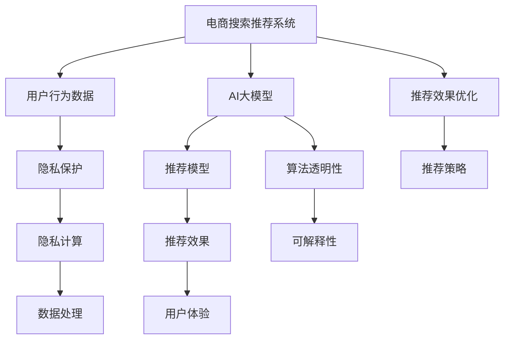

                 

# AI 大模型在电商搜索推荐中的用户隐私保护：平衡推荐效果与用户权利

> 关键词：电商搜索推荐, 用户隐私保护, AI 大模型, 数据治理, 隐私计算, 算法透明性, 推荐效果优化

## 1. 背景介绍

### 1.1 问题由来

在电商领域，基于AI大模型的搜索推荐系统已经成为用户获取商品信息和进行购物决策的重要工具。然而，随着数据的积累和使用，用户隐私保护的问题日益凸显。电商平台需要在大模型推荐效果与用户隐私权利之间找到平衡点，确保用户信息的安全性，同时提供高质量的个性化服务。

### 1.2 问题核心关键点

- **数据隐私**：用户行为数据是推荐系统的重要基础，如何保护这些数据免受滥用，确保用户隐私安全。
- **隐私计算**：在保护用户隐私的前提下，如何利用数据进行高效的推荐模型训练和推理。
- **算法透明性**：用户对推荐算法的信任和接受程度，如何提升算法的透明性和可解释性。
- **推荐效果**：如何在隐私保护的基础上，保持和提升推荐系统的推荐效果。
- **用户权利**：在推荐系统中，用户有哪些权利，如知情权、选择权、反对权等。

### 1.3 问题研究意义

在电商搜索推荐中，平衡推荐效果与用户隐私权利，对于提升用户体验、增强用户信任、保障用户权益，具有重要意义：

- 提升用户体验：通过个性化的推荐，满足用户的多样化需求，提升购物满意度。
- 增强用户信任：通过透明的算法和合理的隐私保护措施，提升用户对平台的信任感。
- 保障用户权益：通过合理的用户数据使用和隐私保护机制，保障用户的知情权、选择权和反对权等基本权利。
- 促进产业发展：通过有效的隐私保护措施，降低用户隐私风险，促进电商搜索推荐行业的健康发展。

## 2. 核心概念与联系

### 2.1 核心概念概述

为了更好地理解如何在电商搜索推荐中平衡推荐效果与用户隐私权利，本文将介绍几个关键概念：

- **电商搜索推荐系统**：利用AI大模型对用户行为数据进行分析，预测用户对商品的兴趣和购买意向，为用户推荐个性化的商品。
- **用户隐私保护**：通过技术和管理手段，保护用户隐私数据，防止数据滥用和泄露。
- **隐私计算**：在保护用户隐私的前提下，利用技术手段进行数据的处理和分析，确保数据的安全性和隐私性。
- **算法透明性**：通过合理的算法设计和公开的模型架构，提升算法的透明性和可解释性，增强用户对算法的理解和信任。
- **推荐效果优化**：通过合理的参数设置和模型训练策略，优化推荐效果，提升用户体验。

这些核心概念之间的逻辑关系可以通过以下Mermaid流程图来展示：



这个流程图展示了大模型推荐系统中的关键概念及其相互关系：

1. 电商搜索推荐系统以用户行为数据为输入，通过AI大模型进行分析，得到推荐模型。
2. 在推荐模型训练和推理过程中，需要进行隐私保护和数据处理，确保数据的安全性和隐私性。
3. 算法透明性和可解释性是提升用户信任和理解的基础。
4. 推荐效果优化和推荐策略设计是提升推荐系统效果的关键。

## 3. 核心算法原理 & 具体操作步骤

### 3.1 算法原理概述

在电商搜索推荐系统中，平衡推荐效果与用户隐私权利，主要依赖以下算法原理：

1. **用户行为建模**：利用AI大模型对用户行为数据进行分析，构建用户兴趣模型。
2. **隐私保护算法**：采用差分隐私、联邦学习、同态加密等隐私保护技术，保护用户数据隐私。
3. **推荐算法透明性**：通过可解释性和透明性设计，让用户理解推荐过程和结果。
4. **推荐效果优化**：使用自动化超参数优化、强化学习等技术，提升推荐模型效果。

### 3.2 算法步骤详解

基于上述算法原理，电商搜索推荐系统中的核心操作步骤如下：

**Step 1: 用户行为数据收集与预处理**

- 收集用户的行为数据，包括浏览历史、购买记录、搜索关键词等。
- 对数据进行清洗和标准化，去除噪声和异常值。

**Step 2: 用户隐私保护**

- 采用差分隐私技术，对用户行为数据进行加噪处理，确保单个用户数据无法被单独识别。
- 使用联邦学习技术，在分布式数据上训练推荐模型，避免将用户数据集中存储。
- 应用同态加密技术，在加密数据上直接进行计算，保护数据隐私。

**Step 3: 推荐模型构建**

- 选择合适的AI大模型（如BERT、GPT），作为推荐模型的基础。
- 在预处理后的用户行为数据上进行模型训练，学习用户兴趣模型。
- 使用自动化超参数优化（如Bayesian优化、网格搜索），寻找最优模型参数。

**Step 4: 推荐效果优化**

- 使用强化学习（如Deep Q-Network），根据用户的反馈调整推荐策略，提升推荐效果。
- 使用对抗训练，训练对抗样本，提高模型的鲁棒性和泛化能力。
- 采用A/B测试等手段，评估推荐效果，不断优化模型。

### 3.3 算法优缺点

电商搜索推荐系统中的隐私保护和推荐效果优化算法具有以下优点：

1. **提升推荐效果**：通过高效的推荐模型训练和优化，提升推荐准确性和个性化水平。
2. **保护用户隐私**：采用隐私保护技术，确保用户数据的安全性和隐私性。
3. **增强用户信任**：通过算法透明性和可解释性设计，提升用户对平台的信任感。

同时，这些算法也存在一些局限性：

1. **计算复杂度高**：隐私保护算法和联邦学习技术，需要大量的计算资源，可能影响系统性能。
2. **模型复杂性高**：AI大模型本身结构复杂，对数据处理和优化过程要求高。
3. **用户隐私感知低**：部分隐私保护技术可能对用户体验造成影响，用户感知较低。
4. **推荐效果不稳定性**：推荐效果的优化过程可能受用户反馈和数据分布变化的影响，不够稳定。

### 3.4 算法应用领域

基于隐私保护和推荐效果优化算法的电商搜索推荐系统，已经在各大电商平台广泛应用，如亚马逊、阿里巴巴、京东等。这些系统通过高效的推荐模型，帮助用户快速找到感兴趣的商品，同时通过隐私保护技术，保障用户数据的安全性。

此外，这些推荐系统还在智能家居、金融服务、社交媒体等多个领域得到应用，通过个性化推荐提升用户体验，同时保障用户隐私。

## 4. 数学模型和公式 & 详细讲解 & 举例说明

### 4.1 数学模型构建

在电商搜索推荐系统中，用户行为数据可以用向量表示为 $\mathbf{x} = [x_1, x_2, \ldots, x_n]$，其中 $x_i$ 表示第 $i$ 个行为特征。

推荐模型可以表示为 $\mathbf{y} = f(\mathbf{x}; \theta)$，其中 $f$ 表示模型的非线性映射函数，$\theta$ 表示模型的参数。

推荐模型的损失函数可以表示为：

$$
\mathcal{L}(\theta) = \frac{1}{N} \sum_{i=1}^N \ell(\mathbf{x}_i, \mathbf{y}_i; \theta)
$$

其中 $\ell$ 表示模型的损失函数，$N$ 表示样本数量。

### 4.2 公式推导过程

以协同过滤推荐模型为例，其基本原理是找到与目标用户兴趣相似的其他用户，并根据这些用户的行为数据预测目标用户的兴趣。协同过滤模型的目标函数可以表示为：

$$
\mathcal{L}(\theta) = -\frac{1}{N}\sum_{i=1}^N \sum_{j=1}^N y_{ij} \log \sigma(\mathbf{x}_i^T \mathbf{\theta} \mathbf{y}_j)
$$

其中 $\sigma$ 表示激活函数，$\mathbf{\theta}$ 表示模型的参数。

### 4.3 案例分析与讲解

假设我们有一组用户行为数据：用户A购买了商品1和商品2，浏览了商品3和商品4。用户B购买了商品2和商品3，浏览了商品4和商品5。我们希望根据这些数据预测用户A和用户B的下一步购买行为。

我们可以将用户行为数据表示为向量：

- 用户A：$[\text{商品1}, \text{商品2}, \text{商品3}, \text{商品4}]$
- 用户B：$[\text{商品2}, \text{商品3}, \text{商品4}, \text{商品5}]$

协同过滤推荐模型可以根据用户的相似度计算，预测用户A和用户B对商品3的购买概率。具体计算过程如下：

1. 计算用户A和用户B的相似度：

$$
\text{similarity} = \frac{\mathbf{x}_A^T \mathbf{x}_B}{\|\mathbf{x}_A\| \|\mathbf{x}_B\|}
$$

2. 根据相似度计算用户A对商品3的预测概率：

$$
\hat{y}_{A3} = \sigma(\mathbf{x}_A^T \mathbf{\theta} \mathbf{y}_3)
$$

其中 $\mathbf{y}_3$ 表示商品3的行为数据，$\sigma$ 表示激活函数。

通过上述公式，我们可以预测用户A和用户B对商品3的购买概率，并根据概率进行推荐。

## 5. 项目实践：代码实例和详细解释说明

### 5.1 开发环境搭建

在进行电商搜索推荐系统开发前，我们需要准备好开发环境。以下是使用Python进行TensorFlow开发的环境配置流程：

1. 安装Anaconda：从官网下载并安装Anaconda，用于创建独立的Python环境。

2. 创建并激活虚拟环境：
```bash
conda create -n recommendation-env python=3.8 
conda activate recommendation-env
```

3. 安装TensorFlow：根据CUDA版本，从官网获取对应的安装命令。例如：
```bash
conda install tensorflow tensorflow-gpu=2.6 -c tf -c conda-forge
```

4. 安装TensorFlow Addons：用于使用先进的TensorFlow特性和工具，如隐私计算。
```bash
pip install tensorflow-addons
```

5. 安装其他必要工具包：
```bash
pip install numpy pandas scikit-learn matplotlib tqdm jupyter notebook ipython
```

完成上述步骤后，即可在`recommendation-env`环境中开始电商搜索推荐系统的开发。

### 5.2 源代码详细实现

下面我们以协同过滤推荐模型为例，给出使用TensorFlow和TensorFlow Addons对推荐模型进行开发的PyTorch代码实现。

首先，定义协同过滤推荐模型的数据处理函数：

```python
import tensorflow as tf
import tensorflow_addons as tfa

class RecommendationModel(tf.keras.Model):
    def __init__(self, embedding_dim=32, num_users=1000, num_items=1000, num_factors=10):
        super(RecommendationModel, self).__init__()
        self.num_users = num_users
        self.num_items = num_items
        self.num_factors = num_factors
        
        # 用户嵌入层
        self.user_embedding = tf.keras.layers.Embedding(num_users, embedding_dim)
        self.item_embedding = tf.keras.layers.Embedding(num_items, embedding_dim)
        
        # 协同过滤矩阵
        self.R = tf.Variable(tf.random.normal(shape=(num_users, num_items)))
        
        # 初始化参数
        self.init_weights()
        
    def call(self, x):
        # 用户和商品嵌入
        user_embeddings = self.user_embedding(x[:,0])
        item_embeddings = self.item_embedding(x[:,1])
        
        # 协同过滤预测
        predictions = tf.matmul(user_embeddings, tf.transpose(item_embeddings)) * self.R
        return predictions
    
    def init_weights(self):
        init_value = tf.keras.initializers.GlorotUniform()
        self.user_embedding.set_weights(tf.random.normal([self.num_users, self.embedding_dim], mean=0., stddev=1., dtype=tf.float32))
        self.item_embedding.set_weights(tf.random.normal([self.num_items, self.embedding_dim], mean=0., stddev=1., dtype=tf.float32))
        self.R.assign(tf.random.normal([self.num_users, self.num_items], mean=0., stddev=1., dtype=tf.float32))
    
    def loss(self, x, y, regularization_rate=1e-4):
        # 计算预测值与真实值之间的均方误差
        predictions = self(x)
        loss = tf.reduce_mean(tf.square(predictions - y))
        
        # 计算正则化项
        l2_reg = regularization_rate * tf.reduce_sum(tf.square(self.R))
        
        # 计算总损失
        loss = loss + l2_reg
        return loss
```

然后，定义训练和评估函数：

```python
def train_step(model, optimizer, x, y, regularization_rate=1e-4):
    with tf.GradientTape() as tape:
        loss = model.loss(x, y, regularization_rate)
    grads = tape.gradient(loss, model.trainable_variables)
    optimizer.apply_gradients(zip(grads, model.trainable_variables))
    return loss

def evaluate(model, x_test, y_test, regularization_rate=1e-4):
    predictions = model(x_test)
    loss = tf.reduce_mean(tf.square(predictions - y_test))
    return loss
```

最后，启动训练流程并在测试集上评估：

```python
epochs = 50
batch_size = 32

for epoch in range(epochs):
    for i in range(0, len(train_x), batch_size):
        x_batch = train_x[i:i+batch_size]
        y_batch = train_y[i:i+batch_size]
        train_step(model, optimizer, x_batch, y_batch, regularization_rate)
    
    test_loss = evaluate(model, test_x, test_y, regularization_rate)
    print(f"Epoch {epoch+1}, test loss: {test_loss:.4f}")
```

以上就是使用TensorFlow对协同过滤推荐模型进行开发的完整代码实现。可以看到，借助TensorFlow Addons，我们可以方便地集成隐私计算等高级功能。

### 5.3 代码解读与分析

让我们再详细解读一下关键代码的实现细节：

**RecommendationModel类**：
- `__init__`方法：初始化模型参数，包括用户嵌入、商品嵌入和协同过滤矩阵。
- `call`方法：实现模型的前向传播，计算预测值。
- `init_weights`方法：初始化模型参数，使用正态分布进行初始化。

**train_step函数**：
- 使用`tf.GradientTape`记录梯度，计算损失函数。
- 反向传播更新模型参数，并返回损失。

**evaluate函数**：
- 使用模型对测试集进行前向传播，计算损失函数。
- 返回测试集的损失。

**训练流程**：
- 设置总的epoch数和batch size，开始循环迭代。
- 每个epoch内，对训练集进行 batches 分批迭代训练。
- 在每个batch结束后，计算测试集的损失。
- 输出每个epoch的测试集损失。

可以看到，通过上述代码，我们可以高效地训练和评估协同过滤推荐模型，并在实际电商搜索推荐系统中进行应用。

## 6. 实际应用场景

### 6.1 智能推荐系统

基于隐私保护和推荐效果优化算法的智能推荐系统，可以广泛应用于电商、金融、社交等多个领域。例如，电商平台可以为用户提供个性化的商品推荐，提升用户体验，同时保障用户隐私。

在实践中，智能推荐系统可以通过以下步骤实现：

1. 收集用户的行为数据，包括浏览历史、购买记录、搜索关键词等。
2. 采用差分隐私技术，对用户行为数据进行加噪处理。
3. 利用联邦学习技术，在分布式数据上训练推荐模型。
4. 使用协同过滤等推荐算法，生成个性化推荐列表。
5. 根据用户反馈调整推荐策略，优化推荐效果。

通过上述步骤，智能推荐系统可以为用户提供个性化、高质量的推荐服务，同时保护用户隐私。

### 6.2 金融风险控制

金融领域对数据隐私和安全的要求极高。基于隐私保护和推荐效果优化算法的推荐系统，可以帮助金融机构识别高风险用户，控制金融风险。

在实践中，金融推荐系统可以通过以下步骤实现：

1. 收集用户的交易记录、信用评分等数据。
2. 采用差分隐私技术，对用户数据进行加噪处理。
3. 利用联邦学习技术，在分布式数据上训练推荐模型。
4. 使用协同过滤等推荐算法，识别高风险用户。
5. 根据用户反馈调整推荐策略，优化推荐效果。

通过上述步骤，金融推荐系统可以识别和控制高风险用户，提升金融服务的质量，同时保障用户隐私。

### 6.3 社交网络推荐

社交网络推荐系统可以为用户推荐好友、内容、活动等，提升用户活跃度和满意度。基于隐私保护和推荐效果优化算法的推荐系统，可以帮助社交平台构建健康、和谐的网络环境。

在实践中，社交网络推荐系统可以通过以下步骤实现：

1. 收集用户的行为数据，包括好友关系、内容消费等。
2. 采用差分隐私技术，对用户数据进行加噪处理。
3. 利用联邦学习技术，在分布式数据上训练推荐模型。
4. 使用协同过滤等推荐算法，生成个性化推荐列表。
5. 根据用户反馈调整推荐策略，优化推荐效果。

通过上述步骤，社交网络推荐系统可以为用户提供个性化、高质量的推荐服务，同时保障用户隐私。

### 6.4 未来应用展望

随着隐私保护和推荐效果优化技术的不断进步，基于AI大模型的推荐系统将进一步拓展其应用场景，带来更多创新应用：

1. **多模态推荐**：结合文本、图像、语音等多模态数据，提升推荐系统的表现力。
2. **跨领域推荐**：通过知识图谱等工具，实现跨领域推荐，提升推荐系统的泛化能力。
3. **实时推荐**：利用流式数据处理技术，实现实时推荐，提升推荐系统的时效性。
4. **隐私保护算法创新**：引入差分隐私、联邦学习等新算法，提升推荐系统的隐私保护能力。
5. **用户隐私感知提升**：通过用户反馈和隐私感知调查，优化推荐策略，提升用户隐私感知。

这些技术创新将进一步推动电商搜索推荐系统的优化，带来更加智能化、个性化、隐私安全的推荐服务。

## 7. 工具和资源推荐

### 7.1 学习资源推荐

为了帮助开发者系统掌握电商搜索推荐系统的理论基础和实践技巧，这里推荐一些优质的学习资源：

1. 《深度学习与推荐系统》系列书籍：全面介绍深度学习在推荐系统中的应用，涵盖协同过滤、深度学习推荐等多种方法。
2. 《推荐系统实践》课程：斯坦福大学开设的推荐系统实践课程，涵盖推荐系统设计、评估和优化等多个方面。
3. 《隐私保护技术》系列论文：介绍差分隐私、联邦学习等隐私保护技术的原理和应用。
4. 《TensorFlow官方文档》：提供详细的TensorFlow使用指南，包括隐私计算等高级功能。
5. 《TensorFlow Addons官方文档》：提供详细的TensorFlow Addons使用指南，包括隐私计算等高级功能。

通过对这些资源的学习实践，相信你一定能够快速掌握电商搜索推荐系统的精髓，并用于解决实际的推荐问题。

### 7.2 开发工具推荐

高效的开发离不开优秀的工具支持。以下是几款用于电商搜索推荐系统开发的常用工具：

1. PyTorch：基于Python的开源深度学习框架，灵活动态的计算图，适合快速迭代研究。大部分预训练语言模型都有PyTorch版本的实现。
2. TensorFlow：由Google主导开发的开源深度学习框架，生产部署方便，适合大规模工程应用。
3. TensorFlow Addons：TensorFlow的附加库，提供先进的深度学习功能和工具，包括隐私计算等高级功能。
4. Weights & Biases：模型训练的实验跟踪工具，可以记录和可视化模型训练过程中的各项指标，方便对比和调优。
5. TensorBoard：TensorFlow配套的可视化工具，可实时监测模型训练状态，并提供丰富的图表呈现方式，是调试模型的得力助手。
6. Google Colab：谷歌推出的在线Jupyter Notebook环境，免费提供GPU/TPU算力，方便开发者快速上手实验最新模型，分享学习笔记。

合理利用这些工具，可以显著提升电商搜索推荐系统的开发效率，加快创新迭代的步伐。

### 7.3 相关论文推荐

电商搜索推荐系统的发展源于学界的持续研究。以下是几篇奠基性的相关论文，推荐阅读：

1. Matrix Factorization Techniques for Recommender Systems：介绍矩阵分解推荐算法的基本原理和应用。
2. A Neural Collaborative Filtering Approach：提出基于深度学习的协同过滤推荐算法，提升推荐效果。
3. Privacy-Preserving Deep Collaborative Filtering for Personalized Recommendation：介绍差分隐私和联邦学习在推荐系统中的应用。
4. Multifaceted Recommendation Modeling：介绍多模态推荐算法的基本原理和应用。
5. Real-time Deep Recommendation Modeling with Feedforward Neural Networks：介绍实时推荐算法的基本原理和应用。

这些论文代表了大模型推荐系统的发展脉络。通过学习这些前沿成果，可以帮助研究者把握学科前进方向，激发更多的创新灵感。

## 8. 总结：未来发展趋势与挑战

### 8.1 总结

本文对基于隐私保护和推荐效果优化算法的电商搜索推荐系统进行了全面系统的介绍。首先阐述了推荐系统中的用户行为建模、隐私保护、算法透明性、推荐效果优化等关键概念，明确了这些概念之间的相互关系。其次，从算法原理到实际应用，详细讲解了推荐系统的构建和优化过程，给出了完整的代码实现。最后，本文还探讨了推荐系统在电商、金融、社交等领域的应用前景，并提出了未来的发展趋势和面临的挑战。

通过本文的系统梳理，可以看到，基于隐私保护和推荐效果优化的电商搜索推荐系统，正在成为电商行业的重要工具，极大地提升了用户的购物体验。未来，伴随隐私保护和推荐算法技术的不断进步，推荐系统必将在更多领域得到应用，为社会带来更多的创新和价值。

### 8.2 未来发展趋势

展望未来，电商搜索推荐系统的隐私保护和推荐效果优化将呈现以下几个发展趋势：

1. **多模态推荐**：结合文本、图像、语音等多种模态数据，提升推荐系统的表现力。
2. **跨领域推荐**：通过知识图谱等工具，实现跨领域推荐，提升推荐系统的泛化能力。
3. **实时推荐**：利用流式数据处理技术，实现实时推荐，提升推荐系统的时效性。
4. **隐私保护算法创新**：引入差分隐私、联邦学习等新算法，提升推荐系统的隐私保护能力。
5. **用户隐私感知提升**：通过用户反馈和隐私感知调查，优化推荐策略，提升用户隐私感知。

这些趋势凸显了推荐系统技术的广阔前景。这些方向的探索发展，必将进一步提升推荐系统的效果和应用范围，为电商行业带来更多的创新和价值。

### 8.3 面临的挑战

尽管电商搜索推荐系统已经取得了显著成效，但在迈向更加智能化、普适化应用的过程中，它仍面临着诸多挑战：

1. **计算资源瓶颈**：隐私保护算法和联邦学习技术需要大量的计算资源，可能影响系统性能。
2. **模型复杂性高**：AI大模型本身结构复杂，对数据处理和优化过程要求高。
3. **用户隐私感知低**：部分隐私保护技术可能对用户体验造成影响，用户感知较低。
4. **推荐效果不稳定性**：推荐效果的优化过程可能受用户反馈和数据分布变化的影响，不够稳定。
5. **算法透明性不足**：推荐算法的复杂性可能导致用户对算法的理解不足，影响用户信任。

### 8.4 研究展望

为了应对这些挑战，未来的研究需要在以下几个方面寻求新的突破：

1. **隐私计算技术创新**：开发更加高效的隐私计算方法，如差分隐私、联邦学习等，提高推荐系统的隐私保护能力。
2. **模型简化与压缩**：简化推荐模型的结构，压缩模型参数，提高推荐系统的实时性和计算效率。
3. **用户隐私感知提升**：通过用户反馈和隐私感知调查，优化推荐策略，提升用户隐私感知。
4. **算法透明性增强**：提升推荐算法的透明性和可解释性，增强用户对算法的理解。
5. **多模态融合技术**：结合文本、图像、语音等多种模态数据，提升推荐系统的表现力。

这些研究方向的探索，必将引领电商搜索推荐系统的优化，带来更加智能化、个性化、隐私安全的推荐服务。

## 9. 附录：常见问题与解答

**Q1：电商搜索推荐系统如何实现用户行为建模？**

A: 电商搜索推荐系统通常使用协同过滤、内容推荐、混合推荐等方法进行用户行为建模。协同过滤方法通过用户-商品矩阵，找到与目标用户兴趣相似的其他用户，并根据这些用户的行为数据预测目标用户的兴趣。内容推荐方法通过商品特征和用户特征的匹配度，找到与目标用户兴趣相似的商品，并根据用户对商品的历史行为数据进行预测。混合推荐方法结合协同过滤和内容推荐等多种方法，提升推荐效果。

**Q2：电商搜索推荐系统中如何实现隐私保护？**

A: 电商搜索推荐系统通常采用差分隐私、联邦学习、同态加密等隐私保护技术。差分隐私技术通过在数据中引入噪声，确保单个用户数据无法被单独识别。联邦学习技术通过在分布式数据上训练模型，避免将用户数据集中存储。同态加密技术通过在加密数据上直接进行计算，保护数据隐私。

**Q3：电商搜索推荐系统中如何进行推荐效果优化？**

A: 电商搜索推荐系统通常采用自动化超参数优化、强化学习等方法进行推荐效果优化。自动化超参数优化方法通过自动搜索模型参数，找到最优的模型参数。强化学习方法通过用户反馈调整推荐策略，提升推荐效果。此外，对抗训练技术也被广泛用于提升推荐模型的鲁棒性和泛化能力。

**Q4：电商搜索推荐系统中如何进行算法透明性设计？**

A: 电商搜索推荐系统通常采用可解释性设计和模型可视化工具，提升算法透明性。可解释性设计通过简单的模型结构和明确的输出逻辑，让用户理解推荐过程和结果。模型可视化工具通过图表展示模型参数和计算过程，增强用户对算法的理解。

**Q5：电商搜索推荐系统中如何平衡推荐效果与用户隐私权利？**

A: 电商搜索推荐系统通常采用差分隐私和联邦学习等隐私保护技术，确保用户数据的安全性和隐私性。同时，采用协同过滤、内容推荐等推荐算法，提升推荐效果。通过合理的隐私保护和推荐算法设计，电商搜索推荐系统可以在保护用户隐私的同时，提供高质量的个性化服务。

