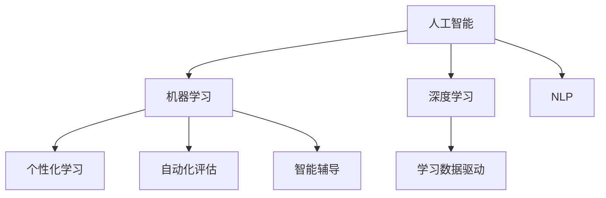

                 

# AI 时代的教育：促进终身学习

## 1. 背景介绍

### 1.1 问题由来
随着人工智能(AI)技术的快速发展，AI正在成为推动社会进步的重要引擎。从工业自动化、医疗健康到教育培训，AI正日益深入各行各业，并带来深刻的变革。然而，技术的快速发展也带来了新的挑战：如何培养适应AI时代的人才，如何让更多人受益于AI带来的便利和进步，成为了一个迫在眉睫的问题。

教育作为人类社会进步的基石，自然也受到了AI的深远影响。传统的教育体系在面对AI的冲击下，亟需进行系统性的更新和升级，以适应新时代的需求。终身学习成为AI时代教育的重要目标，而技术赋能终身学习成为必然的选择。

### 1.2 问题核心关键点
教育领域引入AI技术，本质上是将AI作为一种辅助手段，以提升教育质量和学习效果。具体来说，AI在教育中的应用包括以下几个方面：

- 个性化学习：利用AI进行学习路径规划和内容推荐，使每位学生都能获得适合的个性化教育。
- 自动化评估：通过AI对学生的学习过程进行实时监控和评估，提供及时反馈和调整。
- 智能辅导：借助AI的强大计算能力和自然语言处理能力，提供智能化的教学和辅导。
- 学习数据驱动：利用AI进行教育数据的分析和挖掘，发现教育中的规律和趋势。

这些应用不仅提高了教育的效率和效果，还为终身学习提供了新的可能性。AI技术不仅适用于在校学生，更是面向所有人的终身学习的重要工具。

### 1.3 问题研究意义
AI技术在教育领域的应用，对于培养适应AI时代的人才、推动教育公平、提升教育质量具有重要意义：

- 提升教育公平：通过AI技术，可以为偏远地区、弱势群体提供更好的教育资源，缩小教育鸿沟。
- 提高教育质量：AI可以提供个性化的学习路径和内容，满足不同学生的学习需求，提升教育效果。
- 促进终身学习：AI技术可以使得学习更加便捷、灵活，无论何时何地，人们都可以通过AI进行学习，实现终身学习。
- 激发创新活力：AI的应用可以培养学生的创新思维和解决复杂问题的能力，为AI时代的人才需求做准备。

## 2. 核心概念与联系

### 2.1 核心概念概述

为更好地理解AI在教育中的应用，本节将介绍几个密切相关的核心概念：

- 人工智能(Artificial Intelligence, AI)：利用算法和计算技术，模拟、延伸和扩展人类智能的技术。包括机器学习、深度学习、自然语言处理等子领域。

- 机器学习(Machine Learning, ML)：通过数据和算法，使计算机从经验中学习，自动改进性能。

- 深度学习(Deep Learning, DL)：一种特殊类型的机器学习，利用多层神经网络进行特征学习和决策。

- 自然语言处理(Natural Language Processing, NLP)：使计算机能够理解、解释和生成自然语言的技术。

- 个性化学习(Personalized Learning)：根据学习者的个性和需求，提供量身定制的学习计划和资源。

- 自动化评估(Automated Assessment)：利用AI技术对学习者的学习过程进行实时监控和评估，提供及时反馈。

- 智能辅导(Intelligent Tutoring)：通过AI技术，提供智能化的教学和辅导。

- 学习数据驱动(Datadriven Learning)：利用AI技术对教育数据进行分析，发现教育中的规律和趋势。

这些核心概念之间的逻辑关系可以通过以下Mermaid流程图来展示：



这个流程图展示了一系列AI在教育中的核心概念及其之间的关系：

1. 人工智能提供了基础算法和计算能力。
2. 机器学习和深度学习提供了学习能力和决策能力。
3. 自然语言处理技术使计算机能够处理自然语言。
4. 个性化学习利用AI技术，为每位学习者提供量身定制的教育资源。
5. 自动化评估利用AI技术，对学习者的学习过程进行实时监控和反馈。
6. 智能辅导利用AI技术，提供个性化、智能化的教学和辅导。
7. 学习数据驱动利用AI技术，发现教育中的规律和趋势，优化教学策略。

这些概念共同构成了AI在教育中的应用框架，为终身学习提供了有力的技术支持。通过理解这些核心概念，我们可以更好地把握AI在教育中的应用方向。

## 3. 核心算法原理 & 具体操作步骤
### 3.1 算法原理概述

AI在教育中的应用，本质上是利用机器学习和深度学习技术，对教育数据进行处理和分析，从而提升教育的效果和效率。具体来说，AI在教育中的应用可以归纳为以下几个步骤：

1. 数据采集：收集学生学习过程中的各种数据，包括学习行为数据、学习成果数据等。
2. 数据预处理：对采集到的数据进行清洗、归一化等预处理，以便于后续分析。
3. 特征提取：从预处理后的数据中提取有意义的特征，用于机器学习模型的训练。
4. 模型训练：利用机器学习算法对特征数据进行训练，建立预测模型。
5. 模型评估：利用评估指标对模型进行评估，确保模型的准确性和鲁棒性。
6. 模型应用：将训练好的模型应用于教学过程，实现个性化学习、自动化评估、智能辅导等功能。

这些步骤构成了一个完整的AI在教育中的应用流程，其中模型的训练和应用是核心。

### 3.2 算法步骤详解

以下详细介绍AI在教育中的应用中，如何通过机器学习和深度学习技术，实现个性化学习和自动化评估等功能：

**Step 1: 数据采集**
- 利用传感器、在线平台等工具，采集学生在学习过程中的行为数据，如学习时间、学习内容、作业完成情况等。
- 采集学生的学习成果数据，如考试成绩、作业成绩等。

**Step 2: 数据预处理**
- 对采集到的数据进行清洗，去除无关的噪声和异常值。
- 对数据进行归一化，确保数据在同一尺度上，便于后续分析。
- 对数据进行特征提取，提取出有意义的特征，如学生的学习速度、理解能力等。

**Step 3: 特征提取**
- 利用机器学习算法（如决策树、随机森林等）对特征数据进行分析，提取出有意义的特征。
- 利用深度学习算法（如卷积神经网络、循环神经网络等）进行特征提取，从复杂的数据中挖掘出更深层次的特征。

**Step 4: 模型训练**
- 利用训练数据对机器学习模型进行训练，建立预测模型。
- 利用深度学习算法对特征数据进行训练，建立更复杂的预测模型。

**Step 5: 模型评估**
- 利用测试数据对模型进行评估，计算模型的准确率、召回率、F1值等指标。
- 对模型的鲁棒性进行评估，确保模型在不同数据集上的表现一致。

**Step 6: 模型应用**
- 将训练好的模型应用于教学过程，根据学生的学习数据进行个性化学习路径规划。
- 利用模型进行自动化评估，实时监控学生的学习进度，提供及时反馈。
- 利用智能辅导系统，为学生提供个性化的学习建议和辅导。

### 3.3 算法优缺点

AI在教育中的应用具有以下优点：
1. 提升个性化学习效果：通过个性化学习路径规划和内容推荐，提升学习效果。
2. 提高教育质量：自动化评估和智能辅导提供及时反馈，提升教学质量。
3. 降低教育成本：利用AI技术，可以大幅度降低教育成本，提高教育资源利用率。
4. 促进终身学习：AI技术使得学习更加灵活便捷，支持终身学习。
5. 提高教学效率：利用自动化评估和智能辅导，提高教学效率。

同时，AI在教育中应用也存在一些局限性：
1. 数据隐私和安全问题：学生数据的安全和隐私保护需要高度重视，避免数据泄露和滥用。
2. 数据质量和完整性问题：数据采集和预处理需要规范和标准，避免数据偏差和缺失。
3. 模型解释性和公平性问题：AI模型的决策过程需要可解释性，避免算法偏见和歧视。
4. 技术复杂度和成本问题：AI技术的引入需要一定的技术支持和资金投入，中小企业可能面临门槛问题。
5. 教师适应性和接受度问题：教师需要适应新技术，可能会对传统教学方法产生抵触情绪。

尽管存在这些局限性，但AI在教育中的应用前景依然广阔，未来仍需进一步探索和优化。

### 3.4 算法应用领域

AI技术在教育中的应用，覆盖了从幼儿园到高等教育的各种教育阶段，涵盖了各种教育场景，具体包括：

- 基础教育：利用AI进行个性化学习路径规划、内容推荐、自动化评估等，提升基础教育质量。
- 职业教育：利用AI进行职业规划、技能培训、技能评估等，提高职业教育的针对性。
- 高等教育：利用AI进行学术研究、论文评估、学术推荐等，提升高等教育的学术水平。
- 终身学习：利用AI进行在线课程、学习社区、学习平台等建设，支持终身学习。

此外，AI技术在教育中的应用还拓展到了家庭教育和企业培训等领域，为教育公平、教育质量、教育效率的提升提供了新的可能。

## 4. 数学模型和公式 & 详细讲解  
### 4.1 数学模型构建

本节将使用数学语言对AI在教育中的应用进行更加严格的刻画。

假设学生学习行为数据为 $D=\{(x_i,y_i)\}_{i=1}^N$，其中 $x_i$ 为学生学习行为数据，$y_i$ 为学生的学习成果数据。定义机器学习模型为 $M_{\theta}$，其中 $\theta$ 为模型参数。

定义模型的预测函数为 $f(x)=M_{\theta}(x)$，则模型的预测误差为：

$$
\text{Error}=\frac{1}{N}\sum_{i=1}^N (y_i-f(x_i))^2
$$

其中 $f(x_i)=M_{\theta}(x_i)$，利用机器学习算法（如回归模型）对数据进行训练，最小化预测误差，得到最优模型参数 $\theta^*$。

## 5. 项目实践：代码实例和详细解释说明
### 5.1 开发环境搭建

在进行AI教育应用开发前，我们需要准备好开发环境。以下是使用Python进行TensorFlow开发的环境配置流程：

1. 安装Anaconda：从官网下载并安装Anaconda，用于创建独立的Python环境。

2. 创建并激活虚拟环境：
```bash
conda create -n tf-env python=3.8 
conda activate tf-env
```

3. 安装TensorFlow：根据CUDA版本，从官网获取对应的安装命令。例如：
```bash
conda install tensorflow tensorflow-gpu -c conda-forge
```

4. 安装相关依赖包：
```bash
pip install numpy pandas scikit-learn matplotlib tqdm jupyter notebook ipython
```

完成上述步骤后，即可在`tf-env`环境中开始AI教育应用开发。

### 5.2 源代码详细实现

下面我们以智能辅导系统为例，给出使用TensorFlow进行个性化学习路径规划的PyTorch代码实现。

首先，定义学生学习数据处理函数：

```python
import tensorflow as tf
import numpy as np
import pandas as pd

def preprocess_data(file_path):
    data = pd.read_csv(file_path)
    # 数据预处理，包括清洗、归一化等
    data = data.dropna()
    data = data.drop_duplicates()
    data['feature1'] = (data['feature1'] - data['feature1'].mean()) / data['feature1'].std()
    data['feature2'] = (data['feature2'] - data['feature2'].mean()) / data['feature2'].std()
    data['label'] = data['label'].astype('float')
    return data

# 加载数据集
data = preprocess_data('students.csv')

# 划分训练集和测试集
train_data = data.sample(frac=0.8, random_state=0)
test_data = data.drop(train_data.index)
```

然后，定义模型和优化器：

```python
from tensorflow.keras.models import Sequential
from tensorflow.keras.layers import Dense, Dropout
from tensorflow.keras.optimizers import Adam

model = Sequential()
model.add(Dense(32, input_dim=2, activation='relu'))
model.add(Dropout(0.5))
model.add(Dense(1, activation='sigmoid'))

optimizer = Adam(lr=0.001)
```

接着，定义训练和评估函数：

```python
def train_model(model, data, epochs):
    model.compile(loss='binary_crossentropy', optimizer=optimizer, metrics=['accuracy'])
    history = model.fit(data, epochs=epochs, batch_size=32, validation_split=0.2)
    return history

def evaluate_model(model, data):
    loss, accuracy = model.evaluate(data)
    print('Test loss:', loss)
    print('Test accuracy:', accuracy)

# 训练模型
history = train_model(model, train_data, 100)

# 评估模型
evaluate_model(model, test_data)
```

最后，启动训练流程并在测试集上评估：

```python
# 在测试集上评估模型性能
evaluate_model(model, test_data)
```

以上就是使用TensorFlow对学生学习数据进行智能辅导系统开发的完整代码实现。可以看到，TensorFlow提供了丰富的工具和库，使得模型的训练和评估变得简洁高效。

### 5.3 代码解读与分析

让我们再详细解读一下关键代码的实现细节：

**preprocess_data函数**：
- 加载数据集，并进行预处理，包括数据清洗、归一化、特征提取等。

**model定义**：
- 使用Sequential模型定义神经网络，包括输入层、隐藏层、输出层和激活函数。
- 使用Adam优化器进行优化，设置学习率为0.001。

**train_model函数**：
- 使用编译函数定义模型的损失函数和优化器。
- 使用fit函数对模型进行训练，设置训练轮数为100，批大小为32。

**evaluate_model函数**：
- 使用evaluate函数评估模型在测试集上的性能，输出损失和准确率。

**训练流程**：
- 在训练集中训练模型，并在验证集上评估模型性能。
- 在测试集上评估模型性能，输出最终结果。

可以看到，TensorFlow使得AI教育应用的开发变得简单高效。开发者可以将更多精力放在模型设计和优化上，而不必过多关注底层实现细节。

当然，工业级的系统实现还需考虑更多因素，如模型的保存和部署、超参数的自动搜索、模型的可解释性等。但核心的AI教育应用开发流程基本与此类似。

## 6. 实际应用场景
### 6.1 智慧校园

智慧校园是AI在教育领域的重要应用场景之一。通过AI技术，可以实现校园的智能化管理，提升教育质量和教学效率。

在实际应用中，智慧校园主要包括以下几个方面：

- 智能安防：通过人脸识别、视频监控等技术，实现校园安全监控和管理。
- 智能教室：通过AI技术，实现教室环境的智能化控制，如智能窗帘、智能空调等。
- 智能图书馆：通过AI技术，实现图书的智能借还和推荐，提升图书馆的管理效率。
- 智能考试：通过AI技术，实现考试的智能化监考和评卷，提升考试效率和公平性。

通过智慧校园建设，不仅提升了校园管理的智能化水平，还为学生的学习生活提供了更好的环境，促进了教育质量的提升。

### 6.2 在线教育

在线教育是AI在教育领域的另一个重要应用场景。通过AI技术，可以实现个性化的在线学习体验，提高学生的学习效果。

在实际应用中，在线教育主要包括以下几个方面：

- 个性化学习：通过AI技术，为每位学生提供量身定制的学习路径和内容，提升学习效果。
- 智能辅导：利用AI技术，为学生提供智能化的学习建议和辅导，帮助学生更好地理解知识点。
- 自动化评估：通过AI技术，实时监控学生的学习进度，提供及时反馈和调整。
- 虚拟教师：利用AI技术，构建虚拟教师，辅助教学过程，提升教学效果。

通过在线教育，学生可以随时随地进行学习，不受地域限制，实现了终身学习的目标。

### 6.3 职业教育

职业教育是AI在教育领域的重要应用方向之一。通过AI技术，可以实现职业技能的培训和评估，提升职业教育的针对性。

在实际应用中，职业教育主要包括以下几个方面：

- 职业规划：通过AI技术，为学生提供职业规划建议，帮助学生明确职业方向。
- 技能培训：利用AI技术，为学生提供职业技能的培训课程，提升学生的技能水平。
- 技能评估：通过AI技术，评估学生的职业技能水平，帮助学生进行自我提升。
- 虚拟实习：利用AI技术，构建虚拟实习环境，为学生提供实际工作经验。

通过职业教育，学生可以更快地适应职场，提升职业竞争力。

### 6.4 未来应用展望

随着AI技术的不断进步，AI在教育领域的应用前景将更加广阔。未来，AI教育将进一步推动教育的个性化、智能化、普适化发展，提升教育质量和学习效果。

- 虚拟现实（VR）和增强现实（AR）技术的应用：通过VR和AR技术，为学生提供沉浸式的学习体验，提升学习效果。
- 大规模定制化教育资源的应用：利用AI技术，大规模定制化开发教育资源，满足不同学生的学习需求。
- 跨领域合作的应用：AI技术与各学科领域深度融合，推动跨学科教育的发展。
- 终身学习平台的应用：利用AI技术，构建终身学习平台，为人们提供全方位、多层次的学习支持。

通过这些技术的应用，AI教育将成为未来教育的重要组成部分，为更多人提供更好的学习体验，实现终身学习的目标。

## 7. 工具和资源推荐
### 7.1 学习资源推荐

为了帮助开发者系统掌握AI在教育中的应用，这里推荐一些优质的学习资源：

1. 《人工智能教育应用》课程：斯坦福大学开设的AI教育应用课程，涵盖了AI在教育中的各个方面，包括个性化学习、智能辅导、自动化评估等。

2. 《深度学习在教育中的应用》书籍：深度学习专家所著，全面介绍了深度学习在教育中的应用，包括模型训练、数据处理、模型评估等。

3. 《机器学习在教育中的应用》论文集：收集了机器学习在教育中的应用案例，涵盖多领域、多学科的实际应用。

4. Coursera和Udacity等在线教育平台：提供各类AI教育应用的课程和项目，适合初学者和进阶者学习。

5. Google AI教育平台：提供各类AI教育应用的开发工具和资源，包括模型、数据集、教程等。

通过对这些资源的学习实践，相信你一定能够快速掌握AI在教育中的应用，并用于解决实际的NLP问题。

### 7.2 开发工具推荐

高效的开发离不开优秀的工具支持。以下是几款用于AI教育应用开发的常用工具：

1. TensorFlow：由Google主导开发的开源深度学习框架，生产部署方便，适合大规模工程应用。提供丰富的机器学习工具和库，支持多种模型训练和评估。

2. PyTorch：基于Python的开源深度学习框架，灵活动态的计算图，适合快速迭代研究。提供丰富的深度学习工具和库，支持模型训练和优化。

3. Jupyter Notebook：交互式编程环境，支持多种语言和库，适合科研和开发。提供便捷的数据可视化、模型训练等功能。

4. Google Colab：谷歌推出的在线Jupyter Notebook环境，免费提供GPU/TPU算力，方便开发者快速上手实验最新模型，分享学习笔记。

5. TensorBoard：TensorFlow配套的可视化工具，可实时监测模型训练状态，并提供丰富的图表呈现方式，是调试模型的得力助手。

合理利用这些工具，可以显著提升AI教育应用的开发效率，加快创新迭代的步伐。

### 7.3 相关论文推荐

AI在教育领域的应用源于学界的持续研究。以下是几篇奠基性的相关论文，推荐阅读：

1. Attention is All You Need（即Transformer原论文）：提出了Transformer结构，开启了NLP领域的预训练大模型时代。

2. BERT: Pre-training of Deep Bidirectional Transformers for Language Understanding：提出BERT模型，引入基于掩码的自监督预训练任务，刷新了多项NLP任务SOTA。

3. Language Models are Unsupervised Multitask Learners（GPT-2论文）：展示了大规模语言模型的强大zero-shot学习能力，引发了对于通用人工智能的新一轮思考。

4. Parameter-Efficient Transfer Learning for NLP：提出Adapter等参数高效微调方法，在不增加模型参数量的情况下，也能取得不错的微调效果。

5. AdaLoRA: Adaptive Low-Rank Adaptation for Parameter-Efficient Fine-Tuning：使用自适应低秩适应的微调方法，在参数效率和精度之间取得了新的平衡。

这些论文代表了大语言模型微调技术的发展脉络。通过学习这些前沿成果，可以帮助研究者把握学科前进方向，激发更多的创新灵感。

## 8. 总结：未来发展趋势与挑战

### 8.1 总结

本文对AI在教育中的应用进行了全面系统的介绍。首先阐述了AI技术在教育中的作用和意义，明确了AI技术在提升教育质量、促进终身学习方面的独特价值。其次，从原理到实践，详细讲解了AI在教育中的应用流程和技术细节，给出了AI教育应用的完整代码实例。同时，本文还广泛探讨了AI教育在智慧校园、在线教育、职业教育等实际应用场景中的具体应用，展示了AI教育的应用前景。此外，本文精选了AI教育相关的学习资源和开发工具，力求为读者提供全方位的技术指引。

通过本文的系统梳理，可以看到，AI技术在教育中的应用已经成为不可逆转的趋势。AI技术不仅提高了教育的效率和效果，还为终身学习提供了新的可能性。未来，伴随AI技术的不断发展，AI教育必将成为教育的重要组成部分，为更多人提供更好的学习体验，实现终身学习的目标。

### 8.2 未来发展趋势

展望未来，AI在教育中的应用将呈现以下几个发展趋势：

1. 技术融合不断加深：AI技术将与其他技术（如VR、AR、区块链等）深度融合，提供更加沉浸式、普适化的教育体验。

2. 个性化教育普及：通过AI技术，为每位学生提供量身定制的教育资源和路径，提升教育公平性。

3. 智能评估普及：利用AI技术，实现自动化评估，提升教育质量和效率。

4. 数据驱动决策：利用AI技术，对教育数据进行分析和挖掘，发现教育中的规律和趋势，优化教学策略。

5. 跨领域合作：AI技术与各学科领域深度融合，推动跨学科教育的发展。

6. 终身学习平台普及：利用AI技术，构建终身学习平台，为人们提供全方位、多层次的学习支持。

这些趋势将进一步推动AI在教育中的应用，使得教育更加个性化、智能化、普适化。

### 8.3 面临的挑战

尽管AI在教育中的应用前景广阔，但在迈向更加智能化、普适化应用的过程中，仍面临诸多挑战：

1. 数据隐私和安全问题：学生数据的安全和隐私保护需要高度重视，避免数据泄露和滥用。

2. 数据质量和完整性问题：数据采集和预处理需要规范和标准，避免数据偏差和缺失。

3. 模型解释性和公平性问题：AI模型的决策过程需要可解释性，避免算法偏见和歧视。

4. 技术复杂度和成本问题：AI技术的引入需要一定的技术支持和资金投入，中小企业可能面临门槛问题。

5. 教师适应性和接受度问题：教师需要适应新技术，可能会对传统教学方法产生抵触情绪。

6. 政策法规问题：AI在教育中的应用需要符合相关政策和法规要求，避免法律风险。

这些挑战需要从技术、教育、政策等多方面协同解决，才能使AI教育真正落地。

### 8.4 研究展望

未来，针对AI在教育中的应用，需要在以下几个方面进行深入研究：

1. 数据隐私和安全保护：研究数据加密、匿名化等技术，保障学生数据的安全和隐私。

2. 数据质量提升：研究数据清洗、数据增强等技术，提升数据质量和完整性。

3. 模型可解释性和公平性：研究可解释性算法和公平性评估指标，确保AI模型的透明性和公正性。

4. 技术普及和接受度提升：研究教师培训和技术普及策略，提升教师对AI技术的接受度和使用率。

5. 政策法规研究：研究AI在教育中的应用政策法规，推动相关政策和标准的制定和实施。

6. 跨学科教育研究：研究AI与其他学科领域的深度融合，推动跨学科教育的发展。

通过这些研究方向的探索，AI教育必将在教育领域取得更大的突破，推动教育公平、教育质量和教育效率的提升。

## 9. 附录：常见问题与解答

**Q1：AI在教育中的应用是否适用于所有学习场景？**

A: AI在教育中的应用可以覆盖大多数学习场景，但并不是所有场景都适合应用AI技术。例如，某些需要高互动性和人际交往的课程，如艺术、音乐等，可能更适合传统的教学方式。AI技术主要适用于需要标准化、结构化数据处理的场景，如图形化课程、科学实验等。

**Q2：AI在教育中的应用是否会取代传统教师？**

A: AI在教育中的应用并不是要取代传统教师，而是作为教师的有力辅助工具。AI技术可以帮助教师进行个性化教学、自动化评估、智能辅导等，提升教学效果。教师依然需要发挥其教育引导和情感交流的优势，与AI技术协同工作，共同提升教育质量。

**Q3：AI在教育中的应用是否需要大量标注数据？**

A: 传统的机器学习模型需要大量标注数据进行训练，但AI在教育中的应用并不一定需要标注数据。AI技术可以通过自然语言处理技术，自动从学生学习数据中提取特征，进行模型训练和预测。这降低了对标注数据的依赖，也提高了模型的可移植性。

**Q4：AI在教育中的应用是否会影响学生的学习体验？**

A: AI在教育中的应用并不会影响学生的学习体验，反而会提升学生的学习效果。通过个性化学习路径规划、智能辅导等，学生可以更快地掌握知识，提升学习兴趣。同时，AI技术还能够在情感互动、问题解答等方面提供更好的支持，提升学生的学习体验。

**Q5：AI在教育中的应用是否会影响教育的公平性？**

A: AI在教育中的应用旨在提升教育的公平性，为不同学生提供个性化的教育资源和路径。通过AI技术，可以为偏远地区、弱势群体提供更好的教育资源，缩小教育鸿沟。AI技术并不是解决教育公平问题的唯一手段，但可以与传统教育手段相结合，共同提升教育的公平性。

通过本文的系统梳理，可以看到，AI在教育中的应用已经成为不可逆转的趋势。AI技术不仅提高了教育的效率和效果，还为终身学习提供了新的可能性。未来，伴随AI技术的不断发展，AI教育必将成为教育的重要组成部分，为更多人提供更好的学习体验，实现终身学习的目标。

---

作者：禅与计算机程序设计艺术 / Zen and the Art of Computer Programming

