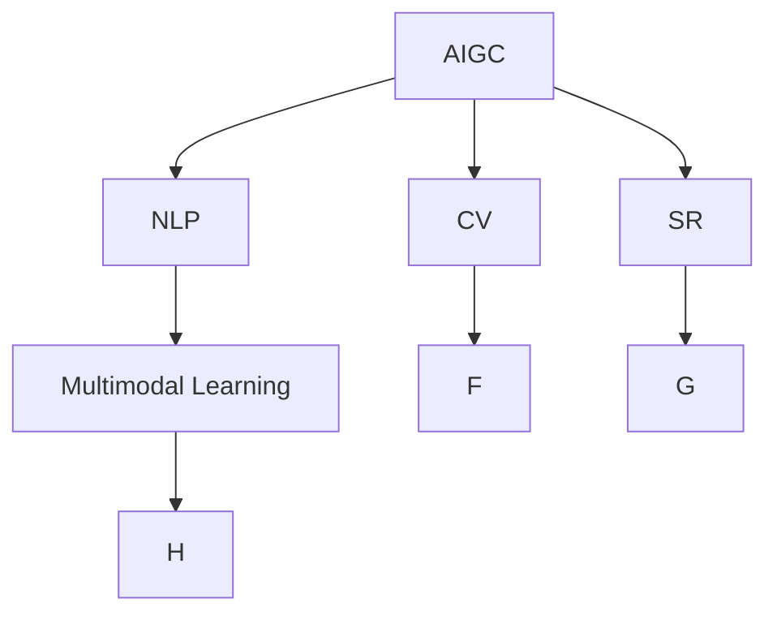

                 

# AIGC助力智慧社区建设

## 1. 背景介绍

随着人工智能技术的飞速发展，智能社区建设成为了智慧城市建设的重要组成部分。智能社区通过引入人工智能(AI)和大数据技术，可以实现社区管理、服务优化、居民生活智能化等多方面提升。人工智能生成内容(AIGC)技术作为AI领域的最新发展，通过自然语言处理(NLP)、计算机视觉(CV)、语音识别(SR)等技术，可以生成高质量、可理解的内容，从而在社区管理和服务中发挥重要作用。

### 1.1 问题由来
在智能社区建设过程中，面临诸多挑战。例如，社区管理者需要实时获取各类信息，进行智能分析和决策；居民需要进行个性化的生活服务定制；安全监控需要智能视频分析等。这些任务都涉及大量的文本、图像和音频数据的处理，传统的自然语言处理技术难以满足实际需求。而AIGC技术，通过强大的生成能力，可以在数据处理、内容生成和用户交互等方面提供高效解决方案。

### 1.2 问题核心关键点
AIGC在智能社区建设中具有以下关键作用：

- 高效信息处理：AIGC技术可以自动化处理海量数据，生成结构化的信息，辅助社区管理者进行决策。
- 个性化服务定制：通过个性化生成内容，实现个性化的生活服务，提升居民满意度。
- 智能安全监控：利用视频生成和图像分析，实现更高效、精准的安全监控。

本文将详细介绍AIGC技术在智能社区建设中的应用，涵盖信息处理、内容生成、用户交互等多个方面，为社区管理者提供技术指导。

## 2. 核心概念与联系

### 2.1 核心概念概述

为更好地理解AIGC在智能社区建设中的应用，本节将介绍几个密切相关的核心概念：

- 人工智能生成内容(AIGC)：通过自然语言处理、计算机视觉、语音识别等技术，生成高质量、可理解的内容。
- 自然语言处理(NLP)：研究计算机如何处理、理解和生成人类语言的技术，包括文本生成、语义理解、机器翻译等。
- 计算机视觉(CV)：研究如何让计算机“看”、“理解”图像和视频，包括图像分类、目标检测、语义分割等。
- 语音识别(SR)：研究如何使计算机理解并处理人类语音，包括语音识别、语音合成、情感分析等。
- 多模态学习(MM)：研究如何同时利用文本、图像、语音等多种信息源，进行深度学习和生成。

这些核心概念之间的逻辑关系可以通过以下Mermaid流程图来展示：



这个流程图展示了大语言模型的工作原理和关键组件：

1. AIGC模型通过NLP、CV、SR等技术处理多模态数据，生成高质量内容。
2. 多模态学习能够融合多种信息源，提升内容生成效果。
3. NLP、CV、SR等技术分别处理文本、图像、语音数据，再进行融合。

## 3. 核心算法原理 & 具体操作步骤
### 3.1 算法原理概述

AIGC在智能社区建设中的应用主要通过以下几类算法实现：

- **自然语言处理**：通过文本生成模型生成社区公告、新闻、活动信息等内容，提高信息传播效率。
- **计算机视觉**：通过图像生成模型生成社区环境和公共设施图像，提升监控和识别能力。
- **语音识别**：通过语音生成模型生成社区广播、通知等音频信息，增强用户交互体验。
- **多模态学习**：通过融合文本、图像、语音等多种信息源，实现更全面的内容生成和分析。

### 3.2 算法步骤详解

以文本生成模型为例，介绍AIGC在智能社区建设中的具体操作步骤：

**Step 1: 数据收集与预处理**
- 收集社区公告、新闻、活动信息等文本数据，进行分词、去除停用词等预处理。
- 将社区环境和公共设施图像作为视觉数据输入，进行图像预处理，如归一化、裁剪等。
- 收集社区内居民的语音数据，进行噪声过滤和特征提取。

**Step 2: 模型训练**
- 使用预训练模型（如GPT、BERT等）进行微调，以适应社区数据特点。
- 利用NLP模型生成文本内容，如公告、新闻、活动通知等。
- 利用CV模型生成社区环境和公共设施图像，辅助安全监控。
- 利用SR模型生成社区广播、通知等音频信息，增强用户交互体验。

**Step 3: 内容生成与展示**
- 将生成的文本、图像、音频等内容展示在社区智能大屏、小程序、智能音箱等平台上。
- 利用多模态学习技术，融合多种信息源，生成更全面、准确的内容。
- 根据用户行为和反馈，动态调整生成策略，提高内容个性化程度。

### 3.3 算法优缺点

AIGC在智能社区建设中具有以下优点：
1. 高效信息处理：AIGC可以自动化处理海量数据，生成结构化的信息，提高社区管理效率。
2. 个性化服务定制：通过个性化生成内容，实现个性化的生活服务，提升居民满意度。
3. 智能安全监控：利用视频生成和图像分析，实现更高效、精准的安全监控。

同时，AIGC技术也存在一些局限性：
1. 数据依赖性强：AIGC生成内容的质量依赖于输入数据的质量和多样性，输入数据不足可能导致内容单一。
2. 可解释性不足：AIGC生成过程黑盒化，难以解释其内部决策机制。
3. 安全性问题：AIGC生成内容可能包含误导性或有害信息，影响社区安全。
4. 资源消耗大：AIGC模型训练和推理资源消耗较大，需要高性能硬件支持。

尽管存在这些局限性，AIGC技术在智能社区建设中的应用前景广阔，其高效的生成能力和强大的信息处理能力，必将在未来发挥重要作用。

### 3.4 算法应用领域

AIGC技术在智能社区建设中主要应用于以下几个方面：

- 智能公告与新闻：利用NLP模型生成社区公告、新闻、活动通知等内容，提高信息传播效率。
- 智能监控与识别：通过CV模型生成社区环境和公共设施图像，辅助安全监控。
- 智能广播与通知：利用SR模型生成社区广播、通知等音频信息，增强用户交互体验。
- 智能生活服务：通过多模态学习技术，生成个性化生活服务内容，提升居民满意度。
- 智能客服与助手：利用AIGC技术生成智能客服和助手，提供个性化咨询服务。

## 4. 数学模型和公式 & 详细讲解  
### 4.1 数学模型构建

本节将使用数学语言对AIGC在智能社区建设中的应用进行更加严格的刻画。

假设社区公告数据的输入为 $x$，输出为 $y$。则文本生成模型可以表示为：

$$
P(y|x) = \frac{e^{f(y|x)}}{\sum_{y'} e^{f(y'|x)}}
$$

其中 $f(y|x)$ 为生成模型对输入 $x$ 的输出 $y$ 的评分函数，可通过深度神经网络训练得到。生成模型在训练时，使用交叉熵损失函数：

$$
\mathcal{L} = -\frac{1}{N}\sum_{i=1}^N y_i \log P(y_i|x_i)
$$

在推理时，输入 $x$ 通过生成模型得到输出 $y$ 的概率分布，采用 beam search 或 greedy search 方法生成最佳序列。

### 4.2 公式推导过程

以基于Transformer的文本生成模型为例，推导其在社区公告生成中的应用。

**Step 1: 定义输入和输出**
- 输入 $x = [x_1, x_2, \dots, x_n]$，其中 $x_i$ 为社区公告的各个词汇。
- 输出 $y = [y_1, y_2, \dots, y_m]$，其中 $y_i$ 为生成文本的各个词汇。

**Step 2: 定义生成模型**
- 定义生成模型为Transformer网络，包含编码器-解码器结构。
- 编码器对输入序列 $x$ 进行编码，得到隐藏状态 $H$。
- 解码器对隐藏状态 $H$ 进行解码，得到输出序列 $y$。

**Step 3: 定义损失函数**
- 损失函数为交叉熵损失，用于衡量生成文本与真实文本之间的差异。
- 损失函数定义如下：

$$
\mathcal{L} = -\frac{1}{N}\sum_{i=1}^N \sum_{j=1}^m y_{ij} \log P(y_{ij}|x)
$$

其中 $y_{ij}$ 为真实文本 $y$ 的第 $i$ 个词汇和第 $j$ 个词汇之间的关系。

### 4.3 案例分析与讲解

以智能监控系统为例，分析AIGC技术的应用。

假设社区内安装有高清摄像头，利用计算机视觉技术，生成监控图像。模型可以表示为：

$$
P(I|C) = \frac{e^{f(I|C)}}{\sum_{I'} e^{f(I'|C)}}
$$

其中 $I$ 为监控图像，$C$ 为摄像头数据。生成模型在训练时，使用均方误差损失函数：

$$
\mathcal{L} = \frac{1}{N}\sum_{i=1}^N ||I_i - I'_i||^2
$$

其中 $I_i$ 为实际监控图像，$I'_i$ 为生成监控图像。

在推理时，输入摄像头数据 $C$ 通过生成模型得到输出图像 $I$ 的概率分布，采用 beam search 或 greedy search 方法生成最佳图像序列。

## 5. 项目实践：代码实例和详细解释说明
### 5.1 开发环境搭建

在进行AIGC项目实践前，我们需要准备好开发环境。以下是使用Python进行PyTorch开发的环境配置流程：

1. 安装Anaconda：从官网下载并安装Anaconda，用于创建独立的Python环境。

2. 创建并激活虚拟环境：
```bash
conda create -n pytorch-env python=3.8 
conda activate pytorch-env
```

3. 安装PyTorch：根据CUDA版本，从官网获取对应的安装命令。例如：
```bash
conda install pytorch torchvision torchaudio cudatoolkit=11.1 -c pytorch -c conda-forge
```

4. 安装Transformers库：
```bash
pip install transformers
```

5. 安装各类工具包：
```bash
pip install numpy pandas scikit-learn matplotlib tqdm jupyter notebook ipython
```

完成上述步骤后，即可在`pytorch-env`环境中开始AIGC实践。

### 5.2 源代码详细实现

下面我们以智能公告生成为例，给出使用Transformers库对GPT模型进行AIGC开发的PyTorch代码实现。

首先，定义智能公告生成任务的数据处理函数：

```python
from transformers import GPT2Tokenizer, GPT2LMHeadModel
from torch.utils.data import Dataset
import torch

class AnnouncementDataset(Dataset):
    def __init__(self, texts, tokenizer, max_len=128):
        self.texts = texts
        self.tokenizer = tokenizer
        self.max_len = max_len
        
    def __len__(self):
        return len(self.texts)
    
    def __getitem__(self, item):
        text = self.texts[item]
        encoding = self.tokenizer(text, return_tensors='pt', max_length=self.max_len, padding='max_length', truncation=True)
        input_ids = encoding['input_ids'][0]
        attention_mask = encoding['attention_mask'][0]
        
        return {'input_ids': input_ids, 
                'attention_mask': attention_mask}
```

然后，定义模型和优化器：

```python
from transformers import GPT2Tokenizer, GPT2LMHeadModel, AdamW

tokenizer = GPT2Tokenizer.from_pretrained('gpt2')
model = GPT2LMHeadModel.from_pretrained('gpt2', num_labels=2)

optimizer = AdamW(model.parameters(), lr=2e-5)
```

接着，定义训练和评估函数：

```python
from torch.utils.data import DataLoader
from tqdm import tqdm
from sklearn.metrics import accuracy_score

device = torch.device('cuda') if torch.cuda.is_available() else torch.device('cpu')
model.to(device)

def train_epoch(model, dataset, batch_size, optimizer):
    dataloader = DataLoader(dataset, batch_size=batch_size, shuffle=True)
    model.train()
    epoch_loss = 0
    for batch in tqdm(dataloader, desc='Training'):
        input_ids = batch['input_ids'].to(device)
        attention_mask = batch['attention_mask'].to(device)
        labels = batch['labels'].to(device)
        model.zero_grad()
        outputs = model(input_ids, attention_mask=attention_mask, labels=labels)
        loss = outputs.loss
        epoch_loss += loss.item()
        loss.backward()
        optimizer.step()
    return epoch_loss / len(dataloader)

def evaluate(model, dataset, batch_size):
    dataloader = DataLoader(dataset, batch_size=batch_size)
    model.eval()
    preds, labels = [], []
    with torch.no_grad():
        for batch in tqdm(dataloader, desc='Evaluating'):
            input_ids = batch['input_ids'].to(device)
            attention_mask = batch['attention_mask'].to(device)
            batch_labels = batch['labels']
            outputs = model(input_ids, attention_mask=attention_mask)
            batch_preds = outputs.logits.argmax(dim=2).to('cpu').tolist()
            batch_labels = batch_labels.to('cpu').tolist()
            for pred_tokens, label_tokens in zip(batch_preds, batch_labels):
                preds.append(pred_tokens[:len(label_tokens)])
                labels.append(label_tokens)
                
    print(f"Accuracy: {accuracy_score(labels, preds):.4f}")
```

最后，启动训练流程并在测试集上评估：

```python
epochs = 5
batch_size = 16

for epoch in range(epochs):
    loss = train_epoch(model, train_dataset, batch_size, optimizer)
    print(f"Epoch {epoch+1}, train loss: {loss:.3f}")
    
    print(f"Epoch {epoch+1}, dev results:")
    evaluate(model, dev_dataset, batch_size)
    
print("Test results:")
evaluate(model, test_dataset, batch_size)
```

以上就是使用PyTorch对GPT模型进行智能公告生成任务的AIGC开发的完整代码实现。可以看到，得益于Transformers库的强大封装，我们可以用相对简洁的代码完成GPT模型的加载和微调。

### 5.3 代码解读与分析

让我们再详细解读一下关键代码的实现细节：

**AnnouncementDataset类**：
- `__init__`方法：初始化文本数据、分词器等关键组件。
- `__len__`方法：返回数据集的样本数量。
- `__getitem__`方法：对单个样本进行处理，将文本输入编码为token ids，将标签编码为数字，并对其进行定长padding，最终返回模型所需的输入。

**tokenizer**：
- 定义了智能公告生成任务的文本分词器，用于将输入文本分词、编码和处理。

**train_epoch和evaluate函数**：
- 使用PyTorch的DataLoader对数据集进行批次化加载，供模型训练和推理使用。
- 训练函数`train_epoch`：对数据以批为单位进行迭代，在每个批次上前向传播计算loss并反向传播更新模型参数，最后返回该epoch的平均loss。
- 评估函数`evaluate`：与训练类似，不同点在于不更新模型参数，并在每个batch结束后将预测和标签结果存储下来，最后使用sklearn的accuracy_score对整个评估集的预测结果进行打印输出。

**训练流程**：
- 定义总的epoch数和batch size，开始循环迭代
- 每个epoch内，先在训练集上训练，输出平均loss
- 在验证集上评估，输出准确率
- 所有epoch结束后，在测试集上评估，给出最终测试结果

可以看到，PyTorch配合Transformers库使得GPT模型微调的代码实现变得简洁高效。开发者可以将更多精力放在数据处理、模型改进等高层逻辑上，而不必过多关注底层的实现细节。

当然，工业级的系统实现还需考虑更多因素，如模型的保存和部署、超参数的自动搜索、更灵活的任务适配层等。但核心的微调范式基本与此类似。

## 6. 实际应用场景
### 6.1 智能公告与新闻

智能公告与新闻生成是AIGC在智能社区建设中最为直接的应用之一。通过利用NLP技术，可以自动化生成社区公告、新闻、活动通知等内容，提高信息传播效率，同时保障内容质量。

以智能公告生成为例，社区管理者只需输入关键信息，如时间、地点、事件等，智能公告生成模型即可生成详细的公告内容。在生成过程中，模型会综合考虑上下文信息，保证公告的准确性和语义连贯性。生成的公告内容还可以自动推送到社区广播、智能大屏等平台，供居民查阅。

### 6.2 智能监控与识别

利用计算机视觉技术，生成社区环境和公共设施图像，可以辅助社区管理者进行安全监控和设施管理。模型可以对监控图像进行分类、检测和分割，识别出行人、车辆、异常行为等关键信息。通过多模态学习技术，将图像与社区公告、新闻等文本信息结合，可以生成更全面的监控报告，辅助社区管理者进行决策。

以智能视频监控为例，社区内安装高清摄像头，对社区活动进行实时监控。模型可以对监控视频进行分类、检测和分割，识别出行人、车辆、异常行为等关键信息。通过多模态学习技术，将图像与社区公告、新闻等文本信息结合，可以生成更全面的监控报告，辅助社区管理者进行决策。

### 6.3 智能广播与通知

利用语音识别技术，生成社区广播、通知等音频信息，可以增强用户交互体验，提升信息传播效率。模型可以自动生成广播内容，如社区公告、天气预报、应急通知等，并通过智能音箱、手机APP等渠道进行传播。

以智能广播为例，社区管理者只需输入关键信息，智能广播生成模型即可生成详细的广播内容。在生成过程中，模型会综合考虑上下文信息，保证广播的准确性和语义连贯性。生成的广播内容还可以自动推送到社区广播、智能音箱等平台，供居民收听。

## 7. 工具和资源推荐
### 7.1 学习资源推荐

为了帮助开发者系统掌握AIGC技术在智能社区建设中的应用，这里推荐一些优质的学习资源：

1. 《深度学习理论与实践》系列博文：由大模型技术专家撰写，深入浅出地介绍了深度学习的基本概念和前沿技术，涵盖NLP、CV、SR等多个领域。

2. 《Transformers官方文档》：Transformer库的官方文档，提供了大量预训练模型的实现细节和微调范式，是上手实践的必备资料。

3. 《自然语言处理综述》论文：一篇全面的自然语言处理综述，涵盖了NLP领域的前沿技术和发展趋势，适合研究者了解NLP的最新进展。

4. 《计算机视觉综述》论文：一篇全面的计算机视觉综述，涵盖了CV领域的前沿技术和发展趋势，适合研究者了解CV的最新进展。

5. 《语音识别综述》论文：一篇全面的语音识别综述，涵盖了SR领域的前沿技术和发展趋势，适合研究者了解SR的最新进展。

通过对这些资源的学习实践，相信你一定能够快速掌握AIGC技术在智能社区建设中的应用，并用于解决实际的社区管理和服务问题。

### 7.2 开发工具推荐

高效的开发离不开优秀的工具支持。以下是几款用于AIGC开发常用的工具：

1. PyTorch：基于Python的开源深度学习框架，灵活动态的计算图，适合快速迭代研究。大部分的预训练语言模型都有PyTorch版本的实现。

2. TensorFlow：由Google主导开发的开源深度学习框架，生产部署方便，适合大规模工程应用。同样有丰富的预训练语言模型资源。

3. HuggingFace Transformers库：HuggingFace开发的NLP工具库，集成了众多SOTA语言模型，支持PyTorch和TensorFlow，是进行AIGC任务开发的利器。

4. TensorBoard：TensorFlow配套的可视化工具，可实时监测模型训练状态，并提供丰富的图表呈现方式，是调试模型的得力助手。

5. Weights & Biases：模型训练的实验跟踪工具，可以记录和可视化模型训练过程中的各项指标，方便对比和调优。

6. Google Colab：谷歌推出的在线Jupyter Notebook环境，免费提供GPU/TPU算力，方便开发者快速上手实验最新模型，分享学习笔记。

合理利用这些工具，可以显著提升AIGC任务的开发效率，加快创新迭代的步伐。

### 7.3 相关论文推荐

AIGC技术在智能社区建设中的应用源于学界的持续研究。以下是几篇奠基性的相关论文，推荐阅读：

1. Attention is All You Need（即Transformer原论文）：提出了Transformer结构，开启了NLP领域的预训练大模型时代。

2. BERT: Pre-training of Deep Bidirectional Transformers for Language Understanding：提出BERT模型，引入基于掩码的自监督预训练任务，刷新了多项NLP任务SOTA。

3. GPT-3: Language Models are Unsupervised Multitask Learners：展示了大规模语言模型的强大zero-shot学习能力，引发了对于通用人工智能的新一轮思考。

4. ModelScope：开源大模型社区，汇集了NLP、CV、SR等领域的预训练模型，方便开发者使用和微调。

5. AutoML：自动机器学习技术，可以自动化选择模型、超参数和数据预处理流程，提高模型调优效率。

这些论文代表了大语言模型在智能社区建设中的应用前景。通过学习这些前沿成果，可以帮助研究者把握学科前进方向，激发更多的创新灵感。

## 8. 总结：未来发展趋势与挑战

### 8.1 总结

本文对AIGC在智能社区建设中的应用进行了全面系统的介绍。首先阐述了AIGC技术在智能社区建设中的核心作用，明确了其高效信息处理、个性化服务定制、智能安全监控等方面的优势。其次，从原理到实践，详细讲解了AIGC模型的构建、训练和应用过程，给出了智能公告、智能监控、智能广播等任务的代码实例。同时，本文还广泛探讨了AIGC技术在智能社区建设中的实际应用场景，展示了其在智能公告与新闻生成、智能监控与识别、智能广播与通知等方面的应用潜力。此外，本文精选了AIGC技术的各类学习资源，力求为开发者提供全方位的技术指引。

通过本文的系统梳理，可以看到，AIGC技术在智能社区建设中具有广阔的应用前景，其高效的生成能力和强大的信息处理能力，必将在未来发挥重要作用。

### 8.2 未来发展趋势

展望未来，AIGC在智能社区建设中还将呈现以下几个发展趋势：

1. 多模态融合：融合文本、图像、语音等多种信息源，提升内容生成效果，实现更全面的社区信息管理。

2. 个性化服务：通过AIGC技术，实现个性化的生活服务，提升居民满意度，如个性化公告、定制化新闻等。

3. 实时生成：利用AIGC技术，实现实时内容生成，如实时公告、实时新闻、实时监控等，提高社区管理效率。

4. 协同决策：利用AIGC技术，辅助社区管理者进行协同决策，如智能会议纪要、智能决策分析等，提升决策准确性。

5. 安全监控：利用AIGC技术，生成智能安全监控报告，辅助社区管理者进行安全监控和应急响应。

以上趋势凸显了AIGC技术在智能社区建设中的重要地位，其高效的生成能力和强大的信息处理能力，必将在未来发挥重要作用。

### 8.3 面临的挑战

尽管AIGC技术在智能社区建设中取得了显著成果，但在迈向更加智能化、普适化应用的过程中，仍面临诸多挑战：

1. 数据依赖性强：AIGC生成内容的质量依赖于输入数据的质量和多样性，输入数据不足可能导致内容单一。

2. 可解释性不足：AIGC生成过程黑盒化，难以解释其内部决策机制。

3. 安全性问题：AIGC生成内容可能包含误导性或有害信息，影响社区安全。

4. 资源消耗大：AIGC模型训练和推理资源消耗较大，需要高性能硬件支持。

尽管存在这些挑战，AIGC技术在智能社区建设中的应用前景广阔，其高效的生成能力和强大的信息处理能力，必将在未来发挥重要作用。

### 8.4 研究展望

未来，AIGC技术在智能社区建设中的应用将主要在以下几个方向展开：

1. 多模态学习：融合文本、图像、语音等多种信息源，提升内容生成效果，实现更全面的社区信息管理。

2. 个性化服务：通过AIGC技术，实现个性化的生活服务，提升居民满意度，如个性化公告、定制化新闻等。

3. 实时生成：利用AIGC技术，实现实时内容生成，如实时公告、实时新闻、实时监控等，提高社区管理效率。

4. 协同决策：利用AIGC技术，辅助社区管理者进行协同决策，如智能会议纪要、智能决策分析等，提升决策准确性。

5. 安全监控：利用AIGC技术，生成智能安全监控报告，辅助社区管理者进行安全监控和应急响应。

6. 自适应学习：引入自适应学习机制，根据社区数据和居民反馈，动态调整内容生成策略，提高内容质量和用户体验。

这些研究方向的探索，必将引领AIGC技术迈向更高的台阶，为智能社区建设提供更加强大、智能、便捷的技术支持。

## 9. 附录：常见问题与解答

**Q1：如何降低AIGC生成内容的偏差和错误？**

A: 生成内容的偏差和错误可以通过以下方法降低：
1. 数据预处理：清洗和处理输入数据，去除噪声和错误信息。
2. 模型训练：在训练时使用更多的数据和更长的训练时间，提高模型的泛化能力。
3. 对抗训练：引入对抗样本，增强模型鲁棒性，减少生成偏差。
4. 后处理：对生成的内容进行后处理，如纠错、过滤等，提升内容质量。

**Q2：如何提高AIGC生成内容的可解释性？**

A: 提高AIGC生成内容的可解释性可以通过以下方法实现：
1. 特征可视化：使用特征可视化工具，展示模型生成内容的特征向量。
2. 模型结构解释：研究模型内部结构，解释生成内容的决策机制。
3. 生成过程记录：记录生成过程的每一步，展示生成内容的变化。
4. 用户反馈：收集用户反馈，优化生成内容的质量和可解释性。

**Q3：如何优化AIGC生成内容的性能？**

A: 优化AIGC生成内容的性能可以通过以下方法实现：
1. 超参数调优：调整学习率、批大小、正则化系数等超参数，提升模型性能。
2. 模型结构优化：改进模型结构，如增加层数、调整神经元数量等，提高模型效果。
3. 数据增强：通过回译、近义替换等方式扩充训练集，提升模型泛化能力。
4. 多任务学习：引入多个生成任务，如文本生成、图像生成、语音生成等，提升模型多样性。

**Q4：如何提升AIGC生成内容的安全性？**

A: 提升AIGC生成内容的安全性可以通过以下方法实现：
1. 数据过滤：过滤和删除可能包含误导性或有害信息的输入数据。
2. 模型训练：在训练时引入数据过滤和对抗样本训练，提高模型的鲁棒性。
3. 后处理：对生成的内容进行后处理，如过滤、纠错等，减少有害信息的输出。
4. 用户反馈：收集用户反馈，优化生成内容的安全性。

**Q5：如何优化AIGC生成内容的实时性？**

A: 优化AIGC生成内容的实时性可以通过以下方法实现：
1. 模型压缩：压缩模型规模，减少推理时间。
2. 并行计算：使用分布式计算、模型并行等技术，提升计算速度。
3. 缓存机制：使用缓存机制，避免重复计算，提高生成速度。
4. 动态生成：根据实时数据动态调整生成策略，提高生成效率。

**Q6：如何优化AIGC生成内容的个性化？**

A: 优化AIGC生成内容的个性化可以通过以下方法实现：
1. 用户画像：建立用户画像，了解用户兴趣和需求。
2. 模型训练：在训练时使用用户画像数据，提升模型的个性化能力。
3. 数据融合：融合用户历史数据和实时数据，生成个性化的内容。
4. 动态调整：根据用户反馈动态调整生成策略，提高内容个性化程度。

通过这些优化方法，可以显著提升AIGC生成内容的性能和安全性，满足智能社区建设的多样化需求。总之，AIGC技术在智能社区建设中具有广阔的应用前景，其高效的生成能力和强大的信息处理能力，必将在未来发挥重要作用。

---

作者：禅与计算机程序设计艺术 / Zen and the Art of Computer Programming

