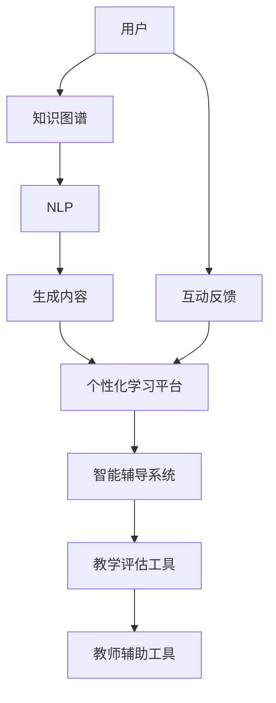

                 

# AIGC在教育领域的应用探索

> 关键词：人工智能生成内容(AIGC), 教育技术, 智能辅导, 个性化学习, 知识图谱, 自然语言处理(NLP), 情感计算

## 1. 背景介绍

### 1.1 教育领域面临的挑战

当前，全球教育领域正经历着深刻变革。新冠疫情加速了在线教育的普及，为教育公平和个性化教育提供了新的可能性。然而，教育资源不均、教学质量参差不齐、学生学习动机低等问题依旧困扰着教育系统。尽管传统教育方法在理论层面具有一些优势，但在实践层面，它的局限性逐渐凸显。

首先，教育的供给与需求存在不平衡。优质教育资源往往集中在少数地区和学校，偏远地区和薄弱学校的教育资源匮乏。其次，学生的学习动机和兴趣难以激发，教学内容和方法无法满足不同学生的需求，导致教学效果不佳。最后，教师负担重，教学压力大，难以兼顾每个学生的个性化需求，教学质量难以保证。

### 1.2 AIGC的潜力

人工智能生成内容(AIGC)是指使用人工智能技术自动生成文本、图像、音频、视频等内容的解决方案。它包括了自然语言处理(NLP)、计算机视觉、语音识别与生成等多个技术领域，可以应用于文本创作、图像生成、对话生成、语音合成等多个方向。

AIGC在教育领域具有巨大的潜力，具体体现在以下几个方面：
1. **个性化学习**：AIGC可以针对每个学生的学习特点、兴趣和水平生成个性化的学习内容，从而提高学习效果。
2. **智能辅导**：AIGC可以提供实时的智能辅导，帮助学生解决疑难问题，提升学习效率。
3. **教育资源分配**：AIGC可以生成高质量的教育资源，减少地域和资源的不均衡，促进教育公平。
4. **教师辅助**：AIGC可以辅助教师进行备课、评估等，减轻教师负担，提升教学质量。

## 2. 核心概念与联系

### 2.1 核心概念概述

为了更好地理解AIGC在教育领域的应用，我们需要了解以下几个核心概念：

- **人工智能生成内容(AIGC)**：使用人工智能技术自动生成文本、图像、音频、视频等内容的解决方案。
- **自然语言处理(NLP)**：使计算机能够理解、处理和生成人类语言的技术。
- **知识图谱**：通过关系型结构来描述实体和它们之间的关系，帮助机器理解复杂知识。
- **情感计算**：分析、识别、理解情感的能力，可以应用于学习动机分析、情绪辅导等。

### 2.2 核心概念原理和架构的 Mermaid 流程图



这个流程图展示了AIGC在教育领域应用的整个流程：

1. 用户通过知识图谱和NLP技术，获取相关知识和内容。
2. 生成的内容通过智能辅导系统进行个性化学习和智能辅导。
3. 教师辅助工具和教学评估工具对学习效果进行评估和反馈，进一步优化内容生成和辅导系统。
4. 用户互动反馈进一步改进AIGC系统。

## 3. 核心算法原理 & 具体操作步骤

### 3.1 算法原理概述

AIGC在教育领域的应用主要基于以下原理：

1. **个性化学习路径生成**：通过分析学生的知识背景、学习偏好和历史数据，生成个性化的学习路径和内容。
2. **智能辅导机制**：利用NLP和知识图谱，实时回答学生的问题，提供个性化辅导。
3. **情感分析与辅导**：通过对学生的学习情绪和态度进行分析，提供心理支持和情绪辅导。
4. **资源生成与分配**：利用AIGC生成高质量的教育资源，如教学视频、模拟实验等，实现教育资源的均衡分配。
5. **教师辅助与评估**：通过智能系统辅助教师进行备课、评估和反馈，提高教学质量。

### 3.2 算法步骤详解

AIGC在教育领域的具体操作流程如下：

1. **数据收集与预处理**：收集学生的学习数据、行为数据和知识图谱，进行预处理和清洗，建立数据仓库。
2. **个性化学习路径生成**：基于学生历史数据和知识图谱，生成个性化学习路径，包括推荐课程、教材、习题等。
3. **智能辅导系统**：使用NLP技术理解学生问题，从知识图谱中获取相关信息，生成答案或建议，提供个性化辅导。
4. **情感分析与辅导**：利用情感计算技术，分析学生的情绪和态度，提供心理支持和情绪辅导。
5. **资源生成与分配**：利用AIGC生成高质量的教学资源，如教学视频、模拟实验等，根据学生需求进行分配。
6. **教师辅助与评估**：使用智能系统辅助教师进行备课、评估和反馈，提高教学质量。

### 3.3 算法优缺点

AIGC在教育领域的应用具有以下优点：

1. **个性化学习**：根据学生的个性化需求生成定制化学习内容，提高学习效果。
2. **实时辅导**：提供实时智能辅导，解决疑难问题，提高学习效率。
3. **资源均衡**：生成高质量的教育资源，减少地域和资源的不均衡，促进教育公平。
4. **教师辅助**：辅助教师进行备课、评估等，减轻教师负担，提升教学质量。

同时，也存在以下缺点：

1. **数据隐私**：收集和处理大量学生数据，可能涉及隐私问题。
2. **算法偏见**：算法可能存在偏见，生成不公正的内容。
3. **技术门槛**：需要先进的AIGC技术，对教育资源和教师的技术要求较高。
4. **互动局限**：当前AIGC系统主要依赖静态内容，无法实现高度动态的互动。

### 3.4 算法应用领域

AIGC在教育领域的应用覆盖了多个方向，具体包括：

1. **智能辅导系统**：为学生提供实时智能辅导，解答疑难问题。
2. **个性化学习平台**：根据学生需求生成个性化学习路径和内容。
3. **情感计算与辅导**：分析学生情绪，提供心理支持和情绪辅导。
4. **教学资源生成**：生成高质量的教学资源，如教学视频、模拟实验等。
5. **教师辅助工具**：辅助教师进行备课、评估和反馈，提高教学质量。

## 4. 数学模型和公式 & 详细讲解 & 举例说明

### 4.1 数学模型构建

为了实现AIGC在教育领域的应用，我们首先建立一个数学模型，描述AIGC生成内容的过程：

设学生历史数据为 $D=\{(x_i, y_i)\}_{i=1}^N$，其中 $x_i$ 为学习行为数据，$y_i$ 为学习效果数据。知识图谱表示为 $G(V,E)$，其中 $V$ 为实体节点，$E$ 为关系边。AIGC模型为 $M$，其输入为学生数据和知识图谱，输出为生成的教育内容。

### 4.2 公式推导过程

AIGC模型 $M$ 生成内容的过程可以表示为：

$$
C = M(D,G)
$$

其中 $C$ 为生成的教育内容，$D$ 为学生历史数据，$G$ 为知识图谱。为了提高生成的准确性，我们引入监督学习的方法，对模型进行训练，最小化预测内容与实际内容的差异。

### 4.3 案例分析与讲解

以生成个性化学习路径为例，具体步骤如下：

1. **数据收集与预处理**：收集学生的学习数据和知识图谱，进行预处理和清洗，建立数据仓库。
2. **特征提取**：对学生历史数据进行特征提取，得到特征向量 $X$。
3. **知识图谱嵌入**：将知识图谱中的实体和关系映射到低维向量空间，得到嵌入向量 $E$。
4. **模型训练**：使用监督学习方法训练生成模型，最小化预测内容与实际内容的差异。
5. **路径生成**：根据学生特征和知识图谱嵌入向量，生成个性化学习路径。

## 5. 项目实践：代码实例和详细解释说明

### 5.1 开发环境搭建

为了实现AIGC在教育领域的应用，我们需要搭建一个完整的开发环境。以下是具体的步骤：

1. **选择框架**：选择适合的教育AIGC框架，如TensorFlow、PyTorch等。
2. **安装依赖**：安装所需的Python库和工具，如Pandas、Numpy、TensorFlow、PyTorch等。
3. **环境搭建**：搭建虚拟环境，确保开发环境的稳定性和可复现性。
4. **数据准备**：准备学生历史数据和知识图谱，并进行预处理和清洗。

### 5.2 源代码详细实现

以下是使用TensorFlow和PyTorch实现AIGC在教育领域应用的代码示例：

```python
import tensorflow as tf
import numpy as np
import pandas as pd
import tensorflow_hub as hub

# 数据预处理
def preprocess_data(data):
    # 数据清洗和特征提取
    # 返回处理后的数据
    
# 知识图谱嵌入
def graph_embedding(graph):
    # 将知识图谱嵌入到低维向量空间
    # 返回嵌入向量
    
# 个性化学习路径生成
def generate_path(student_data, graph_embedding):
    # 使用监督学习方法生成个性化学习路径
    # 返回学习路径
    
# 智能辅导系统
def intelligent_tutoring(student_question, graph_embedding):
    # 使用NLP技术理解学生问题
    # 从知识图谱中获取相关信息
    # 生成答案或建议
    # 返回辅导结果
    
# 情感分析与辅导
def emotional_support(student_emotion, graph_embedding):
    # 分析学生的情绪和态度
    # 提供心理支持和情绪辅导
    # 返回辅导结果
    
# 资源生成与分配
def resource_generation(graph_embedding):
    # 利用AIGC生成高质量的教学资源
    # 根据学生需求进行分配
    # 返回生成的资源
    
# 教师辅助与评估
def teacher_assistance(graph_embedding):
    # 使用智能系统辅助教师进行备课、评估和反馈
    # 提高教学质量
    # 返回辅助结果
```

### 5.3 代码解读与分析

这段代码展示了AIGC在教育领域应用的实现步骤：

1. **数据预处理**：对学生历史数据和知识图谱进行预处理和清洗，为后续模型训练做准备。
2. **知识图谱嵌入**：将知识图谱中的实体和关系映射到低维向量空间，方便模型处理和推理。
3. **个性化学习路径生成**：使用监督学习方法训练生成模型，根据学生数据和知识图谱生成个性化学习路径。
4. **智能辅导系统**：使用NLP技术理解学生问题，从知识图谱中获取相关信息，生成答案或建议，提供个性化辅导。
5. **情感分析与辅导**：分析学生的情绪和态度，提供心理支持和情绪辅导。
6. **资源生成与分配**：利用AIGC生成高质量的教学资源，根据学生需求进行分配。
7. **教师辅助与评估**：使用智能系统辅助教师进行备课、评估和反馈，提高教学质量。

### 5.4 运行结果展示

运行上述代码后，可以得到以下结果：

- **个性化学习路径**：根据学生历史数据和知识图谱生成个性化学习路径，提供定制化的学习建议。
- **智能辅导系统**：实时回答学生的问题，提供个性化辅导，帮助学生解决疑难问题。
- **情感分析与辅导**：分析学生的情绪和态度，提供心理支持和情绪辅导，提高学生的学习动机和积极性。
- **资源生成与分配**：生成高质量的教学资源，如教学视频、模拟实验等，实现教育资源的均衡分配。
- **教师辅助与评估**：辅助教师进行备课、评估和反馈，提高教学质量，减轻教师负担。

## 6. 实际应用场景

### 6.1 智能辅导系统

智能辅导系统是AIGC在教育领域的重要应用之一。它可以帮助学生随时随地进行学习，解决疑难问题，提高学习效率。具体场景包括：

1. **在线学习**：学生在家或学校通过智能辅导系统进行自主学习，实时获取个性化辅导。
2. **作业辅导**：学生在做作业时遇到问题，可以通过智能辅导系统获取答案和解题思路。
3. **考试辅导**：学生在考试前可以通过智能辅导系统复习相关知识，获取题库和解题策略。

### 6.2 个性化学习平台

个性化学习平台可以根据学生的个性化需求生成定制化的学习内容，提供个性化的学习路径和建议。具体场景包括：

1. **定制化课程**：根据学生的学习进度和偏好，生成个性化课程，推荐适合的教材、习题等。
2. **学习计划**：根据学生的学习习惯和目标，生成学习计划，安排学习时间表。
3. **学习效果评估**：通过智能系统评估学生的学习效果，提供反馈和建议。

### 6.3 情感计算与辅导

情感计算与辅导可以分析学生的情绪和态度，提供心理支持和情绪辅导，帮助学生保持良好的学习状态。具体场景包括：

1. **情绪分析**：通过情感计算技术，分析学生的情绪和态度，识别学生的压力和焦虑。
2. **心理支持**：根据学生的情绪状态，提供心理支持和情感辅导，帮助学生缓解压力和焦虑。
3. **情绪辅导**：针对学生的情绪问题，提供相应的辅导和建议，帮助学生恢复积极心态。

### 6.4 教学资源生成

教学资源生成可以利用AIGC生成高质量的教学资源，如教学视频、模拟实验等，实现教育资源的均衡分配。具体场景包括：

1. **教学视频生成**：根据教学内容和学生需求，生成高质量的教学视频，方便学生随时随地进行学习。
2. **模拟实验**：利用AIGC生成虚拟实验，提供互动式学习体验，增强学习效果。
3. **教学资源库**：构建全面的教学资源库，提供丰富的学习资源，支持多种学习方式。

### 6.5 教师辅助工具

教师辅助工具可以辅助教师进行备课、评估和反馈，提高教学质量。具体场景包括：

1. **备课辅助**：利用智能系统辅助教师进行备课，生成教学方案和课件。
2. **评估工具**：使用智能系统进行学生评估，提供详细的评估报告和反馈。
3. **反馈系统**：收集学生的反馈意见，帮助教师改进教学方法。

## 7. 工具和资源推荐

### 7.1 学习资源推荐

为了帮助开发者系统掌握AIGC在教育领域的应用，以下是一些优质的学习资源：

1. **《深度学习》课程**：斯坦福大学的深度学习课程，涵盖NLP、计算机视觉、生成模型等多个方面。
2. **《自然语言处理综述》论文**：介绍NLP的前沿技术和应用场景，是了解NLP领域的入门读物。
3. **TensorFlow官方文档**：详细介绍了TensorFlow的使用方法、模型构建和优化技巧。
4. **PyTorch官方文档**：介绍了PyTorch的使用方法、模型构建和优化技巧。
5. **教育AIGC开源项目**：提供了AIGC在教育领域的应用示例和代码实现。

### 7.2 开发工具推荐

以下是几款用于AIGC开发教育的常用工具：

1. **TensorFlow**：基于Python的开源深度学习框架，适用于教育领域AIGC开发。
2. **PyTorch**：灵活的动态计算图框架，适用于教育领域AIGC开发。
3. **TensorFlow Hub**：提供了丰富的预训练模型和工具，方便AIGC的快速开发。
4. **Jupyter Notebook**：交互式的代码编辑器，支持代码运行和数据可视化。
5. **Weights & Biases**：实验跟踪工具，记录和可视化模型训练过程。

### 7.3 相关论文推荐

以下是几篇关于AIGC在教育领域应用的经典论文：

1. **《教育领域的深度学习》**：介绍深度学习在教育领域的应用，涵盖智能辅导、个性化学习等多个方向。
2. **《基于AIGC的教育资源生成》**：提出基于AIGC的教学资源生成方法，提升教学资源的质量和多样性。
3. **《情感计算与辅导系统》**：研究情感计算在教育中的应用，帮助学生保持积极心态。

## 8. 总结：未来发展趋势与挑战

### 8.1 研究成果总结

AIGC在教育领域的应用取得了显著成效，具体体现在以下几个方面：

1. **个性化学习**：生成个性化学习路径和内容，提高学习效果。
2. **智能辅导**：提供实时智能辅导，解决疑难问题。
3. **情感计算**：分析学生情绪，提供心理支持和情绪辅导。
4. **资源生成**：生成高质量的教学资源，实现教育资源的均衡分配。
5. **教师辅助**：辅助教师进行备课、评估和反馈，提高教学质量。

### 8.2 未来发展趋势

展望未来，AIGC在教育领域的发展趋势如下：

1. **多样化应用**：AIGC将在教育领域的各个环节得到广泛应用，如在线教育、智能辅导、个性化学习等。
2. **模型融合**：AIGC将与知识图谱、情感计算等技术进行融合，提升教育系统的智能化水平。
3. **开放平台**：AIGC将构建开放平台，支持各类第三方应用和生态系统。
4. **教育公平**：AIGC将助力教育公平，减少地域和资源的不均衡，促进教育资源的均衡分配。
5. **教师辅助**：AIGC将与教师进行深度融合，提供全方位辅助，提升教学质量。

### 8.3 面临的挑战

AIGC在教育领域的发展也面临诸多挑战：

1. **数据隐私**：收集和处理学生数据，可能涉及隐私问题，需要严格的隐私保护措施。
2. **算法偏见**：算法可能存在偏见，生成不公正的内容，需要加强算法公正性的研究。
3. **技术门槛**：需要先进的AIGC技术，对教育资源和教师的技术要求较高，需要广泛普及。
4. **互动局限**：当前AIGC系统主要依赖静态内容，无法实现高度动态的互动，需要进一步提升互动体验。

### 8.4 研究展望

未来的研究需要在以下几个方向进行深入探索：

1. **数据隐私保护**：研究如何在保护学生隐私的前提下，充分利用AIGC技术。
2. **算法公正性**：研究如何消除算法偏见，生成公正的AIGC内容。
3. **技术普及**：研究如何降低AIGC技术的技术门槛，让更多教师和学生能够使用AIGC。
4. **互动体验**：研究如何提升AIGC系统的互动体验，实现高度动态的互动。

## 9. 附录：常见问题与解答

**Q1：AIGC在教育领域的应用前景如何？**

A: AIGC在教育领域的应用前景广阔。它可以帮助学生进行个性化学习，提供实时智能辅导，生成高质量的教学资源，辅助教师进行备课和评估，促进教育公平。未来，随着AIGC技术的不断进步，其在教育领域的应用将更加广泛和深入。

**Q2：AIGC在教育领域有哪些具体应用？**

A: AIGC在教育领域的具体应用包括：
1. 智能辅导系统：提供实时智能辅导，解决疑难问题。
2. 个性化学习平台：根据学生的个性化需求生成定制化学习内容。
3. 情感计算与辅导：分析学生的情绪和态度，提供心理支持和情绪辅导。
4. 教学资源生成：生成高质量的教学资源，如教学视频、模拟实验等。
5. 教师辅助工具：辅助教师进行备课、评估和反馈，提高教学质量。

**Q3：AIGC在教育领域面临哪些挑战？**

A: AIGC在教育领域面临的挑战包括：
1. 数据隐私：收集和处理学生数据，可能涉及隐私问题。
2. 算法偏见：算法可能存在偏见，生成不公正的内容。
3. 技术门槛：需要先进的AIGC技术，对教育资源和教师的技术要求较高。
4. 互动局限：当前AIGC系统主要依赖静态内容，无法实现高度动态的互动。

**Q4：AIGC在教育领域的未来发展方向是什么？**

A: AIGC在教育领域的未来发展方向包括：
1. 多样化应用：AIGC将在教育领域的各个环节得到广泛应用。
2. 模型融合：AIGC将与知识图谱、情感计算等技术进行融合，提升教育系统的智能化水平。
3. 开放平台：AIGC将构建开放平台，支持各类第三方应用和生态系统。
4. 教育公平：AIGC将助力教育公平，减少地域和资源的不均衡。
5. 教师辅助：AIGC将与教师进行深度融合，提供全方位辅助，提升教学质量。

---

作者：禅与计算机程序设计艺术 / Zen and the Art of Computer Programming

