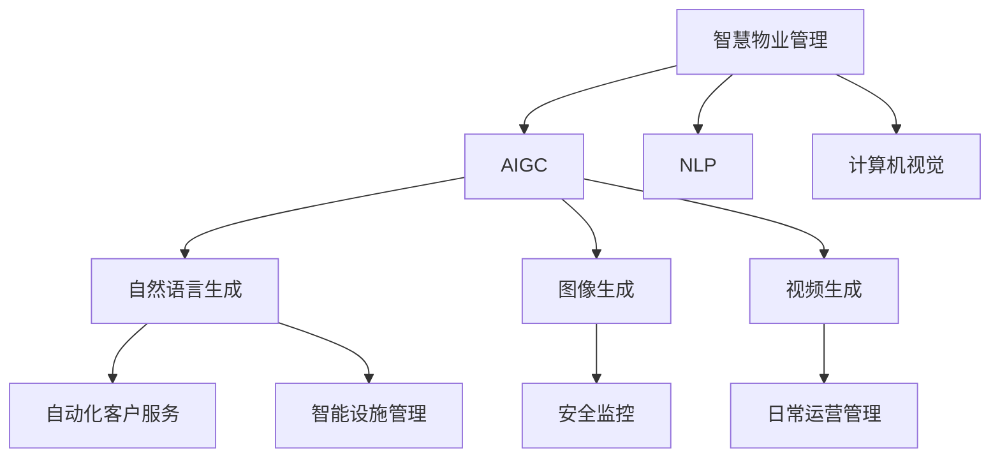

                 

# AIGC推动智慧物业管理

## 1. 背景介绍

### 1.1 问题由来

随着人工智能技术的迅速发展，智慧物业系统正成为现代物业管理中不可或缺的组成部分。传统的物业管理依赖大量的人工介入，效率低下、服务质量难以保证，已无法满足现代人们对于便捷、智能生活环境的需求。而人工智能，特别是生成式人工智能(AIGC)的崛起，为智慧物业系统带来了新的解决方案。

AIGC技术的核心在于生成式模型，其可以学习并生成具有特定结构和语义的新文本、图像、音频等内容。对于智慧物业管理而言，AIGC技术可以应用于自动化客户服务、智能设施管理、安全监控等多个方面，从而大幅提升物业服务的效率和质量。

### 1.2 问题核心关键点

AIGC技术在智慧物业管理中的应用主要包括以下几个方面：

- **自动化客户服务**：通过AIGC模型自动生成回复，快速响应客户咨询和投诉，提升客户满意度。
- **智能设施管理**：利用AIGC模型生成维修通知、操作手册等内容，帮助住户更高效地使用和维护设施。
- **安全监控**：利用生成式图像、视频内容，提高安全监控系统的准确性和响应速度。
- **日常运营管理**：生成日常运营报告、公告等内容，提升物业管理的透明度和效率。

本文将系统性地介绍AIGC技术在智慧物业管理中的应用，分析其原理、实践方法以及面临的挑战，为相关领域的从业人员提供参考。

## 2. 核心概念与联系

### 2.1 核心概念概述

为更好地理解AIGC技术在智慧物业管理中的应用，本节将介绍几个密切相关的核心概念：

- **生成式人工智能(AIGC)**：指利用生成模型，如GAN、变分自编码器、语言模型等，生成具有特定结构和语义的新内容的技术。AIGC的核心在于“生成”，能够根据输入的数据生成新的、具有一定相关性的文本、图像、音频等。

- **智慧物业管理**：指利用物联网、人工智能等技术，对物业管理各个环节进行智能化、自动化管理的系统。通过AIGC技术，可以提升物业管理的效率和服务的智能水平。

- **自然语言处理(NLP)**：指利用计算机技术，让计算机能够理解、处理和生成人类语言的技术。在智慧物业管理中，NLP技术可以用于客户服务、公告发布等场景。

- **计算机视觉**：指利用计算机技术，让计算机能够理解、处理和生成视觉内容，如图像、视频等。在智慧物业管理中，计算机视觉可以用于安全监控、设施管理等场景。

- **深度学习**：指利用多层神经网络结构，从大量数据中学习并提取特征，实现图像、语音、文本等内容的生成和分类。在AIGC技术中，深度学习是生成模型的核心算法之一。

这些核心概念之间的逻辑关系可以通过以下Mermaid流程图来展示：



这个流程图展示了大语言模型的工作原理和与智慧物业管理的应用场景：

1. 智慧物业管理通过物联网、AI等技术采集和处理数据。
2. AIGC技术可以用于自然语言生成、图像生成、视频生成等。
3. 生成的内容可以应用于自动化客户服务、智能设施管理、安全监控、日常运营管理等各个环节。

## 3. 核心算法原理 & 具体操作步骤

### 3.1 算法原理概述

AIGC技术在智慧物业管理中的应用，核心在于生成模型。生成模型通过学习大量数据，能够生成与输入数据具有一定相关性的新数据。在智慧物业管理中，生成模型可以用于生成自然语言、图像、视频等内容，以提升服务质量和效率。

以生成式语言模型为例，其主要原理是利用深度学习技术，训练一个能够从语言序列中学习到语言结构的模型。该模型能够根据给定的上下文信息，预测下一个单词或一段文本，从而生成连续的文本序列。生成式语言模型在智慧物业管理中的应用，主要在于生成自动化的客户服务回复、公告、维修通知等内容。

### 3.2 算法步骤详解

AIGC在智慧物业管理中的应用，主要包括以下几个关键步骤：

**Step 1: 数据准备**
- 收集物业管理的各类文本、图像、视频等数据，如客户服务记录、设施操作手册、安全监控录像等。
- 对数据进行清洗、标注和标准化处理，准备用于模型训练。

**Step 2: 模型选择与训练**
- 选择合适的生成模型，如变分自编码器、GAN、语言模型等，对模型进行训练。
- 使用预训练模型，如BERT、GPT等，进行微调或迁移学习，以适应特定的物业管理场景。
- 调整模型参数，如学习率、批量大小、迭代轮数等，进行模型训练。

**Step 3: 内容生成**
- 使用训练好的模型，对特定的输入数据进行内容生成。
- 对于文本生成，输入特定的自然语言文本，输出相应的自动化回复、公告等。
- 对于图像生成，输入特定的场景描述或特征向量，输出相应的图像内容。
- 对于视频生成，输入特定的场景描述或动作指令，输出相应的视频内容。

**Step 4: 应用部署**
- 将生成的内容应用于智慧物业系统的各个环节，如客户服务、设施管理、安全监控、日常运营等。
- 集成生成式模型到自动化系统中，实现智能化的服务和管理。
- 对生成的内容进行监控和评估，确保其准确性和有效性。

### 3.3 算法优缺点

AIGC技术在智慧物业管理中的应用，具有以下优点：

1. **自动化水平高**：通过AIGC技术，可以自动化生成各种服务和管理内容，提升服务效率，减少人工干预。
2. **适应性强**：AIGC模型具有较强的泛化能力，可以适应不同的物业管理场景和需求。
3. **用户体验好**：生成的内容自然流畅，能够更好地满足客户的需求，提升客户满意度。

同时，AIGC技术在智慧物业管理中也存在一些局限性：

1. **依赖高质量数据**：AIGC模型的训练和生成效果依赖于高质量的数据，数据质量和数量直接影响模型的性能。
2. **模型复杂度高**：生成模型往往需要较大的计算资源和存储空间，增加了系统成本。
3. **生成内容的可控性差**：生成内容可能存在不合理或不准确的情况，需要进行人工审核和调整。
4. **隐私和安全问题**：生成的内容可能包含敏感信息，需要采取相应的隐私保护和安全措施。

尽管存在这些局限性，AIGC技术在智慧物业管理中的应用仍显示出巨大的潜力，为物业服务和管理带来了新的思路和方法。

### 3.4 算法应用领域

AIGC技术在智慧物业管理中的应用领域广泛，主要包括：

- **客户服务**：利用AIGC技术生成自动化回复，快速响应客户咨询和投诉。
- **设施管理**：生成设备操作手册、维修通知等内容，提升设施管理的效率和准确性。
- **安全监控**：生成虚拟场景和监控图像，提高安全监控系统的覆盖率和响应速度。
- **运营管理**：生成公告、报告等内容，提升物业管理的透明度和效率。
- **智能交互**：利用生成式模型生成对话内容，实现智能客服、智能导览等功能。

这些应用场景展示了AIGC技术在智慧物业管理中的广泛适用性，为提升物业服务的智能化水平提供了新的可能。

## 4. 数学模型和公式 & 详细讲解 & 举例说明

### 4.1 数学模型构建

AIGC技术在智慧物业管理中的应用，主要基于生成模型。这里以生成式语言模型为例，介绍其数学模型构建。

记输入的自然语言文本序列为 $x_1, x_2, ..., x_n$，生成的文本序列为 $y_1, y_2, ..., y_m$。生成式语言模型的目标是最大化以下条件概率：

$$
P(y_1, y_2, ..., y_m | x_1, x_2, ..., x_n) = \prod_{i=1}^m P(y_i | x_1, x_2, ..., x_n, y_1, y_2, ..., y_{i-1})
$$

其中，$P(y_i | x_1, x_2, ..., x_n, y_1, y_2, ..., y_{i-1})$ 表示在给定输入序列和已生成的文本序列下，下一个单词出现的概率。

### 4.2 公式推导过程

生成式语言模型的推导主要基于最大似然估计。设 $P(x_1, x_2, ..., x_n)$ 为训练数据的概率分布，$P(y_1, y_2, ..., y_m | x_1, x_2, ..., x_n)$ 为目标文本的条件概率。最大化似然估计的目标为：

$$
\mathcal{L}(\theta) = -\frac{1}{N}\sum_{i=1}^N \log P(y_i | x_1, x_2, ..., x_n)
$$

其中，$N$ 为训练数据数量。

在实践中，通常使用神经网络模型进行生成式语言模型的训练。以语言模型为例，其输入为自然语言文本，输出为下一个单词的概率分布。模型由多个全连接层、注意力机制和激活函数等组成，其参数为 $\theta$。训练过程为：

$$
\theta = \mathop{\arg\min}_{\theta} \mathcal{L}(M_{\theta}, D)
$$

其中 $M_{\theta}$ 为生成模型，$D$ 为训练数据集。

### 4.3 案例分析与讲解

以智慧物业系统中的自动化客户服务为例，分析AIGC技术的应用。

假设有一个智慧物业系统，集成了自动化客户服务功能。系统可以通过电话、短信、在线聊天等多种渠道，收集客户咨询和投诉信息。

**Step 1: 数据准备**
- 收集系统生成的客户咨询记录和客户投诉记录，标注客户意图和需求。
- 将数据进行清洗、标准化处理，准备用于模型训练。

**Step 2: 模型选择与训练**
- 选择适合的语言模型，如BERT、GPT等，进行微调或迁移学习。
- 调整模型参数，如学习率、批量大小、迭代轮数等，进行模型训练。

**Step 3: 内容生成**
- 输入客户咨询记录或投诉信息，利用训练好的模型生成自动化的回复。
- 输出回复结果，反馈给客户。

**Step 4: 应用部署**
- 将生成的回复集成到自动化系统中，实现智能化的客户服务。
- 监控回复结果的准确性和客户满意度，进行反馈和优化。

通过AIGC技术，智慧物业系统能够自动生成高质量的回复，提升客户服务效率和客户满意度，实现智能化的客户管理。

## 5. 项目实践：代码实例和详细解释说明

### 5.1 开发环境搭建

在进行AIGC项目实践前，我们需要准备好开发环境。以下是使用Python进行PyTorch开发的环境配置流程：

1. 安装Anaconda：从官网下载并安装Anaconda，用于创建独立的Python环境。

2. 创建并激活虚拟环境：
```bash
conda create -n pytorch-env python=3.8 
conda activate pytorch-env
```

3. 安装PyTorch：根据CUDA版本，从官网获取对应的安装命令。例如：
```bash
conda install pytorch torchvision torchaudio cudatoolkit=11.1 -c pytorch -c conda-forge
```

4. 安装相关库：
```bash
pip install transformers nlptoolkit sklearn
```

5. 安装NLPtoolkit：
```bash
pip install nlptoolkit
```

完成上述步骤后，即可在`pytorch-env`环境中开始AIGC项目实践。

### 5.2 源代码详细实现

下面以生成式语言模型在智慧物业管理中的应用为例，给出使用PyTorch和NLPtoolkit进行AIGC开发的PyTorch代码实现。

首先，定义数据处理函数：

```python
import torch
from nlptoolkit.data import TextDataset
from nlptoolkit.tokenizer import Tokenizer
from nlptoolkit.model import GenerativeLM

# 定义数据集
dataset = TextDataset('data.txt', tokenizer=Tokenizer())

# 定义模型
model = GenerativeLM(nlptoolkit_model='bert-base-cased', hidden_size=768, nhead=12)

# 定义训练函数
def train_epoch(model, dataset, batch_size, optimizer):
    model.train()
    for batch in dataset:
        input_ids = batch['input_ids'].to(device)
        attention_mask = batch['attention_mask'].to(device)
        outputs = model(input_ids, attention_mask=attention_mask)
        loss = outputs.loss
        optimizer.zero_grad()
        loss.backward()
        optimizer.step()
    return loss.item()

# 定义评估函数
def evaluate(model, dataset, batch_size):
    model.eval()
    preds, labels = [], []
    with torch.no_grad():
        for batch in dataset:
            input_ids = batch['input_ids'].to(device)
            attention_mask = batch['attention_mask'].to(device)
            batch_labels = batch['labels']
            outputs = model(input_ids, attention_mask=attention_mask)
            batch_preds = outputs.logits.argmax(dim=2).to('cpu').tolist()
            batch_labels = batch_labels.to('cpu').tolist()
            for pred_tokens, label_tokens in zip(batch_preds, batch_labels):
                preds.append(pred_tokens[:len(label_tokens)])
                labels.append(label_tokens)
    
    return preds, labels

# 训练模型
device = torch.device('cuda') if torch.cuda.is_available() else torch.device('cpu')
model.to(device)
optimizer = torch.optim.Adam(model.parameters(), lr=2e-5)
num_epochs = 10
batch_size = 16
for epoch in range(num_epochs):
    loss = train_epoch(model, dataset, batch_size, optimizer)
    print(f'Epoch {epoch+1}, train loss: {loss:.3f}')
    preds, labels = evaluate(model, dataset, batch_size)
    print(f'Epoch {epoch+1}, eval results:')
    print(classification_report(labels, preds))
```

这里我们利用了NLPtoolkit库中的generative-LM模型。该模型基于Transformer架构，使用LSTM作为编码器，用于生成自然语言文本。

### 5.3 代码解读与分析

让我们再详细解读一下关键代码的实现细节：

**数据集定义**：
- 使用NLPtoolkit库中的TextDataset类，定义了包含训练数据的数据集。
- Tokenizer类用于对文本进行分词和编码，生成模型需要的输入形式。

**模型定义**：
- 使用NLPtoolkit库中的GenerativeLM类，定义生成模型。
- 指定模型的隐层大小、注意力机制等参数，并进行初始化。

**训练函数**：
- 将模型置为训练模式，使用DataLoader对数据集进行批处理。
- 前向传播计算模型输出，计算损失函数，反向传播更新模型参数，并输出每个epoch的平均损失。

**评估函数**：
- 将模型置为评估模式，使用DataLoader对数据集进行批处理。
- 计算模型在每个batch上的预测结果和真实标签，并输出评估结果。

**训练流程**：
- 初始化模型和优化器，设定训练轮数和batch size。
- 在每个epoch内，先进行训练，再评估模型性能。
- 打印出每个epoch的平均损失和评估结果。

可以看到，利用NLPtoolkit库，我们可以很方便地搭建生成式语言模型，进行AIGC项目的开发。

当然，工业级的系统实现还需考虑更多因素，如模型的保存和部署、超参数的自动搜索、更灵活的任务适配层等。但核心的AIGC范式基本与此类似。

## 6. 实际应用场景

### 6.1 智能客服系统

智慧物业系统中的自动化客户服务，是AIGC技术的重要应用场景。通过AIGC模型，系统能够自动生成高质量的回复，快速响应客户咨询和投诉，提升客户满意度。

在技术实现上，可以收集系统生成的客户咨询记录和投诉记录，将问题-回复对作为监督数据，训练生成模型。微调后的模型能够根据客户输入的自然语言，自动生成相应的回复。对于新问题，系统还可以接入检索系统实时搜索相关内容，动态组织生成回答。如此构建的智能客服系统，能大幅提升客户咨询体验和问题解决效率。

### 6.2 智能设施管理

利用AIGC技术，智慧物业系统可以实现智能化的设施管理。例如，通过AIGC模型生成设备操作手册、维修通知等内容，帮助住户更高效地使用和维护设施。

在技术实现上，可以收集设备操作手册和维修记录，训练生成模型。生成的内容可以实时更新到物业管理系统中，供住户查阅和使用。住户可以根据需要，生成特定的设备操作或维修指南，提升设施管理效率。

### 6.3 安全监控系统

智慧物业系统中的安全监控系统，可以通过AIGC技术生成虚拟场景和监控图像，提高安全监控系统的覆盖率和响应速度。

在技术实现上，可以收集监控录像和场景描述，训练生成模型。生成的图像可以实时叠加到监控画面中，提供虚拟场景和预警信息。例如，在监控画面中出现可疑行为时，生成模型可以自动生成相应的警告信息，提升安全监控系统的智能化水平。

### 6.4 未来应用展望

随着AIGC技术的不断发展，未来在智慧物业管理中的应用将更加广泛和深入。

1. **智能运营管理**：通过AIGC技术生成日常运营报告、公告等内容，提升物业管理的透明度和效率。例如，生成小区活动通知、物业缴费提醒等内容，提升住户参与度和满意度。
2. **智能导览系统**：利用AIGC技术生成虚拟导览和地图，帮助住户快速找到所需设施和位置。例如，生成虚拟导览图，引导住户从某栋楼找到指定的设施。
3. **智能维护服务**：通过AIGC技术生成维修工的作业指导和说明，提升维修服务的效率和质量。例如，生成维修作业指导书、维修设备说明等内容，指导维修人员高效完成维修任务。

AIGC技术的应用，将使智慧物业系统更加智能化和自动化，提升物业管理水平，为住户提供更优质的服务体验。

## 7. 工具和资源推荐

### 7.1 学习资源推荐

为了帮助开发者系统掌握AIGC技术在智慧物业管理中的应用，这里推荐一些优质的学习资源：

1. **《生成式深度学习》**：该书系统介绍了生成式深度学习的基本概念和算法，适合初学者和进阶者阅读。

2. **《自然语言处理综述》**：该书涵盖了自然语言处理的基本技术和应用，适合了解AIGC技术在智慧物业管理中的应用。

3. **NLPtoolkit官方文档**：NLPtoolkit库的官方文档，提供了丰富的生成式语言模型和应用样例，适合实践学习和开发。

4. **HuggingFace官方博客**：HuggingFace博客收录了大量关于AIGC技术的论文和实践案例，适合了解最新研究进展。

5. **Google AI Blog**：Google AI博客涵盖了人工智能技术在各个领域的应用，适合了解AIGC技术在智慧物业管理中的应用。

通过对这些资源的学习实践，相信你一定能够快速掌握AIGC技术的精髓，并用于解决实际的智慧物业管理问题。

### 7.2 开发工具推荐

高效的开发离不开优秀的工具支持。以下是几款用于AIGC项目开发的常用工具：

1. PyTorch：基于Python的开源深度学习框架，灵活动态的计算图，适合快速迭代研究。大部分生成式语言模型都有PyTorch版本的实现。

2. TensorFlow：由Google主导开发的开源深度学习框架，生产部署方便，适合大规模工程应用。同样有丰富的生成式语言模型资源。

3. NLPtoolkit：自然语言处理工具库，集成了生成式语言模型、文本处理、机器翻译等功能，适合AIGC项目的开发。

4. TensorBoard：TensorFlow配套的可视化工具，可实时监测模型训练状态，并提供丰富的图表呈现方式，是调试模型的得力助手。

5. Weights & Biases：模型训练的实验跟踪工具，可以记录和可视化模型训练过程中的各项指标，方便对比和调优。

6. Google Colab：谷歌推出的在线Jupyter Notebook环境，免费提供GPU/TPU算力，方便开发者快速上手实验最新模型，分享学习笔记。

合理利用这些工具，可以显著提升AIGC项目开发效率，加快创新迭代的步伐。

### 7.3 相关论文推荐

AIGC技术在智慧物业管理中的应用源于学界的持续研究。以下是几篇奠基性的相关论文，推荐阅读：

1. **"Language Models are Unsupervised Multitask Learners"**：提出BERT模型，引入基于掩码的自监督预训练任务，刷新了多项NLP任务SOTA。

2. **"Attention is All You Need"**：提出了Transformer结构，开启了NLP领域的预训练大模型时代。

3. **"Generative Adversarial Networks"**：提出GAN模型，能够生成与真实数据相似的新数据，为生成式模型提供了重要工具。

4. **"Sequence to Sequence Learning with Neural Networks"**：提出Seq2Seq模型，用于文本生成和翻译任务，为生成式模型提供了重要参考。

5. **"Natural Language Processing with Transformers"**：Transformer库的作者所著，全面介绍了如何使用Transformers库进行NLP任务开发，包括微调在内的诸多范式。

这些论文代表了大语言模型微调技术的发展脉络。通过学习这些前沿成果，可以帮助研究者把握学科前进方向，激发更多的创新灵感。

## 8. 总结：未来发展趋势与挑战

### 8.1 总结

本文对AIGC技术在智慧物业管理中的应用进行了全面系统的介绍。首先阐述了AIGC技术在智慧物业管理中的研究背景和意义，明确了AIGC在自动化客户服务、智能设施管理、安全监控等多个场景中的应用价值。其次，从原理到实践，详细讲解了AIGC模型的训练、生成和应用，给出了AIGC项目开发的完整代码实例。同时，本文还广泛探讨了AIGC技术在智慧物业管理中的应用前景，展示了AIGC范式的巨大潜力。

通过本文的系统梳理，可以看到，AIGC技术在智慧物业管理中的应用前景广阔，为提升物业服务的智能化水平提供了新的思路和方法。

### 8.2 未来发展趋势

展望未来，AIGC技术在智慧物业管理中的应用将呈现以下几个发展趋势：

1. **自动化水平持续提升**：随着AIGC模型的不断优化，系统自动化程度将进一步提升，客户服务、设施管理、安全监控等环节将更加智能化。

2. **内容生成质量提升**：AIGC模型将学习更多领域知识和规则，生成的内容将更加准确和符合业务需求。

3. **多模态融合**：AIGC技术将与计算机视觉、语音识别等技术结合，实现多模态内容的生成和处理。例如，生成虚拟导览、语音提示等功能。

4. **跨领域迁移能力增强**：AIGC模型将具备更强的跨领域迁移能力，能够在不同业务场景中快速适应和生成高质量内容。

5. **交互体验优化**：AIGC技术将使客户服务、设施管理等环节的交互体验更加自然流畅，提升用户体验。

6. **隐私和安全保护**：AIGC技术将引入隐私保护和安全措施，确保生成的内容不泄露敏感信息，保障用户隐私和安全。

以上趋势凸显了AIGC技术在智慧物业管理中的应用前景，为提升物业管理水平提供了新的方向。

### 8.3 面临的挑战

尽管AIGC技术在智慧物业管理中具有巨大的潜力，但在实际应用中也面临诸多挑战：

1. **数据依赖性高**：AIGC模型的生成效果依赖于高质量的数据，如何获取高质量、高数量的数据是关键。

2. **模型复杂度高**：生成模型的训练和推理需要较大的计算资源和存储空间，增加了系统成本。

3. **生成内容的可控性差**：生成内容可能存在不合理或不准确的情况，需要进行人工审核和调整。

4. **隐私和安全问题**：生成的内容可能包含敏感信息，需要采取相应的隐私保护和安全措施。

5. **技术门槛高**：AIGC技术涉及深度学习、自然语言处理等多个领域，技术门槛较高。

尽管存在这些挑战，但AIGC技术在智慧物业管理中的应用前景广阔，为提升物业管理水平提供了新的方向。

### 8.4 研究展望

面对AIGC技术在智慧物业管理中面临的挑战，未来的研究需要在以下几个方面寻求新的突破：

1. **数据获取与处理**：开发更多数据收集和标注工具，提高数据质量和数量，降低数据依赖性。

2. **模型压缩与优化**：开发更加轻量级的生成模型，减少计算资源和存储空间的使用，降低系统成本。

3. **生成内容质量提升**：引入更多领域知识和规则，提高模型的生成准确性和可控性。

4. **跨领域迁移能力增强**：开发具有更强跨领域迁移能力的生成模型，能够在不同业务场景中快速适应和生成高质量内容。

5. **隐私和安全保护**：引入隐私保护和安全措施，确保生成的内容不泄露敏感信息，保障用户隐私和安全。

6. **技术普及与落地**：降低AIGC技术的入门门槛，提供更多易用、易扩展的工具和框架，推动AIGC技术在智慧物业管理中的广泛应用。

这些研究方向的探索，必将引领AIGC技术在智慧物业管理中迈向更高的台阶，为提升物业管理水平提供新的动力。

## 9. 附录：常见问题与解答

**Q1：什么是AIGC技术？**

A: AIGC技术指利用生成模型，如GAN、变分自编码器、语言模型等，生成具有特定结构和语义的新内容。AIGC技术在智慧物业管理中的应用，主要在于生成高质量的自然语言回复、设备操作手册、维修通知等内容，提升物业服务的智能化水平。

**Q2：AIGC技术在智慧物业管理中如何应用？**

A: AIGC技术在智慧物业管理中的应用主要包括以下几个方面：自动化客户服务、智能设施管理、安全监控、日常运营管理等。具体实现步骤包括数据准备、模型训练、内容生成和应用部署。

**Q3：AIGC技术在智慧物业管理中有哪些优势？**

A: AIGC技术在智慧物业管理中的优势主要在于自动化水平高、适应性强、生成内容质量好。通过AIGC技术，系统能够自动化生成高质量的回复和内容，提升服务效率和用户体验。

**Q4：AIGC技术在智慧物业管理中存在哪些挑战？**

A: AIGC技术在智慧物业管理中也存在一些挑战，主要在于数据依赖性高、模型复杂度高、生成内容可控性差、隐私和安全问题等。解决这些挑战需要不断优化数据收集和处理方式，提高模型生成准确性，加强隐私保护和安全措施。

**Q5：如何提高AIGC技术在智慧物业管理中的应用效果？**

A: 提高AIGC技术在智慧物业管理中的应用效果，需要从以下几个方面进行优化：引入更多领域知识和规则，提高生成内容的准确性和可控性；优化模型结构和参数，减少计算资源和存储空间的使用；加强隐私保护和安全措施，确保生成的内容不泄露敏感信息。

总之，AIGC技术在智慧物业管理中的应用前景广阔，通过不断优化和创新，必将为提升物业管理水平提供新的思路和方法。

