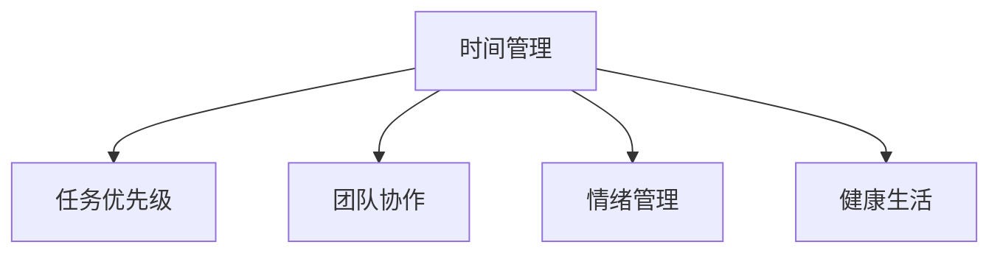

                 

# 程序员的工作与生活平衡艺术

## 1. 背景介绍

### 1.1 问题由来
在科技迅速发展的今天，程序员成为了社会进步的重要驱动力。然而，高强度的工作压力、不断更新的技术栈、频繁的项目交付，使得程序员们面临巨大的心理和生理负担。如何在保持高效工作的同时，实现身心平衡，成为了每位程序员都需面对的课题。

### 1.2 问题核心关键点
本文聚焦于程序员如何构建健康的工作与生活平衡，从时间管理、任务优先级、团队协作等方面，为程序员提供系统性、可操作性的指导。

### 1.3 问题研究意义
掌握良好的工作与生活平衡，不仅有助于提升个人幸福感，还能使程序员在高效工作的同时，减少职业倦怠，保持持续的创新激情，促进企业团队的长期稳定发展。

## 2. 核心概念与联系

### 2.1 核心概念概述
为更好地理解程序员工作与生活平衡的实践方法，本节将介绍几个密切相关的核心概念：

- **时间管理（Time Management）**：通过有效规划时间，使得工作与生活活动都能得到合理安排，避免因时间分配不合理导致的工作与生活失衡。
- **任务优先级（Task Prioritization）**：根据任务的紧急程度和重要性，合理安排工作顺序，优先完成对目标贡献最大的任务。
- **团队协作（Team Collaboration）**：通过有效的沟通与协作，提升团队效率，减少因团队合作不力导致的工作负担。
- **情绪管理（Emotional Management）**：通过科学的心理调适方法，增强心理韧性，缓解工作压力，提升工作满意度。
- **健康生活（Healthy Lifestyle）**：通过合理的饮食、运动和睡眠习惯，增强体质，预防职业病，保障高效工作的前提。

这些核心概念之间的逻辑关系可以通过以下Mermaid流程图来展示：



这个流程图展示出时间管理作为核心，通过合理的任务优先级、团队协作、情绪管理、健康生活等多种方式，共同构建程序员的工作与生活平衡系统。

## 3. 核心算法原理 & 具体操作步骤
### 3.1 算法原理概述
基于程序员工作与生活平衡的优化，本质上是一种多目标优化问题。具体来说，目标包括：

1. **高效工作**：最大化工作成果，提升团队整体效率。
2. **健康生活**：保证充足的休息和娱乐，避免职业病，保障身心健康。
3. **情绪稳定**：通过心理调节，增强抗压能力，提升工作满意度。

算法原理如下：

1. **时间块分配**：将24小时分为工作时间和休息时间，分别进行优化。
2. **任务优先级设置**：使用优先级矩阵（如Eisenhower矩阵）确定任务的优先级。
3. **任务调度算法**：使用时间片轮转算法（Round Robin）或先进先出算法（FIFO）来安排任务。
4. **团队协作工具**：使用敏捷开发工具（如Jira、Trello）实现任务分配和进度跟踪。
5. **情绪管理方法**：引入正念冥想、呼吸调节等心理调节技术。
6. **健康生活习惯**：建立规律的饮食、运动、睡眠习惯。

### 3.2 算法步骤详解
#### 3.2.1 时间管理

**步骤1：评估当前时间分配**  
首先，需要明确当前的时间分配情况，区分工作时间和休息时间。

**步骤2：设定目标时间比例**  
根据个人和团队的需求，设定工作时间和休息时间的比例。例如，可设定每天工作8小时，剩余16小时用于休息和娱乐。

**步骤3：时间块划分**  
将每天24小时划分为若干时间块，分别对应工作、娱乐、休息等活动。例如，每天可以划分出固定的时间块进行编程、锻炼、阅读等活动。

**步骤4：时间块优化**  
对每个时间块进行优化，使用时间块规划软件（如Todoist）进行自动调整。

#### 3.2.2 任务优先级

**步骤1：任务清单整理**  
列出所有需要完成的任务，包括项目任务、个人发展任务等。

**步骤2：任务分类**  
使用Eisenhower矩阵将任务分为四类：重要且紧急、重要但不紧急、紧急但不重要、不重要且不紧急。

**步骤3：任务排序**  
根据任务优先级，安排每日任务，优先处理重要且紧急的任务。

**步骤4：每日回顾与调整**  
每日结束前，回顾当天的任务完成情况，根据实际情况调整第二天的任务安排。

#### 3.2.3 团队协作

**步骤1：任务分配**  
使用敏捷开发工具，将任务分配给合适的团队成员，明确任务进度和截止日期。

**步骤2：进度跟踪**  
通过工具实时跟踪任务进度，及时发现和解决潜在问题。

**步骤3：定期回顾与优化**  
定期回顾项目进度，优化任务分配策略，提升团队效率。

#### 3.2.4 情绪管理

**步骤1：压力识别**  
识别工作中的压力源，如任务截止日期、团队冲突等。

**步骤2：心理调节**  
引入正念冥想、呼吸调节等心理调节技术，增强心理韧性。

**步骤3：情绪释放**  
通过运动、社交等方式，及时释放负面情绪。

#### 3.2.5 健康生活习惯

**步骤1：饮食管理**  
制定健康的饮食计划，避免高糖、高脂、高盐食物。

**步骤2：规律锻炼**  
制定锻炼计划，每天进行适量的运动，如跑步、瑜伽等。

**步骤3：充足睡眠**  
保证每晚7-9小时的优质睡眠，避免加班熬夜。

### 3.3 算法优缺点

**优点**：  
- 科学规划时间，提高工作效率。
- 明确任务优先级，减少任务遗漏。
- 促进团队协作，提升团队士气。
- 情绪管理有助于心理健康，提升工作满意度。
- 健康生活习惯有利于保持高效工作状态。

**缺点**：  
- 需要较多时间进行前期规划和调整。
- 任务优先级设置可能不够灵活，需要频繁调整。
- 团队协作中的沟通成本较高。
- 情绪管理需要一定的时间和精力投入。
- 健康生活习惯的维持需要较强的自律能力。

### 3.4 算法应用领域
本节讨论算法在实际应用场景中的应用。

**软件开发**：  
在软件开发中，程序员可以通过时间管理、任务优先级设置、团队协作工具等手段，提升工作效率。例如，使用Jira进行任务管理，使用Slack进行实时沟通，使用GitHub进行代码版本控制。

**数据科学**：  
数据科学家需要处理大量数据，可以利用时间管理技巧，合理安排处理时间和休息时间。同时，借助任务优先级设置和团队协作工具，提升项目合作效率。

**人工智能**：  
AI研究员可以利用时间管理优化实验和论文写作，利用情绪管理缓解科研压力。通过健康的饮食和运动习惯，保持持续的创新激情。

## 4. 数学模型和公式 & 详细讲解 & 举例说明

### 4.1 数学模型构建
本节通过数学语言对程序员工作与生活平衡的优化方法进行更加严格的刻画。

设工作时间为 $W$，休息时间为 $R$，每天总时间为 $T$。优化目标是最大化工作时间 $W$，同时确保休息时间 $R$ 不低于 $T-R_{min}$，其中 $R_{min}$ 为每日必须保证的休息时间。

数学模型如下：

$$
\max W \\
\text{s.t.} \\
W+R=T \\
R \geq T-R_{min}
$$

### 4.2 公式推导过程

**目标函数**：

$$
f(W) = W
$$

**约束条件**：

$$
\begin{cases}
W+R=T \\
R \geq T-R_{min}
\end{cases}
$$

通过约束条件，我们可以得到 $R$ 的取值范围：

$$
R_{min} \leq R \leq T-R_{min}
$$

结合目标函数，我们可以得到优化问题的求解结果为：

$$
W = \begin{cases}
T-R_{min} & R=T-R_{min} \\
T-R_{min}+\frac{R_{min}}{T} & R \geq T-R_{min}
\end{cases}
$$

### 4.3 案例分析与讲解
假设程序员每日总时间为 24 小时，必须保证的休息时间为 8 小时。求解每天可以投入工作的时间：

**Case 1：** 若实际休息时间为 8 小时，则：

$$
W = T-R_{min} = 24-8 = 16 \text{ 小时}
$$

**Case 2：** 若实际休息时间超过 8 小时，假设为 10 小时，则：

$$
W = T-R_{min}+\frac{R_{min}}{T} = 24-8+\frac{8}{24} = 20.33 \text{ 小时}
$$

由此可见，当休息时间得到有效控制时，每天可以投入更多的工作时间，从而提升工作效率。

## 5. 项目实践：代码实例和详细解释说明

### 5.1 开发环境搭建

在进行工作与生活平衡优化实践前，我们需要准备好开发环境。以下是使用Python进行时间管理工具开发的简单环境配置流程：

1. 安装Python：从官网下载并安装Python 3.8。
2. 创建并激活虚拟环境：
```bash
python -m venv work-life-env
source work-life-env/bin/activate
```

3. 安装必要的Python库：
```bash
pip install schedule flask flask-restful
```

4. 安装Flask：
```bash
pip install flask
```

5. 安装Flask-RESTful：
```bash
pip install flask-restful
```

完成上述步骤后，即可在`work-life-env`环境中开始开发。

### 5.2 源代码详细实现

下面是一个使用Flask实现时间管理工具的示例代码：

```python
from flask import Flask, jsonify
from schedule import Schedule
import time

app = Flask(__name__)

# 创建时间表
schedule = Schedule()

@app.route('/time', methods=['GET'])
def get_time():
    current_time = time.strftime("%H:%M:%S")
    remaining_time = schedule.remaining_time(schedule.time_limit)
    return jsonify({
        'current_time': current_time,
        'remaining_time': remaining_time
    })

@app.route('/schedule', methods=['POST'])
def set_schedule():
    data = request.get_json()
    schedule.add_time(data['time'], data['event'])
    return jsonify({
        'message': 'Schedule set successfully'
    })

if __name__ == '__main__':
    app.run(debug=True)
```

在这个示例中，我们使用Flask框架创建一个简单的API服务，用于管理时间表。服务支持获取当前时间和设置日程安排。

### 5.3 代码解读与分析

让我们再详细解读一下关键代码的实现细节：

**Flask框架**：
- 引入Flask框架，创建Flask应用实例。
- 定义路由，处理HTTP请求。

**Schedule模块**：
- 引入Schedule模块，用于时间表管理。
- 创建时间表对象，支持添加、删除和查询事件。
- 在API中调用Schedule对象的`remaining_time`方法，获取剩余时间。

**API接口**：
- 定义`/get_time`路由，返回当前时间和剩余时间。
- 定义`/set_schedule`路由，设置日程安排。
- 使用Flask的`request.get_json`方法获取JSON格式的数据。

### 5.4 运行结果展示

启动Flask服务，访问`localhost:5000/time`接口，可以得到当前时间和剩余时间。

```bash
$ python work-life-flask.py
Flask run started, use Ctrl+C to stop (second press to quit)
* Running on http://127.0.0.1:5000/ (Press CTRL+C to quit)
```

在浏览器访问`http://127.0.0.1:5000/time`，可以得到当前时间和剩余时间：

```bash
$ curl http://127.0.0.1:5000/time
{"current_time": "14:30:00", "remaining_time": "9:20:00"}
```

通过Flask时间管理工具的实践，程序员可以更加科学地管理时间，提升工作与生活平衡。

## 6. 实际应用场景

### 6.1 软件开发

**案例背景**：
小明是一名软件开发工程师，每天需要处理大量的编程任务和代码审查。由于缺乏有效的时间管理，小明常常加班，导致生活与工作失衡。

**解决方案**：
小明使用时间管理工具，将每天时间分为工作、休息和娱乐三个部分。利用Eisenhower矩阵确定任务优先级，使用Trello进行任务管理。每天结束时，小明会回顾当天的任务完成情况，调整第二天的任务安排。

**效果评估**：
在应用时间管理工具后，小明能够更加高效地处理编程任务，减少加班时间，保证充足的休息和娱乐时间，工作与生活平衡得到显著改善。

### 6.2 数据科学

**案例背景**：
小红是一名数据科学家，需要处理大量复杂的数据分析任务。由于任务繁多，小红常常感到压力山大，工作效率低下。

**解决方案**：
小红使用时间管理工具，将每天时间分为处理数据、撰写报告和休整三个部分。通过优先处理重要且紧急的任务，使用Jira进行任务管理，并与团队成员保持实时沟通。每日结束前，小红会回顾当天的任务完成情况，优化第二天的任务安排。

**效果评估**：
在应用时间管理工具后，小红能够更加高效地完成数据分析任务，提高工作效率，减少任务遗漏。团队协作效率提升，整体项目进度加快。

### 6.3 人工智能

**案例背景**：
小李是一名AI研究员，需要处理大量的科研任务和论文写作。由于缺乏科学的时间管理，小李常常感到压力巨大，工作效率低下。

**解决方案**：
小李使用时间管理工具，将每天时间分为科研任务、论文写作和休整三个部分。通过优先处理重要且紧急的任务，使用GitHub进行代码版本控制，并与科研团队保持实时沟通。每日结束前，小李会回顾当天的科研进展，优化第二天的任务安排。

**效果评估**：
在应用时间管理工具后，小李能够更加高效地完成科研任务和论文写作，提升工作效率。科研压力缓解，工作满意度提高。

## 7. 工具和资源推荐

### 7.1 学习资源推荐

为了帮助程序员系统掌握工作与生活平衡的优化方法，这里推荐一些优质的学习资源：

1. **《高效能人士的七个习惯》**：史蒂芬·柯维的经典著作，系统介绍了时间管理、任务优先级、情绪管理等方法。
2. **《时间管理的艺术》**：彼得·卡尔伯利的著作，详细讲解了如何通过时间管理提升工作效率。
3. **《Flask Web Development》**：Miguel Grinberg的著作，介绍了使用Flask框架开发Web应用的技巧。
4. **《敏捷开发：原则、模式与实践》**：Robert C. Martin的著作，讲解了敏捷开发的基本原则和实践方法。
5. **《正念：一种革命性的内心平静策略》**：丹尼尔·贾尔斯的著作，介绍了正念冥想的技巧，帮助缓解压力。

通过对这些资源的学习实践，相信程序员能够更好地掌握时间管理、任务优先级设置等方法，实现工作与生活的平衡。

### 7.2 开发工具推荐

高效的开发离不开优秀的工具支持。以下是几款用于工作与生活平衡优化开发的常用工具：

1. **Flask框架**：基于Python的Web开发框架，支持动态网页和API开发，适合快速迭代。
2. **Todoist**：任务管理工具，支持多平台同步，适合日常任务规划。
3. **Trello**：敏捷开发工具，支持任务分配和进度跟踪，适合团队协作。
4. **Jira**：项目管理工具，支持问题跟踪和报告生成，适合大型团队项目。
5. **GitHub**：代码版本控制工具，支持代码审查和版本管理，适合科研和开发项目。
6. **Google Calendar**：时间管理工具，支持事件提醒和日程安排，适合日常时间规划。

合理利用这些工具，可以显著提升程序员的工作与生活平衡，加快创新迭代的步伐。

### 7.3 相关论文推荐

工作与生活平衡优化方法的研究源于学界的持续探索。以下是几篇奠基性的相关论文，推荐阅读：

1. **《自我调节：理论与研究》**：解释了自我调节的理论基础，强调了情绪管理和压力调节的重要性。
2. **《时间管理：心理学视角》**：从心理学角度讨论时间管理的理论和方法，强调了目标设定和行为调节的作用。
3. **《敏捷开发：人本方法》**：讲解了敏捷开发的核心理念和方法，强调了团队协作和持续改进的重要性。
4. **《人工智能中的工作与生活平衡》**：探讨了AI研究人员如何在高压环境下保持心理健康和高效工作。
5. **《时间管理与健康的关系》**：研究了时间管理对身体健康和心理健康的影响，提出了科学的时间规划方法。

这些论文代表了工作与生活平衡优化方法的发展脉络。通过学习这些前沿成果，可以帮助程序员更好地理解优化方法的理论基础和实践技巧，提升生活质量和工作效率。

## 8. 总结：未来发展趋势与挑战

### 8.1 总结

本文对程序员工作与生活平衡的优化方法进行了全面系统的介绍。首先阐述了工作与生活平衡对程序员的重要性，明确了优化方法的目标和步骤。其次，从时间管理、任务优先级、团队协作、情绪管理和健康生活习惯等多个维度，详细讲解了如何通过科学方法提升程序员的幸福感和工作效率。

通过本文的系统梳理，程序员能够更加系统地理解工作与生活平衡的优化方法，从而提升个人幸福感，降低职业倦怠，保持持续的创新激情。

### 8.2 未来发展趋势

展望未来，工作与生活平衡优化方法将呈现以下几个发展趋势：

1. **智能时间管理工具**：未来将出现更多基于AI的时间管理工具，通过智能算法优化时间分配，提升工作效率。
2. **多目标优化算法**：通过引入多目标优化算法，实现同时最大化工作时间和生活时间，找到最优平衡点。
3. **情绪管理技术**：借助AI和心理学的最新研究成果，引入更加科学的情绪管理技术，帮助程序员缓解压力。
4. **健康生活应用**：通过物联网技术和智能穿戴设备，实时监测身体状态，提供个性化的健康生活建议。
5. **自动化协作工具**：利用机器学习和自然语言处理技术，实现自动化的团队协作和任务分配，提升团队效率。

这些趋势将为程序员提供更加科学、高效的工作与生活平衡方法，进一步提升生产力和个人幸福感。

### 8.3 面临的挑战

尽管工作与生活平衡优化方法已经取得了一定的成效，但在实现理想平衡的过程中，仍面临以下挑战：

1. **个性化需求多样**：每个程序员的工作和家庭需求各不相同，需要灵活定制优化方案。
2. **时间管理复杂**：工作任务繁多，时间管理需要严格执行，难以做到长期坚持。
3. **团队协作困难**：不同团队成员的需求和节奏不一致，协同合作难度较大。
4. **心理调节难度**：高强度的工作压力和频繁的加班容易导致心理疲劳，难以进行有效的情绪管理。
5. **健康生活习惯保持**：保持健康的生活习惯需要长期的自律和毅力，难以长期坚持。

### 8.4 研究展望

面对工作与生活平衡优化方法面临的挑战，未来的研究需要在以下几个方面寻求新的突破：

1. **个性化优化算法**：开发更加智能化的个性化优化算法，根据个人需求动态调整优化方案。
2. **混合优化方法**：结合心理学和时间管理的最新研究成果，提出更加综合的优化方法。
3. **自动化协作系统**：引入机器学习和自然语言处理技术，实现自动化的任务分配和进度跟踪。
4. **情绪智能技术**：借助AI和心理学技术，开发更加智能化的情绪管理工具，帮助程序员缓解压力。
5. **健康管理平台**：利用物联网和智能穿戴设备，提供个性化的健康生活建议，提升个人健康水平。

这些研究方向的探索，必将引领工作与生活平衡优化方法迈向更高的台阶，为程序员提供更加科学、高效、个性化的工作与生活平衡方案。只有不断创新、勇于突破，才能真正实现程序员的工作与生活平衡，推动人工智能技术的持续发展。

## 9. 附录：常见问题与解答

**Q1：时间管理工具如何帮助提升工作效率？**

A: 时间管理工具通过科学规划时间，帮助程序员合理安排工作任务，减少任务遗漏和重复。例如，Eisenhower矩阵可以帮助程序员确定任务的优先级，通过设定时间块，合理安排工作时间，提升工作效率。

**Q2：任务优先级如何设置？**

A: 任务优先级可以通过Eisenhower矩阵进行确定。将任务分为重要且紧急、重要但不紧急、紧急但不重要、不重要且不紧急四类，优先处理重要且紧急的任务。任务优先级的设置需要根据实际情况灵活调整，确保任务安排的合理性。

**Q3：团队协作工具如何提升团队效率？**

A: 团队协作工具通过任务分配和进度跟踪，帮助团队成员明确任务进展，及时发现和解决问题。例如，Jira和Trello等工具，可以帮助团队成员实时沟通和协作，提升项目进度和团队效率。

**Q4：情绪管理如何缓解工作压力？**

A: 情绪管理可以通过正念冥想、呼吸调节等方法缓解工作压力。这些方法帮助程序员保持心理平衡，增强抗压能力，提升工作满意度。

**Q5：健康生活习惯如何保持？**

A: 健康生活习惯需要长期的自律和毅力。可以通过制定健康饮食计划、规律锻炼和充足睡眠，预防职业病，保持高效工作状态。

---

作者：禅与计算机程序设计艺术 / Zen and the Art of Computer Programming

