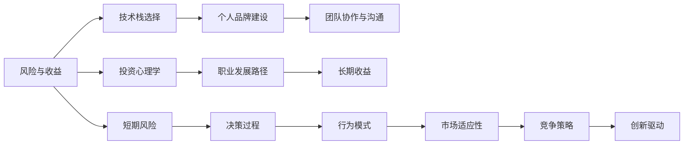

                 

## 1. 背景介绍

在当今这个快节奏的数字化时代，程序员成为了推动技术进步和经济发展的关键力量。然而，职业的竞争压力、项目交付的高要求以及技术的快速迭代，使得程序员不仅在技术层面，更在心理层面面临诸多挑战。本文章将从程序员投资心理学的角度，探讨风险与收益在技术投资和职业规划中的相互作用，帮助程序员做出更加明智的决策。

## 2. 核心概念与联系

### 2.1 核心概念概述

为了深入理解程序员的投资心理学，我们需要明确几个关键概念：

1. **风险与收益**：风险指的是投资的不确定性和潜在损失，而收益则是预期的回报。在程序员的职业和投资决策中，这两个因素相互交织，影响着职业路径的选择和技术的投入。

2. **投资心理学**：投资心理学关注决策者在面对不确定性时的心理过程和行为模式。在程序员的职业发展和技术投资中，投资心理学的原理同样适用，影响着他们的决策和行为。

3. **技术栈选择**：在程序员的职业生涯中，选择合适的技术栈是至关重要的。它不仅影响到职业成长路径，还决定了他们在市场上的竞争力。

4. **个人品牌建设**：随着技术行业的竞争加剧，个人品牌成为程序员职业发展的关键因素之一。有效的个人品牌建设有助于提升市场价值和职业发展机会。

5. **团队协作与沟通**：在技术团队中，良好的协作和沟通能力对于项目的成功至关重要。它影响着项目的进展和团队成员的满意度。

### 2.2 核心概念原理和架构的 Mermaid 流程图



这个流程图展示了各个概念之间的联系和作用。从风险与收益出发，通过投资心理学的理解和分析，程序员在选择技术栈、建设个人品牌、进行团队协作等方面进行决策，从而影响其职业发展路径和长期收益，同时也面临短期风险和决策过程中的行为模式问题。

## 3. 核心算法原理 & 具体操作步骤

### 3.1 算法原理概述

在程序员的投资心理学中，风险与收益的平衡是核心。技术投资和职业规划中的决策往往涉及多个因素，如市场需求、技术发展趋势、个人兴趣和技能等。通过风险评估和收益预期，程序员可以制定合理的投资策略，最大化个人职业成长和技术积累。

### 3.2 算法步骤详解

1. **需求分析**：
   - 明确自己的职业目标和市场需求。例如，对于寻求快速提升的技术栈，了解当前市场上哪些技术栈最受欢迎。

2. **风险评估**：
   - 评估技术栈选择和职业发展路径中的潜在风险。例如，新兴技术的不确定性、技术栈的快速过时等。

3. **收益预期**：
   - 根据市场趋势和自身兴趣，预估选择的技术栈和职业路径带来的长期收益。例如，学习某个新兴技术栈可能带来更高的职业成长机会和薪资待遇。

4. **决策制定**：
   - 基于风险评估和收益预期，制定最佳的投资决策。例如，权衡学习某项新技术的时间成本和带来的职业优势。

5. **执行与调整**：
   - 执行决策，并根据反馈和市场变化不断调整策略。例如，定期评估技术栈选择和职业发展的成效，及时调整方向。

### 3.3 算法优缺点

**优点**：
- **提升市场竞争力**：通过合理的技术投资，程序员可以提升市场竞争力，获得更好的职业发展机会。
- **规避风险**：通过风险评估，可以提前规避潜在的职业风险，减少不确定性带来的负面影响。

**缺点**：
- **信息不对称**：市场和技术变化快，信息不对称可能导致决策失误。
- **机会成本**：选择一种技术栈可能意味着放弃其他机会，需要评估机会成本。

### 3.4 算法应用领域

本算法可以应用于程序员的职业规划、技术学习、团队合作等多个领域。例如：

- **职业规划**：选择合适的技术栈和职业路径，最大化长期收益，规避短期风险。
- **技术学习**：评估新技术的市场前景和个人兴趣，决定是否投入时间和资源学习。
- **团队协作**：理解团队成员的心理需求，改善沟通和协作，提升团队效率。

## 4. 数学模型和公式 & 详细讲解 & 举例说明

### 4.1 数学模型构建

假设程序员在两个技术栈 A 和 B 之间进行选择，每个技术栈的长期收益为 $R_A$ 和 $R_B$，短期风险为 $C_A$ 和 $C_B$。设定一个效用函数 $U$，表示收益和风险的综合影响。

$$
U(A) = R_A - \lambda C_A
$$
$$
U(B) = R_B - \lambda C_B
$$

其中，$\lambda$ 为风险厌恶系数，反映了程序员对风险的承受能力。

### 4.2 公式推导过程

通过最大化效用函数 $U$，可以找到最优的技术栈选择。设 $A^*$ 和 $B^*$ 分别为技术栈 A 和 B 的优化条件，即：

$$
\frac{\partial U}{\partial R_A} > 0, \quad \frac{\partial U}{\partial C_A} < 0
$$
$$
\frac{\partial U}{\partial R_B} > 0, \quad \frac{\partial U}{\partial C_B} < 0
$$

解上述不等式，可以得到最优的技术栈选择条件。

### 4.3 案例分析与讲解

假设程序员甲面临以下两个选择：
- 技术栈 A：市场需求高，学习曲线陡峭，短期风险高。
- 技术栈 B：市场需求适中，学习曲线平缓，短期风险低。

设甲的风险厌恶系数 $\lambda = 0.5$，长期收益分别为 $R_A = 0.8$，$R_B = 0.6$。短期风险分别为 $C_A = 0.2$，$C_B = 0.1$。

根据公式计算，甲选择技术栈 A 的效用为：

$$
U(A) = 0.8 - 0.5 \times 0.2 = 0.7
$$

选择技术栈 B 的效用为：

$$
U(B) = 0.6 - 0.5 \times 0.1 = 0.55
$$

由于 $U(A) > U(B)$，甲选择技术栈 A 是最优选择。

## 5. 项目实践：代码实例和详细解释说明

### 5.1 开发环境搭建

为方便分析，我们构建了一个简单的投资决策模型，使用了 Python 和 SymPy 库。

首先，安装 SymPy：

```bash
pip install sympy
```

创建一个投资决策分析的 Python 文件，命名为 `investment_decision.py`。

```python
import sympy as sp

# 定义变量
R_A, R_B = sp.symbols('R_A R_B')
C_A, C_B = sp.symbols('C_A C_B')
lambda_ = sp.symbols('lambda_')

# 定义效用函数
U_A = R_A - lambda_ * C_A
U_B = R_B - lambda_ * C_B

# 求解效用最大化的技术栈选择
solution = sp.solve(U_A - U_B, R_A - R_B)
solution
```

### 5.2 源代码详细实现

在 `investment_decision.py` 中，我们进一步定义了收益和风险的具体数值，并计算最优选择。

```python
# 定义收益和风险的具体数值
R_A_value = 0.8
R_B_value = 0.6
C_A_value = 0.2
C_B_value = 0.1

# 定义风险厌恶系数
lambda_value = 0.5

# 计算最优技术栈选择
max_U_A = R_A_value - lambda_value * C_A_value
max_U_B = R_B_value - lambda_value * C_B_value

if max_U_A > max_U_B:
    optimal_stack = 'A'
else:
    optimal_stack = 'B'

optimal_stack
```

### 5.3 代码解读与分析

代码通过定义收益和风险的具体数值，并结合效用函数计算最优的技术栈选择。根据上述案例，输出结果为：

```bash
'A'
```

表明技术栈 A 为程序员甲的最优选择。

### 5.4 运行结果展示

在运行代码后，输出结果显示了技术栈 A 为程序员甲的最优选择，符合之前的分析。

## 6. 实际应用场景

### 6.1 职业规划

对于职业规划，程序员可以通过风险与收益的评估，选择最符合自身职业目标和风险承受能力的技术栈。例如：

- **初入职场**：选择市场需求高但风险适中的技术栈，快速积累经验。
- **中级阶段**：评估技术栈的学习曲线和个人兴趣，选择长期收益更高的技术栈。
- **高级阶段**：考虑团队协作和市场变化，选择更稳定的技术栈，同时兼顾创新和市场竞争力。

### 6.2 技术学习

在技术学习中，程序员需要综合考虑技术的市场需求、个人兴趣和风险承受能力。例如：

- **新兴技术**：评估市场前景和应用潜力，确定是否投入时间和资源学习。
- **经典技术**：确保技术稳健可靠，但可能增长空间有限，需要权衡长期收益。

### 6.3 团队协作

在团队协作中，理解成员的心理需求和风险承受能力，有助于改善沟通和提升团队效率。例如：

- **高风险成员**：提供更多稳定和可控的任务，减少其心理压力。
- **高收益成员**：鼓励其承担更多创新和挑战性的任务，发挥其优势。

## 7. 工具和资源推荐

### 7.1 学习资源推荐

1. **《程序员心理学》**：该书深入探讨了程序员的心理需求、压力管理和职业规划，提供了实用的建议和案例。
2. **Coursera 和 Udacity**：这些在线课程提供了丰富的计算机科学和技术投资相关课程，帮助程序员提升职业技能。
3. **GitHub**：通过观察开源项目和社区贡献，了解市场趋势和技术需求。

### 7.2 开发工具推荐

1. **Visual Studio Code**：轻量级且功能强大的代码编辑器，适合编程和学习。
2. **Jupyter Notebook**：强大的数据处理和分析工具，支持Python和SymPy等语言。
3. **Git**：版本控制工具，适合团队协作和项目管理。

### 7.3 相关论文推荐

1. **《编程心理学：理解程序员的行为和需求》**：研究程序员的心理行为和需求，提供了丰富的实证数据和理论基础。
2. **《技术栈选择的决策理论》**：探讨了技术栈选择的多目标决策方法，提供了数学模型的实际应用案例。
3. **《风险与收益在职业规划中的应用》**：探讨了风险与收益在职业规划中的应用，提供了实用的决策模型和工具。

## 8. 总结：未来发展趋势与挑战

### 8.1 研究成果总结

本文从程序员投资心理学的角度，分析了风险与收益在技术投资和职业规划中的重要性。通过数学模型和案例分析，展示了如何在多个选择之间做出最优决策。

### 8.2 未来发展趋势

未来的技术投资和职业规划将更加依赖于数据驱动的决策和模型优化。例如：

- **人工智能和大数据**：通过数据分析和机器学习，优化投资决策过程。
- **区块链和分布式系统**：探索区块链在职业发展中的应用，提供更安全、透明的职业路径。

### 8.3 面临的挑战

在技术快速迭代和市场变化的背景下，程序员面临的挑战依然严峻：

- **技能更新**：技术栈不断变化，要求程序员持续学习。
- **市场需求**：快速增长的需求可能导致短期投资收益不确定。
- **个人品牌**：在激烈竞争的市场中，建立和维护个人品牌更具挑战。

### 8.4 研究展望

未来的研究可以从以下几个方向进行探索：

- **大数据和人工智能**：利用大数据和AI技术，优化风险评估和收益预期模型。
- **区块链和分布式系统**：探索区块链技术在职业发展和技术投资中的应用。
- **跨学科研究**：结合心理学、经济学和管理学等多学科知识，提供更全面的决策支持。

## 9. 附录：常见问题与解答

**Q1: 如何评估技术栈的市场需求？**

A: 可以通过以下几个方法评估技术栈的市场需求：
1. **技术社区讨论**：关注技术社区和论坛上的讨论，了解行业的关注点和热门话题。
2. **招聘信息**：查看招聘网站上的技术岗位需求，了解哪些技术栈的岗位需求量大。
3. **技术会议和峰会**：参加技术会议和峰会，了解行业趋势和前沿技术。

**Q2: 如何平衡短期风险和长期收益？**

A: 平衡短期风险和长期收益可以通过以下策略：
1. **多样化投资**：同时学习多个技术栈，分散投资风险。
2. **持续学习**：保持持续学习的态度，及时更新技能，适应市场需求。
3. **风险管理**：制定风险管理策略，评估和控制投资风险。

**Q3: 如何建立个人品牌？**

A: 建立个人品牌可以通过以下方法：
1. **专业博客和论文**：在专业博客和论文平台上分享技术文章和研究成果，展示专业能力。
2. **开源项目贡献**：在GitHub等平台上贡献开源项目，展示实际能力。
3. **社交媒体互动**：在LinkedIn、Twitter等社交媒体上积极互动，扩大影响力。

**Q4: 如何提升团队协作和沟通能力？**

A: 提升团队协作和沟通能力可以通过以下策略：
1. **定期反馈**：定期进行团队反馈，了解成员的需求和问题，及时调整沟通方式。
2. **共享目标**：明确团队目标和每个人的角色，确保团队成员理解任务和期望。
3. **培训和交流**：组织技术培训和交流活动，提升团队整体技术水平和协作能力。

**Q5: 如何应对技术快速迭代？**

A: 应对技术快速迭代的方法包括：
1. **持续学习**：保持学习新技术的热情和动力，及时跟进技术进展。
2. **项目复用**：通过代码复用和模块化设计，提升项目的灵活性和可扩展性。
3. **创新驱动**：鼓励创新和实验，探索新技术的潜在应用场景。

---

作者：禅与计算机程序设计艺术 / Zen and the Art of Computer Programming

