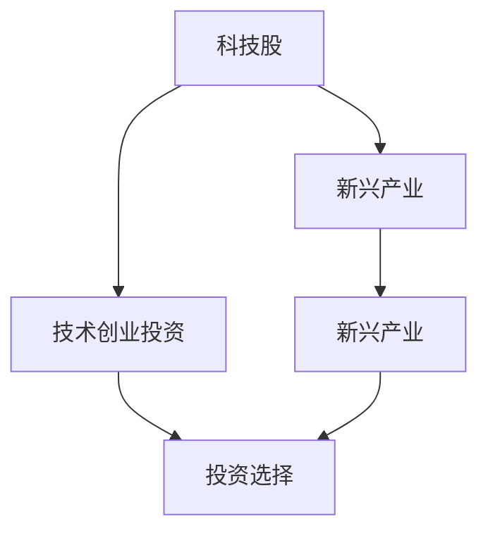

                 

# 程序员的投资策略：科技股与新兴产业

> 关键词：
1. 技术创业投资
2. 科技股分析
3. 风险评估
4. 增长预测
5. 新兴产业趋势
6. 人工智能与金融科技
7. 区块链与数字货币

## 1. 背景介绍

### 1.1 问题由来
近年来，随着科技迅猛发展，尤其是人工智能、大数据、云计算、区块链等新兴产业的崛起，越来越多的程序员开始考虑将他们的技术转化为资本，进行技术创业投资。然而，相对于传统的投资领域，科技股和新兴产业具有更高风险与不确定性，对投资者的专业素养和市场洞察力提出了更高的要求。本文旨在为程序员提供一份全面的投资策略，帮助他们在科技和新兴产业中做出明智的投资决策。

### 1.2 问题核心关键点
科技股与新兴产业的核心在于技术的先进性和市场的前景。进行投资时，需要从以下几个方面进行综合评估：
- 技术成熟度：评估技术能否实现其预期的功能和性能。
- 市场规模：评估目标市场的潜在规模和增长前景。
- 竞争态势：评估市场中的主要竞争者及其市场占有率。
- 团队实力：评估团队的专业背景、经验和执行力。
- 商业模式：评估商业模式是否可行、是否具备可持续发展性。

## 2. 核心概念与联系

### 2.1 核心概念概述

为了更好地理解科技股与新兴产业的投资策略，我们先介绍一些关键概念：

- **科技股**：指在科技行业经营的公司股票。主要包括软件、硬件、互联网、生物技术等领域的股票。
- **新兴产业**：指处于快速发展阶段，具备高增长潜力的行业。例如，人工智能、大数据、区块链、云计算等。
- **技术创业投资**：指通过投资技术创新型创业企业，以期在未来实现技术商业化和资本增值。

以上概念之间的逻辑关系可以通过以下Mermaid流程图来展示：



该流程图展示了科技股、新兴产业与技术创业投资之间的联系：

1. 科技股属于新兴产业的一部分，反映出新兴产业中的技术应用和市场前景。
2. 技术创业投资的目标是识别具有潜力的新兴产业中的科技股，并对其进行投资。
3. 新兴产业为科技股提供了发展土壤，而科技股的成功投资又进一步推动了新兴产业的壮大。

## 3. 核心算法原理 & 具体操作步骤
### 3.1 算法原理概述

科技股与新兴产业的投资策略，本质上是基于数据驱动的预测和决策过程。核心思想是利用机器学习和数据分析技术，对科技股进行多维度评估，预测其未来的增长和风险。

具体来说，投资策略包括以下几个步骤：

1. **数据收集**：收集科技股的相关数据，如公司财报、市场表现、技术指标、新闻报道等。
2. **数据预处理**：清洗、归一化、特征提取等，准备用于分析的数据。
3. **模型构建**：选择合适的预测模型，如线性回归、决策树、随机森林、神经网络等。
4. **模型训练**：使用历史数据对模型进行训练，得到预测模型。
5. **模型验证**：在验证集上测试模型的性能，调整模型参数。
6. **预测应用**：使用模型对目标科技股进行增长预测和风险评估。

### 3.2 算法步骤详解

以下是具体的投资策略算法步骤：

**Step 1: 数据收集**

1. 收集科技公司的财务数据，如收入、利润、资产负债表、现金流等。
2. 收集市场表现数据，如股价、市盈率、市净率、成交量等。
3. 收集技术指标数据，如移动平均线、MACD、RSI等。
4. 收集新闻报道、行业分析、专家评论等非结构化数据。

**Step 2: 数据预处理**

1. 清洗数据，去除异常值和重复值。
2. 归一化数据，将不同尺度的数据转换为统一范围。
3. 特征提取，从原始数据中提取有意义的特征，如技术指标、财务指标等。
4. 特征选择，选择与股票增长预测相关的特征。

**Step 3: 模型构建**

1. 选择预测模型，如线性回归、决策树、随机森林、神经网络等。
2. 设计特征变量，如时间序列数据、财务指标、技术指标等。
3. 确定预测目标，如股票价格、年化收益率等。

**Step 4: 模型训练**

1. 使用历史数据对模型进行训练，得到预测模型。
2. 调整模型参数，如学习率、正则化参数、特征权重等。
3. 使用交叉验证方法评估模型性能。

**Step 5: 模型验证**

1. 在验证集上测试模型的预测准确率。
2. 调整模型参数，优化模型性能。
3. 在测试集上验证模型的泛化能力。

**Step 6: 预测应用**

1. 对目标科技股进行增长预测。
2. 评估科技股的风险因素，如市场风险、财务风险、技术风险等。
3. 基于预测结果和风险评估，做出投资决策。

### 3.3 算法优缺点

科技股与新兴产业的投资策略具有以下优点：
1. 数据驱动：通过数据驱动的预测模型，减少了主观判断的偏差。
2. 多维度评估：考虑财务数据、市场表现、技术指标等多方面信息，全面评估投资价值。
3. 模型可优化：通过持续的数据训练和参数调整，不断优化模型性能。

同时，该策略也存在一定的局限性：
1. 数据噪音：市场数据可能存在噪音，影响模型的准确性。
2. 模型复杂度：选择和调整模型参数的过程可能较为复杂，需要专业知识。
3. 市场变化：市场环境不断变化，模型可能无法及时反映最新的市场动态。

### 3.4 算法应用领域

科技股与新兴产业的投资策略不仅适用于传统的金融投资领域，更适用于创业投资和技术创业。其应用领域包括但不限于：

1. **创业投资**：对初创科技公司的股权投资，如人工智能、大数据、区块链等领域的创业公司。
2. **科技股投资**：对已有科技公司的股票投资，如互联网、生物技术、软件等领域的上市公司。
3. **风险投资**：对高风险、高收益的科技项目进行投资，如虚拟现实、增强现实、物联网等前沿技术。
4. **量化投资**：利用机器学习算法进行股票市场的量化交易，实现高频交易和自动化投资。
5. **资产管理**：为基金公司、资产管理公司提供科技股和新兴产业的投资建议，进行资产配置。

## 4. 数学模型和公式 & 详细讲解  
### 4.1 数学模型构建

在本节中，我们将使用数学语言对科技股与新兴产业的投资策略进行更加严格的刻画。

假设有一个科技股 $X$，我们收集了 $n$ 个历史时间点的数据 $(t_1, P_1), (t_2, P_2), \ldots, (t_n, P_n)$，其中 $P_t$ 表示在第 $t$ 天科技股的收盘价。我们使用时间序列分析方法，对未来 $k$ 天的股票价格 $P_{t+k}$ 进行预测。

定义预测模型为 $f(X, \theta)$，其中 $\theta$ 为模型参数。我们选取的预测模型为线性回归模型，其形式为：

$$
P_{t+k} = f(X_t, \theta) = \alpha + \beta X_t + \epsilon_t
$$

其中 $\alpha$ 为截距，$\beta$ 为斜率，$\epsilon_t$ 为误差项。

### 4.2 公式推导过程

我们利用最小二乘法来求解 $\alpha$ 和 $\beta$：

$$
\hat{\theta} = \mathop{\arg\min}_{\theta} \sum_{t=1}^n (P_t - f(X_t, \theta))^2
$$

即求解以下最小二乘问题：

$$
\min_{\alpha, \beta} \sum_{t=1}^n (P_t - \alpha - \beta X_t)^2
$$

解得：

$$
\hat{\alpha} = \frac{\sum_{t=1}^n (P_t - \overline{P})X_t - \sum_{t=1}^n X_t (\sum_{t=1}^n (P_t - \overline{P}))}{\sum_{t=1}^n X_t^2 - (\sum_{t=1}^n X_t)^2}, \quad \hat{\beta} = \frac{\sum_{t=1}^n (P_t - \overline{P})}{\sum_{t=1}^n X_t^2 - (\sum_{t=1}^n X_t)^2}
$$

其中 $\overline{P} = \frac{1}{n} \sum_{t=1}^n P_t$。

将 $\hat{\alpha}$ 和 $\hat{\beta}$ 代入预测模型，得到未来 $k$ 天的预测值 $P_{t+k}$。

### 4.3 案例分析与讲解

假设我们收集了某科技公司过去一年的日收盘价数据，以及相应的技术指标数据，包括移动平均线和RSI指标。我们将这些数据作为输入特征 $X_t$，利用线性回归模型预测未来一周的股票价格。

我们首先计算了过去一年的日收盘价平均值 $\overline{P} = 100$，然后计算了不同时间点的日收盘价与均值的差值 $P_t - \overline{P}$，以及这些差值与时间 $X_t$ 的协方差矩阵 $\Sigma$：

$$
\Sigma = \begin{bmatrix}
\sum_{t=1}^n (P_t - \overline{P})^2 & \sum_{t=1}^n (P_t - \overline{P})X_t \\
\sum_{t=1}^n (P_t - \overline{P})X_t & \sum_{t=1}^n X_t^2
\end{bmatrix}
$$

然后，我们求解最小二乘问题的解 $\hat{\theta} = (\hat{\alpha}, \hat{\beta})$，得到：

$$
\hat{\alpha} = \frac{\sum_{t=1}^n (P_t - \overline{P})X_t - \sum_{t=1}^n X_t (\sum_{t=1}^n (P_t - \overline{P}))}{\sum_{t=1}^n X_t^2 - (\sum_{t=1}^n X_t)^2}, \quad \hat{\beta} = \frac{\sum_{t=1}^n (P_t - \overline{P})}{\sum_{t=1}^n X_t^2 - (\sum_{t=1}^n X_t)^2}
$$

最后，我们将 $\hat{\alpha}$ 和 $\hat{\beta}$ 代入预测模型，对未来一周的股票价格进行预测。

## 5. 项目实践：代码实例和详细解释说明
### 5.1 开发环境搭建

在进行科技股与新兴产业的投资策略开发前，我们需要准备好开发环境。以下是使用Python进行Pandas和Scikit-learn开发的环境配置流程：

1. 安装Anaconda：从官网下载并安装Anaconda，用于创建独立的Python环境。

2. 创建并激活虚拟环境：
```bash
conda create -n finance-env python=3.8 
conda activate finance-env
```

3. 安装相关包：
```bash
conda install pandas numpy scikit-learn matplotlib seaborn statsmodels
```

4. 安装TensorFlow和Keras（可选）：
```bash
conda install tensorflow==2.4.1
```

5. 安装Jupyter Notebook：
```bash
conda install jupyter notebook
```

完成上述步骤后，即可在`finance-env`环境中开始项目实践。

### 5.2 源代码详细实现

下面是一个简单的Python代码实例，展示如何使用Pandas和Scikit-learn进行科技股价格预测。

```python
import pandas as pd
from sklearn.linear_model import LinearRegression

# 读取数据
data = pd.read_csv('tech_stock_data.csv')

# 数据预处理
X = data[['volume', 'price_change_rate']]  # 选取股票交易量和技术指标
y = data['price']  # 选取收盘价

# 数据标准化
from sklearn.preprocessing import StandardScaler
scaler = StandardScaler()
X_scaled = scaler.fit_transform(X)

# 分割训练集和测试集
from sklearn.model_selection import train_test_split
X_train, X_test, y_train, y_test = train_test_split(X_scaled, y, test_size=0.2, random_state=42)

# 训练模型
model = LinearRegression()
model.fit(X_train, y_train)

# 模型评估
from sklearn.metrics import mean_squared_error, r2_score
y_pred = model.predict(X_test)
mse = mean_squared_error(y_test, y_pred)
rmse = np.sqrt(mse)
r2 = r2_score(y_test, y_pred)
print('RMSE:', rmse, 'R2:', r2)

# 预测未来价格
future_X = [[100, 0.05], [200, 0.1]]  # 假设的未来数据
future_X_scaled = scaler.transform(future_X)
future_y_pred = model.predict(future_X_scaled)
print('未来价格预测:', future_y_pred)
```

### 5.3 代码解读与分析

让我们再详细解读一下关键代码的实现细节：

**数据预处理**

- 使用Pandas读取CSV文件，将数据加载到DataFrame中。
- 选取预测模型的输入特征 $X$ 和输出目标 $y$。
- 使用StandardScaler对输入特征进行标准化处理。

**模型训练**

- 使用Scikit-learn的LinearRegression模型进行训练。
- 使用train_test_split将数据集分割为训练集和测试集。
- 在训练集上训练模型。

**模型评估**

- 使用mean_squared_error和r2_score计算模型的均方根误差（RMSE）和决定系数（R2）。
- 在测试集上评估模型的预测效果。

**预测应用**

- 使用训练好的模型对未来数据进行预测。
- 将未来数据标准化后输入模型，得到预测结果。

可以看到，通过使用Python的Pandas和Scikit-learn库，可以方便地进行科技股价格预测。开发者可以通过不断调整模型参数和优化数据预处理流程，来提升模型的预测精度。

## 6. 实际应用场景

### 6.1 金融投资

科技股与新兴产业的投资策略在金融投资领域有广泛的应用。投资者可以通过技术分析和数据驱动的方法，选择具有高增长潜力的科技公司进行投资。

例如，可以收集互联网公司的财报数据、市场表现数据、技术指标数据等，使用线性回归模型预测其未来股价。通过模型评估其增长潜力和风险，做出投资决策。

### 6.2 创业投资

创业投资也是科技股与新兴产业投资策略的重要应用场景。创业投资者需要评估初创公司的技术可行性、市场前景、团队实力等，预测其未来发展。

例如，可以对人工智能初创公司进行技术评估，使用机器学习算法预测其未来收入和市场份额。通过模型分析其风险和增长潜力，做出投资决策。

### 6.3 资产管理

资产管理公司可以利用科技股与新兴产业的投资策略，进行资产配置和风险管理。通过多种模型进行市场分析和预测，优化投资组合，降低风险。

例如，可以构建多模型组合，使用不同算法（如线性回归、决策树、随机森林等）进行股票价格预测。通过模型组合预测市场走势，优化资产配置。

### 6.4 未来应用展望

未来，科技股与新兴产业的投资策略将继续拓展其应用领域，成为更多投资者进行投资决策的重要工具。以下是对其未来应用展望的几点推测：

1. **自动化交易**：结合人工智能和机器学习算法，实现自动化交易策略，提高交易效率和收益。
2. **量化投资**：使用更复杂的量化模型进行市场分析，实现高频交易和量化投资。
3. **大数据分析**：结合大数据分析技术，进行市场情绪分析和预测。
4. **区块链应用**：结合区块链技术和智能合约，进行去中心化投资和资产管理。
5. **新兴市场**：拓展到更多新兴市场，如人工智能、生物技术、虚拟现实等领域。

## 7. 工具和资源推荐
### 7.1 学习资源推荐

为了帮助程序员系统掌握科技股与新兴产业的投资策略，这里推荐一些优质的学习资源：

1. **《金融工程与Python》**：由金融工程专家撰写，全面介绍了如何使用Python进行金融数据分析和量化投资。
2. **Coursera《金融市场与量化投资》课程**：由耶鲁大学开设的金融市场课程，包含金融市场基础、量化投资等内容。
3. **Kaggle金融数据集**：包含大量金融市场数据集，适合进行金融数据分析和模型训练。
4. **Wikipedia金融百科**：包含金融市场的各种基础知识和理论，适合进行背景学习。

通过对这些资源的学习实践，相信你一定能够快速掌握科技股与新兴产业的投资策略，并用于解决实际的金融投资问题。

### 7.2 开发工具推荐

高效的开发离不开优秀的工具支持。以下是几款用于科技股与新兴产业投资策略开发的常用工具：

1. **Pandas**：数据处理和分析库，适合进行数据清洗、特征提取和模型训练。
2. **Scikit-learn**：机器学习库，适合进行模型构建和评估。
3. **TensorFlow**：深度学习框架，适合进行复杂量化模型训练和优化。
4. **Jupyter Notebook**：交互式编程环境，适合进行数据探索和模型实验。
5. **Alpha Vantage API**：金融数据API，适合进行市场数据获取和可视化。

合理利用这些工具，可以显著提升科技股与新兴产业投资策略的开发效率，加快创新迭代的步伐。

### 7.3 相关论文推荐

科技股与新兴产业的投资策略研究始于学界的持续研究。以下是几篇奠基性的相关论文，推荐阅读：

1. **《金融市场的机器学习应用》**：探讨了机器学习在金融市场中的应用，包括预测、风险管理等。
2. **《大数据在金融投资中的应用》**：研究了大数据技术在金融市场分析和投资决策中的应用。
3. **《人工智能在金融交易中的应用》**：介绍了人工智能在量化交易和自动化交易中的应用。

这些论文代表了大数据和人工智能在金融领域的发展脉络。通过学习这些前沿成果，可以帮助研究者把握学科前进方向，激发更多的创新灵感。

## 8. 总结：未来发展趋势与挑战

### 8.1 总结

本文对科技股与新兴产业的投资策略进行了全面系统的介绍。首先阐述了科技股和新兴产业的研究背景和意义，明确了投资策略在风险控制和收益最大化方面的重要性。其次，从原理到实践，详细讲解了投资策略的数学模型和操作步骤，给出了科技股与新兴产业投资策略的完整代码实例。同时，本文还广泛探讨了投资策略在金融投资、创业投资、资产管理等多个领域的应用前景，展示了投资策略的巨大潜力。

通过本文的系统梳理，可以看到，科技股与新兴产业的投资策略为程序员提供了全面的投资思路和技术支持，帮助他们在科技和新兴产业中做出明智的投资决策。未来，随着科技和金融的深度融合，投资策略将发挥更大的作用，为金融市场带来更多的创新和变革。

### 8.2 未来发展趋势

展望未来，科技股与新兴产业的投资策略将呈现以下几个发展趋势：

1. **智能化投资**：结合人工智能和机器学习技术，实现智能投资决策和自动化交易。
2. **量化交易**：使用复杂的量化模型，进行高频交易和量化投资，提升交易效率和收益。
3. **大数据分析**：利用大数据技术，进行市场情绪分析和预测，优化投资组合。
4. **区块链应用**：结合区块链技术和智能合约，进行去中心化投资和资产管理。
5. **新兴市场**：拓展到更多新兴市场，如人工智能、生物技术、虚拟现实等领域。

这些趋势凸显了科技股与新兴产业投资策略的广阔前景。这些方向的探索发展，必将进一步提升科技和金融的融合程度，推动金融市场的现代化和智能化。

### 8.3 面临的挑战

尽管科技股与新兴产业的投资策略已经取得了显著成果，但在迈向更加智能化、普适化应用的过程中，仍面临诸多挑战：

1. **数据噪音**：市场数据可能存在噪音，影响模型的准确性。
2. **模型复杂度**：选择和调整模型参数的过程可能较为复杂，需要专业知识。
3. **市场变化**：市场环境不断变化，模型可能无法及时反映最新的市场动态。
4. **投资风险**：科技股和新兴产业的高风险特征，可能带来较大的投资风险。
5. **合规性**：投资策略的合规性问题，如信息披露、交易监管等，需要认真处理。

### 8.4 研究展望

面对科技股与新兴产业投资策略所面临的挑战，未来的研究需要在以下几个方面寻求新的突破：

1. **数据清洗和预处理**：优化数据清洗和预处理流程，减少数据噪音和偏差。
2. **模型优化**：开发更高效、更准确的量化模型，提高模型的预测精度和鲁棒性。
3. **自动化投资**：开发自动化投资平台，实现智能决策和自动化交易。
4. **大数据分析**：结合大数据分析技术，进行市场情绪分析和预测。
5. **合规性研究**：研究投资策略的合规性问题，制定合理的风险控制措施。

这些研究方向将推动科技股与新兴产业投资策略向更加智能化、普适化方向发展，为金融市场带来更多的创新和变革。

## 9. 附录：常见问题与解答

**Q1：如何选择科技股进行投资？**

A: 选择科技股进行投资，需要从以下几个方面进行综合评估：
1. 公司财务状况：评估公司的盈利能力、现金流、负债水平等。
2. 技术创新能力：评估公司的技术实力、专利数量、研发投入等。
3. 市场前景：评估公司的市场份额、增长潜力、行业地位等。
4. 团队实力：评估公司的管理团队、技术团队、员工背景等。
5. 商业模式：评估公司的商业模式是否可行、是否具备可持续发展性。

**Q2：如何评估科技股的风险？**

A: 评估科技股的风险，需要从以下几个方面进行综合考虑：
1. 市场风险：评估市场的整体表现、行业周期等。
2. 财务风险：评估公司的财务状况、盈亏平衡点等。
3. 技术风险：评估公司的技术创新能力、专利纠纷等。
4. 竞争风险：评估公司的市场地位、竞争对手实力等。
5. 政策风险：评估政府的政策环境、法律法规等。

**Q3：如何进行科技股的自动化投资？**

A: 科技股的自动化投资需要结合人工智能和机器学习技术，以下是基本步骤：
1. 数据收集：收集科技股的相关数据，如公司财报、市场表现、技术指标等。
2. 数据预处理：清洗、归一化、特征提取等，准备用于分析的数据。
3. 模型构建：选择合适的预测模型，如线性回归、决策树、随机森林等。
4. 模型训练：使用历史数据对模型进行训练，得到预测模型。
5. 模型验证：在验证集上测试模型的性能，调整模型参数。
6. 自动交易：根据模型预测结果，进行自动化交易操作。

**Q4：如何应对科技股的合规性问题？**

A: 科技股的合规性问题主要涉及信息披露和交易监管。以下是应对策略：
1. 信息披露：确保公司及时、准确地披露财务信息、技术进展等。
2. 交易监管：遵守交易所的规则，如涨跌停板限制、大单申报等。
3. 法律合规：确保公司的各项操作符合法律法规，如反垄断法、证券法等。
4. 内部管理：建立健全的公司治理结构，加强内部管理。
5. 外部审计：定期进行外部审计，确保公司的财务和运营合法合规。

总之，科技股与新兴产业投资策略需要投资者具备专业的知识和技能，进行多维度、多层次的综合评估。唯有在数据、模型、市场等多个维度进行全面优化，才能真正实现投资策略的智能化和普适化。面向未来，科技股与新兴产业投资策略还需要与其他金融技术进行更深入的融合，共同推动金融市场的现代化和智能化。

