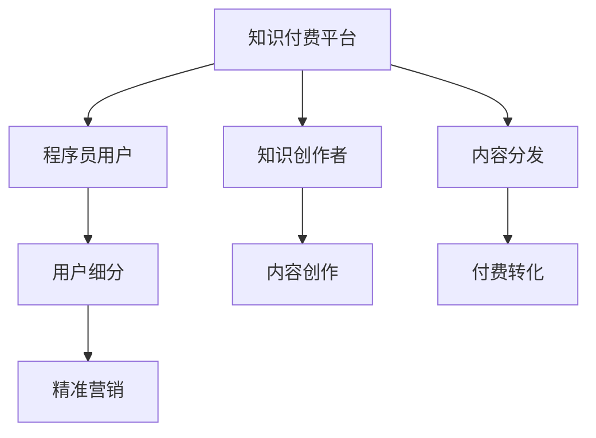

                 

# 程序员的知识付费用户细分与精准营销

## 1. 背景介绍

### 1.1 问题由来
随着互联网的快速发展，知识付费市场逐步壮大，程序员作为知识付费的核心用户群体之一，其在IT领域的知识付费行为日益受到关注。一方面，程序大牛、技术专家等在知识付费平台上分享实战经验、技术总结、项目案例等内容，吸引了大量程序员用户订阅和学习。另一方面，越来越多的初创公司也涌现出来，他们通过提供技术文章、编程教程、项目模板等付费产品，开拓程序员市场，抢占市场份额。在此背景下，程序员的知识付费用户细分和精准营销成为了摆在面前的重要课题。

### 1.2 问题核心关键点
程序员知识付费市场具有高度的个性化需求和多样化的用户特征，这就要求营销活动必须精准、精细，才能有效提升用户转化率和市场占有率。因此，问题主要集中在：
1. 如何根据程序员的不同特征、需求和行为，对用户进行细分？
2. 如何针对细分后的用户群体，设计出精准的营销策略？
3. 如何利用数据驱动，优化用户细分与营销策略，实现转化率的提升？

## 2. 核心概念与联系

### 2.1 核心概念概述

为了更好地理解程序员知识付费用户细分与精准营销的问题，本节将介绍几个关键的概念：

- **知识付费平台**：为知识创造者提供变现渠道，为知识消费者提供获取知识的平台，主要包括知乎、阮一峰网站、掘金等。
- **程序员用户**：通过付费方式获取特定知识或资源的用户群体，具有较强的学习动力和需求。
- **用户细分**：将整体用户市场按照不同维度进行划分，形成更为精准的目标用户群体。
- **精准营销**：通过数据驱动，实现对目标用户群体有针对性的营销，提高营销效果和投资回报率。

这些概念之间存在密切联系，形成了一个有机的知识付费生态系统，共同支撑着程序员知识付费市场的发展。

### 2.2 核心概念原理和架构的 Mermaid 流程图



这个流程图展示了知识付费平台的核心架构，以及用户细分和精准营销在这个架构中的作用。平台负责内容和用户的创造、分发和转化，用户细分和精准营销则帮助平台更好地理解用户需求，优化内容和营销策略，从而提升转化率。

## 3. 核心算法原理 & 具体操作步骤

### 3.1 算法原理概述

程序员知识付费用户细分与精准营销的本质是一种数据驱动的用户行为分析与营销策略优化。其核心原理如下：

1. **用户行为分析**：通过收集、分析和挖掘程序员用户在知识付费平台上的行为数据（如浏览时间、付费频次、内容偏好等），识别出不同用户群体的行为特征。
2. **用户细分**：基于用户行为分析结果，将用户分为不同的细分群体，每个群体具有较为一致的特征和需求。
3. **营销策略优化**：针对不同细分群体，设计出精准的营销策略，以提升用户转化率和满意度。

### 3.2 算法步骤详解

下面将详细介绍基于数据驱动的程序员知识付费用户细分与精准营销的具体步骤。

#### Step 1: 数据收集与处理

数据是进行用户细分与精准营销的基础。需要收集以下数据：

- 用户基本信息：如年龄、职业、工作年限等。
- 用户行为数据：如浏览历史、付费记录、互动评论等。
- 内容互动数据：如点赞、收藏、评论、分享等。

通过这些数据，可以构建用户画像，为后续分析提供支持。

#### Step 2: 用户行为分析

利用数据挖掘和机器学习技术，对用户行为数据进行分析，识别出不同用户群体的特征和需求。主要步骤包括：

- 用户群体划分：根据用户行为数据，使用聚类算法（如K-means、GMM等）将用户分为不同的群体。
- 特征提取：对每个群体，提取其核心行为特征，如高频访问时间、偏好内容类型、付费行为等。
- 用户画像构建：结合用户基本信息和行为特征，构建每个群体的用户画像，形成清晰的群体特征描述。

#### Step 3: 用户细分

基于用户行为分析和用户画像的结果，将用户细分为不同的群体。主要方法包括：

- 基于行为的细分：如按访问时长、付费频次、内容互动等细分。
- 基于兴趣的细分：如按内容类型、技术栈、应用场景等细分。
- 基于属性的细分：如按年龄、职业、工作年限等细分。

#### Step 4: 营销策略优化

针对不同的用户细分群体，设计出精准的营销策略。主要步骤包括：

- 策略设计：结合用户画像和行为特征，设计针对不同群体的内容推荐、定价策略、优惠活动等。
- 策略实施：将策略应用到实际营销活动中，监测效果并调整。
- 效果评估：评估营销策略的效果，如转化率、用户满意度等，形成闭环。

### 3.3 算法优缺点

基于数据驱动的程序员知识付费用户细分与精准营销具有以下优点：

- **精准性高**：通过数据分析和用户画像，可以更准确地识别出目标用户群体的特征和需求。
- **效果显著**：针对不同群体设计个性化营销策略，可以显著提升用户转化率和满意度。
- **易于优化**：基于数据反馈，可以不断优化策略，形成闭环。

同时，该方法也存在以下局限性：

- **数据质量依赖**：数据分析和用户画像的准确性依赖于数据质量，数据不全或噪音较大可能导致分析结果失真。
- **技术门槛较高**：需要一定的数据科学和机器学习知识，对数据处理和算法实现有较高要求。
- **成本投入大**：数据收集、处理和分析需要一定的投入，且不同策略的尝试和优化过程可能会占用较多的时间和资源。

## 4. 数学模型和公式 & 详细讲解 & 举例说明

### 4.1 数学模型构建

为了更好地进行程序员知识付费用户细分与精准营销，构建了以下数学模型：

- **用户行为矩阵**：$X \in \mathbb{R}^{n \times m}$，其中$n$表示用户数量，$m$表示不同行为特征数量。
- **用户群体矩阵**：$Y \in \mathbb{R}^{m \times k}$，其中$k$表示不同用户群体数量。
- **用户行为系数矩阵**：$C \in \mathbb{R}^{n \times k}$，表示每个用户属于每个群体的权重。

### 4.2 公式推导过程

主要公式包括：

- **聚类算法**：$C = \arg \min_{C} || X \times Y^T - C ||_F^2$，其中$|| \cdot ||_F$表示Frobenius范数。
- **用户群体划分**：$Y = \arg \min_{Y} || X - C \times Y^T ||_F^2$，求解最优的用户群体矩阵$Y$。
- **策略优化**：$P = \arg \max_{P} \sum_i C_i \times P_i$，其中$P$表示不同策略的效果，$C_i$表示第$i$个用户属于第$i$个群体的权重。

### 4.3 案例分析与讲解

以程序员在知识付费平台上阅读编程书籍为例，进行用户行为分析和用户细分。

假设某个知识付费平台上有10万名用户，其中编程书籍有10000种。根据用户行为数据，使用K-means算法将用户分为3个群体，每个群体具有不同的行为特征，如访问时长、付费频次等。然后，针对每个群体设计不同的营销策略，如推荐不同的编程书籍、提供不同的优惠活动等。

## 5. 项目实践：代码实例和详细解释说明

### 5.1 开发环境搭建

为了进行程序员知识付费用户细分与精准营销的实践，需要先搭建好开发环境。具体步骤如下：

1. 安装Python环境：在本地或云服务器上安装Python 3.7或以上版本，并配置好虚拟环境。
2. 安装相关库：安装NumPy、Pandas、Scikit-learn、Keras等常用库，用于数据处理和模型训练。
3. 准备数据集：收集程序员用户的基本信息和行为数据，并进行预处理，如数据清洗、特征工程等。
4. 搭建计算集群：如果有大规模数据或复杂模型，可以搭建基于分布式计算的集群环境，如Spark或Hadoop等。

### 5.2 源代码详细实现

下面给出一个基于Python的程序员知识付费用户细分与精准营销的代码实现示例：

```python
import pandas as pd
import numpy as np
from sklearn.cluster import KMeans
from sklearn.metrics import silhouette_score

# 数据准备
data = pd.read_csv('user_data.csv')
X = data[['access_time', 'purchase_frequency', 'book_rating']]

# 用户行为分析
kmeans = KMeans(n_clusters=3, random_state=0)
kmeans.fit(X)

# 用户群体划分
Y = kmeans.cluster_centers_
scores = silhouette_score(X, kmeans.labels_, metric='euclidean')

# 输出结果
print('User clusters:', Y)
print('Silhouette score:', scores)
```

### 5.3 代码解读与分析

在上述代码中，首先导入了必要的库，然后对数据进行了处理和分析。使用K-means算法将用户分为3个群体，并计算了聚类效果的Silhouette分数，以评估聚类结果的质量。

## 6. 实际应用场景

### 6.1 智能内容推荐

知识付费平台可以利用用户细分和精准营销的结果，设计智能内容推荐系统，向用户推荐其感兴趣的内容。比如，针对编程书籍爱好者，推荐最新的技术书籍和教程；针对系统架构师，推荐相关的架构设计和实践经验。通过这种推荐，提升用户粘性和满意度。

### 6.2 个性化活动设计

平台可以根据用户细分结果，设计个性化的活动，吸引用户参与。如针对初学者设计入门编程挑战，针对中级开发者设计技术分享会，针对高级开发者设计高级技术讲座。通过个性化的活动，提升用户参与度和忠诚度。

### 6.3 精准广告投放

平台可以利用用户细分结果，进行精准的广告投放。比如，针对不同技术栈的用户群体，投放不同的广告素材，展示不同的广告内容。通过这种精准的广告投放，提升广告效果和用户转化率。

### 6.4 未来应用展望

未来，随着数据科学的进一步发展，程序员知识付费用户细分与精准营销将更加高效和智能。通过更先进的机器学习算法，可以更准确地识别用户行为特征和需求，从而设计更加个性化的营销策略。同时，随着云计算和大数据技术的普及，数据处理和分析的成本将进一步降低，用户细分和精准营销的效果将更加显著。

## 7. 工具和资源推荐

### 7.1 学习资源推荐

为了帮助程序员更好地理解知识付费用户细分与精准营销，推荐以下学习资源：

1. **《数据科学导论》**：由Coursera等平台提供的免费课程，系统介绍数据科学的基础知识和应用。
2. **《Python数据科学手册》**：由O'Reilly出版社出版的书籍，详细介绍了Python在数据科学中的应用。
3. **Kaggle**：全球知名的数据科学竞赛平台，提供大量真实的数据集和模型，供学习和实践。
4. **K-means算法讲解**：K-means算法是聚类分析中常用的算法之一，以下是Pandas官方文档中的讲解和示例：https://pandas.pydata.org/pandas-docs/stable/user_guide/clustering.html#k-means-clustering

### 7.2 开发工具推荐

为了提高程序员知识付费用户细分与精准营销的开发效率，推荐以下开发工具：

1. **Jupyter Notebook**：免费的交互式开发环境，支持Python、R等多种编程语言。
2. **PyCharm**：Google提供的Python IDE，具有丰富的功能插件和代码高亮。
3. **TensorBoard**：Google提供的可视化工具，支持TensorFlow和Keras等深度学习框架的模型可视化。
4. **Keras**：高层次的深度学习库，支持快速搭建和训练神经网络模型。
5. **Scikit-learn**：Python中的机器学习库，提供丰富的算法和工具。

### 7.3 相关论文推荐

以下是几篇关于程序员知识付费用户细分与精准营销的代表性论文，推荐阅读：

1. **《基于聚类分析的智能推荐系统研究》**：研究了聚类算法在智能推荐系统中的应用，展示了聚类分析和用户分群的实际效果。
2. **《程序员知识付费行为分析与营销策略优化》**：结合程序员知识付费市场特点，提出了基于用户细分和精准营销的策略优化方法。
3. **《大规模数据驱动下的程序员知识付费平台用户细分与精准营销》**：利用大数据技术，对程序员用户行为进行分析，提出了相应的细分和营销策略。

## 8. 总结：未来发展趋势与挑战

### 8.1 总结

本文对程序员知识付费用户细分与精准营销方法进行了全面系统的介绍。首先阐述了程序员知识付费市场的研究背景和意义，明确了用户细分和精准营销在提升用户转化率和市场占有率方面的重要价值。其次，从原理到实践，详细讲解了用户细分和精准营销的数学模型、关键步骤和具体实现。最后，本文还探讨了用户细分和精准营销在智能内容推荐、个性化活动设计、精准广告投放等多个场景中的应用前景。

通过本文的系统梳理，可以看到，程序员知识付费用户细分与精准营销已经成为了知识付费市场中不可或缺的重要组成部分，极大地推动了知识付费技术的发展和应用。未来，随着数据科学的不断进步，程序员知识付费市场将迎来更多的技术创新和应用突破，为用户带来更多的价值和体验。

### 8.2 未来发展趋势

展望未来，程序员知识付费用户细分与精准营销将呈现以下几个发展趋势：

1. **数据驱动的增强**：利用大数据和机器学习技术，进一步提升用户细分和精准营销的精准性和有效性。
2. **用户行为分析的深化**：通过深入分析用户行为数据，识别出更丰富的行为特征和需求，提升细分结果的准确性。
3. **多渠道融合**：结合线上和线下的营销渠道，提供更加多样化的内容和活动，满足不同用户的需求。
4. **个性化服务的提升**：通过智能推荐和个性化活动设计，提升用户满意度和忠诚度，构建更加紧密的用户关系。
5. **数据隐私保护**：随着隐私保护法规的加强，如何在保护用户隐私的前提下，进行有效的用户细分和精准营销，将是未来的一个重要课题。

以上趋势凸显了程序员知识付费用户细分与精准营销技术的广阔前景。这些方向的探索发展，必将进一步提升知识付费市场的用户转化率和市场规模，为程序员社区带来更多的价值和机遇。

### 8.3 面临的挑战

尽管程序员知识付费用户细分与精准营销技术已经取得了显著进展，但在实现全面的智能推荐和精准营销的过程中，仍面临诸多挑战：

1. **数据隐私与安全**：如何在保护用户隐私的前提下，收集和分析用户数据，是一个需要解决的重要问题。
2. **用户隐私保护**：如何处理用户行为数据中的隐私信息，避免数据滥用和泄露，是用户细分和精准营销中不可忽视的挑战。
3. **数据质量与偏差**：数据质量的缺失和偏差可能导致用户细分的准确性下降，从而影响营销效果。
4. **模型复杂性**：在处理大规模数据和复杂用户行为时，需要采用更为复杂的模型，这会增加计算和分析的难度。
5. **资源消耗大**：用户细分和精准营销涉及大量数据处理和模型训练，对计算资源的需求较高，可能导致成本增加。

### 8.4 研究展望

面对程序员知识付费用户细分与精准营销所面临的挑战，未来的研究需要在以下几个方面寻求新的突破：

1. **隐私保护技术**：研究如何在大数据和用户隐私之间找到平衡点，实现用户行为数据的有效保护。
2. **数据清洗与处理**：开发高效的数据清洗与处理技术，提升数据质量和处理效率。
3. **模型优化与简化**：设计更加高效和可解释的模型，降低计算资源消耗，提升模型的应用效果。
4. **个性化推荐系统**：研究如何构建更加智能和个性化的推荐系统，提升用户满意度和粘性。
5. **数据驱动的营销优化**：结合用户行为分析结果，优化营销策略，提升广告效果和用户转化率。

## 9. 附录：常见问题与解答

**Q1：程序员知识付费用户细分与精准营销是否适用于其他领域？**

A: 程序员知识付费用户细分与精准营销方法可以应用于多个领域，如教育、金融、医疗等，只需要根据不同领域的用户特征和需求，进行相应的调整和优化。

**Q2：如何衡量用户细分的准确性？**

A: 用户细分的准确性可以通过多个指标来衡量，如Silhouette分数、轮廓系数、误差率等。这些指标可以评估不同聚类算法的效果，从而选择最优的聚类方案。

**Q3：如何进行用户行为数据的收集和处理？**

A: 用户行为数据的收集可以通过API接口、埋点统计等方式实现。在数据处理方面，需要对数据进行清洗、归一化、特征提取等预处理步骤，以便后续分析和建模。

**Q4：用户细分和精准营销的具体实现流程是怎样的？**

A: 用户细分和精准营销的实现流程主要包括数据收集、用户行为分析、用户群体划分、营销策略优化和效果评估等步骤。具体实现中，可以采用K-means、GMM、LDA等聚类算法，并结合机器学习和深度学习技术，进行分析和建模。

**Q5：如何提升数据处理和分析的效率？**

A: 提高数据处理和分析效率的关键在于采用高效的数据处理工具和技术，如分布式计算、并行处理、GPU加速等。此外，需要对数据进行合理的划分和管理，以便高效利用计算资源。

---

作者：禅与计算机程序设计艺术 / Zen and the Art of Computer Programming

