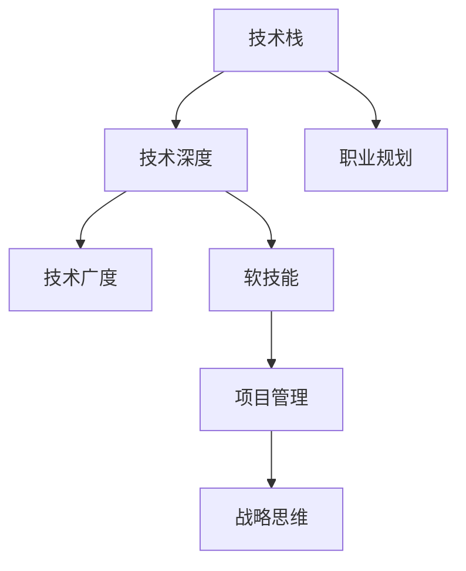

                 

# 程序员的职业生涯规划：30年路线图

> 关键词：职业发展,技术栈,技能提升,跨界协作,持续学习,项目管理

## 1. 背景介绍

### 1.1 问题由来

在快速变化的技术环境中，如何规划和发展一名程序员的职业生涯，成为了众多从业者共同关心的问题。一个30年的职业生涯规划，不仅能帮助个人制定明确的发展方向，还能为组织提供战略性的员工培养方案。

本文旨在为从事技术行业的开发者提供一份详尽的职业规划路线图，涵盖入门、进阶到资深专家的各个阶段。通过系统的指导，使开发者能够逐步提升技术能力，拓展职业视野，实现个人与企业共赢。

### 1.2 问题核心关键点

- **技术栈选择与构建**：程序员需了解并选择合适的技术栈，以应对不同阶段的技术需求。
- **技能提升与跨界协作**：程序员应持续提升技术能力和软技能，增强团队协作与跨领域合作能力。
- **项目管理与战略思维**：深入理解项目管理原则，并具备战略思维，以支持团队和项目的发展。
- **持续学习与创新**：保持学习和创新精神，适应技术快速演进，不断提升个人竞争力。

## 2. 核心概念与联系

### 2.1 核心概念概述

为更好地理解程序员职业规划路线图，本文将介绍几个关键概念：

- **技术栈**：指一个开发者精通并熟练使用的所有技术工具、框架和语言。
- **技术深度**：指对某一特定技术领域内原理、实现细节的掌握程度。
- **技术广度**：指对多个技术领域的综合理解与运用能力。
- **软技能**：指非技术方面的能力，如沟通、团队合作、项目管理等。
- **战略思维**：指理解企业战略、行业趋势，并从宏观角度进行决策的能力。

这些核心概念之间相互联系，共同构成了一个程序员职业生涯的完整图景。通过理解并实践这些概念，可以实现技术的不断深化、技能的全面提升，最终达到职业生涯的高峰。

### 2.2 核心概念原理和架构的 Mermaid 流程图



这个流程图展示了技术栈、技术深度、技术广度、软技能、项目管理、战略思维与职业规划之间的逻辑关系。技术栈和技能是基础，项目管理提升团队协作效率，战略思维从宏观角度引导方向，职业规划将技术与战略整合，共同支持职业生涯的发展。

## 3. 核心算法原理 & 具体操作步骤

### 3.1 算法原理概述

程序员的职业生涯规划，本质上是一个持续学习和发展的过程。其核心在于根据不同职业阶段的技术需求和个人兴趣，逐步构建和优化个人技术栈，同时不断提升软技能和项目管理能力。这一过程遵循一定的算法原理，具体分为以下几个步骤：

1. **入门阶段**：选择入门技术栈，初步了解行业应用和技术趋势。
2. **进阶阶段**：通过项目实践，深化技术栈，拓展技术广度。
3. **资深阶段**：成为技术专家，提升项目管理与战略思维。
4. **高峰阶段**：从技术专家向领导者转型，实现职业的全面升华。

### 3.2 算法步骤详解

#### 3.2.1 入门阶段

- **选择合适的技术栈**：根据行业需求和个人兴趣，选择入门技术栈。例如，初学者可以选择Python、JavaScript等易于上手的语言。
- **系统学习基础知识**：通过课程、书籍、在线教程等途径，学习编程语言、数据结构、算法、操作系统等基础知识。
- **参与开源项目**：参与开源社区，实际动手编写代码，积累项目经验。

#### 3.2.2 进阶阶段

- **深入技术栈**：选择一门编程语言或技术栈进行深入学习，掌握核心概念和高级应用。
- **拓展技术广度**：学习并使用其他相关技术，如数据库、缓存、中间件等，建立跨领域的技术能力。
- **提升软技能**：通过团队项目，提升沟通、协作、时间管理等软技能。

#### 3.2.3 资深阶段

- **成为技术专家**：在某个领域内成为专家，积累丰富的技术经验。
- **承担技术领导角色**：参与技术选型、架构设计等高阶工作，培养技术领导力。
- **提升项目管理能力**：学习敏捷开发、DevOps等项目管理方法，提升项目管理和领导能力。

#### 3.2.4 高峰阶段

- **向领导转型**：从技术专家转向技术领导者，关注战略规划和业务导向。
- **跨界合作**：与非技术团队合作，提升整体业务理解与战略思维。
- **持续创新与驱动**：通过技术驱动业务创新，提升组织的竞争力和市场地位。

### 3.3 算法优缺点

#### 3.3.1 优点

- **系统性**：通过明确的阶段划分，提供了全面、系统的职业规划路径。
- **实用性**：步骤详细，每个阶段都有具体的方法和工具，帮助实现职业目标。
- **适应性**：针对不同技术栈和行业需求，提供灵活的路线图。

#### 3.3.2 缺点

- **高度依赖个人**：路线图需要根据个人兴趣和能力进行调整，不一定适用于所有个体。
- **时间跨度大**：30年时间较长，过程中需不断调整和优化。
- **技术更新快**：技术栈和工具的变化速度快，需要不断学习新技术以适应变化。

### 3.4 算法应用领域

技术栈和职业发展路线图的应用领域广泛，涵盖软件开发、数据科学、人工智能、运维等多个领域。无论是前端、后端，还是全栈开发者，都能从中获益，提升职业素养和竞争力。

## 4. 数学模型和公式 & 详细讲解 & 举例说明

### 4.1 数学模型构建

本文中的数学模型主要基于时间序列分析和统计学习，用以描述职业生涯的发展轨迹。假设一名程序员在t年时具备的技能水平为 $S_t$，则其职业生涯规划可以表示为：

$$
S_{t+1} = f(S_t, \Delta S, \lambda_t)
$$

其中，$S_t$ 为当前技能水平，$f$ 为技能提升函数，$\Delta S$ 为年提升量，$\lambda_t$ 为该年学习的速度因子。

### 4.2 公式推导过程

假设 $\Delta S$ 为每年固定提升量，$\lambda_t$ 为年学习速度因子，通过求解微分方程：

$$
\frac{dS_t}{dt} = \lambda_t \Delta S
$$

可得：

$$
S_t = S_0 e^{\int_0^t \lambda_t dt}
$$

其中 $S_0$ 为起点技能水平。

### 4.3 案例分析与讲解

以软件开发为例，一名初级开发者在30年内从初级到高级的职业生涯规划：

- **初级阶段**（1-3年）：主要学习编程语言和基础知识，技能提升量较小，学习速度较快。
- **中级阶段**（3-10年）：深入技术栈，提升代码质量和系统设计能力，技能提升量逐渐增大，学习速度放缓。
- **高级阶段**（10-20年）：成为技术专家，主导项目技术选型和架构设计，技能提升量平缓，学习速度趋于稳定。
- **领导阶段**（20-30年）：转向技术领导，关注战略和技术驱动，技能提升量微小，学习速度下降。

## 5. 项目实践：代码实例和详细解释说明

### 5.1 开发环境搭建

为了实现上述路线图的计算，我们需要一个基于Python的开发环境，用于模拟技能提升过程和路径优化。

1. **安装Python**：选择Python 3.8或更高版本，通过Anaconda或Miniconda安装。
2. **设置虚拟环境**：使用conda创建虚拟环境，以隔离项目依赖。
3. **安装必要的库**：安装numpy、pandas、scipy、matplotlib等库，用于数据处理和可视化。
4. **准备数据**：准备技能提升和项目经历的模拟数据，如年数、技能提升量、学习速度等。

### 5.2 源代码详细实现

下面是一个简化的Python脚本，用于模拟技术栈和技能提升的过程：

```python
import numpy as np
import matplotlib.pyplot as plt

# 定义技能提升函数
def skill_upgrade(speeds, start_level, years):
    time = np.arange(0, years, 1)
    levels = start_level * np.exp(np.dot(time, speeds))
    return levels

# 定义学习速度
speeds = np.array([0.5, 0.3, 0.1, 0.05, 0.01])

# 定义初始技能水平
start_level = 50

# 模拟30年的技能提升
levels = skill_upgrade(speeds, start_level, 30)

# 绘制技能提升曲线
plt.plot(levels)
plt.xlabel('Years')
plt.ylabel('Skill Level')
plt.title('Skill Upgrade Over 30 Years')
plt.show()
```

### 5.3 代码解读与分析

- **技能提升函数**：根据学习速度和时间，计算技能提升量。
- **学习速度**：不同年份的学习速度，影响技能提升的速度。
- **初始技能水平**：起点技能水平，影响最终结果。
- **模拟30年的技能提升**：根据公式计算30年后的技能水平。
- **绘制技能提升曲线**：可视化技能提升过程。

## 6. 实际应用场景

### 6.1 软件开发

在软件开发领域，职业规划路线图具有重要意义。软件开发者需不断学习新技能，提升代码质量和系统设计能力，才能适应技术演进和行业需求。

### 6.2 数据科学

数据科学家需掌握多种数据处理和机器学习技术，具备跨领域的数据处理能力，通过不断学习和项目实践，提升专业素养。

### 6.3 人工智能

AI工程师需掌握深度学习、自然语言处理、计算机视觉等技术，具备解决复杂问题的能力，通过持续学习和实战，提升模型性能和创新能力。

### 6.4 运维

运维工程师需掌握云计算、自动化、网络安全等技术，具备系统的架构和管理能力，通过不断学习和项目实践，提升运维效率和安全性。

## 7. 工具和资源推荐

### 7.1 学习资源推荐

1. **Coursera**：提供众多高质量的在线课程，涵盖编程、数据科学、AI等技术领域。
2. **edX**：提供大学和机构课程，包括计算机科学、工程学等学科。
3. **Udacity**：提供纳米学位项目，注重实战技能的培养。
4. **Kaggle**：数据科学和机器学习的竞赛平台，提供实战项目和数据集。
5. **GitHub**：开源社区，提供丰富的技术项目和学习资源。

### 7.2 开发工具推荐

1. **Visual Studio Code**：轻量级、功能丰富的代码编辑器，支持多种语言和框架。
2. **Jupyter Notebook**：互动式编程环境，支持Python等科学计算语言。
3. **Git**：版本控制系统，支持协作开发和版本管理。
4. **Docker**：容器化技术，简化开发和部署过程。
5. **Docker Compose**：容器编排工具，管理多个容器的启动和运行。

### 7.3 相关论文推荐

1. **软件开发者职业成长路径研究**：研究软件开发者的职业成长路径，提供实践指导。
2. **终身学习与持续改进**：探讨终身学习在职业生涯中的重要性。
3. **跨界协作与团队建设**：研究跨领域协作的方法和工具。
4. **项目管理与战略思维**：探讨项目管理原则和战略思维的应用。

## 8. 总结：未来发展趋势与挑战

### 8.1 研究成果总结

本文系统阐述了程序员职业生涯的各个阶段及其技能要求，提出了一种技术栈选择和技能提升的路线图。通过实践，程序员可以不断提升技术深度和广度，拓展职业视野，实现职业生涯的全面升华。

### 8.2 未来发展趋势

未来技术栈和职业规划将继续演进，呈现出以下趋势：

1. **全栈技术栈**：前端、后端、数据科学等多领域技术整合，实现全面覆盖。
2. **云计算与分布式**：云计算、容器化、微服务架构等技术的应用，提升系统可扩展性和可维护性。
3. **人工智能与智能运维**：AI技术在运维中的应用，提升运维效率和智能化水平。
4. **DevOps与自动化**：持续集成、持续部署等自动化工具的应用，提升开发和运维效率。

### 8.3 面临的挑战

尽管职业规划路线图提供了明确的指导，但在实践中仍面临以下挑战：

1. **技术更新快**：需不断学习新技术以适应变化，保持技术领先。
2. **跨界协作难**：技术栈多样性带来的沟通挑战，需要跨领域合作能力的提升。
3. **项目管理复杂**：大型项目和跨团队协作的复杂性，需提升项目管理能力。
4. **持续学习压力大**：不断学习新技术，需平衡工作与个人时间。

### 8.4 研究展望

未来研究将重点关注以下方向：

1. **终身学习平台**：开发终身学习平台，提供定制化学习路径和资源。
2. **技术生态体系**：构建跨技术栈的技术生态体系，促进知识共享和协同创新。
3. **职业发展工具**：开发智能化的职业发展工具，辅助开发者规划和发展职业生涯。
4. **多模态技术**：探索多模态技术在职业规划中的应用，提升综合素养。

## 9. 附录：常见问题与解答

**Q1: 如何选择适合自己的技术栈？**

A: 选择技术栈需考虑个人兴趣、行业需求和长期发展目标。建议选择易于上手、应用广泛的编程语言和框架。

**Q2: 如何在职业生涯的不同阶段持续学习？**

A: 定期参加培训、阅读技术书籍和论文、参与开源项目，保持对新技术的敏感和关注。

**Q3: 如何提升团队协作能力？**

A: 多参与跨领域项目，学习团队沟通、协作和项目管理技巧，积累团队合作经验。

**Q4: 如何应对技术栈变化？**

A: 保持灵活性，快速学习和适应新技术，持续优化技术栈，保持技术竞争力。

**Q5: 如何实现职业升华？**

A: 积极参与高级项目和领导角色，提升技术领导力和战略思维，实现职业升华。

本文通过系统分析程序员职业生涯的关键阶段和技术栈选择，为从业者提供了全面的职业规划指导。在技术快速发展的今天，持续学习、技术迭代和跨界合作是职业生涯成功的关键。希望本文能为您提供有益的启示和指导，帮助您在技术旅程中不断前进，实现个人与企业共赢。

---

作者：禅与计算机程序设计艺术 / Zen and the Art of Computer Programming

