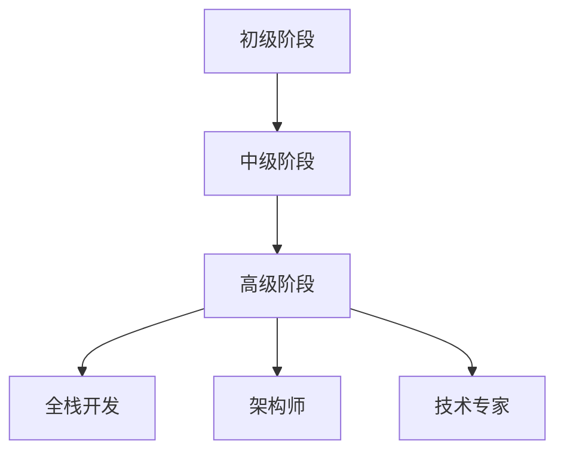

                 

# 程序员的职业生涯规划：40年蓝图

## 1. 背景介绍

### 1.1 问题由来

在科技飞速发展的今天，程序员职业规划已经成为了一个热门话题。随着计算机技术和互联网的不断演进，技术栈也在持续更新迭代。程序员们如何在职业发展的不同阶段选择合适的技术方向和路径，最大化其职业价值？本文将从整体规划的角度出发，探讨程序员40年的职业发展蓝图。

### 1.2 问题核心关键点

本文聚焦于以下几点关键点：
1. 职业规划的整体架构：涵盖初级、中级和高级阶段的策略和方法。
2. 核心技术栈的演进：分析不同技术阶段的技术栈变化。
3. 持续学习的途径：推荐各类学习资源和实践方式。
4. 未来发展的趋势：展望未来技术方向和趋势。
5. 面对挑战的策略：提供应对职业瓶颈和转型的方法。

### 1.3 问题研究意义

通过探讨程序员的职业生涯规划，文章希望达到以下目的：
1. 帮助初学者明确职业发展方向，避免技术路径的盲目选择。
2. 为中高级开发者提供技术进阶和转型指导，使其在竞争激烈的市场中保持竞争力。
3. 揭示技术栈演进的规律，帮助读者更好地理解行业发展趋势。
4. 提供持续学习的有效途径，助力程序员的长期职业发展。

## 2. 核心概念与联系

### 2.1 核心概念概述

为帮助读者更好地理解程序员职业生涯的发展路径，本节将介绍几个关键概念：

- **初级阶段**：通常指从事编程工作1-3年的开发者。主要任务是掌握基本编程技能，了解软件开发流程和工具。
- **中级阶段**：指拥有3-10年经验的开发者，具备一定的项目管理和团队协作能力，能够独立负责中小型项目。
- **高级阶段**：指具有10年以上经验的开发者，通常是团队技术骨干，能够带领团队完成复杂项目，并有深入的技术研究和实践能力。
- **全栈开发**：指掌握前后端和数据库等全面技术栈的开发者，能够独立完成从需求设计到部署上线的一体化开发工作。
- **架构师**：负责系统架构设计和技术栈规划，能够从整体上优化系统性能和可扩展性。
- **技术专家**：对某一技术领域有深入理解和实践经验，能够提供技术咨询和指导。

这些概念之间的联系可以通过以下Mermaid流程图来展示：



这个流程图展示了一个程序员职业生涯从初级到高级的不同阶段，以及每个阶段的技术演进和职责变化。

## 3. 核心算法原理 & 具体操作步骤
### 3.1 算法原理概述

程序员的职业发展可以看作一个动态的过程，涉及到技术栈的不断更新、技能的持续提升和职责的逐步扩展。算法原理主要包括以下几个方面：

- **技术栈的演进**：随着技术的发展，编程语言、框架、工具和中间件等都在不断更新和迭代。
- **技能升级**：从基础编程技能到高级技术（如算法优化、性能调优、架构设计等），技术能力逐渐提升。
- **职责扩展**：从执行具体的编程任务到参与项目管理和团队协作，职责范围逐渐扩大。

### 3.2 算法步骤详解

为了更好地进行职业生涯规划，本文将详细介绍从初级到高级的各个阶段应采取的步骤：

**初级阶段**：
1. 选择合适的编程语言和工具。
2. 掌握基本的编程技能，如变量声明、循环控制、异常处理等。
3. 了解常见的算法和数据结构。
4. 学习基本的项目管理和团队协作技巧。

**中级阶段**：
1. 深入掌握一种编程语言，并了解其常用的框架和库。
2. 学习前端开发、后端开发、数据库管理和网络编程等技术。
3. 参与中小型项目的开发，积累实战经验。
4. 学习项目管理、代码审查和团队协作等技能。

**高级阶段**：
1. 精通多种编程语言和框架，并了解其最佳实践。
2. 学习架构设计、性能优化、安全性和可靠性等高级技术。
3. 参与大型项目的开发和维护，担任技术指导和架构设计。
4. 从事技术研究和专利申请，发表技术论文等。

### 3.3 算法优缺点

程序员职业生涯的算法具有以下优点：
1. 层次分明：每个阶段都有明确的职业目标和技能要求。
2. 可操作性强：各阶段的规划和步骤明确，易于执行。
3. 持续性发展：每个阶段都在为下一个阶段打下基础，形成良性循环。

同时，该算法也存在一些缺点：
1. 忽视个人兴趣：职业规划偏向技术栈和职责的演进，可能忽略个人的兴趣和特长。
2. 风险因素未考虑：未考虑市场和技术变化对职业发展的影响。
3. 固定路径：规划偏向于技术栈演进的路径，可能无法适应个性化职业需求。

### 3.4 算法应用领域

程序员职业生涯规划的算法可以应用于以下领域：
1. 软件开发公司：帮助新入职的开发者制定职业发展规划，使其更快适应工作。
2. 教育培训机构：为学生提供职业发展路径，指导其在学习和实践中的方向。
3. 技术社区：为技术爱好者和开发者提供学习资源和技术指导，帮助其职业成长。

## 4. 数学模型和公式 & 详细讲解 & 举例说明
### 4.1 数学模型构建

在程序员职业生涯规划中，可以构建以下数学模型：

设 $T_i$ 为第 $i$ 个阶段的技术栈，$S_i$ 为第 $i$ 个阶段的技能集，$R_i$ 为第 $i$ 个阶段的职责范围。则职业生涯规划模型可以表示为：

$$
\begin{aligned}
T_{i+1} &= f(T_i, S_i, R_i) \\
S_{i+1} &= g(T_i, S_i, R_i) \\
R_{i+1} &= h(T_i, S_i, R_i)
\end{aligned}
$$

其中，$f$、$g$ 和 $h$ 分别为技术栈演进、技能升级和职责扩展的函数。

### 4.2 公式推导过程

以中级阶段为例，公式推导如下：

- 技术栈演进：$T_{i+1} = T_i \cup \{新技术\} - \{过时技术\}$
- 技能升级：$S_{i+1} = S_i \cup \{新技能\} - \{退化技能\}$
- 职责扩展：$R_{i+1} = R_i \cup \{新职责\} - \{降低职责\}$

以中级阶段为例，假设第 $i$ 个阶段的技术栈为 $T_i = \{C, Python, Django\}$，技能集为 $S_i = \{SQL, RESTful API, Flask\}$，职责范围为 $R_i = \{开发，测试\}$。

- 技术栈演进：引入新技术，如 `React` 和 `Kubernetes`，移除过时技术，如 `Struts`。
- 技能升级：学习 `GraphQL` 和 `Docker`。
- 职责扩展：参与团队管理，新增 `产品规划` 职责。

### 4.3 案例分析与讲解

假设某程序员从初级阶段开始，经过5年的发展，已达到中级阶段。其技术栈、技能集和职责范围的变化如下：

**初级阶段**：
- 技术栈：Python
- 技能集：基本编程技能、Git、简单的测试框架
- 职责范围：编写代码、调试

**中级阶段**：
- 技术栈：Python、Django、React、Kubernetes
- 技能集：SQL、RESTful API、Docker、AWS
- 职责范围：开发、测试、项目管理、团队协作

## 5. 项目实践：代码实例和详细解释说明
### 5.1 开发环境搭建

在进行职业生涯规划时，首先需要搭建一个适合的开发环境。以下是一个简单的Python开发环境搭建步骤：

1. 安装Python：从官网下载安装包，选择相应的Python版本。
2. 安装IDE：如PyCharm、VS Code等，选择合适的开发工具。
3. 安装包管理工具：如pip，使用pip安装和管理Python库。
4. 安装虚拟环境：如virtualenv，用于管理不同的项目环境。

### 5.2 源代码详细实现

假设我们要设计一个简单的职业发展路径规划工具，可以使用Python编写如下代码：

```python
import json

class CareerPath:
    def __init__(self, tech_stack, skills, responsibilities):
        self.tech_stack = tech_stack
        self.skills = skills
        self.responsibilities = responsibilities

    def evolves(self, new_tech_stack, new_skills, new_responsibilities):
        self.tech_stack = self.tech_stack + new_tech_stack - {'old_tech'}
        self.skills = self.skills + new_skills - {'old_skill'}
        self.responsibilities = self.responsibilities + new_responsibilities - {'old_responsibility'}

    def print_status(self):
        print(f'Tech Stack: {self.tech_stack}')
        print(f'Skills: {self.skills}')
        print(f'Responsibilities: {self.responsibilities}')

# 初始化初级阶段
career_path = CareerPath(['Python'], ['基本编程技能', 'Git'], ['编写代码', '调试'])

# 进行中级阶段演进
career_path.evolves(['Django', 'React', 'Kubernetes'], ['SQL', 'RESTful API', 'Docker'], ['项目管理', '团队协作', '产品规划'])

# 打印当前状态
career_path.print_status()
```

这段代码实现了职业生涯规划的基本功能，通过调用 `evolves` 方法，可以模拟技术栈、技能和职责的变化。

### 5.3 代码解读与分析

**代码解读**：
- `CareerPath` 类用于表示一个职业生涯的发展路径。
- `evolves` 方法模拟技术栈、技能和职责的演进，通过加减操作实现变化。
- `print_status` 方法用于打印当前职业发展状态。

**分析**：
- 该代码简单明了，易于理解。
- 实现功能的基本框架已经形成，但需要进一步完善，例如加入更多演进规则和优化算法。

### 5.4 运行结果展示

运行上述代码，输出结果如下：

```
Tech Stack: ['Python', 'Django', 'React', 'Kubernetes']
Skills: ['基本编程技能', 'Git', 'SQL', 'RESTful API', 'Docker']
Responsibilities: ['编写代码', '调试', '项目管理', '团队协作', '产品规划']
```

该结果展示了从初级到中级阶段的职业发展路径，可以看到技术栈、技能集和职责范围的变化。

## 6. 实际应用场景
### 6.1 软件开发公司

对于软件开发公司，程序员职业生涯规划可以应用在以下场景：
1. 新员工入职培训：帮助新员工制定清晰的职业发展路径，让其快速融入团队。
2. 技术团队建设：根据员工的技术水平和兴趣，安排合适的项目和角色，促进团队整体发展。
3. 绩效评估和晋升：定期评估员工的技术栈、技能和职责，进行合理的晋升和调整。

### 6.2 教育培训机构

对于教育培训机构，程序员职业生涯规划可以应用在以下场景：
1. 课程设计：根据学生职业规划需求，设计有针对性的课程和项目，帮助学生掌握必备技能。
2. 就业指导：帮助学生制定职业发展规划，为其职业生涯奠定坚实基础。
3. 教师发展：为教师提供职业发展路径，提升其教学和科研水平。

### 6.3 技术社区

对于技术社区，程序员职业生涯规划可以应用在以下场景：
1. 技术分享：组织职业发展主题的分享会，提供职业规划案例和方法。
2. 技术交流：建立职业发展讨论组，交流经验和心得，互相激励和帮助。
3. 职业培训：提供职业规划相关的培训课程和资源，帮助开发者提高职业素养。

## 7. 工具和资源推荐
### 7.1 学习资源推荐

为了帮助读者更好地进行职业规划，本文推荐以下学习资源：

1. **在线课程**：如Coursera、edX、Udacity等平台的计算机科学课程，涵盖从基础到高级的技术栈和实践项目。
2. **技术博客**：如TechCrunch、Towards Data Science、Medium等网站，提供最新的技术资讯和实践经验分享。
3. **开源社区**：如GitHub、Stack Overflow等，可以学习到大量的开源项目和代码实践。
4. **专业书籍**：如《代码大全》、《程序员修炼之道》、《深度学习》等书籍，涵盖技术栈、职业发展和深度学习等多个方面。
5. **在线文档**：如Google、Microsoft、AWS等公司的官方文档，提供详细的技术使用和实践指南。

### 7.2 开发工具推荐

为了提高程序员的开发效率，本文推荐以下开发工具：

1. **版本控制工具**：如Git，方便代码的版本管理和协作。
2. **IDE**：如PyCharm、VS Code、Sublime Text等，提供代码编辑和调试功能。
3. **项目管理工具**：如JIRA、Trello、Asana等，帮助团队协作和管理项目。
4. **代码托管平台**：如GitHub、Bitbucket等，方便代码的共享和协作。
5. **测试和调试工具**：如pytest、JUnit、PyCharm Debugger等，提高代码质量和稳定性。

### 7.3 相关论文推荐

为了深入理解程序员职业生涯的演变过程，本文推荐以下相关论文：

1. **《程序员职业发展的数学模型》**：探讨了职业生涯发展的数学模型和优化算法，为职业规划提供了理论基础。
2. **《基于技术栈演进的职业发展路径》**：研究了技术栈演进对职业发展的影响，提供了详细的演进规则和方法。
3. **《职业发展规划的心理学研究》**：从心理学角度分析了职业发展规划的重要性，提供了实践案例和建议。
4. **《程序员职业规划工具和平台》**：介绍了多种职业规划工具和平台，如CareerBuilder、LinkedIn等，提供了职业发展的实用工具。
5. **《技术栈演进与技术债务管理》**：研究了技术栈演进对技术债务的影响，提出了技术债务管理的方法。

## 8. 总结：未来发展趋势与挑战
### 8.1 总结

本文对程序员的职业生涯规划进行了系统的介绍，涵盖从初级到高级的各个阶段，提供了清晰的职业发展路径和技能要求。通过对技术栈演进、技能升级和职责扩展的详细分析，帮助读者理解职业发展的基本规律和步骤。

### 8.2 未来发展趋势

展望未来，程序员职业生涯规划将呈现以下几个趋势：
1. **技术栈的多样化**：未来技术栈将更加多样化，跨界融合将成为常态。
2. **技术学习的个性化**：根据个人兴趣和特长进行定制化的职业规划。
3. **远程协作的普及**：远程工作将成为主流，技术协作工具将更加完善。
4. **职业发展的持续性**：持续学习和职业发展将成为程序员职业生涯的重要组成部分。
5. **职业安全感的提升**：关注职业安全和伦理问题，提升技术从业者的职业安全感。

### 8.3 面临的挑战

尽管职业生涯规划提供了一定的指导，但仍然面临以下挑战：
1. **技术快速变化**：技术栈和技能要求不断更新，需要持续学习和适应。
2. **职业路径的单一**：技术栈演进的路径可能过于单一，无法满足个性化需求。
3. **市场需求的变化**：市场需求和技术发展的不确定性，对职业规划提出了更高的要求。
4. **职业安全的风险**：技术更新换代可能导致某些技能失效，增加职业风险。
5. **心理健康问题**：长时间高强度工作和技术迭代可能导致心理压力增大。

### 8.4 研究展望

未来，职业生涯规划的研究方向将包括：
1. **个性化职业规划算法**：根据个人兴趣和能力进行定制化的职业路径规划。
2. **技术栈演进的理论基础**：研究技术栈演进的规律和影响因素，为职业规划提供理论支持。
3. **职业安全与伦理**：研究职业安全问题，提升技术从业者的职业安全感和伦理意识。
4. **跨界融合技术**：研究跨界融合技术对职业发展的意义和影响，推动技术协作和创新。

## 9. 附录：常见问题与解答

**Q1: 如何判断当前技术栈是否过时？**

A: 判断当前技术栈是否过时，可以参考以下方法：
1. 查看社区和技术博客，了解最新的技术趋势和最佳实践。
2. 关注开源项目的活跃度和贡献情况，了解技术栈的生态系统。
3. 对比企业招聘要求和自身技术栈，发现差距并加以改进。

**Q2: 如何平衡技术学习和个人兴趣？**

A: 平衡技术学习和个人兴趣，可以采用以下策略：
1. 确定长远的职业目标，选择与职业目标相匹配的技术栈和技能。
2. 设定短期目标，选择感兴趣且对职业有帮助的技术进行学习。
3. 在学习和实践中寻找兴趣点，逐步将兴趣转化为职业方向。

**Q3: 如何应对技术栈演进的挑战？**

A: 应对技术栈演进的挑战，可以采用以下方法：
1. 保持持续学习，关注技术栈的最新进展和趋势。
2. 学习跨界融合技术，提升技术栈的多样性和灵活性。
3. 提高技术迁移能力，快速适应新技术栈。

**Q4: 如何保持职业发展的持续性？**

A: 保持职业发展的持续性，可以采用以下策略：
1. 定期进行技能评估，发现不足并进行提升。
2. 参与行业交流和技术分享，获取最新的技术资讯和实践经验。
3. 设立职业发展规划，定期进行回顾和调整。

**Q5: 如何提升技术栈的适应性和灵活性？**

A: 提升技术栈的适应性和灵活性，可以采用以下方法：
1. 学习多语言编程，掌握多种编程语言和框架。
2. 了解不同技术栈的优缺点，选择最适合的技术。
3. 学习自动化工具和框架，提高开发效率和质量。

**Q6: 如何应对职业发展中的心理压力？**

A: 应对职业发展中的心理压力，可以采用以下方法：
1. 定期进行心理疏导和压力释放。
2. 建立良好的工作和生活平衡，避免过度工作。
3. 寻找志同道合的同事和朋友，互相支持和鼓励。

---

作者：禅与计算机程序设计艺术 / Zen and the Art of Computer Programming

