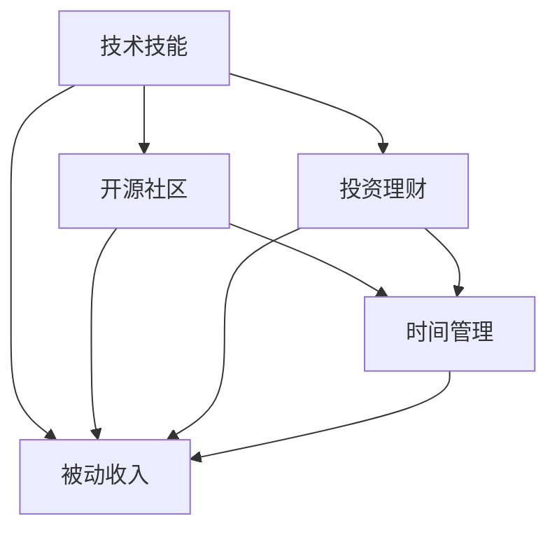

                 

# 程序员的被动收入：构建与维护

> 关键词：被动收入, 程序员, 编程, 代码, 开源社区, 软件开发, 投资理财, 收入来源

## 1. 背景介绍

### 1.1 问题由来
近年来，随着互联网和科技行业的迅猛发展，程序员的需求持续增长，薪资水平也显著提高。然而，传统的9-5上班模式和固定薪水收入，已经无法满足一部分程序员对于工作灵活性和收入多样化的需求。与此同时，互联网和开源社区中积累了大量高质量的代码和项目，程序员可以凭借自身技能，通过构建开源项目、打造开发工具、提供技术咨询服务等方式，获得被动收入。

在这样的背景下，探讨程序员如何构建并维护自己的被动收入来源，变得越来越重要。通过深入理解被动收入的构建和维护方法，程序员不仅可以在现有工作之余获得额外的收入来源，还能够加速技术积累和职业成长，提升生活质量。

### 1.2 问题核心关键点
构建被动收入的核心在于：

- **技术技能积累**：程序员需要具备足够的编程和项目管理能力，掌握构建和维护项目所需的核心技术。
- **开源社区参与**：积极参与开源社区项目，通过贡献代码、提交Bug、撰写文档等方式，积累项目经验和社区声誉。
- **投资理财知识**：理解基本的金融知识，了解投资理财的策略和方法，合理配置资产。
- **时间管理**：平衡工作、家庭和被动收入项目的时间，高效利用每一分每一秒。

本文将详细探讨程序员如何构建与维护被动收入，涵盖技术技能提升、开源社区参与、投资理财策略和时间管理四个方面。

## 2. 核心概念与联系

### 2.1 核心概念概述

构建被动收入需要掌握多个核心概念，这些概念之间存在紧密联系：

- **技术技能**：程序员应具备扎实的编程能力、良好的项目管理和代码组织技能。
- **开源社区**：参与开源项目不仅可以提升技术能力，还能积累社区声誉，拓展人脉。
- **投资理财**：合理配置资产，进行有效的投资理财，获取稳定的财务回报。
- **时间管理**：科学管理时间，平衡各种事务，高效产出被动收入。

这些概念构成了程序员被动收入构建的基础框架，彼此相辅相成，共同支撑被动收入的持续增长。

### 2.2 核心概念原理和架构的 Mermaid 流程图



这个流程图展示了核心概念之间的关系。程序员通过提升技术技能，参与开源社区项目，合理投资理财，科学管理时间，最终实现被动收入的构建和维护。

## 3. 核心算法原理 & 具体操作步骤

### 3.1 算法原理概述

构建被动收入的算法原理，主要是基于程序员的技能和项目经验，通过参与开源社区、投资理财等途径，实现资产的增值和稳定收益。

具体来说，算法包括以下步骤：

1. **技能评估**：评估自身的技术水平和项目经验，确定适合构建被动收入的领域。
2. **项目选择**：在选择的领域内，选择合适的开源项目或开发工具。
3. **贡献代码**：积极参与项目，贡献代码、修复Bug、撰写文档等。
4. **维护项目**：定期更新项目，保持代码质量和项目活跃度。
5. **投资配置**：根据自身风险承受能力，合理配置资产，进行投资理财。
6. **时间规划**：科学管理时间，高效产出被动收入。

### 3.2 算法步骤详解

以下是构建被动收入的详细步骤：

#### 3.2.1 技能评估

1. **自我评估**：列出自身掌握的技术栈，包括编程语言、框架、工具等，评估技术水平和项目经验。
2. **市场需求**：研究市场需求，确定哪些技术栈在当前和未来需求量大，如Python、JavaScript、云原生技术等。
3. **差距分析**：分析自身技术与市场需求之间的差距，确定需要学习和提升的方向。

#### 3.2.2 项目选择

1. **领域选择**：选择技术栈需求量大、社区活跃度高、社区贡献机制完善的开源项目或开发工具。
2. **项目评估**：评估项目的技术难度、贡献价值、社区声誉等因素，选择合适项目。
3. **角色定位**：根据自身技能和项目需求，确定在项目中承担的角色，如核心开发者、维护者、贡献者等。

#### 3.2.3 贡献代码

1. **问题跟踪**：在项目中查找未解决的问题，选择适合自身技术水平的问题进行解决。
2. **代码贡献**：编写解决方案，提交代码变更，并遵循项目的贡献流程，如代码审查、合并请求等。
3. **持续改进**：定期回访已解决的问题，确保代码质量和问题解决的有效性。

#### 3.2.4 维护项目

1. **定期更新**：定期更新项目代码，修复已知Bug，添加新功能，保持项目活跃度。
2. **社区互动**：积极参与社区讨论，解答其他开发者的问题，积累社区声誉。
3. **文档撰写**：编写项目文档、使用指南、API文档等，提升项目可维护性和可扩展性。

#### 3.2.5 投资配置

1. **财务规划**：评估个人财务状况，制定合理的财务目标和计划。
2. **风险评估**：了解不同投资工具的风险收益特点，确定风险承受能力。
3. **资产配置**：根据财务目标和风险承受能力，配置股票、债券、基金等资产，实现资产增值和风险分散。
4. **持续优化**：定期评估投资组合表现，调整资产配置，优化投资回报。

#### 3.2.6 时间规划

1. **时间记录**：记录每日时间使用情况，识别时间浪费和低效环节。
2. **优先级管理**：根据被动收入项目的紧急性和重要性，制定时间管理优先级。
3. **时间块划分**：将时间划分为固定时间段，集中处理特定任务，提高效率。
4. **休息与放松**：合理安排休息时间，避免过度劳累，保持长期可持续的输出。

### 3.3 算法优缺点

构建被动收入的算法优点在于：

1. **灵活性强**：无需全职工作，可以灵活安排时间，自由度高。
2. **收益稳定**：通过技术积累和合理投资，获取稳定的财务回报。
3. **风险可控**：投资理财的多样化配置，可以降低单一投资的风险。

不足之处在于：

1. **初期投入大**：需要投入大量时间和精力进行技术学习、项目贡献等。
2. **时间管理难**：需要科学规划时间，平衡各种事务，高效产出被动收入。
3. **竞争激烈**：开源社区和投资市场竞争激烈，需要不断提升自身能力和竞争力。

### 3.4 算法应用领域

构建被动收入的算法广泛应用于以下领域：

- **软件开发**：通过构建开源项目、开发工具等方式，获取技术社区的认可和财务回报。
- **内容创作**：通过撰写技术博客、制作教程视频等方式，分享知识，获取广告、赞助和打赏。
- **技术咨询**：通过提供技术咨询服务、编写技术报告等方式，获取客户付费。
- **投资理财**：通过合理配置资产，获取股票、债券、基金等投资产品的收益。

## 4. 数学模型和公式 & 详细讲解 & 举例说明

### 4.1 数学模型构建

构建被动收入的数学模型主要包括以下变量：

- **技术技能评分**：S，表示技术技能水平，1-10分。
- **社区声誉评分**：R，表示在开源社区中的声誉，1-10分。
- **投资回报率**：I，表示投资理财的年化收益率，0-10%。
- **时间利用率**：T，表示时间管理效率，0-1，值越大表示时间管理越高效。

被动收入的数学模型为：

$$
\text{被动收入} = S \times R \times I \times T
$$

### 4.2 公式推导过程

1. **技术技能评分**：通过技能评估和市场调研，确定技术评分S。
2. **社区声誉评分**：通过项目贡献和社区互动，提升声誉评分R。
3. **投资回报率**：根据投资配置和市场表现，确定投资回报率I。
4. **时间利用率**：通过时间记录和管理，提升时间利用率T。

最终，通过上述四个变量相乘，得到被动收入的数学模型公式。

### 4.3 案例分析与讲解

以一个开源项目维护者为例，展示如何应用上述数学模型计算被动收入：

1. **技术技能评分**：假设其技术技能评分为7分，掌握Python、Django、Flask等技术栈。
2. **社区声誉评分**：假设其社区声誉评分为8分，贡献了50个修复和20篇技术文章，参与了社区讨论。
3. **投资回报率**：假设其投资回报率为5%，配置了60%的股票和40%的债券。
4. **时间利用率**：假设其时间利用率为0.8，每天有效工作时间为5小时，每周工作5天。

将上述数据代入数学模型公式：

$$
\text{被动收入} = 7 \times 8 \times 5\% \times 0.8 = 0.336
$$

即每月被动收入约为336元，年化收入约为4032元。

## 5. 项目实践：代码实例和详细解释说明

### 5.1 开发环境搭建

构建被动收入项目需要以下开发环境：

1. **编程工具**：安装Python、Java、C++等编程环境，安装必要的IDE，如VSCode、Eclipse、Visual Studio等。
2. **版本控制**：安装Git、GitHub等版本控制工具，方便代码版本管理和协作。
3. **开发框架**：选择适合的技术栈和开发框架，如Python的Flask、Django，JavaScript的Node.js、React等。
4. **数据库**：根据需要选择数据库，如MySQL、PostgreSQL、MongoDB等。
5. **开发测试**：安装单元测试工具，如JUnit、pytest等，确保代码质量和稳定性。

### 5.2 源代码详细实现

以一个开源项目贡献为例，展示如何实现被动收入的构建：

1. **项目选择**：选择GitHub上的一个活跃的JavaScript框架，如React。
2. **代码贡献**：在React项目中发现一个Bug，编写解决方案，提交代码变更。
3. **代码审查**：等待社区成员的代码审查，修复代码中的问题。
4. **文档撰写**：编写React的使用指南和API文档，发布到GitHub Wiki。
5. **社区互动**：在社区讨论区回答问题，提供技术支持。

### 5.3 代码解读与分析

以下是React项目贡献的代码实现：

```python
import React from 'react';
import ReactDOM from 'react-dom';
import './index.css';

function App() {
  return (
    <div className="App">
      <header className="App-header">
        <h1>React Example</h1>
        <p>Welcome to my React example!</p>
        <p>Code is available on <a href="https://github.com/username/react-example">GitHub</a>.</p>
      </header>
    </div>
  );
}

ReactDOM.render(<App />, document.getElementById('root'));
```

### 5.4 运行结果展示

在React项目中贡献代码后，项目的GitHub仓库更新，显示新提交的代码变更。同时，社区成员会审核代码，解决问题，提升项目的质量和活跃度。

## 6. 实际应用场景

### 6.1 软件开发

在软件开发领域，通过构建开源项目和开发工具，程序员可以获得技术社区的认可和财务回报。例如，GitHub上的开源项目Flask，通过社区成员的贡献和支持，已经成为Python开发者广泛使用的Web框架。

### 6.2 内容创作

内容创作者可以通过撰写技术博客、制作教程视频等方式，分享知识，获取广告、赞助和打赏。例如，Khan Academy通过开放在线教育资源，吸引了数百万用户，并获得了大量的广告收入。

### 6.3 技术咨询

技术咨询师可以通过提供技术咨询服务、编写技术报告等方式，获取客户付费。例如，Amazon提供云架构咨询服务，帮助企业构建和优化云解决方案，获取大量客户付费。

### 6.4 投资理财

通过合理配置资产，程序员可以获得股票、债券、基金等投资产品的收益。例如，Robinhood平台提供低成本的股票交易，吸引了大量年轻投资者。

## 7. 工具和资源推荐

### 7.1 学习资源推荐

构建被动收入需要不断学习和提升自己的技术和管理能力，以下是推荐的资源：

1. **编程语言学习**：官方文档、在线教程、MOOC课程，如Coursera、Udacity等。
2. **项目管理工具**：如Jira、Trello、Asana等，帮助提升项目管理能力。
3. **开源社区参与**：GitHub、Stack Overflow、Stack Exchange等，提供丰富的学习资源和社区支持。
4. **投资理财知识**：书籍和课程，如《投资学》、《财务自由之路》等，了解基本的金融知识。

### 7.2 开发工具推荐

以下是推荐的开发工具：

1. **编程IDE**：如VSCode、Eclipse、Visual Studio等，提升代码开发效率。
2. **版本控制**：如Git、GitHub等，方便代码版本管理和协作。
3. **开发框架**：如Flask、Django、React等，选择适合的技术栈和开发框架。
4. **数据库**：如MySQL、PostgreSQL、MongoDB等，选择适合的数据库。
5. **开发测试**：如JUnit、pytest等，确保代码质量和稳定性。

### 7.3 相关论文推荐

以下是推荐的相关论文：

1. **技术贡献与社区声誉**："Network effects and innovation diffusion in open source software development"，Gode & Durfee，2002。
2. **投资理财与财务自由**："The Three Pillars of Investing"，William Bengen，1993。
3. **时间管理和生产力**："Deep Work: Rules for Focused Success in a Distracted World"，Cal Newport，2016。

## 8. 总结：未来发展趋势与挑战

### 8.1 总结

构建被动收入的算法模型和实现过程，详细介绍了技术技能积累、开源社区参与、投资理财策略和时间管理四个方面。通过科学评估自身能力、选择合适项目、贡献代码、维护项目、配置资产和科学管理时间，程序员可以实现被动收入的构建和维护。

### 8.2 未来发展趋势

未来，被动收入构建将呈现以下几个趋势：

1. **开源社区更加活跃**：开源社区将吸引更多开发者和用户，提供更多的合作机会和收益来源。
2. **技术栈更加多样化**：开发者将掌握更多技术栈，提升多领域的竞争力。
3. **投资理财工具更加智能**：AI和区块链技术将推动投资理财工具的智能化和个性化。
4. **时间管理工具更加高效**：时间管理工具将更加智能和自动化，提升时间利用率。

### 8.3 面临的挑战

尽管被动收入构建具有广阔前景，但仍面临诸多挑战：

1. **时间管理难度增加**：多任务和多重角色导致时间管理难度增加，需要更高效的时间管理技巧。
2. **竞争加剧**：开源社区和投资市场竞争激烈，需要不断提升自身能力和竞争力。
3. **技术迭代快**：技术栈和工具的快速迭代要求开发者不断学习和适应新技术。
4. **投资风险增加**：市场波动和不确定性增加，需要更高的风险承受能力和投资智慧。

### 8.4 研究展望

未来的研究需要在以下几个方面进行深入探索：

1. **自动化时间管理**：开发更智能的时间管理工具，自动化规划和优化时间。
2. **智能投资理财**：利用AI和区块链技术，实现更智能、更个性化的投资理财。
3. **开源社区治理**：研究开源社区的治理机制和激励机制，提升社区活跃度和贡献度。
4. **多维技能培养**：培养跨领域的技能和知识，提升综合竞争力。

## 9. 附录：常见问题与解答

**Q1：如何评估自己的技术水平？**

A: 可以通过技术测试、项目评估、技术文章等方式评估自身技术水平，列出掌握的技术栈和擅长的技术领域，找出需要提升的方向。

**Q2：如何选择适合自己的开源项目？**

A: 选择技术栈需求大、社区活跃、贡献机制完善的开源项目，根据自己的兴趣和技术能力选择合适的角色，如核心开发者、维护者、贡献者等。

**Q3：如何有效提升开源社区声誉？**

A: 积极贡献代码、修复Bug、撰写文档、参与讨论等，积累社区贡献和声誉，保持项目活跃度。

**Q4：如何合理配置投资资产？**

A: 了解不同投资工具的风险和收益特点，根据个人风险承受能力和财务目标，配置股票、债券、基金等资产，实现资产增值和风险分散。

**Q5：如何科学管理时间？**

A: 记录每日时间使用情况，识别时间浪费和低效环节，制定时间管理优先级，划分时间块，安排休息和放松，提升时间利用率。

---

作者：禅与计算机程序设计艺术 / Zen and the Art of Computer Programming

