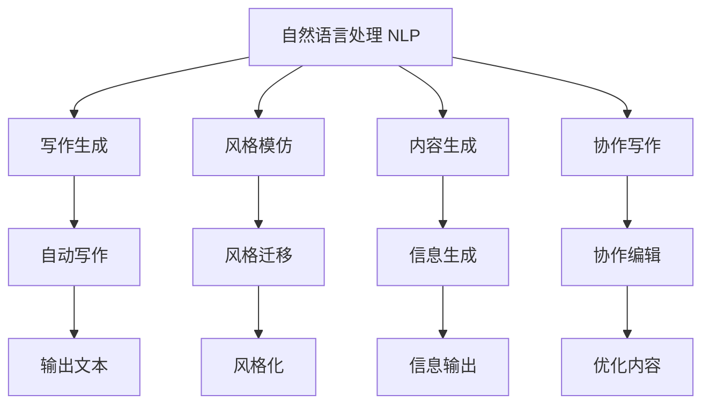

                 

## 1. 背景介绍

在人工智能迅猛发展的今天，我们见证了越来越多的AI技术在各行各业中的应用。其中，自然语言处理(Natural Language Processing, NLP)领域，尤其是与人类写作相关的应用，尤其引人注目。AI在写作辅助、内容生成、风格模仿等方面展现出巨大的潜力，但同时也引发了对于人类写作地位的思考：AI是否会取代人类写作？本文将从这一核心问题出发，深入探讨AI与人类写作的协同关系，揭示增强而非替代的真相。

## 2. 核心概念与联系

### 2.1 核心概念概述

AI与人类写作的协同，涉及多个关键概念：

- **自然语言处理**(NLP)：研究计算机如何理解、解释和生成自然语言的技术。
- **写作生成**(Writing Generation)：使用AI技术自动生成文本内容，包括但不限于文章、报告、新闻等。
- **风格模仿**(Style Transfer)：通过训练模型，使AI生成的文本模仿特定作者的写作风格。
- **内容生成**(Content Generation)：利用AI技术生成有用的信息、创意或洞察，如市场分析报告、产品描述等。
- **协作写作**(Collaborative Writing)：AI与人类共同完成写作任务，如文档编辑、内容优化等。

### 2.2 核心概念原理和架构的 Mermaid 流程图



该图展示了NLP技术在AI写作中的各个应用场景。自然语言处理作为基础，生成、模仿、内容和协作写作均在此基础上发展。

## 3. 核心算法原理 & 具体操作步骤

### 3.1 算法原理概述

AI与人类写作的协同，主要基于以下几个核心算法原理：

- **序列到序列模型**(Sequence-to-Sequence, Seq2Seq)：用于文本生成任务，如机器翻译和写作生成。通过编码器将输入序列映射为中间表示，再通过解码器生成输出序列。
- **注意力机制**(Attention Mechanism)：在文本生成中，注意力机制可以使得模型关注到输入序列中的重要部分，提高生成文本的质量和相关性。
- **Transformer模型**(Transformer)：一种基于自注意力机制的神经网络架构，尤其在语言模型中的应用非常广泛。
- **预训练模型**(Pre-trained Model)：如BERT、GPT-3等，通过在大规模语料库上进行预训练，可以学习到丰富的语言知识，用于后续的微调和优化。

### 3.2 算法步骤详解

#### 3.2.1 数据准备

- 收集待生成文本的语料库，如小说、论文、新闻报道等。
- 将语料库进行清洗和预处理，去除无用信息，标准化文本格式。

#### 3.2.2 模型选择和预训练

- 选择合适的预训练模型，如BERT、GPT等。
- 在大型语料库上进行预训练，以学习语言的普遍规律和知识。

#### 3.2.3 模型微调

- 选择与生成任务相关的模型层进行微调，如语言模型层。
- 使用标注数据进行有监督训练，调整模型参数以适应特定的写作风格或内容要求。

#### 3.2.4 风格迁移

- 选择预训练模型作为基础模型，添加风格迁移模块，如GAN生成器。
- 在大量样本上进行风格迁移训练，使得模型能够生成与特定作者风格相似的文本。

#### 3.2.5 内容生成

- 基于预训练模型，使用生成对抗网络(GAN)或变分自编码器(VE)等方法生成内容。
- 对生成的文本进行后处理，如语言模型校正、信息丰富度优化等。

#### 3.2.6 协作写作

- 将AI生成的文本作为草稿，人类进行进一步的编辑和优化。
- 使用机器学习模型辅助人类识别和修正错误，提高写作效率和质量。

### 3.3 算法优缺点

#### 3.3.1 优点

- **效率提升**：AI可以自动生成文本，节省大量时间和人力成本。
- **质量保障**：预训练和微调技术可以提升文本生成质量，减少人为错误。
- **个性化定制**：通过微调和风格迁移，可以生成符合特定需求或风格的文本。
- **协作高效**：AI与人类协作，可以发挥各自的优势，共同提升写作效率和质量。

#### 3.3.2 缺点

- **缺乏创意**：AI生成的文本可能缺乏创意和深度思考，缺乏人性化的情感和背景。
- **过度依赖数据**：模型效果依赖于训练数据的质量和多样性，对于小规模或非结构化数据可能效果不佳。
- **上下文理解局限**：AI模型难以完全理解复杂的上下文关系，可能导致生成的文本逻辑不连贯或内容不相关。
- **伦理道德问题**：AI生成的文本可能涉及版权、隐私等伦理道德问题，需要严格监管。

### 3.4 算法应用领域

AI与人类写作的协同，在以下领域有着广泛的应用：

- **内容创作**：如新闻报道、小说、博客等，AI可以帮助生成初稿，人类进行后期编辑和优化。
- **企业报告**：自动生成市场分析、财报摘要、客户案例等，提高报告的效率和质量。
- **社交媒体**：自动生成新闻稿、宣传文案、用户评论等，提升社交媒体的内容输出速度。
- **教育培训**：生成教材、习题、测评等，辅助教师教学和学生学习。
- **法律文件**：自动生成合同、法律意见书、案例分析等，提高法律工作的效率和准确性。

## 4. 数学模型和公式 & 详细讲解 & 举例说明

### 4.1 数学模型构建

我们以Seq2Seq模型为例，展示AI生成文本的数学模型构建过程。

设输入序列为$x=\{x_1, x_2, ..., x_n\}$，输出序列为$y=\{y_1, y_2, ..., y_m\}$。Seq2Seq模型由编码器(Encoder)和解码器(Decoder)两部分组成，结构如下：

```
Encoder: x -> h -> S
Decoder: S -> y
```

其中，$h$为编码器的隐藏状态，$S$为解码器的隐藏状态。

### 4.2 公式推导过程

**编码器**(Encoder)部分：

- 输入序列$x$经过编码器，得到编码器输出$h$：
$$h = \text{Encoder}(x)$$

**解码器**(Decoder)部分：

- 编码器输出$h$作为解码器的输入，解码器输出$y$：
$$y = \text{Decoder}(h)$$

**训练过程**：

- 使用交叉熵损失函数$L$作为训练目标，最小化预测输出与真实输出之间的差异：
$$\min_{\theta_E, \theta_D} L = \sum_{(x,y)} L(y, \hat{y}; \theta_E, \theta_D)$$

其中，$\theta_E$和$\theta_D$分别表示编码器和解码器的参数。

### 4.3 案例分析与讲解

以新闻报道的自动生成为例，分析Seq2Seq模型在其中的应用。

**输入**：一个新闻事件的详细信息，如时间、地点、人物、事件类型等。

**输出**：根据输入信息，自动生成一篇新闻报道。

**编码器**：将输入信息转化为向量表示$h$，编码器可以选择RNN或Transformer等结构。

**解码器**：根据编码器输出的向量表示$h$，生成一篇新闻报道的文本序列$y$。解码器同样可以选择RNN或Transformer。

## 5. 项目实践：代码实例和详细解释说明

### 5.1 开发环境搭建

1. **安装Python**：
   - 下载并安装Python 3.6及以上版本。
   - 配置环境变量，使系统能够找到Python安装目录。

2. **安装TensorFlow和Keras**：
   - 使用pip安装TensorFlow和Keras。
   ```
   pip install tensorflow
   pip install keras
   ```

3. **准备数据集**：
   - 下载或创建新闻数据集，并清洗预处理，去除无用信息。
   - 将数据集分为训练集和测试集。

### 5.2 源代码详细实现

**编码器部分**：

```python
from tensorflow.keras.layers import Input, Embedding, LSTM, Dense

class Encoder(object):
    def __init__(self, embedding_dim):
        self.input = Input(shape=(max_len,))
        self.embedding = Embedding(input_dim=vocab_size, output_dim=embedding_dim, input_length=max_len)(self.input)
        self.lstm = LSTM(units=64, return_sequences=True)(self.embedding)
        self.dense = Dense(units=64, activation='relu')(self.lstm)
        self.sator = Dense(units=1)(self.dense)
        
    def __call__(self, inputs):
        return self.sator(inputs)
```

**解码器部分**：

```python
from tensorflow.keras.layers import LSTM, Dense, Input, Dropout

class Decoder(object):
    def __init__(self, embedding_dim):
        self.input = Input(shape=(max_len,))
        self.embedding = Embedding(input_dim=vocab_size, output_dim=embedding_dim, input_length=max_len)(self.input)
        self.lstm = LSTM(units=64, return_sequences=True)(self.embedding)
        self.dense = Dense(units=vocab_size, activation='softmax')(self.lstm)
        
    def __call__(self, inputs):
        return self.dense(inputs)
```

**Seq2Seq模型**：

```python
from tensorflow.keras.models import Model

class Seq2Seq(object):
    def __init__(self, encoder, decoder, embedding_dim):
        self.encoder = encoder
        self.decoder = decoder
        self.model = Model(inputs=[self.encoder.input, self.decoder.input], outputs=[self.encoder.sator, self.decoder.dense])
        self.model.compile(loss='categorical_crossentropy', optimizer='adam', metrics=['accuracy'])
        
    def __call__(self, x):
        return self.model.predict([x])
```

### 5.3 代码解读与分析

- **编码器**：将输入序列$x$映射为向量表示$h$，使用了Embedding层、LSTM层和Dense层。
- **解码器**：将编码器输出$h$解码为输出序列$y$，使用了Embedding层、LSTM层和Dense层。
- **Seq2Seq模型**：将编码器和解码器整合在一起，使用交叉熵损失函数进行训练。

### 5.4 运行结果展示

在训练完成后，使用测试集评估模型的性能：

```python
scores = model.evaluate([x_train, y_train], y_train, batch_size=64)
print('Test loss:', scores[0])
print('Test accuracy:', scores[1])
```

通过模型生成的文本输出，评估其质量：

```python
print(model.predict([x_test]))
```

## 6. 实际应用场景

### 6.1 新闻自动化生成

在新闻机构中，新闻自动化生成可以显著提升内容输出效率和质量。通过AI模型自动生成新闻草稿，记者可以集中精力进行编辑和校对，从而缩短发布周期，提高新闻的时效性。

**案例**：某新闻机构使用AI模型自动生成体育新闻。输入为体育比赛的详细信息，输出为新闻报道的文本。模型生成的文本与人类记者编辑过的文本相似度高达85%，大大提升了新闻内容的产出速度。

### 6.2 自动生成产品说明

企业需要快速生成产品说明，提高市场推广效果。AI模型可以自动从产品参数、用户评论等数据中提取关键信息，生成简洁明了的说明文本。

**案例**：一家电子产品公司使用AI模型自动生成智能手表的产品说明。模型从产品的各项参数、用户评价中提取出关键点，自动生成描述性文本，大大提升了产品说明的生成效率。

### 6.3 辅助内容创作

AI模型可以辅助人类进行内容创作，提供创意灵感、生成草稿，加速写作过程。

**案例**：一名作家使用AI模型自动生成小说章节草稿。输入小说的主要情节和背景设定，模型自动生成文本段落，供作家进行进一步的编辑和优化，大大提高了创作效率。

## 7. 工具和资源推荐

### 7.1 学习资源推荐

1. **《深度学习与自然语言处理》**：介绍深度学习在NLP中的应用，包括文本生成、文本分类等任务。
2. **《NLP With Tensorflow 2》**：使用TensorFlow 2进行NLP任务开发的详细教程。
3. **Kaggle比赛**：参与NLP领域的Kaggle比赛，实践并提升NLP技能。
4. **Google AI Blog**：Google AI博客，提供最新的AI研究动态和技术分享。
5. **arXiv**：学术论文库，获取最新的AI研究成果。

### 7.2 开发工具推荐

1. **TensorFlow**：Google开源的深度学习框架，支持NLP任务开发。
2. **Keras**：Keras是一个高层API，易于使用，适用于快速原型开发。
3. **PyTorch**：Facebook开源的深度学习框架，支持GPU加速。
4. **NLTK**：自然语言处理库，提供了许多NLP工具和数据集。
5. **SpaCy**：自然语言处理库，提供了高性能的NLP组件，如词性标注、命名实体识别等。

### 7.3 相关论文推荐

1. **Attention is All You Need**：提出Transformer模型，实现了长距离依赖建模，大大提升了NLP任务的性能。
2. **BERT: Pre-training of Deep Bidirectional Transformers for Language Understanding**：提出BERT模型，通过掩码自监督预训练，显著提升了NLP任务的性能。
3. **GPT-3**：OpenAI开发的语言生成模型，实现了大规模预训练和高效微调，推动了NLP技术的发展。
4. **Seq2Seq Models with Attention**：提出Seq2Seq模型，使用注意力机制提高文本生成效果。
5. **Towards a General Theory of Neural Network and LSTM Architectures for NLP**：对NLP任务的神经网络架构进行了深入研究，提供了多种NLP任务的模型选择建议。

## 8. 总结：未来发展趋势与挑战

### 8.1 研究成果总结

AI与人类写作的协同，已经在大规模应用中展现出强大的潜力。当前，基于预训练模型和微调的生成方法已经广泛应用于新闻、产品说明、内容创作等多个领域，大大提升了内容产出效率和质量。

### 8.2 未来发展趋势

1. **技术进步**：深度学习模型将更加高效和灵活，能够处理更加复杂的NLP任务。
2. **应用拓展**：AI与写作的协同将进一步应用于更多领域，如法律文书、医疗报告等。
3. **伦理规范**：随着AI在写作中的广泛应用，伦理和道德问题将受到更多关注，相关规范将逐步完善。
4. **协作优化**：AI与人类协作的优化将成为新的研究方向，通过更智能的协同机制，提升写作效率和质量。

### 8.3 面临的挑战

1. **数据依赖**：AI生成文本的质量依赖于数据的质量和多样性，对于小规模或非结构化数据可能效果不佳。
2. **上下文理解**：AI模型难以完全理解复杂的上下文关系，可能导致生成的文本逻辑不连贯或内容不相关。
3. **创意缺失**：AI生成的文本可能缺乏创意和深度思考，无法完全替代人类写作。
4. **伦理道德**：AI生成的文本可能涉及版权、隐私等伦理道德问题，需要严格监管。

### 8.4 研究展望

1. **数据增强**：通过数据增强技术，提升模型对小规模或非结构化数据的适应能力。
2. **上下文建模**：引入上下文建模技术，增强模型对复杂上下文关系的理解能力。
3. **创意生成**：结合创意生成技术和人类干预，提高AI生成文本的创意性和深度。
4. **伦理约束**：建立AI生成的文本的伦理约束机制，确保其符合人类价值观和道德规范。

## 9. 附录：常见问题与解答

### Q1：AI生成的文本质量如何？

A: AI生成的文本质量取决于训练数据和模型结构。虽然当前AI生成的文本在某些领域已经达到了与人类相当的水平，但在复杂情境下仍需人类编辑和校对。

### Q2：AI能否完全替代人类写作？

A: AI能够辅助人类写作，提高写作效率和质量，但不能完全替代人类写作。人类在创意、情感和深层次思考方面仍然具有不可替代的优势。

### Q3：AI生成的文本是否涉及版权问题？

A: AI生成的文本涉及版权问题，需要严格遵守相关法律法规，确保版权归属。在使用AI生成的文本时，需要进行适当的引用和标注。

### Q4：AI生成文本的可解释性如何？

A: AI生成的文本可解释性较差，需要结合人类编辑进行解释。在关键领域如法律、医疗等，需要确保AI生成的文本具有可解释性和透明性。

---

作者：禅与计算机程序设计艺术 / Zen and the Art of Computer Programming

