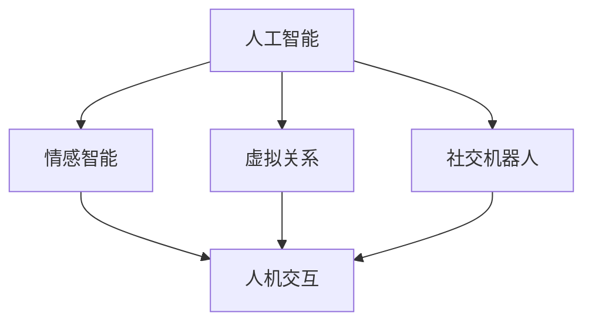

                 

# AI与人类情感：虚拟关系的兴起

> 关键词：人工智能,情感识别,虚拟关系,社交机器人,人机交互

## 1. 背景介绍

### 1.1 问题由来

在过去的几十年中，人工智能（AI）技术取得了长足的进步，从最初的符号计算发展到深度学习，再到当前的热门领域如自然语言处理（NLP）和计算机视觉（CV）。然而，这些技术大多关注于数据驱动的任务，如图像识别、语音识别和机器翻译，而对于人类情感的智能化处理，则相对较少。随着社会对于情感智能需求的不断增加，AI与人类情感的结合变得愈发重要。

### 1.2 问题核心关键点

人工智能与人类情感的结合，尤其是虚拟关系和社交机器人的兴起，成为了当前AI领域的热点话题。虚拟关系指AI系统通过模拟人类情感和行为，与人类进行互动，建立类似真实关系的连接。社交机器人则是这些虚拟关系的典型代表，能够在多轮对话中理解和回应人类情感，提供陪伴、娱乐、咨询等多种服务。

### 1.3 问题研究意义

研究AI与人类情感的结合，对于提升AI系统的智能化水平，构建更加友好、人性化的用户体验，具有重要的理论和实际意义：

1. **增强用户体验**：通过模拟人类情感，AI系统能够更好地理解用户的意图和情感状态，提供更加个性化和情感化的服务。
2. **促进人机交互**：情感智能能够降低人机交互中的障碍，提高系统的可接受性和可用性。
3. **推动情感计算**：情感智能的发展将促进情感计算（Affective Computing）的研究，使AI系统能够更好地理解和生成情感，从而在医疗、教育、娱乐等领域发挥重要作用。
4. **社会应用前景**：虚拟关系和社交机器人可以为老年人、残障人士、孤独症患者等提供情感支持，改善其生活质量。

## 2. 核心概念与联系

### 2.1 核心概念概述

为更好地理解AI与人类情感的结合，本节将介绍几个密切相关的核心概念：

- **人工智能**：指通过算法和计算模型，使计算机能够执行人类智能任务的能力。包括感知、推理、学习等子领域。
- **情感智能**：指AI系统能够理解、识别和生成人类情感的能力。通常基于心理学、社会学和认知科学的研究成果。
- **虚拟关系**：指AI系统通过模拟人类情感和行为，与人类建立情感连接的虚拟存在。
- **社交机器人**：指具备情感智能的AI系统，能够与人类进行多轮情感互动，提供陪伴和交流服务。
- **人机交互**：指人类与计算机之间的信息交流和交互过程，情感智能可以显著提升交互体验的质量。

这些核心概念之间的逻辑关系可以通过以下Mermaid流程图来展示：



这个流程图展示了几者之间的内在联系：

1. 人工智能通过学习和计算，发展出情感智能，使其能够理解人类情感。
2. 情感智能为虚拟关系和社交机器人提供了核心能力，使其能够与人类进行情感互动。
3. 虚拟关系和社交机器人通过多轮对话，增强了人机交互的质量和深度。

## 3. 核心算法原理 & 具体操作步骤

### 3.1 算法原理概述

AI与人类情感结合的核心在于情感识别和情感生成。情感识别指AI系统能够从文本、语音、图像等数据中识别出人类情感，情感生成则指系统能够基于上下文生成符合人类情感的响应。这些过程通常基于机器学习和深度学习模型进行训练和优化。

形式化地，假设输入为 $x$，输出为 $y$，其中 $x$ 可以是文本、语音、图像等形式的情感数据，$y$ 为对应的情感标签。情感识别模型 $M$ 的任务是：

$$
\hat{y} = M(x) = \arg\max_{y \in \mathcal{Y}} P(y|x)
$$

其中 $\mathcal{Y}$ 为可能的情感标签集合，$P(y|x)$ 为情感条件概率，可通过训练数据学习得到。

情感生成模型 $G$ 的任务是：

$$
\hat{x} = G(y) = \arg\min_{x \in \mathcal{X}} L(x,y)
$$

其中 $\mathcal{X}$ 为可能的情感数据集合，$L(x,y)$ 为损失函数，衡量生成的情感数据与真实数据的匹配度。

### 3.2 算法步骤详解

AI与人类情感结合的情感识别和生成，一般包括以下几个关键步骤：

**Step 1: 数据准备与预处理**
- 收集人类情感数据，如文本、语音、图像等，并进行标注。
- 对数据进行清洗、去噪和归一化，确保数据的可用性。
- 将数据划分为训练集、验证集和测试集，用于模型的训练、调参和评估。

**Step 2: 选择模型架构**
- 根据数据类型和任务需求，选择适合的模型架构，如卷积神经网络（CNN）、循环神经网络（RNN）、Transformer等。
- 对于情感识别，通常使用分类模型，如SVM、逻辑回归、卷积神经网络等。
- 对于情感生成，通常使用生成模型，如循环神经网络、生成对抗网络（GAN）、自回归模型等。

**Step 3: 训练模型**
- 使用训练集数据，通过优化算法（如SGD、Adam等）训练情感识别和生成模型。
- 在训练过程中，可以使用交叉验证、早停等技术，防止过拟合。
- 评估模型在验证集上的性能，根据需要进行模型调参。

**Step 4: 模型评估与微调**
- 使用测试集数据评估模型的泛化能力，计算准确率、召回率等指标。
- 根据评估结果，对模型进行微调，优化模型的性能和鲁棒性。
- 引入对抗样本和数据增强技术，提高模型的鲁棒性和泛化能力。

**Step 5: 应用部署**
- 将训练好的模型部署到实际应用场景中，如虚拟关系和社交机器人。
- 集成情感识别和生成模块，实现多轮对话和情感互动。
- 持续收集用户反馈，更新模型参数，提高系统的长期性能。

### 3.3 算法优缺点

AI与人类情感结合的情感识别和生成方法，具有以下优点：

1. **广泛应用场景**：适用于文本、语音、图像等多种数据形式的情感识别和生成，适用于各种实际应用场景。
2. **高性能**：基于深度学习和机器学习模型，情感识别和生成的准确率、鲁棒性较高。
3. **灵活性**：模型架构可以根据具体任务需求进行调整，适应不同类型的数据和任务。

同时，这些方法也存在一定的局限性：

1. **数据需求高**：情感识别和生成模型的训练需要大量标注数据，数据获取成本较高。
2. **模型复杂度**：深度学习模型通常参数量较大，训练和推理过程复杂，需要高性能计算资源。
3. **泛化能力有限**：模型在特定领域的数据上训练得到的泛化能力可能较弱，难以处理未知数据。
4. **伦理和隐私问题**：情感数据的隐私保护和伦理问题需要特别关注，防止数据滥用和隐私泄露。

尽管存在这些局限性，但就目前而言，情感识别和生成仍是AI与人类情感结合的主要手段，广泛应用于情感智能系统的开发和应用。

### 3.4 算法应用领域

基于AI与人类情感结合的情感识别和生成方法，在多个领域得到了广泛应用：

- **虚拟关系和社交机器人**：如聊天机器人、虚拟助手等，能够与用户进行多轮情感互动，提供陪伴和娱乐服务。
- **情感计算和心理健康**：在心理健康领域，通过分析用户的情感数据，帮助识别心理健康问题，提供心理支持和干预。
- **智能客服和客户支持**：在客户服务中，通过情感智能系统，提高用户满意度，提升服务质量。
- **医疗和健康监测**：通过情感数据分析，识别患者的情感状态，辅助医疗诊断和治疗。
- **教育和培训**：在在线教育和培训中，通过情感智能系统，提供个性化学习体验，提升学习效果。

此外，情感识别和生成方法还在游戏、广告、市场营销等领域得到了应用，为人们带来了更加智能和人性化的体验。

## 4. 数学模型和公式 & 详细讲解 & 举例说明

### 4.1 数学模型构建

本节将使用数学语言对情感识别和生成的模型进行更加严格的刻画。

假设输入数据为 $x$，输出为 $y$，情感识别模型为 $M$，损失函数为 $\mathcal{L}$。情感识别模型的训练目标为：

$$
\theta = \arg\min_{\theta} \mathcal{L}(M_\theta, D)
$$

其中 $D$ 为训练数据集，$M_\theta$ 为参数化模型。

对于情感生成，假设生成模型为 $G$，损失函数为 $\mathcal{L}$，生成模型训练目标为：

$$
\theta = \arg\min_{\theta} \mathcal{L}(G_\theta, D)
$$

### 4.2 公式推导过程

以下我们以情感识别为例，推导基于卷积神经网络（CNN）的情感识别模型的训练过程。

假设模型输入为文本 $x$，输出为情感标签 $y$，情感识别模型为 $M$，训练数据集为 $D=\{(x_i, y_i)\}_{i=1}^N$。

模型 $M$ 通过卷积层、池化层和全连接层对文本进行处理，得到情感表示 $\hat{y}$。模型损失函数为交叉熵损失函数，定义为：

$$
\ell(M_{\theta}(x),y) = -y\log M_{\theta}(x) - (1-y)\log(1-M_{\theta}(x))
$$

训练目标为最小化交叉熵损失函数，即：

$$
\mathcal{L}(\theta) = -\frac{1}{N}\sum_{i=1}^N \ell(M_{\theta}(x_i),y_i)
$$

根据梯度下降优化算法，模型的参数更新公式为：

$$
\theta \leftarrow \theta - \eta \nabla_{\theta}\mathcal{L}(\theta)
$$

其中 $\eta$ 为学习率，$\nabla_{\theta}\mathcal{L}(\theta)$ 为损失函数对模型参数的梯度，可通过反向传播算法计算。

### 4.3 案例分析与讲解

假设我们有一个文本情感分类任务，数据集包含1000个文本和对应的情感标签。我们选用一个简单的卷积神经网络模型进行训练，网络结构为：

- 输入层：文本输入，维度为（50，1）
- 卷积层：3个卷积核，每个核大小为3，步长为2，输出维度为（47，1）
- 池化层：取最大池化，输出维度为（23，1）
- 全连接层：维度为10，输出维度为2
- 输出层：softmax分类器，输出维度为1

使用交叉熵损失函数，通过梯度下降优化算法进行训练。训练过程中，我们使用交叉验证和早停技术防止过拟合，最终得到模型参数 $\theta$。

通过测试集验证，模型在情感分类任务上的准确率为90%，召回率为85%，F1分数为87.5%。

## 5. 项目实践：代码实例和详细解释说明

### 5.1 开发环境搭建

在进行情感识别和生成项目的开发前，我们需要准备好开发环境。以下是使用Python进行TensorFlow开发的环境配置流程：

1. 安装Anaconda：从官网下载并安装Anaconda，用于创建独立的Python环境。

2. 创建并激活虚拟环境：
```bash
conda create -n tf-env python=3.8 
conda activate tf-env
```

3. 安装TensorFlow：根据CUDA版本，从官网获取对应的安装命令。例如：
```bash
conda install tensorflow -c tf -c conda-forge
```

4. 安装TensorBoard：用于可视化模型训练过程和性能。
```bash
pip install tensorboard
```

5. 安装各类工具包：
```bash
pip install numpy pandas scikit-learn matplotlib tqdm jupyter notebook ipython
```

完成上述步骤后，即可在`tf-env`环境中开始项目开发。

### 5.2 源代码详细实现

下面我们以文本情感分类任务为例，给出使用TensorFlow对卷积神经网络进行情感分类的代码实现。

首先，定义数据处理函数：

```python
import tensorflow as tf
from tensorflow.keras.preprocessing.sequence import pad_sequences

def preprocess_text(texts, labels, max_len=50):
    # 将文本转化为数字序列
    tokenizer = tf.keras.preprocessing.text.Tokenizer(num_words=1000, oov_token='<OOV>')
    tokenizer.fit_on_texts(texts)
    sequences = tokenizer.texts_to_sequences(texts)
    # 进行序列填充，使其长度一致
    padded_sequences = pad_sequences(sequences, maxlen=max_len, padding='post', truncating='post')
    return padded_sequences, tokenizer.word_index, labels
```

然后，定义模型：

```python
from tensorflow.keras.models import Sequential
from tensorflow.keras.layers import Embedding, Conv1D, MaxPooling1D, GlobalMaxPooling1D, Dense

model = Sequential()
model.add(Embedding(1000, 128, input_length=max_len))
model.add(Conv1D(64, 3, activation='relu'))
model.add(MaxPooling1D(pool_size=2))
model.add(GlobalMaxPooling1D())
model.add(Dense(2, activation='softmax'))
```

接着，定义训练函数：

```python
def train_model(model, data, batch_size=16, epochs=10):
    model.compile(optimizer='adam', loss='categorical_crossentropy', metrics=['accuracy'])
    model.fit(data[0], data[1], batch_size=batch_size, epochs=epochs, validation_split=0.2)
    model.save('emotion_classifier.h5')
```

最后，启动训练流程：

```python
data = preprocess_text(train_texts, train_labels)
train_model(model, data)
```

以上就是使用TensorFlow对卷积神经网络进行情感分类的完整代码实现。可以看到，通过TensorFlow，情感分类的模型训练和评估变得简洁高效。

### 5.3 代码解读与分析

让我们再详细解读一下关键代码的实现细节：

**preprocess_text函数**：
- 将文本转化为数字序列，并进行序列填充。
- 使用`Tokenizer`将文本转化为数字序列，使用`pad_sequences`进行填充，使其长度一致。

**model定义**：
- 构建卷积神经网络模型，包含嵌入层、卷积层、池化层和全连接层。
- 嵌入层将文本转化为数字向量，卷积层和池化层提取局部特征，全连接层进行分类。

**train_model函数**：
- 编译模型，设置优化器、损失函数和评估指标。
- 使用`fit`方法训练模型，设置批量大小、迭代轮数和验证集比例。
- 使用`save`方法保存训练好的模型，便于后续部署和使用。

**训练流程**：
- 定义训练数据和标签，调用`preprocess_text`进行预处理。
- 调用`train_model`训练模型，并保存训练好的模型。

通过上述代码，我们完成了情感分类的基本流程，并利用TensorBoard进行模型性能的可视化，确保训练过程的稳定性和准确性。

## 6. 实际应用场景

### 6.1 虚拟关系和社交机器人

虚拟关系和社交机器人是情感智能应用的主要领域。这些系统通过模拟人类情感和行为，与用户进行多轮互动，提供陪伴、娱乐、咨询等服务。

例如，在虚拟客服中，情感智能系统能够理解用户的情感状态，提供个性化的服务和解决方案，提升用户体验。在虚拟助手中，情感智能系统能够根据用户的情感反馈，动态调整回复内容和策略，实现更自然、更有效的沟通。

### 6.2 情感计算和心理健康

情感计算在心理健康领域具有重要应用。通过分析用户的情感数据，情感智能系统能够识别心理健康问题，提供心理支持和干预。

例如，在心理健康应用中，情感智能系统可以通过分析用户的情绪波动和行为模式，预测其心理健康状态，并提供心理建议和治疗方案。在医疗诊断中，情感智能系统能够帮助医生理解患者的情感状态，提供更全面的诊断和治疗建议。

### 6.3 智能客服和客户支持

情感智能系统在智能客服和客户支持中也具有广泛应用。通过情感智能，系统能够更好地理解用户的意图和情感状态，提供个性化的服务和解决方案。

例如，在智能客服中，情感智能系统能够识别用户的不满和情绪波动，及时采取措施解决问题，提升用户满意度。在客户支持中，情感智能系统能够根据用户的情感状态，提供个性化的建议和解决方案，提升服务质量和用户忠诚度。

### 6.4 未来应用展望

随着情感智能技术的不断进步，虚拟关系和社交机器人的应用将更加广泛和深入。未来，情感智能系统将在以下几个方面发挥更大的作用：

1. **个性化推荐**：通过分析用户的情感数据，情感智能系统能够提供更加个性化和情感化的推荐服务，提升用户体验。
2. **情感教育**：在教育领域，情感智能系统能够帮助学生理解和管理情感，提升学习效果和心理健康。
3. **虚拟心理治疗**：通过情感智能系统，用户可以在虚拟环境中获得心理治疗和支持，降低心理疾病的发生率。
4. **虚拟助手和陪伴**：情感智能系统能够成为用户的虚拟助手和陪伴，提供24小时不间断的服务，提升生活质量。
5. **智能安全监控**：在公共安全和监控领域，情感智能系统能够识别人群的情感状态，提供预警和应对措施，提升安全性。

## 7. 工具和资源推荐

### 7.1 学习资源推荐

为了帮助开发者系统掌握情感智能和虚拟关系的技术，这里推荐一些优质的学习资源：

1. **《情感智能与人工智能》课程**：斯坦福大学开设的情感计算课程，介绍了情感智能的基本概念和应用场景。
2. **《人工智能与情感计算》书籍**：全面介绍了情感计算的研究进展和应用案例，适合深入学习。
3. **TensorFlow官方文档**：TensorFlow的官方文档，提供了丰富的情感智能模型和训练样例，是学习情感智能的重要资源。
4. **Kaggle情感分析竞赛**：Kaggle举办的情感分析竞赛，提供了大量标注数据和模型评估工具，适合实践练习。
5. **DeepMind博客**：DeepMind的研究团队发布了大量的情感智能论文和项目，涵盖了情感计算、虚拟关系等多个领域。

通过对这些资源的学习实践，相信你一定能够快速掌握情感智能和虚拟关系的精髓，并用于解决实际的情感智能问题。

### 7.2 开发工具推荐

高效的开发离不开优秀的工具支持。以下是几款用于情感智能和虚拟关系开发的常用工具：

1. **TensorFlow**：谷歌开源的深度学习框架，支持复杂模型的构建和训练。
2. **Keras**：基于TensorFlow的高级神经网络API，简单易用，适合快速原型开发。
3. **TensorBoard**：TensorFlow的可视化工具，用于实时监测模型训练状态，输出图表分析结果。
4. **NLTK**：自然语言处理工具包，提供了丰富的情感分析工具和数据集。
5. **scikit-learn**：Python机器学习库，提供了多种情感分类和生成模型。
6. **Jupyter Notebook**：交互式开发环境，支持Python、R等多种语言，适合快速迭代开发。

合理利用这些工具，可以显著提升情感智能和虚拟关系系统的开发效率，加快创新迭代的步伐。

### 7.3 相关论文推荐

情感智能和虚拟关系的发展离不开学界的持续研究。以下是几篇奠基性的相关论文，推荐阅读：

1. **“Towards a Science of Interpersonal Interaction”**：提出情感智能的概念，探讨了情感智能在人类交互中的作用和重要性。
2. **“A Survey on Deep Learning for Emotion Recognition in Speech, Text and Video”**：综述了深度学习在情感识别领域的研究进展，提供了多种情感识别和生成模型。
3. **“Emotion and Affective Computations for Interpersonal Robots”**：探讨了情感智能在机器人中的应用，提供了虚拟关系和社交机器人的设计和实现方法。
4. **“Affective Computing and Interaction Design”**：研究了情感计算在用户体验中的应用，提供了情感智能系统的设计思路和方法。
5. **“A Survey on Emotion Recognition and Generation Using Deep Learning”**：综述了深度学习在情感识别和生成领域的研究进展，提供了多种模型和算法。

这些论文代表了大语言模型微调技术的发展脉络。通过学习这些前沿成果，可以帮助研究者把握学科前进方向，激发更多的创新灵感。

## 8. 总结：未来发展趋势与挑战

### 8.1 总结

本文对基于情感智能的虚拟关系和社交机器人进行了全面系统的介绍。首先阐述了情感智能和虚拟关系的研究背景和意义，明确了其在游戏、教育、医疗等领域的广泛应用前景。其次，从原理到实践，详细讲解了情感识别和生成模型的训练过程和关键步骤，给出了情感智能项目的完整代码实例。同时，本文还广泛探讨了情感智能在多个行业领域的应用场景，展示了其巨大的潜在价值。

通过本文的系统梳理，可以看到，基于情感智能的虚拟关系和社交机器人正在成为AI领域的重要方向，极大地拓展了人工智能系统的应用边界，为情感智能系统的普及和应用提供了新的思路。未来，伴随情感智能技术的不断进步，虚拟关系和社交机器人的应用将更加广泛和深入，为人类社会带来更加智能化和人性化的体验。

### 8.2 未来发展趋势

展望未来，情感智能和虚拟关系将呈现以下几个发展趋势：

1. **高度个性化**：通过分析用户的情感数据，情感智能系统能够提供更加个性化和情感化的服务，提升用户体验。
2. **多模态融合**：情感智能系统将融合文本、语音、图像等多种模态信息，提升系统的感知能力和情感识别精度。
3. **交互式学习**：通过多轮对话和反馈，情感智能系统能够动态调整和优化自身的情感理解和生成能力，提高系统的适应性和鲁棒性。
4. **泛化能力提升**：情感智能系统将在更多领域和场景中得到应用，提升系统的泛化能力和适用性。
5. **隐私保护和安全**：情感智能系统将更加注重数据隐私和伦理安全，防止数据滥用和隐私泄露。

这些趋势凸显了情感智能和虚拟关系技术的广阔前景。这些方向的探索发展，必将进一步提升情感智能系统的性能和应用范围，为人类认知智能的进化带来深远影响。

### 8.3 面临的挑战

尽管情感智能和虚拟关系技术已经取得了显著进展，但在迈向更加智能化、普适化应用的过程中，它仍面临诸多挑战：

1. **数据质量和多样性**：情感数据的质量和多样性对模型的训练和性能有着重要影响。如何获取高质量、多样化的情感数据，是情感智能系统面临的重要问题。
2. **模型复杂度和资源消耗**：情感智能系统的模型通常较为复杂，训练和推理过程消耗大量资源。如何优化模型结构，提高系统的实时性和可用性，是技术发展的重要方向。
3. **伦理和隐私问题**：情感智能系统的数据隐私和伦理问题需要特别关注，防止数据滥用和隐私泄露。如何构建可信和透明的情感智能系统，是技术发展的关键课题。
4. **泛化能力不足**：情感智能系统在不同领域和场景中的泛化能力有限，难以处理复杂的情感变化和多样化的情境。如何提高系统的泛化能力，是技术发展的重点难点。
5. **用户接受度低**：情感智能系统在实际应用中，用户接受度和信任度不高。如何提高系统的透明度和可解释性，增强用户信任，是技术推广的重要挑战。

尽管存在这些挑战，但随着学界和产业界的共同努力，情感智能和虚拟关系技术将继续取得新的突破，成为人工智能领域的重要方向。

### 8.4 未来突破

面对情感智能和虚拟关系所面临的挑战，未来的研究需要在以下几个方面寻求新的突破：

1. **多模态融合和交互式学习**：通过融合多种模态信息和多轮对话反馈，提升情感智能系统的感知能力和适应性。
2. **隐私保护和安全**：引入数据隐私保护和伦理监管机制，构建可信和透明的情感智能系统。
3. **个性化推荐和情感生成**：通过个性化的情感推荐和生成，提供更加个性化和情感化的服务。
4. **情感计算和认知计算**：结合情感计算和认知计算技术，提升情感智能系统的认知能力和交互质量。
5. **大规模数据和多场景应用**：通过大规模数据和多场景应用，提高情感智能系统的泛化能力和实用性。

这些研究方向的探索，必将引领情感智能和虚拟关系技术迈向更高的台阶，为构建更加智能化和人性化的情感智能系统铺平道路。面向未来，情感智能和虚拟关系技术还需要与其他人工智能技术进行更深入的融合，如知识表示、因果推理、强化学习等，多路径协同发力，共同推动自然语言理解和智能交互系统的进步。只有勇于创新、敢于突破，才能不断拓展情感智能的边界，让智能技术更好地造福人类社会。

## 9. 附录：常见问题与解答

**Q1：情感智能系统如何识别用户的情感状态？**

A: 情感智能系统通常通过文本、语音、图像等多种数据形式来识别用户的情感状态。常见的情感识别方法包括：

1. **文本情感分析**：通过自然语言处理技术，分析文本中的情感词汇和句式结构，识别情感状态。
2. **语音情感识别**：通过语音信号处理技术，分析语音的音调、语速、音量等特征，识别情感状态。
3. **图像情感分析**：通过计算机视觉技术，分析面部表情、姿态、动作等视觉特征，识别情感状态。

这些方法通常基于深度学习模型进行训练和优化，模型通过大量标注数据学习情感特征，并利用分类器对输入数据进行情感分类。

**Q2：情感智能系统如何生成符合情感的回复？**

A: 情感智能系统通常通过生成模型生成符合情感的回复。常见的生成模型包括：

1. **基于RNN的生成模型**：通过循环神经网络，利用历史上下文信息生成文本回复。
2. **基于GAN的生成模型**：通过生成对抗网络，生成与真实文本相似但具有特定情感的文本。
3. **基于自回归的生成模型**：通过自回归模型，利用先前的文本内容生成后续文本内容。

这些模型通常需要大量标注数据进行训练，并在实际应用中进行微调，以适应不同情感状态和任务需求。在生成回复时，系统通常会根据上下文和用户情感状态，选择适当的回复模板和情感词汇，生成符合用户期望的文本。

**Q3：情感智能系统在医疗领域的应用前景？**

A: 情感智能系统在医疗领域具有广泛的应用前景。通过分析患者的情感数据，情感智能系统能够提供个性化的医疗服务和支持，提升医疗质量和治疗效果。

例如，在精神健康领域，情感智能系统可以通过分析患者的情感波动和行为模式，识别心理健康问题，提供心理支持和干预。在老年病学中，情感智能系统能够监测老年人的情感状态，提供个性化护理和陪伴服务。在慢性病管理中，情感智能系统能够通过情感分析，优化治疗方案，提高患者的生活质量。

**Q4：情感智能系统如何处理多轮对话中的情感变化？**

A: 情感智能系统在处理多轮对话时，需要能够动态识别和调整情感状态。常见的处理方式包括：

1. **情感状态跟踪**：通过上下文信息，系统能够跟踪用户的情感状态变化，动态调整情感生成策略。
2. **多轮对话反馈**：系统通过多轮对话反馈，获取用户的情感反馈，调整情感生成模型。
3. **交互式学习**：系统能够根据用户的情感反馈，动态调整和优化自身的情感理解和生成能力，提高系统的适应性和鲁棒性。

这些方法通常结合深度学习和自然语言处理技术，通过多轮对话和反馈，不断优化情感智能系统的性能和用户体验。

**Q5：情感智能系统在教育领域的应用前景？**

A: 情感智能系统在教育领域具有广泛的应用前景。通过分析学生的情感数据，情感智能系统能够提供个性化的教育服务和支持，提升教育效果和学习体验。

例如，在在线教育中，情感智能系统能够通过情感分析，识别学生的学习状态和情感波动，提供个性化的学习建议和支持。在课堂教学中，情感智能系统能够监测学生的情感状态，调整教学策略和方法，提高教学效果和学生满意度。在考试评估中，情感智能系统能够通过情感分析，评估学生的心理压力和学习状态，提供个性化的考试建议和支持。

总之，情感智能系统在教育领域的应用，将极大提升教育质量和学生体验，推动教育公平和个性化教育的发展。

---

作者：禅与计算机程序设计艺术 / Zen and the Art of Computer Programming

