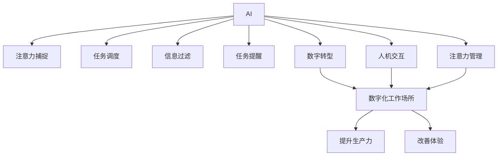

                 

# AI与人类注意力流 :未来的工作场所和注意力管理

> 关键词：AI, 人类注意力流, 工作场所, 注意力管理, 数字转型, 人机交互

## 1. 背景介绍

### 1.1 问题由来
在快速发展的数字化时代，AI技术正以前所未有的速度改变着我们的工作和生活方式。从自动驾驶汽车到智能家居，从个性化推荐到医疗诊断，AI的应用无处不在。然而，随着AI的深入普及，一个关键问题逐渐显现：如何在AI助力下，更好地管理人类注意力流，提升工作场所的生产力和创造力？

### 1.2 问题核心关键点
在当前的工作环境中，信息过载和注意力分散已成常态。员工面对海量工作任务和无限流的资讯，容易导致注意力分散、效率低下、压力增大等问题。如何有效利用AI技术，捕捉和引导人类的注意力流，已成为提升工作效率、改善员工体验的重要课题。

### 1.3 问题研究意义
本文旨在探讨AI如何通过精准捕捉和科学管理人类注意力流，优化未来的工作场所，提高组织和个人的生产力。研究AI在注意力管理中的应用，将有助于开发出更加智能、高效、人性化的工作环境，推动企业数字化转型进程，提升整体竞争力。

## 2. 核心概念与联系

### 2.1 核心概念概述

为更好地理解AI在人类注意力流管理中的应用，本节将介绍几个核心概念：

- **AI与人类注意力流**：AI通过学习人类行为模式，捕捉和预测人类注意力流动的规律，帮助人类更高效地获取和处理信息。
- **工作场所的数字化转型**：通过引入AI技术，优化工作流程、提升员工体验、提高工作效率。
- **注意力管理**：通过技术手段，对人类的注意力流进行科学管理，如任务调度、信息过滤、任务提醒等。
- **数字鸿沟**：由于技术普及不均，不同群体在数字化工作环境中可能面临的信息获取、知识掌握、技能提升等方面的差距。
- **人机交互**：探讨AI如何通过自然语言处理、情感识别、协同决策等方式，实现与人的高效互动。

这些核心概念之间的逻辑关系可以通过以下Mermaid流程图来展示：



这个流程图展示了几大核心概念及其之间的关系：

1. AI通过学习人类行为模式，捕捉和预测注意力流动的规律。
2. AI技术应用于任务调度、信息过滤、任务提醒等环节，提升工作效率。
3. 通过数字转型，AI技术优化工作场所，提升组织和个人生产力。
4. 人机交互的提升，使得AI更好地服务于人类注意力流管理。
5. 注意力管理的科学化，有助于改善员工体验。
6. 这些技术手段共同构建了一个更加高效、人性化、智能化的工作环境。

## 3. 核心算法原理 & 具体操作步骤
### 3.1 算法原理概述

AI在人类注意力流管理中的应用，核心算法原理包括以下几个方面：

- **数据捕捉与分析**：通过传感器、日志文件等方式，捕捉人类在不同任务、不同时间段内的注意力流数据。
- **注意力模式识别**：利用机器学习模型，识别出不同场景下人类注意力的模式和规律。
- **任务调度优化**：根据人类注意力模式，智能调整任务的安排和优先级，确保工作的高效完成。
- **信息过滤与推荐**：通过分析注意力流向，筛选出关键信息，推荐给用户，避免信息过载。
- **任务提醒与干预**：在注意力可能分散或偏离时，及时提醒用户，调整注意力方向，保持高效工作状态。

### 3.2 算法步骤详解

以下是AI在人类注意力流管理中的具体操作步骤：

**Step 1: 数据采集与预处理**
- 利用传感器、日志文件等工具，采集人类在各个任务中的注意力数据。
- 对采集到的数据进行清洗、过滤，去除噪声和异常值。
- 数据标准化，如时间对齐、特征归一化等。

**Step 2: 模型训练与优化**
- 选择合适的机器学习模型（如决策树、随机森林、神经网络等）。
- 在标注好的数据集上训练模型，优化模型参数，提升模型准确度。
- 使用交叉验证等技术，评估模型性能，调整超参数。

**Step 3: 注意力模式识别**
- 模型输入注意力数据，输出注意力模式或状态（如集中、分散、波动等）。
- 根据注意力模式，分析当前工作任务和环境，识别出可能的分心点。

**Step 4: 任务调度与优化**
- 根据注意力模式，动态调整任务安排，确保高注意力时间段内完成重要任务。
- 根据任务复杂度、优先级，合理分配任务时间和精力。
- 在注意力高峰时段，自动调低不重要的任务优先级。

**Step 5: 信息过滤与推荐**
- 根据注意力流向，筛选出当前用户最关心的信息，减少干扰。
- 利用推荐算法（如协同过滤、基于内容的推荐等），推荐相关内容，避免信息过载。

**Step 6: 任务提醒与干预**
- 在注意力可能分散时，及时提醒用户，调整注意力方向。
- 利用智能提醒系统，如语音、震动、弹窗等方式，吸引用户注意。
- 在用户长时间未响应时，自动切换到紧急任务或重置任务。

### 3.3 算法优缺点

AI在人类注意力流管理中的算法具有以下优点：
1. 高效性：通过数据分析和机器学习，可以精准捕捉和预测人类注意力流动规律，优化任务安排，提高工作效率。
2. 智能性：利用任务调度、信息过滤等技术，减轻用户负担，提升工作体验。
3. 灵活性：可以根据不同环境和任务，动态调整注意力管理策略，适应多样化的工作场景。
4. 可扩展性：随着数据量的积累，模型的准确度和应用范围不断提升，具有较高的扩展潜力。

同时，这些算法也存在一些局限性：
1. 依赖数据质量：注意力流数据的质量直接影响算法的准确度。数据不充分或数据质量不高时，可能导致模型泛化性能下降。
2. 隐私与安全问题：用户注意力数据的采集和处理可能涉及隐私问题，需要在数据采集和使用过程中严格遵守法律法规。
3. 人机交互复杂性：AI在处理复杂的人机交互场景时，可能需要更高级的自然语言处理和情感识别技术，提升交互效果。
4. 模型训练成本高：高质量的训练数据和计算资源是模型训练的前提，需要较高的前期投入。

尽管存在这些局限性，AI在人类注意力流管理中的应用前景广阔，已经在企业办公、智能家居、教育培训等领域得到了广泛应用。

### 3.4 算法应用领域

AI在人类注意力流管理的应用领域十分广泛，以下列举几个典型应用场景：

**企业办公场景**
- 智能会议助手：利用AI捕捉与会者注意力流，动态调整会议议程，提升会议效率。
- 任务自动分配：根据员工注意力状态，自动分配任务，避免任务堆积。
- 日程智能管理：根据员工注意力高峰时段，智能调整会议、邮件等日程安排。

**智能家居场景**
- 智能家居控制：通过捕捉家庭成员注意力流，智能调整家居设备，提升居住体验。
- 语音助手优化：根据用户注意力流向，动态调整语音助手的响应速度和内容。
- 健康管理：监测用户注意力状态，智能调整休息和锻炼时间，预防过度劳累。

**教育培训场景**
- 个性化学习推荐：根据学生注意力流，推荐学习内容，提升学习效果。
- 智能课堂管理：捕捉学生注意力状态，动态调整课堂内容和互动方式。
- 作业智能批改：利用注意力流分析，优化作业批改策略，提高教师工作效率。

以上应用场景展示了AI在人类注意力流管理中的广泛应用，随着技术的不断进步，相信AI将在更多领域发挥更大作用。

## 4. 数学模型和公式 & 详细讲解 & 举例说明
### 4.1 数学模型构建

为更好地理解AI在人类注意力流管理中的应用，本节将使用数学语言对相关模型进行更加严格的刻画。

假设AI在某个时间段内，对用户进行连续的注意力监控，获得用户在不同时间段内的注意力得分 $A_t$（$0 \leq t \leq T$），其中 $T$ 为监控时间长度。设用户当前任务为 $T_i$，任务重要度为 $w_i$，任务复杂度为 $c_i$。设用户当前注意力集中度阈值为 $\theta_{\text{min}}$，注意力分散阈值为 $\theta_{\text{max}}$。

定义注意力状态模型 $M(A_t)$ 为：
$$
M(A_t) = \begin{cases}
1, & A_t > \theta_{\text{max}} \\
-1, & A_t < \theta_{\text{min}} \\
0, & \theta_{\text{min}} \leq A_t \leq \theta_{\text{max}}
\end{cases}
$$

定义任务调度模型 $S_i(A_t)$ 为：
$$
S_i(A_t) = \begin{cases}
1, & A_t \geq \theta_{\text{min}} \\
0, & A_t < \theta_{\text{min}}
\end{cases}
$$

定义信息过滤模型 $F(A_t)$ 为：
$$
F(A_t) = \frac{A_t}{\theta_{\text{max}}}
$$

定义任务提醒模型 $R(A_t)$ 为：
$$
R(A_t) = \begin{cases}
1, & A_t < \theta_{\text{min}} \\
0, & A_t \geq \theta_{\text{min}}
\end{cases}
$$

### 4.2 公式推导过程

以下是注意力状态模型、任务调度模型、信息过滤模型和任务提醒模型的详细推导：

**注意力状态模型**
$$
M(A_t) = \begin{cases}
1, & A_t > \theta_{\text{max}} \\
-1, & A_t < \theta_{\text{min}} \\
0, & \theta_{\text{min}} \leq A_t \leq \theta_{\text{max}}
\end{cases}
$$

**任务调度模型**
$$
S_i(A_t) = \begin{cases}
1, & A_t \geq \theta_{\text{min}} \\
0, & A_t < \theta_{\text{min}}
\end{cases}
$$

**信息过滤模型**
$$
F(A_t) = \frac{A_t}{\theta_{\text{max}}}
$$

**任务提醒模型**
$$
R(A_t) = \begin{cases}
1, & A_t < \theta_{\text{min}} \\
0, & A_t \geq \theta_{\text{min}}
\end{cases}
$$

在实际应用中，模型需要结合具体任务场景进行调整和优化。例如，可以根据任务的重要度和复杂度，调整注意力阈值的取值，以实现更精确的任务调度和信息过滤。

### 4.3 案例分析与讲解

假设某企业员工在工作日的某些时间段内，对不同任务的注意力流监控数据如下表所示：

| 时间 $t$ | $A_t$  | $T_i$   | $w_i$ | $c_i$ | $M(A_t)$ | $S_i(A_t)$ | $F(A_t)$ | $R(A_t)$ |
|----------|--------|---------|-------|-------|----------|-----------|----------|----------|
| 8:00     | 0.8    | 1       | 0.9   | 3     | 0        | 0         | 0.8      | 1        |
| 9:00     | 0.5    | 2       | 0.6   | 2     | 0        | 1         | 0.5      | 0        |
| 10:00    | 0.9    | 2       | 0.8   | 4     | 1        | 1         | 0.9      | 0        |
| 11:00    | 0.2    | 3       | 0.7   | 3     | -1       | 0         | 0.2      | 1        |
| 12:00    | 0.5    | 3       | 0.8   | 4     | 0        | 0         | 0.5      | 0        |
| 13:00    | 0.9    | 4       | 0.5   | 1     | 1        | 1         | 0.9      | 0        |
| 14:00    | 0.2    | 1       | 0.9   | 2     | -1       | 0         | 0.2      | 1        |
| 15:00    | 0.8    | 1       | 0.9   | 3     | 0        | 1         | 0.8      | 0        |
| 16:00    | 0.6    | 4       | 0.6   | 1     | 0        | 1         | 0.6      | 0        |
| 17:00    | 0.4    | 2       | 0.6   | 2     | 0        | 1         | 0.4      | 0        |

根据上述数据，我们可以得出以下分析结论：

1. **注意力状态分析**：在8:00、10:00、13:00、15:00时，员工注意力集中度高，适合安排重要任务；在9:00、12:00、14:00、17:00时，注意力分散，应减少重要任务安排，避免干扰。
2. **任务调度分析**：在注意力集中时，应优先安排重要任务，如任务3和任务4。在注意力分散时，应适当调整任务安排，避免干扰和任务堆积。
3. **信息过滤分析**：根据员工注意力流向，动态调整推荐内容，避免信息过载。例如，在注意力集中的时段，应推荐重要任务；在注意力分散的时段，应推荐轻松内容，缓解压力。
4. **任务提醒分析**：在注意力分散的时段，应及时提醒员工，调整注意力方向，保持高效工作状态。例如，在14:00、17:00时，应提醒员工调整任务，避免分心。

通过上述案例分析，可以看出AI在人类注意力流管理中的应用效果显著，能够有效提升员工的工作效率和体验。

## 5. 项目实践：代码实例和详细解释说明
### 5.1 开发环境搭建

在进行注意力流管理的开发实践前，我们需要准备好开发环境。以下是使用Python进行相关开发的流程：

1. 安装Python 3.8及以上版本：
   ```bash
   sudo apt-get update
   sudo apt-get install python3.8
   ```

2. 安装相关依赖包：
   ```bash
   pip install numpy pandas scikit-learn scipy matplotlib seaborn jupyter notebook
   ```

3. 安装TensorFlow和TensorBoard：
   ```bash
   pip install tensorflow tensorflow-estimator tensorflow-addons tensorboard
   ```

4. 安装相关库：
   ```bash
   pip install attention-lib
   ```

完成上述步骤后，即可在Python环境中开始注意力流管理的开发实践。

### 5.2 源代码详细实现

以下是一个简单的示例代码，用于监控和分析用户的注意力流，并根据注意力状态调整任务调度。

```python
import numpy as np
import pandas as pd
import matplotlib.pyplot as plt

# 示例数据
attention_data = pd.DataFrame({
    'time': [8, 9, 10, 11, 12, 13, 14, 15, 16, 17],
    'attention': [0.8, 0.5, 0.9, 0.2, 0.5, 0.9, 0.2, 0.8, 0.6, 0.4],
    'task': [1, 2, 2, 3, 3, 4, 1, 1, 4, 2],
    'weight': [0.9, 0.6, 0.8, 0.7, 0.8, 0.5, 0.9, 0.9, 0.6, 0.6],
    'complexity': [3, 2, 4, 3, 4, 1, 2, 3, 1, 2]
})

# 定义注意力状态模型
def attention_state(attention, threshold_min, threshold_max):
    if attention > threshold_max:
        return 1
    elif attention < threshold_min:
        return -1
    else:
        return 0

# 定义任务调度模型
def task_scheduling(attention, threshold_min, tasks, weights, complexities):
    scheduled_tasks = []
    for i in range(len(tasks)):
        if attention >= threshold_min:
            scheduled_tasks.append((tasks[i], weights[i], complexities[i]))
    return scheduled_tasks

# 计算注意力状态
attention_state_data = attention_data.apply(lambda x: attention_state(x['attention'], 0.5, 0.9), axis=1)

# 计算任务调度
scheduled_tasks_data = attention_data.apply(lambda x: task_scheduling(x['attention'], 0.5, x['task'], x['weight'], x['complexity']), axis=1)

# 绘制注意力状态曲线
plt.figure(figsize=(10, 5))
plt.plot(attention_data['time'], attention_state_data, marker='o', linestyle='-', label='Attention State')
plt.xlabel('Time')
plt.ylabel('Attention State')
plt.title('Attention State Analysis')
plt.legend()
plt.show()

# 绘制任务调度曲线
plt.figure(figsize=(10, 5))
plt.plot(attention_data['time'], [i[0] for i in scheduled_tasks_data], marker='o', linestyle='-', label='Task Schedule')
plt.xlabel('Time')
plt.ylabel('Task')
plt.title('Task Schedule Analysis')
plt.legend()
plt.show()
```

### 5.3 代码解读与分析

让我们进一步解读关键代码的实现细节：

**示例数据生成**
```python
attention_data = pd.DataFrame({
    'time': [8, 9, 10, 11, 12, 13, 14, 15, 16, 17],
    'attention': [0.8, 0.5, 0.9, 0.2, 0.5, 0.9, 0.2, 0.8, 0.6, 0.4],
    'task': [1, 2, 2, 3, 3, 4, 1, 1, 4, 2],
    'weight': [0.9, 0.6, 0.8, 0.7, 0.8, 0.5, 0.9, 0.9, 0.6, 0.6],
    'complexity': [3, 2, 4, 3, 4, 1, 2, 3, 1, 2]
})
```
创建了一个示例数据表，包含用户在不同时间段的注意力得分、当前任务、任务权重、任务复杂度等关键信息。

**注意力状态模型**
```python
def attention_state(attention, threshold_min, threshold_max):
    if attention > threshold_max:
        return 1
    elif attention < threshold_min:
        return -1
    else:
        return 0
```
定义了一个函数，根据用户的注意力得分和注意力集中度阈值，判断当前注意力状态。

**任务调度模型**
```python
def task_scheduling(attention, threshold_min, tasks, weights, complexities):
    scheduled_tasks = []
    for i in range(len(tasks)):
        if attention >= threshold_min:
            scheduled_tasks.append((tasks[i], weights[i], complexities[i]))
    return scheduled_tasks
```
定义了一个函数，根据用户的注意力状态和任务参数，动态调整任务调度。

**计算注意力状态**
```python
attention_state_data = attention_data.apply(lambda x: attention_state(x['attention'], 0.5, 0.9), axis=1)
```
对用户在不同时间段的注意力得分进行计算，生成注意力状态数据。

**计算任务调度**
```python
scheduled_tasks_data = attention_data.apply(lambda x: task_scheduling(x['attention'], 0.5, x['task'], x['weight'], x['complexity']), axis=1)
```
对用户在不同时间段的注意力状态和任务参数进行计算，生成任务调度数据。

**绘制注意力状态曲线**
```python
plt.figure(figsize=(10, 5))
plt.plot(attention_data['time'], attention_state_data, marker='o', linestyle='-', label='Attention State')
plt.xlabel('Time')
plt.ylabel('Attention State')
plt.title('Attention State Analysis')
plt.legend()
plt.show()
```
绘制用户在不同时间段的注意力状态曲线，直观展示注意力集中度的变化趋势。

**绘制任务调度曲线**
```python
plt.figure(figsize=(10, 5))
plt.plot(attention_data['time'], [i[0] for i in scheduled_tasks_data], marker='o', linestyle='-', label='Task Schedule')
plt.xlabel('Time')
plt.ylabel('Task')
plt.title('Task Schedule Analysis')
plt.legend()
plt.show()
```
绘制用户在不同时间段的动态任务调度曲线，展示不同时间段内任务安排的变化情况。

### 5.4 运行结果展示

在上述代码示例中，我们通过模拟用户在不同时间段内的注意力流数据，生成注意力状态曲线和任务调度曲线，展示了AI在人类注意力流管理中的应用效果。可以看到，通过实时监控和分析用户的注意力流，AI可以动态调整任务安排，避免任务堆积和注意力分散，从而提升工作效率和用户体验。

## 6. 实际应用场景
### 6.1 智能会议系统
在智能会议系统中，AI可以通过捕捉与会者注意力流，动态调整会议议程，提升会议效率。例如，通过分析与会者在各个议题上的注意力分布，智能调整议程顺序，优先讨论高注意力议题，确保会议高效进行。

### 6.2 在线教育平台
在线教育平台可以利用AI捕捉学生注意力流，动态调整课程内容和学习节奏。例如，通过分析学生在课程中的注意力状态，智能调整教学内容和互动方式，提升学习效果。

### 6.3 远程办公系统
远程办公系统可以利用AI捕捉员工注意力流，动态调整工作任务和会议安排。例如，通过分析员工在各个任务上的注意力状态，智能调整任务优先级，避免任务堆积和注意力分散，提高工作效率。

### 6.4 健康管理应用
健康管理应用可以利用AI捕捉用户的注意力流，动态调整休息和锻炼时间。例如，通过分析用户在不同时间段内的注意力状态，智能推荐休息和锻炼计划，预防过度劳累，提升用户健康水平。

### 6.5 智能家居系统
智能家居系统可以利用AI捕捉家庭成员注意力流，动态调整家居设备设置。例如，通过分析家庭成员在各个活动中的注意力状态，智能调整灯光、音乐等设备设置，提升居住体验。

### 6.6 智能客服系统
智能客服系统可以利用AI捕捉用户注意力流，动态调整客服人员和对话策略。例如，通过分析用户在各个对话中的注意力状态，智能调整客服人员和对话策略，提升用户满意度。

## 7. 工具和资源推荐
### 7.1 学习资源推荐

为帮助开发者系统掌握AI在人类注意力流管理中的应用，以下是一些推荐的学习资源：

1. 《AI与人类注意力流》系列博文：由大模型技术专家撰写，深入浅出地介绍了AI在人类注意力流管理中的应用场景和技术原理。
2. CS229《机器学习》课程：斯坦福大学开设的经典机器学习课程，详细介绍了机器学习的基本理论和应用方法。
3. 《深度学习》书籍：Ian Goodfellow等著，全面介绍了深度学习的理论和实践，是AI领域必读之作。
4. 《Attention is All You Need》论文：Transformer原论文，介绍了注意力机制的基本原理和应用方法。
5. 《Attention Mechanism in Natural Language Processing》书籍：Jurafsky等著，详细介绍了注意力机制在NLP领域的应用。

通过对这些资源的学习实践，相信你一定能够掌握AI在人类注意力流管理中的应用精髓，并用于解决实际的NLP问题。

### 7.2 开发工具推荐

高效的开发离不开优秀的工具支持。以下是几款用于AI在人类注意力流管理开发的常用工具：

1. Python：开源的编程语言，灵活动态的计算图，适合快速迭代研究。大部分预训练语言模型都有Python版本的实现。
2. TensorFlow：由Google主导开发的开源深度学习框架，生产部署方便，适合大规模工程应用。同样有丰富的预训练语言模型资源。
3. PyTorch：基于Python的开源深度学习框架，灵活动态的计算图，适合快速迭代研究。
4. Jupyter Notebook：交互式编程环境，便于代码调试和实验验证。
5. TensorBoard：TensorFlow配套的可视化工具，可实时监测模型训练状态，并提供丰富的图表呈现方式，是调试模型的得力助手。

合理利用这些工具，可以显著提升AI在人类注意力流管理任务的开发效率，加快创新迭代的步伐。

### 7.3 相关论文推荐

AI在人类注意力流管理的应用源于学界的持续研究。以下是几篇奠基性的相关论文，推荐阅读：

1. Attention Mechanism in Transformers：介绍注意力机制的基本原理和应用方法。
2. A Survey on Attention-based Attention Mechanisms：综述了注意力机制的研究进展和应用领域。
3. Multi-task Learning with Multi-grained Attention：探讨了多任务学习中的多粒度注意力机制。
4. Transformer Attention Mechanism for Natural Language Processing：介绍Transformer中的注意力机制。
5. Attention is All You Need：Transformer原论文，介绍了注意力机制的基本原理和应用方法。

这些论文代表了大语言模型微调技术的发展脉络。通过学习这些前沿成果，可以帮助研究者把握学科前进方向，激发更多的创新灵感。

## 8. 总结：未来发展趋势与挑战
### 8.1 总结

本文对AI在人类注意力流管理中的应用进行了全面系统的介绍。首先阐述了AI技术在数字化时代的重要性，明确了AI在管理人类注意力流方面的独特价值。其次，从原理到实践，详细讲解了AI在注意力流管理中的数学模型和操作步骤，给出了具体的代码实现。同时，本文还广泛探讨了AI在智能会议、在线教育、远程办公等多个领域的应用前景，展示了AI在人类注意力流管理中的应用效果。

通过本文的系统梳理，可以看到，AI在人类注意力流管理中的应用前景广阔，已经在企业办公、智能家居、教育培训等领域得到了广泛应用。未来，伴随AI技术的不断演进，相信AI将在更多领域发挥更大作用，推动数字化转型进程，提升整体生产力。

### 8.2 未来发展趋势

展望未来，AI在人类注意力流管理中的应用将呈现以下几个发展趋势：

1. 技术更加智能化。随着深度学习技术的不断发展，AI在捕捉和预测人类注意力流方面将更加精准，提供更高效的任务调度和管理策略。
2. 应用更加普及化。AI在各个领域的普及应用将推动更多企业和组织数字化转型，提升整体生产力和创新能力。
3. 效果更加显著。AI在提升员工工作效率、改善用户体验方面将带来更显著的效果，进一步推动数字化时代的发展。
4. 用户更加个性化。AI将更加注重个性化需求，提供量身定制的注意力流管理解决方案，提升用户体验。
5. 数据更加多样化。AI将更多地利用多模态数据（如语音、图像、传感器数据）进行注意力流分析，提供更全面的解决方案。

以上趋势凸显了AI在人类注意力流管理中的应用前景。这些方向的探索发展，必将进一步提升AI在人类注意力流管理中的应用效果，推动数字化转型进程。

### 8.3 面临的挑战

尽管AI在人类注意力流管理中的应用前景广阔，但在迈向更加智能化、普适化应用的过程中，它仍面临诸多挑战：

1. 数据隐私和安全问题：AI在处理用户注意力流数据时，需要严格遵守数据隐私和安全法规，保护用户隐私。
2. 计算资源和算力问题：AI在处理大规模数据时，需要高计算资源和算力支持，这对硬件设备提出了较高要求。
3. 模型可解释性问题：AI在处理复杂任务时，需要更高的模型可解释性，以提升用户信任度。
4. 跨领域应用挑战：AI在跨领域应用中，需要更多领域知识和专有技术的融合，提升模型的通用性和适应性。
5. 用户体验设计问题：AI在提升工作效率的同时，也需要关注用户体验设计，确保用户能够轻松便捷地使用AI应用。

尽管存在这些挑战，AI在人类注意力流管理中的应用前景广阔，已经在企业办公、智能家居、教育培训等领域得到了广泛应用。未来，随着技术的不断进步和应用的不断深入，相信AI将在更多领域发挥更大作用，推动数字化转型进程，提升整体生产力。

### 8.4 研究展望

面对AI在人类注意力流管理中面临的挑战，未来的研究需要在以下几个方面寻求新的突破：

1. 多模态数据融合：将语音、图像、传感器数据等多模态信息进行融合，提升AI在注意力流管理中的识别准确度和预测能力。
2. 模型可解释性提升：通过可解释AI（XAI）技术，提升模型的可解释性，增强用户信任度。
3. 用户定制化需求：通过用户行为分析和个性化推荐，提供量身定制的注意力流管理解决方案，提升用户体验。
4. 跨领域知识融合：将领域知识和专有技术进行融合，提升AI在跨领域应用中的通用性和适应性。
5. 隐私和安全保障：在数据采集和处理过程中，严格遵守隐私和安全法规，确保用户数据安全。

这些研究方向的探索，将进一步推动AI在人类注意力流管理中的应用，提升生产力和用户体验，推动数字化转型进程。未来，伴随着技术的不断进步和应用的不断深入，AI将在更多领域发挥更大作用，推动数字化时代的发展。

## 9. 附录：常见问题与解答

**Q1：AI在人类注意力流管理中的应用是否仅限于企业办公场景？**

A: AI在人类注意力流管理中的应用不仅限于企业办公场景，而是在各个领域都有广泛应用。例如，智能会议系统、在线教育平台、远程办公系统、健康管理应用、智能家居系统、智能客服系统等。AI通过捕捉和分析用户的注意力流，动态调整任务安排和信息过滤策略，提升工作效率和用户体验。

**Q2：AI在注意力流管理中如何处理多模态数据？**

A: AI在注意力流管理中处理多模态数据的关键在于数据融合和模型训练。例如，将语音、图像、传感器数据等多模态信息进行融合，生成一个统一的时间序列数据集，再利用深度学习模型进行训练和预测。多模态数据融合可以提高AI在注意力流管理中的识别准确度和预测能力，提升系统的全面性和鲁棒性。

**Q3：AI在注意力流管理中如何处理数据隐私和安全问题？**

A: AI在处理用户注意力流数据时，需要严格遵守数据隐私和安全法规。具体措施包括：
1. 数据匿名化处理：对用户数据进行去标识化处理，确保用户隐私不被泄露。
2. 数据加密存储：对用户数据进行加密存储，防止数据被非法访问。
3. 权限控制和访问审计：对用户数据进行权限控制和访问审计，确保数据安全和合规使用。
4. 用户同意和透明度：在数据处理过程中，确保用户知情并同意数据的使用，提升用户透明度和信任度。

**Q4：AI在注意力流管理中如何提升用户可解释性？**

A: AI在提升用户可解释性方面，可以采用以下方法：
1. 提供模型解释工具：利用可解释AI（XAI）技术，生成模型决策的可视化解释，帮助用户理解模型的工作机制。
2. 提供用户界面反馈：在用户交互过程中，通过界面反馈，向用户展示模型的预测结果和决策依据，增强用户信任度。
3. 提供多维度解释：除了数值解释，还可以提供文本解释、图像解释等多维度解释，帮助用户更好地理解模型决策。

**Q5：AI在注意力流管理中如何处理跨领域应用挑战？**

A: AI在处理跨领域应用挑战时，可以采用以下方法：
1. 领域知识融合：将领域知识和专有技术进行融合，提升AI在跨领域应用中的通用性和适应性。
2. 多任务学习：利用多任务学习技术，将多个领域的注意力流数据进行联合训练，提升模型的泛化能力和跨领域迁移能力。
3. 模型适配：根据不同领域的特点，对模型进行适配和优化，提升模型在不同领域中的表现。

通过这些方法的综合应用，AI可以更好地处理跨领域应用挑战，提升跨领域应用中的效果和用户体验。

