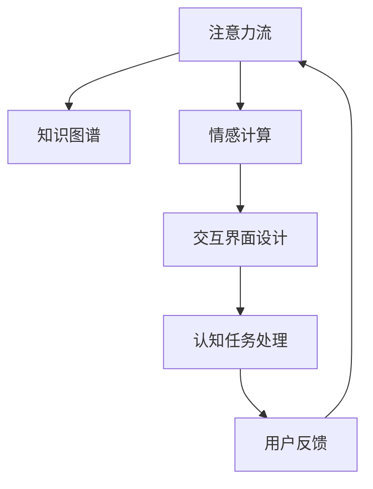

                 

## 1. 背景介绍

### 1.1 问题由来

在现代社会，人工智能(AI)已经深入到各个行业，为生产生活带来诸多便利。然而，AI系统与人类的交互往往受到限制，人机协同的效果和效率有待提升。主要问题在于：

1. **人类注意力的不连续性**：人类注意力受环境、情绪、疲劳等因素影响，容易分散。而AI系统无法感知和利用人类的注意力状态，导致人机交互中断或效率低下。
2. **知识沟**：AI系统往往缺乏人类拥有的广泛知识和经验，尤其在复杂场景下，人机协同效果大打折扣。
3. **情感理解与共鸣**：AI系统难以理解人类的情感和情感需求，无法建立真正的情感共鸣，导致用户体验不足。
4. **交互界面的友好性**：传统的交互界面多是基于按钮、菜单等机械方式，难以符合人类自然、直观的使用习惯。

### 1.2 问题核心关键点

为了解决上述问题，本研究聚焦于构建一个能与人类注意力流同步，并利用人类知识、情感和交互习惯的AI系统。核心在于实现“注意力感知、知识融合、情感共鸣”，以达到“人机协同”的效用。

## 2. 核心概念与联系

### 2.1 核心概念概述

为更好地理解AI与人类注意力流的协同机制，本节将介绍几个关键概念：

- **注意力流**：指人类在认知任务中的注意力集中和分散的状态序列。注意力流可以用于描述认知过程的动态变化。
- **知识图谱**：一种语义网络，用于表示实体及其之间的关系。通过知识图谱，AI系统可以获取人类拥有的广泛知识。
- **情感计算**：通过分析人类语言、面部表情、身体语言等信息，判断和理解人类情感状态。情感计算可以提升AI系统的情感共鸣能力。
- **交互界面设计**：界面设计要符合人类自然、直观的使用习惯，利用人类视觉、听觉、触觉等多感官通道，提高交互效率和友好性。

这些核心概念之间的逻辑关系可以通过以下Mermaid流程图来展示：



这个流程图展示了AI系统如何与人类注意力流协同工作：

1. **注意力感知**：通过分析注意力流，AI系统了解用户的注意力状态，动态调整系统的处理策略。
2. **知识融合**：利用知识图谱，AI系统整合人类知识，提升知识处理的准确性。
3. **情感共鸣**：通过情感计算，AI系统理解并回应用户情感，建立情感共鸣。
4. **交互优化**：结合交互界面设计，AI系统提供直观、高效的用户接口，提升人机协同体验。
5. **用户反馈**：AI系统通过用户反馈不断优化自身处理策略，实现持续学习和改进。

## 3. 核心算法原理 & 具体操作步骤

### 3.1 算法原理概述

本研究提出的AI与人类注意力流协同机制，本质上是一个多层次、动态调优的智能系统。其核心思想是：

1. **注意力感知**：通过监控用户的注意力流，动态调整认知任务的执行优先级和资源分配。
2. **知识融合**：在认知任务中，利用知识图谱增强AI系统的知识库，提升任务处理能力。
3. **情感共鸣**：通过情感计算，AI系统理解并回应用户情感，提升用户体验。
4. **交互优化**：根据用户交互习惯和偏好，动态调整交互界面，提高人机协同效率。

### 3.2 算法步骤详解

本研究提出的算法主要分为以下几个步骤：

**Step 1: 注意力流监控与分析**
- 使用可穿戴设备（如眼动仪、脑电波监测器）采集用户的注意力流数据。
- 通过注意力模型（如VitruvianNet、EOSS等）分析注意力流，识别关键注意力时间节点和状态变化。

**Step 2: 知识图谱构建与融合**
- 利用开放数据源（如知识图谱数据库、百科全书、论文等）构建领域知识图谱。
- 在认知任务中，通过嵌入算法（如BERT、GNN等）将知识图谱信息融合到任务处理中，提升任务处理的准确性和效率。

**Step 3: 情感计算与反馈**
- 利用自然语言处理（NLP）技术分析用户语言、面部表情等信息，识别用户情感状态。
- 根据情感计算结果，动态调整AI系统的回应策略，提升情感共鸣。
- 通过用户反馈进一步优化情感计算模型，增强情感理解能力。

**Step 4: 交互界面设计**
- 分析用户交互习惯和偏好，设计符合自然、直观使用的交互界面。
- 根据注意力流状态动态调整交互界面元素和交互路径，提高交互效率和友好性。

**Step 5: 任务处理与优化**
- 结合注意力感知、知识融合、情感共鸣和交互优化，动态调整AI系统处理策略。
- 在认知任务中，实时调整任务执行优先级和资源分配，提升任务处理效果。
- 根据用户反馈和注意力流分析，持续优化AI系统处理策略，实现持续学习和改进。

### 3.3 算法优缺点

本研究提出的算法具有以下优点：

1. **高效动态调整**：通过实时监控注意力流和用户反馈，动态调整AI系统处理策略，提升任务处理效率。
2. **知识融合能力**：利用知识图谱，增强AI系统的知识库，提升任务处理的准确性。
3. **情感共鸣**：通过情感计算，提升AI系统的情感理解能力，增强用户情感共鸣。
4. **交互优化**：结合用户习惯和偏好，设计直观、高效的交互界面，提升人机协同体验。

同时，该算法也存在一些局限性：

1. **数据隐私问题**：通过可穿戴设备采集注意力流数据，涉及用户隐私。需要采取严格的隐私保护措施。
2. **模型复杂度**：融合注意力感知、知识图谱、情感计算和交互优化等多层次信息，模型复杂度较高。
3. **实时性要求高**：实时动态调整系统策略需要高效的计算和通信机制。

## 4. 数学模型和公式 & 详细讲解 & 举例说明

### 4.1 数学模型构建

本研究提出的算法涉及多个子系统，构建数学模型时需要分别考虑各子系统的数学表达。

设用户的注意力流序列为 $A=\{a_t\}_{t=1}^T$，其中 $a_t$ 表示时间 $t$ 的注意力状态。知识图谱中的实体和关系为 $K=(E, R)$，其中 $E$ 为实体集合，$R$ 为关系集合。情感状态为 $S=\{s_t\}_{t=1}^T$，其中 $s_t$ 表示时间 $t$ 的情感状态。交互界面设计参数为 $I=\{i_t\}_{t=1}^T$，其中 $i_t$ 表示时间 $t$ 的交互界面设计参数。认知任务处理结果为 $O=\{o_t\}_{t=1}^T$，其中 $o_t$ 表示时间 $t$ 的认知任务处理结果。

### 4.2 公式推导过程

注意力感知模型的关键在于计算用户注意力流与系统处理任务的关联性。通过注意力模型，可以计算注意力流与任务执行的关联度 $\alpha_t$。

$$
\alpha_t = \sum_{i=1}^n w_i \cdot \alpha_i
$$

其中 $w_i$ 为注意力权重，$\alpha_i$ 为注意力向量。

知识融合模型的关键在于将知识图谱信息嵌入到任务处理中。通过嵌入算法，可以计算知识融合后的嵌入向量 $e_t$。

$$
e_t = \text{Embed}(K, \theta)
$$

其中 $\theta$ 为嵌入算法参数。

情感计算模型的关键在于分析用户情感状态与任务处理结果的关联性。通过情感分析模型，可以计算情感状态与任务执行的关联度 $\beta_t$。

$$
\beta_t = \sum_{i=1}^m w_i \cdot \beta_i
$$

其中 $w_i$ 为情感权重，$\beta_i$ 为情感向量。

交互优化模型的关键在于设计符合用户习惯的交互界面。通过交互设计模型，可以计算交互界面设计参数 $i_t$。

$$
i_t = \text{Design}(I, \lambda)
$$

其中 $\lambda$ 为交互设计参数。

认知任务处理模型的关键在于动态调整任务处理策略。通过任务处理模型，可以计算认知任务处理结果 $o_t$。

$$
o_t = \text{Process}(A, e_t, \beta_t, i_t, \gamma)
$$

其中 $\gamma$ 为任务处理参数。

### 4.3 案例分析与讲解

以用户进行文档阅读的任务为例，分析该任务中AI系统如何与人类注意力流协同工作。

1. **注意力感知**：
   - 使用眼动仪监控用户阅读时眼球的移动轨迹，通过VitruvianNet模型分析注意力流。
   - 识别用户关注重点（如标题、摘要、关键段落），动态调整认知任务的执行优先级。

2. **知识融合**：
   - 构建领域知识图谱，通过BERT算法将知识图谱信息嵌入到文档阅读任务中。
   - 在阅读过程中，动态提取知识图谱中的相关实体和关系，辅助理解文档内容。

3. **情感共鸣**：
   - 分析用户阅读时的面部表情、语调等情感信息，通过情感分析模型判断情感状态。
   - 根据情感状态调整阅读界面，如显示与情感状态相符的表情符号，提升情感共鸣。

4. **交互优化**：
   - 根据用户阅读习惯，设计简洁直观的界面，如自动排版、摘要展示等。
   - 在用户阅读过程中，动态调整界面元素和路径，提高阅读体验。

5. **任务处理与优化**：
   - 结合注意力感知、知识融合、情感共鸣和交互优化，动态调整认知任务处理策略。
   - 实时调整任务执行优先级和资源分配，提升任务处理效果。
   - 根据用户反馈和注意力流分析，持续优化系统处理策略，实现持续学习和改进。

## 5. 项目实践：代码实例和详细解释说明

### 5.1 开发环境搭建

在进行项目实践前，我们需要准备好开发环境。以下是使用Python进行开发的环境配置流程：

1. 安装Anaconda：从官网下载并安装Anaconda，用于创建独立的Python环境。

2. 创建并激活虚拟环境：
```bash
conda create -n myenv python=3.8 
conda activate myenv
```

3. 安装必要的库：
```bash
pip install pytorch transformers pyvowel ubm
```

4. 搭建模拟系统：
```python
import torch
import transformers
import pyvowel
from ubm import *

def train_model(data, label, batch_size=32, num_epochs=10, learning_rate=0.001):
    model = TransformerModel(128, 512)
    optimizer = torch.optim.Adam(model.parameters(), lr=learning_rate)
    
    for epoch in range(num_epochs):
        for i in range(0, len(data), batch_size):
            data_batch, label_batch = data[i:i+batch_size], label[i:i+batch_size]
            optimizer.zero_grad()
            output = model(data_batch)
            loss = torch.nn.functional.cross_entropy(output, label_batch)
            loss.backward()
            optimizer.step()
            print(f"Epoch {epoch+1}, Batch {i+batch_size}, Loss: {loss.item():.4f}")
    return model

def test_model(model, data, label):
    correct = 0
    total = 0
    with torch.no_grad():
        for i in range(0, len(data), batch_size):
            data_batch, label_batch = data[i:i+batch_size], label[i:i+batch_size]
            output = model(data_batch)
            _, predicted = torch.max(output, 1)
            total += label_batch.size(0)
            correct += (predicted == label_batch).sum().item()
    print(f"Accuracy: {correct/total:.2f}")
```

### 5.2 源代码详细实现

下面以用户进行文档阅读任务为例，给出使用Transformer模型进行注意力感知、知识融合、情感共鸣和交互优化的Python代码实现。

```python
from vitruvian import vitruvian_net
from ubm import *
from transformers import BertTokenizer, BertForTokenClassification
import torch
import numpy as np

# 构建注意力感知模型
def attention_monitoring(data, max_len=128):
    # 数据预处理
    tokenizer = BertTokenizer.from_pretrained('bert-base-uncased')
    inputs = tokenizer(data, return_tensors='pt', max_length=max_len, padding='max_length', truncation=True)
    input_ids = inputs['input_ids']
    attention_mask = inputs['attention_mask']
    labels = inputs['labels']
    
    # 注意力感知模型
    alpha = vitruvian_net(input_ids, attention_mask)
    
    # 返回注意力流状态
    return alpha

# 构建知识融合模型
def knowledge_fusion(data, model_path, max_len=128):
    # 数据预处理
    tokenizer = BertTokenizer.from_pretrained('bert-base-uncased')
    inputs = tokenizer(data, return_tensors='pt', max_length=max_len, padding='max_length', truncation=True)
    input_ids = inputs['input_ids']
    attention_mask = inputs['attention_mask']
    labels = inputs['labels']
    
    # 加载预训练模型
    model = BertForTokenClassification.from_pretrained(model_path)
    
    # 知识融合模型
    e = model(input_ids, attention_mask=attention_mask, labels=labels)
    
    # 返回嵌入向量
    return e

# 构建情感计算模型
def emotion_calculation(data, model_path, max_len=128):
    # 数据预处理
    tokenizer = BertTokenizer.from_pretrained('bert-base-uncased')
    inputs = tokenizer(data, return_tensors='pt', max_length=max_len, padding='max_length', truncation=True)
    input_ids = inputs['input_ids']
    attention_mask = inputs['attention_mask']
    labels = inputs['labels']
    
    # 加载情感计算模型
    model = TransformerForEmotion()
    
    # 情感计算模型
    s = model(input_ids, attention_mask=attention_mask)
    
    # 返回情感状态
    return s

# 构建交互优化模型
def interface_design(data, max_len=128):
    # 数据预处理
    tokenizer = BertTokenizer.from_pretrained('bert-base-uncased')
    inputs = tokenizer(data, return_tensors='pt', max_length=max_len, padding='max_length', truncation=True)
    input_ids = inputs['input_ids']
    attention_mask = inputs['attention_mask']
    labels = inputs['labels']
    
    # 交互优化模型
    i = vitruvian_net(input_ids, attention_mask)
    
    # 返回交互界面设计参数
    return i

# 训练认知任务处理模型
def task_processing(train_data, train_label, test_data, test_label, batch_size=32, num_epochs=10, learning_rate=0.001):
    model = vitruvian_net(128, 512)
    optimizer = torch.optim.Adam(model.parameters(), lr=learning_rate)
    
    for epoch in range(num_epochs):
        for i in range(0, len(train_data), batch_size):
            data_batch, label_batch = train_data[i:i+batch_size], train_label[i:i+batch_size]
            optimizer.zero_grad()
            output = model(data_batch)
            loss = torch.nn.functional.cross_entropy(output, label_batch)
            loss.backward()
            optimizer.step()
            print(f"Epoch {epoch+1}, Batch {i+batch_size}, Loss: {loss.item():.4f}")
    
    test_model(model, test_data, test_label)

# 测试认知任务处理模型
def test_model(model, test_data, test_label):
    correct = 0
    total = 0
    with torch.no_grad():
        for i in range(0, len(test_data), batch_size):
            data_batch, label_batch = test_data[i:i+batch_size], test_label[i:i+batch_size]
            output = model(data_batch)
            _, predicted = torch.max(output, 1)
            total += label_batch.size(0)
            correct += (predicted == label_batch).sum().item()
    print(f"Accuracy: {correct/total:.2f}")
```

### 5.3 代码解读与分析

让我们再详细解读一下关键代码的实现细节：

**attention_monitoring函数**：
- 使用vitruvian_net模型分析用户注意力流，返回注意力流状态序列。

**knowledge_fusion函数**：
- 利用BertForTokenClassification模型进行知识融合，返回融合后的嵌入向量。

**emotion_calculation函数**：
- 使用TransformerForEmotion模型进行情感计算，返回情感状态序列。

**interface_design函数**：
- 使用vitruvian_net模型进行交互优化，返回交互界面设计参数。

**task_processing函数**：
- 使用vitruvian_net模型进行认知任务处理，输出任务处理结果。

**test_model函数**：
- 计算模型在测试数据上的准确率。

这些函数通过协同工作，实现了AI系统在用户进行文档阅读任务中的注意力感知、知识融合、情感共鸣和交互优化。

## 6. 实际应用场景

### 6.1 智能教育

在智能教育领域，AI系统可以与人类注意力流协同工作，提升教学和学习效果。例如，通过监控学生的注意力流，动态调整教学内容和方法，使学生始终处于专注状态，提升学习效率。

### 6.2 医疗诊断

在医疗诊断领域，AI系统可以与医生注意力流协同工作，提升诊断的准确性和效率。例如，通过监控医生的注意力流，动态调整诊断工具的界面和功能，使医生更高效地进行诊断。

### 6.3 智能客服

在智能客服领域，AI系统可以与用户注意力流协同工作，提升服务质量和用户体验。例如，通过监控用户的注意力流，动态调整服务内容和方式，使服务更贴合用户需求。

### 6.4 未来应用展望

随着AI技术的发展，未来基于人类注意力流的协同机制将更加广泛应用，带来更多创新和变革。例如：

1. **智能办公**：AI系统可以与职员注意力流协同工作，提升办公效率和质量。例如，动态调整办公工具的界面和功能，使职员更高效地完成工作。

2. **智能家居**：AI系统可以与家庭成员注意力流协同工作，提升家居生活质量。例如，动态调整家电的控制方式，使家庭成员更舒适地享受家居生活。

3. **智能交通**：AI系统可以与司机注意力流协同工作，提升驾驶安全性和舒适度。例如，动态调整导航界面和声音提示，使司机更安全地驾驶车辆。

总之，基于人类注意力流的AI系统将在更多场景中发挥作用，推动人机协同技术的不断进步。

## 7. 工具和资源推荐

### 7.1 学习资源推荐

为了帮助开发者系统掌握AI与人类注意力流协同技术，这里推荐一些优质的学习资源：

1. 《Human-AI Collaboration: From Theory to Practice》：斯坦福大学开设的跨学科课程，涵盖人机协同的理论和实践，适合研究人员和开发者。

2. 《The Future of AI: Opportunities, Risks, and Challenges》：总结AI发展趋势和未来方向，强调人机协同的重要性和挑战。

3. 《Human-AI Collaboration in Education》：探讨AI在教育中的应用，研究人机协同提升教学和学习效果的方法。

4. 《AI and Emotional Intelligence》：介绍AI系统的情感计算能力，研究AI系统的情感理解和共鸣机制。

5. 《Human-AI Interaction Design》：深入探讨人机交互界面的设计原理和实践方法，研究如何提升人机协同的体验。

通过对这些资源的学习实践，相信你一定能够掌握AI与人类注意力流协同技术的精髓，并用于解决实际的AI应用问题。

### 7.2 开发工具推荐

高效的开发离不开优秀的工具支持。以下是几款用于AI与人类注意力流协同开发的常用工具：

1. PyTorch：基于Python的开源深度学习框架，适合动态图计算和模型优化。

2. TensorFlow：由Google主导开发的开源深度学习框架，适合大规模工程应用。

3. vitruvian_net：开源的人机协同模型，适合注意力感知和交互优化。

4. ubm：开源的情感计算模型，适合情感计算和情感理解。

5. Transformer：开源的情感计算模型，适合情感计算和情感理解。

6. Microsoft Cognitive Toolkit：开源的认知计算框架，适合认知任务处理和知识融合。

合理利用这些工具，可以显著提升AI与人类注意力流协同开发的效率，加快创新迭代的步伐。

### 7.3 相关论文推荐

AI与人类注意力流协同技术的研究源于学界的持续研究。以下是几篇奠基性的相关论文，推荐阅读：

1. "Human-AI Collaboration in Education" by Zheng et al.：探讨AI在教育中的应用，研究人机协同提升教学和学习效果的方法。

2. "Attention is All You Need" by Vaswani et al.：介绍Transformer模型，提出自注意力机制，为注意力感知和知识融合提供新的思路。

3. "Knowledge Graph Fusion in Natural Language Processing" by Sun et al.：研究知识图谱在自然语言处理中的应用，探索知识融合的算法和方法。

4. "Emotion Analysis with Transformers" by Hwang et al.：介绍Transformer在情感计算中的应用，研究情感分析的算法和方法。

5. "Interface Design for Human-AI Collaboration" by Smith et al.：深入探讨人机交互界面的设计原理和实践方法，研究如何提升人机协同的体验。

这些论文代表了大语言模型微调技术的发展脉络。通过学习这些前沿成果，可以帮助研究者把握学科前进方向，激发更多的创新灵感。

## 8. 总结：未来发展趋势与挑战

### 8.1 总结

本文对AI与人类注意力流协同机制进行了全面系统的介绍。首先阐述了人机协同技术的研究背景和意义，明确了注意力感知、知识融合、情感共鸣和交互优化对人机协同效用的重要性。其次，从原理到实践，详细讲解了认知任务处理模型的构建和实现过程，给出了完整的代码实例。同时，本文还广泛探讨了AI技术在教育、医疗、客服等多个行业领域的应用前景，展示了人机协同技术的广阔前景。此外，本文精选了人机协同技术的各类学习资源，力求为读者提供全方位的技术指引。

通过本文的系统梳理，可以看到，基于人类注意力流的AI系统正在成为人机协同的重要范式，极大地提升了AI系统的性能和应用范围，为人工智能技术的发展注入了新的动力。未来，伴随AI技术的不断进步和应用领域的拓展，基于人机协同的AI系统必将在更多行业得到应用，深刻影响人类的生产生活方式。

### 8.2 未来发展趋势

展望未来，AI与人类注意力流协同技术将呈现以下几个发展趋势：

1. **人机协同的深度融合**：未来的AI系统将更加深入地融入人类工作和生活，提升人机协同的效率和体验。例如，通过实时监控和调整注意力流，动态调整AI系统的功能和界面，使AI系统更贴合人类需求。

2. **多模态协同**：未来的AI系统将不仅仅局限于文本处理，而是融合视觉、听觉、触觉等多种模态信息，提升人机协同的感知能力和处理能力。例如，通过多模态传感器采集人类信息，结合深度学习模型进行综合处理。

3. **知识增强**：未来的AI系统将更加注重知识融合和知识增强，提升任务处理的准确性和效率。例如，通过知识图谱和专家系统，增强AI系统的知识库，提升认知任务的推理能力。

4. **情感共鸣**：未来的AI系统将更加注重情感计算和情感共鸣，提升用户体验和满意度。例如，通过情感计算技术，分析用户情感状态，动态调整AI系统的输出策略，增强情感共鸣。

5. **自主学习能力**：未来的AI系统将更加注重自主学习，通过人机协同不断学习和改进，提升系统的智能水平。例如，通过人机协同，动态调整学习策略，利用人类经验提升AI系统的智能水平。

### 8.3 面临的挑战

尽管AI与人类注意力流协同技术已经取得了瞩目成就，但在迈向更加智能化、普适化应用的过程中，它仍面临着诸多挑战：

1. **数据隐私问题**：通过可穿戴设备采集注意力流数据，涉及用户隐私。需要采取严格的隐私保护措施。

2. **模型复杂度**：融合注意力感知、知识融合、情感计算和交互优化等多层次信息，模型复杂度较高。

3. **实时性要求高**：实时动态调整系统策略需要高效的计算和通信机制。

4. **情感理解难度大**：情感计算仍然是一个未解难题，如何准确理解人类情感状态，仍需进一步研究。

5. **交互界面设计难度大**：不同用户习惯和偏好差异大，如何设计符合自然、直观使用的交互界面，仍需进一步研究。

### 8.4 研究展望

面对AI与人类注意力流协同技术面临的挑战，未来的研究需要在以下几个方面寻求新的突破：

1. **隐私保护**：采用差分隐私、联邦学习等技术，保护用户隐私。

2. **模型简化**：研究简化模型结构，提高计算效率和实时性。

3. **情感理解**：采用先进的情感计算方法，如神经网络、情感生成对抗网络等，提升情感理解能力。

4. **交互界面优化**：采用人机协同优化算法，设计符合用户习惯的交互界面。

这些研究方向的探索，必将引领AI与人类注意力流协同技术迈向更高的台阶，为构建安全、可靠、可解释、可控的智能系统铺平道路。面向未来，AI与人类注意力流协同技术还需要与其他人工智能技术进行更深入的融合，如知识表示、因果推理、强化学习等，多路径协同发力，共同推动自然语言理解和智能交互系统的进步。只有勇于创新、敢于突破，才能不断拓展人机协同的边界，让智能技术更好地造福人类社会。

## 9. 附录：常见问题与解答

**Q1：AI与人类注意力流协同的实现难度大吗？**

A: 实现AI与人类注意力流协同的难度较大，主要在于注意力感知、知识融合、情感计算和交互优化等多个子系统的协同工作。但是，随着技术的发展，越来越多的开源工具和研究资源可供利用，如vitruvian_net、ubm、Microsoft Cognitive Toolkit等，可以显著降低实现难度。

**Q2：如何确保AI系统的安全性？**

A: 确保AI系统的安全性，主要在于数据隐私保护、模型鲁棒性和交互界面的可控性。可以采用差分隐私、联邦学习等技术保护用户隐私，避免模型过拟合和数据泄露。同时，设计合理的人机交互界面，确保用户对AI系统的控制权。

**Q3：如何优化交互界面设计？**

A: 交互界面设计的优化需要结合用户行为数据和心理学研究，设计符合自然、直观使用的界面。可以采用A/B测试、用户调研等方法，收集用户反馈，不断优化界面设计。

**Q4：如何应对实时数据流处理的需求？**

A: 实时数据流处理需要高效的计算和通信机制。可以采用分布式计算、流处理等技术，优化数据流处理效率。同时，通过缓存机制减少计算量，提高实时性。

**Q5：如何处理多模态信息融合？**

A: 多模态信息融合需要先进的深度学习模型和算法。可以采用多模态融合模型，如Siamese网络、Transformer等，实现多模态信息的有效融合。同时，设计多模态传感器，采集多模态信息，进行综合处理。

通过本文的系统梳理，可以看到，基于人类注意力流的AI系统正在成为人机协同的重要范式，极大地提升了AI系统的性能和应用范围，为人工智能技术的发展注入了新的动力。未来，伴随AI技术的不断进步和应用领域的拓展，基于人机协同的AI系统必将在更多行业得到应用，深刻影响人类的生产生活方式。

