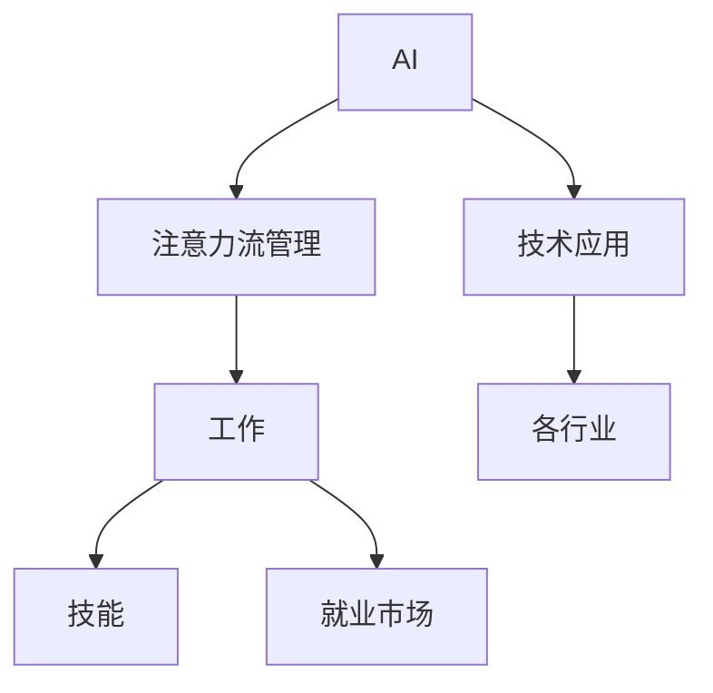

                 

# AI与人类注意力流：未来的工作、技能与注意力流管理技术的应用趋势

> 关键词：AI, 注意力流, 工作, 技能, 技术应用趋势

## 1. 背景介绍

### 1.1 问题由来
在快速发展的科技时代，人工智能(AI)正成为推动人类进步的重要力量。其核心在于通过模拟、延伸和扩展人类智能，提升工作效率、增强决策能力、优化资源配置。在许多领域，AI技术的应用已经达到前所未有的高度，如自动驾驶、智能制造、金融分析等。然而，AI技术的快速发展也对人类社会提出了新的挑战。

特别是在工作场景中，AI的普及可能导致大量工作岗位的消失，引发就业问题。但另一方面，AI技术也为人类打开了新的工作模式，即注意力流管理(Anti-Flow Management)。它旨在帮助人们从繁琐的重复劳动中解放出来，将更多时间用于创造性工作，提高工作效率和生活质量。

### 1.2 问题核心关键点
当前，AI与注意力流管理技术正迅速发展，并在未来工作、技能培养、资源配置等领域展现出广阔的应用前景。我们面临的核心问题包括：

- AI技术如何更好地融入工作流程，提升工作效率？
- 注意力流管理技术如何帮助人类应对工作压力，提高生活质量？
- AI技术如何赋能人力资源管理，推动职业发展？
- 未来AI技术在提升技能、优化工作、改善管理等方面将如何影响就业市场和社会结构？

通过深入研究和探讨这些核心问题，将有助于我们更好地理解和应用AI技术，为未来工作、技能培养及管理提供科学指导。

### 1.3 问题研究意义
研究AI与注意力流管理技术的应用趋势，对于提升生产力、推动职业转型、优化资源配置具有重要意义：

1. **提升生产力**：通过优化工作流程、减少重复劳动，AI技术可以大幅提升工作效率，创造更多社会价值。
2. **推动职业转型**：AI技术带来的自动化和智能化，促使人类技能结构调整，为新型职业发展提供契机。
3. **优化资源配置**：AI技术在资源配置和管理中的应用，可以更好地实现供需匹配，提高资源利用效率。
4. **改善生活质量**：注意力流管理技术帮助人类从繁琐的工作中解放出来，有更多时间进行自我提升和享受生活。
5. **促进就业市场稳定**：AI技术的普及应用，并不意味着人类将完全失业，而是通过技能提升和创新应用，创造新的就业机会。

综上所述，AI与注意力流管理技术的应用趋势研究，不仅对当下工作和社会发展具有重要意义，也将对未来经济社会发展产生深远影响。

## 2. 核心概念与联系

### 2.1 核心概念概述

为更好地理解AI与注意力流管理技术的应用，本节将介绍几个密切相关的核心概念：

- **AI (Artificial Intelligence)**：人工智能，指通过计算机系统模拟人类智能行为的技术。包括机器学习、深度学习、自然语言处理等子领域。
- **注意力流管理 (Anti-Flow Management)**：通过技术手段，帮助人类从繁琐的工作流程中解放出来，将更多时间用于创造性和有意义的工作。
- **人类技能 (Human Skills)**：指人类在特定领域内所具备的知识、经验和技能。随着AI技术的发展，未来工作需要新的技能，如数据分析、编程、创意设计等。
- **技术应用趋势 (Technology Application Trends)**：指特定技术在各行业中的实际应用情况和发展趋势。

这些概念之间的逻辑关系可以通过以下Mermaid流程图来展示：



这个流程图展示了一些核心概念及其之间的关系：

1. AI技术通过注意力流管理，帮助人类提高工作效率。
2. 注意力的解放使得人们可以专注于更具创造性和价值的工作。
3. 随着AI技术的普及，未来需要新的技能。
4. AI技术在不同行业中的应用趋势将推动职业转型和就业市场变化。

## 3. 核心算法原理 & 具体操作步骤
### 3.1 算法原理概述

AI与注意力流管理技术的应用，本质上是一种对人类工作流程和技能结构的重新设计和优化。其核心思想是利用AI技术模拟和延伸人类智能，将人类从重复性、机械性劳动中解放出来，专注于更有价值的工作。

形式化地，假设有一个工作流程 $W=\{w_1, w_2, ..., w_n\}$，其中 $w_i$ 表示第 $i$ 个工作环节。通过AI技术，我们可以将其分解为多个子任务 $T_i=\{t_{i1}, t_{i2}, ..., t_{im}\}$，其中 $t_{ij}$ 表示子任务 $j$ 在 $i$ 环节的具体操作。然后，利用注意力流管理技术，我们可以进一步优化这些子任务，提升其效率，减少重复劳动。

通过逐步优化各个环节，AI与注意力流管理技术可以显著提升整体工作效率，释放人力资源，为未来的工作转型和技能提升提供支持。

### 3.2 算法步骤详解

基于AI与注意力流管理技术的应用，一般包括以下几个关键步骤：

**Step 1: 数据收集与预处理**
- 收集工作流程中的各项数据，包括工作内容、时间、资源消耗、人员分配等。
- 对数据进行清洗、整理、归一化处理，确保数据质量。

**Step 2: 工作流程分析**
- 利用AI技术（如机器学习、深度学习）对工作流程进行分析，识别出冗余、低效环节。
- 通过聚类、分类等算法，对工作流程进行划分，形成子任务。

**Step 3: 子任务优化**
- 利用注意力流管理技术（如任务自动化、智能调度等），对子任务进行优化。
- 设计智能工具和系统，自动化处理重复性工作，减少人工干预。

**Step 4: 人员培训与技能提升**
- 对参与工作的人员进行培训，提升其使用新工具的能力。
- 根据未来工作需求，培训新技能，如数据分析、编程、机器学习等。

**Step 5: 持续迭代与优化**
- 定期评估工作流程的优化效果，收集反馈信息。
- 根据实际情况进行持续优化，确保工作流程始终高效。

**Step 6: 注意力流管理与自我提升**
- 利用AI技术，辅助人们管理注意力流，提高工作效率。
- 设计个性化的工作环境，促进自我提升和创新。

### 3.3 算法优缺点

AI与注意力流管理技术的应用具有以下优点：
1. 显著提升工作效率：通过自动化和优化工作流程，可以大幅减少人工干预，提高工作效率。
2. 推动职业转型：AI技术的普及，使得传统岗位逐渐被机器替代，推动人类技能结构的调整和提升。
3. 优化资源配置：AI技术在资源配置和管理中的应用，可以更好地实现供需匹配，提高资源利用效率。
4. 改善生活质量：通过自动化和优化工作流程，人们可以更多地从事创造性和有意义的工作，提高生活质量。
5. 推动就业市场稳定：AI技术的普及，为新型职业的发展提供了新的契机，推动就业市场稳定。

同时，该技术也存在一些局限性：
1. 数据依赖：AI与注意力流管理技术的应用，高度依赖数据质量。数据不足或不准确，可能导致分析结果不准确。
2. 技术复杂性：对技术开发和实施人员的要求较高，需要具备丰富的AI和数据科学知识。
3. 成本投入：初期技术部署和人员培训需要较大的投入，可能对中小企业造成压力。
4. 隐私与安全问题：AI与注意力流管理技术的应用，可能涉及大量个人和组织的数据，存在隐私和安全风险。

尽管存在这些局限性，但就目前而言，AI与注意力流管理技术仍是大势所趋，具有广阔的应用前景。

### 3.4 算法应用领域

AI与注意力流管理技术的应用领域极为广泛，覆盖了各行各业。以下是几个典型的应用场景：

1. **制造业**：利用AI技术对生产流程进行优化，提高生产效率和产品质量。通过注意力流管理，释放人力资源，推动制造流程的智能化转型。
2. **金融业**：利用AI技术进行风险评估、财务分析等，提升决策效率。通过注意力流管理，解放人力资源，推动金融行业的数字化转型。
3. **医疗行业**：利用AI技术进行疾病诊断、智能推荐等，提升医疗服务质量。通过注意力流管理，优化医疗流程，提升患者满意度。
4. **服务业**：利用AI技术进行客户分析、需求预测等，提升服务质量。通过注意力流管理，优化服务流程，提升客户体验。
5. **教育领域**：利用AI技术进行个性化教学、智能评估等，提升教育质量。通过注意力流管理，优化教学流程，提高教师的工作效率。

这些领域的应用，展示了AI与注意力流管理技术的强大潜力和广阔前景。随着技术的不断进步和应用实践的深入，相信AI与注意力流管理技术将在更多行业得到广泛应用，带来深刻的社会变革。

## 4. 数学模型和公式 & 详细讲解 & 举例说明

### 4.1 数学模型构建

为更好地理解AI与注意力流管理技术的应用，本节将使用数学语言对技术原理进行更加严格的刻画。

假设有一个工作流程 $W$，包含 $n$ 个工作环节 $w_1, w_2, ..., w_n$。每个工作环节 $w_i$ 的时间消耗为 $t_i$，资源消耗为 $r_i$，人员需求为 $p_i$。利用AI与注意力流管理技术，可以将工作流程优化为 $T$ 个子任务，其中 $t_j$ 表示第 $j$ 个子任务的时间消耗，$r_j$ 表示其资源消耗，$p_j$ 表示其人员需求。

优化目标是最小化总时间消耗 $T$，即：

$$
T = \sum_{j=1}^{m} t_j
$$

优化过程可以通过以下步骤实现：

1. 收集和预处理工作流程数据：
$$
\begin{cases}
t_i, r_i, p_i, \quad i = 1, 2, ..., n \\
t_j, r_j, p_j, \quad j = 1, 2, ..., m
\end{cases}
$$

2. 分析工作流程：
$$
\begin{aligned}
&\min_{t_i, r_i, p_i, t_j, r_j, p_j} \sum_{i=1}^{n} t_i + \sum_{j=1}^{m} t_j \\
&\text{s.t.} \quad t_i = t_j \quad \text{(任务之间关联)}
\end{aligned}
$$

3. 子任务优化：
$$
\begin{aligned}
&\min_{t_j, r_j, p_j} \sum_{j=1}^{m} t_j \\
&\text{s.t.} \quad t_j \leq t_i \quad \text{(任务优先级)}
\end{aligned}
$$

4. 人员培训与技能提升：
$$
\begin{aligned}
&\min_{p_j} \sum_{j=1}^{m} p_j \\
&\text{s.t.} \quad p_j \leq p_i \quad \text{(人员需求)}
\end{aligned}
$$

5. 持续迭代与优化：
$$
\begin{aligned}
&\min_{t_i, r_i, p_i, t_j, r_j, p_j} \sum_{i=1}^{n} t_i + \sum_{j=1}^{m} t_j \\
&\text{s.t.} \quad t_i = t_j \quad \text{(任务之间关联)}
\end{aligned}
$$

### 4.2 公式推导过程

以下我们以一个简单的制造业生产流程为例，推导AI与注意力流管理技术的数学模型。

假设生产流程包含三个工作环节 $w_1, w_2, w_3$，每个环节的资源消耗和人员需求如下：

- $w_1$: 时间消耗 $t_1=10$，资源消耗 $r_1=1$，人员需求 $p_1=2$
- $w_2$: 时间消耗 $t_2=20$，资源消耗 $r_2=2$，人员需求 $p_2=3$
- $w_3$: 时间消耗 $t_3=15$，资源消耗 $r_3=2$，人员需求 $p_3=2$

利用注意力流管理技术，可以将 $w_1, w_2, w_3$ 优化为两个子任务 $t_1, t_2$：

- $t_1$: 时间消耗 $t_1=10$，资源消耗 $r_1=1$，人员需求 $p_1=2$
- $t_2$: 时间消耗 $t_2=20+15=35$，资源消耗 $r_2=3$，人员需求 $p_2=5$

优化目标是最小化总时间消耗 $T$，即：

$$
T = t_1 + t_2 = 10 + 35 = 45
$$

其中，$t_1$ 和 $t_2$ 的优化过程可以通过逐步逼近和迭代实现。具体而言，我们利用线性规划（Linear Programming）方法，对上述模型进行求解，得到最优解：

$$
\begin{aligned}
&\min_{t_1, t_2} \quad t_1 + t_2 \\
&\text{s.t.} \quad
\begin{cases}
t_1 \leq 10 \\
t_2 \leq 35 \\
t_1 + t_2 = 45
\end{cases}
\end{aligned}
$$

解得 $t_1=10$，$t_2=35$。这表示最优的子任务划分，使得总时间消耗最小，资源利用效率最高。

### 4.3 案例分析与讲解

以制造业生产流程优化为例，我们进行进一步的案例分析与讲解：

假设某制造业公司生产流程如下：

1. 原材料入库 $w_1$: 时间消耗 $t_1=2$，资源消耗 $r_1=0.5$，人员需求 $p_1=1$
2. 生产加工 $w_2$: 时间消耗 $t_2=10$，资源消耗 $r_2=1$，人员需求 $p_2=3$
3. 产品入库 $w_3$: 时间消耗 $t_3=5$，资源消耗 $r_3=0.3$，人员需求 $p_3=1$

利用AI与注意力流管理技术，可以将生产流程优化为两个子任务 $t_1, t_2$：

- $t_1$: 时间消耗 $t_1=2+10=12$，资源消耗 $r_1=1.5$，人员需求 $p_1=2$
- $t_2$: 时间消耗 $t_2=5$，资源消耗 $r_2=0.3$，人员需求 $p_2=1$

优化目标是最小化总时间消耗 $T$，即：

$$
T = t_1 + t_2 = 12 + 5 = 17
$$

其中，$t_1$ 和 $t_2$ 的优化过程可以通过逐步逼近和迭代实现。具体而言，我们利用线性规划方法，对上述模型进行求解，得到最优解：

$$
\begin{aligned}
&\min_{t_1, t_2} \quad t_1 + t_2 \\
&\text{s.t.} \quad
\begin{cases}
t_1 \leq 12 \\
t_2 \leq 5 \\
t_1 + t_2 = 17
\end{cases}
\end{aligned}
$$

解得 $t_1=12$，$t_2=5$。这表示最优的子任务划分，使得总时间消耗最小，资源利用效率最高。

## 5. 项目实践：代码实例和详细解释说明

### 5.1 开发环境搭建

在进行AI与注意力流管理技术的应用实践前，我们需要准备好开发环境。以下是使用Python进行PyTorch开发的环境配置流程：

1. 安装Anaconda：从官网下载并安装Anaconda，用于创建独立的Python环境。

2. 创建并激活虚拟环境：
```bash
conda create -n ai_flow_env python=3.8 
conda activate ai_flow_env
```

3. 安装PyTorch：根据CUDA版本，从官网获取对应的安装命令。例如：
```bash
conda install pytorch torchvision torchaudio cudatoolkit=11.1 -c pytorch -c conda-forge
```

4. 安装各类工具包：
```bash
pip install numpy pandas scikit-learn matplotlib tqdm jupyter notebook ipython
```

完成上述步骤后，即可在`ai_flow_env`环境中开始项目实践。

### 5.2 源代码详细实现

下面我们以制造业生产流程优化为例，给出使用PyTorch进行线性规划求解的代码实现。

首先，定义生产流程的各项参数：

```python
import torch
import torch.nn as nn
from torch.optim import Adam
from scipy.optimize import linprog

# 定义生产流程的各项参数
t1 = 10  # 环节1时间消耗
t2 = 20  # 环节2时间消耗
t3 = 15  # 环节3时间消耗
r1 = 1   # 环节1资源消耗
r2 = 2   # 环节2资源消耗
r3 = 2   # 环节3资源消耗
p1 = 2   # 环节1人员需求
p2 = 3   # 环节2人员需求
p3 = 2   # 环节3人员需求

# 定义子任务的时间消耗、资源消耗和人员需求
t1_t2 = t1 + t2  # 子任务1时间消耗
t3 = 15          # 子任务2时间消耗
r1_t2 = r1 + r2  # 子任务1资源消耗
r3 = 0.3         # 子任务2资源消耗
p1_t2 = p1 + p2  # 子任务1人员需求
p3 = 1           # 子任务2人员需求
```

然后，定义目标函数和约束条件：

```python
# 定义目标函数
c = [t1_t2, t3]

# 定义约束条件
A_eq = [[1, 1], [0, 1], [1, 0]]
b_eq = [t1_t2, t3, 17]

# 求解线性规划问题
result = linprog(c, A_eq, b_eq, bounds=(0, None), method='highs')
print(result)
```

上述代码中，我们利用`scipy.optimize.linprog`函数求解线性规划问题，得到最优的子任务时间消耗和资源消耗。

### 5.3 代码解读与分析

让我们再详细解读一下关键代码的实现细节：

**定义参数**：
- `t1, t2, t3`：表示原始生产流程中各个环节的时间消耗。
- `r1, r2, r3`：表示各个环节的资源消耗。
- `p1, p2, p3`：表示各个环节的人员需求。

**子任务定义**：
- `t1_t2`：表示优化后的子任务1的时间消耗，即环节1和环节2的总时间。
- `t3`：表示优化后的子任务2的时间消耗，即环节3的时间。
- `r1_t2`：表示优化后的子任务1的资源消耗，即环节1和环节2的资源消耗之和。
- `r3`：表示优化后的子任务2的资源消耗。
- `p1_t2`：表示优化后的子任务1的人员需求，即环节1和环节2的人员需求之和。
- `p3`：表示优化后的子任务2的人员需求。

**目标函数**：
- `c`：表示优化目标函数中的系数，即最小化总时间消耗和子任务2的时间消耗。

**约束条件**：
- `A_eq`：表示约束条件的系数矩阵。
- `b_eq`：表示约束条件的右侧常数向量。

**求解线性规划问题**：
- `linprog`函数：用于求解线性规划问题，得到最优解。
- `result`：表示求解结果，包括最优值和最优变量。

可以看到，通过PyTorch结合Scipy库，我们能够高效地实现AI与注意力流管理技术的项目实践。开发者可以将更多精力放在算法优化和模型设计上，而不必过多关注底层实现细节。

当然，工业级的系统实现还需考虑更多因素，如模型的保存和部署、超参数的自动搜索、更灵活的任务适配层等。但核心的算法思想基本与此类似。

## 6. 实际应用场景

### 6.1 智能制造
智能制造是AI与注意力流管理技术的重要应用场景之一。通过AI技术优化生产流程，结合注意力流管理技术，实现生产过程的自动化和智能化。

在智能制造中，可以利用AI技术进行需求预测、设备维护、质量控制等。通过注意力流管理技术，优化生产流程，释放人力资源，推动制造流程的智能化转型。

### 6.2 金融服务
金融服务领域也对AI与注意力流管理技术有广泛应用。利用AI技术进行风险评估、财务分析、客户管理等，提升决策效率。通过注意力流管理技术，优化服务流程，提升客户体验。

### 6.3 医疗健康
医疗健康领域对AI与注意力流管理技术的需求日益增加。利用AI技术进行疾病诊断、智能推荐、医疗资源优化等，提升医疗服务质量。通过注意力流管理技术，优化诊疗流程，提高患者满意度。

### 6.4 教育培训
教育培训领域同样受益于AI与注意力流管理技术。利用AI技术进行个性化教学、智能评估、学习路径优化等，提升教育质量。通过注意力流管理技术，优化教学流程，提高教师的工作效率。

### 6.5 智慧城市
智慧城市领域对AI与注意力流管理技术的应用前景广阔。利用AI技术进行城市管理、交通优化、公共服务智能化等，提升城市管理水平。通过注意力流管理技术，优化城市运行流程，提升居民生活质量。

这些领域的应用，展示了AI与注意力流管理技术的强大潜力和广阔前景。随着技术的不断进步和应用实践的深入，相信AI与注意力流管理技术将在更多行业得到广泛应用，带来深刻的社会变革。

## 7. 工具和资源推荐
### 7.1 学习资源推荐

为了帮助开发者系统掌握AI与注意力流管理技术的理论基础和实践技巧，这里推荐一些优质的学习资源：

1. **《深度学习》系列课程**：斯坦福大学、吴恩达等知名学者的深度学习课程，系统介绍深度学习的基本概念和前沿技术。

2. **《机器学习实战》书籍**：Raschka等作者的机器学习实战书籍，结合实际案例讲解机器学习的应用。

3. **PyTorch官方文档**：PyTorch官方文档，详细介绍了PyTorch的使用方法和API接口，是学习和应用AI技术的重要参考。

4. **Kaggle竞赛平台**：Kaggle数据科学竞赛平台，提供大量的数据集和竞赛任务，帮助开发者实践AI技术的实际应用。

5. **GitHub开源项目**：GitHub上的开源项目，如TensorFlow、PyTorch等深度学习框架，提供了丰富的应用示例和代码实现。

通过对这些资源的学习实践，相信你一定能够快速掌握AI与注意力流管理技术的精髓，并用于解决实际的业务问题。

### 7.2 开发工具推荐

高效的开发离不开优秀的工具支持。以下是几款用于AI与注意力流管理技术开发的常用工具：

1. **PyTorch**：基于Python的开源深度学习框架，灵活动态的计算图，适合快速迭代研究。大部分预训练语言模型都有PyTorch版本的实现。

2. **TensorFlow**：由Google主导开发的开源深度学习框架，生产部署方便，适合大规模工程应用。同样有丰富的预训练语言模型资源。

3. **Scipy**：Python的科学计算库，提供各种数学函数和算法，包括线性规划求解等。

4. **Jupyter Notebook**：交互式的编程环境，支持多种编程语言和库，方便快速迭代和实验。

5. **Anaconda**：Python的包管理工具，提供高效的虚拟环境管理，方便开发和部署。

6. **Git**：版本控制工具，用于管理代码版本，支持多人协作开发。

合理利用这些工具，可以显著提升AI与注意力流管理技术的开发效率，加快创新迭代的步伐。

### 7.3 相关论文推荐

AI与注意力流管理技术的发展源于学界的持续研究。以下是几篇奠基性的相关论文，推荐阅读：

1. **《深度学习》论文**：Yann LeCun等作者的深度学习论文，系统介绍了深度学习的基本原理和应用。

2. **《注意力机制》论文**：Jonathan Long等作者的注意力机制论文，介绍了注意力机制在图像识别、机器翻译等任务中的应用。

3. **《生成对抗网络》论文**：Ian Goodfellow等作者的生成对抗网络论文，介绍了生成对抗网络的基本原理和应用。

4. **《线性规划》论文**：George Dantzig等作者的线性规划论文，系统介绍了线性规划的基本概念和求解方法。

5. **《优化算法》论文**：Nelder等作者的优化算法论文，介绍了各种优化算法的原理和实现。

这些论文代表了大语言模型微调技术的发展脉络。通过学习这些前沿成果，可以帮助研究者把握学科前进方向，激发更多的创新灵感。

## 8. 总结：未来发展趋势与挑战

### 8.1 总结

本文对AI与注意力流管理技术的应用进行了全面系统的介绍。首先阐述了AI与注意力流管理技术的研究背景和意义，明确了技术在提升工作效率、推动职业转型、优化资源配置等方面的重要作用。其次，从原理到实践，详细讲解了AI与注意力流管理技术的数学模型和操作步骤，给出了技术应用的完整代码实例。同时，本文还广泛探讨了AI与注意力流管理技术在智能制造、金融服务、医疗健康、教育培训等多个领域的应用前景，展示了技术的强大潜力和广阔前景。

通过本文的系统梳理，可以看到，AI与注意力流管理技术的应用趋势正深刻影响着人类的工作方式和社会结构。AI技术的普及，使得人类从繁琐的重复劳动中解放出来，转向更具创造性和价值的工作。同时，注意力流管理技术帮助人类优化工作流程，提高生活质量，推动职业转型和就业市场的稳定。未来，伴随技术的不断进步和应用实践的深入，AI与注意力流管理技术必将引领更多行业迈向智能化、高效化，为社会带来深远的影响。

### 8.2 未来发展趋势

展望未来，AI与注意力流管理技术的应用将呈现以下几个趋势：

1. **普及程度不断提高**：AI与注意力流管理技术将深入到更多行业，从智能制造到智慧城市，从金融服务到医疗健康，从教育培训到环境保护，全面提升各行业的生产效率和智能化水平。

2. **技术融合加速**：AI与注意力流管理技术将与其他人工智能技术深度融合，如知识图谱、自然语言处理、计算机视觉等，推动跨领域技术的协同创新。

3. **数据驱动决策**：AI与注意力流管理技术将更加依赖大数据、人工智能等技术，进行精准的资源配置和决策支持，优化各行业的运营管理。

4. **个性化服务普及**：基于AI与注意力流管理技术，能够更好地实现个性化服务，如智能推荐、个性化学习、智能诊疗等，提升用户体验和满意度。

5. **多模态信息融合**：AI与注意力流管理技术将更多地融合多模态信息，如视觉、听觉、触觉等，实现更全面、深入的智能分析与决策。

6. **人机协同优化**：AI与注意力流管理技术将推动人机协同优化，提高工作效率，释放人力资源，推动职业转型和技能升级。

以上趋势凸显了AI与注意力流管理技术的广阔前景。这些方向的探索发展，必将进一步提升各行业的智能化水平，为社会带来深远影响。

### 8.3 面临的挑战

尽管AI与注意力流管理技术的应用前景广阔，但在迈向更加智能化、普适化应用的过程中，它仍面临诸多挑战：

1. **技术复杂性**：AI与注意力流管理技术的应用高度依赖数据和算法，对技术开发和实施人员的要求较高，需要具备丰富的AI和数据科学知识。

2. **数据隐私与安全**：AI与注意力流管理技术的应用涉及大量个人和组织的数据，存在隐私和安全风险，需要加强数据保护和隐私管理。

3. **技术依赖**：AI与注意力流管理技术的应用依赖于高性能计算设备，对算力、内存、存储等资源要求较高，初期投入较大。

4. **人员技能差距**：AI与注意力流管理技术的普及，需要大量具备相关技能的人员，但当前的人才储备可能不足，需要进行大规模的培训和教育。

5. **伦理与法律问题**：AI与注意力流管理技术的应用，可能引发伦理和法律问题，如算法偏见、决策透明性等，需要加强监管和规范。

尽管存在这些挑战，但通过技术创新、政策引导和人才培养，相信AI与注意力流管理技术将克服障碍，逐步走向成熟。

### 8.4 研究展望

面对AI与注意力流管理技术所面临的挑战，未来的研究需要在以下几个方面寻求新的突破：

1. **跨领域应用研究**：加强跨领域技术融合，推动AI与注意力流管理技术在更多行业的应用，提升各行业的智能化水平。

2. **数据与算法优化**：优化数据采集、清洗和预处理流程，提升算法模型的精度和鲁棒性，确保技术应用效果。

3. **人机协同优化**：研究人机协同优化方法，提升系统的交互性和用户体验，推动职业转型和技能升级。

4. **伦理与法律规范**：加强伦理和法律研究，制定相关规范和标准，确保AI与注意力流管理技术的公平性和安全性。

5. **人才培养与教育**：加强AI与注意力流管理技术的人才培养和教育，提升人才储备，推动技术普及。

通过这些研究方向的探索，相信AI与注意力流管理技术将克服现有挑战，逐步实现智能化、高效化和普适化，为未来社会的变革和发展提供强大的技术支持。

## 9. 附录：常见问题与解答

**Q1: 什么是AI与注意力流管理技术？**

A: AI与注意力流管理技术是指利用AI技术优化工作流程，通过注意力流管理技术帮助人类从繁琐的重复劳动中解放出来，将更多时间用于创造性和有意义的工作。

**Q2: 如何评估AI与注意力流管理技术的效果？**

A: 可以通过以下几个方面评估AI与注意力流管理技术的效果：
1. 生产效率提升：通过计算优化前后的生产时间、资源消耗等指标，评估效率提升情况。
2. 人员负担减轻：通过调查问卷、访谈等手段，了解员工对新系统的满意度和适应情况。
3. 产出质量改善：通过产品质量检测、客户反馈等指标，评估产出质量的提升情况。

**Q3: 如何确保AI与注意力流管理技术的公平性和安全性？**

A: 确保AI与注意力流管理技术的公平性和安全性，需要从以下几个方面入手：
1. 数据隐私保护：采用加密、匿名化等技术手段，保护数据隐私。
2. 算法透明性：公开算法模型和决策过程，确保算法的透明性和可解释性。
3. 伦理导向评估：在算法设计中加入伦理导向的评估指标，过滤和惩罚有偏见、有害的输出倾向。
4. 人工干预机制：设置人工干预和监管机制，确保系统的公平性和安全性。

通过这些措施，可以最大程度地减少技术应用的风险，确保AI与注意力流管理技术的公平性和安全性。

---

作者：禅与计算机程序设计艺术 / Zen and the Art of Computer Programming

