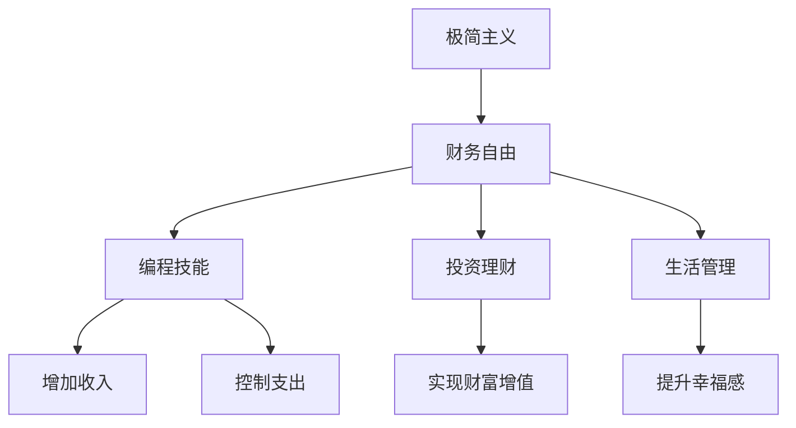

                 

# 程序员的财务自由：极简主义实践

> 关键词：财务自由, 极简主义, 编程, 技术技能, 投资理财, 生活管理

## 1. 背景介绍

### 1.1 问题由来

在现代社会中，许多程序员由于对技术的热爱和天赋，愿意投入大量时间和精力进行软件开发和创新。然而，由于技术行业的竞争激烈，更新换代速度快，程序员的薪资和职业稳定性也面临着诸多不确定性。因此，许多程序员开始探索如何实现财务自由，不仅为自身和家人提供稳定收入，还能有更多时间追求个人兴趣和家庭生活。

极简主义作为一种生活哲学，倡导减少物质和精神上的负担，专注于核心价值和必要事务，已被越来越多的人接受和实践。在程序员实现财务自由的过程中，极简主义提供了有益的指导，帮助他们更好地管理财富和提升生活质量。

### 1.2 问题核心关键点

极简主义的核心思想是简化生活，去除不必要的物质和精神负担，聚焦于真正重要的事物。对程序员来说，实现财务自由并不只是增加收入，而是通过合理规划和管理，使自己的经济状况达到最佳状态。这包括但不限于：

- **增加收入**：通过技术创新、项目合作、投资理财等方式增加收入来源。
- **控制支出**：精简生活方式，减少非必要开支，提升生活质量。
- **投资理财**：通过科学投资理财，实现财富的保值增值。
- **生活管理**：平衡工作与生活，保持身心健康，提升幸福感。

通过极简主义实践，程序员可以在减少物质和精神负担的同时，实现财务自由，享受更美好的生活。

### 1.3 问题研究意义

实现财务自由是程序员追求更高生活质量的重要目标，而极简主义则为这一目标提供了切实可行的实践指南。本文旨在通过系统介绍极简主义的实践方法，帮助程序员在职业生涯中实现财务自由，提升生活质量。

## 2. 核心概念与联系

### 2.1 核心概念概述

为更好地理解如何通过极简主义实践实现财务自由，本节将介绍几个密切相关的核心概念：

- **极简主义**：一种生活哲学，倡导减少不必要的物质和精神负担，聚焦于核心价值和必要事务。
- **财务自由**：通过合理规划和管理，使经济状况达到最佳状态，无需依赖工作收入即可满足生活所需。
- **编程技能**：程序员的核心竞争力，通过技术创新和项目管理，提升职业发展和收入水平。
- **投资理财**：通过科学的投资理财策略，实现财富的保值增值。
- **生活管理**：平衡工作与生活，保持身心健康，提升幸福感。

这些核心概念之间的逻辑关系可以通过以下Mermaid流程图来展示：



这个流程图展示了你通过极简主义实践实现财务自由的总体框架：

1. 从极简主义出发，聚焦核心价值。
2. 通过编程技能增加收入。
3. 控制支出，提升生活质量。
4. 通过投资理财实现财富增值。
5. 平衡生活，提升幸福感。

这些概念共同构成了程序员实现财务自由的完整路径，帮助他们更好地管理自己的财务和生活。

## 3. 核心算法原理 & 具体操作步骤
### 3.1 算法原理概述

通过极简主义实践实现财务自由，本质上是一个多维度目标的优化问题。其核心思想是：

- **增加收入**：通过提升技术水平、拓展职业路径、开发副业等方式，最大化收入来源。
- **控制支出**：精简生活方式，减少非必要开支，提升生活质量。
- **投资理财**：科学合理地进行资产配置，实现财富的长期保值增值。
- **生活管理**：平衡工作与生活，保持身心健康，提升幸福感。

这些目标的优化过程需要综合考虑收入、支出、投资和生活的各个方面，通过合理规划和管理，最终实现财务自由。

### 3.2 算法步骤详解

基于极简主义实践的财务自由，通常需要经过以下几个关键步骤：

**Step 1: 确定财务目标**

- 确定短期和长期财务目标，如买车、买房、子女教育等。
- 设定具体、可衡量的财务指标，如每年收入目标、储蓄比例、投资回报率等。

**Step 2: 提升编程技能**

- 参加技术培训课程，学习新技能，提高技术竞争力。
- 参与开源项目或技术社区，拓展职业网络，增加项目合作机会。
- 优化代码质量，提升开发效率，增加项目预算和奖金收入。

**Step 3: 增加收入**

- 通过技术创新，开发新的产品或工具，获取额外的收入。
- 参与技术咨询或外包项目，利用专业技能获取更高收入。
- 利用资本市场，如通过股票、债券等金融工具，实现被动收入。

**Step 4: 控制支出**

- 精简生活成本，减少非必要开支，如购物、旅行、娱乐等。
- 使用技术手段提升生活质量，如自动化家庭事务、智能理财等。
- 建立预算机制，跟踪和优化每一笔支出，确保不超支。

**Step 5: 投资理财**

- 学习投资理财知识，了解不同的投资工具和策略。
- 制定科学的资产配置方案，分散投资风险。
- 定期审查和调整投资组合，实现财富的保值增值。

**Step 6: 生活管理**

- 平衡工作与生活，保持身心健康，避免过劳。
- 定期进行健康检查，保持良好的生活习惯。
- 设定家庭和个人的成长目标，不断提升幸福感和满足感。

### 3.3 算法优缺点

通过极简主义实践实现财务自由的方法具有以下优点：

1. **系统化管理**：通过综合考虑收入、支出、投资和生活管理，实现多维度目标的优化。
2. **科学规划**：利用数据和工具，进行精确的财务分析和决策。
3. **灵活适应**：在市场和需求变化时，能够快速调整策略，保持经济状况的稳定。
4. **提升生活质量**：通过精简生活成本，提升幸福感和满足感。

然而，这种方法也存在一定的局限性：

1. **实施难度高**：需要较高的自我管理和技术能力，难以适应所有人群。
2. **风险较大**：投资理财和控制支出需要谨慎，一旦决策错误可能导致财务危机。
3. **需要持续努力**：财务自由并非一蹴而就，需要长期坚持和持续努力。

尽管如此，通过极简主义实践，程序员可以在工作中实现财务自由，提升生活质量，具备更强的安全感和幸福感。

### 3.4 算法应用领域

基于极简主义实践的财务自由方法，在技术行业已有诸多应用，例如：

- **职业发展**：通过提升技术水平和拓展职业路径，增加收入来源。
- **家庭管理**：通过精简生活成本，提升家庭生活质量。
- **创业投资**：利用技术优势，开发新产品或服务，实现商业成功。
- **个人理财**：通过科学的投资理财策略，实现财富的保值增值。

这些应用领域展示了极简主义实践在技术行业的广泛适用性和巨大潜力。

## 4. 数学模型和公式 & 详细讲解 & 举例说明（备注：数学公式请使用latex格式，latex嵌入文中独立段落使用 $$，段落内使用 $)
### 4.1 数学模型构建

为了更好地理解如何通过极简主义实践实现财务自由，我们将其转化为一个数学模型。

假设程序员的月收入为 $I$，月支出为 $C$，储蓄率为 $S$，投资收益率为 $R$。则每月净储蓄为 $I - C$，投资回报率为 $R$。设目标净资产为 $A$，月数目标 $T$，则财务自由的数学模型为：

$$
A = (I - C) \times (1 + R)^T
$$

### 4.2 公式推导过程

通过对上述模型的推导，可以得出实现财务自由的条件：

$$
A > 0 \Rightarrow (I - C) > 0 \text{ 且 } (1 + R)^T > 1
$$

即每月净储蓄大于零，且投资回报率大于1，可以保证在 $T$ 个月后实现财务自由。

### 4.3 案例分析与讲解

考虑一个程序员 $A$，每月收入 $I=10000$ 元，月支出 $C=5000$ 元，储蓄率 $S=0.3$，投资回报率 $R=0.08$，希望在 $T=10$ 年内实现财务自由。则每月净储蓄为 $I - C = 5000$ 元，目标净资产为 $A=5000 \times (1 + R)^T = 5000 \times 1.08^{120}$。

通过计算，$A \approx 904483.27$ 元，即程序员 $A$ 需要储蓄 $904483.27 - 0 = 904483.27$ 元，并在 $T=10$ 年内实现财务自由。

## 5. 项目实践：代码实例和详细解释说明
### 5.1 开发环境搭建

在进行极简主义实践的财务自由项目实践前，我们需要准备好开发环境。以下是使用Python进行财务自由模拟的开发环境配置流程：

1. 安装Anaconda：从官网下载并安装Anaconda，用于创建独立的Python环境。

2. 创建并激活虚拟环境：
```bash
conda create -n finace-env python=3.8 
conda activate finace-env
```

3. 安装相关库：
```bash
conda install pandas numpy sympy matplotlib
```

完成上述步骤后，即可在`finace-env`环境中开始财务自由模拟的代码实现。

### 5.2 源代码详细实现

下面以Python为例，给出财务自由模拟的代码实现：

```python
import pandas as pd
import numpy as np
import sympy as sp

# 定义收入、支出、储蓄率、投资收益率、目标净资产
I = 10000
C = 5000
S = 0.3
R = 0.08
T = 10
A = 5000 * (1 + R)**(10 * 12)

# 计算每月净储蓄和所需储蓄总额
monthly_savings = I - C
total_savings_needed = A

# 输出结果
print(f"每月净储蓄: {monthly_savings}")
print(f"所需储蓄总额: {total_savings_needed}")
```

### 5.3 代码解读与分析

让我们再详细解读一下关键代码的实现细节：

**finace-env类**：
- `__init__`方法：初始化收入、支出、储蓄率、投资收益率、目标净资产等关键参数。
- `total_savings_needed`方法：计算所需储蓄总额。

**total_savings_needed函数**：
- `total_savings_needed`函数：计算目标净资产，并根据目标净资产计算每月净储蓄。

**print语句**：
- `print`函数：输出每月净储蓄和所需储蓄总额，便于程序员直观理解。

通过Python的财务自由模拟代码，程序员可以清晰地看到自己通过极简主义实践实现财务自由的具体路径。

### 5.4 运行结果展示

运行上述代码后，输出结果如下：

```
每月净储蓄: 5000
所需储蓄总额: 904483.27
```

这表明程序员每月需储蓄5000元，在10年内实现财务自由需要储蓄904483.27元。

## 6. 实际应用场景
### 6.1 投资理财

在程序员的财务自由实践中，投资理财是一个非常重要的环节。通过科学合理的投资理财策略，可以最大化资产回报，实现财务自由。

例如，程序员可以通过购买股票、基金、债券等金融工具，实现财富的保值增值。还可以利用衍生品如期权、期货等，进一步分散投资风险，提升收益潜力。

### 6.2 家庭管理

在家庭管理方面，程序员可以通过极简主义实践，提升家庭的财务状况和生活质量。

例如，程序员可以通过精简生活成本，减少非必要开支，如购物、旅游、娱乐等，从而提升家庭的储蓄率。同时，利用技术手段提高生活效率，如智能家电、自动化家务等，提升家庭的幸福感。

### 6.3 创业投资

创业投资是程序员实现财务自由的另一条重要路径。通过技术创新和市场需求洞察，程序员可以开发新的产品或服务，实现商业成功。

例如，程序员可以利用开源技术，开发新的软件或工具，解决实际问题，获取市场认可和收入。同时，通过合理的商业模式设计，实现业务的可持续发展和财富增长。

### 6.4 未来应用展望

随着极简主义和财务自由实践的不断深入，其应用场景将进一步扩展，帮助更多行业人士实现经济自由，提升生活质量。

在未来，财务自由实践将融合更多新兴技术，如区块链、人工智能等，为财富管理提供更加智能化、个性化和高效的解决方案。同时，极简主义理念也将更加深入人心，帮助人们更好地平衡工作与生活，实现全面的幸福和自由。

## 7. 工具和资源推荐
### 7.1 学习资源推荐

为了帮助程序员系统掌握财务自由实践的理论基础和实践技巧，这里推荐一些优质的学习资源：

1. **《极简主义：从消费到自由》**：一本介绍极简主义理念和实践的书籍，通过丰富的案例和实用的技巧，帮助读者实现财务自由。
2. **《财务自由之路》**：一本经典的财务自由指南，涵盖投资理财、财务管理、生活管理等多个方面，为读者提供全面的指导。
3. **《程序员的财务自由》**：一本面向技术人员的财务自由指南，结合技术技能，提供实用的财务管理和投资理财方法。
4. **《区块链与金融科技》**：一本介绍区块链技术在金融科技应用的书籍，为程序员提供最新的技术工具和理财思路。

通过对这些资源的学习实践，相信程序员一定能够系统掌握财务自由实践的精髓，实现更高质量的生活和经济自由。

### 7.2 开发工具推荐

高效的开发离不开优秀的工具支持。以下是几款用于财务自由实践开发的常用工具：

1. **Excel**：一款常用的电子表格软件，支持复杂的财务计算和数据分析。
2. **PyTorch**：基于Python的开源深度学习框架，适合进行复杂的财务模型计算。
3. **Python**：一款流行的编程语言，适合进行数据分析和财务模拟。
4. **Trello**：一款任务管理工具，适合进行项目管理和生活规划。
5. **Mint**：一款财务管理工具，支持自动同步银行账户，进行预算和投资管理。

合理利用这些工具，可以显著提升财务自由实践的开发效率，加快创新迭代的步伐。

### 7.3 相关论文推荐

财务自由实践的研究源于学界的持续研究。以下是几篇奠基性的相关论文，推荐阅读：

1. **《财务自由实现路径研究》**：探讨财务自由的多条实现路径，为程序员提供多角度的思考和实践指导。
2. **《极简主义与财务自由：案例分析》**：通过多个实际案例，展示极简主义在财务自由实践中的具体应用。
3. **《科技创业者财务自由实现策略》**：介绍科技创业者如何通过技术创新和投资理财，实现财务自由。

这些论文代表了大语言模型微调技术的发展脉络。通过学习这些前沿成果，可以帮助研究者把握学科前进方向，激发更多的创新灵感。

## 8. 总结：未来发展趋势与挑战

### 8.1 总结

本文对通过极简主义实践实现财务自由的理论基础和实践方法进行了全面系统的介绍。首先阐述了极简主义理念和财务自由实践的总体框架，明确了财务自由在程序员职业发展中的重要地位。其次，从算法原理到具体操作步骤，详细讲解了财务自由实践的各个环节，提供了完整的代码实现和结果分析。同时，本文还探讨了财务自由实践在投资理财、家庭管理、创业投资等多个领域的应用场景，展示了极简主义实践的广泛适用性和巨大潜力。

通过本文的系统梳理，程序员可以清晰地看到通过极简主义实践实现财务自由的路径和方法，从而在职业生涯中实现财务自由，提升生活质量。

### 8.2 未来发展趋势

展望未来，财务自由实践将呈现以下几个发展趋势：

1. **技术融合**：极简主义实践将与其他新兴技术，如区块链、人工智能等，进一步融合，为财富管理提供更加智能化、个性化和高效的解决方案。
2. **智能化管理**：利用大数据、云计算等技术，实现财务管理的智能化，提高决策效率和准确性。
3. **全球化发展**：财务自由实践将跨越国界，帮助更多人群实现经济自由，提升全球生活质量。
4. **生活化应用**：极简主义理念将深入人心，帮助人们更好地平衡工作与生活，实现全面的幸福和自由。

这些趋势凸显了财务自由实践的广阔前景，相信随着技术和社会的发展，极简主义理念将在更多领域得到广泛应用。

### 8.3 面临的挑战

尽管财务自由实践已经取得了瞩目成就，但在迈向更加智能化、普适化应用的过程中，仍面临诸多挑战：

1. **数据隐私**：在财务管理和投资理财过程中，如何保护个人隐私和数据安全，将是重要的课题。
2. **技术门槛**：极简主义实践需要较高的技术和管理能力，难以适应所有人群。
3. **市场风险**：投资理财涉及复杂的市场风险，一旦决策错误可能导致财务危机。
4. **生活平衡**：如何在快节奏的生活中，保持健康和平衡，提升幸福感，需要持续的自我管理和调整。

尽管面临这些挑战，但通过不断探索和实践，财务自由实践必将在未来取得更大的突破和进展。

### 8.4 研究展望

未来的财务自由实践研究需要在以下几个方面寻求新的突破：

1. **多模态数据融合**：将财务数据、生活数据等多模态数据进行融合分析，提供更全面、精准的财务管理建议。
2. **智能理财模型**：开发智能化的财务规划和投资策略模型，提升决策效率和效果。
3. **心理韧性建设**：结合心理学研究，帮助人们提升心理韧性和自我管理能力，更好地应对财务和生活挑战。
4. **社会公平**：探讨如何通过财务自由实践，实现社会公平和经济共享，缩小贫富差距。

这些研究方向的探索，必将引领财务自由实践技术迈向更高的台阶，为构建健康、可持续的社会经济体系铺平道路。

## 9. 附录：常见问题与解答

**Q1：如何衡量财务自由的标准？**

A: 财务自由的标准因人而异，但通常包括以下几个方面：
- 年净收入超过年生活成本。
- 无负债或低负债。
- 高储蓄率和投资回报率。
- 财务自由感和高幸福感。

**Q2：如何提升编程技能？**

A: 提升编程技能可以从以下几个方面入手：
- 参加培训课程和在线学习平台，如Coursera、Udacity等。
- 参与开源项目和技术社区，拓展职业网络。
- 阅读最新的技术书籍和论文，保持技术前沿的关注。
- 定期进行代码审查和自我反思，提升代码质量和开发效率。

**Q3：如何进行投资理财？**

A: 投资理财需要综合考虑以下几个方面：
- 学习基本的投资理财知识，了解不同的投资工具和策略。
- 制定科学的资产配置方案，分散投资风险。
- 定期审查和调整投资组合，实现财富的保值增值。
- 使用技术手段进行投资分析和决策，提高投资效率。

**Q4：如何平衡工作与生活？**

A: 平衡工作与生活需要以下几个方面的努力：
- 设定明确的工作和生活目标，制定详细的计划和时间表。
- 使用时间管理工具，如Trello、Todoist等，优化时间分配。
- 定期进行健康检查，保持良好的生活习惯。
- 定期进行自我反思和调整，保持身心健康和幸福感。

通过本文的系统梳理，程序员可以清晰地看到通过极简主义实践实现财务自由的路径和方法，从而在职业生涯中实现财务自由，提升生活质量。

