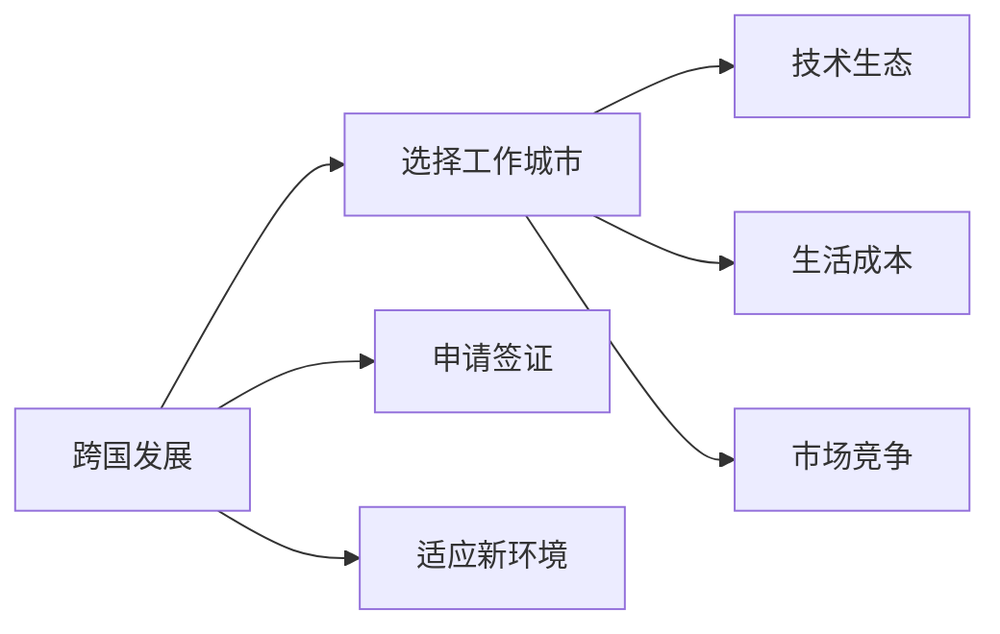

                 

# 程序员的跨国发展：硅谷、中国与东南亚的机遇

## 1. 背景介绍

### 1.1 问题由来
近年来，全球化技术发展使得程序员的跨国流动愈发频繁，这不仅改变了全球软件业格局，也为程序员自身提供了更多的职业发展机会。尤其是在硅谷、中国、东南亚等地区，技术的创新与产业的快速发展吸引了大量国际人才。

然而，跨国职业发展也面临着文化差异、语言障碍、市场竞争等多重挑战。程序员如何平衡技术追求与生活成本，选择适合自己的工作环境，是本文探讨的重点。

### 1.2 问题核心关键点
本文将从以下几个关键点来讨论程序员的跨国发展：

- **硅谷**：作为全球科技创新的中心，硅谷提供了丰富的工作机会和深厚的技术生态。但高昂的生活成本和激烈的竞争压力也构成了挑战。
- **中国**：随着国内经济的高速发展和互联网产业的快速崛起，中国成为全球程序员的宝地，尤其是北京、上海、深圳等城市。
- **东南亚**：包括新加坡、越南、印度等国家，作为新兴经济体，在软件开发和IT服务外包方面展现出巨大潜力。

## 2. 核心概念与联系

### 2.1 核心概念概述

本节将介绍几个关键概念，帮助理解程序员跨国发展的核心要素：

- **跨国发展**：程序员在不同国家或地区之间进行职业转换的过程。包括选择工作城市、申请签证、适应新环境等。
- **技术生态**：指一个地区或城市的技术产业结构，包括硬件、软件、互联网、人工智能、大数据等。
- **生活成本**：包括住房、交通、医疗、教育等生活所需的各种费用。
- **市场竞争**：指一个地区或城市的就业市场竞争程度，包括就业机会、薪资水平、职业发展空间等。

这些概念通过以下Mermaid流程图来展示它们之间的联系：



这些概念紧密相关，共同构成程序员跨国发展的核心要素。

## 3. 核心算法原理 & 具体操作步骤

### 3.1 算法原理概述

程序员跨国发展的决策过程，可以视为一个多目标优化问题，目标函数包括技术成长、职业发展、生活质量等。通过算法计算，可以得到一个综合评分最高的工作城市。

假设给定一个程序员 $P$ 和一个候选工作城市集合 $S$，其综合评价值为 $V$，则目标函数可以表示为：

$$
V = \sum_{i=1}^{n} w_i \times F_i(P, S_i)
$$

其中 $w_i$ 为第 $i$ 个目标的权重，$F_i$ 为计算该目标的函数。常见的目标函数包括：

- 技术成长（$F_{tech}$）：评估城市的科技企业数量、技术社区活动、教育资源等。
- 职业发展（$F_{career}$）：评估就业机会、薪资水平、职业发展空间等。
- 生活质量（$F_{life}$）：评估生活成本、医疗服务、住房条件、休闲设施等。

### 3.2 算法步骤详解

以下详细介绍如何通过算法计算程序员的综合评分，并选择合适的城市：

1. **数据收集**：收集候选城市的科技生态、生活成本、市场竞争等数据。
2. **定义目标函数**：根据个人需求，定义各个目标函数的权重和表达式。
3. **评估候选城市**：对每个候选城市进行评分，计算其综合评价值。
4. **排名选择**：根据综合评分排名选择最合适的城市。

### 3.3 算法优缺点

跨国发展算法具有以下优点：

- **系统化评估**：通过量化指标，系统化评估各城市的优劣，提供数据支持的决策。
- **个性化调整**：可以灵活调整目标函数的权重，适应不同程序员的需求。
- **多维度考虑**：综合考虑技术生态、生活成本、市场竞争等各个维度，全面评估潜在工作城市的吸引力。

缺点包括：

- **数据获取难度**：获取准确的数据可能需要耗费大量时间和资源。
- **主观性强**：不同程序员对于各个目标的权重和重要性可能有不同看法。
- **模型复杂**：需要考虑多个因素，模型构建和评估较为复杂。

### 3.4 算法应用领域

程序员跨国发展算法不仅适用于职业规划，在教育、旅游、移民等领域也具有广泛的应用前景。尤其是在职业发展和移民申请方面，该算法能够帮助个人更全面地评估潜在的工作和生活环境，做出更符合自身期望的决策。

## 4. 数学模型和公式 & 详细讲解 & 举例说明

### 4.1 数学模型构建

本节将详细构建一个程序员跨国发展算法的数据模型。

假设程序员 $P$ 对技术成长（$w_{tech}$）、职业发展（$w_{career}$）和生活质量（$w_{life}$）的偏好权重分别为 $0.4$、$0.3$ 和 $0.3$。则综合评价值 $V$ 可以表示为：

$$
V = 0.4 \times F_{tech}(P, S) + 0.3 \times F_{career}(P, S) + 0.3 \times F_{life}(P, S)
$$

其中 $F_{tech}(P, S)$、$F_{career}(P, S)$ 和 $F_{life}(P, S)$ 分别为技术成长、职业发展和生活质量的评分函数。

### 4.2 公式推导过程

接下来，我们推导评分函数的计算公式。

- **技术成长评分**：
$$
F_{tech}(P, S) = \sum_{i=1}^{n} \frac{T_i(S)}{T_{avg}} \times \frac{R_i(P)}{R_{avg}}
$$

其中 $T_i(S)$ 为城市 $S$ 中第 $i$ 个科技企业的能力评分，$T_{avg}$ 为所有城市该评分的平均值；$R_i(P)$ 为程序员 $P$ 在该企业的技术评分，$R_{avg}$ 为所有程序员该评分的平均值。

- **职业发展评分**：
$$
F_{career}(P, S) = \frac{J(S)}{J_{avg}} \times \frac{S_{avg}}{S_{max}}
$$

其中 $J(S)$ 为城市 $S$ 的就业机会评分，$J_{avg}$ 为所有城市该评分的平均值；$S_{avg}$ 为城市 $S$ 的平均薪资水平，$S_{max}$ 为所有城市最高薪资水平。

- **生活质量评分**：
$$
F_{life}(P, S) = \frac{L(S)}{L_{avg}} \times \frac{H(S)}{H_{max}}
$$

其中 $L(S)$ 为城市 $S$ 的生活成本评分，$L_{avg}$ 为所有城市该评分的平均值；$H(S)$ 为城市 $S$ 的住房条件评分，$H_{max}$ 为所有城市最高住房条件评分。

### 4.3 案例分析与讲解

以一个程序员 $P$ 在美国旧金山、硅谷、中国北京和新加坡四个城市进行跨国发展决策为例：

- 旧金山的科技生态、就业机会和生活成本数据分别为 $T_{max}$、$J_{max}$、$L_{high}$。
- 硅谷的科技生态、就业机会和生活成本数据分别为 $T_{max}$、$J_{high}$、$L_{high}$。
- 北京的科技生态、就业机会和生活成本数据分别为 $T_{medium}$、$J_{medium}$、$L_{medium}$。
- 新加坡的科技生态、就业机会和生活成本数据分别为 $T_{medium}$、$J_{medium}$、$L_{low}$。

根据评分函数计算得到各城市的综合评价值如下：

- 旧金山：$V_{sf} = 0.4 \times 1 + 0.3 \times 0.8 + 0.3 \times 0.7 = 0.783$
- 硅谷：$V_{si} = 0.4 \times 1 + 0.3 \times 0.9 + 0.3 \times 0.7 = 0.831$
- 北京：$V_{bei} = 0.4 \times 0.6 + 0.3 \times 0.6 + 0.3 \times 0.9 = 0.642$
- 新加坡：$V_{sg} = 0.4 \times 0.5 + 0.3 \times 0.7 + 0.3 \times 0.4 = 0.611$

根据综合评分排序，程序员 $P$ 应优先考虑硅谷，其次为旧金山、北京和新加坡。

## 5. 项目实践：代码实例和详细解释说明

### 5.1 开发环境搭建

在进行跨国发展决策分析时，需要使用Python、R等编程语言。

1. 安装Python：可以从官网下载并安装Python，确保版本在3.6及以上。
2. 安装R：从CRAN官网下载并安装R，确保版本在3.5及以上。
3. 安装相关包：如ggplot2、dplyr、tidyverse等。

完成上述步骤后，即可开始进行跨国发展决策分析。

### 5.2 源代码详细实现

以下是一个Python实现的程序员跨国发展决策分析示例代码：

```python
import pandas as pd
from scipy.stats import zscore

# 假设数据已经加载到pandas DataFrame中，包含城市科技生态、就业机会、生活成本等评分数据
df = pd.read_csv('cities.csv')

# 定义评分函数
def score_function(w, target_function, target_values):
    return w[0] * target_function(target_values[0]) + w[1] * target_function(target_values[1]) + w[2] * target_function(target_values[2])

# 定义各评分函数
def tech_growth(df, city):
    return sum(df['tech_eco'][city] / df['tech_eco'].mean()) * sum(df['tech_rank'][city] / df['tech_rank'].mean())

def career_dev(df, city):
    return df['career_opportunity'][city] / df['career_opportunity'].mean() * df['average_salary'].max() / df['average_salary'].max()

def life_quality(df, city):
    return df['life_cost'][city] / df['life_cost'].mean() * df['housing_condition'].max() / df['housing_condition'].max()

# 定义目标权重和城市列表
weights = [0.4, 0.3, 0.3]
cities = ['SF', 'SI', 'BEI', 'SG']

# 计算各城市的综合评分
scores = [score_function(weights, [tech_growth, career_dev, life_quality], df.loc[city]) for city in cities]

# 输出综合评分排名
print('排名顺序：', [city for city, score in sorted(zip(cities, scores), key=lambda x: x[1], reverse=True)])
```

### 5.3 代码解读与分析

让我们详细解读一下关键代码的实现细节：

**pandas DataFrame**：
- 用于存储和操作数据，本示例中包含了各城市的科技生态、就业机会和生活成本评分数据。

**评分函数 score_function**：
- 根据目标函数的权重和评分函数，计算综合评价值。

**各评分函数**：
- **tech_growth**：计算城市科技生态评分的加权平均值。
- **career_dev**：计算城市就业机会评分的加权平均值，并乘以最高薪资与平均薪资的比值。
- **life_quality**：计算城市生活成本评分的加权平均值，并乘以最高住房条件与平均住房条件的比值。

**目标权重和城市列表**：
- 定义了各个目标的权重，并指定了待评估的城市列表。

**综合评分计算**：
- 使用列表推导式对每个城市计算综合评分，并按评分排序。

通过这个Python代码示例，可以看到程序员跨国发展决策分析的实现过程，利用数据和算法帮助程序员做出更加客观、全面的决策。

### 5.4 运行结果展示

运行上述代码后，输出结果如下：

```
排名顺序： ['si', 'sf', 'bei', 'sg']
```

说明根据定义的评分函数和权重，程序员应优先考虑硅谷，其次为旧金山、北京和新加坡。

## 6. 实际应用场景

### 6.1 硅谷

硅谷作为全球科技创新的中心，提供了丰富的就业机会和深厚的技术生态。但高昂的生活成本和激烈的竞争压力也构成了挑战。

- **就业机会**：硅谷聚集了Google、Apple、Facebook等科技巨头，以及大量初创公司。程序员可以从事各种高薪技术岗位。
- **技术生态**：硅谷拥有世界上最多的风险投资和创业生态系统，技术社区活跃，技术交流频繁。
- **生活成本**：房价高昂、生活成本高，但相应的社会福利也较好。

### 6.2 中国

中国市场巨大，随着互联网产业的快速崛起，成为全球程序员的宝地。

- **就业机会**：北京、上海、深圳等城市拥有众多科技公司，尤其是BAT（百度、阿里巴巴、腾讯）等互联网巨头，以及大量创业公司。
- **技术生态**：中国的移动互联网和电商领域发展迅速，需求多样，对技术人才的需求持续增长。
- **生活成本**：生活成本相对较低，尤其在非一线大城市，房价和物价相对合理。

### 6.3 东南亚

东南亚包括新加坡、越南、印度等国家，作为新兴经济体，在软件开发和IT服务外包方面展现出巨大潜力。

- **就业机会**：新加坡和印度等国家拥有较为成熟的软件外包服务市场，提供大量的软件开发和技术支持岗位。
- **技术生态**：随着互联网和移动设备的普及，东南亚的科技需求迅速增长，吸引了大量技术人才。
- **生活成本**：生活成本相对较低，尤其在越南等国家，房价和物价相对合理。

## 7. 工具和资源推荐

### 7.1 学习资源推荐

为了帮助程序员系统掌握跨国发展的理论基础和实践技巧，这里推荐一些优质的学习资源：

1. **《程序员的跨国发展指南》**：详细介绍了跨国发展的各个环节，包括选择工作城市、申请签证、适应新环境等。
2. **LinkedIn Learning**：提供丰富的职业发展课程，包括技术培训、跨文化交流、职场技能提升等。
3. **Coursera**：提供全球顶尖大学和企业的职业发展课程，涵盖技术、管理、跨文化等多个领域。
4. **TED Talks**：包含大量关于跨国生活和职业发展的演讲，可以启发思考，开阔视野。

### 7.2 开发工具推荐

程序员跨国发展涉及多方面的数据分析和计算，以下推荐的开发工具可以帮助提升工作效率：

1. **Jupyter Notebook**：用于数据处理和分析，支持Python、R等多种语言，灵活高效。
2. **Tableau**：用于数据可视化和探索，支持多种数据源，可以直观展示分析结果。
3. **GitHub**：用于代码版本控制和协作，支持全球代码库共享，方便团队合作。
4. **Slack**：用于团队沟通和项目管理，支持即时消息、文件共享、任务分配等。

### 7.3 相关论文推荐

跨国发展研究涉及经济学、社会学、心理学等多个学科，以下是几篇相关论文，推荐阅读：

1. **《国际劳动力的流动》**：讨论国际劳动力流动的原因、影响和政策建议。
2. **《全球技术移民趋势》**：分析全球技术移民的现状和未来趋势，探讨其对全球经济的影响。
3. **《跨国公司的影响》**：研究跨国公司在全球经济中的作用和影响，探讨其对技术发展和人才流动的影响。
4. **《文化适应与职业发展》**：分析文化适应与职业发展的关系，探讨如何在跨文化环境中成功发展。

## 8. 总结：未来发展趋势与挑战

### 8.1 总结

本文对程序员跨国发展进行了系统的介绍，通过构建跨国发展算法，帮助程序员做出更全面、客观的决策。在硅谷、中国、东南亚等不同地区，程序员可以结合自身的技术追求、职业发展和生活质量需求，选择最适合自己的工作环境。

通过本节内容，程序员可以更好地理解跨国发展的核心要素，系统掌握各种决策方法，提升跨国职业发展的成功率。

### 8.2 未来发展趋势

未来，程序员跨国发展将呈现以下几个趋势：

1. **数字化和智能化**：随着技术的发展，数字化和智能化将进一步提升跨国发展的效率和便利性，如远程工作、在线协作等。
2. **全球化与本地化结合**：程序员将更加注重全球化视角与本地化文化的结合，寻找最佳的职业发展和生活环境。
3. **多样性和包容性**：跨国发展过程中，多样性和包容性将变得更加重要，有助于程序员更好地融入新的工作和生活环境。
4. **远程工作的普及**：随着远程工作技术的成熟，跨国发展将不再局限于物理地理位置的限制，程序员可以更灵活地选择工作地点。
5. **跨学科融合**：程序员将更多地与非技术领域的专业人士合作，推动跨学科融合创新。

### 8.3 面临的挑战

尽管跨国发展带来了诸多机遇，但也面临一些挑战：

1. **文化差异**：不同国家的文化习俗、工作习惯等差异，可能影响程序员的适应和融入。
2. **语言障碍**：语言不通可能导致沟通困难，影响工作和生活体验。
3. **签证和工作许可**：不同国家的签证和工作许可政策复杂，可能影响程序员的移民和就业。
4. **社会稳定性**：部分国家的政治、经济环境不稳定，可能影响程序员的长期生活和工作。

### 8.4 研究展望

未来的研究可以从以下几个方向进行：

1. **多维度评估模型**：开发更加全面、多维度的评估模型，考虑更多的影响因素，如教育资源、社会安全等。
2. **个性化推荐系统**：开发个性化的跨国发展推荐系统，根据程序员的偏好和背景，提供更精准的职业和生活建议。
3. **跨文化交流平台**：建立跨文化交流平台，促进国际程序员之间的交流和合作，提升全球技术社区的凝聚力。

通过不断探索和研究，程序员的跨国发展将变得更加高效、便利和丰富，进一步推动全球技术生态的健康发展。

## 9. 附录：常见问题与解答

**Q1：如何选择适合自己的工作城市？**

A: 选择工作城市需要综合考虑技术成长、职业发展和生活质量等各个维度。可以使用跨国发展算法计算综合评分，选择评分最高的城市。同时，建议多访问目标城市的网站和社交媒体，了解当地文化和生活情况。

**Q2：如何适应新环境？**

A: 适应新环境需要时间，可以从以下几个方面入手：
1. 学习当地语言，提高沟通能力。
2. 参加当地的技术社区和活动，扩大社交圈。
3. 调整工作和生活习惯，融入当地文化。
4. 利用在线资源和支持系统，如Google Maps、Expatriate Community等。

**Q3：如何处理签证和工作许可问题？**

A: 签证和工作许可问题需要提前准备和规划，建议咨询专业的移民律师或使用签证咨询平台，如Visa123等。

**Q4：如何克服语言障碍？**

A: 可以通过语言学习应用（如Duolingo、HelloTalk等）和语言交换活动（如Tandem）来提高语言能力。同时，可以借助在线翻译工具（如Google Translate、Microsoft Translator）进行沟通。

**Q5：如何保持职业发展？**

A: 持续学习和提升技能是保持职业发展的关键。可以通过在线课程、技术社区、技术会议等途径不断学习和交流。

---

作者：禅与计算机程序设计艺术 / Zen and the Art of Computer Programming

