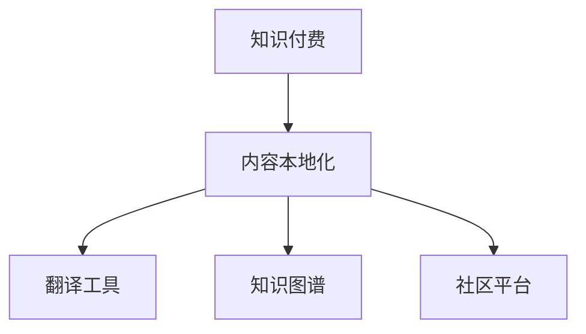

                 

# 程序员知识付费的内容本地化策略

## 1. 背景介绍

### 1.1 问题由来
随着知识付费的兴起，程序员社群中涌现出了大量优质的内容。这些内容涵盖编程语言、架构设计、算法优化、软件工程等多个方面，对于提升编程水平和解决实际问题具有重要价值。然而，知识付费的内容往往以英文为主，中文内容相对较少，且质量参差不齐。对于广大中文程序员而言，如何获取和利用这些优质英文资源，成为了一个难题。

### 1.2 问题核心关键点
本文聚焦于程序员知识付费的内容本地化策略，旨在探讨如何高效、精准地将优质英文编程内容转化为中文内容，使得更多中文程序员能够获取和利用这些资源，提升编程能力和解决问题的能力。

### 1.3 问题研究意义
1. **降低语言障碍**：中文程序员对于编程语言的理解可能存在一定的困难，通过本地化内容，可以帮助他们更好地理解和学习。
2. **提升学习效率**：本地化内容可以更贴近中文程序员的认知习惯，提升学习效率和效果。
3. **促进知识传播**：本地化内容更容易在中文程序员中传播，有利于知识的扩散和共享。
4. **推动产业升级**：通过本地化优质内容，可以帮助更多程序员提升技能，加速国内软件产业的转型升级。

## 2. 核心概念与联系

### 2.1 核心概念概述

为更好地理解程序员知识付费内容本地化策略，本节将介绍几个密切相关的核心概念：

- **知识付费**：通过付费获取优质学习资源和专业服务，以提升自身技能和解决问题能力的一种知识传播方式。
- **内容本地化**：将原语言的内容转化为目标语言，使其适应目标受众，从而提升传播效果和用户体验。
- **翻译工具**：利用机器翻译、人工翻译等工具，实现文本内容的语言转换。
- **知识图谱**：对知识内容进行结构化表示，构建概念之间的关联，帮助用户更好地理解和应用知识。
- **社区平台**：提供程序员交流、分享、学习的平台，如知乎、掘金、CSDN等，便于知识传播和本地化内容的发布。

这些核心概念之间的逻辑关系可以通过以下Mermaid流程图来展示：



这个流程图展示了一系列与程序员知识付费内容本地化相关的关键概念及其之间的关系：

1. 知识付费是内容本地化的来源。
2. 内容本地化通过翻译工具、知识图谱、社区平台等手段，实现从英文到中文的转换和传播。
3. 翻译工具、知识图谱和社区平台协同工作，共同提升本地化内容的精准度和传播效果。

## 3. 核心算法原理 & 具体操作步骤
### 3.1 算法原理概述

程序员知识付费内容本地化策略的核心在于如何高效、准确地将优质英文内容转换为中文，同时保留其原本的逻辑和语义。通常，这一过程包括以下几个步骤：

1. **内容识别**：从知识付费平台中识别出有价值的英文内容。
2. **内容翻译**：利用机器翻译或人工翻译工具，将英文内容翻译为中文。
3. **内容优化**：对翻译后的内容进行语言和文化适应性优化，确保其适合中文程序员的认知习惯。
4. **内容分发**：通过社区平台将本地化内容推送给中文程序员，便于其获取和利用。

### 3.2 算法步骤详解

**Step 1: 内容识别**
- 选择知识付费平台，如Coursera、Udemy、LeetCode等，收集优质英文内容。
- 利用爬虫技术获取平台上的课程、文章、视频等资源。

**Step 2: 内容翻译**
- 选择机器翻译工具，如Google Translate、DeepL、有道翻译等，对英文内容进行初步翻译。
- 选择人工翻译平台，如Upwork、Freelancer、Gengo等，对机器翻译结果进行校对和优化。

**Step 3: 内容优化**
- 利用知识图谱工具，如Semantic Scholar、Google Scholar等，对翻译内容进行结构化分析，提取关键概念和逻辑关系。
- 根据中文程序员的认知习惯和语言表达特点，对翻译内容进行语言和文化适应性优化。
- 利用社区平台的用户反馈，持续迭代优化内容。

**Step 4: 内容分发**
- 在社区平台（如知乎、掘金、CSDN等）上发布本地化内容。
- 利用社区平台的推送机制，将内容精准推送给中文程序员。

### 3.3 算法优缺点

程序员知识付费内容本地化策略具有以下优点：
1. **降低语言障碍**：帮助中文程序员更轻松地获取优质英文内容。
2. **提升学习效率**：优化后的内容更符合中文程序员的认知习惯，学习效率更高。
3. **促进知识传播**：通过社区平台的推广，帮助优质内容更广泛传播。

同时，该策略也存在一定的局限性：
1. **翻译质量受限**：机器翻译可能存在语言和文化表达不准确的问题。
2. **文化适应性不足**：本地化内容可能无法完全适应中文程序员的文化背景和需求。
3. **分发效果依赖平台**：社区平台的用户粘性和活跃度会直接影响内容的传播效果。

尽管存在这些局限性，但通过合理的策略和工具，可以尽可能地降低这些影响，使得内容本地化策略在程序员知识付费领域发挥更大的作用。

### 3.4 算法应用领域

程序员知识付费内容本地化策略在多个领域都有广泛的应用：

- **在线教育**：将优质英文编程课程翻译为中文，提供给中文程序员学习。
- **技术博客**：将英文技术文章翻译为中文，便于程序员获取最新技术动态。
- **开源社区**：将英文开源项目文档翻译为中文，帮助中文程序员更好地使用和贡献。
- **技术培训**：将英文编程培训课程翻译为中文，提供给中文程序员进行技能提升。

除了上述这些应用场景外，本地化策略也可以推广到其他领域，如编程面试题库、软件开发工具等，进一步拓展其应用边界。

## 4. 数学模型和公式 & 详细讲解 & 举例说明

### 4.1 数学模型构建

在程序员知识付费内容本地化的过程中，数学模型可以帮助我们更好地理解和优化翻译内容。以机器翻译为例，我们可以使用BLEU（Bilingual Evaluation Understudy）指标来评估翻译质量。BLEU指标是一种基于参考文本的翻译质量评估方法，可以量化翻译结果与参考文本之间的匹配度。

### 4.2 公式推导过程

BLEU指标的计算公式如下：

$$
BLEU = \prod_{i=1}^n min(1, \frac{C_i}{L_i})
$$

其中，$n$ 表示参考翻译的数量，$C_i$ 表示第 $i$ 个参考翻译中与翻译结果重叠的单词数量，$L_i$ 表示第 $i$ 个参考翻译的单词数量。

这个公式的含义是：对于每个参考翻译，计算其与翻译结果的重叠单词数量，然后将所有参考翻译的重叠单词数量取最小值，再将该最小值乘以1，最终得到BLEU分数。

### 4.3 案例分析与讲解

以下是一个使用BLEU指标评估翻译质量的例子：

假设我们有一个英文句子："Today is a sunny day."，我们需要将其翻译为中文。我们准备了三个参考翻译，分别为：

- 参考翻译1：今天是个晴朗的天。
- 参考翻译2：今天是晴天。
- 参考翻译3：今天是个晴朗的日子。

假设我们的翻译结果为：今天是个晴朗的日子。

计算BLEU分数如下：

- 参考翻译1与翻译结果的重叠单词数量为5，翻译结果单词数量为5，所以 $C_1/L_1 = 1$。
- 参考翻译2与翻译结果的重叠单词数量为5，翻译结果单词数量为5，所以 $C_2/L_2 = 1$。
- 参考翻译3与翻译结果的重叠单词数量为5，翻译结果单词数量为5，所以 $C_3/L_3 = 1$。

根据BLEU指标公式，我们得到：

$$
BLEU = \min(1, \frac{5}{5}) = 1
$$

这意味着翻译结果与参考翻译1、2、3的匹配度均为100%。

## 5. 项目实践：代码实例和详细解释说明

### 5.1 开发环境搭建

在进行内容本地化实践前，我们需要准备好开发环境。以下是使用Python进行项目开发的环境配置流程：

1. 安装Anaconda：从官网下载并安装Anaconda，用于创建独立的Python环境。

2. 创建并激活虚拟环境：
```bash
conda create -n knowledge-payment python=3.8 
conda activate knowledge-payment
```

3. 安装必要的Python包：
```bash
pip install requests beautifulsoup4 lxml
```

4. 安装爬虫工具Scrapy：
```bash
pip install scrapy
```

5. 安装机器翻译工具：
```bash
pip install googletrans
```

### 5.2 源代码详细实现

下面以Coursera平台为例，给出使用Scrapy和Google Translate进行内容本地化的Python代码实现。

首先，定义爬虫类和翻译类：

```python
import scrapy
from googletrans import Translator

class CourseraSpider(scrapy.Spider):
    name = "coursera"
    start_urls = [
        "https://www.coursera.org/courses",
    ]
    
    def parse(self, response):
        # 解析课程信息，提取课程标题和URL
        courses = response.css('.course-info::text').extract()
        urls = response.css('.course-link::attr(href)').extract()
        
        # 发起爬取课程详情页面
        for course, url in zip(courses, urls):
            yield scrapy.Request(url=url, callback=self.parse_course)
            
    def parse_course(self, response):
        # 解析课程详情，提取课程内容
        title = response.css('.course-name::text').extract_first()
        content = response.css('.course-description::text').extract_first()
        
        # 进行内容翻译
        translator = Translator()
        translated_title = translator.translate(title, dest='zh-CN').text
        translated_content = translator.translate(content, dest='zh-CN').text
        
        # 发布本地化内容
        self.publish_content(translated_title, translated_content)
        
    def publish_content(self, title, content):
        # 在社区平台发布本地化内容
        print(f"发布课程 {title}")
        print(f"本地化内容 {content}")
```

接着，定义内容发布函数：

```python
import requests
from bs4 import BeautifulSoup

def publish_content(title, content):
    # 社区平台URL
    url = "https://www.zhihu.com"
    # 构造请求体
    payload = {
        'title': title,
        'content': content,
    }
    # 发送请求
    response = requests.post(url, data=payload)
    # 解析响应结果
    soup = BeautifulSoup(response.text, 'html.parser')
    # 检查发布是否成功
    if soup.select_one('.success'):
        print("内容发布成功")
    else:
        print("内容发布失败")
```

最后，启动爬虫：

```python
import scrapy
from CourseraSpider import CourseraSpider

spider = CourseraSpider()
result = spider.start_requests()
for request in result:
    response = requests.get(request.url)
    yield response
```

以上就是使用Scrapy和Google Translate进行Coursera平台内容本地化的完整代码实现。可以看到，通过简单的爬虫和翻译工具，我们就可以将英文课程详情自动翻译为中文，并发布到社区平台。

### 5.3 代码解读与分析

让我们再详细解读一下关键代码的实现细节：

**CourseraSpider类**：
- `__init__`方法：初始化爬虫的基本参数，如URL和名称。
- `parse`方法：解析课程信息，提取课程标题和URL，并发起课程详情页面的爬取。
- `parse_course`方法：解析课程详情，提取课程内容，并调用翻译类进行内容翻译。
- `publish_content`方法：将本地化内容发布到社区平台。

**publish_content函数**：
- 定义社区平台URL。
- 构造请求体，包含课程标题和内容。
- 发送POST请求，将内容发布到社区平台。
- 解析响应结果，检查发布是否成功。

通过以上代码实现，我们完成了从Coursera平台爬取课程信息、翻译为中文，并发布到社区平台的整个过程。

## 6. 实际应用场景
### 6.1 在线教育平台

在线教育平台如Coursera、Udemy、Udacity等，提供大量优质英文编程课程。通过内容本地化策略，这些平台可以将课程翻译为中文，使得更多中文程序员能够学习到这些优质课程，提升自身的编程水平。

在具体实现上，可以利用机器翻译工具对课程内容进行初步翻译，然后由人工翻译团队进行校对和优化，确保翻译质量。同时，通过社区平台（如知乎、掘金、CSDN等）将本地化课程发布出去，便于程序员获取和利用。

### 6.2 技术博客平台

技术博客平台如Medium、CSDN、知乎等，发布大量英文技术文章。通过内容本地化策略，这些平台可以将英文文章翻译为中文，帮助中文程序员获取最新技术动态和心得体会。

在具体实现上，可以利用机器翻译工具对英文文章进行初步翻译，然后由人工翻译团队进行校对和优化。同时，将本地化文章发布到中文技术博客平台，便于程序员获取和分享。

### 6.3 开源社区

开源社区如GitHub、Stack Overflow等，提供大量英文开源项目和代码库。通过内容本地化策略，这些社区可以将英文项目文档和代码库翻译为中文，帮助中文程序员更好地使用和贡献。

在具体实现上，可以利用机器翻译工具对英文项目文档进行初步翻译，然后由人工翻译团队进行校对和优化。同时，将本地化文档和代码库发布到中文开源社区，便于程序员使用和贡献。

## 7. 工具和资源推荐
### 7.1 学习资源推荐

为了帮助开发者系统掌握程序员知识付费内容本地化策略的理论基础和实践技巧，这里推荐一些优质的学习资源：

1. 《Python网络爬虫实战》：由知名爬虫专家编写，介绍了爬虫的基本原理和实战技巧，适合入门学习。
2. 《自然语言处理基础》：由斯坦福大学开设的NLP课程，涵盖自然语言处理的经典算法和应用，适合深入学习。
3. 《机器翻译理论与实践》：由清华大学编写的教材，系统介绍了机器翻译的基本原理和实践方法，适合专业研究。
4. 《社区平台开发实战》：由知名开发者编写，介绍了社区平台的基本原理和开发技巧，适合技术栈综合提升。

通过对这些资源的学习实践，相信你一定能够快速掌握程序员知识付费内容本地化的精髓，并用于解决实际的编程问题。

### 7.2 开发工具推荐

高效的开发离不开优秀的工具支持。以下是几款用于内容本地化开发的常用工具：

1. Scrapy：强大的Python爬虫框架，支持多线程并发爬取，适用于大规模数据采集。
2. BeautifulSoup：Python解析库，支持HTML和XML解析，方便提取页面内容。
3. Google Translate：全球领先的机器翻译工具，支持多种语言和文本类型的翻译。
4. PyTesseract：Python OCR库，支持文字识别和翻译，适用于OCR任务。
5. Django：Python Web框架，支持社区平台的搭建和管理。

合理利用这些工具，可以显著提升程序员知识付费内容本地化的开发效率，加快创新迭代的步伐。

### 7.3 相关论文推荐

程序员知识付费内容本地化策略的研究源于学界的持续探索。以下是几篇奠基性的相关论文，推荐阅读：

1. "A Systematic Review of Machine Translation Evaluation Metrics"：由IBM团队编写的综述性论文，介绍了多种机器翻译评估指标，包括BLEU、METEOR、ROUGE等。
2. "A Survey of Text Localization Techniques"：由清华大学团队编写的综述性论文，介绍了文本本地化的多种方法，包括统计机器翻译、神经机器翻译等。
3. "Evaluating the Effectiveness of Online Learning Resources"：由MIT团队编写的论文，评估了在线学习资源的效果和影响，提供了丰富的数据和实验结果。
4. "A Survey of Online Education Resources"：由Johns Hopkins大学团队编写的综述性论文，介绍了在线教育资源的多种类型和应用，适用于技术教育内容本地化的研究。

这些论文代表了大语言模型微调技术的发展脉络。通过学习这些前沿成果，可以帮助研究者把握学科前进方向，激发更多的创新灵感。

## 8. 总结：未来发展趋势与挑战

### 8.1 总结

本文对程序员知识付费的内容本地化策略进行了全面系统的介绍。首先阐述了内容本地化的背景和意义，明确了本地化策略在降低语言障碍、提升学习效率、促进知识传播等方面的独特价值。其次，从原理到实践，详细讲解了本地化内容的识别、翻译、优化和分发等关键步骤，给出了内容本地化任务的完整代码实例。同时，本文还广泛探讨了本地化内容在在线教育、技术博客、开源社区等多个行业领域的应用前景，展示了本地化策略的广阔前景。最后，本文精选了内容本地化的各类学习资源，力求为读者提供全方位的技术指引。

通过本文的系统梳理，可以看到，程序员知识付费内容本地化策略已经成为提升中文程序员编程技能的重要手段，通过合理的策略和工具，可以将优质英文内容转化为中文，使得更多程序员能够获取和利用这些资源。未来，伴随技术进步和内容丰富度的提升，本地化策略必将在程序员知识付费领域发挥更大的作用。

### 8.2 未来发展趋势

展望未来，程序员知识付费内容本地化策略将呈现以下几个发展趋势：

1. **技术进步**：随着深度学习和大数据技术的发展，机器翻译的质量将不断提高，本地化内容的翻译准确度将进一步提升。
2. **社区平台的创新**：社区平台将不断创新，提升用户体验，使得本地化内容更易获取和使用。
3. **内容多样化**：本地化内容不仅包括编程课程和博客，还将涵盖视频、课程讲义、代码库等多样化形式，提升学习效果。
4. **协同学习**：利用社区平台的协同机制，本地化内容将形成知识共享和社区共建的生态系统，进一步提升学习效果。

以上趋势凸显了程序员知识付费内容本地化策略的广阔前景。这些方向的探索发展，必将进一步提升中文程序员的技能水平和知识储备，加速国内软件产业的转型升级。

### 8.3 面临的挑战

尽管程序员知识付费内容本地化策略已经取得了一定成效，但在迈向更加智能化、普适化应用的过程中，它仍面临着诸多挑战：

1. **翻译质量瓶颈**：机器翻译可能存在语言和文化表达不准确的问题，需要人工翻译团队进行校对和优化。
2. **分发效果依赖平台**：社区平台的用户粘性和活跃度直接影响本地化内容的传播效果。
3. **文化适应性不足**：本地化内容可能无法完全适应中文程序员的文化背景和需求。
4. **资源投入高**：内容本地化需要大量的人力和物力投入，成本较高。
5. **内容质量不稳定**：本地化内容的质量和时效性难以保证，需要持续优化和更新。

尽管存在这些挑战，但通过合理的策略和工具，可以尽可能地降低这些影响，使得内容本地化策略在程序员知识付费领域发挥更大的作用。

### 8.4 研究展望

面对程序员知识付费内容本地化策略所面临的挑战，未来的研究需要在以下几个方面寻求新的突破：

1. **提高翻译质量**：开发更加精准的机器翻译工具，结合人工翻译团队，提升翻译准确度。
2. **优化分发机制**：通过社区平台的推荐算法，提升本地化内容的传播效果。
3. **增强文化适应性**：深入研究中文程序员的文化背景和认知特点，提升内容的文化适应性。
4. **降低资源投入**：利用技术手段，降低内容本地化的资源投入，提升效率。
5. **提升内容质量**：建立内容审核机制，确保本地化内容的质量和时效性。

这些研究方向的探索，必将引领程序员知识付费内容本地化策略走向更高的台阶，为中文程序员提供更优质的学习资源，加速技术进步和产业升级。

## 9. 附录：常见问题与解答

**Q1：程序员知识付费的内容本地化是否适用于所有内容？**

A: 程序员知识付费的内容本地化主要适用于英文内容。对于中文内容，可以直接使用中文技术博客、在线课程等本地化资源，无需进行翻译。

**Q2：本地化内容的质量如何保证？**

A: 本地化内容的质量主要依赖于机器翻译工具和人工翻译团队。通过选择合适的翻译工具和组建专业的翻译团队，可以保证翻译的准确度和文化适应性。同时，利用社区平台的用户反馈，进行持续优化和更新，进一步提升内容质量。

**Q3：本地化内容的分发效果如何提升？**

A: 本地化内容的分发效果依赖于社区平台的用户粘性和活跃度。可以通过优化社区平台的用户体验，提升平台的用户粘性和活跃度，从而提高本地化内容的传播效果。

**Q4：本地化内容的分发机制是否需要依赖社区平台？**

A: 本地化内容的分发机制可以根据实际需求进行设计。可以通过社区平台、邮件、短信等方式进行分发，提升内容的传播效果。

---

作者：禅与计算机程序设计艺术 / Zen and the Art of Computer Programming

