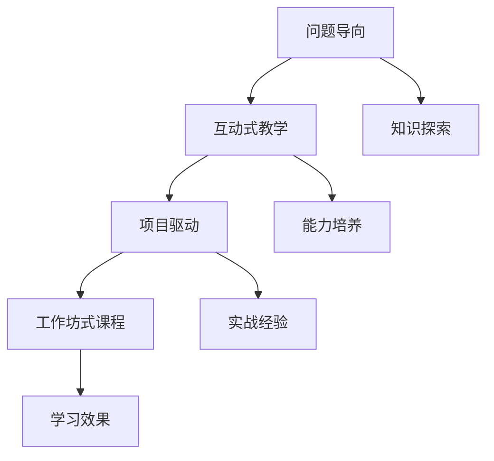

                 

## 1. 背景介绍

### 1.1 问题由来

在信息化快速发展的今天，知识付费已逐步成为人们获取优质资源、提升自我能力的重要方式。然而，传统的“讲授式”教学模式在效果和互动性上存在诸多不足。究其原因，一方面，大容量、高难度的知识传授过程，学生易出现认知负担过重、注意力难以集中的问题；另一方面，“一讲到底”的讲课方式缺乏互动，学生在学习过程中缺乏反馈与互动，难以真正掌握知识点。

基于此，提出一种以问题为导向的工作坊式课程，通过师生互动、小组讨论、项目实践等形式，引导学生积极参与、主动探索，以实现知识传授与技能培养的有机结合。

### 1.2 问题核心关键点

工作坊式课程的核心理念是：通过问题驱动、项目导向的互动式教学模式，使学生在解决问题的过程中，深入理解知识，掌握技能，培养创新思维与团队合作能力。

核心要素包括：
1. **问题导向**：以真实世界问题为切入点，引导学生探索问题，引发其自主学习动机。
2. **互动式教学**：通过讨论、互动、项目等形式，增强师生、生生之间的交流与合作，提升学习效果。
3. **项目驱动**：将学生置于实际项目环境中，通过项目实践加深对知识的理解与应用，培养实战能力。

## 2. 核心概念与联系

### 2.1 核心概念概述

为了更好地理解工作坊式课程的核心理念和设计思路，这里介绍几个密切相关的核心概念：

- **工作坊式课程（Workshop-based Course）**：以问题为导向，通过小组讨论、项目实践等互动方式进行教学的课程模式。其目的是使学生在解决实际问题的过程中，深入理解知识，培养综合能力。

- **问题导向（Problem-based Learning, PBL）**：通过提出真实世界问题，引导学生自主探索，以解决问题为中心的教学方法。其核心在于激发学生的学习兴趣和自主学习能力。

- **互动式教学（Interactive Teaching）**：强调师生、生生之间多层次、多维度的互动交流，通过讨论、案例分析等方式，提升教学效果和学生参与度。

- **项目驱动（Project-based Learning, PjBL）**：以实际项目为载体，学生在项目实践过程中，通过团队合作、项目探索等方式，掌握专业知识与技能。

这些核心概念之间通过相互作用，构成了一个灵活、互动、实践导向的教学系统。

### 2.2 核心概念原理和架构的 Mermaid 流程图



该图展示了工作坊式课程的设计流程：

1. 通过问题导向，激发学生的学习兴趣。
2. 互动式教学提升学生的参与度和互动效果。
3. 项目驱动让学生在实际项目中应用所学知识。
4. 工作坊式课程将上述要素有机结合，实现知识与技能的双重提升。

## 3. 核心算法原理 & 具体操作步骤

### 3.1 算法原理概述

工作坊式课程的核心算法原理在于通过问题导向和互动式教学，驱动学生积极参与、主动探索，从而提升学习效果和实际应用能力。主要包括以下步骤：

1. **问题发现与分析**：教师设计真实世界问题，引导学生进行问题分析和需求挖掘。
2. **知识探索与互动**：通过小组讨论、案例分析等方式，使学生深入理解问题背景和知识需求。
3. **项目实践与反馈**：学生在实际项目中应用所学知识，进行项目实践，并得到教师及同伴的反馈和指导。
4. **总结与反思**：通过项目总结、反思环节，帮助学生巩固知识，提升综合能力。

### 3.2 算法步骤详解

下面详细介绍工作坊式课程的各个操作步骤：

**Step 1：问题发现与分析**
- **设计问题**：教师需根据课程目标和学生背景，设计真实世界问题，使问题具有挑战性且与学生实际相关。
- **问题讨论**：组织学生进行小组讨论，分析问题的背景和需求，明确问题解决的方向。

**Step 2：知识探索与互动**
- **案例分析**：提供相关案例，引导学生通过分析案例，理解问题相关知识。
- **小组讨论**：将学生分组进行深入讨论，分享各自观点，探讨问题解决方法。
- **互动教学**：教师通过提问、引导等方式，提升学生的互动和参与度。

**Step 3：项目实践与反馈**
- **项目设计**：根据问题分析结果，设计项目计划，明确项目目标、任务和时间安排。
- **项目实施**：学生根据项目计划进行项目实施，利用所学知识解决实际问题。
- **反馈与指导**：教师和同伴对项目进展进行反馈，提供指导建议，帮助学生优化项目方案。

**Step 4：总结与反思**
- **项目展示**：学生展示项目成果，进行总结汇报，分享项目经验。
- **反思与总结**：学生进行自我反思，总结项目过程中遇到的问题与解决方案，巩固所学知识。

### 3.3 算法优缺点

工作坊式课程具有以下优点：
1. **增强互动性**：通过小组讨论和互动式教学，提升学生的参与度和互动效果。
2. **提升实战能力**：通过项目驱动，使学生在实际项目中应用所学知识，培养实战能力。
3. **增强问题解决能力**：通过问题导向，引导学生自主探索，培养其分析问题和解决问题的能力。
4. **灵活性高**：根据学生背景和课程目标，灵活调整问题设计和教学策略。

同时，该方法也存在一些局限性：
1. **设计难度高**：需要教师具备较高的课程设计和问题设计能力。
2. **资源需求大**：项目驱动需要较多的教学资源和设备支持。
3. **实施复杂**：涉及多个环节和互动形式，需要良好的组织和协调能力。
4. **效果依赖于教师**：教师的引导和互动效果直接影响课程效果。

### 3.4 算法应用领域

工作坊式课程在多个领域都有广泛的应用，主要包括以下几个方面：

1. **计算机科学**：通过设计编程项目、算法挑战等方式，培养学生的编程能力和问题解决能力。
2. **商科管理**：设计管理案例、模拟企业运营项目，培养学生的商业分析与决策能力。
3. **工程设计**：通过实际项目设计和实施，提升学生的工程设计与实践能力。
4. **人文学科**：通过设计历史研究、文学分析等项目，提升学生的文献阅读与批判性思维能力。

## 4. 数学模型和公式 & 详细讲解 & 举例说明

### 4.1 数学模型构建

工作坊式课程的数学模型主要体现在对问题导向、互动式教学和项目驱动等要素的设计与评估上。具体模型如下：

设课程时间为 $T$，问题数为 $N$，互动次数为 $I$，项目数为 $P$，则课程的总体效果 $E$ 可表示为：

$$
E = f(T,N,I,P)
$$

其中，$f$ 为映射函数，用于评估课程效果。

### 4.2 公式推导过程

以下详细推导 $f$ 函数的构成：

$$
f(T,N,I,P) = \sum_{i=1}^{I} \alpha_i \times \text{互动效果} + \sum_{p=1}^{P} \beta_p \times \text{项目效果}
$$

其中，$\alpha_i$ 和 $\beta_p$ 分别为互动效果和项目效果的权重系数。互动效果的评估可以通过互动深度和广度、讨论质量等指标进行量化。项目效果的评估可以通过项目完成度、创新性、应用效果等指标进行量化。

### 4.3 案例分析与讲解

以计算机科学为例，展示如何设计工作坊式课程：

1. **问题设计**：选择一个与学生实际相关的编程问题，如“设计一个天气预报应用”。
2. **互动讨论**：组织学生进行小组讨论，分析问题背景、需求和设计思路。
3. **项目实践**：指导学生进行项目设计、编码和调试，完成天气预报应用。
4. **反馈与总结**：教师对项目进行评价，学生进行反思总结。

通过此案例，我们可以看到工作坊式课程如何在问题导向和互动式教学中，培养学生的编程能力和项目实践能力。

## 5. 项目实践：代码实例和详细解释说明

### 5.1 开发环境搭建

开发工作坊式课程的第一步是搭建开发环境。以下是一个简化的Python开发环境搭建流程：

1. **安装Python**：
   - 从官网下载并安装Python。
   - 设置Python路径，确保在开发环境中可以调用Python解释器。

2. **安装开发工具**：
   - 安装Jupyter Notebook，用于编写和执行Python代码。
   - 安装Markdown编辑器，用于编写课程文档和教材。
   - 安装版本控制工具如Git，用于版本管理与协作开发。

3. **配置开发环境**：
   - 创建虚拟环境，确保不同项目间环境隔离。
   - 安装必要的第三方库，如Numpy、Pandas、Matplotlib等。
   - 配置开发工具，如代码高亮、语法检查等。

### 5.2 源代码详细实现

以下是一个基于Python和Jupyter Notebook的工作坊式课程开发示例，详细介绍了如何设计、实施和评估课程：

```python
from jupyter import Notebook
from IPython.display import HTML

# 创建课程笔记本
nb = Notebook()

# 问题发现与分析
nb.append_cell('markdown', '## 问题发现与分析')
nb.append_cell('markdown', '本节课我们将设计一个天气预报应用，并逐步分析问题需求。')
nb.append_cell('markdown', '问题需求：设计一个可以查询各地天气预报的Web应用。')

# 知识探索与互动
nb.append_cell('markdown', '## 知识探索与互动')
nb.append_cell('markdown', '通过小组讨论，分析问题的背景、需求和设计思路。')
nb.append_cell('markdown', '问题：查询当地天气预报需要哪些数据？')

# 互动式教学
nb.append_cell('markdown', '## 互动式教学')
nb.append_cell('markdown', '通过讨论和案例分析，理解问题的解决思路。')
nb.append_cell('markdown', '案例分析：现有天气预报API，如OpenWeatherMap，可以提供哪些数据？')
nb.append_cell('markdown', '小组讨论：如何设计用户界面？')

# 项目实践与反馈
nb.append_cell('markdown', '## 项目实践与反馈')
nb.append_cell('markdown', '通过实际项目，让学生应用所学知识解决实际问题。')
nb.append_cell('markdown', '项目设计：使用Flask框架搭建Web应用，使用Javascript实现交互界面。')
nb.append_cell('markdown', '项目实施：学生编写代码，实现天气查询功能。')
nb.append_cell('markdown', '反馈与指导：教师对项目进展进行反馈，提供指导建议。')

# 总结与反思
nb.append_cell('markdown', '## 总结与反思')
nb.append_cell('markdown', '通过项目展示和反思总结，巩固所学知识。')
nb.append_cell('markdown', '项目展示：学生展示项目成果，进行总结汇报。')
nb.append_cell('markdown', '反思总结：学生进行自我反思，总结项目过程中遇到的问题与解决方案。')

# 保存并运行课程笔记本
nb.write_notebook(filename='weather_forecast_course.ipynb')
```

### 5.3 代码解读与分析

以上代码实现了工作坊式课程的基本框架，通过Jupyter Notebook的形式，将问题发现、知识探索、互动式教学、项目实践、反馈与指导、总结与反思等环节有机结合。具体来说：

1. **问题发现与分析**：通过问题引导，使学生明确问题背景和需求。
2. **知识探索与互动**：通过小组讨论和案例分析，使学生理解问题相关的知识。
3. **项目实践与反馈**：通过实际项目，让学生应用所学知识，并进行项目指导和反馈。
4. **总结与反思**：通过项目展示和反思总结，巩固所学知识。

通过这种形式，学生不仅能够掌握编程知识和技能，还能培养解决问题的综合能力。

### 5.4 运行结果展示

运行上述代码后，将会生成一个包含问题发现与分析、知识探索与互动、项目实践与反馈、总结与反思等环节的Jupyter Notebook文件。通过交互式界面，学生可以逐步理解和应用所学知识。

## 6. 实际应用场景

### 6.1 智能教育

工作坊式课程在智能教育领域具有广泛的应用前景。通过设计个性化学习项目，可以更好地激发学生的学习兴趣和自主学习能力。例如，设计“智能家居控制系统”项目，学生可以通过编程实现家居设备的自动化控制，提升其实际应用能力。

### 6.2 企业培训

企业培训中，工作坊式课程可以通过设计实际项目，帮助员工掌握新技能，提升工作效能。例如，设计“数据分析报告撰写”项目，员工可以通过实际数据处理和报告撰写，提升数据解读和可视化能力。

### 6.3 公共管理

公共管理中，工作坊式课程可以通过设计公共服务项目，提升公务员的服务能力和政策理解能力。例如，设计“智慧社区建设”项目，学生可以模拟社区管理，提升其综合协调能力和政策执行力。

## 7. 工具和资源推荐

### 7.1 学习资源推荐

为了帮助开发者系统掌握工作坊式课程的设计与实施，这里推荐一些优质的学习资源：

1. **Coursera《设计思维导论》课程**：斯坦福大学开设的设计思维课程，涵盖问题导向、创新思维、设计迭代等核心内容。
2. **Khan Academy《编程导论》课程**：通过编程项目，引导学生掌握编程基础知识和问题解决能力。
3. **Google Design《设计思考工作坊》**：谷歌设计团队分享的工作坊实践经验，提供丰富的案例和工具。
4. **IDEO U《设计思维工具与方法》**：IDEO设计公司分享的案例和工具，帮助设计工作坊中的问题分析和解决方案。

通过这些资源的学习实践，相信你一定能够系统掌握工作坊式课程的设计与实施方法，并用于解决实际的课程设计问题。

### 7.2 开发工具推荐

高效的开发离不开优秀的工具支持。以下是几款用于工作坊式课程开发的常用工具：

1. **Jupyter Notebook**：Python开发环境，支持代码编写、数据分析、文档编辑等。
2. **Git**：版本控制工具，支持多人协作开发和代码管理。
3. **Slack**：即时通讯工具，支持团队沟通和协作。
4. **Trello**：项目管理工具，支持任务分配和进度跟踪。
5. **Miro**：在线白板工具，支持远程讨论和设计协同。

合理利用这些工具，可以显著提升工作坊式课程的开发效率，加快创新迭代的步伐。

### 7.3 相关论文推荐

工作坊式课程的研究方向主要集中在课程设计与教学策略上。以下是几篇奠基性的相关论文，推荐阅读：

1. **"Problem-Based Learning: What and How"**：Howard Gardner和Elliot Aronson，详细阐述了问题导向式学习的设计原则和方法。
2. **"Project-Based Learning: What, Why, and How"**：Richard Elkin，探讨了项目驱动式学习的理论基础和实践方法。
3. **"Workshops: Creating Community Through Interactive Learning"**：Franklin E. Thurman，介绍了工作坊式课程的实施方法和效果评估。

通过对这些资源的学习实践，相信你一定能够深入理解工作坊式课程的理论基础和实践方法，为实际课程设计提供有力支持。

## 8. 总结：未来发展趋势与挑战

### 8.1 总结

本文对工作坊式课程的设计与实施进行了全面系统的介绍。通过问题导向、互动式教学和项目驱动等方法，使学生在解决问题的过程中，深入理解知识，培养综合能力。结合Python开发环境和Jupyter Notebook工具，详细展示了课程设计的具体实现过程。通过对智能教育、企业培训和公共管理等多个应用场景的探讨，展示了工作坊式课程的广阔应用前景。

通过本文的系统梳理，可以看到，工作坊式课程作为未来教育的重要趋势，具有广阔的应用前景和发展潜力。未来，伴随教育技术的不断进步，工作坊式课程将逐步取代传统的“讲授式”教学模式，成为教育领域的重要范式。

### 8.2 未来发展趋势

展望未来，工作坊式课程将呈现以下几个发展趋势：

1. **个性化学习**：根据学生背景和需求，设计个性化的学习项目，提升学习效果和学生参与度。
2. **跨学科融合**：打破学科壁垒，实现跨学科知识的融合与应用，培养学生的综合素质。
3. **技术融合**：结合VR、AR等新兴技术，提升学习体验和互动效果。
4. **数据驱动**：通过数据分析和反馈，优化课程设计，提升教学效果。

### 8.3 面临的挑战

尽管工作坊式课程在教育领域具有巨大的潜力，但在实现过程中仍面临诸多挑战：

1. **课程设计难度高**：需要教师具备较高的课程设计和问题设计能力。
2. **资源需求大**：需要更多的教学资源和设备支持。
3. **实施复杂**：涉及多个环节和互动形式，需要良好的组织和协调能力。
4. **效果依赖于教师**：教师的引导和互动效果直接影响课程效果。

### 8.4 研究展望

面对工作坊式课程所面临的挑战，未来的研究需要在以下几个方面寻求新的突破：

1. **技术支持**：开发更多教学工具和平台，降低课程设计和实施的难度。
2. **教师培训**：提供系统的教师培训，提升教师的设计和实施能力。
3. **内容建设**：开发丰富的课程资源和案例库，支持多元化的课程设计。
4. **效果评估**：建立科学的评估指标和方法，量化和评价课程效果。

总之，工作坊式课程作为未来教育的重要趋势，其推广和应用需要各方面共同努力，才能真正实现其在教育领域的广泛应用和深入发展。

## 9. 附录：常见问题与解答

**Q1：工作坊式课程与传统讲授式课程有何不同？**

A: 工作坊式课程通过问题导向、互动式教学和项目驱动等方法，使学生在解决问题的过程中，深入理解知识，培养综合能力。相比传统讲授式课程，工作坊式课程更加注重学生的参与和互动，培养学生的自主学习能力和实践能力。

**Q2：工作坊式课程适用于所有学科吗？**

A: 工作坊式课程主要适用于具有较强实践性和应用性的学科，如计算机科学、商科管理、工程设计等。对于理论性强、难以直接应用到实际中的学科，如物理、化学等，则需要结合课程特点，灵活设计教学方法。

**Q3：工作坊式课程需要哪些资源支持？**

A: 工作坊式课程需要教学资源、设备、平台等多方面的支持。具体包括课程设计资源、教学工具、项目管理工具、在线协作平台等。

**Q4：工作坊式课程的效果如何评估？**

A: 工作坊式课程的效果评估可以从多个维度进行，包括学生参与度、互动效果、项目完成度、知识掌握情况等。评估方法可以采用问卷调查、作业反馈、项目展示等方式。

通过上述系统梳理，相信你已对工作坊式课程有了全面的了解，并能灵活应用到实际的教学实践中。未来，随着工作坊式课程的不断发展和优化，相信其在教育领域将发挥更大的作用，为学生的全面发展提供新的路径和机遇。

