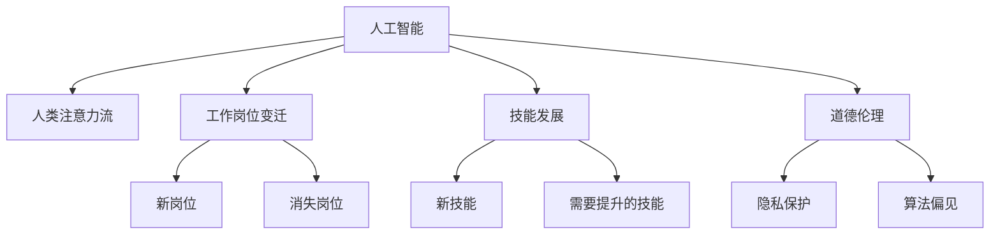

                 

# AI与人类注意力流：未来的工作、技能和道德 considerations

> 关键词：人工智能,人类注意力流,工作岗位,技能发展,道德伦理

## 1. 背景介绍

### 1.1 问题由来

随着人工智能技术的飞速发展，越来越多的AI系统开始参与到人类工作的各个环节。这不仅极大地提高了生产效率，还为人类提供了更为精准的决策支持。然而，AI与人类共同工作的场景也带来了新的挑战和机遇。本文旨在探讨AI与人类注意力流（Attention Flow）的交互，分析其对未来工作、技能和道德的影响，并提供相应的策略建议。

### 1.2 问题核心关键点

- **AI与人类注意力流**：AI系统如何通过输入输出交互，影响人类注意力流动的轨迹和效率。
- **工作岗位变迁**：AI技术将如何改变不同行业和职业的工作内容和需求。
- **技能发展**：人类需要掌握哪些新技能以适应AI时代的职场环境。
- **道德伦理**：AI技术的广泛应用可能带来的伦理问题和社会挑战。

### 1.3 问题研究意义

AI与人类注意力流的交互正在深刻改变我们的工作方式和社会结构。理解这一变化，对于指导教育、职场培训以及伦理政策制定具有重要意义。通过分析AI的影响，可以预测未来工作岗位的变化趋势，指导人类技能的提升，同时制定合理的伦理准则，确保AI技术的健康发展。

## 2. 核心概念与联系

### 2.1 核心概念概述

- **人工智能（AI）**：指通过算法和计算手段，让机器模拟人类智能过程的技术。包括机器学习、深度学习、自然语言处理、计算机视觉等领域。
- **人类注意力流（Attention Flow）**：指人类在完成任务时注意力在不同任务、信息和感官输入间流动的轨迹和模式。AI技术的引入，可能改变这一流动模式，提高效率或引入新模式。
- **工作岗位变迁**：随着AI技术的发展，某些岗位可能会消失，同时也会催生新的工作岗位和职业。
- **技能发展**：适应AI时代的职场环境，人类需要掌握的新技能，如数据处理、算法理解、跨领域合作等。
- **道德伦理**：AI技术的应用可能带来的伦理问题，如隐私保护、决策透明度、算法偏见等。

这些核心概念之间的逻辑关系可以通过以下Mermaid流程图来展示：



这个流程图展示了几组核心概念之间的联系：

1. 人工智能技术通过输入输出交互，影响人类注意力流的轨迹和效率。
2. AI技术的发展可能导致某些工作岗位的消失和新岗位的产生。
3. 适应AI时代的职场环境，人类需要掌握新的技能。
4. AI技术的应用可能带来一系列伦理问题。

## 3. 核心算法原理 & 具体操作步骤
### 3.1 算法原理概述

AI与人类注意力流的交互可以抽象为一个信息交换的过程。AI系统通过输入接收人类注意力的信息，通过计算和决策输出新的信息，进而影响人类的注意力流动。

假设AI系统为$f(x)$，其中$x$表示人类注意力的输入信息，$f(x)$的输出为$y$，表示影响人类注意力的输出信息。人类注意力流动的轨迹可以表示为$\{(x_i, y_i)\}_{i=1}^N$，其中$x_i$为第$i$个输入信息，$y_i$为对应的输出信息。

AI系统与人类注意力流的交互可以描述为：

$$
y_i = f(x_i)
$$

其中，$f(x_i)$为AI系统的计算和决策过程，$y_i$为AI系统的输出，影响人类注意力流动的轨迹。

### 3.2 算法步骤详解

基于上述原理，AI与人类注意力流的交互可以进一步细分为以下步骤：

1. **数据收集**：收集人类注意力流动的历史数据，包括输入和输出信息，用于训练AI系统。
2. **模型训练**：使用机器学习算法（如深度学习）训练AI系统，使其能够准确预测人类注意力流动的轨迹。
3. **信息交互**：将AI系统集成到实际应用中，通过输入输出交互，实时影响人类注意力流动。
4. **效果评估**：评估AI系统对人类注意力流的影响效果，根据反馈进行调整优化。

### 3.3 算法优缺点

**优点**：
- 提高效率：AI系统能够自动化处理大量信息，解放人类注意力的同时，提升工作效率。
- 精准决策：AI系统能够基于历史数据和算法，提供更为精准的决策支持。
- 增强可控性：AI系统能够按需调整信息输出，引导人类注意力流向关键任务。

**缺点**：
- 依赖数据质量：AI系统的预测效果高度依赖于输入数据的质量和多样性。
- 可能导致偏见：AI系统可能基于训练数据中的偏见，输出有偏见的信息。
- 难以解释：AI系统的决策过程复杂，难以解释其内部工作机制和推理逻辑。

### 3.4 算法应用领域

AI与人类注意力流的交互已经在多个领域得到应用：

- **医疗领域**：AI系统用于疾病诊断、医疗影像分析、个性化治疗方案推荐等，解放了医生对大量信息的处理注意力。
- **金融领域**：AI系统用于风险评估、投资建议、反欺诈检测等，提升了金融决策的准确性和效率。
- **教育领域**：AI系统用于智能辅导、学习推荐、成绩预测等，个性化支持学生的学习过程。
- **制造业**：AI系统用于智能制造、供应链优化、质量控制等，提高了生产效率和产品质量。
- **服务业**：AI系统用于客户服务、推荐系统、智能客服等，提升了用户体验和服务质量。

这些领域的应用展示了AI与人类注意力流交互的广泛性和多样性。

## 4. 数学模型和公式 & 详细讲解  
### 4.1 数学模型构建

我们可以使用向量机（Vector Machine）模型来描述AI与人类注意力流交互的过程。假设输入向量为$x \in \mathbb{R}^n$，输出向量为$y \in \mathbb{R}^m$。设$A \in \mathbb{R}^{m \times n}$为AI系统的决策矩阵，$b \in \mathbb{R}^m$为偏置向量。则AI系统的输出可以表示为：

$$
y = A \cdot x + b
$$

其中，$A \cdot x$表示矩阵乘法。

### 4.2 公式推导过程

对于单个样本$(x_i, y_i)$，其损失函数可以表示为：

$$
\ell(x_i, y_i; A, b) = ||y_i - (A \cdot x_i + b)||^2
$$

最小化损失函数的目标是找到最优的$A$和$b$，使得AI系统的预测尽可能接近真实值。

### 4.3 案例分析与讲解

假设有一个AI系统用于推荐图书，输入为用户的阅读历史$x = (b_1, b_2, \ldots, b_n)$，其中$b_i = 1$表示用户阅读过第$i$本书，$0$表示未阅读。输出$y = (r_1, r_2, \ldots, r_m)$，其中$r_i$为第$i$本书的评分。设$A$为推荐矩阵，$b$为偏置向量。则AI系统的输出为：

$$
y_i = A_{i,1}b_1 + A_{i,2}b_2 + \ldots + A_{i,n}b_n + b_i
$$

通过训练AI系统，可以使其预测用户未读图书的评分，从而为用户推荐感兴趣的书籍。

## 5. 项目实践：代码实例和详细解释说明
### 5.1 开发环境搭建

在进行项目实践前，我们需要准备好开发环境。以下是使用Python进行TensorFlow开发的环境配置流程：

1. 安装Anaconda：从官网下载并安装Anaconda，用于创建独立的Python环境。

2. 创建并激活虚拟环境：
```bash
conda create -n tf-env python=3.8 
conda activate tf-env
```

3. 安装TensorFlow：根据CUDA版本，从官网获取对应的安装命令。例如：
```bash
conda install tensorflow -c conda-forge
```

4. 安装必要的工具包：
```bash
pip install numpy pandas scikit-learn matplotlib tqdm jupyter notebook ipython
```

完成上述步骤后，即可在`tf-env`环境中开始项目实践。

### 5.2 源代码详细实现

这里我们以推荐系统为例，给出使用TensorFlow进行图书推荐模型的代码实现。

首先，定义输入数据的预处理函数：

```python
import tensorflow as tf
from sklearn.preprocessing import LabelEncoder

def process_data(data):
    # 将阅读历史转换为向量
    X = tf.one_hot(data['read_history'], depth=len(data['book_list']))
    # 将书籍评分转换为向量
    Y = tf.one_hot(data['scores'], depth=len(data['book_list']))
    # 对标签进行独热编码
    le = LabelEncoder()
    Y = le.fit_transform(Y)
    return X, Y
```

然后，定义模型的构建函数：

```python
def build_model(input_dim, output_dim):
    model = tf.keras.Sequential([
        tf.keras.layers.Dense(64, activation='relu', input_dim=input_dim),
        tf.keras.layers.Dense(64, activation='relu'),
        tf.keras.layers.Dense(output_dim, activation='softmax')
    ])
    return model
```

接着，定义模型的训练函数：

```python
def train_model(model, X, Y, epochs=10, batch_size=32):
    model.compile(optimizer='adam', loss='categorical_crossentropy', metrics=['accuracy'])
    model.fit(X, Y, epochs=epochs, batch_size=batch_size, validation_split=0.2)
    return model
```

最后，启动训练流程并在测试集上评估：

```python
import pandas as pd
from sklearn.model_selection import train_test_split

# 加载数据集
data = pd.read_csv('book_data.csv')
# 预处理数据
X, Y = process_data(data)
# 划分训练集和测试集
X_train, X_test, Y_train, Y_test = train_test_split(X, Y, test_size=0.2, random_state=42)
# 构建模型
model = build_model(X_train.shape[1], Y_train.shape[1])
# 训练模型
model = train_model(model, X_train, Y_train)
# 在测试集上评估
test_loss, test_acc = model.evaluate(X_test, Y_test)
print(f'Test loss: {test_loss:.4f}, Test accuracy: {test_acc:.4f}')
```

以上就是使用TensorFlow对图书推荐模型进行训练和评估的完整代码实现。可以看到，通过TensorFlow的封装，我们可以用相对简洁的代码完成模型的构建和训练。

### 5.3 代码解读与分析

让我们再详细解读一下关键代码的实现细节：

**process_data函数**：
- `one_hot`函数：将类别型数据转换为独热编码，方便模型处理。
- `LabelEncoder`类：用于将标签进行独热编码。

**build_model函数**：
- 使用`Sequential`模型，定义了三个全连接层，每层使用不同的激活函数。

**train_model函数**：
- `compile`函数：定义优化器、损失函数和评价指标。
- `fit`函数：使用交叉验证训练模型，并在验证集上评估模型性能。

**训练流程**：
- 加载数据集
- 预处理数据
- 划分训练集和测试集
- 构建模型
- 训练模型
- 在测试集上评估模型

可以看到，TensorFlow提供了强大的工具支持，使得模型构建和训练变得简洁高效。开发者可以将更多精力放在数据处理、模型改进等高层逻辑上，而不必过多关注底层的实现细节。

当然，工业级的系统实现还需考虑更多因素，如模型的保存和部署、超参数的自动搜索、更灵活的任务适配层等。但核心的AI与人类注意力流交互的实现逻辑基本与此类似。

## 6. 实际应用场景
### 6.1 医疗领域

AI与人类注意力流的交互在医疗领域具有重要应用。AI系统可以辅助医生处理大量影像和病例数据，解放医生注意力，提高诊疗效率。例如，AI系统可以自动标记影像中的关键区域，帮助医生快速定位病灶；还可以根据历史病例和最新研究，生成个性化治疗方案，提升治疗效果。

### 6.2 金融领域

金融领域是AI与人类注意力流交互的另一重要场景。AI系统可以通过分析海量金融数据，帮助分析师识别市场趋势和风险点，解放分析师对数据的处理注意力。例如，AI系统可以实时监测市场舆情，预警潜在风险；还可以基于用户历史交易记录，生成个性化投资建议，提升投资收益。

### 6.3 教育领域

在教育领域，AI系统可以通过分析学生的学习数据，个性化推荐学习资源，提高学习效率。例如，AI系统可以根据学生的学习进度和偏好，推荐适合的学习材料；还可以实时监测学生的学习行为，提供及时的反馈和支持，提升学习效果。

### 6.4 制造业

制造业是AI与人类注意力流交互的典型领域。AI系统可以通过分析生产数据，优化生产流程，提升生产效率和产品质量。例如，AI系统可以实时监控设备运行状态，预测设备故障，避免停机损失；还可以根据历史生产数据，生成最优的生产方案，提高生产效率。

### 6.5 服务业

在服务业，AI系统可以通过分析客户反馈和行为数据，提供个性化的服务，提升用户体验。例如，AI系统可以根据客户的历史消费记录，推荐适合的商品和服务；还可以实时监测客户满意度，提供及时的反馈和改进建议，提升服务质量。

## 7. 工具和资源推荐
### 7.1 学习资源推荐

为了帮助开发者系统掌握AI与人类注意力流交互的理论基础和实践技巧，这里推荐一些优质的学习资源：

1. 《TensorFlow从入门到精通》系列博文：由TensorFlow官方撰写，深入浅出地介绍了TensorFlow框架的基本概念和高级用法。

2. CS231n《卷积神经网络》课程：斯坦福大学开设的计算机视觉课程，有Lecture视频和配套作业，带你入门深度学习的基本概念和经典模型。

3. 《深度学习理论与实践》书籍：李航等著作，全面介绍了深度学习的理论基础和实际应用，包括自然语言处理、计算机视觉等多个领域。

4. Google AI博客：Google AI团队的官方博客，涵盖了从基础到前沿的AI技术，提供了大量的学习资源和案例分析。

5. ArXiv预印本：包含大量前沿的AI研究论文，是跟踪最新AI技术动态的绝佳资源。

通过对这些资源的学习实践，相信你一定能够快速掌握AI与人类注意力流交互的精髓，并用于解决实际的AI问题。

### 7.2 开发工具推荐

高效的开发离不开优秀的工具支持。以下是几款用于AI与人类注意力流交互开发的常用工具：

1. TensorFlow：由Google主导开发的开源深度学习框架，生产部署方便，适合大规模工程应用。

2. PyTorch：基于Python的开源深度学习框架，灵活动态的计算图，适合快速迭代研究。

3. Keras：高层次的深度学习API，简洁易用，适合快速搭建模型和进行实验。

4. Weights & Biases：模型训练的实验跟踪工具，可以记录和可视化模型训练过程中的各项指标，方便对比和调优。

5. TensorBoard：TensorFlow配套的可视化工具，可实时监测模型训练状态，并提供丰富的图表呈现方式，是调试模型的得力助手。

6. Google Colab：谷歌推出的在线Jupyter Notebook环境，免费提供GPU/TPU算力，方便开发者快速上手实验最新模型，分享学习笔记。

合理利用这些工具，可以显著提升AI与人类注意力流交互的开发效率，加快创新迭代的步伐。

### 7.3 相关论文推荐

AI与人类注意力流交互的研究源于学界的持续研究。以下是几篇奠基性的相关论文，推荐阅读：

1. Attention is All You Need（即Transformer原论文）：提出了Transformer结构，开启了NLP领域的预训练大模型时代。

2. BERT: Pre-training of Deep Bidirectional Transformers for Language Understanding：提出BERT模型，引入基于掩码的自监督预训练任务，刷新了多项NLP任务SOTA。

3. Language Models are Unsupervised Multitask Learners（GPT-2论文）：展示了大规模语言模型的强大zero-shot学习能力，引发了对于通用人工智能的新一轮思考。

4. Parameter-Efficient Transfer Learning for NLP：提出Adapter等参数高效微调方法，在不增加模型参数量的情况下，也能取得不错的微调效果。

5. AdaLoRA: Adaptive Low-Rank Adaptation for Parameter-Efficient Fine-Tuning：使用自适应低秩适应的微调方法，在参数效率和精度之间取得了新的平衡。

6. Attention Is All You Need：The Transformer Model Revisited：回顾了Transformer的结构和效果，提出了一些改进方法，如多头注意力和残差连接。

这些论文代表了大语言模型与人类注意力流交互的发展脉络。通过学习这些前沿成果，可以帮助研究者把握学科前进方向，激发更多的创新灵感。

## 8. 总结：未来发展趋势与挑战
### 8.1 总结

本文对AI与人类注意力流交互的研究进行了全面系统的介绍。首先阐述了AI与人类注意力流交互的研究背景和意义，明确了AI对未来工作、技能和道德的影响。其次，从原理到实践，详细讲解了AI与人类注意力流的交互过程，给出了AI与人类注意力流交互的完整代码实例。同时，本文还广泛探讨了AI与人类注意力流交互在医疗、金融、教育、制造业、服务业等多个行业领域的应用前景，展示了AI与人类注意力流交互的广阔前景。最后，本文精选了AI与人类注意力流交互的学习资源，力求为读者提供全方位的技术指引。

通过本文的系统梳理，可以看到，AI与人类注意力流的交互正在深刻改变我们的工作方式和社会结构。理解这一变化，对于指导教育、职场培训以及伦理政策制定具有重要意义。通过分析AI的影响，可以预测未来工作岗位的变化趋势，指导人类技能的提升，同时制定合理的伦理准则，确保AI技术的健康发展。

### 8.2 未来发展趋势

展望未来，AI与人类注意力流的交互将呈现以下几个发展趋势：

1. **智能化升级**：随着AI技术的持续发展，越来越多的AI系统将被嵌入到日常工作中，提高工作效率和质量。

2. **跨领域融合**：AI与人类注意力流的交互将突破单一领域的限制，实现跨领域的协同工作。例如，医疗领域的AI系统可以与金融领域的AI系统协作，提供更为全面和精准的服务。

3. **个性化定制**：基于AI与人类注意力流的交互，将能够实现更加个性化的工作场景，满足不同用户的需求。例如，AI系统可以根据用户的工作习惯和偏好，自动调整工作环境和任务分配。

4. **人机协同**：AI系统将与人类形成更为紧密的协作关系，共同完成任务。例如，AI系统可以作为辅助决策工具，帮助人类处理复杂任务。

5. **伦理合规**：随着AI技术的广泛应用，AI与人类注意力流的交互将面临更多的伦理和合规问题。例如，如何保护用户隐私，如何确保决策的透明性和公正性。

6. **普适化推广**：AI与人类注意力流的交互将逐渐普及到各个行业和职业，成为普遍的工作方式。例如，AI系统将在教育、医疗、金融、制造等多个领域得到广泛应用。

这些趋势凸显了AI与人类注意力流交互的广阔前景。这些方向的探索发展，必将进一步提升AI系统的性能和应用范围，为人类认知智能的进化带来深远影响。

### 8.3 面临的挑战

尽管AI与人类注意力流的交互技术已经取得了瞩目成就，但在迈向更加智能化、普适化应用的过程中，它仍面临着诸多挑战：

1. **数据隐私问题**：AI系统处理大量个人数据时，如何保护用户隐私，防止数据泄露和滥用。
2. **决策透明性**：AI系统的决策过程复杂，难以解释其内部工作机制和推理逻辑，如何增强决策透明度，提升用户信任。
3. **伦理合规性**：AI系统的广泛应用可能带来一系列伦理问题，如算法偏见、数据歧视等，如何制定合理的伦理准则，确保AI技术的健康发展。
4. **系统鲁棒性**：AI系统面对复杂多变的场景时，如何提高其鲁棒性和适应性，避免由于输入数据偏差导致模型失效。
5. **交互界面优化**：如何设计更加友好、易用的AI与人类交互界面，提升用户体验和满意度。
6. **资源消耗**：AI系统的计算和存储需求大，如何优化资源消耗，提高系统效率和可扩展性。

### 8.4 研究展望

面对AI与人类注意力流交互所面临的挑战，未来的研究需要在以下几个方面寻求新的突破：

1. **隐私保护技术**：开发更加高效的隐私保护技术，如差分隐私、联邦学习等，保护用户隐私。

2. **模型解释性**：研究如何增强AI系统的决策透明度和可解释性，使用因果分析、可解释性AI等技术，提升用户信任。

3. **伦理框架**：制定AI技术的伦理框架和标准，确保AI技术的健康发展。例如，引入伦理导向的评价指标，评估AI系统的伦理风险。

4. **鲁棒性提升**：研究如何提高AI系统的鲁棒性和适应性，增强其在复杂多变环境下的表现。

5. **交互界面设计**：设计更加友好、易用的AI与人类交互界面，提升用户体验和满意度。

6. **资源优化**：研究如何优化AI系统的资源消耗，提高系统效率和可扩展性。例如，采用分布式训练、模型压缩等技术。

这些研究方向将有助于推动AI与人类注意力流交互技术的不断进步，确保其健康、安全、可控的发展。

## 9. 附录：常见问题与解答

**Q1：AI与人类注意力流交互对未来工作的影响是什么？**

A: AI与人类注意力流交互将深刻改变未来的工作方式。AI系统可以帮助人类处理大量信息，解放人类注意力，提高工作效率。同时，AI系统可以提供精准的决策支持，提升决策质量。然而，AI系统的广泛应用也可能导致某些岗位消失，催生新的岗位和职业。

**Q2：如何提升AI系统的决策透明度和可解释性？**

A: 提升AI系统的决策透明度和可解释性需要从多个方面入手：
1. 使用可解释性AI技术，如决策树、LIME等，解释AI系统的内部推理逻辑。
2. 引入因果分析方法，识别AI系统决策的关键特征，提升决策的因果性和逻辑性。
3. 设计友好的交互界面，使用户能够理解AI系统的决策过程。

**Q3：AI与人类注意力流交互可能面临哪些伦理问题？**

A: AI与人类注意力流交互可能面临以下伦理问题：
1. 数据隐私：如何保护用户隐私，防止数据泄露和滥用。
2. 算法偏见：AI系统可能基于训练数据中的偏见，输出有偏见的信息。
3. 决策透明性：AI系统的决策过程复杂，难以解释其内部工作机制和推理逻辑，如何增强决策透明度，提升用户信任。
4. 用户权益：如何保护用户权益，防止AI系统的误导和滥用。

**Q4：如何设计高效的隐私保护技术？**

A: 设计高效的隐私保护技术需要从多个方面入手：
1. 使用差分隐私技术，保护用户隐私，防止数据泄露。
2. 引入联邦学习技术，分散数据处理，保护用户隐私。
3. 设计安全的算法和模型，防止数据滥用和攻击。

**Q5：AI与人类注意力流交互的资源优化有哪些方法？**

A: 资源优化是AI与人类注意力流交互技术发展的重要方向。以下是一些常用的优化方法：
1. 分布式训练：将训练任务分配到多个设备上，提高训练效率。
2. 模型压缩：使用知识蒸馏、剪枝等技术，减少模型参数量，提高推理效率。
3. 稀疏化存储：使用稀疏矩阵等技术，压缩模型存储空间。

---

作者：禅与计算机程序设计艺术 / Zen and the Art of Computer Programming

