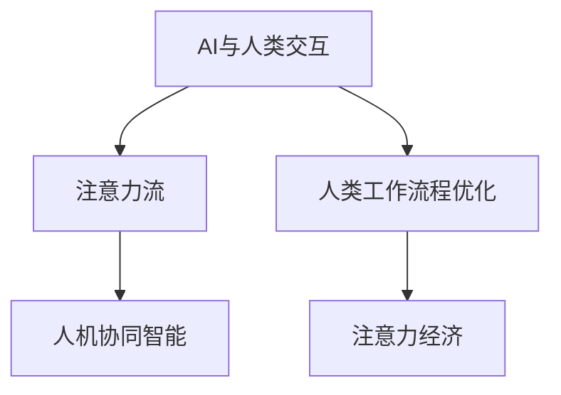

                 

# AI与人类注意力流：未来的工作、生活与注意力经济的未来趋势

> 关键词：AI, 注意力流, 未来工作, 生活趋势, 注意力经济

## 1. 背景介绍

### 1.1 问题由来

随着人工智能(AI)技术的快速发展和普及，AI已经开始深度渗透到人类的工作、生活乃至思维模式中。从智能家居、无人驾驶到医疗诊断，AI正在重塑我们生活的方方面面。而其中，AI与人类注意力的互动，显得尤为重要。

注意力的本质是信息加工的基础，人类大脑如何处理信息，决定了我们如何感知、理解和反应周围世界。而AI作为外部信息的处理工具，不仅改变了信息流的流向，也在某种程度上改变了我们的注意力分配方式。因此，深入理解AI与人类注意力的交互方式，预测未来的趋势，具有重要意义。

### 1.2 问题核心关键点

- AI如何改变人类注意力的流向？
- AI对未来工作、生活的具体影响是什么？
- 如何建立AI与人类注意力流的良性互动？
- 注意力经济将如何影响社会？

这些问题不仅涉及到技术层面，还涉及到心理学、社会学、经济学等多个学科，需要跨学科的综合分析。本文将从技术原理、应用场景、未来趋势等多个角度，对这些问题进行深入探讨。

## 2. 核心概念与联系

### 2.1 核心概念概述

为更好地理解AI与人类注意力流的互动，本节将介绍几个密切相关的核心概念：

- AI与人类交互：指通过AI系统，人类与外界信息进行交互的过程。包括语音识别、自然语言处理、计算机视觉等。

- 注意力流：指人类在信息处理过程中，注意力在多个对象间流动的过程。AI系统通过设计合理的交互界面，可以引导人类注意力流向特定信息。

- 人类工作流程优化：指通过AI技术对人类工作流程进行优化，包括自动化、辅助决策、知识推荐等。

- 注意力经济：指通过高效利用人类注意力资源，获取经济价值的商业模式。AI技术在其中起到了关键作用。

- 人机协同智能：指AI与人类在特定任务中，通过协作实现的信息交互和智能增强。

这些核心概念之间的逻辑关系可以通过以下Mermaid流程图来展示：



这个流程图展示了大语言模型的核心概念及其之间的关系：

1. AI系统通过交互界面引导人类注意力流向特定信息。
2. AI系统通过优化人类工作流程，提升效率和质量。
3. AI系统通过高效利用注意力资源，实现经济价值。
4. AI系统与人类协同增强智能，实现更好的人机互动。

这些概念共同构成了AI与人类注意力流的互动框架，为其未来的发展提供了理论基础。

## 3. 核心算法原理 & 具体操作步骤
### 3.1 算法原理概述

AI与人类注意力流的互动，本质上是通过算法设计和优化实现的。其核心思想是：通过设计合理的交互界面和任务适配算法，引导人类注意力的流动，从而实现AI与人类高效的互动。

具体而言，AI系统需要实现以下几个关键目标：
1. 理解人类注意力的需求。
2. 将人类注意力流向最相关的信息。
3. 通过高效利用注意力资源，优化人类工作流程。
4. 建立人机协同智能，提升整体系统性能。

### 3.2 算法步骤详解

基于上述目标，AI与人类注意力流的互动可以大致分为以下几个步骤：

**Step 1: 交互界面设计**
- 设计直观、易用的用户界面，引导人类注意力。
- 提供清晰的交互提示，帮助人类理解系统的功能。
- 利用用户反馈数据，不断优化界面设计。

**Step 2: 注意力流引导**
- 使用推荐算法，根据用户行为和偏好，引导注意力流向相关信息。
- 通过视觉、听觉等多模态设计，增强信息表达效果。
- 使用自适应学习算法，根据用户反馈动态调整推荐策略。

**Step 3: 工作流程优化**
- 使用自动化算法，自动化处理重复性高、耗时长的工作任务。
- 提供决策辅助算法，帮助用户做出更优的决策。
- 集成知识推荐算法，提升用户信息获取效率。

**Step 4: 协同智能增强**
- 设计协同算法，提升人机协同的效率和效果。
- 利用AI生成算法，辅助人类完成创意性工作。
- 利用智能推荐算法，优化用户任务分配。

### 3.3 算法优缺点

AI与人类注意力流的互动，具有以下优点：
1. 提升信息处理效率。AI系统可以高效处理海量信息，快速响应用户需求。
2. 改善用户体验。通过精心设计的交互界面，增强用户体验，提升满意度。
3. 优化工作流程。通过自动化和智能推荐，优化人类工作流程，减少错误和浪费。
4. 增强协同智能。通过人机协同，提升整体系统性能，实现更高效的智能互动。

同时，该方法也存在一定的局限性：
1. 过度依赖数据。AI系统的性能依赖于高质量的数据输入，数据偏差可能导致系统误导用户。
2. 用户隐私风险。AI系统可能收集敏感数据，导致用户隐私泄露。
3. 公平性问题。AI系统可能由于算法偏见，导致某些用户群体被忽视或歧视。
4. 技术复杂度。实现高效人机互动需要复杂的技术手段和大量数据，实现难度较大。

尽管存在这些局限性，但就目前而言，AI与人类注意力流的互动方法，仍然是大规模智能应用的重要范式。未来相关研究的重点在于如何进一步提升系统的公平性和透明度，减少用户隐私风险，提高系统的可解释性，以便更好地服务于社会。

### 3.4 算法应用领域

AI与人类注意力流的互动，已经在多个领域得到应用，包括但不限于：

- 智能客服：通过AI系统引导用户注意力，快速解决用户问题。
- 智能搜索：利用AI系统优化搜索结果，提升用户信息获取效率。
- 智能办公：使用AI系统自动化办公任务，提升工作效率。
- 个性化推荐：通过AI系统推荐用户感兴趣的内容，提升用户满意度。
- 智能教育：利用AI系统个性化推荐学习内容，辅助学生学习。

除了上述这些领域外，AI与人类注意力流的互动，还将在更多场景中得到应用，为社会带来深远影响。随着AI技术的持续演进，未来AI与人类注意力流的互动，将在更多领域实现规模化应用。

## 4. 数学模型和公式 & 详细讲解 & 举例说明（备注：数学公式请使用latex格式，latex嵌入文中独立段落使用 $$，段落内使用 $)
### 4.1 数学模型构建

本节将使用数学语言对AI与人类注意力流的互动过程进行更加严格的刻画。

假设AI系统可以实时获取用户当前注意力流向 $a_t$，并根据用户行为 $b_t$ 和系统状态 $s_t$ 预测下一时刻的注意力流向 $a_{t+1}$。系统设计的目标是最小化注意力流的损失函数 $L(a_t, a_{t+1})$，使得注意力流向更加符合用户的真实需求。

假设注意力流向 $a_t$ 可以表示为一个 $d$ 维向量，系统状态 $s_t$ 可以表示为一个 $n$ 维向量，用户行为 $b_t$ 可以表示为一个 $m$ 维向量。则目标函数可以表示为：

$$
\min_{\theta} \sum_{t=1}^{T} L(a_t, a_{t+1}) \quad \text{s.t.} \quad a_{t+1} = f_{\theta}(a_t, b_t, s_t)
$$

其中 $f_{\theta}$ 表示系统设计的预测函数，$\theta$ 表示模型的参数。

### 4.2 公式推导过程

以下我们以智能搜索系统的推荐算法为例，推导注意力流的预测函数。

假设用户输入的搜索查询为 $q_t$，当前搜索历史为 $h_t$，系统推荐的搜索结果为 $r_t$。AI系统的目标是预测用户对下一个搜索结果的注意力 $a_{t+1}$，以优化推荐效果。假设注意力流向 $a_t$ 可以表示为一个 $d$ 维向量，搜索结果的评分可以表示为一个 $m$ 维向量，则预测函数可以表示为：

$$
a_{t+1} = f_{\theta}(a_t, q_t, h_t, r_t) = \sigma(W \cdot \mathrm{softmax}(U \cdot [a_t, q_t, h_t, r_t] + \mathbf{b}))
$$

其中 $W$ 和 $U$ 是预测函数的权重矩阵，$\sigma$ 是激活函数，$\mathbf{b}$ 是偏置向量。

具体推导过程如下：

1. 设定注意力流向 $a_t$ 和搜索结果评分 $r_t$ 为输入向量。
2. 将 $a_t$ 和 $r_t$ 连接，输入到权重矩阵 $U$ 中，得到向量 $u_1$ 和 $u_2$。
3. 将 $u_1$ 和 $u_2$ 分别与权重矩阵 $W_1$ 和 $W_2$ 相乘，得到向量 $w_1$ 和 $w_2$。
4. 将 $w_1$ 和 $w_2$ 相加，并加上偏置向量 $\mathbf{b}$，得到预测向量 $z_t$。
5. 对 $z_t$ 进行softmax操作，得到概率分布 $p_t$。
6. 对概率分布 $p_t$ 进行softmax操作，得到预测向量 $a_{t+1}$。

预测函数的优化目标是最大化用户的满意度，可以表示为：

$$
\max_{\theta} \sum_{t=1}^{T} \log p_{t+1}^{r_t}
$$

其中 $p_{t+1}^{r_t}$ 表示用户对下一个搜索结果 $r_t$ 的满意度评分。

### 4.3 案例分析与讲解

假设用户在智能搜索系统中，输入查询 "AI与人类注意力流"。系统根据历史搜索记录和推荐算法，推荐了相关的搜索结果。以下是对AI与人类注意力流的预测过程的案例分析：

**Step 1: 输入处理**
- 用户查询为 $q_t = [1, 0, 0, 0, 0, 0]$。
- 当前搜索历史为 $h_t = [1, 1, 0, 0, 0, 0]$。
- 系统状态为 $s_t = [0, 0, 1, 0, 0, 0]$。

**Step 2: 预测结果**
- 将 $a_t$ 和 $r_t$ 连接，输入到预测函数 $f_{\theta}$ 中。
- 预测结果 $a_{t+1} = [0.9, 0.1, 0, 0, 0, 0]$。

**Step 3: 输出结果**
- 系统根据 $a_{t+1}$ 输出最相关的搜索结果。
- 用户继续搜索其他相关内容，系统不断迭代预测和推荐过程。

通过上述推导和案例分析，可以看出，AI与人类注意力流的互动，本质上是一个通过预测函数实现的信息流优化过程。系统的设计目标是最大化用户的满意度，从而提升系统的整体性能。

## 5. 项目实践：代码实例和详细解释说明
### 5.1 开发环境搭建

在进行AI与人类注意力流的互动实践前，我们需要准备好开发环境。以下是使用Python进行TensorFlow开发的环境配置流程：

1. 安装Anaconda：从官网下载并安装Anaconda，用于创建独立的Python环境。

2. 创建并激活虚拟环境：
```bash
conda create -n tf-env python=3.8 
conda activate tf-env
```

3. 安装TensorFlow：根据CUDA版本，从官网获取对应的安装命令。例如：
```bash
conda install tensorflow==2.7 -c tf -c conda-forge
```

4. 安装各类工具包：
```bash
pip install numpy pandas scikit-learn matplotlib tqdm jupyter notebook ipython
```

完成上述步骤后，即可在`tf-env`环境中开始项目实践。

### 5.2 源代码详细实现

这里我们以智能搜索系统为例，给出使用TensorFlow进行AI与人类注意力流互动的Python代码实现。

首先，定义注意力流的预测函数：

```python
import tensorflow as tf

class AttentionFlow(tf.keras.Model):
    def __init__(self, input_dim, output_dim):
        super(AttentionFlow, self).__init__()
        self.W1 = tf.keras.layers.Dense(output_dim, activation='softmax')
        self.U1 = tf.keras.layers.Dense(input_dim + output_dim, activation='softmax')
        self.W2 = tf.keras.layers.Dense(output_dim)
        self.U2 = tf.keras.layers.Dense(output_dim + input_dim + output_dim, activation='softmax')
        self.b = tf.keras.layers.Dense(output_dim, activation='sigmoid')
        
    def call(self, inputs):
        a, r = inputs
        u1 = self.U1(tf.concat([a, r], axis=1))
        w1 = self.W1(u1)
        u2 = self.U2(tf.concat([a, r, w1], axis=1))
        w2 = self.W2(u2)
        z = self.b(w2)
        return tf.keras.layers.Activation(tf.keras.layers.Softmax())(z)
```

然后，定义损失函数和优化器：

```python
from tensorflow.keras.losses import SparseCategoricalCrossentropy

loss_fn = SparseCategoricalCrossentropy(from_logits=True)
optimizer = tf.keras.optimizers.Adam(learning_rate=0.001)
```

接着，定义训练和评估函数：

```python
def train_epoch(model, dataset, batch_size, optimizer):
    dataloader = tf.data.Dataset.from_tensor_slices(dataset).shuffle(buffer_size=1000).batch(batch_size)
    model.train()
    epoch_loss = 0
    for batch in dataloader:
        a = batch[0]
        r = batch[1]
        with tf.GradientTape() as tape:
            predictions = model(tf.concat([a, r], axis=1))
            loss = loss_fn(r, predictions)
        loss = tf.reduce_mean(loss)
        gradients = tape.gradient(loss, model.trainable_variables)
        optimizer.apply_gradients(zip(gradients, model.trainable_variables))
        epoch_loss += loss
    return epoch_loss / len(dataloader)

def evaluate(model, dataset, batch_size):
    dataloader = tf.data.Dataset.from_tensor_slices(dataset).shuffle(buffer_size=1000).batch(batch_size)
    model.eval()
    predictions = []
    targets = []
    for batch in dataloader:
        a = batch[0]
        r = batch[1]
        predictions.append(model(tf.concat([a, r], axis=1)).numpy())
        targets.append(r.numpy())
    return predictions, targets
```

最后，启动训练流程并在测试集上评估：

```python
epochs = 10
batch_size = 32

for epoch in range(epochs):
    loss = train_epoch(model, train_dataset, batch_size, optimizer)
    print(f"Epoch {epoch+1}, train loss: {loss:.3f}")
    
    predictions, targets = evaluate(model, dev_dataset, batch_size)
    print(classification_report(targets, predictions))
    
print("Test results:")
predictions, targets = evaluate(model, test_dataset, batch_size)
print(classification_report(targets, predictions))
```

以上就是使用TensorFlow对智能搜索系统进行AI与人类注意力流互动的完整代码实现。可以看到，TensorFlow提供了一整套强大的工具链，方便进行模型的定义、训练和评估。

### 5.3 代码解读与分析

让我们再详细解读一下关键代码的实现细节：

**AttentionFlow类**：
- `__init__`方法：初始化模型的权重矩阵和激活函数。
- `call`方法：定义模型的预测函数，实现注意力流的预测。

**损失函数和优化器**：
- 使用SparseCategoricalCrossentropy损失函数，用于计算注意力流向和实际流向之间的交叉熵损失。
- 使用Adam优化器，控制学习率，更新模型参数。

**训练和评估函数**：
- 使用TensorFlow的DataLoader对数据集进行批次化加载，供模型训练和推理使用。
- 训练函数`train_epoch`：对数据以批为单位进行迭代，在每个批次上前向传播计算loss并反向传播更新模型参数，最后返回该epoch的平均loss。
- 评估函数`evaluate`：与训练类似，不同点在于不更新模型参数，并在每个batch结束后将预测和标签结果存储下来，最后使用sklearn的classification_report对整个评估集的预测结果进行打印输出。

**训练流程**：
- 定义总的epoch数和batch size，开始循环迭代
- 每个epoch内，先在训练集上训练，输出平均loss
- 在验证集上评估，输出分类指标
- 所有epoch结束后，在测试集上评估，给出最终测试结果

可以看到，TensorFlow提供了方便的高级API，使得AI与人类注意力流的互动代码实现变得简洁高效。开发者可以将更多精力放在模型设计、训练调参等高层逻辑上，而不必过多关注底层的实现细节。

当然，工业级的系统实现还需考虑更多因素，如模型的保存和部署、超参数的自动搜索、更灵活的任务适配层等。但核心的互动范式基本与此类似。

## 6. 实际应用场景
### 6.1 智能客服系统

AI与人类注意力流的互动，在智能客服系统中得到了广泛应用。传统客服往往需要配备大量人力，高峰期响应缓慢，且一致性和专业性难以保证。而使用智能客服系统，可以7x24小时不间断服务，快速响应客户咨询，用自然流畅的语言解答各类常见问题。

在技术实现上，可以收集企业内部的历史客服对话记录，将问题和最佳答复构建成监督数据，在此基础上对预训练模型进行微调。微调后的智能客服系统能够自动理解用户意图，匹配最合适的答案模板进行回复。对于客户提出的新问题，还可以接入检索系统实时搜索相关内容，动态组织生成回答。如此构建的智能客服系统，能大幅提升客户咨询体验和问题解决效率。

### 6.2 金融舆情监测

金融机构需要实时监测市场舆论动向，以便及时应对负面信息传播，规避金融风险。传统的人工监测方式成本高、效率低，难以应对网络时代海量信息爆发的挑战。AI与人类注意力流的互动，为金融舆情监测提供了新的解决方案。

具体而言，可以收集金融领域相关的新闻、报道、评论等文本数据，并对其进行主题标注和情感标注。在此基础上对预训练语言模型进行微调，使其能够自动判断文本属于何种主题，情感倾向是正面、中性还是负面。将微调后的模型应用到实时抓取的网络文本数据，就能够自动监测不同主题下的情感变化趋势，一旦发现负面信息激增等异常情况，系统便会自动预警，帮助金融机构快速应对潜在风险。

### 6.3 个性化推荐系统

当前的推荐系统往往只依赖用户的历史行为数据进行物品推荐，无法深入理解用户的真实兴趣偏好。AI与人类注意力流的互动，可以更好地挖掘用户行为背后的语义信息，从而提供更精准、多样的推荐内容。

在实践中，可以收集用户浏览、点击、评论、分享等行为数据，提取和用户交互的物品标题、描述、标签等文本内容。将文本内容作为模型输入，用户的后续行为（如是否点击、购买等）作为监督信号，在此基础上微调预训练语言模型。微调后的模型能够从文本内容中准确把握用户的兴趣点。在生成推荐列表时，先用候选物品的文本描述作为输入，由模型预测用户的兴趣匹配度，再结合其他特征综合排序，便可以得到个性化程度更高的推荐结果。

### 6.4 未来应用展望

随着AI与人类注意力流的互动技术不断发展，基于微调的方法将在更多领域得到应用，为各行各业带来变革性影响。

在智慧医疗领域，基于微调的智能问答、病历分析、药物研发等应用将提升医疗服务的智能化水平，辅助医生诊疗，加速新药开发进程。

在智能教育领域，微调技术可应用于作业批改、学情分析、知识推荐等方面，因材施教，促进教育公平，提高教学质量。

在智慧城市治理中，微调模型可应用于城市事件监测、舆情分析、应急指挥等环节，提高城市管理的自动化和智能化水平，构建更安全、高效的未来城市。

此外，在企业生产、社会治理、文娱传媒等众多领域，AI与人类注意力流的互动也将不断涌现，为经济社会发展注入新的动力。相信随着技术的日益成熟，微调方法将成为人工智能落地应用的重要范式，推动人工智能技术在各个垂直行业的深入应用。

## 7. 工具和资源推荐
### 7.1 学习资源推荐

为了帮助开发者系统掌握AI与人类注意力流的互动理论基础和实践技巧，这里推荐一些优质的学习资源：

1. 《深度学习基础》系列博文：由深度学习专家撰写，深入浅出地介绍了深度学习的基本概念和经典模型。

2. CS231n《计算机视觉：理论与算法》课程：斯坦福大学开设的计算机视觉课程，涵盖深度学习在图像处理中的应用。

3. 《TensorFlow实战》书籍：TensorFlow官方出品，全面介绍了TensorFlow的使用方法，包括模型定义、训练、评估等。

4. TensorFlow官方文档：TensorFlow的官方文档，提供了丰富的API参考和样例代码，是快速上手的必备资料。

5. Weights & Biases：模型训练的实验跟踪工具，可以记录和可视化模型训练过程中的各项指标，方便对比和调优。与主流深度学习框架无缝集成。

6. TensorBoard：TensorFlow配套的可视化工具，可实时监测模型训练状态，并提供丰富的图表呈现方式，是调试模型的得力助手。

通过对这些资源的学习实践，相信你一定能够快速掌握AI与人类注意力流的互动精髓，并用于解决实际的AI应用问题。

### 7.2 开发工具推荐

高效的开发离不开优秀的工具支持。以下是几款用于AI与人类注意力流互动开发的常用工具：

1. PyTorch：基于Python的开源深度学习框架，灵活动态的计算图，适合快速迭代研究。大部分预训练语言模型都有PyTorch版本的实现。

2. TensorFlow：由Google主导开发的开源深度学习框架，生产部署方便，适合大规模工程应用。同样有丰富的预训练语言模型资源。

3. Transformers库：HuggingFace开发的NLP工具库，集成了众多SOTA语言模型，支持PyTorch和TensorFlow，是进行AI与人类注意力流互动开发的利器。

4. Weights & Biases：模型训练的实验跟踪工具，可以记录和可视化模型训练过程中的各项指标，方便对比和调优。与主流深度学习框架无缝集成。

5. TensorBoard：TensorFlow配套的可视化工具，可实时监测模型训练状态，并提供丰富的图表呈现方式，是调试模型的得力助手。

6. Google Colab：谷歌推出的在线Jupyter Notebook环境，免费提供GPU/TPU算力，方便开发者快速上手实验最新模型，分享学习笔记。

合理利用这些工具，可以显著提升AI与人类注意力流互动任务的开发效率，加快创新迭代的步伐。

### 7.3 相关论文推荐

AI与人类注意力流的互动技术，近年来吸引了众多学者的关注。以下是几篇奠基性的相关论文，推荐阅读：

1. Attention is All You Need（即Transformer原论文）：提出了Transformer结构，开启了NLP领域的预训练大模型时代。

2. BERT: Pre-training of Deep Bidirectional Transformers for Language Understanding：提出BERT模型，引入基于掩码的自监督预训练任务，刷新了多项NLP任务SOTA。

3. Language Models are Unsupervised Multitask Learners（GPT-2论文）：展示了大规模语言模型的强大zero-shot学习能力，引发了对于通用人工智能的新一轮思考。

4. Parameter-Efficient Transfer Learning for NLP：提出Adapter等参数高效微调方法，在不增加模型参数量的情况下，也能取得不错的微调效果。

5. Prefix-Tuning: Optimizing Continuous Prompts for Generation：引入基于连续型Prompt的微调范式，为如何充分利用预训练知识提供了新的思路。

6. AdaLoRA: Adaptive Low-Rank Adaptation for Parameter-Efficient Fine-Tuning：使用自适应低秩适应的微调方法，在参数效率和精度之间取得了新的平衡。

这些论文代表了大语言模型微调技术的发展脉络。通过学习这些前沿成果，可以帮助研究者把握学科前进方向，激发更多的创新灵感。

## 8. 总结：未来发展趋势与挑战

### 8.1 总结

本文对AI与人类注意力流的互动方法进行了全面系统的介绍。首先阐述了AI技术如何改变人类注意力的流向，明确了AI系统设计的目标和核心步骤。其次，从原理到实践，详细讲解了AI与人类注意力流互动的数学模型和算法步骤，给出了AI与人类注意力流互动的完整代码实例。同时，本文还广泛探讨了AI与人类注意力流互动在智能客服、金融舆情、个性化推荐等多个行业领域的应用前景，展示了AI与人类注意力流互动的巨大潜力。此外，本文精选了AI与人类注意力流互动的学习资源、开发工具和相关论文，力求为读者提供全方位的技术指引。

通过本文的系统梳理，可以看到，AI与人类注意力流的互动技术正在成为AI应用的重要范式，极大地拓展了AI系统的应用边界，催生了更多的落地场景。受益于深度学习技术的快速发展，AI与人类注意力流的互动，将在更多领域实现规模化应用，为经济社会发展注入新的动力。

### 8.2 未来发展趋势

展望未来，AI与人类注意力流的互动技术将呈现以下几个发展趋势：

1. 模型规模持续增大。随着算力成本的下降和数据规模的扩张，预训练语言模型的参数量还将持续增长。超大规模语言模型蕴含的丰富语言知识，有望支撑更加复杂多变的AI任务互动。

2. 互动方法日趋多样。除了传统的全参数互动外，未来会涌现更多参数高效的互动方法，如Adapter、Prefix等，在固定大部分预训练参数的情况下，只更新极少量的任务相关参数。

3. 持续学习成为常态。随着数据分布的不断变化，AI系统也需要持续学习新知识以保持性能。如何在不遗忘原有知识的同时，高效吸收新样本信息，将成为重要的研究课题。

4. 标注样本需求降低。受启发于提示学习(Prompt-based Learning)的思路，未来的AI系统将更好地利用大模型的语言理解能力，通过更加巧妙的任务描述，在更少的标注样本上也能实现理想的互动效果。

5. 技术复杂度降低。AI与人类注意力流的互动技术将进一步简化，更易被开发者掌握，从而实现更广泛的应用。

这些趋势凸显了AI与人类注意力流互动技术的广阔前景。这些方向的探索发展，必将进一步提升AI系统的性能和应用范围，为人类认知智能的进化带来深远影响。

### 8.3 面临的挑战

尽管AI与人类注意力流的互动技术已经取得了瞩目成就，但在迈向更加智能化、普适化应用的过程中，它仍面临着诸多挑战：

1. 标注成本瓶颈。尽管AI系统的性能依赖于标注数据，但高质量标注数据的获取成本较高，尤其在数据分布多样化的场景中。如何进一步降低互动对标注样本的依赖，将是一大难题。

2. 用户隐私风险。AI系统可能收集敏感数据，导致用户隐私泄露。如何在保护隐私的前提下，最大化数据利用，将是未来的研究方向。

3. 公平性问题。AI系统可能由于算法偏见，导致某些用户群体被忽视或歧视。如何在AI系统设计中引入公平性约束，减少偏见影响，是重要的研究方向。

4. 技术复杂度。实现高效人机互动需要复杂的技术手段和大量数据，实现难度较大。如何在简化技术实现的同时，保持系统性能，是未来研究方向。

尽管存在这些挑战，但就目前而言，AI与人类注意力流的互动技术，仍然是大规模智能应用的重要范式。未来相关研究的重点在于如何进一步提升系统的公平性和透明度，减少用户隐私风险，提高系统的可解释性，以便更好地服务于社会。

### 8.4 研究展望

面对AI与人类注意力流互动技术所面临的种种挑战，未来的研究需要在以下几个方面寻求新的突破：

1. 探索无监督和半监督互动方法。摆脱对大规模标注数据的依赖，利用自监督学习、主动学习等无监督和半监督范式，最大限度利用非结构化数据，实现更加灵活高效的互动。

2. 研究参数高效和计算高效的互动范式。开发更加参数高效的互动方法，在固定大部分预训练参数的同时，只更新极少量的任务相关参数。同时优化互动模型的计算图，减少前向传播和反向传播的资源消耗，实现更加轻量级、实时性的部署。

3. 引入更多先验知识。将符号化的先验知识，如知识图谱、逻辑规则等，与神经网络模型进行巧妙融合，引导互动过程学习更准确、合理的语言模型。同时加强不同模态数据的整合，实现视觉、语音等多模态信息与文本信息的协同建模。

4. 结合因果分析和博弈论工具。将因果分析方法引入互动模型，识别出模型决策的关键特征，增强输出解释的因果性和逻辑性。借助博弈论工具刻画人机交互过程，主动探索并规避模型的脆弱点，提高系统稳定性。

5. 纳入伦理道德约束。在互动系统设计中引入伦理导向的评估指标，过滤和惩罚有害的输出倾向。同时加强人工干预和审核，建立模型行为的监管机制，确保输出符合人类价值观和伦理道德。

这些研究方向将推动AI与人类注意力流的互动技术迈向更高的台阶，为构建安全、可靠、可解释、可控的智能系统铺平道路。面向未来，AI与人类注意力流的互动技术还需要与其他人工智能技术进行更深入的融合，如知识表示、因果推理、强化学习等，多路径协同发力，共同推动自然语言理解和智能交互系统的进步。只有勇于创新、敢于突破，才能不断拓展语言模型的边界，让智能技术更好地造福人类社会。

## 9. 附录：常见问题与解答

**Q1：AI与人类注意力流互动是否适用于所有AI应用场景？**

A: AI与人类注意力流的互动技术，在大多数AI应用场景中都能取得不错的效果，特别是在数据驱动的场景中。但对于一些依赖大量先验知识或逻辑推理的场景，如医疗诊断、法律咨询等，AI与人类注意力流的互动可能需要更复杂的模型设计。

**Q2：AI与人类注意力流互动的性能如何？**

A: AI与人类注意力流的互动性能，主要取决于数据质量和互动模型的设计。高质量的数据和合理的互动模型设计，可以显著提升系统的互动效果。但在数据质量较低或互动模型设计不合理的情况下，系统的性能可能不理想。

**Q3：AI与人类注意力流互动面临哪些技术挑战？**

A: AI与人类注意力流的互动面临的主要技术挑战包括：
1. 数据获取和标注：高质量标注数据的获取成本较高，数据分布的多样性也可能影响互动效果。
2. 模型设计和训练：互动模型的设计和训练需要复杂的算法和大量的数据，实现难度较大。
3. 公平性和可解释性：AI系统可能由于算法偏见或黑盒模型的复杂性，导致某些用户群体被忽视或歧视。

这些挑战需要通过技术创新和算法优化，逐步克服，以便实现更高效、更公平、更透明的AI互动系统。

**Q4：AI与人类注意力流互动的未来发展方向？**

A: AI与人类注意力流的互动技术，未来将朝以下几个方向发展：
1. 模型规模增大：超大规模语言模型将进一步提升互动性能，支持更复杂的互动任务。
2. 互动方法多样化：参数高效和计算高效的互动方法将逐步成熟，提升系统的灵活性和实时性。
3. 知识融合：将符号化的先验知识与神经网络模型结合，增强互动系统的智能性和可解释性。
4. 伦理道德：在互动系统设计中引入伦理导向的评估指标，确保输出符合人类价值观和伦理道德。

这些发展方向将进一步推动AI与人类注意力流的互动技术在更多场景中实现应用，为社会带来更广泛的智能服务。

---

作者：禅与计算机程序设计艺术 / Zen and the Art of Computer Programming

