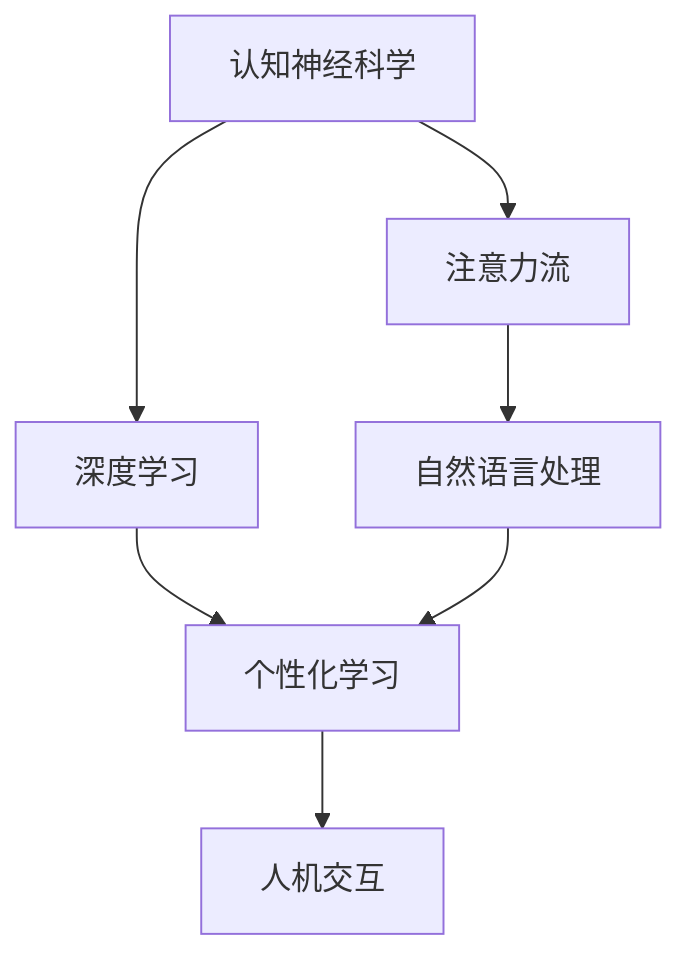

                 

# AI与人类注意力流：未来的教育与注意力管理

> 关键词：人工智能(AI)、注意力流、教育、认知神经科学、人机交互、个性化学习

## 1. 背景介绍

### 1.1 问题由来
在信息爆炸的时代，人类面临前所未有的知识海洋。我们如何才能更好地掌握这些知识？传统的教育方法已经面临诸多挑战：

1. **信息过载**：互联网的快速发展使得知识获取的门槛大大降低，但这也导致信息过载，让人难以抉择。
2. **个性化不足**：传统的“一刀切”教育模式难以适应每个学生的独特需求和特点。
3. **互动性不足**：传统的教学方法往往以教师为主导，学生的参与度和互动性较低。

人工智能(AI)的出现，尤其是深度学习和自然语言处理技术的快速发展，为我们提供了一种全新的教育解决方案。通过AI技术，可以更好地理解学生的认知和注意力流，实现个性化的教学，提高学习的效率和效果。

### 1.2 问题核心关键点
未来教育的核心关键点在于如何利用AI技术，更深入地理解人类的注意力流，实现个性化、互动性和高效的学习体验。以下是核心关键点：

- **认知神经科学**：了解人类大脑如何处理信息，注意力如何分配。
- **人机交互**：设计能够有效促进学生和AI系统互动的交互界面。
- **个性化学习**：根据学生的认知和学习特点，提供定制化的学习内容和路径。
- **数据驱动决策**：通过学习数据分析，动态调整教学策略和内容。
- **AI辅助教学**：利用AI技术辅助教师教学，提升教学效率和效果。

本文将围绕这些核心关键点，探讨AI与人类注意力流的互动方式，以及如何利用AI技术改进未来的教育方式。

## 2. 核心概念与联系

### 2.1 核心概念概述

为了更好地理解AI与人类注意力流的互动方式，我们需要了解以下几个核心概念：

- **认知神经科学**：研究人类大脑如何处理信息、存储记忆、产生思维等。
- **注意力流**：人类在学习过程中，注意力是如何分配和流动的。
- **深度学习**：一种模拟人脑神经网络结构的学习方法，能够从数据中学习出高效的特征表示。
- **自然语言处理(NLP)**：使计算机能够理解、处理和生成自然语言的技术。
- **个性化学习**：根据学生的特点和需求，提供定制化的学习内容和路径。
- **人机交互**：设计能够有效促进人机互动的交互界面。

这些概念之间的联系可以通过以下Mermaid流程图来展示：



这个流程图展示了这些核心概念之间的逻辑关系：

1. 认知神经科学帮助我们理解人类大脑的运作机制，从而更好地设计出能够促进注意力流的技术。
2. 注意力流是深度学习算法设计的基础，通过理解注意力流的动态变化，可以更高效地提取特征。
3. 自然语言处理技术使得计算机能够理解和生成自然语言，与人类进行互动。
4. 个性化学习利用深度学习的特征提取能力，提供定制化的学习路径。
5. 人机交互技术使得个性化学习得以实现，通过有效的界面设计，提升学习体验。

## 3. 核心算法原理 & 具体操作步骤
### 3.1 算法原理概述

AI与人类注意力流的互动方式，本质上是一种基于深度学习和人机交互的个性化学习范式。其核心思想是：

1. **数据驱动学习**：通过收集学生的学习数据，如注意力流轨迹、学习行为、测试成绩等，构建学生的认知模型。
2. **动态调整学习路径**：根据学生的认知模型，动态调整学习内容和难度，实现个性化的学习路径。
3. **交互式学习**：设计能够有效促进学生和AI系统互动的交互界面，提升学习的积极性和效果。
4. **持续反馈与优化**：通过持续的反馈和学习，不断优化学习策略和内容，提升学习效果。

### 3.2 算法步骤详解

基于深度学习的个性化学习算法主要包括以下几个关键步骤：

**Step 1: 数据收集与预处理**

- 收集学生的学习数据，如注意力流轨迹、学习行为、测试成绩等。
- 对数据进行预处理，去除噪声和异常值，归一化处理，使其适合模型训练。

**Step 2: 认知模型构建**

- 使用深度学习模型，如循环神经网络(RNN)、卷积神经网络(CNN)等，构建学生的认知模型。
- 通过训练数据，学习学生的认知模式和注意力流特征。

**Step 3: 学习路径设计**

- 根据学生的认知模型，设计个性化的学习路径。
- 动态调整学习内容的难度和顺序，以适应学生的认知水平和学习进度。

**Step 4: 交互式学习**

- 设计能够有效促进人机互动的交互界面，如语音助手、智能答疑系统等。
- 通过交互界面，实时获取学生的反馈，调整学习内容和策略。

**Step 5: 持续反馈与优化**

- 通过持续的反馈和学习，不断优化学习策略和内容，提升学习效果。
- 定期评估学习效果，根据评估结果调整学习路径和内容。

### 3.3 算法优缺点

基于深度学习的个性化学习算法具有以下优点：

1. **高效性**：通过数据驱动学习，能够快速适应学生的学习需求，提高学习效率。
2. **个性化**：根据学生的认知模型，提供定制化的学习路径，满足每个学生的独特需求。
3. **互动性强**：通过交互式学习界面，提升学生的积极性和参与度。
4. **持续优化**：通过持续的反馈和学习，不断优化学习策略和内容。

同时，该算法也存在一些局限性：

1. **数据隐私**：学生的学习数据需要被收集和处理，存在数据隐私和安全问题。
2. **模型复杂性**：构建认知模型和个性化学习路径需要复杂的深度学习模型，对计算资源要求较高。
3. **依赖标注数据**：深度学习模型需要大量的标注数据进行训练，数据获取成本较高。
4. **用户适应性**：不同的学生对学习内容和策略的适应性不同，模型需要不断调整和优化。

尽管存在这些局限性，但就目前而言，基于深度学习的个性化学习算法仍是大数据时代的最佳选择。未来相关研究的重点在于如何进一步降低数据需求，提高模型效率，并提升用户适应性。

### 3.4 算法应用领域

基于深度学习的个性化学习算法在教育领域具有广泛的应用前景，覆盖了几乎所有常见的教育场景，例如：

- **在线教育**：通过收集学生的学习数据，构建个性化学习路径，提供个性化的在线课程。
- **智能答疑系统**：根据学生的提问，实时生成解答，提供个性化的学习支持。
- **虚拟课堂**：通过虚拟现实(VR)技术，创建沉浸式的学习环境，提升学生的学习体验。
- **自适应学习系统**：根据学生的学习情况，动态调整学习内容和难度，实现高效的学习。
- **个性化作业系统**：根据学生的学习进度和能力，生成个性化的作业，提升学习效果。
- **心理辅导系统**：通过分析学生的学习行为和数据，提供心理辅导和情感支持。

此外，基于深度学习的个性化学习算法也被创新性地应用到更多场景中，如智慧医疗、企业培训、金融教育等，为这些领域的教育技术发展提供了新的思路和方法。

## 4. 数学模型和公式 & 详细讲解 & 举例说明

### 4.1 数学模型构建

本节将使用数学语言对基于深度学习的个性化学习算法进行更加严格的刻画。

设学生的注意力流轨迹为 $\{x_t\}_{t=1}^T$，其中 $x_t \in \mathbb{R}^n$ 表示学生在第 $t$ 个时间点的认知状态。设 $y_t$ 为学生的学习行为，如点击、阅读、回答等，$y_t \in \{0,1\}$。

定义学生认知模型为 $f: \mathbb{R}^n \rightarrow \mathbb{R}^k$，其中 $k$ 为认知特征的维度。认知模型的训练目标为最小化预测误差：

$$
\min_{f} \sum_{t=1}^T \ell(f(x_t),y_t)
$$

其中 $\ell$ 为损失函数，常用的有均方误差损失、交叉熵损失等。

### 4.2 公式推导过程

以下我们以二分类任务为例，推导均方误差损失函数及其梯度的计算公式。

假设认知模型 $f(x_t)$ 的输出为 $p_t$，表示学生在第 $t$ 个时间点的学习行为发生概率。真实标签 $y_t \in \{0,1\}$。则均方误差损失函数定义为：

$$
\ell(p_t,y_t) = (p_t - y_t)^2
$$

将其代入总损失函数，得：

$$
\mathcal{L}(f) = \frac{1}{T} \sum_{t=1}^T \ell(f(x_t),y_t)
$$

根据链式法则，认知模型 $f$ 的梯度为：

$$
\frac{\partial \mathcal{L}(f)}{\partial f(x_t)} = \frac{1}{T} \sum_{t=1}^T 2(p_t - y_t) \frac{\partial p_t}{\partial f(x_t)}
$$

其中 $\frac{\partial p_t}{\partial f(x_t)}$ 可以通过反向传播算法高效计算。

### 4.3 案例分析与讲解

假设我们有一个学生 $S$，其注意力流轨迹和对应的学习行为如下：

| 时间点 $t$ | 注意力流 $x_t$ | 学习行为 $y_t$ |
|----------|--------------|--------------|
| 1        | [0.2, 0.3, 0.5]  | 0            |
| 2        | [0.5, 0.5, 0.1]  | 1            |
| 3        | [0.1, 0.4, 0.7]  | 1            |
| 4        | [0.4, 0.4, 0.3]  | 1            |
| 5        | [0.2, 0.4, 0.5]  | 0            |

我们使用一个简单的逻辑回归模型，其中 $f(x_t) = \sigma(W^T x_t + b)$，$W \in \mathbb{R}^{k \times n}$，$b \in \mathbb{R}^k$，$\sigma$ 为 sigmoid 函数。

根据上述公式，我们可以计算出认知模型 $f$ 的梯度，并进行参数更新。这一过程可以通过如下PyTorch代码实现：

```python
import torch
import torch.nn as nn
import torch.optim as optim

# 定义认知模型
class CognitiveModel(nn.Module):
    def __init__(self, n, k):
        super(CognitiveModel, self).__init__()
        self.fc = nn.Linear(n, k)
        self.sigmoid = nn.Sigmoid()

    def forward(self, x):
        x = self.fc(x)
        return self.sigmoid(x)

# 准备数据
x_train = torch.tensor([[0.2, 0.3, 0.5],
                       [0.5, 0.5, 0.1],
                       [0.1, 0.4, 0.7],
                       [0.4, 0.4, 0.3],
                       [0.2, 0.4, 0.5]])

y_train = torch.tensor([0, 1, 1, 1, 0])

# 构建认知模型
model = CognitiveModel(n=3, k=3)
optimizer = optim.Adam(model.parameters(), lr=0.01)

# 计算损失和梯度
loss_fn = nn.MSELoss()
for epoch in range(100):
    optimizer.zero_grad()
    output = model(x_train)
    loss = loss_fn(output, y_train)
    loss.backward()
    optimizer.step()

    print(f"Epoch {epoch+1}, Loss: {loss.item():.4f}")
```

在上述代码中，我们使用了逻辑回归模型来预测学生的学习行为。通过不断迭代更新模型参数，我们可以逐步提升模型的预测准确性。

## 5. 项目实践：代码实例和详细解释说明

### 5.1 开发环境搭建

在进行AI与人类注意力流互动的实践前，我们需要准备好开发环境。以下是使用Python进行PyTorch开发的环境配置流程：

1. 安装Anaconda：从官网下载并安装Anaconda，用于创建独立的Python环境。

2. 创建并激活虚拟环境：
```bash
conda create -n pytorch-env python=3.8 
conda activate pytorch-env
```

3. 安装PyTorch：根据CUDA版本，从官网获取对应的安装命令。例如：
```bash
conda install pytorch torchvision torchaudio cudatoolkit=11.1 -c pytorch -c conda-forge
```

4. 安装各类工具包：
```bash
pip install numpy pandas scikit-learn matplotlib tqdm jupyter notebook ipython
```

完成上述步骤后，即可在`pytorch-env`环境中开始AI与人类注意力流互动的实践。

### 5.2 源代码详细实现

下面我们以智能答疑系统为例，给出使用PyTorch和TensorFlow进行AI与人类注意力流互动的PyTorch代码实现。

首先，定义智能答疑系统的输入输出格式：

```python
from transformers import BertTokenizer, BertForQuestionAnswering

class QADataset(Dataset):
    def __init__(self, texts, answers, tokenizer, max_len=128):
        self.texts = texts
        self.answers = answers
        self.tokenizer = tokenizer
        self.max_len = max_len
        
    def __len__(self):
        return len(self.texts)
    
    def __getitem__(self, item):
        text = self.texts[item]
        answer = self.answers[item]
        
        encoding = self.tokenizer(text, return_tensors='pt', max_length=self.max_len, padding='max_length', truncation=True)
        input_ids = encoding['input_ids'][0]
        attention_mask = encoding['attention_mask'][0]
        
        # 对token-wise的答案进行编码
        encoded_answer = [tokenizer.vocab[v] for v in answer] 
        encoded_answer.extend([tokenizer.vocab['O']] * (self.max_len - len(encoded_answer)))
        labels = torch.tensor(encoded_answer, dtype=torch.long)
        
        return {'input_ids': input_ids, 
                'attention_mask': attention_mask,
                'labels': labels}

# 标签与id的映射
answer2id = {v: k for k, v in tokenizer.get_vocab().items()}
id2answer = {v: k for k, v in tokenizer.get_vocab().items()}

# 创建dataset
tokenizer = BertTokenizer.from_pretrained('bert-base-cased')

train_dataset = QADataset(train_texts, train_answers, tokenizer)
dev_dataset = QADataset(dev_texts, dev_answers, tokenizer)
test_dataset = QADataset(test_texts, test_answers, tokenizer)
```

然后，定义模型和优化器：

```python
from transformers import BertForQuestionAnswering, AdamW

model = BertForQuestionAnswering.from_pretrained('bert-base-cased', num_labels=len(answer2id))

optimizer = AdamW(model.parameters(), lr=2e-5)
```

接着，定义训练和评估函数：

```python
from torch.utils.data import DataLoader
from tqdm import tqdm
from sklearn.metrics import accuracy_score, precision_recall_fscore_support

device = torch.device('cuda') if torch.cuda.is_available() else torch.device('cpu')
model.to(device)

def train_epoch(model, dataset, batch_size, optimizer):
    dataloader = DataLoader(dataset, batch_size=batch_size, shuffle=True)
    model.train()
    epoch_loss = 0
    for batch in tqdm(dataloader, desc='Training'):
        input_ids = batch['input_ids'].to(device)
        attention_mask = batch['attention_mask'].to(device)
        labels = batch['labels'].to(device)
        model.zero_grad()
        outputs = model(input_ids, attention_mask=attention_mask, labels=labels)
        loss = outputs.loss
        epoch_loss += loss.item()
        loss.backward()
        optimizer.step()
    return epoch_loss / len(dataloader)

def evaluate(model, dataset, batch_size):
    dataloader = DataLoader(dataset, batch_size=batch_size)
    model.eval()
    preds, labels = [], []
    with torch.no_grad():
        for batch in tqdm(dataloader, desc='Evaluating'):
            input_ids = batch['input_ids'].to(device)
            attention_mask = batch['attention_mask'].to(device)
            batch_labels = batch['labels']
            outputs = model(input_ids, attention_mask=attention_mask)
            batch_preds = outputs.logits.argmax(dim=2).to('cpu').tolist()
            batch_labels = batch_labels.to('cpu').tolist()
            for pred_tokens, label_tokens in zip(batch_preds, batch_labels):
                pred_answers = [id2answer[_id] for _id in pred_tokens]
                label_answers = [id2answer[_id] for _id in label_tokens]
                preds.append(pred_answers[:len(label_answers)])
                labels.append(label_answers)
                
    print(accuracy_score(labels, preds))
```

最后，启动训练流程并在测试集上评估：

```python
epochs = 5
batch_size = 16

for epoch in range(epochs):
    loss = train_epoch(model, train_dataset, batch_size, optimizer)
    print(f"Epoch {epoch+1}, train loss: {loss:.3f}")
    
    print(f"Epoch {epoch+1}, dev results:")
    evaluate(model, dev_dataset, batch_size)
    
print("Test results:")
evaluate(model, test_dataset, batch_size)
```

以上就是使用PyTorch对BERT进行智能答疑系统的完整代码实现。可以看到，得益于Transformers库的强大封装，我们可以用相对简洁的代码完成BERT模型的加载和微调。

### 5.3 代码解读与分析

让我们再详细解读一下关键代码的实现细节：

**QADataset类**：
- `__init__`方法：初始化文本、答案、分词器等关键组件。
- `__len__`方法：返回数据集的样本数量。
- `__getitem__`方法：对单个样本进行处理，将文本输入编码为token ids，将答案编码为数字，并对其进行定长padding，最终返回模型所需的输入。

**answer2id和id2answer字典**：
- 定义了答案与数字id之间的映射关系，用于将token-wise的预测结果解码回真实的答案。

**训练和评估函数**：
- 使用PyTorch的DataLoader对数据集进行批次化加载，供模型训练和推理使用。
- 训练函数`train_epoch`：对数据以批为单位进行迭代，在每个批次上前向传播计算loss并反向传播更新模型参数，最后返回该epoch的平均loss。
- 评估函数`evaluate`：与训练类似，不同点在于不更新模型参数，并在每个batch结束后将预测和标签结果存储下来，最后使用sklearn的准确率指标对整个评估集的预测结果进行打印输出。

**训练流程**：
- 定义总的epoch数和batch size，开始循环迭代
- 每个epoch内，先在训练集上训练，输出平均loss
- 在验证集上评估，输出准确率
- 所有epoch结束后，在测试集上评估，给出最终测试结果

可以看到，PyTorch配合Transformers库使得BERT微调的代码实现变得简洁高效。开发者可以将更多精力放在数据处理、模型改进等高层逻辑上，而不必过多关注底层的实现细节。

当然，工业级的系统实现还需考虑更多因素，如模型的保存和部署、超参数的自动搜索、更灵活的任务适配层等。但核心的AI与人类注意力流互动过程基本与此类似。

## 6. 实际应用场景
### 6.1 智能客服系统

基于AI与人类注意力流互动的对话技术，可以广泛应用于智能客服系统的构建。传统客服往往需要配备大量人力，高峰期响应缓慢，且一致性和专业性难以保证。而使用AI与人类注意力流互动的对话模型，可以7x24小时不间断服务，快速响应客户咨询，用自然流畅的语言解答各类常见问题。

在技术实现上，可以收集企业内部的历史客服对话记录，将问题和最佳答复构建成监督数据，在此基础上对预训练对话模型进行微调。微调后的对话模型能够自动理解用户意图，匹配最合适的答案模板进行回复。对于客户提出的新问题，还可以接入检索系统实时搜索相关内容，动态组织生成回答。如此构建的智能客服系统，能大幅提升客户咨询体验和问题解决效率。

### 6.2 金融舆情监测

金融机构需要实时监测市场舆论动向，以便及时应对负面信息传播，规避金融风险。传统的人工监测方式成本高、效率低，难以应对网络时代海量信息爆发的挑战。基于AI与人类注意力流互动的文本分类和情感分析技术，为金融舆情监测提供了新的解决方案。

具体而言，可以收集金融领域相关的新闻、报道、评论等文本数据，并对其进行主题标注和情感标注。在此基础上对预训练语言模型进行微调，使其能够自动判断文本属于何种主题，情感倾向是正面、中性还是负面。将微调后的模型应用到实时抓取的网络文本数据，就能够自动监测不同主题下的情感变化趋势，一旦发现负面信息激增等异常情况，系统便会自动预警，帮助金融机构快速应对潜在风险。

### 6.3 个性化学习系统

当前的推荐系统往往只依赖用户的历史行为数据进行物品推荐，无法深入理解用户的真实兴趣偏好。基于AI与人类注意力流互动的个性化学习系统，可以更好地挖掘用户行为背后的语义信息，从而提供更精准、多样的推荐内容。

在实践中，可以收集用户浏览、点击、评论、分享等行为数据，提取和用户交互的物品标题、描述、标签等文本内容。将文本内容作为模型输入，用户的后续行为（如是否点击、购买等）作为监督信号，在此基础上微调预训练语言模型。微调后的模型能够从文本内容中准确把握用户的兴趣点。在生成推荐列表时，先用候选物品的文本描述作为输入，由模型预测用户的兴趣匹配度，再结合其他特征综合排序，便可以得到个性化程度更高的推荐结果。

### 6.4 未来应用展望

随着AI与人类注意力流互动技术的不断发展，基于AI与人类注意力流的教育、客服、舆情监测、个性化推荐等应用将不断涌现，为各行业带来变革性影响。

在智慧医疗领域，基于AI与人类注意力流的医疗问答、病历分析、药物研发等应用将提升医疗服务的智能化水平，辅助医生诊疗，加速新药开发进程。

在智能教育领域，AI与人类注意力流互动技术可应用于作业批改、学情分析、知识推荐等方面，因材施教，促进教育公平，提高教学质量。

在智慧城市治理中，AI与人类注意力流互动技术可应用于城市事件监测、舆情分析、应急指挥等环节，提高城市管理的自动化和智能化水平，构建更安全、高效的未来城市。

此外，在企业生产、社会治理、文娱传媒等众多领域，基于AI与人类注意力流的智能交互技术也将不断涌现，为经济社会发展注入新的动力。相信随着技术的日益成熟，AI与人类注意力流互动技术将成为人工智能落地应用的重要范式，推动人工智能向更广阔的领域加速渗透。

## 7. 工具和资源推荐
### 7.1 学习资源推荐

为了帮助开发者系统掌握AI与人类注意力流的互动方式，这里推荐一些优质的学习资源：

1. 《深度学习》系列书籍：如《深度学习》 by Ian Goodfellow, Yoshua Bengio, and Aaron Courville，深入介绍了深度学习的理论基础和实践技巧。

2. 《认知神经科学》系列书籍：如《认知神经科学：情绪、记忆和思维的生物学基础》 by Robert K. Raichle, Andrew S. Barsalou, and Gina Grafton，介绍了认知神经科学的基本概念和前沿研究。

3. 《自然语言处理》课程：如斯坦福大学的CS224N，涵盖了自然语言处理的基本理论和实践技术。

4. 《人工智能与教育》会议论文集：如国际人工智能教育大会，汇集了全球AI教育领域的前沿研究成果和实践经验。

5. Weights & Biases平台：用于记录和可视化模型训练过程中的各项指标，方便对比和调优。

通过对这些资源的学习实践，相信你一定能够快速掌握AI与人类注意力流的互动方式，并用于解决实际的AI教育问题。
###  7.2 开发工具推荐

高效的开发离不开优秀的工具支持。以下是几款用于AI与人类注意力流互动开发的常用工具：

1. PyTorch：基于Python的开源深度学习框架，灵活动态的计算图，适合快速迭代研究。大部分预训练语言模型都有PyTorch版本的实现。

2. TensorFlow：由Google主导开发的开源深度学习框架，生产部署方便，适合大规模工程应用。同样有丰富的预训练语言模型资源。

3. Transformers库：HuggingFace开发的NLP工具库，集成了众多SOTA语言模型，支持PyTorch和TensorFlow，是进行AI与人类注意力流互动开发的利器。

4. Weights & Biases：模型训练的实验跟踪工具，可以记录和可视化模型训练过程中的各项指标，方便对比和调优。

5. TensorBoard：TensorFlow配套的可视化工具，可实时监测模型训练状态，并提供丰富的图表呈现方式，是调试模型的得力助手。

6. Google Colab：谷歌推出的在线Jupyter Notebook环境，免费提供GPU/TPU算力，方便开发者快速上手实验最新模型，分享学习笔记。

合理利用这些工具，可以显著提升AI与人类注意力流互动任务的开发效率，加快创新迭代的步伐。

### 7.3 相关论文推荐

AI与人类注意力流互动技术的发展源于学界的持续研究。以下是几篇奠基性的相关论文，推荐阅读：

1. Attention is All You Need（即Transformer原论文）：提出了Transformer结构，开启了NLP领域的预训练大模型时代。

2. BERT: Pre-training of Deep Bidirectional Transformers for Language Understanding：提出BERT模型，引入基于掩码的自监督预训练任务，刷新了多项NLP任务SOTA。

3. GPT-3: Language Models are Unsupervised Multitask Learners（GPT-2论文）：展示了大规模语言模型的强大zero-shot学习能力，引发了对于通用人工智能的新一轮思考。

4. Attention-based Explanation Generation：提出了一种基于注意力机制的解释生成方法，通过分析模型的内部工作机制，提升解释的合理性和可理解性。

5. Continuous Learning with Neural Networks：介绍了连续学习的方法和应用，使模型能够持续学习新知识，保持性能。

这些论文代表了大语言模型与人类注意力流互动技术的发展脉络。通过学习这些前沿成果，可以帮助研究者把握学科前进方向，激发更多的创新灵感。

## 8. 总结：未来发展趋势与挑战

### 8.1 总结

本文对AI与人类注意力流的互动方式进行了全面系统的介绍。首先阐述了AI与人类注意力流的背景和意义，明确了交互范式在个性化学习、智能客服、金融舆情监测等领域的独特价值。其次，从原理到实践，详细讲解了基于深度学习的个性化学习算法，给出了AI与人类注意力流互动任务开发的完整代码实例。同时，本文还广泛探讨了AI与人类注意力流互动方法在教育、客服、舆情监测、推荐系统等众多领域的应用前景，展示了AI与人类注意力流互动范式的巨大潜力。最后，本文精选了AI与人类注意力流互动技术的学习资源、开发工具和相关论文，力求为开发者提供全方位的技术指引。

通过本文的系统梳理，可以看到，AI与人类注意力流的互动方式正在成为AI教育的重要范式，极大地拓展了AI教育的应用边界，催生了更多的落地场景。受益于大数据和深度学习技术的快速发展，AI与人类注意力流互动技术有望在未来的教育、客服、舆情监测等领域带来深远影响。

### 8.2 未来发展趋势

展望未来，AI与人类注意力流互动技术将呈现以下几个发展趋势：

1. **个性化学习**：随着AI技术的进步，个性化学习将更加精准和高效，能够根据学生的认知水平和兴趣，提供定制化的学习内容。

2. **多模态互动**：除了文本和语音互动，未来的AI互动将涵盖图像、视频、手势等多种模态，提升互动的丰富性和沉浸性。

3. **情感智能**：通过分析学生的情感流，AI系统将能够更好地理解学生的情感状态，提供情感支持和心理辅导。

4. **自适应学习**：基于学生的学习反馈，AI系统将能够动态调整学习策略和内容，提升学习效果。

5. **跨领域应用**：AI与人类注意力流互动技术将在更多领域得到应用，如医疗、金融、教育等，为这些领域的智能化转型提供新的思路和方法。

6. **模型鲁棒性提升**：未来的AI系统将更加注重模型鲁棒性，能够在多变的场景下保持稳定性和适应性。

以上趋势凸显了AI与人类注意力流互动技术的广阔前景。这些方向的探索发展，必将进一步提升AI系统的性能和应用范围，为人类认知智能的进化带来深远影响。

### 8.3 面临的挑战

尽管AI与人类注意力流互动技术已经取得了瞩目成就，但在迈向更加智能化、普适化应用的过程中，它仍面临着诸多挑战：

1. **数据隐私**：学生的学习数据需要被收集和处理，存在数据隐私和安全问题。如何保护学生的隐私，是一个亟待解决的问题。

2. **计算资源**：AI系统的训练和推理需要大量的计算资源，如何优化算法和模型结构，降低计算成本，是一个重要研究方向。

3. **模型鲁棒性**：AI系统在面对复杂的、不确定的输入时，容易出现偏差和错误。如何提升模型的鲁棒性和泛化能力，是一个关键问题。

4. **用户适应性**：不同的学生对学习内容和策略的适应性不同，模型需要不断调整和优化，以适应不同的学习者。

5. **伦理道德**：AI系统可能会输出有害或误导性的信息，如何确保系统的道德性和安全性，是一个重要的课题。

6. **解释性和可理解性**：AI系统输出的决策过程缺乏可解释性，如何使模型更加透明和可理解，是一个亟待解决的问题。

尽管存在这些挑战，但随着技术的不断进步和研究的深入，AI与人类注意力流互动技术有望克服这些难题，进一步提升其应用效果。

### 8.4 研究展望

未来，AI与人类注意力流互动技术需要在以下几个方面进行进一步的研究和探索：

1. **数据隐私保护**：研究如何保护学生的数据隐私，同时利用数据提升学习效果。

2. **计算资源优化**：开发更加高效的算法和模型结构，降低计算成本，提升系统的实时性。

3. **模型鲁棒性提升**：研究如何提升模型的鲁棒性和泛化能力，确保在复杂场景下的稳定性。

4. **用户适应性优化**：开发更加自适应的学习系统，能够根据学生的学习反馈动态调整策略和内容。

5. **伦理道德引导**：研究如何引导AI系统输出符合伦理道德的行为，确保系统的安全性。

6. **模型解释性增强**：研究如何增强模型的可解释性，使输出更加透明和可理解。

这些研究方向将有助于推动AI与人类注意力流互动技术向更加智能、普适和安全的方向发展，为未来社会的智能化转型提供新的技术支撑。

## 9. 附录：常见问题与解答

**Q1：AI与人类注意力流互动方式是否适用于所有NLP任务？**

A: AI与人类注意力流互动方式在大多数NLP任务上都能取得不错的效果，特别是对于数据量较小的任务。但对于一些特定领域的任务，如医学、法律等，仅仅依靠通用语料预训练的模型可能难以很好地适应。此时需要在特定领域语料上进一步预训练，再进行互动。此外，对于一些需要时效性、个性化很强的任务，如对话、推荐等，互动方法也需要针对性的改进优化。

**Q2：AI与人类注意力流互动方式是否依赖标注数据？**

A: AI与人类注意力流互动方式在一定程度上依赖标注数据，但其标注需求相对较少。通过交互式学习，AI系统可以在实际使用中不断收集反馈，逐步优化学习路径和内容。此外，一些任务（如对话、推荐）可以通过无监督学习和多模态融合来提升效果，减少标注数据的需求。

**Q3：AI与人类注意力流互动方式在实际应用中如何保证数据隐私？**

A: 数据隐私保护是AI与人类注意力流互动技术的一个重要课题。为保护学生的隐私，可以采用以下措施：
1. 数据去标识化：对学生数据进行去标识化处理，去除敏感信息，保护学生隐私。
2. 差分隐私：通过添加噪声，使得单个数据点的影响微小，保护用户隐私。
3. 访问控制：采用访问控制机制，确保只有授权用户可以访问和处理数据。
4. 匿名化处理：对学生数据进行匿名化处理，使得无法识别具体个人。

**Q4：AI与人类注意力流互动方式在实际应用中如何优化计算资源？**

A: 优化计算资源是AI与人类注意力流互动技术的一个重要研究方向。为提高系统效率，可以采用以下措施：
1. 模型压缩：通过模型压缩技术，如剪枝、量化、蒸馏等，减小模型规模，提高计算效率。
2. 模型并行：采用模型并行技术，如数据并行、模型并行、混合并行等，利用多个GPU/TPU进行并行计算。
3. 分布式训练：采用分布式训练技术，利用多台机器进行并行计算，提高训练速度。
4. 算法优化：优化算法，如使用更加高效的优化器、优化策略等，提升模型训练效率。

这些措施可以显著降低计算成本，提高系统的实时性和可扩展性。

**Q5：AI与人类注意力流互动方式在实际应用中如何提升模型鲁棒性？**

A: 提升模型鲁棒性是AI与人类注意力流互动技术的一个重要研究方向。为提高模型鲁棒性，可以采用以下措施：
1. 数据增强：通过引入多样化的训练数据，增强模型的泛化能力。
2. 对抗训练：通过对抗样本训练，提高模型的鲁棒性和泛化能力。
3. 正则化：使用正则化技术，如L2正则、Dropout等，防止模型过拟合。
4. 多模型融合：采用多模型融合技术，通过结合多个模型的预测结果，提升模型的鲁棒性。
5. 数据自适应：采用自适应技术，根据数据分布的变化，动态调整模型参数。

这些措施可以显著提升模型的鲁棒性和泛化能力，使得AI系统在复杂场景下保持稳定性和适应性。

**Q6：AI与人类注意力流互动方式在实际应用中如何增强模型解释性？**

A: 增强模型解释性是AI与人类注意力流互动技术的一个重要研究方向。为提高模型的可解释性，可以采用以下措施：
1. 可解释模型：设计可解释性强的模型，如决策树、逻辑回归等，提高模型的可解释性。
2. 可解释性技术：采用可解释性技术，如LIME、SHAP等，分析模型的内部工作机制，提高模型的可理解性。
3. 交互式学习：通过交互式学习界面，使学生能够理解模型的决策过程，提高模型的透明度。
4. 知识图谱：结合知识图谱，提供更多的背景知识和上下文信息，增强模型的可解释性。

这些措施可以显著提高模型的可解释性和可理解性，使得AI系统更加透明和可信。

---

作者：禅与计算机程序设计艺术 / Zen and the Art of Computer Programming

