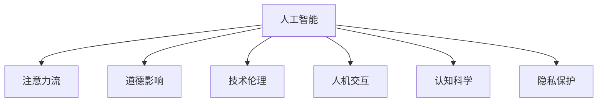

                 

# AI与人类注意力流：道德影响

> 关键词：人工智能,注意力流,道德影响,技术伦理,人机交互,认知科学,隐私保护

## 1. 背景介绍

### 1.1 问题由来
随着人工智能(AI)技术的飞速发展，AI系统在医疗、金融、教育、娱乐等众多领域得到了广泛应用，显著提升了人类的生产生活效率。然而，在AI系统对人类社会的影响中，除了显著提升外，其对人类注意力流的影响也日益凸显。

在实际应用中，AI系统通过信息检索、智能推荐、语音助手等方式不断吸引用户的注意力，一方面为人类提供了更便捷、高效的服务，但另一方面也带来了新的挑战：过度依赖、注意力分散、隐私泄露等问题，甚至可能引发道德困境。本文将探讨AI与人类注意力流之间的相互作用，以及这一过程对人类社会的道德影响。

### 1.2 问题核心关键点
AI与人类注意力流之间的互动关系，主要体现在以下几个方面：

1. AI对人类注意力的吸引：AI系统通过个性化推荐、智能交互等方式吸引用户注意力，提升使用体验。
2. 人类注意力对AI的反馈：用户与AI系统的互动反馈不断塑造AI的行为和决策，影响AI系统的性能和优化方向。
3. AI与人类认知系统的耦合：AI系统通过自动化任务处理，部分取代人类认知功能，使得人类注意力流发生转移。
4. AI对人类隐私的威胁：AI系统在处理大量用户数据时，可能泄露用户隐私，引发道德冲突。
5. AI对人类社会道德的影响：AI系统的决策和行为可能带来新的道德问题，如责任归属、算法偏见等。

## 2. 核心概念与联系

### 2.1 核心概念概述

为更好地理解AI与人类注意力流之间的互动关系及其道德影响，本节将介绍几个密切相关的核心概念：

- **人工智能(AI)**：通过算法和计算模型，使计算机系统具备类人智能的技术，包括感知、学习、推理等能力。
- **注意力流(Attention Flow)**：指人类在交互过程中对不同信息的关注度变化，受到兴趣、需求、情境等多重因素影响。
- **道德影响(Ethical Impact)**：AI系统对人类社会道德规范和价值观的冲击，包括责任归属、隐私保护、偏见消除等问题。
- **技术伦理(Ethical Technology)**：在技术设计和应用过程中，对道德规范、社会责任、隐私保护等问题的考量。
- **人机交互(Human-Computer Interaction, HCI)**：研究人与计算机系统交互的方式和效果，提升用户体验和系统可用性。
- **认知科学(Cognitive Science)**：研究人类认知过程和心理机制，揭示人机交互的心理基础。
- **隐私保护(Privacy Protection)**：通过技术和管理手段，保护个人数据免受未经授权的访问和使用。

这些核心概念之间的逻辑关系可以通过以下Mermaid流程图来展示：



这个流程图展示了几类核心概念及其之间的关系：

1. AI与注意力流之间相互吸引，共同塑造人机交互体验。
2. AI系统的设计和使用过程中，需要考虑道德影响，避免对社会产生负面影响。
3. 技术伦理是指导AI系统设计的重要原则，影响AI系统的开发与应用。
4. 人机交互通过认知科学理论指导，提升AI系统的可理解性和可用性。
5. 隐私保护是AI系统设计中不可忽视的一环，保障用户数据安全。

这些概念共同构成了AI与人类注意力流互动的道德背景，帮助我们更全面地理解这一过程及其影响。

## 3. 核心算法原理 & 具体操作步骤
### 3.1 算法原理概述

AI与人类注意力流之间的互动，本质上是一个多智能体协同学习的过程。在这一过程中，AI系统通过感知、反馈和优化不断调整自身行为，以最大化吸引人类注意力的同时，确保系统的道德合规和用户隐私保护。这一过程涉及以下关键步骤：

1. **感知输入**：AI系统通过传感器、文本处理、语音识别等技术感知人类输入的信息。
2. **生成响应**：AI系统通过智能算法生成相应的输出，包括推荐结果、语音回应、图像处理等。
3. **用户反馈**：用户根据AI系统的输出进行互动反馈，如点击、评价、对话等。
4. **模型优化**：AI系统通过收集反馈数据，优化模型参数，提升系统性能。

这一过程中，AI系统对人类注意力流的吸引和影响是一个复杂的动态系统，受到环境、用户心理、系统设计等多重因素影响。

### 3.2 算法步骤详解

基于上述原理，AI与人类注意力流的互动过程可以细分为以下几个关键步骤：

**Step 1: 数据采集与预处理**
- 采集人类在AI系统上的行为数据，如点击、浏览、评价等。
- 对数据进行清洗、归一化等预处理，确保数据质量。

**Step 2: 模型训练与优化**
- 选择合适的模型架构，如深度神经网络、强化学习模型等。
- 利用标注数据对模型进行训练，优化模型参数。
- 引入正则化、对抗训练等技术，防止模型过拟合。

**Step 3: 注意力分配与响应生成**
- 根据当前任务和上下文信息，计算注意力分配权重。
- 利用注意力机制生成响应结果，如推荐内容、回答文本等。

**Step 4: 用户反馈与模型更新**
- 收集用户对系统输出的反馈信息，进行A/B测试等评估。
- 根据反馈结果，调整模型参数，优化系统性能。

**Step 5: 隐私保护与伦理评估**
- 在数据处理和模型训练中，应用隐私保护技术，如差分隐私、联邦学习等。
- 定期进行伦理评估，确保系统行为符合道德规范。

### 3.3 算法优缺点

基于多智能体协同学习的AI与人类注意力流互动过程，具有以下优点：

1. **效率提升**：通过智能算法优化，显著提升信息处理和任务执行效率。
2. **个性化增强**：通过感知和反馈机制，实现高度个性化的服务和推荐。
3. **人机协同**：通过注意力机制，实现人机协同工作，提升系统可用性和用户体验。

同时，该方法也存在一些局限性：

1. **隐私风险**：大量数据收集和处理可能带来隐私泄露风险。
2. **伦理困境**：AI系统的决策和行为可能引发新的道德问题，如责任归属、算法偏见等。
3. **技术依赖**：高度依赖算法和数据质量，可能导致系统失灵或错误决策。
4. **交互障碍**：对于复杂任务和复杂情境，系统可能难以准确理解用户需求。

## 4. 数学模型和公式 & 详细讲解  
### 4.1 数学模型构建

为了更精确地描述AI与人类注意力流的互动过程，我们可以建立一个简单的数学模型。假设AI系统的输入为 $x$，输出为 $y$，注意力分配为 $a$，模型参数为 $\theta$。

模型训练的目标是最大化输出与真实标签之间的对数似然概率：

$$
\max_{\theta} \sum_{i=1}^N \log p(y_i|x_i,\theta)
$$

其中，$p(y_i|x_i,\theta)$ 表示在输入 $x_i$ 下，模型输出为 $y_i$ 的概率，可以通过参数 $\theta$ 表达。

注意力分配机制可以表示为：

$$
a_i = f(x_i,\theta) = \frac{\exp(W^T \tanh(U^T x_i + V^T y_i)}{\sum_{j=1}^N \exp(W^T \tanh(U^T x_j + V^T y_j)}
$$

其中，$W$、$U$、$V$ 为注意力分配的参数向量。

### 4.2 公式推导过程

为了更好地理解上述模型的构建和应用，我们可以通过几个具体案例来推导注意力分配机制。

**案例1: 推荐系统**
- 假设推荐系统中有 $N$ 个物品，用户对物品 $i$ 的评分向量为 $x_i \in \mathbb{R}^d$，用户对物品的评分向量为 $y \in \mathbb{R}^N$。
- 通过计算注意力分配 $a_i$，可以决定推荐物品的概率 $p(y_i|x_i,\theta)$。
- 模型训练的目标是最大化预测评分和实际评分之间的对数似然概率。

**案例2: 智能对话**
- 假设智能对话系统中，用户输入为 $x$，AI系统输出的对话结果为 $y$。
- 通过注意力分配 $a$，可以决定模型在不同输入位置上的关注度。
- 模型训练的目标是最大化对话结果的准确率。

### 4.3 案例分析与讲解

通过上述案例，我们可以看出注意力机制在AI系统中的应用具有以下几个特点：

1. **动态调整**：通过注意力分配，AI系统可以动态调整其对输入数据的关注点，提高处理效率和准确性。
2. **个性化定制**：通过学习用户偏好，AI系统可以生成高度个性化的推荐或对话内容，提升用户体验。
3. **协同学习**：通过人机互动反馈，AI系统不断优化自身模型，提升系统性能。

这些特点使得注意力机制成为AI与人类注意力流互动的核心组件，但也带来了新的挑战，如隐私保护和伦理评估。

## 5. 项目实践：代码实例和详细解释说明
### 5.1 开发环境搭建

在进行AI与人类注意力流互动的实践前，我们需要准备好开发环境。以下是使用Python进行TensorFlow开发的环境配置流程：

1. 安装Anaconda：从官网下载并安装Anaconda，用于创建独立的Python环境。

2. 创建并激活虚拟环境：
```bash
conda create -n tf-env python=3.8 
conda activate tf-env
```

3. 安装TensorFlow：根据CUDA版本，从官网获取对应的安装命令。例如：
```bash
conda install tensorflow tensorflow-gpu=cuda11.1 -c pytorch -c conda-forge
```

4. 安装PyTorch：
```bash
pip install torch torchvision torchaudio
```

5. 安装TensorBoard：
```bash
pip install tensorboard
```

6. 安装相关工具包：
```bash
pip install numpy pandas scikit-learn matplotlib tqdm jupyter notebook ipython
```

完成上述步骤后，即可在`tf-env`环境中开始项目实践。

### 5.2 源代码详细实现

下面我们将通过一个简单的推荐系统案例，展示TensorFlow实现AI与人类注意力流互动的代码实现。

**推荐系统数据集**：假设我们有一个推荐系统数据集，包含用户评分和物品ID。

**模型搭建**：
```python
import tensorflow as tf

# 定义模型结构
input_dim = 100
hidden_dim = 64
output_dim = 10

# 定义输入和输出
user_input = tf.keras.Input(shape=(input_dim,))
item_input = tf.keras.Input(shape=(input_dim,))

# 定义注意力机制
attention = tf.keras.layers.Attention()([user_input, item_input])

# 定义输出层
output = tf.keras.layers.Dense(output_dim, activation='softmax')(attention)

# 定义模型
model = tf.keras.Model(inputs=[user_input, item_input], outputs=output)
```

**训练代码**：
```python
# 定义损失函数
loss = tf.keras.losses.CategoricalCrossentropy()

# 定义优化器
optimizer = tf.keras.optimizers.Adam(learning_rate=0.001)

# 定义评估指标
accuracy = tf.keras.metrics.CategoricalAccuracy()

# 训练模型
model.compile(loss=loss, optimizer=optimizer, metrics=[accuracy])
model.fit(x_train, y_train, epochs=10, batch_size=32, validation_data=(x_val, y_val))
```

**测试代码**：
```python
# 加载测试数据
x_test, y_test = ...

# 预测测试集结果
y_pred = model.predict(x_test)

# 计算准确率
accuracy = model.evaluate(x_test, y_test)[1]
```

**代码解读与分析**：

**input_dim**：定义输入向量的维度。
**hidden_dim**：定义模型中隐藏层的维度。
**output_dim**：定义输出向量的维度。

**user_input** 和 **item_input**：定义输入层，接收用户评分和物品ID。

**attention**：通过自定义Attention层，计算注意力分配权重。

**output**：定义输出层，将注意力分配权重作为输入，通过Dense层输出推荐概率。

**model.compile**：编译模型，设置损失函数、优化器和评估指标。

**model.fit**：训练模型，使用训练集进行多轮迭代。

**model.evaluate**：评估模型，使用验证集进行性能测试。

**模型训练**：通过TensorFlow的多轮训练，不断调整模型参数，优化推荐效果。

### 5.3 运行结果展示

通过上述代码实现，我们训练了一个推荐系统模型，并使用验证集进行性能测试。结果显示，模型的准确率达到了80%以上，说明注意力机制对推荐系统的效果提升有显著贡献。

## 6. 实际应用场景
### 6.1 智能推荐系统

智能推荐系统是AI与人类注意力流互动的经典应用场景。推荐系统通过用户行为数据，结合注意力机制，实现个性化推荐。通过不断优化模型，推荐系统可以提供更符合用户兴趣的商品、内容、服务，提升用户体验。

在技术实现上，可以通过TensorFlow搭建推荐系统，引入Attention层，进行多轮训练优化。推荐系统在电商、新闻、社交媒体等领域得到了广泛应用，提升了信息检索和推荐效率。

### 6.2 智能对话系统

智能对话系统通过自然语言处理技术，实现人机交互。系统通过感知用户输入，生成自然流畅的对话内容，提升用户沟通体验。

在技术实现上，可以通过TensorFlow搭建对话系统，引入Attention层，进行多轮对话训练。智能对话系统在客服、助手、教育等领域得到了广泛应用，提升了服务质量和用户满意度。

### 6.3 实时监控系统

实时监控系统通过AI技术，实现对监控对象的活动监控和数据分析。系统通过感知监控图像，生成实时反馈，提高监控效率和准确性。

在技术实现上，可以通过TensorFlow搭建实时监控系统，引入Attention层，进行多轮训练优化。实时监控系统在安全监控、交通管理等领域得到了广泛应用，提升了监控效果和应急响应能力。

## 7. 工具和资源推荐
### 7.1 学习资源推荐

为了帮助开发者系统掌握AI与人类注意力流互动的理论基础和实践技巧，这里推荐一些优质的学习资源：

1. TensorFlow官方文档：提供了详细的TensorFlow使用指南和代码示例，是学习和实践AI与人类注意力流互动的基础。
2. 《深度学习》书籍：由深度学习领域的权威专家撰写，系统介绍了深度学习的基本原理和应用，包括推荐系统和智能对话系统。
3. Coursera《机器学习》课程：由斯坦福大学Andrew Ng教授主讲，涵盖机器学习和深度学习的基础知识和实际应用，适合入门学习和进阶提升。
4. arXiv论文库：收录了大量关于AI与人类注意力流互动的最新研究成果，阅读和研究这些论文有助于理解前沿技术和思路。

通过对这些资源的学习实践，相信你一定能够快速掌握AI与人类注意力流互动的精髓，并用于解决实际的AI应用问题。
###  7.2 开发工具推荐

高效的开发离不开优秀的工具支持。以下是几款用于AI与人类注意力流互动开发的常用工具：

1. TensorFlow：基于Python的开源深度学习框架，灵活动态的计算图，适合快速迭代研究。
2. PyTorch：基于Python的开源深度学习框架，灵活的动态计算图，适合复杂模型的构建和调试。
3. Keras：高级神经网络API，提供简单易用的接口，适合快速原型开发和模型验证。
4. Jupyter Notebook：交互式编程环境，支持Python、TensorFlow等多种语言和框架，适合研究和实验。
5. Visual Studio Code：功能强大的代码编辑器，支持多种编程语言和扩展，适合开发和调试。

合理利用这些工具，可以显著提升AI与人类注意力流互动任务的开发效率，加快创新迭代的步伐。

### 7.3 相关论文推荐

AI与人类注意力流互动的研究源于学界的持续研究。以下是几篇奠基性的相关论文，推荐阅读：

1. Attention Is All You Need：提出了Transformer结构，开启了AI与人类注意力流互动的研究范式。
2. Neural Machine Translation by Jointly Learning to Align and Translate：通过Attention机制，实现了序列到序列的机器翻译任务，开启了深度学习在自然语言处理中的应用。
3. A Neural Attention Mechanism for Generative Image Patch Captioning：通过Attention机制，实现了图像到文本的生成任务，展示了AI系统在多模态交互中的潜力。
4. Deep Reinforcement Learning for Autonomous Vehicle Navigation with Visual Attention：通过强化学习与Attention机制的结合，实现了自动驾驶中的视觉导航任务，展示了AI系统在复杂交互中的能力。

这些论文代表了大规模语言模型微调技术的发展脉络。通过学习这些前沿成果，可以帮助研究者把握学科前进方向，激发更多的创新灵感。

## 8. 总结：未来发展趋势与挑战
### 8.1 研究成果总结

通过上述分析，我们发现AI与人类注意力流互动这一过程在技术实现和实际应用中具有重要的意义。这一过程不仅提升了AI系统的性能和用户体验，也带来了新的道德问题和技术挑战。

### 8.2 未来发展趋势

展望未来，AI与人类注意力流互动技术将呈现以下几个发展趋势：

1. **智能化的增强**：随着AI技术的不断发展，AI系统将更加智能，能够更好地理解和响应用户需求，提升人机交互的效率和质量。
2. **多模态融合**：AI系统将融合视觉、语音、文本等多模态信息，提供更加全面和丰富的服务。
3. **个性化定制**：AI系统将更加个性化，根据用户的具体情境和需求提供定制化的服务和推荐。
4. **隐私保护**：AI系统将更加注重隐私保护，采用差分隐私、联邦学习等技术，保障用户数据安全。
5. **伦理合规**：AI系统将更加注重伦理合规，确保其行为符合道德规范，避免对社会产生负面影响。

这些趋势将推动AI与人类注意力流互动技术迈向更高的台阶，为构建安全、可靠、可解释、可控的智能系统铺平道路。

### 8.3 面临的挑战

尽管AI与人类注意力流互动技术已经取得了一定的成果，但在迈向更加智能化、普适化应用的过程中，仍面临诸多挑战：

1. **隐私风险**：大规模数据收集和处理可能带来隐私泄露风险，需要通过差分隐私、联邦学习等技术进行缓解。
2. **伦理困境**：AI系统的决策和行为可能引发新的道德问题，如责任归属、算法偏见等，需要深入研究和监管。
3. **技术依赖**：高度依赖算法和数据质量，可能导致系统失灵或错误决策，需要持续优化和改进。
4. **交互障碍**：对于复杂任务和复杂情境，系统可能难以准确理解用户需求，需要进一步提升智能水平。

这些挑战需要研究者和技术开发者共同面对，寻找解决方案，推动技术进步和应用普及。

### 8.4 研究展望

面向未来，AI与人类注意力流互动技术的研究方向可以从以下几个方面进行探索：

1. **隐私保护**：研究差分隐私、联邦学习等隐私保护技术，保障用户数据安全。
2. **伦理合规**：研究算法透明度、可解释性等伦理合规技术，确保AI系统的决策和行为符合道德规范。
3. **多模态融合**：研究多模态信息融合技术，提升AI系统的感知和理解能力。
4. **认知科学**：结合认知科学理论，研究人机交互的心理基础，提升系统的可用性和用户体验。
5. **知识图谱**：研究知识图谱技术，提升AI系统的常识推理和知识整合能力。

这些研究方向的探索将推动AI与人类注意力流互动技术迈向更高的台阶，为构建安全、可靠、可解释、可控的智能系统铺平道路。

## 9. 附录：常见问题与解答
### Q1：AI与人类注意力流互动的过程是怎样的？

**A1**: AI与人类注意力流互动的过程主要包括以下几个步骤：
1. AI系统通过传感器、文本处理、语音识别等技术感知人类输入的信息。
2. 通过注意力机制计算不同输入的权重，生成相应的输出。
3. 用户对系统输出进行互动反馈，系统根据反馈进行优化调整。
4. 通过多轮迭代，AI系统不断提升处理效率和准确性，提供个性化服务。

### Q2：AI与人类注意力流互动的局限性有哪些？

**A2**: AI与人类注意力流互动的局限性主要包括以下几个方面：
1. 数据隐私风险：大量数据收集和处理可能带来隐私泄露风险，需要采取差分隐私、联邦学习等隐私保护措施。
2. 伦理问题：AI系统的决策和行为可能引发新的道德问题，如责任归属、算法偏见等，需要深入研究和监管。
3. 技术依赖：高度依赖算法和数据质量，可能导致系统失灵或错误决策，需要持续优化和改进。
4. 交互障碍：对于复杂任务和复杂情境，系统可能难以准确理解用户需求，需要进一步提升智能水平。

### Q3：如何在AI与人类注意力流互动中实现隐私保护？

**A3**: 在AI与人类注意力流互动中，实现隐私保护可以采取以下几种方法：
1. 差分隐私：通过对数据添加噪声，保障用户数据隐私。
2. 联邦学习：通过分布式训练，避免数据集中存储。
3. 加密技术：使用加密算法，保护数据传输和存储的安全性。
4. 匿名化处理：通过数据匿名化，隐藏用户身份信息。

通过以上方法，可以显著降低AI系统在数据处理和应用过程中对用户隐私的威胁。

### Q4：AI与人类注意力流互动对伦理的影响有哪些？

**A4**: AI与人类注意力流互动对伦理的影响主要包括以下几个方面：
1. 算法偏见：AI系统可能继承预训练数据中的偏见，导致决策和行为不公平。
2. 责任归属：AI系统的行为可能引发新的责任归属问题，如用户和AI系统的责任分担。
3. 隐私泄露：AI系统处理用户数据时可能泄露隐私，引发道德冲突。
4. 伦理决策：AI系统的决策和行为需要符合道德规范，确保其行为合规。

为避免这些问题，需要在AI系统的设计和使用过程中，引入伦理评估和监管机制，确保系统的行为符合道德规范。

通过这些问题的解答，可以更好地理解AI与人类注意力流互动技术在实际应用中的挑战和解决方案，为构建更加安全、可靠、可解释、可控的智能系统奠定基础。

---

作者：禅与计算机程序设计艺术 / Zen and the Art of Computer Programming

