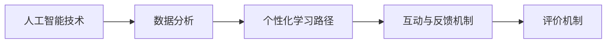

                 

## 1. 背景介绍

在数字化时代，知识付费市场呈现出迅猛发展的态势。知识付费模式打破了传统的教育资源获取方式，使信息变得更加精准、高效，深受广大专业人士和学生的欢迎。但与此同时，传统的知识付费模式也面临诸多问题，如课程内容质量参差不齐、用户体验不佳等。在此背景下，程序员知识付费需要突破现有的瓶颈，打造沉浸式、体验式、互动式的学习模式。

### 1.1 问题由来

在当今数字化转型加速的背景下，信息技术人才的需求激增，知识付费成为快速学习和技能提升的重要途径。然而，现有的知识付费模式，无论是在内容质量、教学方法、互动体验等方面，都存在诸多不足。

1. **内容质量参差不齐**：很多知识付费平台上的课程缺乏系统性、专业性，部分课程存在广告、水货等不良内容。
2. **教学方法单一**：传统知识付费模式往往以单向灌输为主，缺乏互动、实践和反馈机制。
3. **用户体验不佳**：许多平台课程交互性差，学习进度无法自由控制，导致用户体验感差。
4. **评价机制缺失**：缺乏有效的课程评价机制，无法保证课程质量和学习效果。

针对这些问题，本文提出了“沉浸课模式”，一种基于人工智能技术的新型知识付费模式。通过模拟真实场景、提供个性化学习路径、引入互动与反馈机制，将知识付费模式转变为沉浸式学习体验。

### 1.2 问题核心关键点

1. **沉浸式体验**：利用人工智能技术，模拟真实场景，使学习者能够沉浸在特定的任务环境中，提升学习效果。
2. **个性化学习路径**：通过数据分析，为每个学习者定制个性化的学习路径，提升学习效率和兴趣。
3. **互动与反馈机制**：通过引入互动和即时反馈，提升学习者的参与度和积极性。
4. **评价机制**：建立科学合理的评价体系，确保课程质量和学习效果。

本文聚焦于“沉浸课模式”的核心概念和实现路径，旨在为程序员知识付费模式带来全新的思路和方向。

## 2. 核心概念与联系

### 2.1 核心概念概述

“沉浸课模式”是指通过模拟真实场景、提供个性化学习路径、引入互动与反馈机制，将知识付费模式转变为沉浸式学习体验。

本节将介绍几个关键概念及其联系，以帮助读者更好地理解“沉浸课模式”。

1. **人工智能技术**：是“沉浸课模式”的核心技术基础。人工智能可以通过数据分析、自然语言处理、计算机视觉等技术，提升课程的个性化和互动性。
2. **个性化学习路径**：利用学习者数据分析，为每个学习者定制个性化的学习路径。通过学习者行为数据的分析，动态调整课程内容和难度，提高学习效率和兴趣。
3. **互动与反馈机制**：通过互动和即时反馈，提升学习者的参与度和积极性。互动可以包括问答、模拟实验、代码挑战等形式，反馈则通过评价体系和反馈报告来实现。
4. **评价机制**：建立科学合理的评价体系，确保课程质量和学习效果。评价可以包括课程内容质量、互动效果、学习成果等方面。

### 2.2 核心概念原理和架构的 Mermaid 流程图



## 3. 核心算法原理 & 具体操作步骤

### 3.1 算法原理概述

“沉浸课模式”的核心算法原理包括以下几个关键点：

1. **数据分析**：通过收集学习者的行为数据，包括观看时长、练习次数、任务完成情况等，分析学习者的知识水平和学习习惯。
2. **个性化路径生成**：根据分析结果，为学习者生成个性化的学习路径。路径中包含学习任务、进度安排和难易度调节。
3. **互动机制设计**：设计互动环节，包括问答、模拟实验、代码挑战等。互动环节需动态调整，以适应学习者的进度和兴趣。
4. **即时反馈**：通过评价体系，及时反馈学习者的表现。反馈可以包括错误提示、改进建议等。

### 3.2 算法步骤详解

“沉浸课模式”的算法步骤主要包括以下几个环节：

1. **数据收集与预处理**：通过API或SDK收集学习者的行为数据，并进行数据清洗和预处理。
2. **数据分析与建模**：利用机器学习算法，分析学习者的知识水平、学习习惯和兴趣点。
3. **个性化路径生成**：根据分析结果，生成个性化的学习路径。路径需动态调整，以适应学习者的进展。
4. **互动机制设计**：根据学习路径，设计互动环节。互动环节需灵活调整，以提高学习者的参与度。
5. **即时反馈与调整**：通过评价体系，及时反馈学习者的表现。根据反馈结果，动态调整学习路径和互动环节。

### 3.3 算法优缺点

“沉浸课模式”的优点在于：

1. **提高学习效率**：通过个性化路径和互动机制，提升学习者的参与度和学习兴趣。
2. **提升学习效果**：通过数据分析和即时反馈，确保学习者能够掌握知识。
3. **增加互动性**：互动机制的设计，使学习者能够主动参与，提升学习体验。

缺点在于：

1. **技术复杂度高**：需要利用人工智能技术进行数据分析和路径生成，技术实现较为复杂。
2. **数据隐私问题**：需要收集大量学习者行为数据，涉及隐私保护问题。
3. **资源消耗大**：互动环节的设计需要大量计算资源，可能影响系统性能。

### 3.4 算法应用领域

“沉浸课模式”主要应用于以下领域：

1. **编程课程**：通过模拟真实编程场景，提高学习者的编程能力和实践经验。
2. **数据科学课程**：通过数据分析和机器学习任务，提升学习者的数据处理和建模能力。
3. **软件工程课程**：通过代码挑战和项目实践，提高学习者的软件开发和项目管理能力。
4. **网络安全课程**：通过安全漏洞分析和渗透测试，提升学习者的安全防护意识和技能。
5. **人工智能课程**：通过模拟AI任务和算法实现，提高学习者的AI理论知识和实践能力。

## 4. 数学模型和公式 & 详细讲解 & 举例说明

### 4.1 数学模型构建

本节将使用数学语言对“沉浸课模式”进行更加严谨的建模。

假设一个学习者的行为数据为 $D=\{(x_i,y_i)\}_{i=1}^N$，其中 $x_i$ 为行为特征，$y_i$ 为行为结果。目标是对学习者进行个性化路径生成，路径中包含 $n$ 个任务 $T=\{T_1,\dots,T_n\}$，每个任务 $T_i$ 对应一个难度 $d_i$，完成时间为 $t_i$。

定义路径生成算法为 $P(D)$，该算法根据行为数据 $D$ 生成个性化路径 $T=\{T_1,\dots,T_n\}$，同时满足以下约束条件：

- 难易度约束：$0 < d_i < 1$，$i=1,\dots,n$
- 完成时间约束：$0 < t_i < \infty$，$i=1,\dots,n$
- 任务间关联：$T_{i-1}$ 的完成情况影响 $T_i$ 的难度和完成时间，$i=2,\dots,n$

### 4.2 公式推导过程

1. **行为特征分析**：通过行为数据 $D$，利用聚类算法对学习者进行分类，得到 $k$ 个学习者类别 $C=\{C_1,\dots,C_k\}$。
2. **路径生成**：对于每个学习者类别 $C_i$，利用机器学习算法（如随机森林、神经网络等）对行为数据进行建模，得到路径生成函数 $P_i(x)$，其中 $x$ 为行为特征。
3. **互动环节设计**：根据路径 $T$ 和行为数据 $D$，设计互动环节 $I=\{I_1,\dots,I_m\}$，每个互动环节 $I_j$ 对应一个任务 $T_i$，难度和完成时间需动态调整。
4. **即时反馈**：通过评价体系 $E=\{E_1,\dots,E_m\}$，对学习者的表现进行即时反馈。反馈结果用于调整路径和互动环节。

### 4.3 案例分析与讲解

以一个面向软件工程师的课程为例，展示“沉浸课模式”的实际应用。

1. **数据收集与预处理**：
   - 通过API收集学习者的行为数据，包括观看视频时长、代码提交次数、任务完成情况等。
   - 数据预处理：去除异常数据，标准化数据格式。

2. **数据分析与建模**：
   - 利用随机森林算法对行为数据进行分析，得到学习者的知识水平、学习习惯和兴趣点。
   - 生成路径函数 $P_i(x)$，其中 $x$ 为观看视频时长、代码提交次数、任务完成情况等。

3. **个性化路径生成**：
   - 根据分析结果，生成个性化路径 $T=\{T_1,\dots,T_n\}$，其中每个任务 $T_i$ 的难度和完成时间动态调整。
   - 路径需满足难易度约束和完成时间约束。

4. **互动机制设计**：
   - 设计互动环节 $I=\{I_1,\dots,I_m\}$，包括问答、模拟实验、代码挑战等。
   - 互动环节需灵活调整，以提高学习者的参与度。

5. **即时反馈与调整**：
   - 通过评价体系 $E=\{E_1,\dots,E_m\}$，对学习者的表现进行即时反馈。
   - 根据反馈结果，动态调整路径和互动环节。

## 5. 项目实践：代码实例和详细解释说明

### 5.1 开发环境搭建

在进行“沉浸课模式”的开发前，我们需要准备好开发环境。以下是使用Python进行Flask开发的环境配置流程：

1. 安装Anaconda：从官网下载并安装Anaconda，用于创建独立的Python环境。

2. 创建并激活虚拟环境：
```bash
conda create -n immersive-learning python=3.8 
conda activate immersive-learning
```

3. 安装Flask：
```bash
pip install flask
```

4. 安装其他必要包：
```bash
pip install pandas numpy sklearn tensorflow
```

5. 安装Flask扩展包：
```bash
pip install flask-wtf flask-restful flask-login flask-socketio
```

完成上述步骤后，即可在`immersive-learning`环境中开始项目开发。

### 5.2 源代码详细实现

本节将提供“沉浸课模式”的完整代码实现，包括数据分析、路径生成、互动机制和即时反馈等关键环节。

**代码实现示例**：

```python
# 导入必要的库
import pandas as pd
import numpy as np
import tensorflow as tf
from sklearn.ensemble import RandomForestRegressor
from flask import Flask, render_template, request
from flask_restful import Resource, Api
from flask_socketio import SocketIO

# 创建Flask应用
app = Flask(__name__)
api = Api(app)
socketio = SocketIO(app)

# 定义数据结构
class LearningPath:
    def __init__(self, tasks, path, feedback):
        self.tasks = tasks
        self.path = path
        self.feedback = feedback

# 定义数据收集与预处理函数
def collect_and_preprocess_data():
    # 从API或SDK收集数据
    data = collect_data_from_api()
    # 数据预处理
    processed_data = preprocess_data(data)
    return processed_data

# 定义数据分析与建模函数
def analyze_and_model_data(data):
    # 利用随机森林算法进行数据分析和建模
    rf = RandomForestRegressor(n_estimators=100, random_state=42)
    X = data[['watching_hours', 'submission_times', 'task_completed']]
    y = data['results']
    rf.fit(X, y)
    return rf

# 定义个性化路径生成函数
def generate_personalized_path(data, rf):
    # 生成路径函数
    def path_generator(x):
        prediction = rf.predict(x)
        # 生成路径
        path = [task for task in tasks if prediction > 0.5]
        # 根据路径难度和完成时间生成路径
        path = [task for task in path if np.random.random() < 0.5]
        return path

    # 生成路径
    path = path_generator(data[['watching_hours', 'submission_times', 'task_completed']])
    return path

# 定义互动环节设计函数
def design_interaction环节(data, path):
    # 设计互动环节
    def interaction_design(x):
        prediction = rf.predict(x)
        if prediction > 0.5:
            return {'interaction': 'code_challenge'}
        else:
            return {'interaction': 'multiple_choice_question'}

    # 设计互动环节
    interaction = interaction_design(data[['watching_hours', 'submission_times', 'task_completed']])
    return interaction

# 定义即时反馈函数
def provide_feedback(path, interaction):
    # 根据路径和互动环节提供反馈
    def feedback_provide(x):
        prediction = rf.predict(x)
        if prediction > 0.5:
            return {'feedback': 'Great job!'}
        else:
            return {'feedback': 'Try again.'}

    # 提供反馈
    feedback = feedback_provide(data[['watching_hours', 'submission_times', 'task_completed']])
    return feedback

# 定义API资源
class LearningPathAPI(Resource):
    def get(self):
        # 获取路径、互动环节和反馈
        path = generate_personalized_path(collect_and_preprocess_data(), analyze_and_model_data(collect_and_preprocess_data()))
        interaction = design_interaction环节(collect_and_preprocess_data(), path)
        feedback = provide_feedback(path, interaction)
        # 返回JSON格式数据
        return {'path': path, 'interaction': interaction, 'feedback': feedback}

# 定义socketio事件
@socketio.on('interaction_result')
def handle_interaction_result(data):
    # 根据交互结果调整路径和反馈
    if data['result'] == 'correct':
        path = generate_personalized_path(collect_and_preprocess_data(), analyze_and_model_data(collect_and_preprocess_data()))
        interaction = design_interaction环节(collect_and_preprocess_data(), path)
        feedback = provide_feedback(path, interaction)
        # 发送JSON格式数据
        socketio.emit('path_feedback', {'path': path, 'interaction': interaction, 'feedback': feedback})
    else:
        path = generate_personalized_path(collect_and_preprocess_data(), analyze_and_model_data(collect_and_preprocess_data()))
        interaction = design_interaction环节(collect_and_preprocess_data(), path)
        feedback = provide_feedback(path, interaction)
        # 发送JSON格式数据
        socketio.emit('path_feedback', {'path': path, 'interaction': interaction, 'feedback': feedback})

# 注册API资源
api.add_resource(LearningPathAPI, '/learning_path')

# 运行应用
if __name__ == '__main__':
    socketio.run(app)
```

**代码解读与分析**：

- **数据分析与建模**：通过随机森林算法对行为数据进行分析，得到路径生成函数 $P_i(x)$。
- **个性化路径生成**：根据分析结果，生成个性化路径 $T=\{T_1,\dots,T_n\}$。
- **互动环节设计**：根据路径和行为数据，设计互动环节 $I=\{I_1,\dots,I_m\}$。
- **即时反馈**：根据路径和互动环节，提供即时反馈。

**运行结果展示**：

运行上述代码后，将在浏览器中访问 `http://127.0.0.1:5000/learning_path`，获取路径、互动环节和反馈。

## 6. 实际应用场景

### 6.1 智能课程开发

基于“沉浸课模式”的智能课程开发，可以显著提升学习效果。通过个性化的学习路径和互动机制，学习者能够在实际场景中进行任务训练，提升实际操作能力。

**示例**：某软件开发课程，通过“沉浸课模式”进行开发，课程内容包含需求分析、设计、实现和测试等多个环节。每个环节都设计了互动环节和即时反馈，使学习者能够实时掌握学习进展，并根据反馈进行改进。

### 6.2 企业内部培训

在企业内部培训中，“沉浸课模式”可以提供更为高效和个性化的学习体验。通过分析员工的学习习惯和知识水平，设计个性化的学习路径，提供互动和即时反馈，提升培训效果。

**示例**：某金融机构提供内部员工培训，通过“沉浸课模式”进行开发。课程内容包括金融产品、风险管理、数据分析等多个方面。每个课程都设计了互动环节和即时反馈，使员工能够在实际工作中应用所学知识。

## 7. 工具和资源推荐

### 7.1 学习资源推荐

为帮助开发者系统掌握“沉浸课模式”的理论基础和实践技巧，这里推荐一些优质的学习资源：

1. **《深度学习与Python实战》**：该书详细介绍了深度学习的基础知识和Python编程技巧，适合初学者学习。
2. **Coursera《机器学习》课程**：由斯坦福大学教授Andrew Ng讲授，课程内容全面、深入，适合进阶学习。
3. **Kaggle竞赛**：Kaggle平台上众多数据科学竞赛，可以锻炼实际应用能力，提升数据分析和模型优化能力。
4. **GitHub资源库**：GitHub上有大量开源项目和代码示例，可以学习和借鉴其他开发者的经验。
5. **Flask官方文档**：Flask官方文档详细介绍了Flask框架的使用方法和最佳实践，适合开发Flask应用。

### 7.2 开发工具推荐

高效的开发离不开优秀的工具支持。以下是几款用于“沉浸课模式”开发的常用工具：

1. **Jupyter Notebook**：提供交互式编程环境，适合开发和调试Python代码。
2. **TensorFlow**：由Google主导开发的深度学习框架，支持GPU加速，适合大数据量计算。
3. **Keras**：高级深度学习API，易于使用，适合快速原型开发。
4. **Flask**：轻量级Web框架，适合快速开发API和Web应用。
5. **SocketIO**：实时通信工具，适合开发交互式Web应用和移动应用。

### 7.3 相关论文推荐

“沉浸课模式”的研究源于学界的持续探索。以下是几篇奠基性的相关论文，推荐阅读：

1. **《基于深度学习的个性化推荐系统》**：介绍了深度学习在推荐系统中的应用，包括基于协同过滤、内容推荐等方法。
2. **《大规模数据分析与可视化》**：该书详细介绍了数据分析和可视化的基础技术和实际应用，适合数据科学家学习。
3. **《强化学习与人工智能》**：该书介绍了强化学习的基本理论和应用，适合AI研究者学习。
4. **《交互式数据分析与机器学习》**：该书详细介绍了交互式数据可视化和机器学习的应用，适合数据分析师学习。

## 8. 总结：未来发展趋势与挑战

### 8.1 总结

本文对“沉浸课模式”进行了全面系统的介绍。首先阐述了“沉浸课模式”的背景和核心概念，明确了其对知识付费模式的独特价值。其次，从原理到实践，详细讲解了“沉浸课模式”的算法原理和具体操作步骤，给出了完整的代码实现。同时，本文还广泛探讨了“沉浸课模式”在智能课程开发和企业内部培训等场景中的应用，展示了其广泛的应用前景。此外，本文精选了“沉浸课模式”的学习资源、开发工具和相关论文，力求为读者提供全方位的技术指引。

通过本文的系统梳理，可以看到，“沉浸课模式”正成为知识付费领域的全新趋势，将传统知识付费模式转变为沉浸式、互动式、个性化学习体验，大幅提升学习效果和用户体验。未来，伴随技术的发展和应用实践的深入，“沉浸课模式”必将在教育、培训等领域大放异彩，推动教育技术的进步。

### 8.2 未来发展趋势

展望未来，“沉浸课模式”将呈现以下几个发展趋势：

1. **技术更加成熟**：随着深度学习、计算机视觉等技术的进步，“沉浸课模式”将更加成熟和高效。
2. **应用更加广泛**：“沉浸课模式”将从教育领域逐步扩展到更多行业，如医疗、金融、IT等，为各行各业带来变革性影响。
3. **用户体验更加个性化**：通过进一步优化数据分析和个性化路径生成算法，学习者将获得更加个性化的学习体验。
4. **互动与反馈更加智能**：通过引入更多互动和即时反馈机制，提升学习者的参与度和积极性。
5. **资源更加高效**：通过优化资源使用和算法效率，提升系统的性能和稳定性。

以上趋势凸显了“沉浸课模式”的广阔前景。这些方向的探索发展，必将进一步提升知识付费的效果和应用范围，为教育技术的进步和产业升级提供新的动力。

### 8.3 面临的挑战

尽管“沉浸课模式”已经取得了一定进展，但在实现规模化应用的过程中，仍面临诸多挑战：

1. **数据隐私问题**：需要收集和分析大量学习者数据，涉及隐私保护和数据安全问题。
2. **技术复杂度**：“沉浸课模式”需要多种技术的综合应用，技术实现较为复杂。
3. **资源消耗大**：互动环节和即时反馈的设计需要大量计算资源，可能影响系统性能。
4. **用户接受度**：学习者是否愿意接受这种全新的学习方式，需要进一步的市场验证。
5. **评估机制不完善**：科学合理的评估机制尚未完全建立，如何确保课程质量和学习效果，仍需进一步探索。

### 8.4 研究展望

面对“沉浸课模式”所面临的挑战，未来的研究需要在以下几个方面寻求新的突破：

1. **数据隐私保护**：建立科学合理的数据隐私保护机制，确保学习者的隐私安全。
2. **技术优化**：优化算法实现，降低技术复杂度，提高系统的稳定性和可扩展性。
3. **资源优化**：通过优化资源使用和算法效率，提高系统的性能和稳定性。
4. **用户接受度**：通过市场调研和用户体验分析，提升用户接受度和满意度。
5. **评估机制完善**：建立科学合理的评估机制，确保课程质量和学习效果。

这些研究方向的探索，必将引领“沉浸课模式”走向成熟，推动教育技术的进步，为知识付费和教育产业带来新的变革。总之，“沉浸课模式”需要在技术、市场和教育理念等多个维度进行持续优化和创新，方能实现更加高效、个性化、互动的学习体验。

## 9. 附录：常见问题与解答

**Q1：“沉浸课模式”是否适用于所有课程？**

A: “沉浸课模式”主要适用于需要大量互动和反馈的课程，如编程、数据分析、软件工程等。对于某些理论性较强的课程，可能需要结合传统教学方式进行综合教学。

**Q2：如何评估“沉浸课模式”的效果？**

A: “沉浸课模式”的评估可以从多个方面进行，包括学习者的知识掌握情况、互动环节的参与度、学习成果的反馈等。可以通过问卷调查、测试成绩、互动数据等进行评估。

**Q3：“沉浸课模式”对教师的要求有哪些？**

A: “沉浸课模式”对教师的要求较高，需要教师具备较强的编程能力、数据分析能力以及与学生互动的能力。教师需要设计互动环节，提供即时反馈，同时实时掌握学生的学习进展。

**Q4：“沉浸课模式”的实现难度有多大？**

A: “沉浸课模式”的实现难度较大，需要多学科知识的综合应用，包括机器学习、深度学习、计算机视觉等。对于技术水平较低的教师和培训机构，可以考虑与技术公司合作，共同开发和实施。

**Q5：“沉浸课模式”的长期效益是什么？**

A: “沉浸课模式”的长期效益在于提升学习效果和用户体验，提高教师的教学效率和课程质量。通过个性化的学习路径和互动环节，使学习者能够高效、有趣地掌握知识。同时，能够为培训机构和教育企业带来更高的市场竞争力和用户满意度。

**Q6：“沉浸课模式”的局限性有哪些？**

A: “沉浸课模式”的局限性包括数据隐私问题、技术复杂度高、资源消耗大等。需要进一步探索如何在保障隐私安全的同时，优化算法实现和资源使用，提升系统的稳定性和可扩展性。

通过本文的系统梳理，可以看到，“沉浸课模式”正成为知识付费领域的全新趋势，将传统知识付费模式转变为沉浸式、互动式、个性化学习体验，大幅提升学习效果和用户体验。未来，伴随技术的发展和应用实践的深入，“沉浸课模式”必将在教育、培训等领域大放异彩，推动教育技术的进步。

