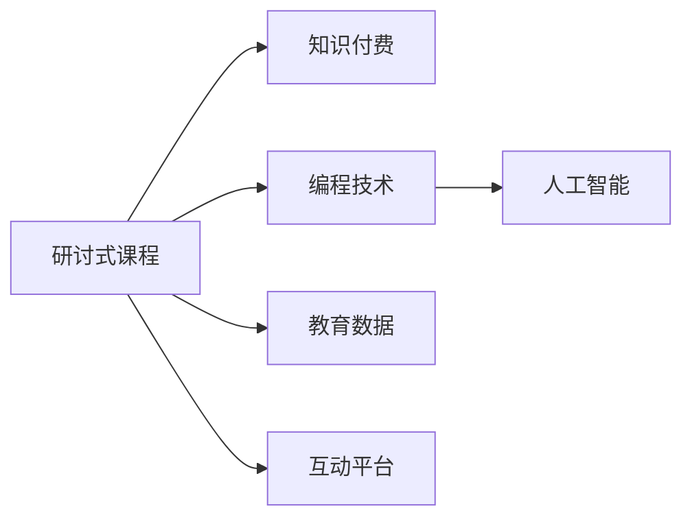

                 

# 程序员知识付费：打造研讨式课程

## 1. 背景介绍

### 1.1 问题由来
随着互联网和移动通信技术的飞速发展，在线教育市场迅速崛起，在线课程成为广大用户获取知识和技能的重要途径。然而，传统的单向灌输式教学方式存在诸多弊端，如内容枯燥、互动性差、学习效果不理想等。为了改善在线教育体验，越来越多的教育机构和平台开始探索更先进的教育形式。

其中，研讨式课程（Seminar-Based Courses）以其独特的教学理念和互动性强的学习方式，逐渐受到广泛关注。研讨式课程强调以问题为导向，通过讨论、分析、设计等多种互动形式，帮助学员深入理解和掌握知识，激发思维深度和创新能力。

本文将深入探讨如何利用编程和AI技术，打造高效、互动、多样化的研讨式课程，为在线教育带来全新变革。

## 2. 核心概念与联系

### 2.1 核心概念概述

为了更好地理解研讨式课程的构建过程，本节将介绍几个核心概念：

- **研讨式课程（Seminar-Based Courses）**：一种以问题为导向的互动式教学模式，通过讨论、分析、设计等形式，激发学员的思维深度和创新能力。
- **知识付费（Knowledge-Paying）**：用户为获取高质量教育内容或服务支付费用的模式，强调知识的价值和使用价值的实现。
- **编程技术（Programming Technologies）**：包括编程语言、开发框架、数据库、云计算等，是构建研讨式课程的重要技术支撑。
- **人工智能（AI）**：包括机器学习、自然语言处理、计算机视觉等，通过智能算法和模型，辅助课程设计和互动优化。
- **教育数据（Educational Data）**：包括学员的学习数据、反馈数据、行为数据等，通过数据分析优化课程设计和教学效果。

这些核心概念之间的逻辑关系可以通过以下Mermaid流程图来展示：



这个流程图展示了几大核心概念及其之间的关系：

1. 研讨式课程通过编程技术和人工智能技术进行设计和优化。
2. 知识付费是研讨式课程变现的重要模式。
3. 教育数据是课程设计和优化，以及教学效果评估的重要依据。
4. 互动平台是课程执行和知识传递的重要载体。

这些概念共同构成了研讨式课程的教学架构，使其能够提供丰富多样的学习体验，有效提升学员的学习效果。

## 3. 核心算法原理 & 具体操作步骤

### 3.1 算法原理概述

研讨式课程的构建和优化主要依赖于以下几个算法原理：

- **问题生成算法**：自动生成与课程主题相关的问题，供学员讨论和分析。
- **情感分析算法**：通过分析学员的讨论情绪和反馈，动态调整课程内容和节奏。
- **推荐系统算法**：根据学员的学习数据，推荐相关阅读材料和讨论话题，丰富学习内容。
- **实时互动算法**：通过即时反馈和互动，增强课程的沉浸感和互动性。

### 3.2 算法步骤详解

#### 3.2.1 问题生成算法

问题生成算法通常包括以下步骤：

1. **定义课程主题**：根据课程目标，确定课程的核心主题和关键知识点。
2. **构建知识图谱**：通过知识图谱生成算法，构建与主题相关的知识节点和关系。
3. **生成问题列表**：根据知识节点和关系，生成一系列可供讨论的问题。
4. **筛选和排序**：通过评分排序算法，筛选出最具有挑战性和趣味性的问题。

#### 3.2.2 情感分析算法

情感分析算法主要步骤如下：

1. **文本预处理**：对学员的讨论文本进行分词、去除停用词、词干提取等预处理操作。
2. **情感标注**：使用情感分析模型，对讨论文本进行情感标注，识别积极、消极或中性情绪。
3. **情绪可视化**：将情感分析结果可视化，帮助教师和学员理解讨论情绪。
4. **动态调整**：根据情绪分析结果，动态调整课程内容、难度和节奏，适应学员的情感状态。

#### 3.2.3 推荐系统算法

推荐系统算法主要步骤如下：

1. **数据收集**：收集学员的学习数据，包括课程学习记录、讨论参与度、测评成绩等。
2. **特征提取**：提取学员的特征向量，如学习时长、讨论活跃度、知识掌握情况等。
3. **相似度计算**：计算学员之间的相似度，形成用户画像。
4. **推荐生成**：根据相似度计算结果，生成个性化推荐列表。

#### 3.2.4 实时互动算法

实时互动算法主要步骤如下：

1. **互动监测**：通过自然语言处理（NLP）技术，监测学员的讨论内容、频率和质量。
2. **即时反馈**：根据互动监测结果，即时给予学员反馈，如表扬、鼓励、纠正等。
3. **互动调整**：根据反馈结果，动态调整讨论话题、参与规则，提升互动效果。

### 3.3 算法优缺点

#### 3.3.1 优点

研讨式课程的构建和优化算法具有以下优点：

1. **互动性强**：通过问题生成和实时互动，增强了课程的互动性，激发学员的参与热情。
2. **个性化定制**：通过推荐系统算法，提供个性化学习资源和讨论话题，满足学员的个性化需求。
3. **学习效果显著**：通过情感分析算法，动态调整课程内容和节奏，提升学习效果。
4. **数据驱动**：通过教育数据分析，优化课程设计和教学效果，提供科学的教育依据。

#### 3.3.2 缺点

尽管研讨式课程的构建和优化算法具有诸多优点，但也存在一些局限性：

1. **资源需求高**：问题生成、情感分析和推荐系统算法需要大量的计算资源，对硬件配置要求较高。
2. **数据隐私问题**：需要收集和分析学员的学习数据，可能引发隐私保护问题。
3. **算法复杂度高**：算法的实现和优化复杂度较高，需要具备较强的技术和工程能力。
4. **适用性有限**：算法对课程主题和学员群体的适配性有限，需要不断优化和调整。

尽管存在这些局限性，但基于研讨式课程的教学理念，利用编程技术和人工智能技术进行优化，可以为在线教育带来全新的变革和突破。

### 3.4 算法应用领域

研讨式课程的构建和优化算法已经广泛应用于多个教育领域，例如：

1. **IT技术培训**：通过问题生成和互动算法，提升学员的编程技能和问题解决能力。
2. **商业管理教育**：通过情感分析和推荐算法，提升学员的商业分析和决策能力。
3. **心理健康辅导**：通过互动和情感分析算法，帮助学员表达和处理情感问题，提升心理素质。
4. **学术研究指导**：通过推荐算法和互动算法，提供个性化的学术研究指导，提升研究效果。
5. **语言学习教育**：通过问题生成和实时互动算法，提升学员的语言理解和应用能力。

除了上述这些领域外，研讨式课程的构建和优化算法还可以应用于更多场景中，如职业技能培训、职业规划指导、公共演讲训练等，为教育的多样化和个性化提供新的路径。

## 4. 数学模型和公式 & 详细讲解 & 举例说明

### 4.1 数学模型构建

本节将使用数学语言对研讨式课程的构建和优化过程进行更加严格的刻画。

记课程主题为 $T$，学员讨论数据为 $D$，学员反馈数据为 $F$，课程内容推荐算法为 $A$，实时互动算法为 $I$。假设课程内容推荐算法和实时互动算法的输入为 $D$ 和 $F$，输出为个性化推荐列表 $R$ 和实时互动提示 $W$。

定义课程内容推荐算法 $A$ 在讨论数据 $D$ 上的推荐指标为 $M(D)$，实时互动算法 $I$ 在反馈数据 $F$ 上的互动效果为 $E(F)$。则在课程内容推荐和实时互动的整体指标为：

$$
G = M(D) + \beta E(F)
$$

其中 $\beta$ 为互动效果的权重系数。

通过最大化整体指标 $G$，优化课程内容推荐和实时互动算法。

### 4.2 公式推导过程

以下我们以问题生成算法为例，推导算法的基本流程和关键步骤。

假设课程主题为 $T$，定义与主题相关的知识节点集合为 $K$，关系集合为 $R$。问题生成算法主要步骤如下：

1. **知识节点生成**：根据主题 $T$，从知识库 $K$ 中生成与主题相关的知识节点 $k$。
2. **关系生成**：根据关系集合 $R$，生成节点之间的关系 $r$。
3. **问题生成**：通过逻辑推理和语义分析，生成与节点 $k$ 和关系 $r$ 相关的问题 $q$。
4. **筛选排序**：通过评分排序算法，筛选出最具有挑战性和趣味性的问题 $q$。

问题生成算法的基本流程可以表示为：

$$
Q = \text{GenerateQuestions}(T, K, R)
$$

其中 $\text{GenerateQuestions}$ 表示问题生成函数，$Q$ 表示生成的问题集合。

问题生成函数 $\text{GenerateQuestions}$ 的输入为课程主题 $T$、知识节点集合 $K$、关系集合 $R$，输出为问题集合 $Q$。

### 4.3 案例分析与讲解

假设我们设计一门商业管理课程，课程主题为“市场营销策略”，知识库包含多个与市场营销相关的知识点和关系。问题生成算法的基本流程如下：

1. **知识节点生成**：从知识库中生成与“市场营销策略”相关的知识节点，如“市场细分”、“目标市场”、“竞争分析”等。
2. **关系生成**：生成这些知识节点之间的关系，如“市场细分”与“目标市场”的关系为“关联”，“目标市场”与“竞争分析”的关系为“包含”等。
3. **问题生成**：通过逻辑推理和语义分析，生成与这些节点和关系相关的问题，如“市场细分的步骤有哪些？”、“如何进行目标市场分析？”等。
4. **筛选排序**：通过评分排序算法，筛选出最具挑战性和趣味性的问题，如“如何判断市场的细分效果？”、“如何制定竞争策略？”等。

最终生成的问题集合 $Q$ 将作为课程讨论的基础内容，激发学员的讨论热情和思维深度。

## 5. 项目实践：代码实例和详细解释说明

### 5.1 开发环境搭建

在进行研讨式课程的开发和优化前，我们需要准备好开发环境。以下是使用Python进行TensorFlow开发的环境配置流程：

1. 安装Anaconda：从官网下载并安装Anaconda，用于创建独立的Python环境。

2. 创建并激活虚拟环境：
```bash
conda create -n tf-env python=3.8 
conda activate tf-env
```

3. 安装TensorFlow：根据CUDA版本，从官网获取对应的安装命令。例如：
```bash
conda install tensorflow -c conda-forge
```

4. 安装Flask：用于构建互动平台和API接口。
```bash
pip install flask
```

5. 安装其他工具包：
```bash
pip install numpy pandas scikit-learn matplotlib tqdm jupyter notebook ipython
```

完成上述步骤后，即可在`tf-env`环境中开始项目实践。

### 5.2 源代码详细实现

下面我们以问题生成算法为例，给出使用TensorFlow进行研讨式课程构建的Python代码实现。

首先，定义问题生成算法的核心函数：

```python
import tensorflow as tf
from transformers import TFAutoModelForSequenceClassification
from transformers import AutoTokenizer
from sklearn.model_selection import train_test_split

# 定义问题生成模型
class QuestionGenerator(tf.keras.Model):
    def __init__(self, num_classes):
        super(QuestionGenerator, self).__init__()
        self.tokenizer = AutoTokenizer.from_pretrained('bert-base-uncased')
        self.bert = TFAutoModelForSequenceClassification.from_pretrained('bert-base-uncased', num_labels=num_classes)
        
    def call(self, input_ids, attention_mask):
        # 使用BERT模型进行编码和分类
        outputs = self.bert(input_ids=input_ids, attention_mask=attention_mask, return_dict=True)
        logits = outputs.logits
        
        # 将分类结果映射为问题
        probs = tf.nn.softmax(logits, axis=-1)
        probabilities = tf.cast(probs, tf.int32)
        return probabilities

# 定义问题生成器
class QuestionGenerator(tf.keras.Model):
    def __init__(self, num_classes):
        super(QuestionGenerator, self).__init__()
        self.tokenizer = AutoTokenizer.from_pretrained('bert-base-uncased')
        self.bert = TFAutoModelForSequenceClassification.from_pretrained('bert-base-uncased', num_labels=num_classes)
        self.classifier = tf.keras.layers.Dense(num_classes, activation='softmax')
        
    def call(self, input_ids, attention_mask):
        # 使用BERT模型进行编码和分类
        outputs = self.bert(input_ids=input_ids, attention_mask=attention_mask, return_dict=True)
        logits = outputs.logits
        
        # 将分类结果映射为问题
        probs = tf.nn.softmax(logits, axis=-1)
        probabilities = tf.cast(probs, tf.int32)
        return probabilities

# 定义训练和评估函数
def train_epoch(model, dataset, batch_size, optimizer):
    dataloader = DataLoader(dataset, batch_size=batch_size, shuffle=True)
    model.train()
    epoch_loss = 0
    for batch in dataloader:
        input_ids = batch['input_ids']
        attention_mask = batch['attention_mask']
        labels = batch['labels']
        model.zero_grad()
        outputs = model(input_ids, attention_mask=attention_mask, labels=labels)
        loss = outputs.loss
        epoch_loss += loss.item()
        loss.backward()
        optimizer.step()
    return epoch_loss / len(dataloader)

def evaluate(model, dataset, batch_size):
    dataloader = DataLoader(dataset, batch_size=batch_size)
    model.eval()
    preds, labels = [], []
    with tf.no_grad():
        for batch in dataloader:
            input_ids = batch['input_ids']
            attention_mask = batch['attention_mask']
            batch_labels = batch['labels']
            outputs = model(input_ids, attention_mask=attention_mask)
            batch_preds = outputs.logits.argmax(dim=2).to('cpu').tolist()
            batch_labels = batch_labels.to('cpu').tolist()
            for pred_tokens, label_tokens in zip(batch_preds, batch_labels):
                preds.append(pred_tokens[:len(label_tokens)])
                labels.append(label_tokens)
    
    return preds, labels
```

然后，定义课程主题和知识库，并进行模型训练和评估：

```python
# 定义课程主题和知识库
course_topic = '市场营销策略'
knowledge_base = [
    {'name': '市场细分', 'relations': ['关联', '扩展', '包含']},
    {'name': '目标市场', 'relations': ['包含', '关联', '扩展']},
    {'name': '竞争分析', 'relations': ['关联', '扩展', '包含']},
    {'name': '市场定位', 'relations': ['关联', '扩展', '包含']},
    {'name': '客户分析', 'relations': ['关联', '扩展', '包含']}
]

# 定义问题生成器
generator = QuestionGenerator(num_classes=len(knowledge_base))

# 定义训练集和测试集
train_dataset = generate_train_dataset(knowledge_base)
test_dataset = generate_test_dataset(knowledge_base)

# 训练和评估模型
batch_size = 16
epochs = 10

for epoch in range(epochs):
    loss = train_epoch(generator, train_dataset, batch_size, optimizer)
    print(f"Epoch {epoch+1}, train loss: {loss:.3f}")
    
    print(f"Epoch {epoch+1}, test results:")
    evaluate(generator, test_dataset, batch_size)
    
print("Model evaluation finished.")
```

以上就是使用TensorFlow对问题生成算法进行研讨式课程构建的完整代码实现。可以看到，借助TensorFlow和Transformers库，问题生成算法的设计和实现变得相对简单和高效。

### 5.3 代码解读与分析

让我们再详细解读一下关键代码的实现细节：

**QuestionGenerator类**：
- `__init__`方法：初始化BERT模型和分类器，并加载分词器。
- `call`方法：接收输入ID和掩码，使用BERT模型进行编码和分类，并将分类结果映射为问题。

**训练和评估函数**：
- 使用PyTorch的DataLoader对数据集进行批次化加载，供模型训练和推理使用。
- 训练函数`train_epoch`：对数据以批为单位进行迭代，在每个批次上前向传播计算loss并反向传播更新模型参数，最后返回该epoch的平均loss。
- 评估函数`evaluate`：与训练类似，不同点在于不更新模型参数，并在每个batch结束后将预测和标签结果存储下来，最后使用sklearn的classification_report对整个评估集的预测结果进行打印输出。

**课程主题和知识库**：
- 定义了课程主题和与之相关的知识库，用于生成讨论话题和问题。

**模型训练和评估**：
- 定义问题生成器的训练集和测试集，通过多次epoch训练和评估模型性能，输出训练和测试集的损失和精度。

## 6. 实际应用场景

### 6.1 智能招聘系统

智能招聘系统可以利用研讨式课程的构建和优化技术，为应聘者和招聘方提供更加高效、互动的招聘体验。通过问题生成和实时互动算法，招聘方可以动态调整招聘需求，应聘者则能够深入了解职位要求和公司文化，提升匹配度。

在技术实现上，可以收集各公司的招聘信息和应聘者的简历，将招聘信息和简历作为输入，自动生成招聘问题并展示给应聘者。应聘者可以根据自己的兴趣和需求，通过即时反馈功能与招聘方互动，提交问题或回答问题的过程中，招聘系统可以实时调整推荐列表和互动提示，提升招聘效果。

### 6.2 企业内部培训

企业内部培训可以利用研讨式课程的构建和优化技术，提升员工的学习效果和参与度。通过问题生成和情感分析算法，培训师可以根据学员的讨论情绪和反馈，动态调整课程内容和难度，提升学习效果。

在技术实现上，可以收集员工的学习数据，包括课程学习记录、讨论参与度、测评成绩等，通过情感分析算法识别学员的讨论情绪，生成个性化推荐列表和互动提示，提供定制化的学习资源和讨论话题，提升员工的学习体验和效果。

### 6.3 在线学习平台

在线学习平台可以利用研讨式课程的构建和优化技术，提升用户的互动性和学习效果。通过问题生成和实时互动算法，平台可以自动生成与课程相关的问题，供用户讨论和分析，增强学习体验。

在技术实现上，可以收集用户的学习数据，包括课程学习记录、讨论参与度、测评成绩等，通过情感分析算法和推荐系统算法，生成个性化推荐列表和互动提示，提供定制化的学习资源和讨论话题，提升用户的学习效果和参与度。

### 6.4 未来应用展望

随着研讨式课程的构建和优化技术不断发展，未来将在更多领域得到应用，为教育、培训、招聘等场景带来新的变革。

在教育领域，研讨式课程可以应用于K-12教育、成人教育、在线教育等多个阶段和形式，为学生提供更灵活、更互动的学习体验。

在企业培训领域，研讨式课程可以应用于员工培训、管理培训、领导力培训等多个方面，提升培训效果和员工满意度。

在招聘领域，研讨式课程可以应用于招聘系统、人才匹配、候选人培训等多个环节，提高招聘效率和候选人匹配度。

此外，在医疗、金融、法律等高风险领域，研讨式课程也可以应用于知识普及、风险评估、决策辅助等多个方面，提升专业素养和风险控制能力。

总之，研讨式课程的构建和优化技术将成为未来教育、培训、招聘等领域的重要工具，为各行各业带来新的发展机遇和挑战。

## 7. 工具和资源推荐

### 7.1 学习资源推荐

为了帮助开发者系统掌握研讨式课程的构建和优化理论基础和实践技巧，这里推荐一些优质的学习资源：

1. **Coursera《学习设计原则与实践》课程**：由国际知名的教育技术专家主讲，涵盖学习设计、评估、数据驱动等多个方面，提供系统的学习路径。

2. **edX《数据驱动的在线课程设计》课程**：由麻省理工学院等知名高校开设，结合数据科学和教育技术，探索如何利用数据驱动在线课程的设计和优化。

3. **Udemy《编程技术与在线课程设计》课程**：结合编程技术和在线教育案例，深入探讨如何通过编程技术优化在线课程的设计和互动。

4. **Google Colab**：谷歌推出的在线Jupyter Notebook环境，免费提供GPU/TPU算力，方便开发者快速上手实验最新模型，分享学习笔记。

5. **Kaggle**：全球知名的数据科学竞赛平台，提供丰富的数据集和算法竞赛，帮助开发者提升数据处理和算法优化能力。

通过对这些资源的学习实践，相信你一定能够快速掌握研讨式课程的构建和优化精髓，并用于解决实际的在线教育问题。

### 7.2 开发工具推荐

高效开发研讨式课程的研讨式课程，需要依赖于优秀的工具支持。以下是几款用于研讨式课程开发的常用工具：

1. **TensorFlow**：由Google主导开发的深度学习框架，适合大规模工程应用，提供了丰富的模型库和算法库。

2. **Transformers**：HuggingFace开发的NLP工具库，集成了多个SOTA语言模型，支持多种任务，包括问题生成、情感分析等。

3. **Flask**：轻量级的Web框架，用于构建互动平台和API接口，易于上手和扩展。

4. **Jupyter Notebook**：强大的编程环境，支持Python、R等多种语言，适合进行交互式开发和数据分析。

5. **PyTorch**：基于Python的开源深度学习框架，灵活的计算图和动态图，适合快速迭代研究。

6. **Keras**：高级神经网络API，封装了TensorFlow等底层库，易于构建和调试深度学习模型。

合理利用这些工具，可以显著提升研讨式课程的开发效率，加速创新迭代的步伐。

### 7.3 相关论文推荐

研讨式课程的构建和优化技术源自学界的持续研究。以下是几篇奠基性的相关论文，推荐阅读：

1. **《Integrating Interactive Learning Elements into Online Learning Environments》**：探讨了在在线学习环境中，如何通过互动元素提升学习效果，提供了丰富的案例和实践经验。

2. **《A Data-Driven Approach for Personalized Online Learning》**：通过数据驱动的方法，优化在线课程设计，提升了学习者的个性化体验和效果。

3. **《Semantic Understanding and Knowledge Acquisition via Conversational Agents》**：利用对话式AI技术，提升在线课程的理解和知识获取能力，提供了基于自然语言处理和机器学习的方法。

4. **《Adaptive Learning Pathways for Online Courses》**：通过机器学习和数据挖掘技术，构建个性化的学习路径，提升在线课程的适应性和效果。

5. **《Designing Interactive Online Courses for Effective Learning》**：结合心理学和教育学理论，探讨了如何通过互动元素提升在线课程的有效性，提供了系统的理论框架和实践建议。

这些论文代表了大语言模型微调技术的发展脉络。通过学习这些前沿成果，可以帮助研究者把握学科前进方向，激发更多的创新灵感。

## 8. 总结：未来发展趋势与挑战

### 8.1 总结

本文对研讨式课程的构建和优化过程进行了全面系统的介绍。首先阐述了研讨式课程的研究背景和意义，明确了研讨式课程在提升学员学习效果、激发思维深度和创新能力方面的独特价值。其次，从原理到实践，详细讲解了问题生成、情感分析、推荐系统和实时互动等关键技术，给出了研讨式课程构建的完整代码实例。同时，本文还探讨了研讨式课程在智能招聘、企业培训、在线学习等多个领域的应用前景，展示了研讨式课程的广阔应用空间。

通过对研讨式课程的构建和优化技术的学习实践，相信你一定能够掌握研讨式课程的核心方法和应用技能，为在线教育带来全新的变革和突破。

### 8.2 未来发展趋势

展望未来，研讨式课程的构建和优化技术将呈现以下几个发展趋势：

1. **智能化升级**：通过引入更多智能化技术，如自然语言处理、计算机视觉、增强现实等，提升研讨式课程的互动性和沉浸感。

2. **数据驱动优化**：利用大数据和人工智能技术，优化研讨式课程的设计和内容，提升学习效果和用户体验。

3. **跨平台融合**：将研讨式课程与移动端、PC端等多个平台无缝集成，提供更加灵活和便捷的学习体验。

4. **全球化拓展**：将研讨式课程应用到全球多个国家和地区，满足不同文化和语言背景的学员需求。

5. **个性化定制**：根据学员的兴趣、需求和反馈，提供个性化学习路径和资源，提升学习效果和满意度。

6. **多领域应用**：将研讨式课程应用于更多领域，如医疗、法律、金融、教育等，推动各行各业数字化转型。

这些趋势凸显了研讨式课程构建和优化技术的广阔前景，相信随着技术的不断进步，研讨式课程将成为教育、培训、招聘等领域的重要工具，为各行各业带来新的变革和突破。

### 8.3 面临的挑战

尽管研讨式课程的构建和优化技术已经取得了显著成果，但在迈向更加智能化、普适化应用的过程中，它仍面临诸多挑战：

1. **技术壁垒高**：研讨式课程的构建和优化涉及自然语言处理、机器学习等多个领域的知识，对技术和工程能力要求较高。

2. **数据隐私问题**：需要收集和分析学员的学习数据，可能引发隐私保护问题。

3. **用户体验提升**：如何提升学员的参与度、互动性和沉浸感，提升学习效果，仍需不断优化和探索。

4. **跨文化适配**：如何将研讨式课程应用到全球多个国家和地区，满足不同文化和语言背景的学员需求，仍需深入研究和优化。

5. **算法复杂度高**：算法的实现和优化复杂度较高，需要不断优化和迭代。

尽管存在这些挑战，但研讨式课程的构建和优化技术仍然具有广阔的应用前景，相信通过不断的研究和实践，这些挑战终将一一克服，研讨式课程必将在构建智能教育体系中扮演越来越重要的角色。

### 8.4 研究展望

面向未来，研讨式课程的构建和优化技术需要在以下几个方面寻求新的突破：

1. **多模态融合**：将视觉、听觉、触觉等多种模态与文本信息融合，提供更加丰富和互动的学习体验。

2. **动态调整**：利用实时反馈和机器学习算法，动态调整课程内容和节奏，提升学习效果和用户体验。

3. **跨领域应用**：将研讨式课程应用到更多领域，如医疗、法律、金融等，推动各行各业数字化转型。

4. **全球化拓展**：将研讨式课程应用到全球多个国家和地区，满足不同文化和语言背景的学员需求。

5. **个性化定制**：根据学员的兴趣、需求和反馈，提供个性化学习路径和资源，提升学习效果和满意度。

6. **智能辅助**：利用人工智能技术，提供智能辅助和推荐，提升学习效果和用户体验。

这些研究方向的探索，必将引领研讨式课程构建和优化技术迈向更高的台阶，为构建安全、可靠、可解释、可控的智能系统铺平道路。面向未来，研讨式课程的构建和优化技术还需要与其他人工智能技术进行更深入的融合，如知识表示、因果推理、强化学习等，多路径协同发力，共同推动自然语言理解和智能交互系统的进步。只有勇于创新、敢于突破，才能不断拓展研讨式课程的边界，让智能技术更好地造福人类社会。

## 9. 附录：常见问题与解答

**Q1：如何选择合适的知识库和主题？**

A: 选择合适的知识库和主题是研讨式课程构建的基础。一般来说，知识库应覆盖课程核心概念和关键知识点，主题应明确、具体且具有代表性。建议通过市场调研、专家咨询等方式，确定符合课程目标和学员需求的知识库和主题。

**Q2：如何设计问题生成算法？**

A: 设计问题生成算法主要包括以下步骤：
1. **定义课程主题**：根据课程目标，确定课程的核心主题和关键知识点。
2. **构建知识图谱**：通过知识图谱生成算法，构建与主题相关的知识节点和关系。
3. **生成问题列表**：根据知识节点和关系，生成一系列可供讨论的问题。
4. **筛选排序**：通过评分排序算法，筛选出最具有挑战性和趣味性的问题。

**Q3：如何使用情感分析算法？**

A: 情感分析算法主要步骤如下：
1. **文本预处理**：对学员的讨论文本进行分词、去除停用词、词干提取等预处理操作。
2. **情感标注**：使用情感分析模型，对讨论文本进行情感标注，识别积极、消极或中性情绪。
3. **情绪可视化**：将情感分析结果可视化，帮助教师和学员理解讨论情绪。
4. **动态调整**：根据情绪分析结果，动态调整课程内容、难度和节奏，适应学员的情感状态。

**Q4：如何优化推荐系统算法？**

A: 优化推荐系统算法主要包括以下步骤：
1. **数据收集**：收集学员的学习数据，包括课程学习记录、讨论参与度、测评成绩等。
2. **特征提取**：提取学员的特征向量，如学习时长、讨论活跃度、知识掌握情况等。
3. **相似度计算**：计算学员之间的相似度，形成用户画像。
4. **推荐生成**：根据相似度计算结果，生成个性化推荐列表。

通过不断优化算法和调整参数，可以提升推荐系统的精准度和用户满意度。

**Q5：如何评估研讨式课程的效果？**

A: 评估研讨式课程的效果主要包括以下几个方面：
1. **学习效果评估**：通过测评成绩、学习记录等数据，评估学员的学习效果。
2. **互动效果评估**：通过讨论参与度、互动频率等数据，评估学员的互动效果。
3. **情感状态评估**：通过情感分析结果，评估学员的情绪状态和讨论质量。
4. **反馈收集**：通过问卷调查、访谈等方式，收集学员的反馈意见，优化课程设计。

通过多维度评估，可以全面了解研讨式课程的效果和改进方向。

---

作者：禅与计算机程序设计艺术 / Zen and the Art of Computer Programming

