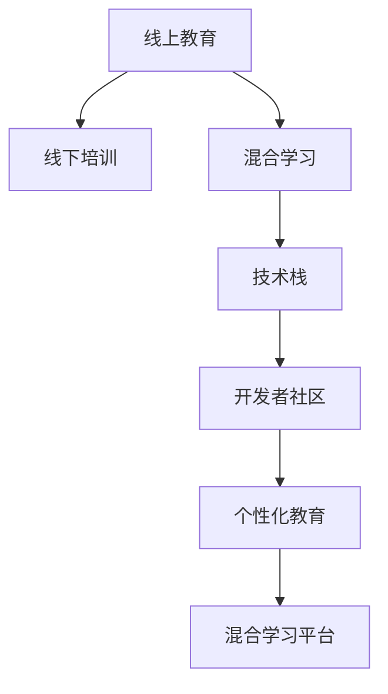

                 

# 程序员知识付费：打造线上线下融合课程

> 关键词：知识付费、在线教育、线下培训、融合课程、混合学习、技术栈、开发者社区、个性化教育

## 1. 背景介绍

随着互联网和技术的不断发展，程序员的学习方式也在不断变化。传统的线下培训和课堂教学方式，由于时间和空间上的限制，已无法满足现代程序员的学习需求。同时，知识付费的概念逐渐普及，越来越多的程序员开始愿意为高质内容付费。

为了适应这种变化，并抓住知识付费的市场机遇，许多教育机构和平台开始探索线上线下融合的课程模式。这种模式结合了线上课程的灵活性和线下培训的深度互动，不仅能够满足程序员个性化、灵活化的学习需求，还能帮助学员构建更全面的技术栈，提升综合能力。

本文将从背景、核心概念、算法原理、实践步骤、应用场景等方面，探讨如何打造线上线下融合课程，帮助程序员全面提升自身技能，实现知识付费的市场化运作。

## 2. 核心概念与联系

### 2.1 核心概念概述

为了更好地理解线上线下融合课程的构建过程，我们首先来介绍几个核心概念：

- **线上教育**：指通过互联网平台进行的学习方式，如MOOC（大规模开放在线课程）、SPOC（小规模私有在线课程）等，具有时间灵活、覆盖面广的特点。

- **线下培训**：指在实体空间内，由专业讲师面对面的授课方式，具有深度互动、即时反馈的优点。

- **混合学习(Mixed Learning)**：结合线上教育和线下培训的优势，灵活安排学习时间和内容，实现学习效率和效果的双提升。

- **技术栈**：指一个开发者需要掌握的全部编程语言、框架、工具等，涵盖前端、后端、数据库、运维等多个领域。

- **开发者社区**：指由开发者组成的交流平台，用于分享知识、交流经验、合作开发等。

- **个性化教育**：根据学员的需求、兴趣、能力等，定制个性化的学习计划和内容，提供更加贴合的个性化教育服务。

- **混合学习平台**：支持线上线下融合的教学平台，能够提供灵活的课程安排和丰富的学习资源。

这些核心概念之间的联系，通过以下Mermaid流程图来展示：



这个流程图展示了不同概念之间的逻辑关系：

1. 线上教育与线下培训结合，形成混合学习。
2. 混合学习帮助学员掌握技术栈，提升能力。
3. 技术栈和开发者社区紧密联系，促进技术交流和合作。
4. 个性化教育为混合学习提供定制化支持。
5. 混合学习平台是实现上述所有模式的载体。

## 3. 核心算法原理 & 具体操作步骤

### 3.1 算法原理概述

线上线下融合课程的构建，本质上是一个将在线教育资源与线下培训深度结合的过程。其核心思想是通过灵活的课程设计，结合线上和线下的优势，提供高质量的教育体验。

具体而言，我们可将课程设计分为三个阶段：

- **线上预习**：学员通过线上平台自主学习基础知识和相关资料。
- **线下实战**：学员参加线下培训班，在专业讲师的指导下进行实战练习，解决实际问题。
- **线上复习与进阶**：学员利用线上平台进行复习，学习高级知识，拓展技术栈。

这种模式结合了线上课程的灵活性和线下培训的深度互动，能够最大限度地提升学习效率和效果。

### 3.2 算法步骤详解

基于上述理论，下面我们详细介绍线上线下融合课程的具体实现步骤：

**Step 1: 设计课程体系**

1. **需求分析**：调研目标学员的技术水平、兴趣方向和需求，制定初步的课程体系。
2. **内容划分**：将课程内容划分为线上预习、线下实战、线上复习与进阶三个阶段，每个阶段设计不同的学习目标和任务。
3. **资源整合**：整合线上和线下资源，包括在线视频、文档、实战项目、代码库等，确保教学内容全面且实用。

**Step 2: 开发线上平台**

1. **界面设计**：设计直观易用的界面，提供课程浏览、学习进度追踪、在线讨论等功能。
2. **功能开发**：实现在线视频播放、课程问答、作业提交、进度统计等核心功能。
3. **技术栈选择**：选择合适的技术栈，如使用Django、Flask等框架搭建后端，使用Vue、React等框架开发前端。

**Step 3: 组织线下培训**

1. **讲师选择**：选择具有丰富实践经验和教学能力的讲师，设计课程大纲和讲义。
2. **场地安排**：选择合适的培训场地，配备必要的硬件设施，如投影仪、实验环境等。
3. **互动设计**：设计互动环节，如小组讨论、代码调试、实战练习等，提升学习效果。

**Step 4: 整合线上线下内容**

1. **内容同步**：将线上课程与线下培训的内容进行同步，确保学员在各个阶段都能学到连贯的知识。
2. **资源共享**：在线上平台提供线下培训的课程资料和实战项目，方便学员自主学习和复习。
3. **进度跟踪**：在线上平台记录学员的学习进度，并与线下培训的进度同步，提供个性化的学习建议。

**Step 5: 评估与反馈**

1. **学习评估**：设计评估机制，如在线测验、项目评审等，评估学员的学习成果。
2. **反馈收集**：收集学员的反馈意见，不断优化课程内容和教学方法。
3. **持续改进**：根据反馈持续改进课程设计，提升教育质量。

### 3.3 算法优缺点

线上线下融合课程具有以下优点：

1. **灵活性高**：线上预习和复习灵活安排，学员可以根据自己的时间安排学习进度。
2. **交互性强**：线下实战环节通过面对面的互动，加深理解，解决实际问题。
3. **资源丰富**：整合线上和线下资源，提供全面的学习支持。
4. **可扩展性强**：课程体系可以根据市场和技术变化灵活调整，持续更新。

同时，该方法也存在以下缺点：

1. **前期投入大**：课程设计、平台开发和场地安排都需要较高的初期投入。
2. **讲师要求高**：讲师需要具备丰富的实践经验和教学能力，否则难以达到预期效果。
3. **学员自律性要求高**：线上预习和复习需要较强的自律性，学员可能会因缺乏监督而半途而废。

尽管存在这些局限性，但通过合理的课程设计和资源整合，线上线下融合课程仍能提供高质量的教育体验，成为知识付费市场的重要组成部分。

### 3.4 算法应用领域

线上线下融合课程在多个领域得到了广泛应用，例如：

- **软件开发**：结合编程语言、框架、数据库等，帮助开发者掌握全面的技术栈。
- **数据科学**：涵盖数据清洗、数据分析、机器学习等，提供系统化的学习路径。
- **人工智能**：涵盖深度学习、自然语言处理、计算机视觉等，提供实战项目和案例分析。
- **产品经理**：涵盖市场分析、产品设计、用户体验等，提供综合化的项目管理知识。
- **硬件开发**：涵盖嵌入式、物联网、电子设计等，提供系统化的硬件开发训练。

除了上述这些常见领域，线上线下融合课程也被创新性地应用到更多场景中，如设计、音乐、美术等创意行业，为各行业的知识传播和技术进步提供了新的动力。

## 4. 数学模型和公式 & 详细讲解 & 举例说明

### 4.1 数学模型构建

为了更好地理解线上线下融合课程的数学模型，我们将其抽象为一个混合学习系统。假设该系统由以下组件组成：

- **学员**：表示为节点 $E$，具有学习能力和知识水平。
- **线上平台**：表示为节点 $O$，提供课程资源和学习工具。
- **线下培训**：表示为节点 $L$，提供实战练习和互动环节。
- **技术栈**：表示为节点 $T$，表示学员掌握的所有技能。
- **评估机制**：表示为节点 $A$，用于评估学员的学习效果。

系统通过以下方式运行：

- **学员**在**线上平台**上预习基础知识和相关资料，并将掌握的知识存储到**技术栈**中。
- **学员**参加**线下培训**，通过实战练习和互动环节，进一步提升技能并验证学习效果。
- **评估机制**根据**学员**的学习成果和反馈，调整**线上平台**和**线下培训**的内容和进度。

### 4.2 公式推导过程

下面，我们将通过一个简单的数学模型来描述这种混合学习系统的运行过程。

设 $E_t$ 表示在第 $t$ 次学习后，学员掌握的知识点总数。初始时 $E_0=0$，每次学习后，学员在**线上平台**和**线下培训**中的学习效果分别为 $O_t$ 和 $L_t$。则第 $t$ 次学习后，学员掌握的知识点总数为：

$$
E_t = E_{t-1} + O_t + L_t
$$

同时，每次学习后，**评估机制**会根据学员的表现，调整下一次学习的难度和深度。设 $A_t$ 表示第 $t$ 次学习后，评估机制对学习效果进行评估的得分，初始时 $A_0=0$，每次评估后，根据得分调整下一次学习的难度和深度，满足：

$$
A_t = f(E_t)
$$

其中 $f$ 为评估函数，通常是一个递增函数，表示学习效果越好，评估得分越高。

### 4.3 案例分析与讲解

为了更直观地理解上述模型，我们以软件开发为例进行案例分析。

假设有一门面向Web开发的混合学习课程，分为线上预习、线下实战和线上复习与进阶三个阶段。

**线上预习阶段**：学员通过在线视频学习HTML、CSS、JavaScript等基础知识，每次学习后，评估机制根据学员的答题正确率和项目提交质量，给出评估得分 $A_1$。

**线下实战阶段**：学员参加线下培训班，通过实战练习，解决实际问题，每次学习后，评估机制根据学员的项目代码质量、代码效率、代码风格等，给出评估得分 $A_2$。

**线上复习与进阶阶段**：学员利用在线平台复习高级知识，学习框架如React、Vue等，每次学习后，评估机制根据学员的在线测验成绩和项目评审反馈，给出评估得分 $A_3$。

最终，混合学习系统会根据 $A_1+A_2+A_3$ 的值，决定下一次学习的难度和深度，确保学员能够在合适的学习进度下，掌握全面的技术栈。

## 5. 项目实践：代码实例和详细解释说明

### 5.1 开发环境搭建

在进行课程开发前，我们需要准备好开发环境。以下是使用Python进行Django开发的环境配置流程：

1. 安装Anaconda：从官网下载并安装Anaconda，用于创建独立的Python环境。

2. 创建并激活虚拟环境：
```bash
conda create -n course-env python=3.8 
conda activate course-env
```

3. 安装Django：
```bash
pip install django
```

4. 安装相关依赖：
```bash
pip install markdown django-guardian markdown-it-tox tinymce django-crispy-forms django-mptt
```

完成上述步骤后，即可在`course-env`环境中开始课程开发。

### 5.2 源代码详细实现

下面我们以一个简单的课程开发项目为例，给出Django开发线上课程的完整代码实现。

首先，创建Django项目和应用：

```bash
django-admin startproject course-system
cd course-system
python manage.py startapp course
```

然后，定义课程和学员模型：

```python
from django.db import models
from django.contrib.auth.models import User

class Course(models.Model):
    title = models.CharField(max_length=200)
    description = models.TextField()
    start_date = models.DateField()
    end_date = models.DateField()

class Student(models.Model):
    user = models.OneToOneField(User, on_delete=models.CASCADE)
    courses = models.ManyToManyField(Course)
    completed_courses = models.ManyToManyField(Course, related_name='completed_students')
```

接着，定义视图和模板：

```python
from django.shortcuts import render
from django.http import HttpResponse

def course_list(request):
    courses = Course.objects.all()
    return render(request, 'course/list.html', {'courses': courses})

def course_detail(request, course_id):
    course = Course.objects.get(id=course_id)
    return render(request, 'course/detail.html', {'course': course})
```

最后，创建前端模板并设计页面：

```html
<!-- course/list.html -->


    <h1>All Courses</h1>
    <ul>
        
            <li><a href="">{{ course.title }}</a></li>
        
    </ul>

```

```html
<!-- course/detail.html -->


    <h1>{{ course.title }}</h1>
    <p>{{ course.description }}</p>
    <p>Start Date: {{ course.start_date }}</p>
    <p>End Date: {{ course.end_date }}</p>

```

然后，启动项目并访问页面：

```bash
python manage.py runserver
```

在浏览器中访问 `http://127.0.0.1:8000/courses/`，即可看到课程列表页面。

### 5.3 代码解读与分析

让我们再详细解读一下关键代码的实现细节：

**Course和Student模型**：
- `Course` 模型定义了课程的基本属性，如标题、描述、开始和结束日期。
- `Student` 模型定义了学员的基本属性，如与用户的关联关系，以及已完成的课程和未完成的课程。

**course_list和course_detail视图**：
- `course_list` 视图获取所有课程，并渲染课程列表模板。
- `course_detail` 视图获取指定课程的详细信息，并渲染课程详情模板。

**课程模板设计**：
- `course/list.html` 模板定义了课程列表页面的布局，通过循环遍历课程列表，生成课程链接。
- `course/detail.html` 模板定义了课程详情页面的布局，通过模板继承和数据渲染，展示了课程的标题、描述和日期信息。

通过这个简单的Django项目，我们可以看到线上课程开发的基本流程和框架。开发者可以基于此构建更复杂的功能，如用户登录、课程注册、作业提交、课程评论等。

## 6. 实际应用场景

### 6.1 软件开发

软件开发领域的线上线下融合课程，可以帮助开发者全面掌握技术栈。例如，可以设计以下课程体系：

1. **基础入门**：涵盖编程基础、数据结构、算法等基础知识，提供在线视频和文档。
2. **实战练习**：通过线下培训班，提供实战项目和代码调试，提升实践能力。
3. **高级进阶**：通过在线平台，提供高级知识和技术栈扩展，如框架如React、Vue等，提供在线测验和项目评审。

这种模式能够帮助开发者在短时间内，全面掌握编程技能，提高工作效率和质量。

### 6.2 数据科学

数据科学领域的线上线下融合课程，可以系统化地教授数据清洗、数据分析和机器学习等知识。例如，可以设计以下课程体系：

1. **基础入门**：涵盖统计学基础、Python编程、Pandas库等基础知识，提供在线视频和文档。
2. **实战练习**：通过线下培训班，提供实际项目和数据集，提升实践能力。
3. **高级进阶**：通过在线平台，提供高级知识和技术栈扩展，如TensorFlow、Scikit-learn等，提供在线测验和项目评审。

这种模式能够帮助数据科学家在短时间内，掌握全面的数据分析和机器学习技能，提升研究水平。

### 6.3 人工智能

人工智能领域的线上线下融合课程，可以系统化地教授深度学习、自然语言处理、计算机视觉等知识。例如，可以设计以下课程体系：

1. **基础入门**：涵盖Python编程、深度学习基础、TensorFlow库等基础知识，提供在线视频和文档。
2. **实战练习**：通过线下培训班，提供实际项目和数据集，提升实践能力。
3. **高级进阶**：通过在线平台，提供高级知识和技术栈扩展，如自然语言处理、计算机视觉等，提供在线测验和项目评审。

这种模式能够帮助AI工程师在短时间内，掌握全面的AI技能，提升研究水平和实践能力。

## 7. 工具和资源推荐

### 7.1 学习资源推荐

为了帮助开发者系统掌握线上线下融合课程的构建过程，这里推荐一些优质的学习资源：

1. **《Django实战》系列书籍**：深入浅出地介绍了Django的各项功能和技术，是Django开发的好帮手。
2. **MOOC在线课程**：如Coursera、edX、Udacity等平台上的在线课程，涵盖从基础到高级的各类技术栈。
3. **Kaggle竞赛**：通过参与数据科学和机器学习竞赛，提升实战能力和解决实际问题的能力。
4. **GitHub代码库**：包含大量的开源项目和代码库，可以帮助开发者学习他人代码，提升开发效率。
5. **Stack Overflow社区**：一个问答社区，开发者可以提问、解答各类编程问题，促进技术交流。

通过对这些资源的学习实践，相信你一定能够快速掌握线上线下融合课程的构建方法，并用于解决实际的开发问题。

### 7.2 开发工具推荐

高效的开发离不开优秀的工具支持。以下是几款用于线上线下融合课程开发的常用工具：

1. **Django框架**：一个高性能的Python web框架，适合快速迭代研究。
2. **Markdown格式**：一种轻量级文本格式，适合编写文档和课程内容。
3. **Git版本控制**：一个版本控制工具，支持多人协作开发，保持代码版本同步。
4. **Jupyter Notebook**：一个交互式开发环境，适合编写代码和数据分析。
5. **Docker容器化**：一个轻量级容器技术，支持开发环境快速部署和迁移。

合理利用这些工具，可以显著提升线上线下融合课程的开发效率，加快创新迭代的步伐。

### 7.3 相关论文推荐

线上线下融合课程的发展得益于学界的持续研究。以下是几篇奠基性的相关论文，推荐阅读：

1. **《深度学习与Python实战》**：介绍了深度学习和Python的实际应用，是实践Django项目的好参考。
2. **《混合学习：理论、实践与应用》**：介绍了混合学习系统的理论基础和实践方法，适合研究混合学习模式。
3. **《混合学习在在线教育中的应用》**：讨论了混合学习在在线教育中的应用案例和效果，适合了解混合学习的实际应用。
4. **《知识付费市场的发展前景与挑战》**：分析了知识付费市场的现状和发展趋势，适合了解知识付费的商业应用。

这些论文代表了大语言模型微调技术的发展脉络。通过学习这些前沿成果，可以帮助研究者把握学科前进方向，激发更多的创新灵感。

## 8. 总结：未来发展趋势与挑战

### 8.1 总结

本文对线上线下融合课程进行了全面系统的介绍。首先阐述了知识付费的市场机遇和线上线下融合课程的构建背景，明确了课程设计、平台开发和教学方法的核心要素。其次，从理论到实践，详细讲解了混合学习系统的运行机制，给出了具体的课程设计流程和开发实现。同时，本文还广泛探讨了课程在软件开发、数据科学、人工智能等领域的实际应用，展示了混合学习模式的市场潜力和价值。

通过本文的系统梳理，可以看到，线上线下融合课程正在成为知识付费市场的重要组成部分，极大地提升了程序员的学习效率和效果。未来，伴随技术栈和教育资源的不断丰富，线上线下融合课程必将在更多领域得到应用，为各行业带来新的教育模式和价值。

### 8.2 未来发展趋势

展望未来，线上线下融合课程将呈现以下几个发展趋势：

1. **技术栈多样化**：随着技术的发展，课程将涵盖更多技术栈和应用场景，如前端、后端、全栈开发等。
2. **课程内容精细化**：根据学员的需求，设计更加精细化的课程内容，提供更贴合实际的应用案例。
3. **在线平台智能化**：利用人工智能技术，提供个性化的学习建议和评估，提升学习效果。
4. **资源共享社区化**：构建开发者社区，共享课程资源和学习经验，促进技术交流和合作。
5. **教学方法多元化**：结合线上线下多种教学方法，如视频、直播、小组讨论等，提升教学效果。

这些趋势凸显了线上线下融合课程的广阔前景。通过不断探索和优化，混合学习模式必将在更多领域得到应用，为技术传播和人才培养提供新的路径。

### 8.3 面临的挑战

尽管线上线下融合课程已经取得了瞩目成就，但在迈向更加智能化、普适化应用的过程中，它仍面临着诸多挑战：

1. **成本高**：课程设计、平台开发和教学实施需要较高的初期投入，特别是在硬件和场地方面。
2. **质量参差不齐**：不同讲师和课程的质量差异较大，难以保证教学效果的一致性。
3. **学员自律性要求高**：线上预习和复习需要较强的自律性，学员可能会因缺乏监督而半途而废。
4. **技术栈更新快**：技术栈快速更新，课程内容需要不断调整和更新，以保持时效性。
5. **学员反馈收集难**：学员反馈机制的设计和实施需要时间和精力，难以全面覆盖所有学员的需求。

尽管存在这些挑战，但通过合理的课程设计和资源整合，线上线下融合课程仍能提供高质量的教育体验，成为知识付费市场的重要组成部分。

### 8.4 研究展望

面对线上线下融合课程所面临的挑战，未来的研究需要在以下几个方面寻求新的突破：

1. **课程内容自动化生成**：利用自然语言处理和机器学习技术，自动化生成课程内容，提升内容的丰富度和多样性。
2. **教学质量控制**：设计统一的课程标准和评估体系，确保教学质量的稳定性和一致性。
3. **学员管理智能化**：利用人工智能技术，实现学员的智能化管理，提升教学互动和反馈效率。
4. **在线平台数据化**：通过数据分析和机器学习，优化课程设计和资源配置，提升学习效果。
5. **社区化建设**：构建开发者社区，提供交流平台，促进技术交流和合作。

这些研究方向的探索，必将引领线上线下融合课程走向更高的台阶，为技术传播和人才培养提供新的动力。面向未来，线上线下融合课程需要在技术栈、课程内容、教学方法和社区建设等多个维度进行全面优化，才能真正实现高质量、高效率的教育体验。总之，线上线下融合课程需要开发者不断探索和优化，方能满足学员的学习需求，提供更加贴合实际的应用支持。

## 9. 附录：常见问题与解答

**Q1：线上线下融合课程与传统线下课程有何不同？**

A: 线上线下融合课程结合了线上课程的灵活性和线下培训的深度互动，能够最大限度地提升学习效率和效果。相较于传统线下课程，它具有以下优点：
1. **灵活性高**：学员可以根据自己的时间安排学习进度，不受时间地点的限制。
2. **资源丰富**：整合线上和线下资源，提供全面的学习支持。
3. **互动性强**：通过实时互动环节，提升学习效果。

**Q2：如何设计在线课程内容？**

A: 在线课程内容的设计需要考虑以下因素：
1. **学员需求**：调研目标学员的技术水平、兴趣方向和需求，制定初步的课程体系。
2. **内容划分**：将课程内容划分为多个阶段，每个阶段设计不同的学习目标和任务。
3. **资源整合**：整合线上和线下资源，包括在线视频、文档、实战项目、代码库等，确保教学内容全面且实用。
4. **评估机制**：设计评估机制，如在线测验、项目评审等，评估学员的学习成果。

**Q3：如何提高学员的学习效果？**

A: 提高学员的学习效果需要从多个方面入手：
1. **教学方法多样化**：结合线上线下多种教学方法，如视频、直播、小组讨论等，提升教学效果。
2. **互动环节设计**：设计互动环节，如小组讨论、代码调试、实战练习等，提升学习效果。
3. **个性化学习**：根据学员的需求，设计个性化的学习计划和内容，提供更贴合实际的应用案例。
4. **社区化建设**：构建开发者社区，提供交流平台，促进技术交流和合作。

**Q4：如何设计线下实战环节？**

A: 线下实战环节的设计需要考虑以下因素：
1. **场景设计**：设计逼真的应用场景，提供真实的项目需求和数据集。
2. **实战练习**：通过实战练习，提升学员的实践能力。
3. **导师指导**：提供专业的导师指导，解决学员在实战过程中遇到的问题。
4. **项目评审**：对学员的项目进行评审，提供反馈和改进建议。

**Q5：如何设计在线测验和项目评审？**

A: 在线测验和项目评审的设计需要考虑以下因素：
1. **评估标准**：制定统一的评估标准和评估指标，确保评估结果的客观性和公正性。
2. **反馈机制**：设计详细的反馈机制，及时反馈评估结果和改进建议。
3. **自动化评估**：利用自动化工具，如Python脚本、Jupyter Notebook等，提升评估效率。
4. **人工评审**：结合自动化评估和人工评审，全面评估学员的学习成果。

通过这些设计，可以全面提升学员的学习效果，确保课程的实用性和有效性。

---

作者：禅与计算机程序设计艺术 / Zen and the Art of Computer Programming

