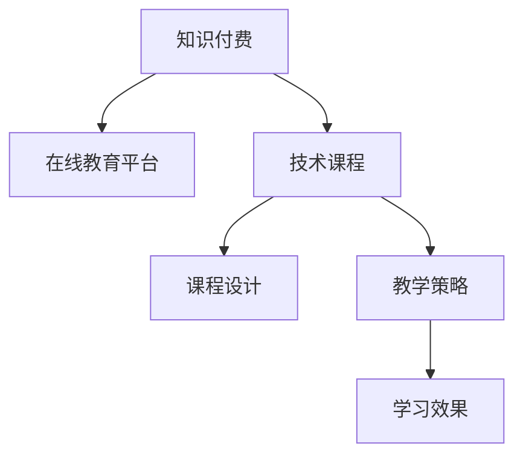

                 

# 程序员知识付费：打造高端课程

> 关键词：知识付费, 在线教育, 技术课程, 用户需求, 课程设计, 教学策略, 学习效果

## 1. 背景介绍

### 1.1 问题由来

在信息爆炸和知识更新加速的今天，技术领域的专业知识和技能更新周期不断缩短。传统的教学模式难以满足快速变化的学习需求。在线教育平台凭借其灵活性和便捷性，逐渐成为技术学习的重要渠道。与此同时，知识付费作为新兴的商业模式，在技术领域呈现出蓬勃发展的趋势。通过付费获取高质量课程，用户能更专注地学习新技术、掌握新方法，加速个人成长和职业发展。

### 1.2 问题核心关键点

知识付费的核心在于优质课程的提供。课程不仅需要覆盖广泛的知识点，更要满足用户的学习需求，提供实用的技巧和方法，以帮助学员在实际工作中应用所学知识。课程设计需考虑内容深度、知识结构、教学策略等因素，确保用户能高效、系统地掌握技术要点，并在工作中实现知识的有效转化。

### 1.3 问题研究意义

打造高端技术课程对于提升在线教育质量、推动技术知识传播具有重要意义：

1. **提高教育质量**：高质量的课程能显著提升用户的学习效果，帮助其解决实际问题，提高工作效率。
2. **优化知识传播**：通过付费机制，筛选出真正有价值的内容，避免劣质内容泛滥，优化知识传播效率。
3. **驱动产业升级**：高端课程的推出，不仅满足学员个人成长的需求，也推动了企业培训的普及，加速技术应用和产业升级。
4. **创造经济价值**：知识付费模式能帮助课程开发者获得更稳定的收入，促进在线教育产业的健康发展。

## 2. 核心概念与联系

### 2.1 核心概念概述

为更好地理解知识付费与高端课程的打造，本节将介绍几个密切相关的核心概念：

- **知识付费**：用户通过付费获取高质量内容的学习模式。知识付费强调内容价值，重视知识的实用性和应用性。
- **在线教育平台**：基于互联网的教育平台，通过视频、文字、互动等形式进行教学。
- **技术课程**：面向技术开发、工程实践的课程，涵盖编程语言、框架技术、工具使用等。
- **课程设计**：对课程内容、结构、形式等进行规划和设计，确保课程系统的完整性和学习效率。
- **教学策略**：在课程实施过程中采用的方法和技巧，如互动式教学、案例分析等，以提升学习效果。
- **学习效果**：用户通过课程学习，所获得的知识掌握度和实际应用能力。

这些概念之间的逻辑关系可以通过以下Mermaid流程图来展示：



这个流程图展示了几者的相互关系：知识付费模式为在线教育平台提供经济保障，技术课程是知识付费的核心产品，课程设计和教学策略是确保课程高质量的关键，而学习效果则是知识付费的最终目标。

## 3. 核心算法原理 & 具体操作步骤
### 3.1 算法原理概述

打造高端课程，本质上是一个以用户需求为导向的教育产品设计与优化过程。其核心思想是：通过深入分析目标用户的学习需求和行为特征，设计高质量的课程内容，采用科学合理的教学策略，优化学习路径和反馈机制，最终提升学习效果。

形式化地，假设目标用户集合为 $U$，课程内容集合为 $C$，教学策略集合为 $S$，则课程优化目标可以表示为：

$$
\max_{C, S} \sum_{u \in U} \left[ \mathbb{E}[f_u(C, S)] - c_u \right]
$$

其中，$f_u(C, S)$ 表示用户 $u$ 在课程 $C$ 和策略 $S$ 下的学习效果，$c_u$ 表示课程对用户 $u$ 的付费意愿。

### 3.2 算法步骤详解

基于用户需求的课程打造一般包括以下几个关键步骤：

**Step 1: 需求分析与用户画像构建**

- 调研目标用户的需求和痛点，通过问卷调查、访谈等方式收集数据。
- 分析用户画像，找出共性和差异，确定课程设计的核心目标。
- 划分用户群体，设计不同层次的课程内容，满足不同用户的需求。

**Step 2: 课程内容设计**

- 选择符合用户需求的课程主题，如编程语言、框架技术、算法实现等。
- 设计课程大纲，确定各章节的知识点和技能点。
- 引入案例分析和项目实践，增强课程的实用性和吸引力。

**Step 3: 教学策略规划**

- 确定教学方式，如视频讲解、互动问答、项目实战等。
- 设计互动环节，如课程讨论、作业提交、在线答疑等，增强用户参与感。
- 引入学习路径和反馈机制，根据用户的学习进度和效果，实时调整课程难度和内容。

**Step 4: 课程实施与评估**

- 制作课程视频、PPT、习题等教学材料，提供学习支持。
- 根据用户反馈，不断优化课程内容和教学策略，提升学习效果。
- 定期进行课程效果评估，收集用户满意度数据，优化课程质量。

**Step 5: 用户学习跟踪与支持**

- 使用学习管理系统(LMS)跟踪用户学习进度，提供个性化推荐。
- 建立技术支持团队，解答用户在学习过程中遇到的问题。
- 定期推送更新内容，保持课程的时效性和实用性。

### 3.3 算法优缺点

打造高端课程的优势在于：

- **针对性**：通过需求分析，精准定位用户需求，设计有针对性的课程内容。
- **实用性**：结合案例分析、项目实践等环节，增强课程的实用性和可操作性。
- **互动性**：通过互动问答、在线讨论等环节，提升用户参与感和学习效果。
- **灵活性**：根据用户反馈不断优化课程，确保课程的时效性和实用性。

同时，该方法也存在一定的局限性：

- **开发成本高**：高质量课程的制作需要大量的时间和资源投入，开发成本较高。
- **内容更新难度大**：随着技术的发展，课程内容需要不断更新，以保持时效性，更新难度较大。
- **用户留存率有待提升**：用户在学习过程中遇到问题，容易产生挫败感，如何提高用户留存率，还需要更多策略和技巧。

尽管存在这些局限性，但就目前而言，结合用户需求的课程打造仍然是打造高质量在线教育产品的重要方法。未来相关研究的重点在于如何进一步降低课程开发成本，提高内容的更新效率，同时兼顾用户留存率和参与度。

### 3.4 算法应用领域

高端课程的应用领域非常广泛，以下是几个典型的应用场景：

- **软件开发**：面向程序员的课程，涵盖编程语言、框架技术、算法优化等，帮助开发人员提升技能，提高开发效率。
- **数据科学**：面向数据分析师和数据科学家的课程，涵盖数据处理、机器学习、深度学习等，帮助其掌握大数据技术，进行高效的数据分析和挖掘。
- **人工智能**：面向人工智能工程师的课程，涵盖算法实现、模型训练、应用实践等，帮助其掌握AI核心技术，进行智能应用开发。
- **系统架构**：面向系统架构师的课程，涵盖系统设计、架构优化、云计算等，帮助其设计高效、可扩展的系统架构，提高系统性能。
- **项目管理**：面向项目经理的课程，涵盖敏捷开发、项目管理、团队协作等，帮助其提升项目管理能力，提高项目成功率。

除了上述这些常见场景，高端课程还可以拓展到更多领域，如金融工程、医疗健康、教育培训等，为各行各业提供高质量的知识服务和专业支持。

## 4. 数学模型和公式 & 详细讲解  
### 4.1 数学模型构建

本节将使用数学语言对基于用户需求的课程设计过程进行更加严格的刻画。

记目标用户集合为 $U$，课程内容集合为 $C$，教学策略集合为 $S$，用户需求集合为 $D$。假设每个用户 $u \in U$ 对于课程内容 $c \in C$ 和策略 $s \in S$ 的需求函数为 $f_u(c, s)$，课程内容开发成本为 $c_c$，课程制作成本为 $c_s$，则课程优化目标可以表示为：

$$
\max_{C, S} \sum_{u \in U} \left[ \mathbb{E}[f_u(C, S)] - c_u \right]
$$

其中，$\mathbb{E}[f_u(C, S)]$ 表示用户 $u$ 在课程 $C$ 和策略 $S$ 下的期望学习效果，$c_u$ 表示课程对用户 $u$ 的付费意愿。

### 4.2 公式推导过程

以下我们以软件开发课程为例，推导用户需求函数和课程效果评估公式。

假设用户 $u$ 对于课程内容 $c$ 和策略 $s$ 的需求函数为：

$$
f_u(c, s) = \alpha \cdot \text{Efficiency}_u + \beta \cdot \text{Ease of Use}_u + \gamma \cdot \text{Practicality}_u
$$

其中，$\alpha$、$\beta$、$\gamma$ 分别表示效率、易用性和实用性在用户需求中的权重。

假设用户 $u$ 对课程的付费意愿 $c_u$ 为：

$$
c_u = \delta \cdot \text{Quality}_u + \epsilon \cdot \text{Brand Reputation}_u
$$

其中，$\delta$、$\epsilon$ 分别表示课程质量和品牌声誉对用户付费意愿的影响。

综合上述公式，课程优化目标可以表示为：

$$
\max_{C, S} \sum_{u \in U} \left[ \alpha \cdot \text{Efficiency}_u + \beta \cdot \text{Ease of Use}_u + \gamma \cdot \text{Practicality}_u - \delta \cdot \text{Quality}_u - \epsilon \cdot \text{Brand Reputation}_u \right]
$$

### 4.3 案例分析与讲解

假设目标用户为中高级软件开发人员，课程内容为 "Python高级编程"，教学策略包括视频讲解、案例分析、项目实践等。根据用户需求分析，设计课程大纲如下：

| 章节名称 | 知识点 | 技能点 | 实践项目 |
| -------- | ------ | ------ | -------- |
| 引言      | Python 基础 | 基本语法 | 简单项目 |
| 面向对象   | 类与对象 | 封装、继承 | 设计模式 |
| 数据结构  | 列表、字典 | 数据操作 | 算法优化 |
| 并发编程  | 多线程、协程 | 并发处理 | 高并发系统 |
| 网络编程  | 套接字编程 | 网络通信 | 网络爬虫 |
| 单元测试   | 测试框架 | 代码测试 | 自动化测试 |
| 部署与运维 | 容器化、云部署 | 系统部署 | 监控与优化 |

在课程实施过程中，引入互动问答环节，通过在线讨论和实时答疑，提升用户参与感。同时，定期推送课程更新，保持课程的时效性和实用性。通过这些措施，可以显著提升用户的学习效果和满意度。

## 5. 项目实践：代码实例和详细解释说明
### 5.1 开发环境搭建

在进行课程打造实践前，我们需要准备好开发环境。以下是使用Python进行Django开发的环境配置流程：

1. 安装Anaconda：从官网下载并安装Anaconda，用于创建独立的Python环境。

2. 创建并激活虚拟环境：
```bash
conda create -n course-env python=3.8 
conda activate course-env
```

3. 安装Django：从官网获取最新的Django安装包，进行安装。例如：
```bash
pip install django
```

4. 安装Django相关模块：
```bash
pip install django-crispy-forms django-allauth django-axes
```

5. 安装各类工具包：
```bash
pip install django-compressor django-mptt django-anymedia
```

完成上述步骤后，即可在`course-env`环境中开始课程打造实践。

### 5.2 源代码详细实现

下面我们以 "Python高级编程" 课程为例，给出使用Django框架构建课程的PyTorch代码实现。

首先，定义课程相关的模型和视图：

```python
from django.shortcuts import render, redirect
from django.http import HttpResponse, JsonResponse
from django.views.decorators.csrf import csrf_exempt
from .models import Course, Module, Lesson
from .forms import LessonForm

def course_list(request):
    courses = Course.objects.all()
    return render(request, 'course_list.html', {'courses': courses})

def course_detail(request, course_id):
    course = Course.objects.get(id=course_id)
    return render(request, 'course_detail.html', {'course': course})

def lesson_list(request, course_id):
    course = Course.objects.get(id=course_id)
    modules = course.module_set.all()
    return render(request, 'lesson_list.html', {'course': course, 'modules': modules})

def lesson_detail(request, course_id, module_id):
    course = Course.objects.get(id=course_id)
    module = course.module_set.get(id=module_id)
    return render(request, 'lesson_detail.html', {'course': course, 'module': module})

@csrf_exempt
def lesson_create(request, course_id):
    course = Course.objects.get(id=course_id)
    if request.method == 'POST':
        form = LessonForm(request.POST)
        if form.is_valid():
            lesson = form.save(commit=False)
            lesson.course = course
            lesson.save()
            return redirect('lesson_detail', course_id=course_id, module_id=module_id)
    else:
        form = LessonForm()
    return render(request, 'lesson_create.html', {'form': form, 'course': course})

@csrf_exempt
def lesson_update(request, course_id, module_id, lesson_id):
    course = Course.objects.get(id=course_id)
    module = course.module_set.get(id=module_id)
    lesson = module.lesson_set.get(id=lesson_id)
    if request.method == 'POST':
        form = LessonForm(request.POST, instance=lesson)
        if form.is_valid():
            form.save()
            return redirect('lesson_detail', course_id=course_id, module_id=module_id)
    else:
        form = LessonForm(instance=lesson)
    return render(request, 'lesson_update.html', {'form': form, 'course': course, 'module': module})
```

然后，定义课程相关的表单和验证逻辑：

```python
from django import forms
from .models import Course, Module, Lesson

class CourseForm(forms.ModelForm):
    class Meta:
        model = Course
        fields = ['title', 'description', 'price', 'duration', 'instructor']

class ModuleForm(forms.ModelForm):
    class Meta:
        model = Module
        fields = ['title', 'description', 'order', 'course']

class LessonForm(forms.ModelForm):
    class Meta:
        model = Lesson
        fields = ['title', 'content', 'practical_project', 'video_url', 'order', 'module']

    def clean_practical_project(self):
        project = self.cleaned_data['practical_project']
        if not project:
            raise forms.ValidationError('Practical project is required.')
        return project
```

接着，定义课程相关的视图和模板：

```python
from django.shortcuts import render
from django.views.generic import ListView, DetailView, CreateView, UpdateView
from .models import Course, Module, Lesson
from .forms import CourseForm, ModuleForm, LessonForm

class CourseListView(ListView):
    model = Course
    template_name = 'course_list.html'

class CourseDetailView(DetailView):
    model = Course
    template_name = 'course_detail.html'

class ModuleListView(ListView):
    model = Module
    template_name = 'lesson_list.html'
    context_object_name = 'modules'

class ModuleDetailView(DetailView):
    model = Module
    template_name = 'lesson_detail.html'
    context_object_name = 'module'

class LessonCreateView(CreateView):
    model = Lesson
    template_name = 'lesson_create.html'
    form_class = LessonForm
    success_url = 'lesson_detail'

class LessonUpdateView(UpdateView):
    model = Lesson
    template_name = 'lesson_update.html'
    form_class = LessonForm
    success_url = 'lesson_detail'
```

最后，启动Django项目并在浏览器中访问：

```bash
python manage.py runserver
```

在浏览器中访问 `http://127.0.0.1:8000/courses/`，即可看到课程列表页面。通过点击课程链接，可以查看课程详情和课程模块列表。

### 5.3 代码解读与分析

让我们再详细解读一下关键代码的实现细节：

**Course、Module、Lesson模型**：
- `Course` 模型：表示课程，包含课程标题、描述、价格、时长、讲师等属性。
- `Module` 模型：表示课程模块，包含模块标题、描述、顺序、所属课程等属性。
- `Lesson` 模型：表示课程内容，包含内容标题、内容、项目、视频链接、顺序、所属模块等属性。

**CourseForm、ModuleForm、LessonForm表单**：
- `CourseForm` 表单：用于创建和更新课程，包含标题、描述、价格、时长、讲师等字段。
- `ModuleForm` 表单：用于创建和更新模块，包含标题、描述、顺序、所属课程等字段。
- `LessonForm` 表单：用于创建和更新课程内容，包含标题、内容、项目、视频链接、顺序、所属模块等字段。

**CourseListView、CourseDetailView、ModuleListView、ModuleDetailView、LessonCreateView、LessonUpdateView视图**：
- `CourseListView` 视图：显示课程列表，每个课程包含标题、价格、时长等基本信息。
- `CourseDetailView` 视图：显示课程详情，包含课程标题、描述、讲师等详细信息。
- `ModuleListView` 视图：显示模块列表，每个模块包含标题、描述、顺序、所属课程等详细信息。
- `ModuleDetailView` 视图：显示模块详情，包含模块标题、描述、顺序、所属课程等详细信息。
- `LessonCreateView` 视图：用于创建课程内容，支持标题、内容、项目、视频链接等输入。
- `LessonUpdateView` 视图：用于更新课程内容，支持标题、内容、项目、视频链接等编辑。

这些视图和表单的设计，可以满足基本的课程管理和学习需求。开发者可以根据具体业务需求，进一步扩展和优化功能，如用户认证、付费支持、学习进度跟踪等。

## 6. 实际应用场景
### 6.1 软件开发

基于Django构建的在线课程平台，可以广泛应用于软件开发领域。软件开发课程通常涵盖编程语言、框架技术、算法优化等内容，帮助开发者掌握最新技术和工具，提高开发效率。

在课程实施过程中，引入视频讲解、案例分析、项目实践等环节，可以让学员通过实际操作，加深对知识点的理解和掌握。同时，通过在线讨论和实时答疑，提升学员的学习参与感和互动性。

### 6.2 数据科学

在线数据科学课程平台，可以提供数据处理、机器学习、深度学习等领域的知识和技能培训。数据科学课程通常包含数据清洗、特征工程、模型训练等内容，帮助学员掌握数据科学的核心技术和方法。

在课程实施过程中，引入实际数据分析项目，通过数据集和分析任务，让学员在实践中学习和提升。同时，通过在线讨论和项目反馈，提升学员的学习效果和满意度。

### 6.3 人工智能

在线人工智能课程平台，可以提供算法实现、模型训练、应用实践等领域的知识和技能培训。人工智能课程通常包含算法优化、模型选择、系统设计等内容，帮助学员掌握AI核心技术。

在课程实施过程中，引入案例分析和项目实践，通过实际项目和任务，让学员在实践中学习和提升。同时，通过在线讨论和项目反馈，提升学员的学习效果和满意度。

### 6.4 未来应用展望

随着在线教育的普及和知识付费的兴起，基于Django构建的在线课程平台将在更多领域得到应用，为各行各业提供高质量的知识服务和专业支持。

在智慧医疗领域，在线医学课程平台可以为医学生和医生提供系统化的医学知识和技能培训，提升医疗服务质量。

在智能制造领域，在线工业工程课程平台可以为工程师提供系统化的工程知识和技能培训，提升制造业自动化和智能化水平。

在教育培训领域，在线教育平台可以为各类教育机构提供优质的教育资源，提升教育质量和学习效果。

此外，在金融、法律、人力资源等众多领域，基于Django构建的在线课程平台也将不断涌现，为各行各业提供高质量的知识服务和专业支持。

## 7. 工具和资源推荐
### 7.1 学习资源推荐

为了帮助开发者系统掌握在线教育平台和课程打造的理论基础和实践技巧，这里推荐一些优质的学习资源：

1. Django官方文档：详细的Django框架文档，提供从入门到精通的指南和示例。

2. Django实战教程：《Django实战教程》一书，详细讲解Django框架的使用和最佳实践，帮助开发者快速上手开发在线教育平台。

3. Coursera、Udacity等在线教育平台：提供各类在线课程，涵盖编程语言、数据科学、人工智能等领域，是学习和提升技术能力的理想场所。

4. 慕课网、网易云课堂等国内教育平台：提供各类中文课程，涵盖软件开发、数据分析、项目管理等领域，是学习和提升技术能力的便捷选择。

5. 《在线教育系统设计与实现》一书：系统讲解在线教育平台的系统设计和实现方法，提供详细的开发指南和示例代码。

通过对这些资源的学习实践，相信你一定能够快速掌握在线教育平台的开发和课程打造的精髓，并用于解决实际的业务问题。

### 7.2 开发工具推荐

高效的开发离不开优秀的工具支持。以下是几款用于在线教育平台和课程打造的常用工具：

1. Django：基于Python的Web框架，提供灵活的开发方式和丰富的插件，适合构建高质量的在线教育平台。

2. Django-Crappy-Forms：用于快速创建表单，提供丰富的表单字段和验证规则。

3. Django-Allauth：用于用户认证和授权，支持OAuth、OpenID等认证方式。

4. Django-Axes：用于IP限制和访问控制，提供灵活的访问控制策略和日志记录功能。

5. Django-Compressor：用于压缩CSS、JavaScript等静态资源，提高页面加载速度。

6. Django-MPTT：用于树形数据结构的处理，支持复杂的树形数据查询和展示。

7. Django-AnyMedia：用于多文件上传和存储，支持多种文件类型和格式。

合理利用这些工具，可以显著提升在线教育平台的开发效率，加快创新迭代的步伐。

### 7.3 相关论文推荐

在线教育平台和课程打造的研究领域非常广泛，以下是几篇奠基性的相关论文，推荐阅读：

1. "A Survey on Online Learning Management Systems"（在线学习管理系统综述）：综述了在线学习管理系统的发展历程和研究现状，是了解在线教育平台基础架构的必读之作。

2. "Designing Effective Online Learning"（设计有效的在线学习）：讨论了在线学习的优点和挑战，提出了一系列有效的教学策略和实践方法。

3. "Learning Analytics for Online Education"（在线教育的教学分析）：探讨了基于学习数据分析的在线教育系统设计，提出了利用学习数据提升教学效果的方法。

4. "Modeling and Predicting Student Learning Outcomes"（建模和预测学生学习效果）：通过数据分析建模，预测学生的学习效果，帮助平台优化教学内容和策略。

5. "The Future of Online Learning"（在线学习的未来）：展望了在线学习的未来发展趋势，讨论了技术进步对在线教育的影响和机遇。

这些论文代表了大语言模型微调技术的演进脉络，通过学习这些前沿成果，可以帮助研究者把握学科前进方向，激发更多的创新灵感。

## 8. 总结：未来发展趋势与挑战
### 8.1 总结

本文对基于用户需求的在线教育平台和课程打造的理论基础和实践技巧进行了全面系统的介绍。首先阐述了在线教育平台和知识付费的发展背景和重要意义，明确了课程设计的核心目标和步骤。其次，从算法原理到具体实现，详细讲解了课程设计的过程和方法，给出了完整的Django代码实现示例。同时，本文还探讨了在线教育平台在实际应用中的场景，展望了未来的发展趋势和挑战。

通过本文的系统梳理，可以看到，基于用户需求的在线教育平台和课程打造，是提升在线教育质量、推动技术知识传播的重要方法。高质量的课程设计，结合科学合理的教学策略，可以显著提升用户的学习效果和满意度。未来，随着技术的发展和应用场景的拓展，在线教育平台将在更多领域得到应用，为各行各业提供高质量的知识服务和专业支持。

### 8.2 未来发展趋势

展望未来，在线教育平台和课程打造的趋势将主要体现在以下几个方面：

1. **个性化学习**：利用AI和大数据分析，实现个性化推荐和课程定制，提升学习效果。
2. **混合学习**：结合线上和线下教学，提供多样化的学习方式，满足不同用户的需求。
3. **移动学习**：通过移动设备提供便捷的学习体验，增强学习的灵活性和便捷性。
4. **虚拟现实**：利用虚拟现实技术，提供沉浸式的学习体验，增强学习效果。
5. **游戏化学习**：通过游戏化设计，提升学习的趣味性和互动性，增强学习动机。

这些趋势将推动在线教育平台的不断创新和优化，为用户带来更加丰富和高效的学习体验。

### 8.3 面临的挑战

尽管在线教育平台和课程打造的趋势积极向上，但在实现过程中也面临诸多挑战：

1. **用户留存率**：用户在学习过程中遇到问题，容易产生挫败感，如何提高用户留存率，还需要更多策略和技巧。
2. **学习效果评估**：如何设计有效的学习效果评估指标，衡量用户的学习进展和效果，还需要更多的研究和实践。
3. **教学资源优化**：如何高效利用教学资源，提升教学质量，还需要更多的优化方法和技术。
4. **隐私和安全**：如何保护用户数据隐私和安全，防止数据泄露和滥用，还需要更多的法律和技术手段。
5. **技术壁垒**：如何降低技术门槛，让更多开发者和教师参与到课程打造中来，还需要更多的工具和平台支持。

尽管存在这些挑战，但通过技术进步和社会各界的共同努力，这些问题终将一一克服，在线教育平台必将在构建人机协同的智能时代中扮演越来越重要的角色。

### 8.4 研究展望

面对在线教育平台和课程打造的诸多挑战，未来的研究需要在以下几个方面寻求新的突破：

1. **个性化学习**：研究基于用户行为的个性化推荐算法，提升课程推荐的精准性和有效性。
2. **混合学习**：研究线上和线下教学的融合机制，探索混合学习模式，提升学习效果。
3. **移动学习**：研究移动设备上的学习应用设计和优化，提升学习的灵活性和便捷性。
4. **虚拟现实**：研究虚拟现实技术在教育中的应用，提升沉浸式学习体验。
5. **游戏化学习**：研究游戏化设计和教学策略，提升学习的趣味性和互动性。

这些研究方向的探索，必将引领在线教育平台的不断创新和优化，为用户提供更加丰富和高效的学习体验。

## 9. 附录：常见问题与解答
**Q1：如何选择合适的课程主题？**

A: 选择合适的课程主题，应基于市场需求和用户痛点。可以通过市场调研、用户访谈等方式，收集数据和反馈，确定课程的核心主题。同时，可以参考已有的成功案例，结合自身特色进行创新。

**Q2：如何设计合理的课程大纲？**

A: 设计合理的课程大纲，应注重知识点和技能点的系统性、连贯性。通常包括引言、基础概念、进阶技巧、实践项目等环节。同时，根据用户的学习进度和效果，及时调整课程难度和内容。

**Q3：如何提高用户学习效果？**

A: 提高用户学习效果，应结合科学合理的教学策略，如视频讲解、案例分析、项目实践等。同时，利用在线讨论和实时答疑，提升用户参与感和互动性。通过学习效果评估和反馈，不断优化课程内容和教学策略。

**Q4：如何提升课程的用户留存率？**

A: 提升课程的用户留存率，应关注用户的实际需求和反馈。通过个性化的课程推荐、实时的学习支持、灵活的学习方式，提升用户的满意度。同时，建立良好的用户沟通渠道，及时解决用户问题，增强用户的粘性。

**Q5：如何设计有效的学习效果评估指标？**

A: 设计有效的学习效果评估指标，应结合用户的学习进度、掌握程度、应用效果等因素。可以通过学习数据分析、在线测试、项目评审等方式，衡量用户的学习效果。同时，根据评估结果，不断优化课程内容和教学策略，提升学习效果。

---

作者：禅与计算机程序设计艺术 / Zen and the Art of Computer Programming

