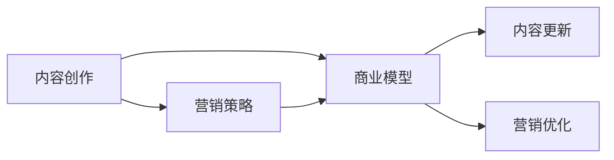

                 

# 程序员转型知识付费创业指南

## 1. 背景介绍

### 1.1 问题由来

随着互联网时代的到来，技术日新月异，程序员面临着不断学习新技能、适应新变化的巨大压力。与此同时，知识付费作为一种新型教育形式，凭借其高效、便捷、内容丰富的特点，在教育市场迅速崛起。作为一名程序员，如何从技术专家转型为知识付费领域的创业者，实现自我价值与商业成功的双重突破？本文将系统梳理知识付费创业的各个关键环节，为有意转型的程序员提供全面且实用的指南。

### 1.2 问题核心关键点

知识付费创业的核心在于内容和营销的有机结合。一方面，内容要具备高价值、实用性和独创性，能够帮助用户解决实际问题或提升工作技能；另一方面，营销要高效精准，让用户能够快速发现并购买到有价值的内容。本文将围绕这两个核心关键点，从内容创作、营销策略、商业模型等多个维度展开详细探讨。

### 1.3 问题研究意义

知识付费创业不仅能帮助程序员实现技术到商业的转型，还能为企业创造巨大的商业价值。通过知识付费，程序员可以将自己的技术经验、项目案例、行业见解等内容变现，提升自身品牌影响力，同时为企业创造可观的收益。

## 2. 核心概念与联系

### 2.1 核心概念概述

要成功进行知识付费创业，首先需要理解几个核心概念：

- **内容创作**：通过撰写文章、制作视频、进行直播等形式，创作高质量、有价值的知识内容，满足用户需求。
- **营销策略**：通过社交媒体、搜索引擎优化、广告投放等手段，将内容精准推荐给目标用户，提升内容的曝光率和转化率。
- **商业模型**：根据业务发展阶段和市场需求，设计合理的收费策略和盈利模式，确保可持续发展。

这些核心概念之间存在着密切的联系：内容是创业的基础，营销是推广的保障，而商业模型则是整个创业的骨架。只有三者协同作用，才能实现知识付费创业的成功。

### 2.2 核心概念原理和架构的 Mermaid 流程图



### 2.3 核心概念联系

内容创作、营销策略和商业模型之间是相互促进的关系。高质量的内容可以吸引更多的用户关注，而有效的营销策略则能进一步扩大内容的影响力，带来更高的收益。同时，合理的商业模型能为内容创作和营销提供资金支持，形成良性循环。

## 3. 核心算法原理 & 具体操作步骤

### 3.1 算法原理概述

知识付费创业的核心在于内容与市场的匹配，实现这种匹配的算法包括但不限于：

- **推荐算法**：根据用户历史行为和偏好，推荐最相关的知识内容。
- **搜索优化算法**：通过搜索引擎优化技术，提升内容在搜索结果中的排名，提高曝光率。
- **定价策略算法**：根据市场需求和竞争情况，设计合理的收费策略，吸引用户购买。

### 3.2 算法步骤详解

1. **内容创作阶段**：
    - 确定目标用户群体，分析用户需求。
    - 选择内容形式，如文章、视频、直播等。
    - 编写脚本，制作内容，确保内容的实用性、权威性和吸引力。

2. **营销策略阶段**：
    - 选择合适的营销渠道，如社交媒体、搜索引擎、付费广告等。
    - 制定营销计划，包括内容发布时间、频率和推广方式。
    - 利用数据分析工具，监控营销效果，调整策略。

3. **商业模型阶段**：
    - 选择合适的商业模式，如订阅制、按需付费、免费+广告等。
    - 设置合理的定价策略，考虑内容价值、用户支付能力等因素。
    - 开发支付和收益管理系统，确保资金流动的顺畅。

### 3.3 算法优缺点

**优点**：
- 内容价值高，能够满足用户需求，提高用户黏性。
- 营销精准，能够高效提升内容的曝光率和转化率。
- 商业模式灵活，可根据市场变化进行调整。

**缺点**：
- 内容创作成本高，需要持续投入时间和精力。
- 市场竞争激烈，需要不断创新和优化营销策略。
- 商业模式设计复杂，需要精细化管理和运营。

### 3.4 算法应用领域

知识付费创业的应用领域非常广泛，涵盖了技术教育、职业技能、生活管理等多个方面。以下是几个典型应用场景：

- **技术教育**：为程序员提供编程技巧、技术栈、框架使用等技术知识。
- **职业技能**：为职场人士提供时间管理、沟通技巧、团队协作等职场技能。
- **生活管理**：为大众提供健康饮食、时间规划、财务管理等生活管理知识。

## 4. 数学模型和公式 & 详细讲解 & 举例说明

### 4.1 数学模型构建

知识付费创业的数学模型可以简化为一个推荐系统模型，其中包括内容评分、用户评分和推荐算法三个部分。具体来说，模型的输入包括用户行为数据和内容属性数据，输出为用户推荐的知识内容。

### 4.2 公式推导过程

设内容集合为 $C$，用户集合为 $U$，每个内容 $c \in C$ 和每个用户 $u \in U$ 都有一个评分 $r_{cu} \in [0,1]$，其中 $r_{cu}=0$ 表示用户对内容不感兴趣，$r_{cu}=1$ 表示用户对内容非常感兴趣。推荐算法 $f$ 的输出为用户 $u$ 对内容 $c$ 的推荐分数 $p_{cu}$。

假设推荐算法 $f$ 满足以下假设：
1. $p_{cu}$ 是一个线性组合，即 $p_{cu} = \sum_{i=1}^n \alpha_i r_{cu_i} + \beta_i c_i$。
2. 用户评分 $r_{cu}$ 可以表示为用户对内容 $c$ 和用户 $u$ 的兴趣程度 $i_u$ 的函数，即 $r_{cu} = f(i_u, c)$。
3. 内容评分 $c_i$ 可以表示为内容的属性特征 $a_i$ 的函数，即 $c_i = f(a_i)$。

由此可以得到推荐算法的最终输出：

$$ p_{cu} = \sum_{i=1}^n \alpha_i f(i_u, c_i) + \beta_i f(a_i) $$

### 4.3 案例分析与讲解

以技术教育内容为例，可以设定用户对不同技术领域的兴趣程度 $i_{u}$，以及内容的难度 $d_c$、实用程度 $u_c$、更新频率 $f_c$ 等属性特征。假设 $i_{u}$ 为 $0$ 到 $1$ 之间的连续值，$d_c$、$u_c$、$f_c$ 也为 $0$ 到 $1$ 之间的连续值。

用户对某门课程的评分 $r_{cu}$ 可以表示为：

$$ r_{cu} = f(i_u, d_c, u_c, f_c) = i_u \cdot d_c \cdot u_c \cdot f_c $$

课程内容的评分 $c_i$ 可以表示为：

$$ c_i = f(a_i) = a_i \cdot (1 - d_i) + (1 - a_i) \cdot (d_i \cdot u_i \cdot f_i) $$

其中 $a_i$ 为课程内容的权威性，$d_i$ 为课程的难度，$u_i$ 为课程的实用性，$f_i$ 为课程的更新频率。

最终，用户对课程的推荐分数 $p_{cu}$ 可以表示为：

$$ p_{cu} = \alpha_1 f(i_u, c_1) + \alpha_2 f(i_u, c_2) + \ldots + \alpha_n f(i_u, c_n) + \beta_1 f(a_1) + \beta_2 f(a_2) + \ldots + \beta_n f(a_n) $$

## 5. 项目实践：代码实例和详细解释说明

### 5.1 开发环境搭建

知识付费创业项目开发需要搭建一个完整的后端服务，包括用户管理、内容发布、推荐系统、支付系统等多个模块。以下是推荐系统的开发环境搭建步骤：

1. **选择后端语言和技术栈**：可以选择 Python、Java、Node.js 等后端语言，以及 Flask、Django、Spring Boot 等框架。
2. **安装依赖库**：安装推荐系统的依赖库，如 TensorFlow、PyTorch、Scikit-Learn 等。
3. **配置数据库**：选择 MySQL、MongoDB 等关系型或非关系型数据库，用于存储用户行为数据和内容属性数据。
4. **配置推荐算法**：选择合适的推荐算法，如协同过滤、基于内容的推荐、混合推荐等，并配置相应的参数。

### 5.2 源代码详细实现

以下是一个基于协同过滤的推荐系统示例代码：

```python
from surprise import Dataset, Reader, SVD
from surprise.model_selection import cross_validate
from surprise.prediction_algorithms import SVD

# 加载数据集
reader = Reader(rating_scale=(1, 5))
data = Dataset.load_from_file('data/u.data', reader=reader)

# 初始化 SVD 算法
algo = SVD()

# 交叉验证
cross_validate(algo, data, measures=['RMSE', 'MAE'], cv=5, verbose=True)

# 训练模型
algo.fit(data.build_full_trainset())

# 测试模型
testset = data.build_full_testset()
predictions = algo.test(testset)
```

### 5.3 代码解读与分析

**代码功能**：
- 使用 Surprise 库加载用户评分数据集。
- 初始化协同过滤算法 SVD。
- 进行交叉验证，评估算法性能。
- 训练模型并测试模型性能。

**代码思路**：
- 加载数据集，定义评分范围为 $1$ 到 $5$。
- 初始化协同过滤算法 SVD，设定训练集和测试集。
- 通过交叉验证评估模型性能，选择 RMSE 和 MAE 作为评价指标。
- 训练模型，使用测试集评估模型效果。

**代码优化**：
- 考虑加入更多的特征工程，如用户属性、内容属性等，提升推荐精度。
- 考虑使用更加复杂的推荐算法，如深度学习算法，提高推荐效果。

### 5.4 运行结果展示

运行上述代码后，可以输出交叉验证的 RMSE 和 MAE 结果，以及模型在测试集上的表现。这些结果可以用来评估推荐系统的性能，并进行进一步的优化。

## 6. 实际应用场景

### 6.1 技术教育平台

技术教育平台可以为程序员提供编程技巧、技术栈、框架使用等技术知识。通过知识付费创业，平台可以整合众多技术大咖的内容资源，形成丰富的课程体系，满足不同层次和技术背景的学习需求。

### 6.2 职业培训平台

职业培训平台可以为职场人士提供时间管理、沟通技巧、团队协作等职场技能培训。通过知识付费创业，平台可以吸引业内专家参与内容创作，提供有针对性的培训课程，帮助用户提升职业竞争力。

### 6.3 生活管理应用

生活管理应用可以为大众提供健康饮食、时间规划、财务管理等生活管理知识。通过知识付费创业，应用可以提供个性化的生活管理建议，帮助用户提高生活质量，实现健康、高效的生活方式。

## 7. 工具和资源推荐

### 7.1 学习资源推荐

以下是一些有用的学习资源，可以帮助程序员转型知识付费创业：

1. **Coursera**：提供各类技术和管理课程，涵盖人工智能、机器学习、数据科学等领域。
2. **edX**：提供多门技术和管理课程，包括计算机科学、商业分析等。
3. **Udemy**：提供各类编程、设计和商业课程，适合快速掌握新技能。
4. **LinkedIn Learning**：提供职场技能培训课程，提升个人职业竞争力。
5. **MindNode**：用于思维导图制作和知识整理，帮助构建内容框架和结构。

### 7.2 开发工具推荐

以下是一些常用的开发工具，可以帮助程序员进行知识付费创业项目开发：

1. **GitHub**：用于版本控制和代码协作，可以方便地管理项目和代码。
2. **JIRA**：用于项目管理和任务追踪，确保项目进度和质量。
3. **Confluence**：用于知识管理和文档编写，帮助团队共享和协作。
4. **Slack**：用于团队沟通和协作，提高工作效率。
5. **Zoom**：用于视频会议和远程协作，确保团队协作顺畅。

### 7.3 相关论文推荐

以下是一些推荐论文，可以帮助程序员深入理解知识付费创业的核心技术：

1. **Recommender Systems Handbook**：详细介绍推荐系统的理论、技术和应用，是推荐系统领域的重要参考书。
2. **Deep Learning for Recommender Systems**：介绍深度学习在推荐系统中的应用，包括协同过滤、基于内容的推荐等。
3. **Web Usage Mining: Techniques and Applications**：介绍 Web 使用挖掘技术和应用，包括用户行为分析和推荐系统。
4. **Knowledge Graphs for Recommendation**：介绍知识图谱在推荐系统中的应用，提升推荐的准确性和多样化。
5. **Personalized Learning: A Survey**：介绍个性化学习技术，包括推荐系统、内容推荐和课程设计等。

## 8. 总结：未来发展趋势与挑战

### 8.1 总结

本文从内容创作、营销策略和商业模型三个维度，系统梳理了知识付费创业的各个关键环节，为程序员转型提供全面且实用的指南。通过高质量的内容、精准的营销策略和合理的商业模型，程序员可以成功从技术专家转型为知识付费领域的创业者，实现自我价值与商业成功的双重突破。

### 8.2 未来发展趋势

知识付费创业将呈现以下几个发展趋势：

1. **内容个性化**：随着人工智能和大数据技术的发展，推荐系统将更加智能化，能够根据用户行为和兴趣，提供个性化推荐，提升用户体验。
2. **营销精准化**：通过数据分析和机器学习技术，营销策略将更加精准高效，提升内容的曝光率和转化率。
3. **商业多元化**：根据市场需求和市场变化，商业模式将更加多样化，如社区付费、按需付费、免费+广告等。
4. **技术前沿化**：随着深度学习、自然语言处理等技术的发展，推荐系统将更加先进，提供更高质量的推荐内容。

### 8.3 面临的挑战

知识付费创业面临以下挑战：

1. **内容创作难度**：高质量内容创作需要投入大量时间和精力，需要持续的输出和更新。
2. **市场竞争激烈**：知识付费市场竞争激烈，需要不断创新和优化内容与营销策略。
3. **技术门槛高**：推荐系统等技术要求高，需要具备一定的技术背景和经验。
4. **用户需求多样**：用户需求多样，需要灵活调整内容和营销策略，以满足不同用户的需求。
5. **盈利模式单一**：当前盈利模式较为单一，需要寻找更多元化的盈利途径。

### 8.4 研究展望

未来知识付费创业的研究方向包括：

1. **推荐系统优化**：探索更加高效的推荐算法和模型，提升推荐精度和效果。
2. **内容创作多样化**：结合多种形式的内容创作，如视频、直播、社群等，丰富内容形式和表现方式。
3. **营销策略创新**：结合社交媒体、搜索引擎优化等技术，进行创新营销策略，提升内容的曝光率和转化率。
4. **商业模型创新**：探索更多元化的商业模型，如社区付费、众筹等，拓展盈利渠道。
5. **技术融合创新**：结合人工智能、自然语言处理等前沿技术，提升知识付费创业的技术水平和智能化程度。

## 9. 附录：常见问题与解答

**Q1：知识付费创业的核心是什么？**

A: 知识付费创业的核心在于内容与市场的匹配，即提供高质量、有价值的内容，并通过精准的营销策略，实现内容的最大化传播和转化。

**Q2：如何确保内容的质量和权威性？**

A: 内容创作过程中，需要注重内容的实用性、权威性和独创性，同时结合用户反馈和数据分析，不断优化内容质量。

**Q3：推荐算法有哪些？**

A: 推荐算法包括协同过滤、基于内容的推荐、混合推荐、深度学习推荐等。协同过滤是基于用户和物品的相似性进行推荐，基于内容的推荐是基于物品的属性进行推荐，混合推荐是将多种算法结合，深度学习推荐则是利用深度学习模型进行推荐。

**Q4：如何衡量推荐系统的效果？**

A: 推荐系统的效果可以通过准确率、召回率、覆盖率、DCG（Discrete Choice Generalization of DCG）等指标进行衡量。同时，还可以通过用户满意度、转化率等指标进行评估。

**Q5：如何平衡用户需求与内容创作成本？**

A: 需要根据市场需求和用户反馈，灵活调整内容创作的方向和频率，同时利用技术手段，如自动化生成、用户参与创作等，降低内容创作的成本。

---

作者：禅与计算机程序设计艺术 / Zen and the Art of Computer Programming

