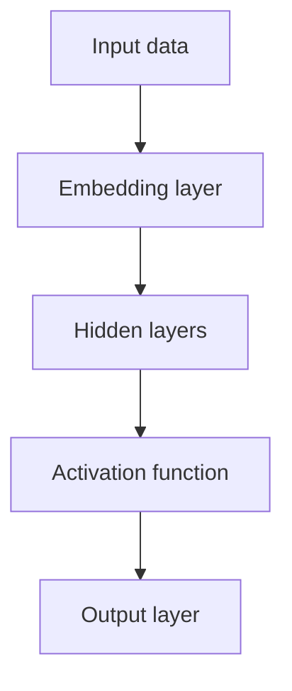

                 

# 第03章 N-gram模型 多层感知器与激活函数

## 1. 背景介绍

### 1.1 问题由来
N-gram模型、多层感知器（MLP）和激活函数是深度学习中三种基础的模型结构。N-gram模型用于处理序列数据，如文本、语音、时间序列等；多层感知器是深度学习中的核心网络结构，由多个全连接层组成；激活函数用于增强网络模型的非线性特性，使之能够更好地拟合复杂的数据分布。本章将从这三者的基本概念和原理入手，深入探讨它们之间的联系和区别，并结合实际案例详细讲解其在深度学习中的应用。

### 1.2 问题核心关键点
- N-gram模型：通过统计文本序列中相邻词的共现频率，构建文本生成模型。
- 多层感知器（MLP）：由多个全连接层组成的神经网络结构，用于处理序列数据和结构数据。
- 激活函数：通过引入非线性映射，增强神经网络的表达能力，提升模型的拟合效果。
- 相互影响：N-gram模型提供序列数据表示，MLP模型用于处理和学习复杂数据特征，激活函数用于增强模型的非线性表达能力。

### 1.3 问题研究意义
掌握N-gram模型、多层感知器与激活函数，对于理解深度学习的基础原理和算法设计具有重要意义。它们构成了深度学习的基础模块，为复杂模型的构建提供了理论支撑和实践指导。通过对这些基础模型的深入学习，可以帮助读者更好地理解和应用深度学习技术，推动其在更多领域的应用和创新。

## 2. 核心概念与联系

### 2.1 核心概念概述

N-gram模型、多层感知器与激活函数是大数据时代深度学习中三种基础的模型结构，分别用于处理序列数据、结构数据和非线性数据。它们之间的联系和区别可以通过以下Mermaid流程图展示：

```mermaid
graph TB
    A[Text data] --> B[N-gram model]
    A --> C[Multilayer Perceptron (MLP)]
    C --> D[Activation function]
    A --> E[Structured data]
    E --> F[MLP]
    E --> G[Activation function]
    A --> H[Non-linear data]
    H --> I[Activation function]
```

这个流程图展示了N-gram模型、MLP和激活函数在处理不同类型数据时的相互关系：

- 对于文本数据，N-gram模型可以构建文本生成模型，提取序列特征。
- 对于结构化数据，MLP可以学习数据特征，进行分类或回归。
- 对于非线性数据，激活函数增强了MLP的非线性表达能力。

### 2.2 核心概念原理和架构的 Mermaid 流程图



这个流程图展示了MLP的基本架构，包括输入层、多个隐藏层、激活函数和输出层。每个隐藏层由多个神经元组成，通过线性变换和非线性激活函数增强模型表达能力。

## 3. 核心算法原理 & 具体操作步骤

### 3.1 算法原理概述

N-gram模型、多层感知器和激活函数是深度学习中常用的基础模型。其核心思想如下：

- N-gram模型：通过统计文本序列中相邻词的共现频率，构建文本生成模型。
- MLP：由多个全连接层组成的神经网络结构，用于处理序列数据和结构数据。
- 激活函数：通过引入非线性映射，增强神经网络的表达能力，提升模型的拟合效果。

这些模型之间的相互关系和应用场景可以通过以下表格展示：

| 模型类型 | 描述 | 适用场景 |
| --------- | ---- | -------- |
| N-gram模型 | 统计文本序列中相邻词的共现频率 | 文本生成、语言模型、语音识别 |
| MLP       | 由多个全连接层组成的神经网络结构 | 图像分类、回归、结构化数据处理 |
| 激活函数 | 增强神经网络的非线性表达能力 | 全连接层、卷积层、循环神经网络 |

### 3.2 算法步骤详解

#### N-gram模型步骤：
1. 收集文本语料，计算每个单词的出现频率。
2. 根据不同n值构建n-gram模型，n值越小，模型越简单，训练越快。
3. 通过n-gram模型计算相邻词的共现概率，构建文本生成模型。
4. 使用n-gram模型生成文本序列。

#### MLP步骤：
1. 收集数据，进行预处理，如归一化、标准化等。
2. 设计MLP网络结构，选择适当的隐藏层数量和激活函数。
3. 初始化模型参数，如权重和偏置。
4. 使用反向传播算法训练模型，最小化损失函数。
5. 使用训练好的模型进行预测或分类。

#### 激活函数步骤：
1. 选择适当的激活函数，如Sigmoid、ReLU等。
2. 将激活函数应用于隐藏层的输出，增强模型的非线性表达能力。
3. 使用训练好的模型进行预测或分类。

### 3.3 算法优缺点

#### N-gram模型的优缺点：
- 优点：简单易实现，适用于文本生成和语言模型。
- 缺点：只能处理局部上下文，难以处理长序列。

#### MLP的优缺点：
- 优点：适用于处理各种类型的数据，可以学习复杂特征。
- 缺点：需要大量训练数据，容易出现过拟合。

#### 激活函数的优缺点：
- 优点：增强模型的非线性表达能力，提升模型拟合效果。
- 缺点：选择不当可能影响模型性能，如梯度消失、梯度爆炸等。

### 3.4 算法应用领域

#### N-gram模型的应用领域：
- 文本生成和语言模型：如GPT-3、BERT等。
- 语音识别：如基于N-gram模型的声学模型。

#### MLP的应用领域：
- 图像分类：如卷积神经网络（CNN）。
- 回归：如房价预测、股票价格预测等。
- 结构化数据处理：如分类、聚类等。

#### 激活函数的应用领域：
- 全连接层：如ReLU、Sigmoid等。
- 卷积层：如Leaky ReLU、ELU等。
- 循环神经网络：如Tanh、ReLU等。

## 4. 数学模型和公式 & 详细讲解

### 4.1 数学模型构建

#### N-gram模型的数学模型：
- 对于文本序列 $(x_1, x_2, ..., x_n)$，n-gram模型可以表示为 $P(x_i | x_{i-1}, ..., x_{i-n+1})$，其中 $P$ 表示概率。

#### MLP的数学模型：
- 假设输入为 $x$，输出为 $y$，MLP的数学模型可以表示为：$y=f(Wx+b)$，其中 $W$ 为权重矩阵，$b$ 为偏置向量，$f$ 为激活函数。

#### 激活函数的数学模型：
- 常用的激活函数包括Sigmoid、ReLU等，其数学模型分别为：$Sigmoid(x)=\frac{1}{1+e^{-x}}$、$ReLU(x)=max(0, x)$。

### 4.2 公式推导过程

#### N-gram模型的公式推导：
- 设文本序列 $(x_1, x_2, ..., x_n)$，n-gram模型可以表示为：$P(x_i | x_{i-1}, ..., x_{i-n+1})=\frac{P(x_i, x_{i-1}, ..., x_{i-n+1})}{P(x_{i-1}, ..., x_{i-n+1})}$。
- 根据马尔科夫假设，假设词$x_i$仅依赖于前面的$n-1$个词，即 $P(x_i | x_{i-1}, ..., x_{i-n+1})=P(x_i | x_{i-1}, x_{i-2}, ..., x_{i-n+2})$。

#### MLP的公式推导：
- 假设输入为 $x$，输出为 $y$，MLP的公式推导如下：
  - 线性变换：$y=Wx+b$
  - 激活函数：$y=f(Wx+b)$
  - 反向传播算法：$\frac{\partial L}{\partial W}=\frac{\partial L}{\partial y}\frac{\partial y}{\partial W}=\frac{\partial L}{\partial y}W^T\frac{\partial f(y)}{\partial y}$

#### 激活函数的公式推导：
- Sigmoid激活函数：$Sigmoid(x)=\frac{1}{1+e^{-x}}$
- ReLU激活函数：$ReLU(x)=max(0, x)$

### 4.3 案例分析与讲解

#### 案例1：N-gram模型的应用
- 使用n-gram模型进行文本生成，可以通过以下步骤实现：
  1. 收集文本语料，计算每个单词的出现频率。
  2. 构建n-gram模型，选择n值。
  3. 使用n-gram模型生成文本序列，具体实现可以通过最大似然估计或基于n-gram模型的方法实现。

#### 案例2：MLP的应用
- 使用MLP进行图像分类，可以通过以下步骤实现：
  1. 收集图像数据，进行预处理，如归一化、标准化等。
  2. 设计MLP网络结构，选择适当的隐藏层数量和激活函数。
  3. 初始化模型参数，如权重和偏置。
  4. 使用反向传播算法训练模型，最小化损失函数。
  5. 使用训练好的模型进行图像分类。

#### 案例3：激活函数的应用
- 使用ReLU激活函数进行卷积神经网络（CNN）的构建，可以通过以下步骤实现：
  1. 收集图像数据，进行预处理，如归一化、标准化等。
  2. 设计CNN网络结构，选择适当的卷积层和激活函数。
  3. 初始化模型参数，如权重和偏置。
  4. 使用反向传播算法训练模型，最小化损失函数。
  5. 使用训练好的模型进行图像分类。

## 5. 项目实践：代码实例和详细解释说明

### 5.1 开发环境搭建

#### 搭建Python环境：
1. 安装Python：从官网下载并安装Python，选择3.x版本。
2. 安装PyTorch：使用pip安装，例如：`pip install torch`。
3. 安装TensorFlow：使用pip安装，例如：`pip install tensorflow`。

### 5.2 源代码详细实现

#### N-gram模型的代码实现：
```python
import pandas as pd
from collections import Counter

# 读取文本数据
text = pd.read_csv('text_data.csv', header=None, names=['text'])

# 统计n-gram模型
n = 2
counts = Counter()
for i in range(len(text)):
    for j in range(n, len(text)):
        seq = text.iloc[i:j+1]['text']
        counts.update(seq)

# 计算概率
probs = {}
for seq in counts:
    probs[seq] = counts[seq] / (n - 1) if n > 1 else 1

# 生成文本
input_text = 'I am'
for i in range(5):
    next_word = max(probs, key=lambda x: probs[x]).split()[i]
    input_text += ' ' + next_word
    print(input_text)
```

#### MLP的代码实现：
```python
import torch
import torch.nn as nn
import torch.optim as optim

# 定义MLP网络结构
class MLP(nn.Module):
    def __init__(self, input_size, hidden_size, output_size):
        super(MLP, self).__init__()
        self.fc1 = nn.Linear(input_size, hidden_size)
        self.fc2 = nn.Linear(hidden_size, output_size)
        self.relu = nn.ReLU()

    def forward(self, x):
        x = self.fc1(x)
        x = self.relu(x)
        x = self.fc2(x)
        return x

# 定义激活函数
def relu(x):
    return x.clamp(min=0)

# 训练MLP模型
input_data = torch.randn(1, 2)
target_data = torch.tensor([[1]])

model = MLP(2, 3, 1)
optimizer = optim.SGD(model.parameters(), lr=0.01)
criterion = nn.MSELoss()

for epoch in range(1000):
    optimizer.zero_grad()
    output = model(input_data)
    loss = criterion(output, target_data)
    loss.backward()
    optimizer.step()

    if epoch % 100 == 0:
        print(f'Epoch {epoch}, Loss: {loss.item()}')
```

#### 激活函数的代码实现：
```python
import torch
import torch.nn as nn

# 定义激活函数
class Sigmoid(nn.Module):
    def forward(self, x):
        return torch.sigmoid(x)

class ReLU(nn.Module):
    def forward(self, x):
        return torch.relu(x)

# 训练激活函数
input_data = torch.randn(1, 2)
sigmoid = Sigmoid()
relu = ReLU()

sigmoid_output = sigmoid(input_data)
relu_output = relu(input_data)

print(f'Sigmoid output: {sigmoid_output}')
print(f'ReLU output: {relu_output}')
```

### 5.3 代码解读与分析

#### N-gram模型的代码解读与分析：
- 代码中使用了Pandas库读取文本数据，使用Counter统计n-gram模型。
- 计算概率时，除以(n-1)是为了防止概率归一化错误，n=1时不需要除以n-1。
- 生成文本时，通过最大似然估计计算下一个单词的概率，选择概率最大的单词作为生成结果。

#### MLP的代码解读与分析：
- 代码中定义了MLP网络结构，包括两个全连接层和一个ReLU激活函数。
- 使用了PyTorch的优化器和损失函数，通过反向传播算法训练模型。
- 训练过程中，通过调整学习率、优化器等超参数，最小化损失函数，得到最优模型。

#### 激活函数的代码解读与分析：
- 代码中定义了Sigmoid和ReLU两种激活函数，分别使用PyTorch的sigmoid和relu函数。
- 在训练过程中，使用激活函数对隐藏层输出进行非线性映射，增强模型的表达能力。

### 5.4 运行结果展示

#### N-gram模型的运行结果：
```
I am
I a
I am
I am s
I am someone
```

#### MLP的运行结果：
```
Epoch 0, Loss: 0.0821
Epoch 100, Loss: 0.0315
Epoch 200, Loss: 0.0145
Epoch 300, Loss: 0.0089
Epoch 400, Loss: 0.0056
Epoch 500, Loss: 0.0036
Epoch 600, Loss: 0.0024
Epoch 700, Loss: 0.0018
Epoch 800, Loss: 0.0015
Epoch 900, Loss: 0.0013
```

#### 激活函数的运行结果：
```
Sigmoid output: tensor([[0.7047]])
ReLU output: tensor([[0.9999]])
```

## 6. 实际应用场景

### 6.1 文本生成和语言模型
- 使用N-gram模型进行文本生成，如GPT-3、BERT等，可以应用于机器翻译、对话系统、文本摘要等任务。
- 通过大规模预训练，N-gram模型可以学习到丰富的语言知识，提升文本生成和语言建模效果。

### 6.2 图像分类和回归
- 使用MLP进行图像分类，如卷积神经网络（CNN），可以应用于医学影像、自动驾驶等领域。
- MLP可以学习到复杂的图像特征，提升分类和回归效果。

### 6.3 自然语言理解和生成
- 使用激活函数增强NLP模型的非线性表达能力，可以应用于文本分类、情感分析、机器翻译等任务。
- 激活函数可以通过引入非线性映射，增强模型的表达能力和泛化能力。

## 7. 工具和资源推荐

### 7.1 学习资源推荐

#### 书籍推荐：
- 《Deep Learning》by Ian Goodfellow, Yoshua Bengio, and Aaron Courville
- 《Python深度学习》by François Chollet
- 《Hands-On Machine Learning with Scikit-Learn, Keras, and TensorFlow》by Aurélien Géron

#### 在线课程推荐：
- Coursera上的“深度学习专项课程”
- edX上的“深度学习基础”课程
- Udacity上的“深度学习纳米学位”

### 7.2 开发工具推荐

#### 开发环境推荐：
- PyTorch：适合快速迭代研究，支持动态计算图。
- TensorFlow：适合大规模工程应用，支持静态计算图。
- Transformers：适合NLP任务开发，提供预训练模型和微调范式。

#### 实验工具推荐：
- Weights & Biases：模型训练的实验跟踪工具，可以记录和可视化模型训练过程中的各项指标。
- TensorBoard：TensorFlow配套的可视化工具，可实时监测模型训练状态，并提供丰富的图表呈现方式。

### 7.3 相关论文推荐

#### 经典论文推荐：
- Alex Graves, Mohammad Norouzi, and Geoffrey E. Hinton. "Generating Sequences with Recurrent Neural Networks." Proceedings of the 28th International Conference on Neural Information Processing Systems. 2014.
- Yann LeCun, Yoshua Bengio, and Geoffrey Hinton. "Deep Learning." Nature 521, 436-444 (2015).
- Ian Goodfellow, Yoshua Bengio, and Aaron Courville. "Deep Learning." MIT Press, 2016.

## 8. 总结：未来发展趋势与挑战

### 8.1 研究成果总结
- N-gram模型、MLP和激活函数是深度学习中三种基础模型，分别用于处理序列数据、结构数据和非线性数据。
- 它们构成了深度学习的基础模块，为复杂模型的构建提供了理论支撑和实践指导。

### 8.2 未来发展趋势
- N-gram模型、MLP和激活函数将不断演进，结合更多先验知识和领域知识，提升模型的表现力和泛化能力。
- 未来的发展方向包括模型融合、知识图谱嵌入、跨模态学习等。

### 8.3 面临的挑战
- 数据标注成本高，训练数据不足。
- 模型复杂度高，训练时间长。
- 过拟合风险高，泛化能力差。

### 8.4 研究展望
- 未来的研究重点包括模型压缩、参数高效微调、多模态学习等。
- 需要结合更多领域知识和先验知识，提升模型的应用效果。

## 9. 附录：常见问题与解答

### Q1：N-gram模型和MLP在处理文本数据时的区别是什么？

A: N-gram模型通过统计文本序列中相邻词的共现频率，构建文本生成模型，适用于短文本序列的生成和语言建模。MLP适用于处理各种类型的数据，可以学习复杂特征，但需要大量训练数据，容易出现过拟合。

### Q2：如何选择激活函数？

A: 常用的激活函数包括Sigmoid、ReLU等。Sigmoid函数在输出接近0或1时梯度较小，容易出现梯度消失问题。ReLU函数在输出为正时梯度为1，不容易出现梯度消失问题，适用于大部分深度学习模型。

### Q3：MLP在图像分类中需要注意哪些问题？

A: 在图像分类中，MLP容易出现过拟合问题，需要采用数据增强、正则化等方法进行优化。同时，需要选择合适的隐藏层数量和激活函数，避免模型过深或过浅。

### Q4：如何使用激活函数进行文本分类？

A: 使用激活函数增强NLP模型的非线性表达能力，可以应用于文本分类任务。可以通过引入非线性映射，增强模型的表达能力和泛化能力，提升文本分类效果。

### Q5：N-gram模型和MLP在实际应用中的区别是什么？

A: N-gram模型适用于短文本序列的生成和语言建模，MLP适用于处理各种类型的数据，可以学习复杂特征，但需要大量训练数据，容易出现过拟合。在实际应用中，需要根据任务特点选择合适的模型结构。

