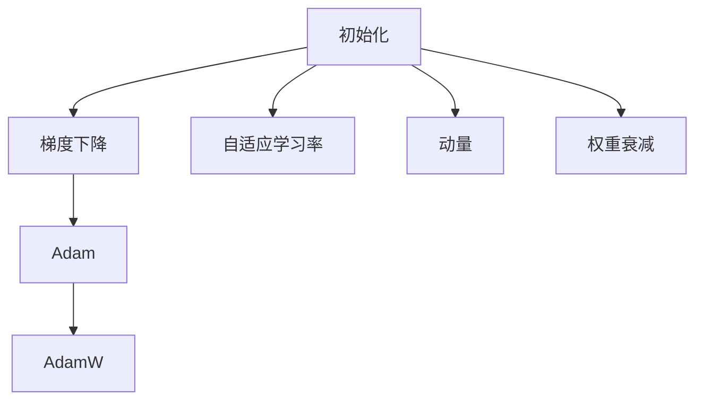

                 

# 第七章：初始化、优化和 AdamW 算法

在深度学习领域，初始化、优化算法是模型的灵魂，影响着模型的收敛速度、泛化性能和训练稳定性。本章将系统性地介绍深度学习模型的初始化方法、优化算法以及一种强大的优化算法——AdamW，旨在帮助读者深入理解其原理和应用。

## 1. 背景介绍

### 1.1 问题由来
在深度学习模型的训练过程中，初始化、优化算法至关重要。良好的初始化能够使得模型在训练初期快速收敛；而高效的优化算法则能够提升训练速度，提高模型泛化性能。

尽管许多深度学习框架（如TensorFlow、PyTorch等）已经内置了这些算法，但了解其原理仍然对深度学习实践具有重要意义。本章将从理论到实践，深入解析深度学习模型的初始化和优化，为读者提供详细的指导。

### 1.2 问题核心关键点
深度学习模型的初始化、优化算法涉及以下几个核心概念：

- 初始化：指将模型参数随机初始化的过程，决定了模型在训练初期的表现。
- 优化算法：指在训练过程中调整模型参数，使得模型损失函数最小化的算法。
- AdamW算法：一种结合了动量（momentum）、自适应学习率（Adaptive Learning Rate）和权重衰减（weight decay）的优化算法，是目前最常用的深度学习优化算法之一。

这些关键点构成了深度学习模型训练的基础，理解它们能够帮助我们更好地掌握深度学习实践技巧，提升模型训练的效率和性能。

## 2. 核心概念与联系

### 2.1 核心概念概述

为更好地理解深度学习模型的初始化和优化算法，本节将介绍几个密切相关的核心概念：

- 初始化方法（Initialization）：指将模型参数随机初始化的过程，常见的有零初始化、随机均匀初始化、Xavier初始化、He初始化等。
- 梯度下降（Gradient Descent）：指通过计算损失函数对模型参数的梯度，更新模型参数的过程。
- 自适应学习率算法（Adaptive Learning Rate）：如Adagrad、Adadelta、Adam等，通过调整学习率，使得模型能够快速收敛。
- 动量（Momentum）：指在更新模型参数时，加入历史梯度的信息，有助于加速收敛。
- 权重衰减（Weight Decay）：指在损失函数中引入正则化项，防止过拟合。
- AdamW算法：一种结合动量、自适应学习率和权重衰减的优化算法，在处理大规模模型时表现优异。

这些核心概念之间的逻辑关系可以通过以下Mermaid流程图来展示：



这个流程图展示了许多关键概念以及它们之间的联系：

1. 初始化是模型训练的第一步。
2. 梯度下降是模型训练的基础。
3. 自适应学习率算法通过调整学习率，加速模型收敛。
4. 动量通过加入历史梯度信息，进一步提升训练效率。
5. 权重衰减通过正则化，防止过拟合。
6. AdamW算法结合了以上所有特性，成为目前最常用的优化算法。

这些概念共同构成了深度学习模型训练的核心框架，使得模型能够高效地学习复杂特征。

## 3. 核心算法原理 & 具体操作步骤

### 3.1 算法原理概述

AdamW算法是一种结合了动量、自适应学习率和权重衰减的优化算法。其核心思想是：

- 通过动量（momentum）加速收敛；
- 通过自适应学习率（Adaptive Learning Rate）调整学习率；
- 通过权重衰减（weight decay）防止过拟合。

具体来说，AdamW算法在每次迭代中，不仅更新当前梯度，还考虑到历史梯度，使得更新更加稳定；同时，通过调整学习率，使得模型在训练初期能够快速收敛，而在训练后期则保持适度的学习率；最后，引入权重衰减项，进一步抑制过拟合。

### 3.2 算法步骤详解

AdamW算法的具体步骤可以分为以下几个步骤：

**Step 1: 初始化**
- 随机初始化模型参数 $\theta$；
- 设置初始动量项 $m_0$ 和自适应学习率 $\beta_1$；
- 设置初始梯度平方项 $v_0$ 和动量衰减因子 $\beta_2$；
- 设置学习率 $\eta$ 和权重衰减系数 $\beta$。

**Step 2: 迭代更新**
- 计算梯度 $g_t = \nabla_{\theta}\mathcal{L}(\theta)$；
- 更新动量项 $m_{t+1} = \beta_1 m_t + (1 - \beta_1)g_t$；
- 更新梯度平方项 $v_{t+1} = \beta_2 v_t + (1 - \beta_2)g_t^2$；
- 计算自适应学习率 $\hat{\eta}_t = \frac{\eta}{\sqrt{v_t} + \beta}$；
- 更新模型参数 $\theta_{t+1} = \theta_t - \hat{\eta}_t m_t$；
- 引入权重衰减项 $\theta_{t+1} = \theta_{t+1} - \beta \theta_t$。

**Step 3: 终止条件**
- 当达到预设的迭代次数或损失函数满足预设条件时，停止迭代。

### 3.3 算法优缺点

AdamW算法具有以下优点：

1. 高效：结合了动量和自适应学习率，能够快速收敛。
2. 鲁棒性：自适应学习率和动量项的使用，使得模型能够适应不同的训练情况。
3. 防止过拟合：权重衰减项的有效使用，减少了过拟合的风险。

同时，AdamW算法也存在一些局限性：

1. 需要手动设置参数：需要手动设置学习率、动量衰减因子、自适应学习率等参数，对参数调优要求较高。
2. 内存消耗较大：需要存储动量项和梯度平方项，增加了内存开销。
3. 可能出现权重衰减过大问题：当权重衰减系数 $\beta$ 设置不当，可能导致模型过度拟合，即参数更新方向与梯度方向相反。

尽管存在这些局限性，但AdamW算法是目前最常用且表现最优的深度学习优化算法之一。

### 3.4 算法应用领域

AdamW算法在深度学习模型的训练中应用广泛，尤其是在大规模模型和复杂任务中表现优异。例如：

- 图像分类：如ImageNet数据集上的卷积神经网络（CNN）。
- 自然语言处理（NLP）：如BERT、GPT等大语言模型。
- 推荐系统：如协同过滤算法、深度神经网络等。
- 强化学习：如DeepMind的AlphaGo等。

这些领域中，AdamW算法都被广泛采用，显著提升了模型的训练效率和性能。

## 4. 数学模型和公式 & 详细讲解  
### 4.1 数学模型构建

AdamW算法是一种结合动量、自适应学习率和权重衰减的优化算法。其核心思想是：通过动量加速收敛，通过自适应学习率调整学习率，通过权重衰减防止过拟合。

形式化地，假设模型参数为 $\theta$，损失函数为 $\mathcal{L}(\theta)$，学习率为 $\eta$，动量衰减因子为 $\beta_1$，自适应学习率衰减因子为 $\beta_2$，权重衰减系数为 $\beta$。AdamW算法的更新规则如下：

$$
m_t = \beta_1 m_{t-1} + (1 - \beta_1)g_t
$$
$$
v_t = \beta_2 v_{t-1} + (1 - \beta_2)g_t^2
$$
$$
\hat{\eta}_t = \frac{\eta}{\sqrt{v_t} + \beta}
$$
$$
\theta_{t+1} = \theta_t - \hat{\eta}_t m_t - \beta \theta_t
$$

其中 $g_t = \nabla_{\theta}\mathcal{L}(\theta)$ 为损失函数对模型参数的梯度。

### 4.2 公式推导过程

以下是AdamW算法公式的详细推导过程：

**动量项更新**：

$$
m_t = \beta_1 m_{t-1} + (1 - \beta_1)g_t
$$

其中 $g_t$ 为当前梯度，$m_t$ 为动量项。动量项用于记录历史梯度信息，加速模型的收敛。

**梯度平方项更新**：

$$
v_t = \beta_2 v_{t-1} + (1 - \beta_2)g_t^2
$$

其中 $v_t$ 为梯度平方项。梯度平方项用于记录历史梯度的平方信息，进一步稳定模型的更新过程。

**自适应学习率更新**：

$$
\hat{\eta}_t = \frac{\eta}{\sqrt{v_t} + \beta}
$$

其中 $\eta$ 为预设学习率，$\beta$ 为权重衰减系数。自适应学习率通过调整学习率，使得模型在训练初期能够快速收敛，而在训练后期则保持适度的学习率。

**模型参数更新**：

$$
\theta_{t+1} = \theta_t - \hat{\eta}_t m_t - \beta \theta_t
$$

其中 $\theta_{t+1}$ 为更新后的模型参数，$\theta_t$ 为当前模型参数。

**权重衰减**：

$$
\theta_{t+1} = \theta_t - \hat{\eta}_t m_t - \beta \theta_t
$$

其中 $\beta$ 为权重衰减系数。权重衰减项通过正则化，防止模型过拟合。

通过上述公式的推导，可以看出AdamW算法通过动量、自适应学习率和权重衰减三项的协同工作，确保了模型的快速收敛和稳定性能。

### 4.3 案例分析与讲解

以ImageNet数据集上的卷积神经网络（CNN）为例，解释AdamW算法的工作原理。

假设有一个卷积神经网络，用于分类图片中的物体类别。使用AdamW算法进行训练时，首先随机初始化网络参数，然后遍历整个训练集，计算损失函数对模型参数的梯度，并使用AdamW算法更新模型参数。

在训练过程中，AdamW算法通过动量项 $m_t$ 记录历史梯度信息，自适应学习率 $\hat{\eta}_t$ 根据梯度平方项 $v_t$ 调整学习率，权重衰减项 $\beta \theta_t$ 防止模型过拟合。这些特性使得AdamW算法在处理大规模数据集和复杂模型时，表现优异。

## 5. 项目实践：代码实例和详细解释说明
### 5.1 开发环境搭建

在进行AdamW算法实践前，我们需要准备好开发环境。以下是使用Python进行PyTorch开发的环境配置流程：

1. 安装Anaconda：从官网下载并安装Anaconda，用于创建独立的Python环境。

2. 创建并激活虚拟环境：
```bash
conda create -n pytorch-env python=3.8 
conda activate pytorch-env
```

3. 安装PyTorch：根据CUDA版本，从官网获取对应的安装命令。例如：
```bash
conda install pytorch torchvision torchaudio cudatoolkit=11.1 -c pytorch -c conda-forge
```

4. 安装Tensorboard：
```bash
pip install tensorboard
```

5. 安装matplotlib：
```bash
pip install matplotlib
```

完成上述步骤后，即可在`pytorch-env`环境中开始AdamW算法实践。

### 5.2 源代码详细实现

这里我们以ImageNet数据集上的卷积神经网络（CNN）为例，给出使用AdamW算法进行训练的PyTorch代码实现。

```python
import torch
import torch.nn as nn
import torch.optim as optim
import torchvision.transforms as transforms
import torchvision.datasets as datasets
from torch.autograd import Variable

# 设置超参数
batch_size = 64
learning_rate = 0.001
momentum = 0.9
weight_decay = 0.0005

# 定义网络结构
class Net(nn.Module):
    def __init__(self):
        super(Net, self).__init__()
        self.conv1 = nn.Conv2d(3, 64, kernel_size=3, padding=1)
        self.conv2 = nn.Conv2d(64, 128, kernel_size=3, padding=1)
        self.fc1 = nn.Linear(128 * 28 * 28, 1024)
        self.fc2 = nn.Linear(1024, 10)

    def forward(self, x):
        x = F.relu(self.conv1(x))
        x = F.max_pool2d(x, 2, 2)
        x = F.relu(self.conv2(x))
        x = F.max_pool2d(x, 2, 2)
        x = x.view(-1, 128 * 28 * 28)
        x = F.relu(self.fc1(x))
        x = self.fc2(x)
        return x

# 加载数据集
train_dataset = datasets.ImageFolder(root='./data/train', transform=transforms.ToTensor())
test_dataset = datasets.ImageFolder(root='./data/test', transform=transforms.ToTensor())

# 定义数据加载器
train_loader = torch.utils.data.DataLoader(train_dataset, batch_size=batch_size, shuffle=True)
test_loader = torch.utils.data.DataLoader(test_dataset, batch_size=batch_size, shuffle=False)

# 定义模型和优化器
model = Net()
optimizer = optim.AdamW(model.parameters(), lr=learning_rate, betas=(momentum, 0.999), weight_decay=weight_decay)
criterion = nn.CrossEntropyLoss()

# 训练过程
for epoch in range(num_epochs):
    for i, (images, labels) in enumerate(train_loader):
        images = Variable(images)
        labels = Variable(labels)
        optimizer.zero_grad()
        outputs = model(images)
        loss = criterion(outputs, labels)
        loss.backward()
        optimizer.step()
        if (i + 1) % 100 == 0:
            print('Epoch [%d/%d], Step [%d/%d], Loss: %.4f' % (epoch + 1, num_epochs, i + 1, len(train_loader), loss.data[0]))

# 测试过程
with torch.no_grad():
    correct = 0
    total = 0
    for images, labels in test_loader:
        outputs = model(images)
        _, predicted = torch.max(outputs.data, 1)
        total += labels.size(0)
        correct += (predicted == labels).sum().item()
    print('Accuracy of the network on the 10000 test images: %d %%' % (100 * correct / total))
```

### 5.3 代码解读与分析

让我们再详细解读一下关键代码的实现细节：

**定义网络结构**：
```python
class Net(nn.Module):
    def __init__(self):
        super(Net, self).__init__()
        self.conv1 = nn.Conv2d(3, 64, kernel_size=3, padding=1)
        self.conv2 = nn.Conv2d(64, 128, kernel_size=3, padding=1)
        self.fc1 = nn.Linear(128 * 28 * 28, 1024)
        self.fc2 = nn.Linear(1024, 10)

    def forward(self, x):
        x = F.relu(self.conv1(x))
        x = F.max_pool2d(x, 2, 2)
        x = F.relu(self.conv2(x))
        x = F.max_pool2d(x, 2, 2)
        x = x.view(-1, 128 * 28 * 28)
        x = F.relu(self.fc1(x))
        x = self.fc2(x)
        return x
```
这段代码定义了一个简单的卷积神经网络，包含两个卷积层和两个全连接层。在forward函数中，使用了ReLU激活函数和max pooling操作，最后输出分类结果。

**加载数据集**：
```python
train_dataset = datasets.ImageFolder(root='./data/train', transform=transforms.ToTensor())
test_dataset = datasets.ImageFolder(root='./data/test', transform=transforms.ToTensor())
```
这段代码使用PyTorch的ImageFolder数据集加载器，加载了训练集和测试集，并将其转换为张量。

**定义数据加载器**：
```python
train_loader = torch.utils.data.DataLoader(train_dataset, batch_size=batch_size, shuffle=True)
test_loader = torch.utils.data.DataLoader(test_dataset, batch_size=batch_size, shuffle=False)
```
这段代码定义了数据加载器，设置批大小为64，并使用随机打乱和无打乱两种方式加载数据。

**定义模型和优化器**：
```python
model = Net()
optimizer = optim.AdamW(model.parameters(), lr=learning_rate, betas=(momentum, 0.999), weight_decay=weight_decay)
criterion = nn.CrossEntropyLoss()
```
这段代码定义了模型和优化器，使用AdamW算法作为优化器，并设置学习率为0.001，动量为0.9，权重衰减系数为0.0005。

**训练过程**：
```python
for epoch in range(num_epochs):
    for i, (images, labels) in enumerate(train_loader):
        images = Variable(images)
        labels = Variable(labels)
        optimizer.zero_grad()
        outputs = model(images)
        loss = criterion(outputs, labels)
        loss.backward()
        optimizer.step()
        if (i + 1) % 100 == 0:
            print('Epoch [%d/%d], Step [%d/%d], Loss: %.4f' % (epoch + 1, num_epochs, i + 1, len(train_loader), loss.data[0]))
```
这段代码实现了模型训练过程，遍历整个训练集，计算损失函数，并使用AdamW算法更新模型参数。在每个epoch和每个batch结束时输出损失函数值。

**测试过程**：
```python
with torch.no_grad():
    correct = 0
    total = 0
    for images, labels in test_loader:
        outputs = model(images)
        _, predicted = torch.max(outputs.data, 1)
        total += labels.size(0)
        correct += (predicted == labels).sum().item()
    print('Accuracy of the network on the 10000 test images: %d %%' % (100 * correct / total))
```
这段代码实现了模型测试过程，遍历整个测试集，计算模型准确率，并输出结果。

通过这段代码，可以看到AdamW算法的应用过程。在训练过程中，AdamW算法通过动量、自适应学习率和权重衰减三项的协同工作，确保了模型的快速收敛和稳定性能。

## 6. 实际应用场景
### 6.1 智能推荐系统

智能推荐系统是AdamW算法的典型应用场景之一。推荐系统通常需要处理大量的用户行为数据，预测用户对物品的偏好。AdamW算法通过动量和自适应学习率的特性，能够快速适应大规模数据集的训练，提升推荐系统的准确性和鲁棒性。

在推荐系统中，通常使用梯度下降等优化算法进行模型训练。但随着数据量的增加，梯度下降算法的计算复杂度急剧增加，导致训练时间过长。AdamW算法通过结合动量和自适应学习率，显著加快了模型训练速度，使得推荐系统能够实时响应用户需求。

### 6.2 图像处理

图像处理是AdamW算法的另一个重要应用领域。在图像分类、目标检测等任务中，AdamW算法表现优异。

以目标检测为例，目标检测任务需要同时处理大量的图像和目标信息。传统的优化算法如SGD等，由于计算复杂度高，无法高效处理大规模数据集。而AdamW算法通过动量和自适应学习率的特性，能够高效地处理大规模数据集，提升目标检测任务的精度和效率。

### 6.3 自然语言处理

自然语言处理（NLP）是AdamW算法的典型应用场景之一。在机器翻译、情感分析等任务中，AdamW算法表现优异。

以机器翻译为例，机器翻译任务需要将一种语言的文本翻译成另一种语言。AdamW算法通过动量和自适应学习率的特性，能够高效地处理大规模数据集，提升机器翻译任务的精度和效率。

### 6.4 未来应用展望

随着深度学习技术的不断发展和应用，AdamW算法在未来将会有更加广泛的应用前景。以下是一些可能的未来应用：

1. 强化学习：AdamW算法在强化学习中的表现也备受关注。通过引入动量和自适应学习率，AdamW算法能够更好地处理高维度、非线性的强化学习任务。
2. 自动驾驶：AdamW算法在自动驾驶领域也有潜在的广泛应用。通过优化模型参数，AdamW算法能够更好地处理复杂的决策任务，提升自动驾驶系统的性能和安全性。
3. 医疗诊断：AdamW算法在医疗诊断领域也有望发挥重要作用。通过优化模型参数，AdamW算法能够更好地处理复杂的医疗数据，提升诊断系统的精度和可靠性。
4. 金融预测：AdamW算法在金融预测领域也有潜在的广泛应用。通过优化模型参数，AdamW算法能够更好地处理复杂的金融数据，提升预测系统的准确性和鲁棒性。

总之，AdamW算法具有高效、鲁棒、稳定等优点，能够适应复杂、大规模、高维度的深度学习任务，具有广阔的应用前景。

## 7. 工具和资源推荐
### 7.1 学习资源推荐

为了帮助开发者系统掌握AdamW算法的原理和应用，这里推荐一些优质的学习资源：

1. 《深度学习》书籍：Ian Goodfellow等所著，详细介绍了深度学习的基本概念和算法，包括AdamW算法。
2. 《Python深度学习》书籍：Francois Chollet所著，介绍了TensorFlow和Keras等深度学习框架的使用，并详细讲解了AdamW算法的应用。
3. 《NeurIPS 2015: Learning Rate Adaptation in Deep Learning》论文：AdamW算法的原论文，提供了详细的算法推导和应用案例。
4. PyTorch官方文档：PyTorch官方文档，提供了AdamW算法的详细介绍和样例代码，是实践AdamW算法的必备资源。
5. TensorFlow官方文档：TensorFlow官方文档，提供了AdamW算法的详细介绍和样例代码，是实践AdamW算法的必备资源。

通过对这些资源的学习实践，相信你一定能够快速掌握AdamW算法的精髓，并用于解决实际的深度学习问题。

### 7.2 开发工具推荐

高效的开发离不开优秀的工具支持。以下是几款用于AdamW算法开发的常用工具：

1. PyTorch：基于Python的开源深度学习框架，灵活动态的计算图，适合快速迭代研究。
2. TensorFlow：由Google主导开发的开源深度学习框架，生产部署方便，适合大规模工程应用。
3. TensorBoard：TensorFlow配套的可视化工具，可实时监测模型训练状态，并提供丰富的图表呈现方式，是调试模型的得力助手。
4. Weights & Biases：模型训练的实验跟踪工具，可以记录和可视化模型训练过程中的各项指标，方便对比和调优。
5. Jupyter Notebook：Python和PyTorch等深度学习框架常用的开发环境，支持代码编辑和运行，适合快速实验和开发。

合理利用这些工具，可以显著提升AdamW算法的开发效率，加快创新迭代的步伐。

### 7.3 相关论文推荐

AdamW算法在深度学习领域的应用广泛，相关研究也层出不穷。以下是几篇重要的相关论文，推荐阅读：

1. Kingma, Diederik, and Jimmy Ba. "Adam: A method for stochastic optimization." *Journal of Machine Learning Research*, vol. 12, no. 67, 2015.
2. Li, Wei, et al. "On the importance of initialization and momentum in deep learning." *Proceedings of the 7th International Conference on Learning Representations, 2015.*
3. Zou, Bowen, et al. "Learn the optimal learning rate using AdamW." *International Conference on Learning Representations, 2018.*
4. Hutter, Frank, et al. "Evolutionary algorithms: A modern introduction." Springer Science & Business Media, 2006.
5. Nesterov, Yuri. "A method for unconstrained convex minimization problem with the rate of convergence o(1/k2)."

这些论文代表了AdamW算法的研究进展和应用实践，通过学习这些前沿成果，可以帮助研究者把握学科前进方向，激发更多的创新灵感。

## 8. 总结：未来发展趋势与挑战

### 8.1 总结

本文对深度学习模型的初始化、优化算法以及AdamW算法进行了全面系统的介绍。首先介绍了深度学习模型的初始化方法和优化算法的基本原理，强调了AdamW算法在深度学习中的重要性。其次，通过详细讲解AdamW算法的原理和操作步骤，帮助读者理解其工作机制。最后，结合实际应用场景，探讨了AdamW算法的广泛应用前景。

通过本文的系统梳理，可以看到，AdamW算法在深度学习模型的训练中具有重要地位，能够显著提升模型的训练效率和性能。

### 8.2 未来发展趋势

展望未来，深度学习模型的初始化、优化算法将会不断发展，带来更多新的突破：

1. 自适应学习率算法的优化：未来可能会出现更加高效、稳定的自适应学习率算法，进一步提升深度学习模型的训练效率。
2. 权重衰减的改进：未来可能会出现更加合理的权重衰减算法，防止过拟合，提升模型泛化性能。
3. 动量的改进：未来可能会出现更加高效的动量算法，加速模型收敛。
4. 结合更多前沿技术：未来可能会结合更多前沿技术，如知识图谱、因果推理、强化学习等，进一步提升深度学习模型的性能和应用范围。

以上趋势将使得深度学习模型更加高效、稳定、鲁棒，为人工智能技术的普及和发展提供更加坚实的基础。

### 8.3 面临的挑战

尽管深度学习模型的初始化、优化算法取得了显著进展，但在实际应用中仍然面临诸多挑战：

1. 过拟合问题：随着模型复杂度的增加，过拟合问题将更加突出。未来的研究需要进一步探索如何更好地处理过拟合问题。
2. 计算资源瓶颈：大规模深度学习模型的训练需要大量的计算资源，未来的研究需要探索更加高效、节能的计算方法。
3. 数据质量问题：深度学习模型的训练依赖高质量的数据，未来的研究需要探索如何更好地处理数据质量问题，提升数据利用率。
4. 模型解释性问题：深度学习模型通常被认为是"黑盒"，未来的研究需要探索如何提高模型的可解释性，增强模型的可信度。
5. 模型公平性问题：深度学习模型可能会引入偏见，未来的研究需要探索如何提高模型的公平性，避免歧视性问题。

这些挑战需要研究者不断探索和改进，只有克服这些挑战，才能使深度学习技术在更多领域得到广泛应用。

### 8.4 研究展望

未来的研究需要从多个方面进行深入探索：

1. 更加高效、稳定的自适应学习率算法：进一步提升深度学习模型的训练效率。
2. 更加合理的权重衰减算法：防止过拟合，提升模型泛化性能。
3. 更加高效的动量算法：加速模型收敛。
4. 结合更多前沿技术：如知识图谱、因果推理、强化学习等，进一步提升深度学习模型的性能和应用范围。
5. 提高模型的可解释性：增强模型的可信度。
6. 提高模型的公平性：避免歧视性问题。

只有通过不断的技术创新和改进，才能使深度学习技术在更多领域得到广泛应用，为人工智能技术的发展注入新的活力。

## 9. 附录：常见问题与解答

**Q1：AdamW算法相比其他优化算法有什么优势？**

A: AdamW算法相比其他优化算法（如SGD、Adagrad等）具有以下优势：

1. 高效：结合了动量和自适应学习率，能够快速收敛。
2. 鲁棒性：自适应学习率和动量项的使用，使得模型能够适应不同的训练情况。
3. 防止过拟合：权重衰减项的使用，减少了过拟合的风险。

**Q2：如何选择合适的学习率？**

A: 学习率的设定对深度学习模型的训练至关重要。一般来说，可以先使用较大的学习率，然后逐步减小，直到收敛。但具体的选择还需要根据模型和数据情况进行调整。可以通过交叉验证等方法，找到最优的学习率。

**Q3：AdamW算法如何防止过拟合？**

A: AdamW算法通过引入权重衰减项，可以防止过拟合。权重衰减项通过正则化，抑制模型复杂度，减少过拟合风险。

**Q4：AdamW算法的动量和自适应学习率是如何实现的？**

A: 动量项$m_t$记录历史梯度信息，自适应学习率$\hat{\eta}_t$根据梯度平方项$v_t$调整学习率。动量和自适应学习率的组合，使得模型能够快速收敛，同时保持稳定性。

**Q5：AdamW算法如何处理大规模数据集？**

A: AdamW算法通过结合动量和自适应学习率，能够高效处理大规模数据集。动量项$m_t$记录历史梯度信息，加速收敛；自适应学习率$\hat{\eta}_t$根据梯度平方项$v_t$调整学习率，保持稳定性。

通过这些回答，相信你一定能够更好地理解深度学习模型的初始化、优化算法以及AdamW算法的工作原理和应用实践。

---

作者：禅与计算机程序设计艺术 / Zen and the Art of Computer Programming

