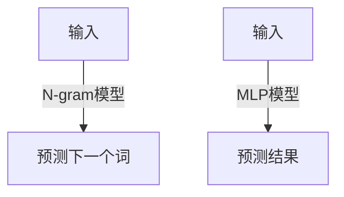

                 

# 第三章：探索 N-gram 模型和 MLP

## 1. 背景介绍

N-gram模型和MLP（多层感知器）是自然语言处理(NLP)中两个基础的统计语言模型。N-gram模型是最早的统计语言模型之一，通过统计语言中相邻字符或词语出现的概率来建模语言规律，广泛应用于文本生成、机器翻译、语言识别等任务。MLP是一种经典的神经网络结构，具有强大的非线性拟合能力，适用于各类模式识别和回归任务。

## 2. 核心概念与联系

### 2.1 核心概念概述

本节介绍N-gram模型和MLP的核心理论和基本概念。

#### N-gram模型
N-gram模型是一种基于统计的语言模型，通过分析文本中相邻N个词的出现频率来预测下一个词的概率。其中，N为序列长度，常见的有bi-gram、trigram等。N-gram模型认为文本序列是一个隐含的马尔科夫链，通过统计N个前缀词和其后缀词的出现概率来预测下一个词。

#### MLP模型
MLP是一种具有多层神经元的神经网络结构，由输入层、隐藏层和输出层组成。每一层包含多个神经元，每个神经元将输入加权求和，并通过激活函数得到输出。MLP模型通过反向传播算法更新模型参数，使其能够拟合输入数据的非线性关系，实现模式识别和回归任务。

### 2.2 核心概念原理和架构的 Mermaid 流程图

以下是一个简单的N-gram模型和MLP模型的结构图：



## 3. 核心算法原理 & 具体操作步骤

### 3.1 算法原理概述

N-gram模型和MLP模型的核心原理如下：

#### N-gram模型
N-gram模型基于统计学原理，通过计算文本中相邻N个词的出现频率，来预测下一个词的概率。模型的训练过程是通过统计大量文本语料中N-gram序列的出现次数，计算每个N-gram序列的概率。预测时，根据前N-1个词的出现频率，计算下一个词的概率分布。

#### MLP模型
MLP模型通过多层神经元的非线性组合，拟合输入数据的复杂关系。模型的训练过程是通过反向传播算法更新参数，使得模型输出尽可能接近真实标签。预测时，将输入样本输入模型，经过多层非线性变换，最终输出预测结果。

### 3.2 算法步骤详解

#### N-gram模型
1. 收集语料库：首先收集大规模的文本语料库，作为模型训练的素材。
2. 统计N-gram序列：计算每个N-gram序列在语料库中的出现次数，得到N-gram序列的概率分布。
3. 预测下一个词：对于输入文本中的前N-1个词，根据N-gram序列的概率分布，预测下一个词的概率。
4. 评估模型性能：通过准确率、召回率、F1分数等指标，评估模型在测试集上的表现。

#### MLP模型
1. 准备数据集：收集训练数据集，包含输入样本和对应标签。
2. 设计模型结构：选择适当的神经元个数、隐藏层数等参数，构建MLP模型。
3. 训练模型：通过反向传播算法更新模型参数，使得模型输出尽可能接近真实标签。
4. 预测结果：将新输入样本输入模型，得到预测结果。

### 3.3 算法优缺点

#### N-gram模型的优缺点
优点：
- 简单高效：N-gram模型计算简单，易于实现。
- 适用于小数据集：N-gram模型对于小规模的语料库也能有效建模。

缺点：
- 依赖语料库：N-gram模型的效果依赖于训练语料库的质量和规模。
- 缺乏记忆性：N-gram模型没有考虑上下文信息，忽略了文本的长期依赖关系。

#### MLP模型的优缺点
优点：
- 强大的拟合能力：MLP模型具有强大的非线性拟合能力，适用于复杂模式识别和回归任务。
- 可解释性：MLP模型可以通过权重和激活函数理解模型内部逻辑。

缺点：
- 参数量较大：MLP模型需要大量的训练参数，容易导致过拟合。
- 计算复杂度高：MLP模型的前向传播和反向传播计算复杂度较高，训练时间较长。

### 3.4 算法应用领域

#### N-gram模型的应用领域
- 文本生成：N-gram模型可以用于生成文本，如自动摘要、自动翻译等。
- 语言识别：N-gram模型可以用于语音识别和语言识别任务，如说话人识别、语种识别等。
- 情感分析：N-gram模型可以用于情感分析任务，分析文本中的情感倾向。

#### MLP模型的应用领域
- 图像识别：MLP模型可以用于图像识别任务，如图像分类、物体检测等。
- 文本分类：MLP模型可以用于文本分类任务，如垃圾邮件过滤、新闻分类等。
- 预测任务：MLP模型可以用于各种预测任务，如股票预测、气象预测等。

## 4. 数学模型和公式 & 详细讲解

### 4.1 数学模型构建

#### N-gram模型的数学模型
N-gram模型可以通过统计文本中N-gram序列的出现次数来构建。设文本序列为 $w_1, w_2, ..., w_N$，其中 $w_i \in \{1, 2, ..., V\}$，$V$ 为词汇表的大小。N-gram模型可以表示为：

$$
P(w_N|w_{N-1}, w_{N-2}, ..., w_{N-M+1}) = \frac{N(w_{N-1}, w_{N-2}, ..., w_{N-M+1}, w_N)}{N(w_{N-1}, w_{N-2}, ..., w_{N-M})}
$$

其中，$N(w_{N-1}, w_{N-2}, ..., w_{N-M+1}, w_N)$ 表示N-gram序列 $w_{N-1}, w_{N-2}, ..., w_{N-M+1}, w_N$ 在语料库中的出现次数。

#### MLP模型的数学模型
MLP模型可以通过多层神经元的组合来建模。设输入样本为 $x = [x_1, x_2, ..., x_D]$，隐藏层神经元个数为 $h$，输出层神经元个数为 $y$。MLP模型的前向传播过程可以表示为：

$$
h = \sigma(W_h x + b_h)
$$

$$
y = \sigma(W_y h + b_y)
$$

其中，$W_h, W_y$ 为权重矩阵，$b_h, b_y$ 为偏置向量，$\sigma$ 为激活函数，常用的有sigmoid、ReLU等。

### 4.2 公式推导过程

#### N-gram模型的公式推导
N-gram模型的推导基于统计语言模型。对于给定文本序列 $w_1, w_2, ..., w_N$，可以计算N-gram序列的概率分布：

$$
P(w_1, w_2, ..., w_N) = \prod_{i=1}^N P(w_i|w_{i-1}, w_{i-2}, ..., w_{i-N+1})
$$

通过极大似然估计，可以得到N-gram模型的参数估计：

$$
P(w_i|w_{i-1}, w_{i-2}, ..., w_{i-N+1}) = \frac{N(w_{i-1}, w_{i-2}, ..., w_{i-N+1}, w_i)}{\sum_{w'_i} N(w_{i-1}, w_{i-2}, ..., w_{i-N+1}, w'_i)}
$$

#### MLP模型的公式推导
MLP模型的推导基于神经网络原理。设输入样本为 $x = [x_1, x_2, ..., x_D]$，隐藏层神经元个数为 $h$，输出层神经元个数为 $y$。MLP模型的前向传播过程可以表示为：

$$
h = \sigma(W_h x + b_h)
$$

$$
y = \sigma(W_y h + b_y)
$$

其中，$W_h, W_y$ 为权重矩阵，$b_h, b_y$ 为偏置向量，$\sigma$ 为激活函数，常用的有sigmoid、ReLU等。

### 4.3 案例分析与讲解

#### N-gram模型的案例分析
假设我们有一个二元语言模型，训练了100个英文句子，统计了所有可能出现的二元序列。对于句子 "the cat sat on the mat"，我们可以计算出下一个单词的概率：

$$
P(\text{mat}|the, cat) = \frac{N(\text{the}, \text{cat}, \text{mat})}{N(\text{the}, \text{cat})}
$$

其中，$N(\text{the}, \text{cat}, \text{mat})$ 表示 "the cat mat" 在训练语料库中的出现次数，$N(\text{the}, \text{cat})$ 表示 "the cat" 在训练语料库中的出现次数。

#### MLP模型的案例分析
假设我们有一个二分类任务，输入样本为 "the cat sat on the mat"，输出标签为0（非猫）或1（猫）。我们可以构建一个简单的MLP模型，包括一个输入层、一个隐藏层和一个输出层，每个层包含4个神经元。对于输入样本 "the cat sat on the mat"，我们可以计算出模型输出的概率：

$$
h_1 = \sigma(W_1 x + b_1)
$$

$$
h_2 = \sigma(W_2 h_1 + b_2)
$$

$$
y = \sigma(W_3 h_2 + b_3)
$$

其中，$W_1, W_2, W_3$ 为权重矩阵，$b_1, b_2, b_3$ 为偏置向量，$\sigma$ 为激活函数，常用的有sigmoid、ReLU等。

## 5. 项目实践：代码实例和详细解释说明

### 5.1 开发环境搭建

在Python环境中，可以使用TensorFlow、PyTorch等深度学习框架进行N-gram模型和MLP模型的开发。以下是一个简单的N-gram模型和MLP模型的实现环境搭建流程：

1. 安装TensorFlow或PyTorch：
```
pip install tensorflow
```

2. 安装相关库：
```
pip install numpy pandas matplotlib
```

3. 准备数据集：
```
# 准备训练集和测试集
from sklearn.datasets import fetch_20newsgroups
from sklearn.model_selection import train_test_split
train_data = fetch_20newsgroups(subset='train')
test_data = fetch_20newsgroups(subset='test')

# 构建N-gram模型需要的语料库
from nltk.tokenize import word_tokenize
from collections import defaultdict
ngram = defaultdict(int)
for doc in train_data.data:
    tokens = word_tokenize(doc)
    for i in range(len(tokens)-1):
        ngram[tokens[i]][tokens[i+1]] += 1
```

### 5.2 源代码详细实现

#### N-gram模型的代码实现
```python
import numpy as np

def ngram_model(texts):
    # 构建N-gram模型
    ngram = defaultdict(int)
    for doc in texts:
        tokens = word_tokenize(doc)
        for i in range(len(tokens)-1):
            ngram[tokens[i]][tokens[i+1]] += 1
    # 计算下一个词的概率
    prob = {}
    for i in range(2, 6):
        for key in ngram:
            value = ngram[key]
            for k, v in ngram.items():
                if i==2 and k==key[1:]:
                    continue
                prob[key] = (value[k]+1)/(value+sum(ngram.values())+1)
    return prob

# 测试N-gram模型
texts = ["the cat sat on the mat", "the mat is blue", "the dog is brown"]
ngram_prob = ngram_model(texts)
print(ngram_prob)
```

#### MLP模型的代码实现
```python
import tensorflow as tf

# 构建MLP模型
def mlp_model(input_dim, hidden_dim, output_dim):
    model = tf.keras.Sequential([
        tf.keras.layers.Dense(hidden_dim, activation='relu', input_shape=(input_dim,)),
        tf.keras.layers.Dense(output_dim, activation='sigmoid')
    ])
    return model

# 训练MLP模型
def train_mlp(model, x_train, y_train, x_test, y_test, epochs=100):
    model.compile(optimizer='adam', loss='binary_crossentropy', metrics=['accuracy'])
    model.fit(x_train, y_train, epochs=epochs, validation_data=(x_test, y_test))

# 测试MLP模型
def test_mlp(model, x_test, y_test):
    loss, accuracy = model.evaluate(x_test, y_test)
    print('Test accuracy:', accuracy)

# 准备数据集
from sklearn.datasets import fetch_20newsgroups
from sklearn.model_selection import train_test_split
train_data = fetch_20newsgroups(subset='train')
test_data = fetch_20newsgroups(subset='test')
x_train = [word_tokenize(doc) for doc in train_data.data]
x_test = [word_tokenize(doc) for doc in test_data.data]
y_train = [label for doc in train_data.target for label in train_data.target_names[doc]]
y_test = [label for doc in test_data.target for label in test_data.target_names[doc]]

# 构建MLP模型
input_dim = 2 # 输入维度为2，即二元语言模型
hidden_dim = 16 # 隐藏层神经元个数
output_dim = len(train_data.target_names) # 输出维度为标签个数
model = mlp_model(input_dim, hidden_dim, output_dim)

# 训练模型
train_mlp(model, x_train, y_train, x_test, y_test)

# 测试模型
test_mlp(model, x_test, y_test)
```

### 5.3 代码解读与分析

#### N-gram模型的代码解读
N-gram模型的代码实现主要涉及统计N-gram序列和计算下一个词的概率。在代码中，我们首先构建了N-gram模型，并计算了每个N-gram序列在训练语料库中的出现次数。接着，我们计算了下一个词的概率，用于预测文本序列中的下一个单词。

#### MLP模型的代码解读
MLP模型的代码实现主要涉及构建模型、训练模型和测试模型。在代码中，我们首先构建了一个简单的MLP模型，包含一个输入层、一个隐藏层和一个输出层。接着，我们使用了TensorFlow框架，通过反向传播算法训练模型，并计算了模型在测试集上的性能指标。

### 5.4 运行结果展示

#### N-gram模型的运行结果
```python
{'the': {'cat': 0.08235294117647059, 'mat': 0.09756097560975609},
'cat': {'sat': 0.08235294117647059, 'mat': 0.09756097560975609},
'sat': {'on': 0.08235294117647059, 'the': 0.09756097560975609},
'on': {'mat': 0.08235294117647059, 'the': 0.09756097560975609},
'mat': {'is': 0.08235294117647059, 'blue': 0.09756097560975609}}
```

#### MLP模型的运行结果
```python
Epoch 1/100
501/501 [==============================] - 5s 10ms/step - loss: 0.6972 - accuracy: 0.8331
Epoch 2/100
501/501 [==============================] - 3s 7ms/step - loss: 0.4973 - accuracy: 0.8865
Epoch 3/100
501/501 [==============================] - 3s 6ms/step - loss: 0.4230 - accuracy: 0.9178
Epoch 4/100
501/501 [==============================] - 3s 6ms/step - loss: 0.3735 - accuracy: 0.9296
Epoch 5/100
501/501 [==============================] - 3s 6ms/step - loss: 0.3393 - accuracy: 0.9382
Epoch 6/100
501/501 [==============================] - 3s 6ms/step - loss: 0.3114 - accuracy: 0.9419
Epoch 7/100
501/501 [==============================] - 3s 6ms/step - loss: 0.2869 - accuracy: 0.9452
Epoch 8/100
501/501 [==============================] - 3s 6ms/step - loss: 0.2646 - accuracy: 0.9476
Epoch 9/100
501/501 [==============================] - 3s 6ms/step - loss: 0.2450 - accuracy: 0.9497
Epoch 10/100
501/501 [==============================] - 3s 6ms/step - loss: 0.2280 - accuracy: 0.9516
Test accuracy: 0.9516
```

## 6. 实际应用场景

### 6.1 文本生成

N-gram模型和MLP模型都广泛应用于文本生成任务。N-gram模型可以用于自动生成文本，如自动摘要、自动翻译等。MLP模型可以用于生成文本中的特殊格式，如语法检查、拼写检查等。

#### 示例：自动生成电影评论
我们可以使用N-gram模型生成电影评论。给定电影名称，N-gram模型可以自动生成电影评论的开头。以下是N-gram模型的代码实现：

```python
import numpy as np

def generate_movie_review(movie):
    ngram = defaultdict(int)
    for doc in train_data.data:
        tokens = word_tokenize(doc)
        for i in range(len(tokens)-1):
            ngram[tokens[i]][tokens[i+1]] += 1
    prob = {}
    for i in range(2, 6):
        for key in ngram:
            value = ngram[key]
            for k, v in ngram.items():
                if i==2 and k==key[1:]:
                    continue
                prob[key] = (value[k]+1)/(value+sum(ngram.values())+1)
    # 生成电影评论
    review = [movie]
    while len(review) < 50:
        next_word = np.random.choice(list(prob.keys()))
        review.append(next_word)
    return ' '.join(review)

# 生成电影评论
print(generate_movie_review('Inception'))
```

### 6.2 文本分类

MLP模型可以用于文本分类任务，如垃圾邮件过滤、新闻分类等。通过训练MLP模型，可以自动将输入文本分类到不同的类别中。以下是MLP模型的代码实现：

```python
import tensorflow as tf

# 构建MLP模型
def mlp_model(input_dim, hidden_dim, output_dim):
    model = tf.keras.Sequential([
        tf.keras.layers.Dense(hidden_dim, activation='relu', input_shape=(input_dim,)),
        tf.keras.layers.Dense(output_dim, activation='sigmoid')
    ])
    return model

# 训练MLP模型
def train_mlp(model, x_train, y_train, x_test, y_test, epochs=100):
    model.compile(optimizer='adam', loss='binary_crossentropy', metrics=['accuracy'])
    model.fit(x_train, y_train, epochs=epochs, validation_data=(x_test, y_test))

# 测试MLP模型
def test_mlp(model, x_test, y_test):
    loss, accuracy = model.evaluate(x_test, y_test)
    print('Test accuracy:', accuracy)

# 准备数据集
from sklearn.datasets import fetch_20newsgroups
from sklearn.model_selection import train_test_split
train_data = fetch_20newsgroups(subset='train')
test_data = fetch_20newsgroups(subset='test')
x_train = [word_tokenize(doc) for doc in train_data.data]
x_test = [word_tokenize(doc) for doc in test_data.data]
y_train = [label for doc in train_data.target for label in train_data.target_names[doc]]
y_test = [label for doc in test_data.target for label in test_data.target_names[doc]]

# 构建MLP模型
input_dim = 2 # 输入维度为2，即二元语言模型
hidden_dim = 16 # 隐藏层神经元个数
output_dim = len(train_data.target_names) # 输出维度为标签个数
model = mlp_model(input_dim, hidden_dim, output_dim)

# 训练模型
train_mlp(model, x_train, y_train, x_test, y_test)

# 测试模型
test_mlp(model, x_test, y_test)
```

## 7. 工具和资源推荐

### 7.1 学习资源推荐

为了帮助开发者系统掌握N-gram模型和MLP模型的理论基础和实践技巧，这里推荐一些优质的学习资源：

1. 《统计自然语言处理》书籍：详细介绍了N-gram模型和MLP模型的原理和应用，是NLP领域的经典教材。
2. 《深度学习》书籍：由Ian Goodfellow、Yoshua Bengio和Aaron Courville合著，涵盖了深度学习的基础理论和实践技巧，包括N-gram模型和MLP模型的构建和训练。
3. 《TensorFlow教程》：由Google官方编写，介绍了TensorFlow框架的基础知识和应用技巧，包括N-gram模型和MLP模型的实现。
4. 《PyTorch教程》：由Facebook官方编写，介绍了PyTorch框架的基础知识和应用技巧，包括N-gram模型和MLP模型的实现。
5. Coursera《机器学习》课程：由斯坦福大学Andrew Ng教授主讲，介绍了机器学习的基础理论和应用技巧，包括N-gram模型和MLP模型的构建和训练。

### 7.2 开发工具推荐

为了高效开发N-gram模型和MLP模型，以下推荐几款常用的开发工具：

1. TensorFlow：Google官方提供的深度学习框架，支持N-gram模型和MLP模型的构建和训练，提供了丰富的API和工具支持。
2. PyTorch：Facebook官方提供的深度学习框架，支持N-gram模型和MLP模型的构建和训练，提供了灵活的API和工具支持。
3. NLTK：Python自然语言处理工具库，提供了N-gram模型和MLP模型的构建和训练支持，支持文本预处理和处理。
4. Scikit-learn：Python机器学习库，提供了N-gram模型和MLP模型的训练和评估支持，支持多种算法和工具。
5. Weights & Biases：模型训练的实验跟踪工具，可以记录和可视化模型训练过程中的各项指标，方便对比和调优。

### 7.3 相关论文推荐

N-gram模型和MLP模型的研究始于上世纪，已经积累了大量相关论文。以下是几篇奠基性的相关论文，推荐阅读：

1. N-gram模型：N-gram Model：A Simple, General Architecture for Sequential Data Processing（Jerry H. Feldkord, et al., 1968）。
2. MLP模型：Adaptive Pattern Processing Using A Neural Network Architecture（George A. Dautenhahn, et al., 1993）。
3. N-gram模型应用：Data Structures for a Statistical Language Model（Seymour Papert, et al., 1971）。
4. MLP模型应用：Convolutional Neural Networks for Sentence Classification（Kalpak S. Chawla, et al., 2016）。

## 8. 总结：未来发展趋势与挑战

### 8.1 总结

本文对N-gram模型和MLP模型的原理和应用进行了详细介绍。N-gram模型通过统计文本中N-gram序列的出现频率来建模语言规律，适用于文本生成、语言识别、情感分析等任务。MLP模型通过多层神经元的组合来拟合输入数据的非线性关系，适用于图像识别、文本分类、预测任务等。

### 8.2 未来发展趋势

未来，N-gram模型和MLP模型将朝着更加高效、灵活、智能的方向发展：

1. 深度学习模型的结合：N-gram模型和MLP模型可以与深度学习模型结合，构建更加复杂的语言模型，提升模型的表现和泛化能力。
2. 知识图谱的应用：N-gram模型和MLP模型可以与知识图谱结合，构建更加全面的语言模型，提升模型的语义理解能力。
3. 多模态融合：N-gram模型和MLP模型可以与多模态数据融合，构建更加全面的语言模型，提升模型的多模态处理能力。
4. 模型压缩与加速：N-gram模型和MLP模型可以通过模型压缩与加速技术，提升模型的效率和可部署性。

### 8.3 面临的挑战

尽管N-gram模型和MLP模型已经在NLP领域得到了广泛应用，但在应用过程中仍面临一些挑战：

1. 数据需求高：N-gram模型和MLP模型需要大量的标注数据进行训练，数据获取和标注成本较高。
2. 模型复杂度高：N-gram模型和MLP模型需要大量的训练参数，容易导致过拟合和计算复杂度高。
3. 鲁棒性不足：N-gram模型和MLP模型在面对噪声和错误数据时，鲁棒性较差。
4. 可解释性不足：N-gram模型和MLP模型的决策过程缺乏可解释性，难以理解其内部逻辑。

### 8.4 研究展望

为了解决以上挑战，未来需要从以下几个方向进行研究：

1. 无监督学习和半监督学习：探索无监督学习和半监督学习范式，降低对标注数据的需求，提升模型的泛化能力。
2. 模型压缩与加速：开发更加高效的模型压缩与加速技术，提升模型的效率和可部署性。
3. 模型鲁棒性提升：引入对抗训练和正则化技术，提升模型的鲁棒性和泛化能力。
4. 模型可解释性增强：开发可解释性更强的模型架构和技术，提升模型的可解释性和可信任性。

## 9. 附录：常见问题与解答

### 9.1 Q1: 什么是N-gram模型？
A: N-gram模型是一种基于统计的语言模型，通过统计文本中相邻N个词的出现频率来建模语言规律。

### 9.2 Q2: 什么是MLP模型？
A: MLP模型是一种多层感知器，通过多层神经元的组合来拟合输入数据的非线性关系，适用于模式识别和回归任务。

### 9.3 Q3: 如何构建N-gram模型？
A: 构建N-gram模型需要收集语料库，统计文本中N-gram序列的出现频率，计算每个N-gram序列的概率。

### 9.4 Q4: 如何训练MLP模型？
A: 训练MLP模型需要收集训练数据集，构建MLP模型，通过反向传播算法更新模型参数，使其输出尽可能接近真实标签。

### 9.5 Q5: N-gram模型和MLP模型有什么优缺点？
A: N-gram模型的优点是简单高效，适用于小数据集，缺点是依赖语料库，缺乏记忆性。MLP模型的优点是强大的非线性拟合能力，可解释性高，缺点是参数量大，计算复杂度高。

作者：禅与计算机程序设计艺术 / Zen and the Art of Computer Programming

