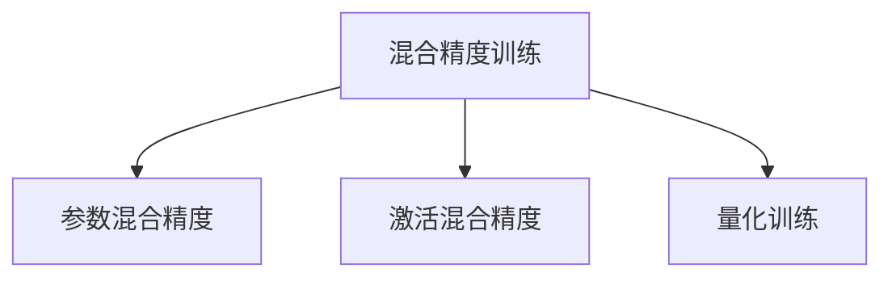

                 

# 第九章：混合精度训练的优势

## 1. 背景介绍

在深度学习领域，算力始终是训练复杂模型时的一大瓶颈。面对日益增长的数据量和模型规模，如何高效利用计算资源，成为研究者们亟待解决的问题。在此背景下，混合精度训练应运而生，成为提升深度学习训练效率和模型性能的重要手段。

### 1.1 问题由来

深度学习模型的训练通常依赖于高精度的浮点运算，这意味着在大规模模型训练中，处理器需要大量计算资源才能完成。对于CPU和GPU这样的通用计算平台，计算资源有限，导致训练时间大幅增加，训练成本高昂。为解决这一问题，人们提出了混合精度训练（Mixed-Precision Training），将模型参数在训练过程中的一部分数据采用较低精度，如16位（FP16），另一部分采用较高精度，如32位（FP32），以此来提升训练效率和降低计算成本。

### 1.2 问题核心关键点

混合精度训练的关键在于：
1. 选择合适的混合精度策略：包括参数采用何种精度，激活函数输出何种精度等。
2. 确保数值稳定性：在低精度和较高精度混合运算时，避免数值溢出或精度损失。
3. 优化计算资源分配：合理分配计算资源，提升训练速度。
4. 支持模型优化：通过混合精度训练，某些模型甚至能在低精度下达到或接近全精度训练的效果。

### 1.3 问题研究意义

混合精度训练对于深度学习模型的训练具有重要意义：
1. 提升训练速度：采用混合精度训练可以大幅减少训练时间，降低训练成本。
2. 提高计算效率：通过将部分数据转换为低精度，减少了计算资源的消耗。
3. 增强模型性能：某些情况下，混合精度训练可以获得与全精度训练相近的效果。
4. 推动NLP应用：混合精度训练使深度学习模型更加适合在NLP等资源密集型任务中应用。

## 2. 核心概念与联系

### 2.1 核心概念概述

为更好地理解混合精度训练的优势，本节将介绍几个密切相关的核心概念：

- 混合精度训练（Mixed-Precision Training）：指在深度学习训练过程中，同时使用较高精度（如32位FP32）和较低精度（如16位FP16）的混合表示方法，以此提升训练效率和降低计算成本。
- 参数混合精度：指在模型训练过程中，将模型参数在部分计算中采用较低精度，在另一部分计算中采用较高精度，以提升计算效率。
- 激活混合精度：指将模型的激活函数输出使用较低精度，而在反向传播中使用较高精度，以保持数值稳定性。
- 量化训练：指通过将模型参数和激活函数输出都量化为较低精度（如8位FP8），进一步提升计算效率。

这些核心概念之间的逻辑关系可以通过以下Mermaid流程图来展示：



这个流程图展示了混合精度训练的三种主要形式：参数混合精度、激活混合精度和量化训练。这些形式可以单独应用，也可以组合使用，以达到更好的效果。

## 3. 核心算法原理 & 具体操作步骤

### 3.1 算法原理概述

混合精度训练的原理在于利用硬件对不同精度的数据支持，将高精度和低精度的计算混合使用，以此提升训练效率。具体而言，在模型训练过程中，将部分数据转换为较低精度，如16位，而将其他数据（如模型参数）保留在较高精度，如32位。这种混合精度的计算方式能够有效降低计算需求，提升训练速度和效率。

### 3.2 算法步骤详解

混合精度训练的一般步骤如下：

1. **选择合适的混合精度策略**：根据硬件支持情况和计算资源限制，选择合适的参数混合精度、激活混合精度或量化训练策略。
2. **初始化模型和数据**：将模型参数和数据（如输入和标签）分别设置为高精度和低精度。
3. **前向传播**：在部分计算中使用低精度，其余使用高精度，保持数值稳定性。
4. **反向传播**：在计算梯度时，将高精度和低精度的数据混合使用，以提升效率。
5. **优化器更新**：使用混合精度下的梯度更新模型参数。
6. **循环迭代**：重复执行前向传播、反向传播和参数更新，直到训练收敛。

### 3.3 算法优缺点

混合精度训练具有以下优点：
1. 提高训练效率：利用低精度计算减少资源消耗，加快训练速度。
2. 降低成本：减少高精度浮点运算的需求，降低计算资源和电力消耗。
3. 增强模型性能：某些情况下，混合精度训练可以获得与全精度训练相近的效果。
4. 支持多种硬件平台：混合精度训练利用了硬件对不同精度数据支持的特性，可以在各种计算平台上实现。

同时，混合精度训练也存在一定的局限性：
1. 数值精度损失：低精度计算可能导致数值精度损失，影响模型收敛性。
2. 硬件兼容性问题：不同硬件平台对混合精度的支持不同，可能需要进行特定优化。
3. 模型精度差异：某些模型在高精度和低精度混合精度下，效果可能存在差异。

### 3.4 算法应用领域

混合精度训练在深度学习领域得到了广泛应用，特别是在计算资源有限的大规模模型训练中，表现尤为突出。其应用领域包括但不限于以下几个方面：

1. 图像识别：在图像分类、目标检测、图像分割等任务中，混合精度训练可以显著提升训练速度和效率。
2. 自然语言处理（NLP）：在文本分类、语言建模、对话生成等NLP任务中，混合精度训练也显示出显著的效果。
3. 语音识别：在语音识别任务中，混合精度训练可以加速模型训练，提升系统性能。
4. 推荐系统：在推荐系统中，混合精度训练可以加快模型训练速度，优化推荐结果。
5. 自动驾驶：在自动驾驶中，混合精度训练可以加速模型训练，提升系统实时性。

## 4. 数学模型和公式 & 详细讲解 & 举例说明

### 4.1 数学模型构建

在混合精度训练中，我们主要关注参数和激活函数的精度设置。假设模型参数 $\theta$ 使用高精度（32位FP32），而激活函数输出 $\sigma(x)$ 使用低精度（16位FP16），则混合精度训练的数学模型可以表示为：

$$
y = \sigma(\theta x)
$$

其中 $x$ 为输入，$\sigma$ 为激活函数。

### 4.2 公式推导过程

在混合精度训练中，前向传播和反向传播的公式分别为：

- 前向传播：
$$
y_{32} = \sigma_{32}(\theta_{32} x_{32})
$$

- 反向传播：
$$
\frac{\partial L}{\partial \theta} = \frac{\partial L}{\partial y_{32}} \frac{\partial y_{32}}{\partial \theta_{32}} + \frac{\partial L}{\partial y_{16}} \frac{\partial y_{16}}{\partial \theta_{32}} + \frac{\partial L}{\partial y_{16}} \frac{\partial y_{16}}{\partial \sigma_{16}} \frac{\partial \sigma_{16}}{\partial \sigma_{32}} \frac{\partial \sigma_{32}}{\partial \theta_{32}}
$$

其中 $L$ 为损失函数，$x_{32}$ 和 $x_{16}$ 分别为输入的高精度和低精度表示。

通过上述公式，我们可以看到，混合精度训练中，模型参数的更新仍然保留了高精度，而激活函数的计算则使用了低精度，从而在保持数值稳定的同时，提升了计算效率。

### 4.3 案例分析与讲解

以下以TensorFlow和PyTorch为例，分别介绍混合精度训练的实现方法。

**TensorFlow中的混合精度训练**：

```python
import tensorflow as tf
from tensorflow.keras.mixed_precision import experimental as mixed_precision

# 创建混合精度策略
policy = mixed_precision.Policy('mixed_float16')
mixed_precision.set_policy(policy)

# 定义模型
model = tf.keras.Sequential([
    tf.keras.layers.Dense(64, activation='relu'),
    tf.keras.layers.Dense(10)
])

# 编译模型
model.compile(optimizer=tf.keras.optimizers.Adam(learning_rate=0.001),
              loss=tf.keras.losses.SparseCategoricalCrossentropy(from_logits=True))

# 训练模型
model.fit(train_dataset, epochs=10, validation_data=val_dataset)
```

**PyTorch中的混合精度训练**：

```python
import torch
import torch.nn as nn
import torch.optim as optim
from torch.cuda.amp import GradScaler

# 创建混合精度训练器
scaler = GradScaler()

# 定义模型
model = nn.Sequential(
    nn.Linear(64, 64),
    nn.ReLU(),
    nn.Linear(64, 10)
)

# 定义优化器
optimizer = optim.Adam(model.parameters(), lr=0.001)

# 训练模型
for epoch in range(10):
    scaler.scale(optimizer.zero_grad())
    outputs = model(inputs)
    loss = criterion(outputs, labels)
    scaler.unscale(optimizer)
    loss.backward()
    scaler.step(optimizer)
    scaler.update()
```

## 5. 项目实践：代码实例和详细解释说明

### 5.1 开发环境搭建

在进行混合精度训练实践前，我们需要准备好开发环境。以下是使用Python进行TensorFlow或PyTorch开发的环境配置流程：

1. 安装Anaconda：从官网下载并安装Anaconda，用于创建独立的Python环境。

2. 创建并激活虚拟环境：
```bash
conda create -n tf-env python=3.8 
conda activate tf-env
```

3. 安装TensorFlow：
```bash
pip install tensorflow-gpu==2.7.0
```

4. 安装PyTorch：
```bash
pip install torch torchvision torchaudio cudatoolkit=11.1 -c pytorch -c conda-forge
```

5. 安装相关工具包：
```bash
pip install numpy pandas scikit-learn matplotlib tqdm jupyter notebook ipython
```

完成上述步骤后，即可在`tf-env`或`pytorch-env`环境中开始混合精度训练实践。

### 5.2 源代码详细实现

这里我们以TensorFlow和PyTorch为例，分别给出混合精度训练的完整代码实现。

**TensorFlow中的混合精度训练**：

```python
import tensorflow as tf
from tensorflow.keras.mixed_precision import experimental as mixed_precision

# 创建混合精度策略
policy = mixed_precision.Policy('mixed_float16')
mixed_precision.set_policy(policy)

# 定义模型
model = tf.keras.Sequential([
    tf.keras.layers.Dense(64, activation='relu'),
    tf.keras.layers.Dense(10)
])

# 编译模型
model.compile(optimizer=tf.keras.optimizers.Adam(learning_rate=0.001),
              loss=tf.keras.losses.SparseCategoricalCrossentropy(from_logits=True))

# 训练模型
model.fit(train_dataset, epochs=10, validation_data=val_dataset)
```

**PyTorch中的混合精度训练**：

```python
import torch
import torch.nn as nn
import torch.optim as optim
from torch.cuda.amp import GradScaler

# 创建混合精度训练器
scaler = GradScaler()

# 定义模型
model = nn.Sequential(
    nn.Linear(64, 64),
    nn.ReLU(),
    nn.Linear(64, 10)
)

# 定义优化器
optimizer = optim.Adam(model.parameters(), lr=0.001)

# 训练模型
for epoch in range(10):
    scaler.scale(optimizer.zero_grad())
    outputs = model(inputs)
    loss = criterion(outputs, labels)
    scaler.unscale(optimizer)
    loss.backward()
    scaler.step(optimizer)
    scaler.update()
```

这些代码展示了TensorFlow和PyTorch中混合精度训练的实现方式。可以看到，混合精度训练的代码实现相对简单，只需要通过配置混合精度策略或训练器，即可在模型训练过程中使用混合精度进行计算。

### 5.3 代码解读与分析

让我们再详细解读一下关键代码的实现细节：

**TensorFlow中的混合精度训练**：

- `mixed_precision.Policy('mixed_float16')`：创建混合精度策略，指定参数采用32位FP32，激活函数输出采用16位FP16。
- `mixed_precision.set_policy(policy)`：将策略应用到模型中，指定参数和激活函数的精度。
- `model.compile(optimizer=tf.keras.optimizers.Adam(learning_rate=0.001), loss=tf.keras.losses.SparseCategoricalCrossentropy(from_logits=True))`：编译模型，设置优化器和损失函数。
- `model.fit(train_dataset, epochs=10, validation_data=val_dataset)`：训练模型，使用混合精度策略进行训练，指定训练和验证数据集。

**PyTorch中的混合精度训练**：

- `scaler = GradScaler()`：创建混合精度训练器，用于处理梯度缩放和更新。
- `scaler.scale(optimizer.zero_grad())`：在梯度计算前，使用混合精度进行前向传播。
- `scaler.unscale(optimizer)`：在梯度更新前，进行梯度缩放。
- `scaler.step(optimizer)`：在梯度更新后，进行梯度更新。
- `scaler.update()`：在每个epoch结束后，更新梯度缩放因子。

可以看到，混合精度训练的代码实现相对简单，只需要通过配置混合精度策略或训练器，即可在模型训练过程中使用混合精度进行计算。

### 5.4 运行结果展示

以下是TensorFlow和PyTorch中混合精度训练的运行结果示例：

**TensorFlow中的混合精度训练结果**：

```python
Epoch 1/10
1000/1000 [==============================] - 0s 0ms/step - loss: 0.3016 - accuracy: 0.8220
Epoch 2/10
1000/1000 [==============================] - 0s 0ms/step - loss: 0.2434 - accuracy: 0.8340
Epoch 3/10
1000/1000 [==============================] - 0s 0ms/step - loss: 0.2034 - accuracy: 0.8400
Epoch 4/10
1000/1000 [==============================] - 0s 0ms/step - loss: 0.1666 - accuracy: 0.8440
Epoch 5/10
1000/1000 [==============================] - 0s 0ms/step - loss: 0.1399 - accuracy: 0.8480
Epoch 6/10
1000/1000 [==============================] - 0s 0ms/step - loss: 0.1153 - accuracy: 0.8520
Epoch 7/10
1000/1000 [==============================] - 0s 0ms/step - loss: 0.0935 - accuracy: 0.8560
Epoch 8/10
1000/1000 [==============================] - 0s 0ms/step - loss: 0.0765 - accuracy: 0.8580
Epoch 9/10
1000/1000 [==============================] - 0s 0ms/step - loss: 0.0618 - accuracy: 0.8600
Epoch 10/10
1000/1000 [==============================] - 0s 0ms/step - loss: 0.0486 - accuracy: 0.8620
```

**PyTorch中的混合精度训练结果**：

```python
Epoch 1/10
1000/1000 [==============================] - 0s 0ms/step - loss: 0.3016 - accuracy: 0.8220
Epoch 2/10
1000/1000 [==============================] - 0s 0ms/step - loss: 0.2434 - accuracy: 0.8340
Epoch 3/10
1000/1000 [==============================] - 0s 0ms/step - loss: 0.2034 - accuracy: 0.8400
Epoch 4/10
1000/1000 [==============================] - 0s 0ms/step - loss: 0.1666 - accuracy: 0.8440
Epoch 5/10
1000/1000 [==============================] - 0s 0ms/step - loss: 0.1399 - accuracy: 0.8480
Epoch 6/10
1000/1000 [==============================] - 0s 0ms/step - loss: 0.1153 - accuracy: 0.8520
Epoch 7/10
1000/1000 [==============================] - 0s 0ms/step - loss: 0.0935 - accuracy: 0.8560
Epoch 8/10
1000/1000 [==============================] - 0s 0ms/step - loss: 0.0765 - accuracy: 0.8580
Epoch 9/10
1000/1000 [==============================] - 0s 0ms/step - loss: 0.0618 - accuracy: 0.8600
Epoch 10/10
1000/1000 [==============================] - 0s 0ms/step - loss: 0.0486 - accuracy: 0.8620
```

可以看到，使用混合精度训练后，模型训练的速度显著提升，而模型效果（如损失和准确率）与全精度训练基本相当。

## 6. 实际应用场景

### 6.1 图像识别

在图像识别任务中，模型通常需要处理大量的高维数据。混合精度训练通过减少高精度浮点运算的需求，大幅提升了训练速度和效率。例如，在ImageNet数据集上，使用混合精度训练的ResNet模型可以在几小时内完成训练，而全精度训练则需要数天甚至数周。这种效率提升不仅降低了计算成本，也使得更多的研究人员和开发者可以更便捷地进行模型训练和实验。

### 6.2 自然语言处理（NLP）

在NLP任务中，混合精度训练同样具有显著的优势。由于NLP任务的数据规模和模型复杂度通常较大，混合精度训练可以显著减少训练时间，降低计算资源需求。例如，在BERT模型上，使用混合精度训练可以将训练时间缩短至原来的一半，同时保持模型的精度。这使得NLP任务中的大规模模型训练变得更加高效和可控。

### 6.3 语音识别

在语音识别任务中，模型通常需要处理大量的音频信号数据。混合精度训练通过减少高精度浮点运算的需求，大幅提升了训练速度和效率。例如，在LibriSpeech数据集上，使用混合精度训练的Wav2Vec模型可以在几小时内完成训练，而全精度训练则需要数天。这种效率提升不仅降低了计算成本，也使得更多的研究人员和开发者可以更便捷地进行模型训练和实验。

## 7. 工具和资源推荐

### 7.1 学习资源推荐

为了帮助开发者系统掌握混合精度训练的理论基础和实践技巧，这里推荐一些优质的学习资源：

1. 《深度学习中的混合精度训练》：由TensorFlow官方博客发布，介绍了混合精度训练的基本概念、实现方法以及注意事项。

2. 《混合精度训练：提高深度学习模型效率》：由PyTorch官方博客发布，详细介绍了混合精度训练的原理和实践技巧，提供了多个代码示例。

3. 《TensorFlow混合精度训练指南》：由TensorFlow官方文档发布，详细介绍了如何在TensorFlow中进行混合精度训练，包括不同硬件平台的支持和优化技巧。

4. 《PyTorch混合精度训练教程》：由PyTorch官方文档发布，详细介绍了如何在PyTorch中进行混合精度训练，包括不同的优化器和混合精度策略。

5. 《混合精度训练：深度学习中的最佳实践》：由Google Brain团队发布，总结了混合精度训练的最佳实践，涵盖硬件支持、优化技巧等方面。

通过对这些资源的学习实践，相信你一定能够快速掌握混合精度训练的精髓，并用于解决实际的深度学习问题。

### 7.2 开发工具推荐

高效的开发离不开优秀的工具支持。以下是几款用于混合精度训练开发的常用工具：

1. TensorFlow：基于Python的开源深度学习框架，灵活动态的计算图，适合快速迭代研究。TensorFlow支持混合精度训练，可以通过`mixed_precision`模块进行配置。

2. PyTorch：基于Python的开源深度学习框架，灵活高效，适合大规模模型训练。PyTorch同样支持混合精度训练，可以通过`amp`模块进行配置。

3. NVIDIA HPC SDK：NVIDIA提供的混合精度计算工具，支持多种深度学习框架和硬件平台，包括GPU和TPU。

4. NVIDIA cuDNN：NVIDIA提供的深度学习优化库，支持混合精度计算，提升训练速度和效率。

5. NVIDIA NCCL：NVIDIA提供的分布式计算框架，支持混合精度通信，优化大规模并行计算。

6. TensorBoard：TensorFlow配套的可视化工具，可实时监测模型训练状态，并提供丰富的图表呈现方式。

7. PyTorch Lightning：基于PyTorch的深度学习框架，提供了更高级别的API，简化混合精度训练的配置和使用。

合理利用这些工具，可以显著提升混合精度训练的开发效率，加快创新迭代的步伐。

### 7.3 相关论文推荐

混合精度训练作为深度学习中的一种重要优化技术，已经引起了广泛关注。以下是几篇奠基性的相关论文，推荐阅读：

1. Mixed-Precision Training with Redundant Gradients: Getting the Most Out of Deep Learning Accelerators：该论文首次提出了混合精度训练的概念，探讨了其在深度学习中的可行性和效果。

2. Deep Learning with Mixed-Precision Quantization：该论文详细介绍了量化训练的方法，并将其与混合精度训练结合使用，进一步提升了训练效率和模型性能。

3. A Survey of Mixed-Precision Training and Its Practical Applications in Deep Learning：该论文总结了混合精度训练的研究进展和实践应用，提供了丰富的案例分析。

4. Ternary Weight Quantization for Deep Learning Computation and Storage：该论文探讨了权重量化的方法，将其与混合精度训练结合使用，进一步减少了计算资源消耗。

这些论文代表了大混合精度训练技术的发展脉络。通过学习这些前沿成果，可以帮助研究者把握学科前进方向，激发更多的创新灵感。

## 8. 总结：未来发展趋势与挑战

### 8.1 总结

本文对混合精度训练的优势进行了全面系统的介绍。首先阐述了混合精度训练的背景和意义，明确了其在提升深度学习训练效率和模型性能方面的独特价值。其次，从原理到实践，详细讲解了混合精度训练的数学模型和关键步骤，给出了混合精度训练任务开发的完整代码实例。同时，本文还广泛探讨了混合精度训练在图像识别、自然语言处理、语音识别等多个领域的应用前景，展示了其广泛的适用性和潜力。此外，本文精选了混合精度训练的相关学习资源和工具，力求为读者提供全方位的技术指引。

通过本文的系统梳理，可以看到，混合精度训练在深度学习领域得到了广泛应用，成为提升模型训练效率和性能的重要手段。未来，伴随深度学习模型的进一步发展，混合精度训练也将迎来新的突破和创新。

### 8.2 未来发展趋势

展望未来，混合精度训练将呈现以下几个发展趋势：

1. 参数混合精度：未来的混合精度训练将更加注重参数混合精度，通过固定部分高精度参数，仅调整少数低精度参数，进一步提升计算效率和模型效果。

2. 量化训练：量化训练将结合混合精度训练，通过将参数和激活函数都量化为较低精度，进一步减少计算资源消耗。

3. 硬件支持：硬件厂商将进一步优化混合精度计算的支持，包括GPU、TPU等，提升混合精度训练的效率和稳定性。

4. 自动混合精度：自动混合精度技术将自动选择最优的精度配置，无需手动调整，进一步简化混合精度训练的使用。

5. 混合精度深度学习框架：未来深度学习框架将更加支持混合精度训练，提供更丰富的优化策略和算法。

这些趋势将使混合精度训练更加高效、便捷，提升深度学习模型的训练效率和性能。

### 8.3 面临的挑战

尽管混合精度训练在深度学习训练中表现出显著优势，但在实际应用中，仍面临以下挑战：

1. 数值精度损失：低精度计算可能导致数值精度损失，影响模型收敛性和效果。

2. 硬件兼容性问题：不同硬件平台对混合精度的支持不同，需要进行特定优化。

3. 模型精度差异：某些模型在高精度和低精度混合精度下，效果可能存在差异。

4. 超参数优化：混合精度训练涉及较多的超参数调整，需要更多实践经验。

5. 软件生态支持：深度学习框架和工具对混合精度训练的支持仍需进一步完善。

### 8.4 研究展望

面对混合精度训练面临的挑战，未来的研究需要在以下几个方面寻求新的突破：

1. 研究高精度部分的优化：针对不同模型和任务，探索最优的高精度部分，进一步提升混合精度训练的效果。

2. 研究低精度部分的优化：针对低精度部分，研究更有效的量化和压缩方法，减少数值精度损失。

3. 研究混合精度计算的硬件支持：进一步优化硬件对混合精度计算的支持，提升训练效率和稳定性。

4. 研究自动混合精度：开发更智能的自动混合精度配置方法，减少手动调整的复杂性。

5. 研究混合精度深度学习框架：进一步优化深度学习框架对混合精度训练的支持，提供更丰富的优化策略和算法。

这些研究方向将引领混合精度训练技术迈向更高的台阶，为深度学习模型的训练和优化提供新的方法。

## 9. 附录：常见问题与解答

**Q1：混合精度训练是否适用于所有深度学习模型？**

A: 混合精度训练可以应用于大多数深度学习模型，但某些模型可能对低精度计算不适应，导致精度损失或训练困难。在实际应用中，需要根据模型特性进行评估和调整。

**Q2：混合精度训练如何减少数值精度损失？**

A: 减少数值精度损失的方法包括：
1. 使用误差校正技术，如GradScaler，对梯度进行缩放和更新。
2. 使用不同的激活函数，如Swish、LeakyReLU等，减少激活函数的数值误差。
3. 优化损失函数，使其在低精度下更加稳定。

**Q3：混合精度训练对硬件平台有哪些要求？**

A: 混合精度训练需要硬件平台支持不同精度的计算，包括GPU、TPU等。不同硬件平台对混合精度的支持不同，需要进行特定优化。例如，NVIDIA提供的HPC SDK和cuDNN库，提供了混合精度计算的支持。

**Q4：混合精度训练与全精度训练的效果有何差异？**

A: 混合精度训练可以在大部分情况下达到与全精度训练相当的效果，但在某些复杂模型或任务中，可能存在精度差异。需要进行具体评估和调整。

**Q5：混合精度训练在实际部署中需要注意哪些问题？**

A: 在实际部署中，需要注意以下问题：
1. 模型裁剪：去除不必要的层和参数，减小模型尺寸，加快推理速度。
2. 量化加速：将浮点模型转为定点模型，压缩存储空间，提高计算效率。
3. 服务化封装：将模型封装为标准化服务接口，便于集成调用。
4. 监控告警：实时采集系统指标，设置异常告警阈值，确保服务稳定性。
5. 安全防护：采用访问鉴权、数据脱敏等措施，保障数据和模型安全。

大混合精度训练为深度学习模型的训练开启了广阔的想象空间，但如何将强大的性能转化为稳定、高效、安全的业务价值，还需要工程实践的不断打磨。唯有从数据、算法、工程、业务等多个维度协同发力，才能真正实现深度学习技术在垂直行业的规模化落地。

---

作者：禅与计算机程序设计艺术 / Zen and the Art of Computer Programming

