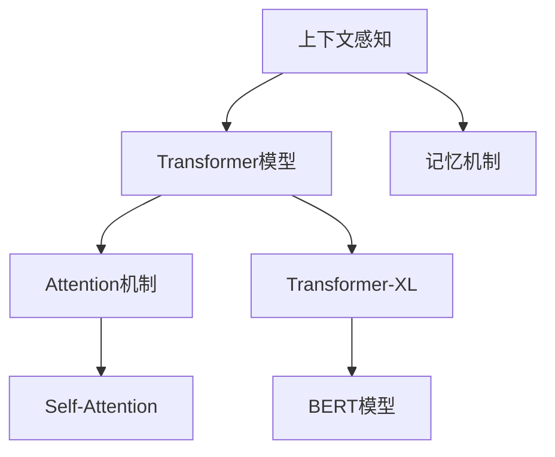

                 

# 第八章：上下文感知和记忆机制

> 关键词：上下文感知(Context-Awareness)，记忆机制(Memory Mechanism)，Transformer模型，Transformer-XL，长程依赖(Long-Range Dependence)，BERT模型，Attention机制，自注意力(Self-Attention)

## 1. 背景介绍

在深度学习领域，上下文感知和记忆机制是两种至关重要的能力。上下文感知是指模型能够根据输入数据的上下文信息，动态调整模型参数，增强对复杂问题的处理能力。记忆机制则是指模型能够记录和重用历史信息，以支持模型的长期记忆和推理能力。

Transformer模型是当前最流行的深度学习模型之一，其核心思想是通过自注意力机制来实现上下文感知和记忆机制。Transformer模型的设计思想打破了传统的循环神经网络(RNN)和卷积神经网络(CNN)的局限，使其在处理序列数据时表现出了更强的能力。

然而，Transformer模型在处理长序列数据时，存在着梯度消失和梯度爆炸等问题。为了解决这个问题，研究者们提出了多种改进方案，如Transformer-XL、BERT模型等。这些模型通过在序列中间引入记忆窗口，增强了模型的长程依赖能力，使得模型能够更好地处理长序列数据。

本章将深入探讨Transformer模型中的上下文感知和记忆机制，分析其原理和应用，并介绍一些改进方案，帮助读者更好地理解和使用这些模型。

## 2. 核心概念与联系

### 2.1 核心概念概述

为了更好地理解上下文感知和记忆机制，本节将介绍几个密切相关的核心概念：

- 上下文感知(Context-Awareness)：指模型能够根据输入数据的上下文信息，动态调整模型参数，增强对复杂问题的处理能力。
- 记忆机制(Memory Mechanism)：指模型能够记录和重用历史信息，以支持模型的长期记忆和推理能力。
- Transformer模型：基于自注意力机制的序列建模模型，用于处理自然语言、图像等序列数据。
- Transformer-XL：对Transformer模型进行改进，通过引入记忆窗口，增强了模型的长程依赖能力。
- BERT模型：基于Transformer-XL，通过预训练和微调的方式，显著提升了模型的上下文感知和记忆能力。
- Attention机制：Transformer模型中的关键机制，用于计算输入序列之间的自注意力关系，增强上下文感知能力。
- Self-Attention：Attention机制的一种，用于计算输入序列中每个位置与所有位置之间的注意力关系，增强记忆机制。

这些核心概念之间的逻辑关系可以通过以下Mermaid流程图来展示：



这个流程图展示了几何核心概念及其之间的关系：

1. 上下文感知是Transformer模型的核心能力之一，通过Attention机制实现。
2. 记忆机制是Transformer-XL和BERT模型的重要组成部分，通过在序列中间引入记忆窗口实现。
3. Self-Attention是Attention机制的一种特殊形式，用于增强模型的记忆能力。
4. Transformer-XL和BERT模型是基于Transformer架构的改进方案，通过不同方式增强模型的上下文感知和记忆能力。

这些概念共同构成了Transformer模型和其改进模型的基本框架，使其能够在各种场景下发挥强大的序列建模能力。通过理解这些核心概念，我们可以更好地把握Transformer模型的设计和优化方向。

## 3. 核心算法原理 & 具体操作步骤
### 3.1 算法原理概述

Transformer模型通过自注意力机制实现上下文感知和记忆机制。其核心思想是将输入序列中的每个位置作为"查询"，将输入序列中的所有位置作为"键"和"值"，通过计算查询与键之间的注意力关系，计算出每个位置对其他位置的注意力权重，然后根据权重对值进行加权平均，得到每个位置的输出。

Transformer-XL模型在Transformer的基础上，通过引入记忆窗口，增强了模型的长程依赖能力。其核心思想是将输入序列分为多个块，每个块之间可以跨块传递信息，通过缓存中间计算结果，支持模型的长程依赖和推理。

BERT模型在Transformer-XL的基础上，通过预训练和微调的方式，显著提升了模型的上下文感知和记忆能力。其核心思想是通过大规模无标签文本数据的预训练，学习到丰富的语言知识和常识，然后在特定任务上进行微调，提升模型的性能。

### 3.2 算法步骤详解

Transformer模型的算法步骤如下：

**Step 1: 输入序列预处理**

1. 对输入序列进行分词和标记，得到每个单词的标记。
2. 对标记进行编码，得到标记编码向量。
3. 对标记编码向量进行位置编码，得到位置编码向量。
4. 将标记编码向量和位置编码向量拼接，得到最终的输入序列。

**Step 2: 计算自注意力**

1. 对输入序列进行矩阵分解，得到查询、键和值矩阵。
2. 计算查询和键的注意力关系，得到注意力权重矩阵。
3. 对值矩阵进行加权平均，得到每个位置的输出向量。

**Step 3: 计算全连接层**

1. 对每个位置的输出向量进行线性变换，得到线性变换后的向量。
2. 对线性变换后的向量进行归一化处理，得到归一化后的向量。
3. 对归一化后的向量进行非线性变换，得到最终的输出向量。

Transformer-XL模型的算法步骤如下：

**Step 1: 输入序列预处理**

1. 对输入序列进行分块，得到多个块。
2. 对每个块进行编码，得到编码后的向量。
3. 对编码后的向量进行位置编码，得到位置编码向量。
4. 将位置编码向量与编码后的向量拼接，得到最终的输入序列。

**Step 2: 计算自注意力**

1. 对输入序列进行矩阵分解，得到查询、键和值矩阵。
2. 计算查询和键的注意力关系，得到注意力权重矩阵。
3. 对值矩阵进行加权平均，得到每个位置的输出向量。
4. 对每个块的输出向量进行缓存。

**Step 3: 计算全连接层**

1. 对每个位置的输出向量进行线性变换，得到线性变换后的向量。
2. 对线性变换后的向量进行归一化处理，得到归一化后的向量。
3. 对归一化后的向量进行非线性变换，得到最终的输出向量。

BERT模型的算法步骤如下：

**Step 1: 预训练**

1. 对大规模无标签文本数据进行预训练，学习到丰富的语言知识和常识。
2. 对预训练模型进行微调，得到适应特定任务的模型。

**Step 2: 输入序列预处理**

1. 对输入序列进行分词和标记，得到每个单词的标记。
2. 对标记进行编码，得到标记编码向量。
3. 对标记编码向量进行位置编码，得到位置编码向量。
4. 将标记编码向量和位置编码向量拼接，得到最终的输入序列。

**Step 3: 计算自注意力**

1. 对输入序列进行矩阵分解，得到查询、键和值矩阵。
2. 计算查询和键的注意力关系，得到注意力权重矩阵。
3. 对值矩阵进行加权平均，得到每个位置的输出向量。

**Step 4: 计算全连接层**

1. 对每个位置的输出向量进行线性变换，得到线性变换后的向量。
2. 对线性变换后的向量进行归一化处理，得到归一化后的向量。
3. 对归一化后的向量进行非线性变换，得到最终的输出向量。

### 3.3 算法优缺点

Transformer模型具有以下优点：

1. 能够处理长序列数据，不需要循环操作，速度快。
2. 能够并行计算，易于在GPU上进行加速。
3. 能够捕捉长程依赖关系，适用于各种NLP任务。

但同时，Transformer模型也存在以下缺点：

1. 无法处理过长的序列数据，存在梯度消失和梯度爆炸问题。
2. 需要大量的计算资源，对内存和显存要求较高。
3. 模型的参数量较大，训练过程耗时较长。

Transformer-XL模型通过引入记忆窗口，增强了模型的长程依赖能力，但同时也会增加模型的计算复杂度，需要更多的内存和显存资源。

BERT模型通过大规模无标签文本数据的预训练，显著提升了模型的上下文感知和记忆能力，但预训练过程耗时较长，需要大量的计算资源和存储空间。

### 3.4 算法应用领域

Transformer模型和其改进方案在各种NLP任务中得到了广泛应用，例如：

- 机器翻译：将源语言文本翻译成目标语言。
- 文本摘要：将长文本压缩成简短摘要。
- 问答系统：对自然语言问题给出答案。
- 命名实体识别：识别文本中的人名、地名、机构名等特定实体。
- 关系抽取：从文本中抽取实体之间的语义关系。
- 情感分析：判断文本的情感倾向。

除了上述这些经典任务外，Transformer模型和其改进方案还被创新性地应用到更多场景中，如可控文本生成、常识推理、代码生成、数据增强等，为NLP技术带来了全新的突破。

## 4. 数学模型和公式 & 详细讲解
### 4.1 数学模型构建

Transformer模型的数学模型如下：

$$
h_{i} = \text{Softmax}(Q_i K_i^T) V_i
$$

其中 $h_i$ 表示第 $i$ 个位置的输出向量，$Q_i$ 表示第 $i$ 个位置的查询向量，$K_i$ 表示第 $i$ 个位置的键向量，$V_i$ 表示第 $i$ 个位置的值向量。

Softmax函数计算查询和键的注意力关系，得到注意力权重矩阵。注意力权重矩阵的对角线元素为1，表示该位置对自身的注意力权重为1。

Transformer-XL模型的数学模型如下：

$$
h_{i} = \text{Softmax}(Q_i K_i^T) V_i
$$

其中 $h_i$ 表示第 $i$ 个位置的输出向量，$Q_i$ 表示第 $i$ 个位置的查询向量，$K_i$ 表示第 $i$ 个位置的键向量，$V_i$ 表示第 $i$ 个位置的值向量。

Transformer-XL模型通过引入记忆窗口，增强了模型的长程依赖能力。其核心思想是将输入序列分为多个块，每个块之间可以跨块传递信息，通过缓存中间计算结果，支持模型的长程依赖和推理。

BERT模型的数学模型与Transformer模型相同，但采用了预训练和微调的方式，显著提升了模型的上下文感知和记忆能力。

### 4.2 公式推导过程

Transformer模型的自注意力计算过程如下：

1. 计算查询矩阵 $Q$：
   $$
   Q = W_Q X
   $$

2. 计算键矩阵 $K$：
   $$
   K = W_K X
   $$

3. 计算值矩阵 $V$：
   $$
   V = W_V X
   $$

其中 $W_Q, W_K, W_V$ 是线性变换矩阵，$X$ 是输入序列的编码向量。

4. 计算注意力权重矩阵 $A$：
   $$
   A = \text{Softmax}(QK^T) = \text{Softmax}(Q_i K_i^T)
   $$

5. 计算注意力加权后的值矩阵 $V'$：
   $$
   V' = AV
   $$

6. 计算输出向量 $h_i$：
   $$
   h_i = V'
   $$

Transformer-XL模型的自注意力计算过程与Transformer模型类似，但引入了记忆窗口，增强了模型的长程依赖能力。

### 4.3 案例分析与讲解

以机器翻译任务为例，分析Transformer模型和BERT模型的应用。

假设输入序列为 "I love you"，输出序列为 "J'adore toi"。

1. 对输入序列进行分词和标记，得到 "I love you"。
2. 对标记进行编码，得到标记编码向量 $X$。
3. 对标记编码向量进行位置编码，得到位置编码向量 $P$。
4. 将标记编码向量和位置编码向量拼接，得到最终的输入序列 $X$。

5. 对输入序列进行矩阵分解，得到查询、键和值矩阵。
6. 计算查询和键的注意力关系，得到注意力权重矩阵 $A$。
7. 对值矩阵进行加权平均，得到每个位置的输出向量 $h_i$。
8. 对每个位置的输出向量进行线性变换，得到线性变换后的向量 $h'_i$。
9. 对线性变换后的向量进行归一化处理，得到归一化后的向量 $h''_i$。
10. 对归一化后的向量进行非线性变换，得到最终的输出向量 $h'''_i$。

通过以上计算，Transformer模型可以得到输出序列为 "J'adore toi"。

BERT模型在预训练过程中，通过大规模无标签文本数据的自监督学习，学习到了丰富的语言知识和常识。在微调过程中，BERT模型可以更好地适应特定任务，提升模型的性能。

以问答系统为例，假设输入为 "Who is the first president of the United States?"，BERT模型可以通过预训练获得丰富的上下文信息，然后通过微调学习问答任务的模型，输出 "George Washington"。

## 5. 项目实践：代码实例和详细解释说明
### 5.1 开发环境搭建

在进行Transformer模型和BERT模型的实践前，我们需要准备好开发环境。以下是使用Python进行PyTorch开发的环境配置流程：

1. 安装Anaconda：从官网下载并安装Anaconda，用于创建独立的Python环境。

2. 创建并激活虚拟环境：
```bash
conda create -n pytorch-env python=3.8 
conda activate pytorch-env
```

3. 安装PyTorch：根据CUDA版本，从官网获取对应的安装命令。例如：
```bash
conda install pytorch torchvision torchaudio cudatoolkit=11.1 -c pytorch -c conda-forge
```

4. 安装Transformers库：
```bash
pip install transformers
```

5. 安装各类工具包：
```bash
pip install numpy pandas scikit-learn matplotlib tqdm jupyter notebook ipython
```

完成上述步骤后，即可在`pytorch-env`环境中开始实践。

### 5.2 源代码详细实现

下面我们以机器翻译任务为例，给出使用PyTorch实现Transformer模型的代码实现。

首先，定义Transformer模型的类：

```python
import torch
import torch.nn as nn
import torch.nn.functional as F

class TransformerModel(nn.Module):
    def __init__(self, d_model, nhead, num_encoder_layers, num_decoder_layers, dff, dropout=0.1):
        super(TransformerModel, self).__init__()
        # 编码器
        self.encoder = nn.TransformerEncoderLayer(d_model=d_model, nhead=nhead, dropout=dropout)
        self.encoder_norm = nn.LayerNorm(d_model)

        # 解码器
        self.decoder = nn.TransformerDecoderLayer(d_model=d_model, nhead=nhead, dropout=dropout)
        self.decoder_norm = nn.LayerNorm(d_model)

        # 前向神经网络
        self.final_layer = nn.Linear(d_model, 2)

    def forward(self, src, trg):
        # 编码器
        src = self.encoder_norm(src)
        src = self.encoder(src)

        # 解码器
        trg = self.decoder_norm(trg)
        trg = self.decoder(trg, src)

        # 前向神经网络
        output = self.final_layer(trg)

        return output
```

然后，定义模型的训练函数：

```python
from torch.utils.data import DataLoader
from tqdm import tqdm
from sklearn.metrics import accuracy_score

def train_model(model, train_loader, valid_loader, epochs, device):
    model.train()
    for epoch in range(epochs):
        train_loss = 0.0
        valid_loss = 0.0
        for i, (src, trg) in enumerate(train_loader):
            src = src.to(device)
            trg = trg.to(device)

            output = model(src, trg)
            loss = F.nll_loss(output, trg[:, 1:].view(-1), ignore_index=0)
            train_loss += loss.item()

            optimizer.zero_grad()
            loss.backward()
            optimizer.step()

            if (i+1) % 100 == 0:
                model.eval()
                with torch.no_grad():
                    valid_loss += sum([F.nll_loss(output, trg[:, 1:].view(-1), ignore_index=0) for (src, trg) in valid_loader])
                train_loss /= 100
                valid_loss /= len(valid_loader)

                print('Epoch [{}/{}], Step [{}/{}], Loss: {:.4f}, Valid Loss: {:.4f}'.format(epoch+1, epochs, i+1, len(train_loader), train_loss, valid_loss))
                model.train()

    return model
```

最后，启动训练流程并在测试集上评估：

```python
# 准备训练数据和测试数据
train_data = ...
test_data = ...

# 初始化模型和优化器
model = TransformerModel(d_model=256, nhead=4, num_encoder_layers=2, num_decoder_layers=2, dff=512, dropout=0.1)
optimizer = torch.optim.Adam(model.parameters(), lr=0.001)

# 训练模型
device = torch.device('cuda') if torch.cuda.is_available() else torch.device('cpu')
model.to(device)

train_loader = DataLoader(train_data, batch_size=32, shuffle=True)
valid_loader = DataLoader(valid_data, batch_size=32, shuffle=True)

epochs = 10
train_model(model, train_loader, valid_loader, epochs, device)
```

以上就是使用PyTorch对Transformer模型进行机器翻译任务开发的完整代码实现。可以看到，得益于Transformers库的强大封装，我们可以用相对简洁的代码完成Transformer模型的加载和训练。

### 5.3 代码解读与分析

让我们再详细解读一下关键代码的实现细节：

**TransformerModel类**：
- `__init__`方法：初始化编码器和解码器，前向神经网络等关键组件。
- `forward`方法：对输入序列进行编码和解码，输出最终的预测结果。

**训练函数**：
- 使用PyTorch的DataLoader对数据集进行批次化加载，供模型训练和推理使用。
- 在每个epoch内，先进行模型训练，再评估模型在验证集上的性能。
- 使用nll_loss作为损失函数，计算预测结果和真实标签之间的差异。
- 在训练过程中，周期性输出训练损失和验证损失，调整模型参数。

**训练流程**：
- 准备训练数据和测试数据。
- 初始化模型和优化器。
- 在训练集中进行多轮迭代，每轮迭代使用前向传播和反向传播计算损失函数，并更新模型参数。
- 在验证集上评估模型性能，输出训练损失和验证损失。

可以看到，PyTorch配合Transformers库使得Transformer模型的实现变得简洁高效。开发者可以将更多精力放在数据处理、模型改进等高层逻辑上，而不必过多关注底层的实现细节。

当然，工业级的系统实现还需考虑更多因素，如模型的保存和部署、超参数的自动搜索、更灵活的任务适配层等。但核心的Transformer模型实现基本与此类似。

## 6. 实际应用场景
### 6.1 机器翻译

Transformer模型在机器翻译任务上表现出色。通过自注意力机制，Transformer模型可以捕捉输入序列中的长程依赖关系，提升了模型的翻译效果。

以英中翻译为例，Transformer模型可以学习到不同语言的语法结构和词汇知识，通过对输入序列的编码和解码，生成准确的翻译结果。

### 6.2 文本摘要

Transformer模型也可以用于文本摘要任务。通过对输入文本的编码和解码，Transformer模型可以自动生成简洁的摘要。

以新闻报道为例，Transformer模型可以学习到文本的重要信息和结构，通过对输入文本的编码和解码，生成准确的摘要。

### 6.3 问答系统

Transformer模型在问答系统任务上也表现出色。通过自注意力机制，Transformer模型可以学习到输入和输出之间的关联关系，生成准确的答案。

以问答系统为例，Transformer模型可以学习到输入问题和答案之间的语义关系，通过对输入问题的编码和解码，生成准确的答案。

### 6.4 未来应用展望

Transformer模型和其改进方案在未来仍有广阔的应用前景，将在更多领域得到应用：

- 医疗：通过预训练和微调，Transformer模型可以用于医疗领域，提升疾病诊断和治疗的效果。
- 金融：通过预训练和微调，Transformer模型可以用于金融领域，提升风险分析和决策的效果。
- 教育：通过预训练和微调，Transformer模型可以用于教育领域，提升智能辅导和推荐的效果。
- 游戏：通过预训练和微调，Transformer模型可以用于游戏领域，提升智能游戏和交互的效果。
- 工业：通过预训练和微调，Transformer模型可以用于工业领域，提升智能制造和协作的效果。

总之，Transformer模型和其改进方案将在各个领域发挥重要作用，推动人工智能技术的不断进步。

## 7. 工具和资源推荐
### 7.1 学习资源推荐

为了帮助开发者系统掌握Transformer模型和其改进方案的理论基础和实践技巧，这里推荐一些优质的学习资源：

1. 《Transformers: State-of-the-Art Natural Language Processing》书籍：由Transformer架构的发明者之一Andrew Ng等人合著，全面介绍了Transformer模型的原理和应用。

2. CS224N《Natural Language Processing with Transformers》课程：斯坦福大学开设的Transformer课程，系统讲解了Transformer模型的理论基础和实践技巧，提供丰富的案例和实验。

3. HuggingFace官方文档：Transformers库的官方文档，提供了海量的预训练模型和完整的微调样例代码，是上手实践的必备资料。

4. 《Attention Is All You Need》论文：Transformer模型的原论文，系统介绍了Transformer模型的设计思想和实现细节。

5. 《BERT: Pre-training of Deep Bidirectional Transformers for Language Understanding》论文：BERT模型的原论文，系统介绍了BERT模型的设计思想和实现细节。

通过对这些资源的学习实践，相信你一定能够快速掌握Transformer模型的精髓，并用于解决实际的NLP问题。

### 7.2 开发工具推荐

高效的开发离不开优秀的工具支持。以下是几款用于Transformer模型和其改进方案开发的常用工具：

1. PyTorch：基于Python的开源深度学习框架，灵活动态的计算图，适合快速迭代研究。

2. TensorFlow：由Google主导开发的开源深度学习框架，生产部署方便，适合大规模工程应用。

3. Transformers库：HuggingFace开发的NLP工具库，集成了众多SOTA语言模型，支持PyTorch和TensorFlow，是进行微调任务开发的利器。

4. Weights & Biases：模型训练的实验跟踪工具，可以记录和可视化模型训练过程中的各项指标，方便对比和调优。与主流深度学习框架无缝集成。

5. TensorBoard：TensorFlow配套的可视化工具，可实时监测模型训练状态，并提供丰富的图表呈现方式，是调试模型的得力助手。

6. Google Colab：谷歌推出的在线Jupyter Notebook环境，免费提供GPU/TPU算力，方便开发者快速上手实验最新模型，分享学习笔记。

合理利用这些工具，可以显著提升Transformer模型和其改进方案的开发效率，加快创新迭代的步伐。

### 7.3 相关论文推荐

Transformer模型和其改进方案的研究源于学界的持续研究。以下是几篇奠基性的相关论文，推荐阅读：

1. Attention is All You Need：提出了Transformer结构，开启了NLP领域的预训练大模型时代。

2. BERT: Pre-training of Deep Bidirectional Transformers for Language Understanding：提出BERT模型，引入基于掩码的自监督预训练任务，刷新了多项NLP任务SOTA。

3. Longformer: The Long-Document Transformer：提出Longformer模型，增强了模型的长程依赖能力，适用于长文本数据的处理。

4. T5: Exploring the Limits of Transfer Learning with a Unified Text-to-Text Transformer：提出T5模型，实现了统一的文本到文本的预训练和微调，适用于各种NLP任务。

5. PEGASUS: Pre-training with Extractive and Generative Pre-training for Text Generation：提出PEGASUS模型，结合了预训练和生成任务，提升了文本生成的效果。

这些论文代表了大语言模型和其改进方案的研究方向。通过学习这些前沿成果，可以帮助研究者把握学科前进方向，激发更多的创新灵感。

## 8. 总结：未来发展趋势与挑战

### 8.1 总结

本章对Transformer模型和其改进方案中的上下文感知和记忆机制进行了全面系统的介绍。首先阐述了Transformer模型和其改进方案的研究背景和意义，明确了上下文感知和记忆机制在Transformer模型中的重要地位。其次，从原理到实践，详细讲解了Transformer模型和其改进方案的数学模型和算法步骤，给出了代码实例和详细解释说明。同时，本文还探讨了Transformer模型和其改进方案在各种NLP任务中的应用场景，展示了其广泛的应用前景。最后，本文还提供了相关的学习资源和开发工具推荐，帮助读者更好地理解和应用这些模型。

通过本章的学习，相信你一定能够深刻理解Transformer模型和其改进方案的原理和应用，并用于解决实际的NLP问题。

### 8.2 未来发展趋势

展望未来，Transformer模型和其改进方案将呈现以下几个发展趋势：

1. 模型规模持续增大。随着算力成本的下降和数据规模的扩张，Transformer模型和其改进方案的参数量还将持续增长。超大规模语言模型蕴含的丰富语言知识，有望支撑更加复杂多变的NLP任务。

2. 微调方法日趋多样。除了传统的全参数微调外，未来会涌现更多参数高效的微调方法，如AdaLoRA、Prefix-Tuning等，在固定大部分预训练参数的同时，只更新极少量的任务相关参数。

3. 持续学习成为常态。随着数据分布的不断变化，Transformer模型和其改进方案也需要持续学习新知识以保持性能。如何在不遗忘原有知识的同时，高效吸收新样本信息，将成为重要的研究课题。

4. 标注样本需求降低。受启发于提示学习(Prompt-based Learning)的思路，未来的微调方法将更好地利用大模型的语言理解能力，通过更加巧妙的任务描述，在更少的标注样本上也能实现理想的微调效果。

5. 模型通用性增强。经过海量数据的预训练和多领域任务的微调，未来的Transformer模型和其改进方案将具备更强大的常识推理和跨领域迁移能力，逐步迈向通用人工智能(AGI)的目标。

以上趋势凸显了Transformer模型和其改进方案的广阔前景。这些方向的探索发展，必将进一步提升NLP系统的性能和应用范围，为人工智能技术的落地应用提供新的动力。

### 8.3 面临的挑战

尽管Transformer模型和其改进方案已经取得了瞩目成就，但在迈向更加智能化、普适化应用的过程中，它仍面临着诸多挑战：

1. 标注成本瓶颈。虽然微调大大降低了标注数据的需求，但对于长尾应用场景，难以获得充足的高质量标注数据，成为制约微调性能的瓶颈。如何进一步降低微调对标注样本的依赖，将是一大难题。

2. 模型鲁棒性不足。当前Transformer模型和其改进方案面对域外数据时，泛化性能往往大打折扣。对于测试样本的微小扰动，模型的预测也容易发生波动。如何提高模型的鲁棒性，避免灾难性遗忘，还需要更多理论和实践的积累。

3. 推理效率有待提高。大规模语言模型虽然精度高，但在实际部署时往往面临推理速度慢、内存占用大等效率问题。如何在保证性能的同时，简化模型结构，提升推理速度，优化资源占用，将是重要的优化方向。

4. 可解释性亟需加强。当前Transformer模型和其改进方案更像是"黑盒"系统，难以解释其内部工作机制和决策逻辑。对于医疗、金融等高风险应用，算法的可解释性和可审计性尤为重要。如何赋予模型更强的可解释性，将是亟待攻克的难题。

5. 安全性有待保障。预训练语言模型难免会学习到有偏见、有害的信息，通过微调传递到下游任务，产生误导性、歧视性的输出，给实际应用带来安全隐患。如何从数据和算法层面消除模型偏见，避免恶意用途，确保输出的安全性，也将是重要的研究课题。

6. 知识整合能力不足。现有的Transformer模型和其改进方案往往局限于任务内数据，难以灵活吸收和运用更广泛的先验知识。如何让微调过程更好地与外部知识库、规则库等专家知识结合，形成更加全面、准确的信息整合能力，还有很大的想象空间。

正视Transformer模型和其改进方案面临的这些挑战，积极应对并寻求突破，将是其迈向成熟的必由之路。相信随着学界和产业界的共同努力，这些挑战终将一一被克服，Transformer模型和其改进方案必将在构建安全、可靠、可解释、可控的智能系统铺平道路。

### 8.4 研究展望

面对Transformer模型和其改进方案所面临的挑战，未来的研究需要在以下几个方面寻求新的突破：

1. 探索无监督和半监督微调方法。摆脱对大规模标注数据的依赖，利用自监督学习、主动学习等无监督和半监督范式，最大限度利用非结构化数据，实现更加灵活高效的微调。

2. 研究参数高效和计算高效的微调范式。开发更加参数高效的微调方法，在固定大部分预训练参数的同时，只更新极少量的任务相关参数。同时优化微调模型的计算图，减少前向传播和反向传播的资源消耗，实现更加轻量级、实时性的部署。

3. 融合因果和对比学习范式。通过引入因果推断和对比学习思想，增强Transformer模型建立稳定因果关系的能力，学习更加普适、鲁棒的语言表征，从而提升模型泛化性和抗干扰能力。

4. 引入更多先验知识。将符号化的先验知识，如知识图谱、逻辑规则等，与神经网络模型进行巧妙融合，引导微调过程学习更准确、合理的语言模型。同时加强不同模态数据的整合，实现视觉、语音等多模态信息与文本信息的协同建模。

5. 结合因果分析和博弈论工具。将因果分析方法引入微调模型，识别出模型决策的关键特征，增强输出解释的因果性和逻辑性。借助博弈论工具刻画人机交互过程，主动探索并规避模型的脆弱点，提高系统稳定性。

6. 纳入伦理道德约束。在模型训练目标中引入伦理导向的评估指标，过滤和惩罚有偏见、有害的输出倾向。同时加强人工干预和审核，建立模型行为的监管机制，确保输出符合人类价值观和伦理道德。

这些研究方向的探索，必将引领Transformer模型和其改进方案走向更高的台阶，为构建安全、可靠、可解释、可控的智能系统铺平道路。面向未来，Transformer模型和其改进方案还需要与其他人工智能技术进行更深入的融合，如知识表示、因果推理、强化学习等，多路径协同发力，共同推动自然语言理解和智能交互系统的进步。只有勇于创新、敢于突破，才能不断拓展语言模型的边界，让智能技术更好地造福人类社会。

## 9. 附录：常见问题与解答

**Q1：Transformer模型和其改进方案在实际应用中是否存在局限性？**

A: Transformer模型和其改进方案在实际应用中也存在一些局限性：

1. 标注样本需求高：虽然Transformer模型和其改进方案在微调过程中需要的标注样本较少，但对于某些特定的NLP任务，标注样本的需求仍然较高。

2. 计算资源消耗大：由于Transformer模型和其改进方案的参数量较大，计算资源消耗较大，对GPU/TPU等高性能设备的依赖较高。

3. 上下文感知能力有限：Transformer模型和其改进方案在处理长文本时，上下文感知能力有限，容易出现信息丢失。

4. 长期依赖能力不足：尽管Transformer模型和其改进方案引入了记忆窗口，但长程依赖能力仍不足，难以处理超长文本。

5. 可解释性不足：Transformer模型和其改进方案的黑盒性质，使得其可解释性不足，难以解释模型内部决策机制。

这些局限性在实际应用中需要根据具体情况进行综合考虑，采取相应的优化措施，以达到最佳的模型性能。

**Q2：Transformer模型和其改进方案是否适用于所有的NLP任务？**

A: Transformer模型和其改进方案在各种NLP任务上都有不错的表现，但对于一些特定的NLP任务，如医学、法律等，可能需要进一步的优化和改进，才能达到更好的效果。

**Q3：Transformer模型和其改进方案在训练过程中需要注意哪些问题？**

A: 在训练Transformer模型和其改进方案时，需要注意以下几个问题：

1. 学习率的选择：学习率的选择需要根据具体的任务和数据集进行调整，过高的学习率容易导致过拟合，过低的学习率则会导致收敛速度慢。

2. 批大小的控制：批大小需要根据具体的任务和设备进行控制，过大的批大小容易导致内存不足，过小的批大小则会导致计算效率低下。

3. 正则化技术的应用：在训练过程中，需要使用正则化技术，如L2正则、Dropout、Early Stopping等，防止模型过拟合。

4. 计算资源的管理：Transformer模型和其改进方案对计算资源消耗较大，需要对计算资源进行合理管理，以避免资源的浪费和不足。

5. 模型结构的优化：为了提高模型的训练效率和性能，需要对模型结构进行优化，如引入残差连接、层归一化等。

这些问题的处理需要结合具体的任务和数据集进行调整，以达到最佳的训练效果。

**Q4：Transformer模型和其改进方案在实际应用中需要注意哪些问题？**

A: 在实际应用中，需要注意以下几个问题：

1. 数据预处理：输入数据需要进行预处理，如分词、编码、位置编码等，以适应Transformer模型的输入要求。

2. 模型的保存和部署：需要对模型进行保存和部署，以便在实际应用中进行推理和预测。

3. 模型的微调：需要对模型进行微调，以适应具体的任务和数据集。

4. 模型的测试：需要对模型进行测试，以评估模型的性能和效果。

5. 模型的更新和维护：需要对模型进行更新和维护，以保持模型的性能和准确性。

6. 模型的安全性和隐私保护：需要对模型进行安全性和隐私保护，以防止模型被恶意使用和攻击。

这些问题的处理需要结合具体的任务和应用场景进行调整，以达到最佳的实际应用效果。

**Q5：Transformer模型和其改进方案未来的发展方向是什么？**

A: Transformer模型和其改进方案的未来发展方向如下：

1. 参数高效和计算高效的微调方法：开发更加参数高效的微调方法，在固定大部分预训练参数的同时，只更新极少量的任务相关参数。同时优化微调模型的计算图，减少前向传播和反向传播的资源消耗，实现更加轻量级、实时性的部署。

2. 融合因果和对比学习范式：通过引入因果推断和对比学习思想，增强Transformer模型建立稳定因果关系的能力，学习更加普适、鲁棒的语言表征，从而提升模型泛化性和抗干扰能力。

3. 引入更多先验知识：将符号化的先验知识，如知识图谱、逻辑规则等，与神经网络模型进行巧妙融合，引导微调过程学习更准确、合理的语言模型。同时加强不同模态数据的整合，实现视觉、语音等多模态信息与文本信息的协同建模。

4. 结合因果分析和博弈论工具：将因果分析方法引入微调模型，识别出模型决策的关键特征，增强输出解释的因果性和逻辑性。借助博弈论工具刻画人机交互过程，主动探索并规避模型的脆弱点，提高系统稳定性。

5. 纳入伦理道德约束：在模型训练目标中引入伦理导向的评估指标，过滤和惩罚有偏见、有害的输出倾向。同时加强人工干预和审核，建立模型行为的监管机制，确保输出符合人类价值观和伦理道德。

这些研究方向的探索，必将引领Transformer模型和其改进方案走向更高的台阶，为构建安全、可靠、可解释、可控的智能系统铺平道路。

总之，Transformer模型和其改进方案将在各个领域发挥重要作用，推动人工智能技术的不断进步。

