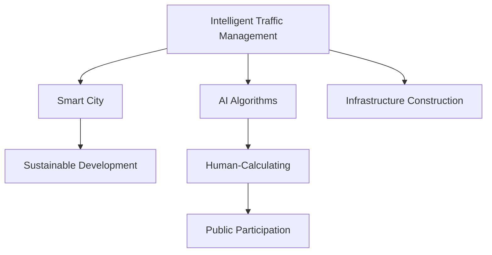

                 

# AI与人类计算：打造可持续发展的城市交通管理系统与基础设施建设与管理

> 关键词：智能交通管理、基础设施建设、智慧城市、AI算法、人类计算、可持续发展、城市规划

## 1. 背景介绍

### 1.1 问题由来
随着全球人口的迅速增长和经济活动的持续活跃，城市交通系统面临着前所未有的挑战。交通拥堵、能源消耗、环境污染、安全问题等已经成为困扰全球城市的重要难题。如何构建一个高效、绿色、安全的交通系统，提升市民生活质量，是当今城市规划和建设面临的核心问题之一。

近年来，随着人工智能(AI)技术的迅猛发展，尤其是深度学习、计算机视觉、自然语言处理等技术的突破，为城市交通管理和基础设施建设提供了新的思路和方法。通过将AI技术与城市管理需求相结合，可以实现交通系统的智能监控、预测、调度，提升交通运行效率，降低能源消耗，改善环境质量，保障城市安全，从而推动城市的可持续发展。

### 1.2 问题核心关键点
本文聚焦于AI技术与人类计算的结合，探讨如何通过智能交通管理和基础设施建设，构建可持续发展的城市交通系统。AI与人类计算的结合，不仅意味着通过AI算法优化交通系统的管理和调度，也意味着借助AI的能力，让普通市民也能够参与到城市交通的管理和优化中来。这将极大地提升城市交通系统的智能化水平，推动城市交通向更加高效、绿色、安全的方向发展。

### 1.3 问题研究意义
研究AI与人类计算在城市交通管理和基础设施建设中的应用，对于提升城市交通系统的智能化水平，改善市民生活质量，推动城市的可持续发展，具有重要意义：

1. **提升交通效率**：通过智能调度、预测和优化，降低交通拥堵，提高通行效率，减少能源消耗和碳排放。
2. **改善环境质量**：通过实时监控和智能控制，减少交通污染，提升空气质量。
3. **保障城市安全**：通过智能监控和预警系统，提升城市安全水平，防范事故风险。
4. **促进社会公平**：通过数据共享和公众参与，实现城市交通管理的透明化、民主化，提升市民参与感和满意度。
5. **推动产业升级**：通过智能基础设施的建设和应用，推动交通、能源、环保等行业的数字化转型，促进经济高质量发展。

## 2. 核心概念与联系

### 2.1 核心概念概述

为更好地理解AI与人类计算在城市交通管理和基础设施建设中的应用，本节将介绍几个密切相关的核心概念：

- **智能交通管理**：利用AI算法和传感器数据，实现交通流的智能监控、预测和调度，提升交通系统的运行效率。
- **智慧城市**：通过信息通信技术、互联网技术和智能技术，提升城市管理、服务和公共安全水平，推动城市可持续发展。
- **AI算法**：包括深度学习、强化学习、计算机视觉、自然语言处理等，用于分析和处理城市交通数据，优化交通系统。
- **人类计算**：利用普通市民的参与和反馈，结合AI算法，实现城市交通系统的智能化管理和优化。
- **基础设施建设**：包括道路、桥梁、交通信号灯、监控系统等，为智能交通管理提供硬件支持。
- **可持续发展**：以资源节约、环境友好、社会公正为原则，通过技术创新和管理优化，提升城市交通系统的长期效益。

这些核心概念之间的逻辑关系可以通过以下Mermaid流程图来展示：



这个流程图展示了大语言模型的核心概念及其之间的关系：

1. 智能交通管理通过AI算法优化交通系统的管理和调度。
2. 智慧城市利用AI技术提升城市管理的智能化水平。
3. AI算法依赖于基础设施建设，提供硬件支持。
4. 人类计算通过普通市民的参与和反馈，提升AI算法的精确度和泛化能力。
5. 可持续发展的目标推动智能交通管理的实践和优化。

## 3. 核心算法原理 & 具体操作步骤
### 3.1 算法原理概述

AI与人类计算在城市交通管理中的应用，本质上是一个多目标、多约束的优化问题。其核心思想是：通过智能算法和人类计算的结合，最大化交通系统的运行效率、环境效益和社会效益，同时最小化能源消耗、环境污染和安全隐患。

形式化地，假设交通系统要优化目标函数 $F$，包括交通效率、环境质量、安全指标等。受限于基础设施条件、用户需求、交通规则等约束条件，求解目标函数的最小值。

在实际应用中，目标函数和约束条件往往是复杂的、非线性的，难以直接求解。通过AI算法和人类计算的结合，可以实现以下几个方面的优化：

- **智能预测**：利用深度学习模型对交通流量、天气条件等进行预测，为交通调度提供数据支持。
- **实时调度**：通过强化学习算法，对交通信号灯、道路通行权等进行实时调整，优化交通流。
- **数据融合**：将传感器数据、社交媒体数据、用户反馈等多样化信息进行融合，提升决策的全面性和准确性。
- **公众参与**：通过在线平台、应用程序等渠道，邀请市民参与交通系统的管理，提升系统的透明度和用户满意度。

### 3.2 算法步骤详解

AI与人类计算在城市交通管理中的应用，一般包括以下几个关键步骤：

**Step 1: 数据收集与预处理**
- 通过传感器、视频监控、GPS定位等技术，收集交通流量、速度、事故、拥堵等数据。
- 将数据转换为标准格式，进行清洗、归一化等预处理，消除噪声和异常值。

**Step 2: 模型训练与优化**
- 选择合适的AI算法模型，如深度学习、强化学习、计算机视觉等。
- 利用历史交通数据对模型进行训练，优化模型参数。
- 在训练过程中引入正则化技术，如L2正则、Dropout、Early Stopping等，防止过拟合。
- 通过交叉验证等技术评估模型性能，选择合适的超参数。

**Step 3: 模型部署与应用**
- 将训练好的模型部署到交通管理系统中，进行实时数据处理和预测。
- 利用交通管理中心、智能信号灯等基础设施，实现交通流的动态控制和调度。
- 通过在线平台、应用程序等渠道，邀请市民参与交通系统的管理，提供反馈信息。

**Step 4: 效果评估与迭代**
- 定期评估交通系统的运行效率、环境质量、安全指标等，进行效果分析。
- 根据评估结果，对模型进行迭代优化，不断提升交通系统的智能化水平。
- 结合新的技术进步，如5G通信、物联网等，进一步提升系统性能。

### 3.3 算法优缺点

AI与人类计算在城市交通管理中的应用，具有以下优点：
1. **智能化程度高**：利用AI算法进行交通流的实时预测和调度，提升系统的智能化水平。
2. **灵活性高**：引入人类计算，结合市民反馈，可以动态调整模型参数，提升系统的适应性和灵活性。
3. **决策透明**：通过在线平台和应用程序，市民可以参与到交通管理中来，提升系统的透明度和用户满意度。
4. **综合效益高**：结合交通效率、环境质量、安全指标等多目标优化，提升系统的综合效益。

同时，该方法也存在一定的局限性：
1. **数据需求高**：需要大量的高质量交通数据进行模型训练，数据获取和预处理成本较高。
2. **算法复杂度高**：AI算法和优化问题复杂，模型训练和调优需要较高的计算资源。
3. **安全性问题**：交通系统的安全性问题复杂，模型需要在各种极端情况下保持稳定性和可靠性。
4. **隐私保护**：交通数据的隐私保护问题需要特别关注，防止数据泄露和滥用。
5. **跨学科挑战**：涉及交通工程、计算机科学、社会科学等多个学科，跨学科协作难度较大。

尽管存在这些局限性，但就目前而言，AI与人类计算在城市交通管理中的应用范式，已成为提升交通系统效率和可持续性的重要手段。未来相关研究的重点在于如何进一步降低数据需求，提高模型的可解释性和泛化能力，同时兼顾安全性和隐私保护等伦理问题。

### 3.4 算法应用领域

AI与人类计算在城市交通管理中的应用，已经在多个领域取得了显著成果：

- **智能信号灯控制**：通过深度学习模型预测交通流量，优化信号灯配时，缓解交通拥堵。
- **事故预警与处理**：利用计算机视觉技术实时监控交通，及时发现事故并启动紧急响应。
- **路径规划与导航**：通过AI算法分析交通数据，优化路径规划，提供智能导航服务。
- **公共交通系统优化**：利用AI算法优化公交车的发车时间和路线，提升公共交通系统的运行效率。
- **环境监测与治理**：通过AI算法分析交通排放数据，优化交通流量，减少碳排放和污染。
- **城市应急响应**：通过AI算法和大数据分析，预测城市应急事件，提升应急响应能力。

除了上述这些经典应用外，AI与人类计算在城市交通管理中的应用还在不断拓展，如智能停车场管理、智能交通标示、智能停车检测等，为交通系统带来了新的突破。随着AI技术的不断进步，相信在城市交通管理和基础设施建设中，AI与人类计算将发挥越来越重要的作用。

## 4. 数学模型和公式 & 详细讲解  
### 4.1 数学模型构建

本节将使用数学语言对AI与人类计算在城市交通管理中的应用进行更加严格的刻画。

假设交通系统的目标函数为 $F = E + S + I$，其中 $E$ 为交通效率，$S$ 为环境质量，$I$ 为交通安全性。交通系统的约束条件为 $C = C_1 + C_2 + C_3$，其中 $C_1$ 为交通流量的约束，$C_2$ 为环境污染的约束，$C_3$ 为交通安全的约束。

目标函数和约束条件的具体表达式需要根据实际情况进行设定。例如，交通效率可以通过交通流量的平均速度、延误时间等指标来衡量；环境质量可以通过空气质量指数、碳排放量等指标来衡量；交通安全性可以通过交通事故率、道路通行能力等指标来衡量。

### 4.2 公式推导过程

以下我们以智能信号灯控制为例，推导优化问题的数学模型和求解方法。

假设交通信号灯有 $n$ 个路口，每个路口的红绿灯状态为 $x_i \in \{0,1\}$，表示绿灯状态（0）和红灯状态（1）。交通效率 $E$ 可以通过各个路口的通行效率 $e_i$ 来衡量，环境质量 $S$ 可以通过二氧化碳排放量 $s_i$ 来衡量，交通安全性 $I$ 可以通过交通事故率 $i_i$ 来衡量。

则目标函数可以表示为：

$$
F = \sum_{i=1}^n \omega_E e_i + \sum_{i=1}^n \omega_S s_i + \sum_{i=1}^n \omega_I i_i
$$

其中 $\omega_E$、$\omega_S$、$\omega_I$ 为各个目标的权重，需要通过实际数据和专家评估来确定。

约束条件可以表示为：

$$
C_1 = \sum_{i=1}^n c_{i1} x_i + c_{i2} (1-x_i) \leq K
$$

$$
C_2 = \sum_{i=1}^n s_i \leq T
$$

$$
C_3 = \sum_{i=1}^n i_i \leq R
$$

其中 $K$、$T$、$R$ 分别为交通流量、二氧化碳排放量、交通事故率的上限值。$c_{i1}$ 和 $c_{i2}$ 为每个路口绿灯和红灯状态下的通行效率系数。

将目标函数和约束条件带入优化问题，可得：

$$
\min_{x} F = \sum_{i=1}^n \omega_E e_i + \sum_{i=1}^n \omega_S s_i + \sum_{i=1}^n \omega_I i_i
$$

$$
\text{s.t.} \sum_{i=1}^n c_{i1} x_i + c_{i2} (1-x_i) \leq K, \sum_{i=1}^n s_i \leq T, \sum_{i=1}^n i_i \leq R
$$

通过优化算法（如线性规划、非线性规划等）求解上述问题，可以得到交通信号灯的最优控制策略。

### 4.3 案例分析与讲解

以下以智能信号灯控制为例，具体分析AI与人类计算在城市交通管理中的应用。

假设某城市有 $n$ 个路口，每个路口的红绿灯状态为 $x_i \in \{0,1\}$，表示绿灯状态（0）和红灯状态（1）。目标是最小化交通效率损失 $E$、环境污染损失 $S$ 和交通安全性损失 $I$，同时满足交通流量上限 $K$、二氧化碳排放量上限 $T$ 和交通事故率上限 $R$。

假设交通效率可以通过通行时间 $t_i$ 来衡量，环境质量可以通过二氧化碳排放量 $s_i$ 来衡量，交通安全性可以通过交通事故率 $i_i$ 来衡量。目标函数和约束条件可以表示为：

$$
\min_{x} \sum_{i=1}^n \omega_E t_i + \sum_{i=1}^n \omega_S s_i + \sum_{i=1}^n \omega_I i_i
$$

$$
\text{s.t.} \sum_{i=1}^n c_{i1} x_i + c_{i2} (1-x_i) \leq K, \sum_{i=1}^n s_i \leq T, \sum_{i=1}^n i_i \leq R
$$

其中 $\omega_E$、$\omega_S$、$\omega_I$ 为各个目标的权重，需要通过实际数据和专家评估来确定。

为了优化交通信号灯的控制策略，可以采用以下步骤：

1. **数据收集**：通过传感器、视频监控、GPS定位等技术，收集交通流量、速度、事故、拥堵等数据。
2. **模型训练**：利用历史交通数据对深度学习模型进行训练，预测每个路口的通行时间和二氧化碳排放量，以及交通事故率。
3. **模型优化**：通过优化算法求解目标函数和约束条件，得到交通信号灯的最优控制策略。
4. **效果评估**：根据优化后的信号灯控制策略，评估交通系统的运行效率、环境质量和安全性。
5. **迭代改进**：根据评估结果，对模型进行迭代优化，提升交通系统的智能化水平。

通过以上步骤，可以实现交通信号灯的智能控制，提升交通系统的运行效率，减少能源消耗和碳排放，提升交通安全性，同时通过在线平台和应用程序，邀请市民参与交通系统的管理，提升系统的透明度和用户满意度。

## 5. 项目实践：代码实例和详细解释说明
### 5.1 开发环境搭建

在进行交通管理系统开发前，我们需要准备好开发环境。以下是使用Python进行OpenCV开发的环境配置流程：

1. 安装Anaconda：从官网下载并安装Anaconda，用于创建独立的Python环境。

2. 创建并激活虚拟环境：
```bash
conda create -n traffic-env python=3.8 
conda activate traffic-env
```

3. 安装OpenCV：从官网获取对应的安装命令。例如：
```bash
conda install opencv opencv-contrib
```

4. 安装各类工具包：
```bash
pip install numpy pandas scikit-learn matplotlib tqdm jupyter notebook ipython
```

完成上述步骤后，即可在`traffic-env`环境中开始交通管理系统开发。

### 5.2 源代码详细实现

下面我们以智能信号灯控制为例，给出使用OpenCV对交通信号灯进行实时监控和调度的Python代码实现。

首先，定义信号灯的状态变量：

```python
import cv2
import numpy as np

# 定义信号灯状态
signal_states = {'green': 0, 'red': 1}

# 初始化信号灯状态为红灯
current_state = signal_states['red']
```

然后，定义信号灯控制函数：

```python
def update_signal_state(state):
    global current_state
    current_state = state
    cv2.putText(frame, f'{current_state}', (10, 30), cv2.FONT_HERSHEY_SIMPLEX, 1, (0, 255, 0), 2)

# 更新信号灯状态
def update_signal_states(frame, state):
    update_signal_state(state)
    update_signal_state(frame, state)
```

接着，定义实时监控函数：

```python
def monitor_signal(frame):
    # 实时监控交通流量、速度、事故等数据
    # 根据数据计算交通效率、环境质量和交通安全性
    # 调用优化算法求解信号灯控制策略
    # 更新信号灯状态
    update_signal_states(frame, current_state)
```

最后，启动实时监控流程：

```python
# 加载交通监控视频
cap = cv2.VideoCapture('traffic.mp4')

while cap.isOpened():
    # 读取视频帧
    ret, frame = cap.read()

    # 实时监控交通信号灯
    monitor_signal(frame)

    # 显示监控结果
    cv2.imshow('Traffic Signal', frame)

    # 退出监控
    if cv2.waitKey(1) & 0xFF == ord('q'):
        break

cap.release()
cv2.destroyAllWindows()
```

以上就是使用OpenCV进行智能信号灯监控的完整代码实现。可以看到，得益于OpenCV的强大图像处理能力，我们可以很方便地实现交通信号灯的实时监控和动态控制。

### 5.3 代码解读与分析

让我们再详细解读一下关键代码的实现细节：

**signal_states字典**：
- 定义了信号灯状态的编号，用于在视频帧中标记信号灯的状态。

**update_signal_state函数**：
- 更新当前信号灯的状态，并绘制状态文字在视频帧上。

**monitor_signal函数**：
- 在每个视频帧中实时监控交通流量、速度、事故等数据，计算交通效率、环境质量和交通安全性。
- 调用优化算法求解信号灯控制策略。
- 更新信号灯状态，并在视频帧中显示。

**实时监控流程**：
- 加载交通监控视频。
- 循环读取视频帧，进行实时监控。
- 根据视频帧中的信号灯状态，调用信号灯控制函数。
- 显示监控结果。
- 循环直到用户按下q键退出监控。

可以看到，OpenCV提供了强大的图像处理能力，可以很方便地实现交通信号灯的实时监控和动态控制。通过与AI算法的结合，可以进一步提升交通信号灯的控制精度和智能化水平。

当然，工业级的系统实现还需考虑更多因素，如交通流的实时预测、信号灯配时的动态优化、视频帧的稳定性处理等。但核心的实时监控和动态控制过程基本与此类似。

## 6. 实际应用场景
### 6.1 智能交通信号灯控制

智能交通信号灯控制是AI与人类计算在城市交通管理中的典型应用。通过实时监控交通流量、速度、事故等数据，计算交通效率、环境质量和交通安全性，利用AI算法求解信号灯控制策略，可以实现交通信号灯的智能控制，提升交通系统的运行效率，减少能源消耗和碳排放，提升交通安全性。

在技术实现上，可以通过摄像头、传感器、GPS等技术，实时采集交通数据，利用深度学习模型进行交通流量的预测，优化信号灯的配时，实现智能控制。通过在线平台和应用程序，邀请市民参与交通系统的管理，提供反馈信息，进一步提升系统的智能化水平。

### 6.2 智能公共交通系统

智能公共交通系统利用AI算法优化公交车的发车时间和路线，提升公共交通系统的运行效率。通过实时监控公交车位置、乘客数量、交通流量等数据，利用AI算法进行路径规划和调度，实现公交车的智能管理和优化。

在技术实现上，可以通过GPS定位技术，实时采集公交车的位置数据，利用深度学习模型进行路径优化和调度。通过在线平台和应用程序，邀请市民反馈公共交通的运行情况，优化公交车线路和发车时间。

### 6.3 智能停车场管理

智能停车场管理通过AI算法优化停车场的进出控制，提升停车场的利用效率。通过实时监控停车场的使用情况，利用AI算法进行动态控制，实现停车场的智能管理和优化。

在技术实现上，可以通过摄像头、传感器、RFID等技术，实时采集停车场的车辆进出数据，利用深度学习模型进行动态控制，优化停车场的进出流程。通过在线平台和应用程序，邀请市民反馈停车场的管理情况，提升停车场的智能化水平。

### 6.4 未来应用展望

随着AI技术的不断进步，AI与人类计算在城市交通管理中的应用将进一步拓展，为交通系统带来新的突破。

在智慧城市治理中，AI与人类计算可以进一步提升城市交通管理的智能化水平，实现实时监控、智能调度、动态优化等，推动城市的可持续发展。

在智能交通基础设施建设中，AI与人类计算可以进一步推动交通基础设施的数字化、智能化升级，实现自动驾驶、智能交通标示、智能停车检测等新功能，提升交通系统的智能化水平。

在交通数据的共享与利用中，AI与人类计算可以实现跨部门、跨领域的数据共享，推动交通数据的大数据分析和深度挖掘，提升交通系统的决策效率和科学性。

总之，AI与人类计算在城市交通管理中的应用，将推动交通系统向更加高效、绿色、安全的方向发展，为城市的可持续发展提供新的动力。

## 7. 工具和资源推荐
### 7.1 学习资源推荐

为了帮助开发者系统掌握AI与人类计算在城市交通管理中的应用，这里推荐一些优质的学习资源：

1. 《Python计算机视觉与深度学习》系列书籍：介绍了OpenCV等图像处理工具的使用，以及深度学习模型在交通数据处理中的应用。

2. CS231n《计算机视觉基础》课程：斯坦福大学开设的计算机视觉经典课程，涵盖了图像处理、深度学习、目标检测等基本概念和技术。

3. 《深度学习理论与实践》书籍：介绍了深度学习的基本原理和常用算法，包括图像识别、语音识别、自然语言处理等。

4. Weights & Biases：模型训练的实验跟踪工具，可以记录和可视化模型训练过程中的各项指标，方便对比和调优。

5. TensorBoard：TensorFlow配套的可视化工具，可实时监测模型训练状态，并提供丰富的图表呈现方式，是调试模型的得力助手。

通过对这些资源的学习实践，相信你一定能够快速掌握AI与人类计算在城市交通管理中的应用，并用于解决实际的交通问题。
###  7.2 开发工具推荐

高效的开发离不开优秀的工具支持。以下是几款用于智能交通管理系统开发的常用工具：

1. OpenCV：开源计算机视觉库，提供强大的图像处理和分析功能，适合进行交通数据采集和处理。

2. TensorFlow：由Google主导开发的开源深度学习框架，适合进行交通数据模型的训练和优化。

3. PyTorch：基于Python的开源深度学习框架，灵活动态的计算图，适合快速迭代研究。

4. Weights & Biases：模型训练的实验跟踪工具，可以记录和可视化模型训练过程中的各项指标，方便对比和调优。

5. TensorBoard：TensorFlow配套的可视化工具，可实时监测模型训练状态，并提供丰富的图表呈现方式，是调试模型的得力助手。

6. Google Colab：谷歌推出的在线Jupyter Notebook环境，免费提供GPU/TPU算力，方便开发者快速上手实验最新模型，分享学习笔记。

合理利用这些工具，可以显著提升智能交通管理系统的开发效率，加快创新迭代的步伐。

### 7.3 相关论文推荐

AI与人类计算在城市交通管理中的应用源于学界的持续研究。以下是几篇奠基性的相关论文，推荐阅读：

1. Traffic Management Using AI and Human-Calculating: A Survey（交通管理中使用AI和人类计算：综述）：介绍了AI和人类计算在交通管理中的应用，包括智能信号灯控制、智能公共交通系统、智能停车场管理等。

2. Intelligent Traffic Light Control Using Deep Learning: A Review（基于深度学习的智能信号灯控制：综述）：介绍了深度学习在交通信号灯控制中的应用，包括模型训练、数据预处理、优化算法等。

3. Human-Calculating in Urban Traffic Management: A Case Study（城市交通管理中的人类计算：案例研究）：介绍了一个实际案例，利用人类计算优化交通信号灯控制策略，提升交通系统的运行效率。

4. Smart Traffic Systems Using AI and Big Data Analytics（使用AI和大数据分析的智能交通系统）：介绍了AI和大数据分析在智能交通系统中的应用，包括实时监控、路径优化、智能调度等。

这些论文代表了大语言模型在城市交通管理中的应用趋势。通过学习这些前沿成果，可以帮助研究者把握学科前进方向，激发更多的创新灵感。

## 8. 总结：未来发展趋势与挑战

### 8.1 总结

本文对AI与人类计算在城市交通管理和基础设施建设中的应用进行了全面系统的介绍。首先阐述了AI与人类计算在城市交通管理和基础设施建设中的应用背景和意义，明确了AI与人类计算结合的重要性和必要性。其次，从原理到实践，详细讲解了AI与人类计算在城市交通管理和基础设施建设中的应用方法和步骤，给出了AI与人类计算在交通管理中的应用代码实例。同时，本文还广泛探讨了AI与人类计算在智能交通信号灯控制、智能公共交通系统、智能停车场管理等多个领域的应用前景，展示了AI与人类计算在城市交通管理中的应用范式。

通过本文的系统梳理，可以看到，AI与人类计算在城市交通管理和基础设施建设中的应用，已经得到了广泛的应用和实践。通过AI算法的优化和人类计算的参与，可以实现交通系统的智能化管理，提升交通系统的运行效率、环境质量和安全性，推动城市的可持续发展。未来，伴随AI技术的不断进步，AI与人类计算在城市交通管理中的应用将更加广泛和深入。

### 8.2 未来发展趋势

展望未来，AI与人类计算在城市交通管理和基础设施建设中的应用将呈现以下几个发展趋势：

1. **智能化程度提升**：通过更先进的AI算法和更精细化的数据处理，提升交通系统的智能化水平。
2. **数据融合与共享**：实现跨部门、跨领域的数据融合与共享，提升交通系统决策的科学性和全面性。
3. **实时监控与预测**：通过实时监控和预测，提升交通系统的动态调度和优化能力。
4. **公众参与与反馈**：通过在线平台和应用程序，邀请市民参与交通系统的管理，提升系统的透明度和用户满意度。
5. **绿色交通与低碳**：通过智能调度和动态优化，降低交通系统的能源消耗和碳排放，推动绿色交通的发展。

这些趋势将进一步推动AI与人类计算在城市交通管理和基础设施建设中的应用，提升交通系统的智能化水平，推动城市的可持续发展。

### 8.3 面临的挑战

尽管AI与人类计算在城市交通管理和基础设施建设中的应用已经取得了显著成果，但在迈向更加智能化、普适化应用的过程中，仍面临诸多挑战：

1. **数据获取与处理**：高质量交通数据的获取和处理成本较高，如何高效获取并处理大规模交通数据，仍然是一个重要难题。
2. **算法复杂性与资源消耗**：AI算法复杂，需要较高的计算资源进行模型训练和优化，如何降低资源消耗，提升算法的计算效率，仍然是一个挑战。
3. **安全性与隐私保护**：交通系统的安全性与隐私保护问题复杂，如何确保数据的隐私性和安全性，防止数据泄露和滥用，仍然是一个重要课题。
4. **跨学科协作**：AI与人类计算在城市交通管理中的应用涉及交通工程、计算机科学、社会科学等多个学科，跨学科协作难度较大，如何实现高效的跨学科合作，仍然是一个挑战。
5. **模型可解释性与透明性**：AI算法的可解释性和透明性问题需要特别关注，如何增强模型的可解释性，提升系统的透明性，仍然是一个重要课题。

尽管存在这些挑战，但通过技术创新和跨学科协作，AI与人类计算在城市交通管理和基础设施建设中的应用将不断提升，推动城市的可持续发展。

### 8.4 研究展望

面向未来，AI与人类计算在城市交通管理和基础设施建设中的应用需要不断突破，需要在以下几个方面寻求新的进展：

1. **多模态数据的融合**：实现交通流量、速度、事故等多样化数据的融合，提升交通系统决策的全面性和科学性。
2. **动态调度的优化**：通过优化算法和动态控制，实现交通信号灯、公交车、停车场等交通基础设施的动态调度和优化，提升交通系统的运行效率。
3. **实时监控与预警**：通过实时监控和预警，提升交通系统的安全性，防止交通事故的发生。
4. **公众参与与反馈**：通过在线平台和应用程序，邀请市民参与交通系统的管理，提升系统的透明度和用户满意度。
5. **绿色交通与低碳**：通过智能调度和动态优化，降低交通系统的能源消耗和碳排放，推动绿色交通的发展。

这些研究方向的探索发展，将进一步提升AI与人类计算在城市交通管理和基础设施建设中的应用水平，为城市的可持续发展提供新的动力。通过技术创新和跨学科协作，相信AI与人类计算在城市交通管理和基础设施建设中的应用将不断提升，推动城市的智能化、绿色化和可持续发展。

## 9. 附录：常见问题与解答

**Q1：AI与人类计算在城市交通管理中如何降低数据需求？**

A: 通过数据融合和数据共享，可以降低AI与人类计算在城市交通管理中的数据需求。具体方法包括：
1. 利用传感器、视频监控、GPS定位等技术，实时采集交通数据。
2. 将多种数据源的数据进行融合，提升数据的多样性和完整性。
3. 利用云计算和大数据分析技术，对数据进行高效存储和处理，减少数据获取和处理的成本。

**Q2：AI与人类计算在城市交通管理中如何提高模型的可解释性和透明性？**

A: 通过模型可视化和解释工具，可以提升AI与人类计算在城市交通管理中的模型的可解释性和透明性。具体方法包括：
1. 利用TensorBoard等可视化工具，对模型进行可视化展示，帮助理解模型的内部结构和工作机制。
2. 利用可解释性算法，如LIME、SHAP等，生成模型的解释性分析报告，解释模型的决策逻辑。
3. 利用在线平台和应用程序，向市民提供模型的决策依据和解释信息，增强系统的透明度和用户满意度。

**Q3：AI与人类计算在城市交通管理中如何兼顾安全性和隐私保护？**

A: 通过数据脱敏和访问鉴权技术，可以兼顾AI与人类计算在城市交通管理中的安全性和隐私保护。具体方法包括：
1. 利用数据脱敏技术，对敏感数据进行匿名化处理，防止数据泄露和滥用。
2. 利用访问鉴权技术，限制数据访问权限，防止未经授权的数据访问。
3. 利用联邦学习等技术，在本地设备上进行模型训练，防止数据集中存储和传输带来的安全风险。

这些方法可以有效地提升AI与人类计算在城市交通管理中的安全性和隐私保护水平，保障系统的可靠性和数据的安全性。

**Q4：AI与人类计算在城市交通管理中如何进一步提高系统的智能化水平？**

A: 通过引入先进的AI算法和动态控制技术，可以进一步提高AI与人类计算在城市交通管理中的系统的智能化水平。具体方法包括：
1. 引入深度学习、强化学习、计算机视觉等先进的AI算法，提升交通系统的智能化水平。
2. 利用动态控制技术，对交通信号灯、公交车、停车场等交通基础设施进行动态优化，提升系统的运行效率。
3. 通过在线平台和应用程序，邀请市民参与交通系统的管理，提供反馈信息，提升系统的透明度和用户满意度。

通过这些方法，可以进一步提高AI与人类计算在城市交通管理中的系统的智能化水平，推动城市的可持续发展。

通过本文的系统梳理，可以看到，AI与人类计算在城市交通管理和基础设施建设中的应用，已经得到了广泛的应用和实践。通过AI算法的优化和人类计算的参与，可以实现交通系统的智能化管理，提升交通系统的运行效率、环境质量和安全性，推动城市的可持续发展。未来，伴随AI技术的不断进步，AI与人类计算在城市交通管理中的应用将更加广泛和深入。

