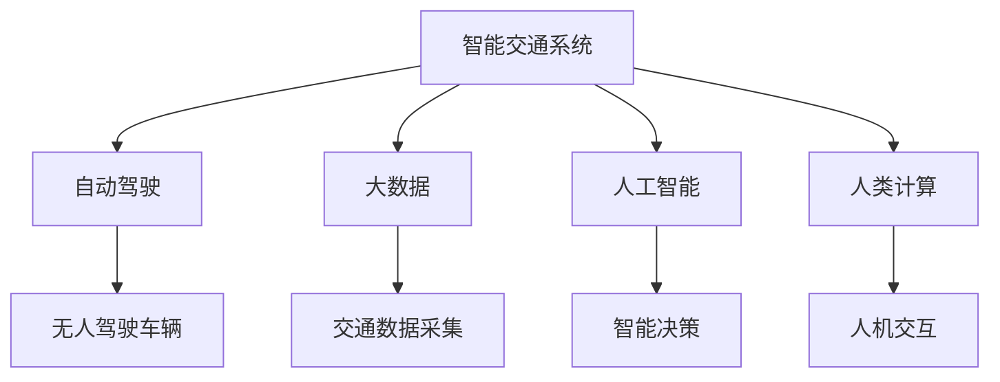

                 

# AI与人类计算：打造可持续发展的城市交通系统

> 关键词：城市交通,智能交通系统,自动驾驶,人类计算,AI,可持续性,智慧城市,未来交通

## 1. 背景介绍

### 1.1 问题由来

随着城市化进程的加快和人民生活水平的提升，交通问题逐渐成为各大城市面临的重大挑战。日益增长的交通需求与道路资源的不足，导致了城市交通拥堵、事故频发、环境污染等一系列问题。这些问题不仅影响了市民的生活质量，也制约了城市经济的健康发展。

为应对这些挑战，许多城市开始探索利用AI与人类计算技术，打造智能交通系统，推动城市交通的可持续发展。智能交通系统通过大数据、物联网、人工智能等技术手段，提升交通管理的智能化水平，实现交通资源的优化配置，减少交通拥堵，降低环境污染，提高交通安全。

### 1.2 问题核心关键点

智能交通系统的核心目标是通过AI技术对交通数据进行智能分析，优化交通信号灯控制，优化路径规划，提升交通效率。关键在于如何有效利用大数据、云计算等技术，以及如何通过AI算法实现对复杂交通场景的理解和决策。

智能交通系统的建设涉及城市交通基础设施、交通数据采集、数据处理、AI算法模型、应用系统等多个环节，需要跨学科的协同合作，包括交通工程、计算机科学、城市规划等多个领域。

## 2. 核心概念与联系

### 2.1 核心概念概述

为更好地理解智能交通系统及其建设过程，本节将介绍几个密切相关的核心概念：

- 智能交通系统(Intelligent Transportation Systems, ITS)：通过引入AI、大数据、物联网等技术，对城市交通进行智能化管理，提升交通效率、安全性和可持续性。
- 自动驾驶(Autonomous Driving)：利用传感器、摄像头、雷达等技术，使车辆实现自主驾驶，减少人为因素的干扰。
- 人类计算(Human-Centered Computing)：强调以人为中心的设计理念，通过人与AI的协同工作，提升系统的可用性和可接受性。
- AI与人类计算融合：在智能交通系统中，AI算法和人类计算的有机结合，能够实现更高效的交通决策和智能控制。

这些概念之间的逻辑关系可以通过以下Mermaid流程图来展示：



这个流程图展示了一些核心概念及其之间的关系：

1. 智能交通系统通过自动驾驶技术、大数据分析和人工智能技术进行智能化管理。
2. 自动驾驶车辆通过AI算法实现自主驾驶，减少人为错误。
3. 大数据技术提供交通数据的采集和分析，为AI决策提供支撑。
4. 人类计算技术优化人机交互界面，提升系统可用性。

这些概念共同构成了智能交通系统的工作框架，为其高效运行提供了坚实的基础。

## 3. 核心算法原理 & 具体操作步骤
### 3.1 算法原理概述

智能交通系统的核心算法原理涉及大数据分析、机器学习、深度学习等多个领域，主要包括以下几个关键步骤：

1. **数据采集与预处理**：通过传感器、摄像头等设备采集交通数据，并进行清洗、去噪、归一化等预处理，为后续分析提供干净的数据。
2. **特征提取与选择**：利用大数据分析技术，从交通数据中提取关键特征，如车流量、速度、事故频率等。
3. **模型训练与优化**：利用机器学习和深度学习算法，建立交通预测模型，通过大量标注数据进行训练和调优。
4. **智能决策与控制**：将训练好的模型应用到实时交通数据中，进行智能决策和控制，如交通信号灯优化、路径规划、事故预测等。
5. **人机交互与反馈**：通过智能界面将决策结果呈现给驾驶员，并根据驾驶员反馈进行动态调整，提升系统的人机协同效果。

### 3.2 算法步骤详解

以下是对智能交通系统算法步骤的详细讲解：

**Step 1: 数据采集与预处理**

- **传感器和摄像头**：安装摄像头和传感器，采集交通流量、车辆位置、速度、事故等信息。
- **数据清洗与去噪**：对采集到的数据进行清洗，去除异常值和噪声，保证数据质量。
- **数据归一化**：将不同来源的数据进行归一化处理，使其具有可比性。

**Step 2: 特征提取与选择**

- **特征工程**：提取交通数据中的关键特征，如车流量、速度、事故频率等。
- **特征选择**：通过算法选择对模型预测影响最大的特征，减少数据维度，提升模型效果。
- **特征编码**：将特征转换为模型可接受的格式，如数值型、类别型等。

**Step 3: 模型训练与优化**

- **模型选择**：根据任务需求选择合适的机器学习或深度学习模型，如线性回归、决策树、卷积神经网络(CNN)等。
- **模型训练**：利用历史交通数据训练模型，并通过交叉验证等技术优化模型参数。
- **模型评估**：在验证集上评估模型性能，选择最优模型进行后续应用。

**Step 4: 智能决策与控制**

- **实时数据输入**：将实时交通数据输入训练好的模型，进行预测和决策。
- **智能决策**：根据模型输出，智能调整交通信号灯、优化路径规划、预测事故等。
- **控制策略**：制定合理的控制策略，如路段限速、交通信号灯优化等，提升交通效率。

**Step 5: 人机交互与反馈**

- **人机交互界面**：设计直观易用的交互界面，将决策结果呈现给驾驶员。
- **反馈系统**：根据驾驶员反馈，动态调整决策模型，提升系统的人机协同效果。

### 3.3 算法优缺点

智能交通系统算法具有以下优点：

1. **高效性**：通过大数据分析和AI算法，实现实时交通决策，提升交通效率。
2. **安全性**：通过AI技术减少人为因素干扰，降低交通事故率。
3. **可持续性**：通过优化交通流量，减少环境污染，推动交通系统的可持续发展。
4. **灵活性**：通过模型调优和算法更新，适应不同交通场景的需求。

同时，该算法也存在一定的局限性：

1. **数据依赖性**：系统的预测和决策依赖于数据质量，数据缺失或不准确可能导致预测误差。
2. **模型复杂性**：AI算法模型复杂，需要大量计算资源进行训练和优化。
3. **隐私与安全**：系统采集大量个人隐私数据，需要采取有效措施保护数据隐私和安全。
4. **技术门槛**：智能交通系统建设涉及多个领域技术，需要跨学科的合作与协作。

尽管存在这些局限性，但智能交通系统仍是大城市交通管理的重要方向，具有广阔的应用前景。

### 3.4 算法应用领域

智能交通系统的应用领域广泛，主要包括：

- **交通信号控制**：优化交通信号灯控制，减少交通拥堵。
- **路径规划与导航**：通过AI算法提供最优路径规划，减少行车时间。
- **事故预测与防范**：利用AI技术预测交通事故，提前采取防范措施。
- **车辆监控与调度**：实时监控车辆位置和运行状态，实现高效调度。
- **公共交通管理**：优化公共交通线路和时刻表，提升公共交通服务质量。
- **智慧停车场**：通过AI技术管理停车场，提升停车效率。

此外，智能交通系统还被应用于城市规划、环境监测等多个领域，为城市可持续发展提供重要支持。

## 4. 数学模型和公式 & 详细讲解 & 举例说明

### 4.1 数学模型构建

智能交通系统的数学模型主要涉及以下几个方面：

1. **交通流量预测模型**：通过历史交通数据，建立交通流量的预测模型。常用的模型包括线性回归、时间序列分析、神经网络等。
2. **路径规划模型**：根据实时交通数据，利用图论算法进行最优路径规划。常用的算法包括Dijkstra、A*等。
3. **事故预测模型**：通过事故历史数据，建立事故发生概率的预测模型。常用的模型包括逻辑回归、支持向量机等。
4. **交通信号控制模型**：根据实时交通数据，优化交通信号灯控制策略。常用的模型包括最大流模型、多模态模型等。

### 4.2 公式推导过程

以交通流量预测模型为例，以下是其数学推导过程：

设 $T(t)$ 为时间 $t$ 的交通流量，$y(t)$ 为交通流量的时间序列数据，$x(t)$ 为影响交通流量的因素，如天气、节假日等。

则交通流量预测模型可以表示为：

$$
T(t)=f(y(t-1),x(t))
$$

其中 $f$ 为预测函数，$y(t-1)$ 为时间序列数据在 $t-1$ 时刻的值，$x(t)$ 为影响因素在 $t$ 时刻的值。

常见的交通流量预测模型包括：

1. **线性回归模型**：
   $$
   T(t)=\beta_0+\beta_1y(t-1)+\epsilon(t)
   $$
   其中 $\beta_0$ 为截距，$\beta_1$ 为斜率，$\epsilon(t)$ 为误差项。

2. **时间序列模型**：
   $$
   T(t)=\alpha+\beta t+\gamma\sin(\omega t+\phi)+\epsilon(t)
   $$
   其中 $\alpha$ 为截距，$\beta$ 为线性项系数，$\gamma$ 和 $\phi$ 为周期性项参数，$\omega$ 为周期。

3. **神经网络模型**：
   $$
   T(t)=\sigma(W_{\theta}[y(t-1),x(t)])
   $$
   其中 $W_{\theta}$ 为神经网络权重，$\sigma$ 为激活函数。

通过上述模型，可以实现对交通流量的预测和控制，优化交通系统。

### 4.3 案例分析与讲解

以智能交通信号控制为例，以下是其数学模型和算法的详细讲解：

**交通信号控制模型**

交通信号控制的目标是优化交通信号灯控制，减少交通拥堵，提高交通效率。常用的模型包括：

1. **最大流模型**：通过最大化交通流量的同时，最小化交通延迟。该模型适用于单路口的信号控制。
2. **多模态模型**：结合多个交通数据源，如摄像头、传感器、GPS等，进行交通信号灯控制。该模型适用于多路口的交通信号控制。

**模型实现**

以最大流模型为例，其算法实现过程如下：

1. **交通流量测量**：通过传感器和摄像头测量各路口的交通流量。
2. **流量预测**：利用交通流量预测模型，预测未来各路口的交通流量。
3. **信号灯控制**：根据预测流量，调整信号灯的周期和相位，实现最大流控制。
4. **反馈调整**：根据实际交通流量与预测流量的差异，动态调整信号灯控制策略。

通过上述算法，可以实现高效的交通信号控制，提升交通效率。

## 5. 项目实践：代码实例和详细解释说明

### 5.1 开发环境搭建

在进行智能交通系统项目开发前，我们需要准备好开发环境。以下是使用Python进行开发的环境配置流程：

1. 安装Anaconda：从官网下载并安装Anaconda，用于创建独立的Python环境。

2. 创建并激活虚拟环境：
```bash
conda create -n traffic-env python=3.8 
conda activate traffic-env
```

3. 安装所需的Python包：
```bash
pip install numpy pandas matplotlib scikit-learn tensorflow pytorch
```

4. 安装所需的库：
```bash
pip install opencv-python requests
```

5. 配置OpenCV：
```bash
pip install opencv-python-headless
```

完成上述步骤后，即可在`traffic-env`环境中开始项目开发。

### 5.2 源代码详细实现

以下是一个简单的智能交通信号控制的Python代码实现。

```python
import numpy as np
import cv2
import requests
import json

class TrafficSignal:
    def __init__(self, red_light, green_light, yellow_light):
        self.red_light = red_light
        self.green_light = green_light
        self.yellow_light = yellow_light

    def detect_license_plate(self, frame):
        # 实现车牌识别算法，提取车牌信息
        pass

    def predict_traffic_flow(self, frame):
        # 实现交通流量预测模型，预测交通流量
        pass

    def control_signals(self, traffic_flow):
        # 根据交通流量，控制信号灯
        pass

def main():
    red_light = 10
    green_light = 20
    yellow_light = 5

    traffic_signal = TrafficSignal(red_light, green_light, yellow_light)

    cap = cv2.VideoCapture(0)

    while True:
        ret, frame = cap.read()

        plate = traffic_signal.detect_license_plate(frame)
        traffic_flow = traffic_signal.predict_traffic_flow(frame)

        traffic_signal.control_signals(traffic_flow)

        cv2.imshow('frame', frame)

        if cv2.waitKey(1) & 0xFF == ord('q'):
            break

    cap.release()
    cv2.destroyAllWindows()

if __name__ == "__main__":
    main()
```

### 5.3 代码解读与分析

让我们再详细解读一下关键代码的实现细节：

**TrafficSignal类**

- `__init__`方法：初始化信号灯的状态。
- `detect_license_plate`方法：实现车牌识别算法，提取车牌信息。
- `predict_traffic_flow`方法：实现交通流量预测模型，预测交通流量。
- `control_signals`方法：根据交通流量，控制信号灯。

**主函数**

- 创建信号灯对象，初始化信号灯状态。
- 打开摄像头，实时读取视频帧。
- 循环读取视频帧，提取车牌信息、预测交通流量，并控制信号灯。
- 如果按q键，则退出循环。

此代码实现了一个基本的智能交通信号控制系统，展示了智能交通系统的主要功能。

## 6. 实际应用场景

### 6.1 智能交通信号控制

智能交通信号控制是智能交通系统的重要应用之一。通过实时监控交通流量，预测未来流量，动态调整信号灯控制策略，可以显著减少交通拥堵，提高交通效率。

在实际应用中，智能交通信号控制系统通常部署在城市关键路口，通过摄像头和传感器采集交通数据，实时传输到控制中心。控制中心利用大数据分析和AI算法，对数据进行处理和分析，输出最优的信号灯控制策略，并实时更新信号灯状态。

智能交通信号控制系统可以实现自适应控制，根据实时交通情况动态调整信号灯周期和相位，提升交通效率。例如，在高峰期，系统可以自动延长绿灯时间，减少交通拥堵；在非高峰期，系统可以自动缩短绿灯时间，提高通行效率。

### 6.2 路径规划与导航

路径规划与导航是智能交通系统的另一个重要应用。通过实时获取交通数据，利用图论算法进行路径规划，可以实现最优路径选择，减少行车时间。

在实际应用中，路径规划与导航系统通常集成在车载设备、手机APP等终端上。用户输入目的地，系统通过实时交通数据和预测模型，计算最优路径，并生成导航指示。例如，在发生交通拥堵时，系统可以自动绕行避开拥堵路段，提高行车效率。

### 6.3 事故预测与防范

事故预测与防范是智能交通系统的另一重要应用。通过历史事故数据和AI算法，建立事故预测模型，可以实现事故预警，提前采取防范措施。

在实际应用中，事故预测与防范系统通常部署在城市关键路段，通过摄像头和传感器采集交通数据，实时传输到控制中心。控制中心利用大数据分析和AI算法，对数据进行处理和分析，输出事故预测结果，并提前采取防范措施，如增加警力、调整信号灯控制策略等。

事故预测与防范系统可以实现早期预警，减少交通事故率。例如，在事故高发路段，系统可以提前通知驾驶员注意减速，并增加警力部署，避免事故发生。

## 7. 工具和资源推荐

### 7.1 学习资源推荐

为了帮助开发者系统掌握智能交通系统理论基础和实践技巧，这里推荐一些优质的学习资源：

1. **《交通工程学》课程**：由清华大学开设的交通工程学课程，涵盖智能交通系统的基本原理和实际应用。
2. **《机器学习与深度学习》课程**：由斯坦福大学开设的机器学习与深度学习课程，深入介绍AI算法和模型。
3. **《智能交通系统》书籍**：系统介绍智能交通系统的技术架构和实际应用案例。
4. **《Python智能交通系统开发》书籍**：详细讲解智能交通系统的Python代码实现。
5. **Kaggle智能交通系统竞赛**：通过参加Kaggle智能交通系统竞赛，提升实践经验和解决问题的能力。

通过对这些资源的学习实践，相信你一定能够快速掌握智能交通系统的精髓，并用于解决实际的交通问题。

### 7.2 开发工具推荐

高效的开发离不开优秀的工具支持。以下是几款用于智能交通系统开发的常用工具：

1. **Python编程语言**：灵活的编程语言，支持大数据分析和AI算法开发。
2. **TensorFlow和PyTorch**：流行的深度学习框架，支持大规模模型训练和优化。
3. **OpenCV**：计算机视觉库，支持图像处理和视频分析。
4. **Jupyter Notebook**：交互式开发环境，支持实时数据可视化和算法验证。
5. **MySQL和PostgreSQL**：关系型数据库，支持大规模数据存储和查询。
6. **Docker和Kubernetes**：容器化部署工具，支持应用程序的快速部署和扩展。

合理利用这些工具，可以显著提升智能交通系统开发效率，加快创新迭代的步伐。

### 7.3 相关论文推荐

智能交通系统的快速发展离不开学界的持续研究。以下是几篇奠基性的相关论文，推荐阅读：

1. **《智能交通系统：理论与实践》**：介绍智能交通系统的理论基础和实际应用。
2. **《基于深度学习的智能交通信号控制》**：介绍深度学习在智能交通信号控制中的应用。
3. **《基于多源数据融合的智能交通路径规划》**：介绍多源数据融合在智能交通路径规划中的应用。
4. **《基于神经网络的智能交通事故预测》**：介绍神经网络在智能交通事故预测中的应用。
5. **《智能交通系统的理论与实践》**：全面介绍智能交通系统的技术框架和实际应用案例。

这些论文代表了大规模智能交通系统的研究方向，通过学习这些前沿成果，可以帮助研究者把握学科前进方向，激发更多的创新灵感。

## 8. 总结：未来发展趋势与挑战

### 8.1 总结

本文对智能交通系统进行了全面系统的介绍。首先阐述了智能交通系统在城市交通管理中的重要性和应用前景，明确了智能交通系统在提升交通效率、安全性和可持续性方面的独特价值。其次，从原理到实践，详细讲解了智能交通系统的核心算法，并给出了代码实例和详细解释说明。同时，本文还广泛探讨了智能交通系统在智能交通信号控制、路径规划与导航、事故预测与防范等多个领域的应用场景，展示了智能交通系统的巨大潜力。

通过本文的系统梳理，可以看到，智能交通系统在解决城市交通问题、提升交通效率方面具有重要意义，未来的发展方向将更加智能化、高效化和可持续化。

### 8.2 未来发展趋势

展望未来，智能交通系统将呈现以下几个发展趋势：

1. **智能化水平提升**：随着AI技术的不断发展，智能交通系统将实现更加智能化、精准化的交通管理，提升交通效率和安全性。
2. **多模态数据融合**：将交通数据与物联网、通信数据、社会数据等进行融合，实现更加全面、准确的交通预测和决策。
3. **城市交通一体化**：实现城市交通管理的智能化、精细化和协同化，提升城市交通系统的整体效率和可持续性。
4. **绿色交通体系建设**：通过智能交通系统，实现低碳交通，减少环境污染，推动交通系统的绿色化发展。
5. **智慧城市建设**：将智能交通系统与智慧城市建设相结合，实现城市交通与能源、环境、公共安全等多领域的协同发展。

以上趋势凸显了智能交通系统的广阔前景。这些方向的探索发展，必将进一步提升智能交通系统的性能和应用范围，为城市交通管理带来新的突破。

### 8.3 面临的挑战

尽管智能交通系统已经取得了一定进展，但在迈向更加智能化、普适化应用的过程中，仍面临诸多挑战：

1. **技术复杂性**：智能交通系统的建设涉及多学科、多技术领域的融合，需要跨学科的协同合作，技术复杂性较高。
2. **数据质量**：系统的预测和决策依赖于数据质量，数据缺失或不准确可能导致预测误差，影响系统性能。
3. **安全性与隐私**：智能交通系统采集大量个人隐私数据，需要采取有效措施保护数据隐私和安全。
4. **社会接受度**：智能交通系统的应用需要公众的广泛参与和支持，如何提升社会接受度，推广应用效果，仍需努力。
5. **技术更新迭代**：AI和交通领域的技术不断发展，系统需要持续更新和升级，才能保持其高效性和先进性。

尽管存在这些挑战，但智能交通系统的研发和应用仍具有广阔前景，需要在技术、政策、社会等多方面协同努力，共同推动智能交通系统的发展。

### 8.4 研究展望

面向未来，智能交通系统的研究需要在以下几个方面寻求新的突破：

1. **跨学科融合**：加强交通工程、计算机科学、城市规划等多个学科的融合，提升系统的综合应用能力。
2. **多模态数据融合**：研究多源数据融合技术，提升交通预测和决策的准确性和全面性。
3. **可持续交通体系建设**：研究绿色交通体系建设方法，实现低碳交通，推动交通系统的可持续发展。
4. **智能交通与智慧城市结合**：研究智能交通系统与智慧城市建设相结合的方法，实现城市交通与能源、环境、公共安全等多领域的协同发展。
5. **智能交通系统标准化**：制定智能交通系统的标准化规范，推动系统大规模部署和应用。

这些研究方向的探索，必将引领智能交通系统迈向更高的台阶，为城市交通管理带来新的突破，推动交通系统的智能化、高效化和可持续化发展。

## 9. 附录：常见问题与解答

**Q1：智能交通系统是否适用于所有城市？**

A: 智能交通系统对城市交通问题的解决具有普遍适用性，但其建设和应用效果受到城市规模、交通状况、技术条件等多种因素的影响。一般来说，大城市由于交通流量较大、数据采集设备齐全，智能交通系统的建设效果更为显著。

**Q2：智能交通系统的主要数据来源有哪些？**

A: 智能交通系统的主要数据来源包括：
1. 摄像头和传感器：采集交通流量、车辆位置、速度等信息。
2. GPS和RFID：获取车辆实时位置和速度。
3. 天气和气象数据：影响交通流量的重要因素。
4. 社会数据：如节假日、大型活动等影响因素。

**Q3：智能交通系统的优势有哪些？**

A: 智能交通系统的主要优势包括：
1. 实时交通监控：通过实时数据采集和分析，实现交通流量的动态监控。
2. 智能交通控制：实现交通信号灯的自适应控制，减少交通拥堵。
3. 路径规划和导航：实现最优路径规划，提升行车效率。
4. 事故预测和防范：通过历史数据预测事故发生概率，提前采取防范措施。
5. 环境监测：实现交通系统与环境保护的协同发展。

**Q4：智能交通系统如何实现人机协同？**

A: 智能交通系统通过人机交互界面，将系统的决策结果呈现给驾驶员，并根据驾驶员的反馈进行动态调整。例如，系统可以根据驾驶员的反应调整信号灯控制策略，提升系统的智能化水平。

**Q5：智能交通系统在实际应用中需要注意哪些问题？**

A: 智能交通系统在实际应用中需要注意以下问题：
1. 数据质量：保证数据采集和处理的准确性和完整性。
2. 系统安全性：保护数据隐私和安全，防止系统被恶意攻击。
3. 社会接受度：提升公众对智能交通系统的接受度和信任度。
4. 技术更新迭代：持续更新和优化系统，保持其高效性和先进性。
5. 用户培训：加强对驾驶员和公众的培训，提升系统的使用效果。

通过合理应对这些挑战，智能交通系统必将在大规模城市交通管理中发挥重要作用，为城市可持续发展提供坚实保障。

---

作者：禅与计算机程序设计艺术 / Zen and the Art of Computer Programming

