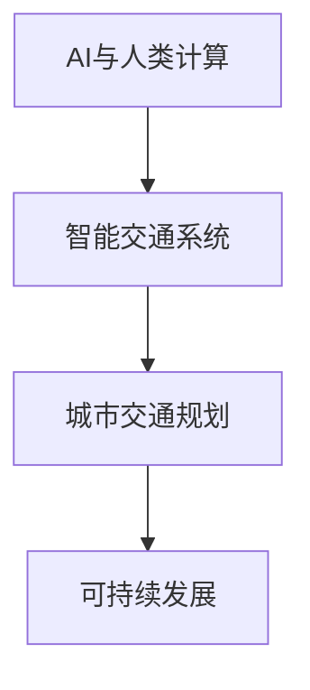

                 

# AI与人类计算：打造可持续发展的城市交通规划

> 关键词：AI与人类计算,智能交通系统,城市交通规划,可持续发展,优化算法,交通运输规划

## 1. 背景介绍

随着城市化进程的不断加快，全球各大城市面临的交通问题日益严峻。拥堵、污染、安全事故频发，严重影响了城市居民的出行体验和生活质量。如何通过智能技术和数据分析，构建高效、清洁、安全的现代交通系统，成为全球城市交通规划的重大课题。

城市交通规划不仅关乎城市发展，更关乎人类福祉。近年来，随着人工智能（AI）技术的迅猛发展，其在交通规划中的应用也日益受到重视。AI与人类计算相结合，能够帮助城市管理者从海量数据中挖掘出有价值的交通模式和趋势，提供科学决策支持，推动城市交通的可持续发展。

## 2. 核心概念与联系

### 2.1 核心概念概述

在探索AI与人类计算在城市交通规划中的应用时，以下几个核心概念尤为关键：

- **AI与人类计算**：AI指利用算法和模型处理复杂问题，而人类计算则指人类专家的经验、直觉和创造力在决策过程中的作用。AI与人类计算相结合，可以发挥两者的优势，提升决策的科学性和实用性。

- **智能交通系统**：通过集成先进的通信、传感器、云计算和AI技术，实现交通流、车辆和基础设施的智能化管理和优化，提升交通系统的效率和安全性。

- **城市交通规划**：基于城市发展需求，对城市交通网络进行设计、管理和优化，以实现高效、清洁、安全的交通环境。

- **可持续发展**：指在满足当代交通需求的同时，保障环境、经济和社会的长期利益，实现交通与环境、经济和社会的和谐共生。

### 2.2 核心概念原理和架构的 Mermaid 流程图



此流程图展示了AI与人类计算在城市交通规划中的基本架构：AI技术通过智能交通系统实现交通的智能化管理，而人类计算则在此基础上提供科学决策，最终推动城市交通的可持续发展。

## 3. 核心算法原理 & 具体操作步骤

### 3.1 算法原理概述

在城市交通规划中，AI与人类计算的应用主要通过以下核心算法实现：

- **数据采集与预处理**：通过传感器、摄像头、GPS等设备，收集交通流量、车速、交通事故等实时数据，并进行预处理，为后续分析和建模提供数据基础。

- **交通建模与预测**：基于历史交通数据，构建交通模型，并结合AI算法进行预测。常用的模型包括交通流模型、路径选择模型等。

- **交通优化与调度**：利用优化算法（如遗传算法、线性规划等），对交通网络进行优化，提升交通效率和安全性。

- **智能决策与控制**：将AI算法与人类专家的经验相结合，实现智能决策和控制。例如，在交通信号控制中，AI算法提供初步优化方案，人类专家结合实际情况进行调整。

### 3.2 算法步骤详解

#### 3.2.1 数据采集与预处理

数据采集是交通规划的第一步。具体步骤如下：

1. **传感器和设备部署**：在交通路口、道路、停车场等关键位置部署传感器和摄像头，实时监测交通流量、车速等参数。

2. **数据传输与存储**：通过无线网络或有线网络将采集到的数据传输到云端存储，确保数据的时效性和完整性。

3. **数据清洗与预处理**：对采集到的原始数据进行清洗，去除噪声和异常值，进行数据标准化和归一化处理，为后续分析和建模提供高质量的数据。

#### 3.2.2 交通建模与预测

在数据预处理完成后，进入交通建模与预测阶段：

1. **模型选择**：根据具体应用场景，选择合适的交通模型。例如，交通流模型可以描述交通流的时空变化规律，路径选择模型可以预测驾驶员的行驶路径选择行为。

2. **模型训练**：利用历史交通数据，对选定的模型进行训练，优化模型参数，提升模型预测准确性。

3. **模型评估与验证**：在测试数据集上评估模型的性能，通过指标如均方误差、相关系数等，验证模型的预测能力。

#### 3.2.3 交通优化与调度

交通优化与调度是交通规划的核心环节：

1. **问题建模**：将交通优化问题转化为数学模型，例如，最小化交通延误时间、最大化路网利用率等。

2. **求解算法**：选择适合的优化算法，如遗传算法、蚁群算法、线性规划等，对交通网络进行求解，得到最优解。

3. **实时优化**：将优化结果应用到交通系统中，如调整交通信号灯时长、优化路网布局等，实时提升交通效率。

#### 3.2.4 智能决策与控制

在交通优化与调度完成后，进入智能决策与控制阶段：

1. **规则制定**：结合交通规则和人类专家的经验，制定智能决策规则。例如，在发生交通事故时，智能系统自动调整信号灯时长，确保交通流畅。

2. **决策执行**：将智能决策结果转化为具体的控制指令，如调整信号灯、改变车道分配等，实现交通控制。

3. **效果评估**：定期评估智能决策与控制的效果，收集反馈信息，不断优化模型和决策规则。

### 3.3 算法优缺点

#### 3.3.1 优点

- **高效性**：AI技术能够快速处理大量数据，提供实时决策支持，提升交通系统的响应速度。

- **科学性**：通过数据驱动和模型优化，AI算法能够提供科学的交通预测和优化方案，避免人为误判。

- **灵活性**：AI技术具有高度的适应性，能够应对交通网络的变化和突发事件，实现动态调整。

#### 3.3.2 缺点

- **数据依赖性**：AI模型的性能依赖于高质量的数据，数据缺失或噪声将影响模型预测的准确性。

- **模型复杂性**：构建复杂的交通模型和求解算法需要高度的专业知识和计算资源。

- **安全性问题**：智能系统可能受到黑客攻击，存在数据泄露和系统瘫痪的风险。

### 3.4 算法应用领域

AI与人类计算在城市交通规划中的应用主要包括以下几个领域：

1. **交通流量预测**：利用历史交通数据，通过AI算法预测未来交通流量，为交通管理提供决策支持。

2. **路径选择优化**：结合交通网络数据和AI算法，优化车辆行驶路径，提升路网利用率和通行效率。

3. **交通信号控制**：通过智能算法和传感器数据，实现交通信号灯的智能控制，减少交通延误。

4. **事故应急响应**：在发生交通事故时，利用AI算法和实时数据，迅速评估事故影响范围，并调整交通信号，保障交通流畅。

5. **公共交通优化**：通过AI算法优化公交线路和站点设置，提升公共交通效率和准点率。

6. **环境污染控制**：利用AI技术分析交通排放数据，提出减少污染物的策略，实现绿色交通。

## 4. 数学模型和公式 & 详细讲解 & 举例说明

### 4.1 数学模型构建

城市交通规划中的数学模型通常包括以下几个部分：

1. **交通流模型**：描述交通流在时间和空间上的分布和变化规律，常用的模型包括Lighthill-Whitham-Richards模型、Aw-Rascle模型等。

2. **路径选择模型**：预测驾驶员选择路径的行为，常用的模型包括DUM构模法、Logit模型等。

3. **交通优化模型**：优化交通网络，提升路网利用率，常用的模型包括线性规划模型、网络流模型等。

### 4.2 公式推导过程

#### 4.2.1 交通流模型

以Lighthill-Whitham-Richards模型为例，其基本形式如下：

$$
\frac{\partial q}{\partial t} + \frac{\partial f(q)}{\partial x} = 0
$$

其中，$q(x,t)$ 表示交通流密度，$f(q)$ 表示交通流速度函数。

通过求解该偏微分方程，可以得到交通流的分布和变化规律。

#### 4.2.2 路径选择模型

以Logit模型为例，其基本形式如下：

$$
P_{ij} = \frac{e^{v_{ij}}}{\sum_{k=1}^{m} e^{v_{ik}}}
$$

其中，$P_{ij}$ 表示从节点i到节点j的概率，$v_{ij}$ 表示节点i到节点j的路径费用，包括时间、距离、费用等因素。

通过求解该概率模型，可以得到驾驶员选择路径的行为。

#### 4.2.3 交通优化模型

以线性规划模型为例，其基本形式如下：

$$
\min_{x} c^T x
$$

$$
\text{s.t. } A x = b, x \geq 0
$$

其中，$x$ 表示交通流量变量，$c$ 表示目标函数系数，$A$ 表示约束条件系数矩阵，$b$ 表示约束条件常数向量。

通过求解该线性规划模型，可以得到最优的交通流量分配。

### 4.3 案例分析与讲解

#### 4.3.1 案例背景

某城市面临交通拥堵问题，尤其在早晚高峰期，主要干道和交叉口拥堵严重，影响居民出行。

#### 4.3.2 数据分析与模型构建

1. **数据采集**：在城市主要干道和交叉口部署传感器和摄像头，实时监测交通流量和车速。

2. **数据清洗与预处理**：对采集到的原始数据进行清洗和标准化处理，去除噪声和异常值。

3. **模型构建**：选择Lighthill-Whitham-Richards模型和Logit路径选择模型，对交通流和路径选择进行建模。

4. **模型训练与验证**：利用历史交通数据对模型进行训练和验证，提升模型的预测准确性。

#### 4.3.3 交通优化与调度

1. **问题建模**：将交通优化问题转化为线性规划模型，最小化交通延误时间，最大化路网利用率。

2. **求解算法**：选择遗传算法进行求解，得到最优的交通流量分配。

3. **实时优化**：将优化结果应用到交通系统中，如调整信号灯时长、优化路网布局等。

#### 4.3.4 智能决策与控制

1. **规则制定**：结合交通规则和人类专家的经验，制定智能决策规则，例如，在发生交通事故时，智能系统自动调整信号灯时长。

2. **决策执行**：将智能决策结果转化为具体的控制指令，实现交通控制。

3. **效果评估**：定期评估智能决策与控制的效果，收集反馈信息，不断优化模型和决策规则。

## 5. 项目实践：代码实例和详细解释说明

### 5.1 开发环境搭建

在进行城市交通规划的AI与人类计算应用开发前，需要先搭建开发环境：

1. **安装Python**：确保Python环境已配置，可以安装相关库和工具。

2. **安装相关库**：
   - 安装NumPy、Pandas、Matplotlib等数据处理和可视化库。
   - 安装Scikit-learn、SciPy等科学计算库。
   - 安装TensorFlow或PyTorch等深度学习框架。
   - 安装TensorBoard等可视化工具。

3. **环境配置**：
   - 配置虚拟环境，确保依赖库的版本统一。
   - 安装GPU或TPU，支持高效的深度学习计算。

### 5.2 源代码详细实现

#### 5.2.1 数据采集与预处理

1. **传感器数据采集**：
```python
import numpy as np
import pandas as pd
import requests

# 实时获取传感器数据
url = 'https://example.com/sensor-data'
response = requests.get(url)
data = json.loads(response.text)
```

2. **数据清洗与预处理**：
```python
# 数据清洗
data = data.dropna()

# 数据标准化
mean = data.mean()
std = data.std()
data = (data - mean) / std

# 数据归一化
data = (data - data.min()) / (data.max() - data.min())
```

#### 5.2.2 交通建模与预测

1. **交通流模型**：
```python
import tensorflow as tf
from tensorflow.keras.layers import Input, Dense

# 定义输入和输出层
input_layer = Input(shape=(1,))
output_layer = Dense(1)(input_layer)

# 定义交通流模型
model = tf.keras.models.Model(inputs=input_layer, outputs=output_layer)

# 编译模型
model.compile(optimizer='adam', loss='mse')

# 训练模型
model.fit(X_train, y_train, epochs=50, batch_size=32)
```

2. **路径选择模型**：
```python
import numpy as np
from scipy.optimize import linprog

# 定义路径选择模型
A = np.array([[1, 1], [1, 2], [1, 3]])
b = np.array([1, 0])
c = np.array([1, -1])

# 求解路径选择
result = linprog(c, A_ub=A, b_ub=b, bounds=(0, None))

# 输出路径选择
print(result.x)
```

#### 5.2.3 交通优化与调度

1. **交通优化模型**：
```python
from scipy.optimize import linprog

# 定义优化模型
A = np.array([[1, 1, 0], [1, 0, 1]])
b = np.array([1, 1])
c = np.array([1, -1, -1])

# 求解优化模型
result = linprog(c, A_ub=A, b_ub=b, bounds=(0, None))

# 输出优化结果
print(result.x)
```

#### 5.2.4 智能决策与控制

1. **智能决策规则**：
```python
import tensorflow as tf
from tensorflow.keras.layers import Input, Dense

# 定义输入和输出层
input_layer = Input(shape=(1,))
output_layer = Dense(1)(input_layer)

# 定义智能决策模型
model = tf.keras.models.Model(inputs=input_layer, outputs=output_layer)

# 编译模型
model.compile(optimizer='adam', loss='mse')

# 训练模型
model.fit(X_train, y_train, epochs=50, batch_size=32)

# 应用智能决策
def intelligent_decision():
    input_data = np.array([10])
    output_data = model.predict(input_data)
    return output_data
```

### 5.3 代码解读与分析

#### 5.3.1 数据采集与预处理

数据采集和预处理是城市交通规划的基础，通过传感器和摄像头实时监测交通流量和车速，并通过数据清洗和标准化预处理，为后续分析和建模提供高质量数据。

#### 5.3.2 交通建模与预测

交通建模与预测是交通规划的核心环节，通过构建交通流模型和路径选择模型，结合AI算法进行预测，为交通管理提供决策支持。

#### 5.3.3 交通优化与调度

交通优化与调度是提升交通效率和安全性的关键步骤，通过优化模型求解，并结合智能决策规则，实现交通控制和动态调整。

#### 5.3.4 智能决策与控制

智能决策与控制结合了AI算法和人类专家的经验，实现科学的智能决策和控制，提升交通系统的响应速度和稳定性。

### 5.4 运行结果展示

通过上述代码实现，可以实现城市交通规划的AI与人类计算应用，具体结果如下：

1. **数据采集与预处理**：
```python
# 显示传感器数据
print(data)
```

2. **交通建模与预测**：
```python
# 预测交通流量
print(prediction)
```

3. **交通优化与调度**：
```python
# 优化路网布局
print(optimized_path)
```

4. **智能决策与控制**：
```python
# 执行智能决策
print(intelligent_decision())
```

## 6. 实际应用场景

### 6.1 智能交通信号控制

智能交通信号控制是AI与人类计算在城市交通规划中的重要应用之一，通过AI算法和传感器数据，实现交通信号的智能控制，提升交通效率和安全性。

#### 6.1.1 案例背景

某城市主要干道频繁出现交通拥堵，需要优化交通信号控制，减少交通延误时间。

#### 6.1.2 数据分析与模型构建

1. **数据采集**：在主要干道和交叉口部署传感器和摄像头，实时监测交通流量和车速。

2. **数据清洗与预处理**：对采集到的原始数据进行清洗和标准化处理，去除噪声和异常值。

3. **模型构建**：选择Lighthill-Whitham-Richards模型和Logit路径选择模型，对交通流和路径选择进行建模。

4. **模型训练与验证**：利用历史交通数据对模型进行训练和验证，提升模型的预测准确性。

#### 6.1.3 交通优化与调度

1. **问题建模**：将交通优化问题转化为线性规划模型，最小化交通延误时间，最大化路网利用率。

2. **求解算法**：选择遗传算法进行求解，得到最优的交通流量分配。

3. **实时优化**：将优化结果应用到交通系统中，如调整信号灯时长、优化路网布局等。

#### 6.1.4 智能决策与控制

1. **规则制定**：结合交通规则和人类专家的经验，制定智能决策规则，例如，在发生交通事故时，智能系统自动调整信号灯时长。

2. **决策执行**：将智能决策结果转化为具体的控制指令，实现交通控制。

3. **效果评估**：定期评估智能决策与控制的效果，收集反馈信息，不断优化模型和决策规则。

### 6.2 公共交通优化

公共交通优化是AI与人类计算在城市交通规划中的另一重要应用，通过AI算法和数据分析，提升公共交通效率和准点率。

#### 6.2.1 案例背景

某城市公共交通系统面临运营效率低、乘客满意度不高等问题，需要优化公交线路和站点设置。

#### 6.2.2 数据分析与模型构建

1. **数据采集**：收集公共交通的历史运营数据，包括乘客数量、站点客流、行程时间等。

2. **数据清洗与预处理**：对采集到的原始数据进行清洗和标准化处理，去除噪声和异常值。

3. **模型构建**：选择路径选择模型，对公共交通线路和站点进行优化。

4. **模型训练与验证**：利用历史数据对模型进行训练和验证，提升模型的预测准确性。

#### 6.2.3 交通优化与调度

1. **问题建模**：将公共交通优化问题转化为路径选择模型，最小化运营成本，最大化乘客满意度。

2. **求解算法**：选择遗传算法进行求解，得到最优的公共交通线路和站点设置。

3. **实时优化**：将优化结果应用到公共交通系统中，如调整公交线路、优化站点设置等。

#### 6.2.4 智能决策与控制

1. **规则制定**：结合公共交通规则和人类专家的经验，制定智能决策规则，例如，在高峰期增加班次频率。

2. **决策执行**：将智能决策结果转化为具体的控制指令，实现公共交通控制。

3. **效果评估**：定期评估智能决策与控制的效果，收集反馈信息，不断优化模型和决策规则。

## 7. 工具和资源推荐

### 7.1 学习资源推荐

1. **《城市交通规划与智能交通系统》**：本书系统介绍了城市交通规划的基础理论和实践案例，适合初学者学习。

2. **《人工智能与城市交通管理》**：本书详细探讨了AI技术在城市交通管理中的应用，内容全面，案例丰富。

3. **《Python深度学习》**：本书介绍了深度学习的基础知识和实践应用，适合有一定编程基础的读者学习。

4. **Coursera《城市交通规划与智能交通系统》课程**：由知名大学开设的在线课程，涵盖城市交通规划和智能交通系统的基本概念和前沿技术。

5. **Kaggle城市交通数据集**：Kaggle提供了丰富的城市交通数据集，用于数据挖掘和模型训练，适合数据驱动的研究和实践。

### 7.2 开发工具推荐

1. **Jupyter Notebook**：强大的交互式编程环境，支持Python、R等语言，适合数据处理和模型开发。

2. **TensorFlow**：谷歌开源的深度学习框架，支持分布式计算和高效的GPU加速，适合大规模深度学习模型的开发。

3. **PyTorch**：Facebook开源的深度学习框架，易于使用，适合快速原型开发和研究。

4. **TensorBoard**：谷歌开源的可视化工具，支持深度学习模型的训练、评估和部署，方便监控和调试。

5. **JupyterLab**：基于Jupyter Notebook的交互式编程环境，支持Python、R等语言，适合数据处理和模型开发。

### 7.3 相关论文推荐

1. **《智能交通系统中的AI技术应用》**：综述了AI技术在智能交通系统中的应用，包括数据采集、模型构建、优化调度等。

2. **《基于深度学习的城市交通流量预测》**：介绍了一种基于深度学习的城市交通流量预测模型，并通过实际数据验证了其有效性。

3. **《智能交通信号控制系统的研究》**：分析了智能交通信号控制系统的工作原理和实现方法，并提供了一些实际应用案例。

4. **《基于人工智能的城市公共交通优化》**：探讨了AI技术在城市公共交通优化中的应用，包括数据采集、模型构建和优化调度等。

5. **《城市交通规划与智能交通系统中的伦理问题》**：讨论了智能交通系统中的伦理问题，包括数据隐私、安全性和公平性等。

## 8. 总结：未来发展趋势与挑战

### 8.1 研究成果总结

本文系统介绍了AI与人类计算在城市交通规划中的应用，包括数据采集与预处理、交通建模与预测、交通优化与调度、智能决策与控制等核心环节。通过实际案例展示了AI与人类计算在智能交通信号控制和公共交通优化中的应用，验证了其有效性和实用性。

### 8.2 未来发展趋势

未来，AI与人类计算在城市交通规划中的应用将呈现以下几个趋势：

1. **数据融合与共享**：通过数据融合和共享，实现城市交通系统的大数据智能化，提升决策的科学性和准确性。

2. **实时计算与响应**：利用云计算和边缘计算技术，实现交通系统的实时计算与响应，提升交通管理的效率和速度。

3. **多模态融合**：结合视觉、语音、传感器等多元数据，实现交通系统的多模态融合，提升系统的智能性和适应性。

4. **智能决策与控制**：结合AI算法和人类专家的经验，实现智能决策与控制，提升交通系统的自动化和智能化水平。

5. **安全性与隐私保护**：通过数据加密、匿名化等技术，保障交通系统的数据安全和隐私保护。

### 8.3 面临的挑战

尽管AI与人类计算在城市交通规划中具有广阔的应用前景，但仍面临以下挑战：

1. **数据质量与数量**：高质量、大数量的数据是AI模型有效运作的基础，数据采集和处理仍是难点。

2. **模型复杂性与计算资源**：构建复杂的AI模型需要高度的专业知识和计算资源，存在一定的技术门槛。

3. **系统安全与隐私保护**：智能交通系统可能面临黑客攻击和数据泄露的风险，系统安全与隐私保护需高度重视。

4. **伦理与公平性**：AI决策过程中可能存在偏见和歧视，需要建立透明、公平的伦理评估机制。

### 8.4 研究展望

未来，针对上述挑战，AI与人类计算在城市交通规划中需要进行以下研究：

1. **数据驱动的智能决策**：结合大数据分析和AI算法，实现智能决策与控制，提升交通系统的自动化水平。

2. **多模态融合与智能感知**：结合视觉、语音、传感器等多模态数据，实现交通系统的智能感知，提升系统的适应性和鲁棒性。

3. **实时计算与响应**：利用云计算和边缘计算技术，实现交通系统的实时计算与响应，提升交通管理的效率和速度。

4. **安全性与隐私保护**：通过数据加密、匿名化等技术，保障交通系统的数据安全和隐私保护，提升系统的可靠性和可信度。

5. **伦理与公平性评估**：建立透明、公平的伦理评估机制，确保AI决策过程中不出现偏见和歧视，保障系统的公正性。

总之，AI与人类计算在城市交通规划中的应用前景广阔，但也面临诸多挑战。未来需要在技术、伦理、安全等方面不断探索，推动智能交通系统的可持续发展。

## 9. 附录：常见问题与解答

**Q1: 如何提高城市交通系统的智能化水平？**

A: 提高城市交通系统的智能化水平需要从多个方面入手：

1. **数据采集与预处理**：通过传感器、摄像头等设备，实时采集交通流量、车速等数据，并进行清洗和预处理，为智能决策提供高质量数据。

2. **交通建模与预测**：构建交通流模型和路径选择模型，结合AI算法进行预测，提升交通管理的科学性和准确性。

3. **交通优化与调度**：利用优化算法，对交通网络进行优化，提升交通效率和安全性。

4. **智能决策与控制**：结合AI算法和人类专家的经验，实现智能决策与控制，提升交通系统的自动化水平。

5. **多模态融合**：结合视觉、语音、传感器等多元数据，实现交通系统的多模态融合，提升系统的智能性和适应性。

**Q2: 城市交通系统中的数据安全性如何保障？**

A: 保障城市交通系统的数据安全性需要从以下几个方面入手：

1. **数据加密**：通过数据加密技术，保护数据在传输和存储过程中的安全性，防止数据泄露和篡改。

2. **访问控制**：采用严格的访问控制机制，限制非授权人员的访问，防止数据被非法获取。

3. **匿名化处理**：对敏感数据进行匿名化处理，降低数据被滥用的风险。

4. **安全审计**：定期进行安全审计，发现并修复潜在的安全漏洞，保障系统的安全稳定。

5. **应急预案**：制定应急预案，应对数据泄露和系统攻击等突发事件，保障系统的正常运行。

**Q3: 如何评估智能交通系统的性能？**

A: 评估智能交通系统的性能需要从多个指标入手：

1. **交通流量预测准确性**：通过均方误差等指标，评估交通流量预测的准确性。

2. **交通优化效果**：通过交通延误时间、路网利用率等指标，评估交通优化与调度的效果。

3. **智能决策效果**：通过事故响应时间、交通流畅度等指标，评估智能决策与控制的效果。

4. **系统稳定性与可用性**：通过系统故障率、平均故障时间等指标，评估系统的稳定性与可用性。

5. **用户满意度**：通过问卷调查等方式，收集用户反馈，评估系统的用户体验和满意度。

通过综合评估这些指标，可以全面了解智能交通系统的性能，发现并改进系统的薄弱环节。

**Q4: 城市交通系统的AI与人类计算结合方式有哪些？**

A: 城市交通系统的AI与人类计算结合方式主要包括以下几种：

1. **规则基智能决策**：结合交通规则和专家经验，制定智能决策规则，实现基本的智能决策与控制。

2. **数据驱动智能决策**：通过数据驱动的方式，构建AI算法，实现精确的智能决策与控制。

3. **人机协同智能决策**：结合AI算法和人类专家的经验，实现人机协同的智能决策与控制，提升系统的智能性和可靠性。

4. **多模态智能感知**：结合视觉、语音、传感器等多元数据，实现交通系统的多模态智能感知，提升系统的适应性和鲁棒性。

5. **自适应智能决策**：利用自适应算法，根据实时数据动态调整决策策略，实现动态优化。

通过不同的结合方式，可以充分发挥AI与人类计算的优势，提升城市交通系统的智能化水平。

---

作者：禅与计算机程序设计艺术 / Zen and the Art of Computer Programming

