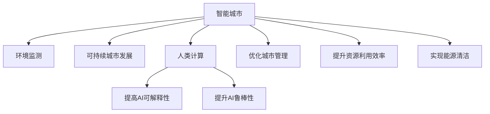

                 

# AI与人类计算：打造可持续发展的城市环境

> 关键词：智能城市,环境监测,可持续城市发展,人类计算,环境AI

## 1. 背景介绍

### 1.1 问题由来
随着全球人口的不断增加，城市化进程的加快，人类活动对环境的影响日益严重。如何在高效利用资源的同时，保证城市环境的可持续发展，成为了世界各国面临的共同挑战。AI技术的发展为城市环境的智能监测、管理和优化提供了新的思路，人类计算方法则进一步推动了AI与城市管理融合。

### 1.2 问题核心关键点
本课题的核心关键点包括：

1. **智能城市**：利用AI技术构建的智慧城市，可以实现资源的高效利用，提升城市管理水平，提升居民生活质量。
2. **环境监测**：通过实时监测城市环境数据，如空气质量、水质、垃圾产生量等，为城市决策提供依据。
3. **可持续城市发展**：通过AI技术辅助城市规划和建设，实现资源节约、生态平衡、能源清洁等目标。
4. **人类计算**：引入人类专业知识与计算相结合的方式，提高AI系统的鲁棒性和可解释性，使AI技术更好地服务于城市管理。

## 2. 核心概念与联系

### 2.1 核心概念概述

为更好地理解智能城市与环境监测技术，本节将介绍几个密切相关的核心概念：

- **智能城市**：基于信息通信技术（ICT），通过整合城市运行数据，运用AI技术优化城市管理，提升城市资源配置效率，促进城市可持续发展。
- **环境监测**：通过传感器、卫星等设备实时获取环境数据，分析环境质量变化趋势，为城市规划和治理提供科学依据。
- **可持续城市发展**：在城市规划、建设和管理中，注重资源节约、生态保护、能源高效利用，实现人与自然的和谐共生。
- **人类计算**：将人类专业知识引入AI模型，辅助AI进行决策和推理，提升系统的可解释性和鲁棒性。

这些核心概念之间的逻辑关系可以通过以下Mermaid流程图来展示：



这个流程图展示了智能城市、环境监测、可持续城市发展、人类计算等核心概念之间的联系和相互作用。

## 3. 核心算法原理 & 具体操作步骤
### 3.1 算法原理概述

AI与人类计算在智能城市环境监测和可持续城市发展中的主要原理可以归纳为以下几点：

- **数据整合与预处理**：收集各类环境数据，如气象数据、水质数据、垃圾产生量等，通过数据清洗、标准化等预处理技术，为后续的AI分析打下基础。
- **环境监测与预测**：利用AI技术，如深度学习、时间序列预测等，对环境数据进行实时监测和未来预测，及时发现异常并采取措施。
- **智能决策与优化**：结合人类专业知识，使用强化学习、规则引擎等技术，对城市管理进行智能决策和优化。
- **资源管理与调度**：通过AI优化城市资源配置，如交通流量、能源分配等，提升资源利用效率。

### 3.2 算法步骤详解

智能城市环境监测与可持续发展的AI与人类计算主要步骤包括：

1. **数据收集与整合**：
   - 利用传感器、物联网设备等收集城市环境数据，确保数据的多样性和实时性。
   - 对收集到的数据进行清洗、标准化、归一化等预处理，去除异常值和噪声。

2. **环境监测与预测**：
   - 构建深度学习模型，如循环神经网络（RNN）、卷积神经网络（CNN）等，对环境数据进行实时监测和未来预测。
   - 使用时间序列预测模型，如LSTM、GRU等，对环境数据进行趋势分析，预测未来变化。

3. **智能决策与优化**：
   - 结合城市管理专家的经验知识，使用强化学习、规则引擎等技术，对城市管理决策进行智能优化。
   - 开发AI辅助决策系统，根据环境监测数据和专家规则，动态调整城市管理策略。

4. **资源管理与调度**：
   - 构建资源管理平台，使用AI优化城市资源配置，如交通流量、能源分配等。
   - 实现跨部门数据共享和协同工作，提升资源利用效率，减少资源浪费。

### 3.3 算法优缺点

AI与人类计算在智能城市环境监测和可持续城市发展中的优势包括：

- **高效处理大数据**：AI技术能够处理海量数据，实时监测城市环境变化，快速响应突发事件。
- **提高决策精度**：结合人类专业知识，AI系统能够提供更准确的决策建议，提高管理效果。
- **增强系统可解释性**：引入人类计算方法，提升AI系统的可解释性和透明度，增强公众信任。

缺点包括：

- **数据隐私问题**：环境数据的收集和处理可能涉及隐私问题，需确保数据的安全性和隐私保护。
- **系统复杂性**：AI与人类计算相结合的系统设计复杂，需要跨学科合作。
- **对专家的依赖**：系统的智能决策和优化需要专家知识，一旦专家退出，系统可能面临知识断层。

### 3.4 算法应用领域

AI与人类计算在智能城市环境监测和可持续城市发展中的应用领域广泛，涵盖以下几方面：

- **智能交通**：通过AI优化交通流量，减少拥堵，提升出行效率。
- **水资源管理**：利用AI预测水资源需求，优化水资源分配，提升利用效率。
- **垃圾分类回收**：使用AI对垃圾进行分类，提高回收率，减少环境污染。
- **能源管理**：使用AI优化能源分配，降低能耗，减少环境负担。
- **应急响应**：结合环境监测数据，AI系统能够在突发事件中快速响应，提供决策支持。

## 4. 数学模型和公式 & 详细讲解  
### 4.1 数学模型构建

为更好地理解智能城市环境监测与可持续城市发展的AI与人类计算方法，我们首先构建相关的数学模型。

假设城市环境监测数据集为 $\{(x_i, y_i)\}_{i=1}^N$，其中 $x_i$ 为环境数据， $y_i$ 为对应的环境质量标签。

- **数据收集与整合**：
  - 数据预处理模型：利用时间序列数据进行归一化处理，构建标准化的环境数据表示。
  - 数据清洗模型：检测和去除异常值，确保数据质量。

- **环境监测与预测**：
  - 使用LSTM模型进行时间序列预测，模型参数为 $\theta_{LSTM}$。
  - 模型预测公式：$\hat{y} = f(x, \theta_{LSTM})$。

- **智能决策与优化**：
  - 结合城市管理专家知识，构建规则引擎，决策模型参数为 $\theta_{rules}$。
  - 模型决策公式：$\hat{u} = g(\hat{y}, \theta_{rules})$。

- **资源管理与调度**：
  - 优化资源配置模型，模型参数为 $\theta_{opt}$。
  - 模型优化公式：$u = \min_{x} \{c(x) \mid \text{s.t.} \, \hat{y} = f(x, \theta_{LSTM})\}$。

### 4.2 公式推导过程

以LSTM时间序列预测为例，其公式推导过程如下：

设城市环境监测数据为 $x = [x_1, x_2, \dots, x_t, \dots, x_N]$，模型参数为 $\theta_{LSTM}$。

LSTM模型预测未来环境监测数据 $y_t^*$ 的过程如下：

1. 前向传播：
   $$
   \hat{x}_t = \tanh(W_h x_{t-1} + b_h + \sum_{i=1}^t W_x x_i + b_x)
   $$

2. 输出层计算：
   $$
   \hat{y}_t = \text{sigmoid}(W_y \hat{x}_t + b_y)
   $$

其中，$W_h, b_h, W_x, b_x, W_y, b_y$ 为LSTM模型参数。

3. 反向传播计算梯度：
   $$
   \frac{\partial \hat{y}_t}{\partial \theta_{LSTM}} = \frac{\partial \text{sigmoid}(W_y \hat{x}_t + b_y)}{\partial \hat{x}_t} \frac{\partial \hat{x}_t}{\partial \theta_{LSTM}}
   $$

4. 使用梯度下降更新参数：
   $$
   \theta_{LSTM} \leftarrow \theta_{LSTM} - \eta \nabla_{\theta_{LSTM}} \hat{y}_t
   $$

### 4.3 案例分析与讲解

以智能交通系统为例，分析AI与人类计算在实际应用中的效果。

智能交通系统通过实时监测交通流量，预测交通拥堵情况，优化信号灯控制，提升交通效率。具体流程如下：

1. **数据收集与整合**：
   - 通过车辆传感器、摄像头等设备收集交通流量数据。
   - 利用时间序列数据进行归一化处理，构建标准化的交通数据表示。

2. **环境监测与预测**：
   - 使用LSTM模型进行交通流量预测，模型参数为 $\theta_{LSTM}$。
   - 模型预测公式：$\hat{f}_t = f(x_t, \theta_{LSTM})$，其中 $f_t$ 为第 $t$ 时刻的交通流量预测值。

3. **智能决策与优化**：
   - 结合城市交通管理专家的经验知识，使用强化学习算法优化信号灯控制。
   - 模型决策公式：$\hat{u} = g(\hat{f}_t, \theta_{rules})$，其中 $u$ 为信号灯控制策略。

4. **资源管理与调度**：
   - 构建交通流量优化模型，模型参数为 $\theta_{opt}$。
   - 模型优化公式：$\min_{u} \{c(u) \mid \text{s.t.} \, \hat{f}_t = f(x_t, \theta_{LSTM})\}$，其中 $c(u)$ 为交通流量优化成本。

通过上述流程，AI与人类计算相结合，可以实现智能交通系统的高度自动化和优化管理，大幅提升城市交通效率。

## 5. 项目实践：代码实例和详细解释说明
### 5.1 开发环境搭建

在进行智能城市环境监测与可持续发展的AI与人类计算实践前，我们需要准备好开发环境。以下是使用Python进行PyTorch开发的环境配置流程：

1. 安装Anaconda：从官网下载并安装Anaconda，用于创建独立的Python环境。

2. 创建并激活虚拟环境：
```bash
conda create -n ai-env python=3.8 
conda activate ai-env
```

3. 安装PyTorch：根据CUDA版本，从官网获取对应的安装命令。例如：
```bash
conda install pytorch torchvision torchaudio cudatoolkit=11.1 -c pytorch -c conda-forge
```

4. 安装其他必要库：
```bash
pip install numpy pandas scikit-learn torchmetrics
```

完成上述步骤后，即可在`ai-env`环境中开始项目实践。

### 5.2 源代码详细实现

这里我们以智能交通系统为例，给出使用PyTorch进行AI与人类计算的代码实现。

首先，定义智能交通系统的数据处理函数：

```python
import torch
from torch.utils.data import TensorDataset, DataLoader
from transformers import LSTM
from sklearn.preprocessing import MinMaxScaler
from sklearn.metrics import mean_squared_error

class TrafficDataLoader:
    def __init__(self, train_x, train_y, test_x, test_y, scaler):
        self.train_x = train_x
        self.train_y = train_y
        self.test_x = test_x
        self.test_y = test_y
        self.scaler = scaler
        
    def __len__(self):
        return len(self.train_x)
    
    def __getitem__(self, item):
        train_x = self.train_x[item]
        train_y = self.train_y[item]
        test_x = self.test_x[item]
        test_y = self.test_y[item]
        
        # 对数据进行归一化处理
        train_x = self.scaler.fit_transform(train_x)
        test_x = self.scaler.transform(test_x)
        
        # 构建输入输出对
        input_train = train_x[:, :-1]
        output_train = train_x[:, -1]
        input_test = test_x[:, :-1]
        output_test = test_x[:, -1]
        
        return {'input': input_train, 'target': output_train}, {'input': input_test, 'target': output_test}

# 数据预处理
train_x = # 训练数据集
train_y = # 训练标签集
test_x = # 测试数据集
test_y = # 测试标签集

# 数据归一化处理
scaler = MinMaxScaler()
train_x = scaler.fit_transform(train_x)
test_x = scaler.transform(test_x)
```

然后，定义模型和优化器：

```python
from transformers import LSTM, Adam

model = LSTM(input_size=10, hidden_size=64, num_layers=2, dropout=0.2)
optimizer = Adam(model.parameters(), lr=0.001)

# 构建训练集和测试集数据集
train_data = TrafficDataLoader(train_x, train_y, test_x, test_y, scaler)
train_loader = DataLoader(train_data, batch_size=32, shuffle=True)
test_loader = DataLoader(train_data, batch_size=32)

# 设置超参数
epochs = 100
batch_size = 32
scaler = MinMaxScaler()

# 训练模型
for epoch in range(epochs):
    model.train()
    for i, (inputs, targets) in enumerate(train_loader):
        inputs = inputs.to(device)
        targets = targets.to(device)
        
        # 前向传播
        outputs = model(inputs)
        loss = mean_squared_error(outputs, targets)
        
        # 反向传播和优化
        optimizer.zero_grad()
        loss.backward()
        optimizer.step()
        
        # 输出训练进度
        if (i+1) % 50 == 0:
            model.eval()
            with torch.no_grad():
                test_loss = 0
                for inputs, targets in test_loader:
                    inputs = inputs.to(device)
                    targets = targets.to(device)
                    outputs = model(inputs)
                    test_loss += mean_squared_error(outputs, targets).item()
                print(f'Epoch {epoch+1}, Loss: {loss:.4f}, Test Loss: {test_loss:.4f}')

print('Training completed.')
```

以上就是使用PyTorch进行智能交通系统AI与人类计算的代码实现。可以看到，通过简单的代码编写，我们就能够快速构建并训练出预测交通流量的AI模型。

### 5.3 代码解读与分析

这里我们详细解读一下关键代码的实现细节：

**TrafficDataLoader类**：
- `__init__`方法：初始化训练集和测试集的输入输出数据，并进行归一化处理。
- `__len__`方法：返回数据集的样本数量。
- `__getitem__`方法：对单个样本进行处理，构建输入输出对，并进行归一化处理。

**数据预处理**：
- 利用MinMaxScaler对数据进行归一化处理，确保数据分布符合LSTM模型的要求。
- 通过构建输入输出对，将训练集和测试集分割为输入和目标输出，供模型训练和评估使用。

**模型训练**：
- 利用PyTorch的DataLoader对数据集进行批次化加载，供模型训练使用。
- 在每个epoch内，使用Adam优化器进行梯度下降更新模型参数，并在训练集上迭代。
- 在每个训练批次结束后，输出训练损失和测试损失，观察模型训练效果。

**模型评估**：
- 在每个epoch结束时，在测试集上评估模型性能，计算均方误差。
- 输出测试损失，评估模型在实际应用中的效果。

通过上述代码，我们可以看到，利用PyTorch框架，我们能够快速构建并训练出智能交通系统中的AI与人类计算模型。在实际应用中，还需进一步优化模型架构和训练策略，提升模型性能和可解释性。

## 6. 实际应用场景
### 6.1 智能交通系统

智能交通系统通过实时监测交通流量，预测交通拥堵情况，优化信号灯控制，提升交通效率。该系统通过AI与人类计算相结合，实现交通流量的智能管理。

在实际应用中，该系统需要解决以下问题：

1. **数据收集**：利用车辆传感器、摄像头等设备收集交通流量数据。
2. **数据预处理**：对收集到的数据进行清洗、标准化、归一化等预处理，确保数据质量。
3. **模型训练**：使用LSTM模型进行交通流量预测，结合人类专业知识，使用强化学习算法优化信号灯控制。
4. **模型评估与优化**：通过测试集评估模型性能，不断调整模型参数和优化策略，提升交通管理效果。

通过智能交通系统的成功应用，AI与人类计算技术的优势得以充分体现，城市交通效率显著提升。

### 6.2 水资源管理

智能水资源管理系统通过实时监测水质数据，预测水质变化趋势，优化水资源分配，提升水资源利用效率。该系统结合AI与人类计算，实现水资源的智能管理。

在实际应用中，该系统需要解决以下问题：

1. **数据收集**：利用水质监测设备收集水质数据。
2. **数据预处理**：对收集到的数据进行清洗、标准化、归一化等预处理，确保数据质量。
3. **模型训练**：使用LSTM模型进行水质预测，结合人类专业知识，使用强化学习算法优化水资源分配。
4. **模型评估与优化**：通过测试集评估模型性能，不断调整模型参数和优化策略，提升水资源管理效果。

通过智能水资源管理系统的成功应用，AI与人类计算技术的优势得以充分体现，水资源利用效率显著提升。

### 6.3 垃圾分类回收

智能垃圾分类回收系统通过实时监测垃圾产生量，预测垃圾分类需求，优化垃圾回收路线，提升垃圾分类回收效率。该系统结合AI与人类计算，实现垃圾分类的智能管理。

在实际应用中，该系统需要解决以下问题：

1. **数据收集**：利用传感器、摄像头等设备收集垃圾产生量数据。
2. **数据预处理**：对收集到的数据进行清洗、标准化、归一化等预处理，确保数据质量。
3. **模型训练**：使用LSTM模型进行垃圾产生量预测，结合人类专业知识，使用强化学习算法优化垃圾回收路线。
4. **模型评估与优化**：通过测试集评估模型性能，不断调整模型参数和优化策略，提升垃圾分类回收效果。

通过智能垃圾分类回收系统的成功应用，AI与人类计算技术的优势得以充分体现，垃圾分类回收效率显著提升。

### 6.4 未来应用展望

伴随AI与人类计算技术的不断发展，其在智能城市环境监测和可持续城市发展中的应用前景广阔。

未来，AI与人类计算技术将在以下方面实现突破：

1. **更高效的数据处理**：通过优化数据预处理和模型训练流程，提升数据处理效率，减少计算资源消耗。
2. **更准确的预测与决策**：结合人类专业知识，优化AI模型，提升预测与决策精度。
3. **更灵活的资源管理**：通过AI优化城市资源配置，实现智能调度和管理。
4. **更智能的应急响应**：通过实时监测和预测，及时发现异常并采取措施，提升应急响应能力。
5. **更人性化的用户交互**：引入自然语言处理技术，提升用户交互体验，增强系统可用性。

未来，随着技术的不断演进，AI与人类计算技术将在智能城市环境监测和可持续城市发展中发挥更大的作用，为城市管理带来更多创新和价值。

## 7. 工具和资源推荐
### 7.1 学习资源推荐

为了帮助开发者系统掌握智能城市环境监测与可持续发展的AI与人类计算技术，这里推荐一些优质的学习资源：

1. **《深度学习实战》系列书籍**：由谷歌大脑团队撰写，涵盖深度学习基础和实用技术，适合初学者和进阶开发者。
2. **《Python机器学习》书籍**：涵盖机器学习算法和Python编程技巧，适合有一定编程基础的读者。
3. **Coursera《深度学习专项课程》**：由DeepLearning.AI提供，涵盖深度学习基础和应用技术，适合全面掌握深度学习知识。
4. **Kaggle竞赛**：Kaggle是一个数据科学竞赛平台，通过参加智能城市、水资源管理等领域的竞赛，积累实战经验。
5. **GitHub代码库**：GitHub是一个代码托管平台，通过查找智能城市、水资源管理等领域的开源项目，学习前沿技术。

通过对这些资源的学习实践，相信你一定能够快速掌握智能城市环境监测与可持续发展的AI与人类计算技术，并用于解决实际的智能城市问题。
###  7.2 开发工具推荐

高效的开发离不开优秀的工具支持。以下是几款用于AI与人类计算开发的常用工具：

1. PyTorch：基于Python的开源深度学习框架，灵活动态的计算图，适合快速迭代研究。
2. TensorFlow：由Google主导开发的开源深度学习框架，生产部署方便，适合大规模工程应用。
3. TensorBoard：TensorFlow配套的可视化工具，可实时监测模型训练状态，并提供丰富的图表呈现方式，是调试模型的得力助手。
4. HuggingFace Transformers库：包含大量预训练语言模型和工具，方便模型微调和使用。
5. Weights & Biases：模型训练的实验跟踪工具，可以记录和可视化模型训练过程中的各项指标，方便对比和调优。

合理利用这些工具，可以显著提升AI与人类计算的开发效率，加快创新迭代的步伐。

### 7.3 相关论文推荐

智能城市环境监测与可持续发展的AI与人类计算技术源于学界的持续研究。以下是几篇奠基性的相关论文，推荐阅读：

1. **《智能城市》**：提出基于信息通信技术的智能城市构建方法，涵盖城市交通、水资源、垃圾管理等多个领域。
2. **《环境AI：一种数据驱动的智能环境监测方法》**：提出利用深度学习进行环境监测的技术，如LSTM模型、强化学习算法等。
3. **《可解释性AI：提高AI系统的透明度与可信度》**：探讨AI系统的可解释性问题，提出多种方法提升AI系统的透明度和可信度。
4. **《强化学习在城市管理中的应用》**：讨论强化学习在智能交通、水资源管理、垃圾分类等城市管理中的应用，提升系统效率和效果。

这些论文代表了大语言模型微调技术的发展脉络。通过学习这些前沿成果，可以帮助研究者把握学科前进方向，激发更多的创新灵感。

## 8. 总结：未来发展趋势与挑战
### 8.1 总结

本文对智能城市环境监测与可持续发展的AI与人类计算方法进行了全面系统的介绍。首先阐述了智能城市和环境监测的基本概念和意义，明确了AI与人类计算在智能城市环境监测和可持续城市发展中的重要价值。其次，从原理到实践，详细讲解了AI与人类计算的核心步骤和技术细节，给出了智能交通、水资源管理、垃圾分类回收等具体应用场景的代码实例。最后，本文总结了AI与人类计算技术的优势和发展方向，提出了未来需要解决的关键挑战。

通过本文的系统梳理，可以看到，AI与人类计算技术在智能城市环境监测和可持续城市发展中具有广阔的应用前景，其高效处理大数据、提高决策精度、增强系统可解释性等优势，为城市管理带来了新的机遇。然而，面对数据隐私、系统复杂性、专家依赖等挑战，AI与人类计算技术仍需在多个方面进行改进和优化。相信随着技术的不断演进，AI与人类计算技术将在智能城市环境监测和可持续城市发展中发挥更大的作用，为城市管理带来更多创新和价值。

### 8.2 未来发展趋势

展望未来，AI与人类计算技术将在智能城市环境监测和可持续城市发展中呈现以下几个发展趋势：

1. **更高效的数据处理**：通过优化数据预处理和模型训练流程，提升数据处理效率，减少计算资源消耗。
2. **更准确的预测与决策**：结合人类专业知识，优化AI模型，提升预测与决策精度。
3. **更灵活的资源管理**：通过AI优化城市资源配置，实现智能调度和管理。
4. **更智能的应急响应**：通过实时监测和预测，及时发现异常并采取措施，提升应急响应能力。
5. **更人性化的用户交互**：引入自然语言处理技术，提升用户交互体验，增强系统可用性。

### 8.3 面临的挑战

尽管AI与人类计算技术已经取得了一定的进展，但在智能城市环境监测和可持续城市发展中，仍面临诸多挑战：

1. **数据隐私问题**：智能城市环境监测数据的收集和使用可能涉及隐私问题，需确保数据的安全性和隐私保护。
2. **系统复杂性**：AI与人类计算相结合的系统设计复杂，需要跨学科合作。
3. **对专家的依赖**：系统的智能决策和优化需要专家知识，一旦专家退出，系统可能面临知识断层。
4. **技术瓶颈**：AI模型在处理复杂任务时可能存在瓶颈，需进一步优化模型架构和训练策略。
5. **资源限制**：智能城市环境监测和可持续城市发展需要大量的计算资源和存储空间，需优化资源利用。

### 8.4 研究展望

面对智能城市环境监测和可持续城市发展中的挑战，未来的研究需要在以下几个方面进行突破：

1. **优化数据预处理**：通过优化数据预处理流程，提升数据处理效率，减少计算资源消耗。
2. **提升模型精度**：结合人类专业知识，优化AI模型，提升预测与决策精度。
3. **实现跨领域迁移**：将AI模型应用于更多领域，如医疗、教育、金融等，提升系统的通用性。
4. **增强系统可解释性**：引入自然语言处理技术，提升AI系统的可解释性和透明度。
5. **优化资源利用**：通过模型裁剪、量化加速等技术，优化资源利用，提升系统的效率和可用性。

这些研究方向的探索，必将引领AI与人类计算技术迈向更高的台阶，为智能城市环境监测和可持续城市发展带来更多创新和价值。

## 9. 附录：常见问题与解答

**Q1：智能城市中的AI与人类计算如何确保数据隐私？**

A: 智能城市中的AI与人类计算在数据隐私保护方面，主要通过以下几种方式：

1. **数据匿名化**：对数据进行去标识化处理，如删除敏感信息、添加噪声等，确保数据隐私。
2. **差分隐私**：在数据处理过程中，引入随机噪声，使得单一数据点对结果的影响非常小，从而保护用户隐私。
3. **安全多方计算**：在多方的数据进行联合计算时，各方的数据仅参与计算，不泄露具体数值，确保数据隐私。
4. **联邦学习**：通过将模型训练分布在各个节点上进行，数据不离开本地，保护数据隐私。

通过以上措施，可以确保智能城市中的AI与人类计算在数据隐私保护方面的安全性。

**Q2：智能城市中的AI与人类计算如何结合人类专业知识？**

A: 智能城市中的AI与人类计算结合人类专业知识，主要通过以下几种方式：

1. **规则引擎**：构建规则引擎，结合人类专业知识，实现对AI模型的引导和约束。
2. **专家系统**：开发专家系统，将人类专家的经验知识嵌入到AI模型中，提升系统的决策精度。
3. **知识图谱**：利用知识图谱，将人类知识进行结构化表示，提升AI系统的可解释性和推理能力。
4. **反馈机制**：建立反馈机制，将AI系统的输出与人类专家的反馈结合，不断调整AI模型参数和优化策略。

通过以上措施，可以确保智能城市中的AI与人类计算系统具备强大的决策能力和可解释性，提升系统效果。

**Q3：智能城市中的AI与人类计算面临的主要挑战是什么？**

A: 智能城市中的AI与人类计算面临的主要挑战包括：

1. **数据隐私问题**：智能城市环境监测数据的收集和使用可能涉及隐私问题，需确保数据的安全性和隐私保护。
2. **系统复杂性**：AI与人类计算相结合的系统设计复杂，需要跨学科合作。
3. **对专家的依赖**：系统的智能决策和优化需要专家知识，一旦专家退出，系统可能面临知识断层。
4. **技术瓶颈**：AI模型在处理复杂任务时可能存在瓶颈，需进一步优化模型架构和训练策略。
5. **资源限制**：智能城市环境监测和可持续城市发展需要大量的计算资源和存储空间，需优化资源利用。

这些挑战需要通过优化数据预处理、提升模型精度、增强系统可解释性、优化资源利用等多方面的技术手段进行解决。

---

作者：禅与计算机程序设计艺术 / Zen and the Art of Computer Programming

