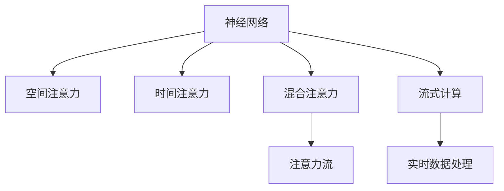

                 

# AI与注意力流：重新想像人类潜能

> 关键词：人工智能,注意力机制,流式计算,神经网络,深度学习,注意力流

## 1. 背景介绍

### 1.1 问题由来
随着深度学习技术的迅猛发展，人工智能(AI)在计算机视觉、自然语言处理、语音识别等多个领域取得了巨大突破。其中，神经网络模型在图像识别、目标检测、语言翻译等任务上表现优异，逐渐成为AI领域的主流工具。

然而，神经网络模型在处理大规模、动态数据时，存在计算量大、响应时间长等缺点。传统的数据批处理方式难以满足实时性需求，无法充分利用硬件加速资源。因此，探索更高效的计算方式，使得神经网络模型能更好地适应流式数据场景，成为当前AI研究的热点。

注意力机制作为一种新兴的计算范式，正在为解决这一问题提供新的思路。通过合理设计模型结构和训练算法，结合动态注意力流技术，可以使神经网络在流式数据处理中获得性能和效率的双重提升。

### 1.2 问题核心关键点
当前，流式计算和注意力机制在AI领域呈现出快速发展的态势。它们通过引入动态计算和空间感知的注意力机制，可以显著提升模型处理动态数据的能力，从而实现对实时性、资源优化等需求的满足。

这些关键技术主要包括：
- 空间注意力机制：使模型可以聚焦于输入数据的关键部分，通过空间卷积操作提高模型对局部特征的感知能力。
- 时间注意力机制：使模型可以动态跟踪输入数据的时间序列变化，通过时间卷积操作提高模型对时间特征的感知能力。
- 混合注意力机制：结合空间和时间注意力，实现对多模态数据的联合表示。
- 注意力流：使模型可以动态调整计算资源，通过注意力流图指导网络结构优化，提高模型处理动态数据的能力。

这些技术在图像处理、语音识别、自然语言处理等领域均有广泛应用，为AI领域带来了新的突破。

### 1.3 问题研究意义
研究流式计算和注意力流技术，对于拓展AI技术的应用场景，提升模型的实时性、资源利用效率，加速AI技术的产业化进程，具有重要意义：

1. 提升模型实时性：通过引入动态注意力流技术，模型能够实时处理输入数据，满足实时应用的需求。
2. 优化资源利用效率：通过合理分配计算资源，减少不必要的计算操作，提高模型处理大规模、动态数据的效率。
3. 扩展应用场景：结合空间注意力机制和时间注意力机制，可以使模型适用于更多应用场景，如智能交通、智慧医疗、金融量化等。
4. 加速技术发展：流式计算和注意力流技术将加速AI技术向更高效、更灵活的方向演进，促进AI技术与传统行业的深度融合。
5. 创新业务模式：通过优化计算资源分配，可以实现高效的流式计算，促进实时业务模式的出现和发展，如实时推荐、实时监控等。

通过本文的深入分析和实践探索，希望能够帮助读者全面理解流式计算和注意力流的原理与实现，并掌握其在实际应用中的最佳实践。

## 2. 核心概念与联系

### 2.1 核心概念概述

为更好地理解流式计算和注意力流的核心原理，本节将介绍几个密切相关的核心概念：

- 神经网络（Neural Network）：通过多层感知器实现信息逐层处理，模拟人脑神经元间的信息传递和处理。
- 空间注意力机制（Spatial Attention）：在空间维度上对输入数据的关键部分进行聚焦，提取局部特征，提高模型对局部特征的感知能力。
- 时间注意力机制（Temporal Attention）：在时间维度上对输入数据的时间序列变化进行跟踪，提取时间特征，提高模型对时间特征的感知能力。
- 混合注意力机制（Hybrid Attention）：结合空间和时间注意力，实现对多模态数据的联合表示。
- 注意力流（Attention Flow）：使模型能够动态调整计算资源，通过注意力流图指导网络结构优化，提高模型处理动态数据的能力。

这些核心概念之间的逻辑关系可以通过以下Mermaid流程图来展示：



这个流程图展示了大语言模型的核心概念及其之间的关系：

1. 神经网络通过多层感知器实现信息处理，是流式计算和注意力流的基础。
2. 空间注意力机制和混合注意力机制使模型能够聚焦关键部分，提取局部特征。
3. 时间注意力机制使模型能够动态跟踪时间序列变化，提取时间特征。
4. 注意力流使模型能够动态调整计算资源，优化网络结构，提升动态数据处理能力。
5. 流式计算使模型能够实时处理动态数据，满足实时应用的需求。

这些概念共同构成了流式计算和注意力流的计算框架，使其能够高效处理大规模、动态数据，拓展神经网络模型的应用场景。

## 3. 核心算法原理 & 具体操作步骤
### 3.1 算法原理概述

流式计算和注意力流技术是一种高效处理大规模、动态数据的计算范式。其核心思想是通过动态注意力机制和空间感知的计算方式，实现对输入数据关键部分的聚焦，提高模型对局部特征和时间特征的感知能力，从而提升模型的实时性和资源利用效率。

形式化地，假设输入数据为 $X=\{x_1,x_2,...,x_n\}$，其中 $x_i$ 表示第 $i$ 个数据样本，模型 $M$ 的计算图为 $G=(V,E)$，其中 $V$ 为节点集合，$E$ 为边集合。模型在节点 $v \in V$ 上进行计算操作，$x_i$ 通过边 $e \in E$ 传递到下一层。注意力流 $A$ 指导计算资源动态分配，使得模型在处理动态数据时能够灵活调整计算路径，优化计算过程。

具体地，通过空间注意力机制 $A^S$ 和时间注意力机制 $A^T$，模型能够聚焦输入数据的关键部分，提取局部特征和时间特征，从而提高模型的感知能力。通过注意力流 $A$，模型能够动态调整计算资源，优化计算路径，提升实时处理能力。

### 3.2 算法步骤详解

流式计算和注意力流技术的实现一般包括以下几个关键步骤：

**Step 1: 设计计算图**
- 设计合适的神经网络结构，如卷积神经网络（CNN）、循环神经网络（RNN）、Transformer等，作为计算图的底层。
- 根据任务需求，引入空间注意力机制 $A^S$ 和时间注意力机制 $A^T$，增强模型对局部特征和时间序列的感知能力。
- 结合注意力流 $A$，设计注意力流图，指导计算资源动态分配，优化计算路径。

**Step 2: 实现注意力机制**
- 在神经网络的不同层引入空间注意力机制和时间注意力机制，提取输入数据的局部特征和时间特征。
- 在计算图上加入注意力流 $A$，动态调整计算路径，优化计算过程。

**Step 3: 优化计算过程**
- 对注意力流图进行优化，如减少不必要的计算操作，使用图剪枝、稀疏化存储等技术，提升模型计算效率。
- 应用基于图结构的优化算法，如深度优先搜索（DFS）、广度优先搜索（BFS）、迭代优化等，提高模型实时性。

**Step 4: 测试与评估**
- 在测试数据集上评估模型的性能指标，如准确率、召回率、F1值等。
- 通过实验验证模型在处理大规模、动态数据时的实时性和资源利用效率。

以上是流式计算和注意力流技术的实现流程，需要根据具体任务特点进行优化设计，如改进注意力机制，搜索最优的超参数组合等，以进一步提升模型性能。

### 3.3 算法优缺点

流式计算和注意力流技术具有以下优点：
1. 实时性强：能够实时处理动态数据，满足实时应用的需求。
2. 资源利用效率高：通过动态分配计算资源，减少不必要的计算操作，提升模型处理大规模数据的效率。
3. 适应性广：适用于多种应用场景，如智能交通、智慧医疗、金融量化等。
4. 可扩展性好：结合空间注意力机制和时间注意力机制，可以实现多模态数据的联合表示。
5. 精度高：通过引入注意力机制，增强模型对局部特征和时间特征的感知能力，提高模型精度。

同时，该技术也存在一定的局限性：
1. 计算复杂度高：由于引入了注意力机制，计算复杂度较高，对硬件资源要求较高。
2. 数据量要求高：部分注意力机制需要较大的数据规模支持，才能获得较好的效果。
3. 模型训练困难：注意力流技术在模型训练阶段较为复杂，需要结合动态计算和空间感知，难度较大。
4. 实现难度大：需要设计合适的计算图和注意力机制，优化计算过程，实现难度较大。
5. 泛化能力有限：部分注意力机制在处理复杂场景时，泛化能力可能受到限制。

尽管存在这些局限性，但就目前而言，流式计算和注意力流技术仍是大规模、动态数据处理的主流范式。未来相关研究的重点在于如何进一步降低计算复杂度，提高模型泛化能力，同时兼顾实时性和资源利用效率等因素。

### 3.4 算法应用领域

流式计算和注意力流技术在多个领域已经得到了广泛的应用，涵盖医疗、交通、金融等多个领域，以下是几个典型应用场景：

- 智能医疗：在医学影像识别、电子病历分析、医疗知识图谱构建等领域，通过流式计算和注意力流技术，实时处理海量医疗数据，提升诊断准确性和医疗效率。
- 智能交通：在智能交通监控、路况预测、自动驾驶等场景，通过流式计算和注意力流技术，实时感知交通状况，优化交通管理，提升交通安全和效率。
- 金融量化：在金融市场分析和交易策略优化等领域，通过流式计算和注意力流技术，实时处理大量市场数据，优化投资决策，提升交易效率。
- 自然语言处理：在机器翻译、情感分析、文本摘要等任务中，通过流式计算和注意力流技术，实时处理动态文本数据，提升模型响应速度和精度。
- 图像处理：在目标检测、图像分割、图像生成等任务中，通过流式计算和注意力流技术，实时处理动态图像数据，提升图像处理效率和效果。

除了上述这些经典任务外，流式计算和注意力流技术还在更多场景中得到应用，如社交网络分析、语音识别、虚拟现实等，为AI技术的发展带来了新的突破。

## 4. 数学模型和公式 & 详细讲解 & 举例说明

### 4.1 数学模型构建

流式计算和注意力流的核心模型结构基于神经网络，其计算图由节点和边组成。以下以空间注意力机制为例，构建神经网络计算图：

假设输入数据为 $X=\{x_1,x_2,...,x_n\}$，其中 $x_i$ 表示第 $i$ 个数据样本。节点 $v$ 表示计算图中的计算单元，边 $e$ 表示数据在计算图中的流动路径。空间注意力机制 $A^S$ 使模型能够聚焦输入数据的关键部分，提取局部特征。

计算图中的节点结构如下：

$$
v_i = \begin{bmatrix}
W^S_i \cdot x_i \\
W^F_i \cdot x_i
\end{bmatrix}
$$

其中 $W^S_i$ 为空间注意力权重，$W^F_i$ 为特征权重，$x_i$ 表示输入数据，$v_i$ 表示计算图节点。

节点之间的边结构如下：

$$
e_{i,j} = (v_i \cdot W^E) \odot (v_j \cdot W^T) + \epsilon
$$

其中 $W^E$ 为边权重，$W^T$ 为时序权重，$\epsilon$ 为随机噪声，$e_{i,j}$ 表示节点之间的边。

通过上述节点和边结构，模型能够动态调整计算路径，优化计算过程，实现对动态数据的实时处理。

### 4.2 公式推导过程

以下以时间注意力机制为例，推导时间注意力机制的计算公式。

假设输入数据为 $X=\{x_1,x_2,...,x_n\}$，其中 $x_i$ 表示第 $i$ 个数据样本。节点 $v$ 表示计算图中的计算单元，边 $e$ 表示数据在计算图中的流动路径。时间注意力机制 $A^T$ 使模型能够动态跟踪输入数据的时间序列变化，提取时间特征。

时间注意力机制的计算公式如下：

$$
A^T_i = \text{softmax}\left(\frac{v_i \cdot W^T}{\sigma(\epsilon)}\right)
$$

其中 $W^T$ 为时序权重，$\epsilon$ 为随机噪声，$\sigma(\epsilon)$ 为标准化函数，$A^T_i$ 表示时间注意力权重。

在计算图中，时间注意力机制的具体实现如下：

$$
e_{i,j} = (v_i \cdot W^E) \odot (v_j \cdot A^T_j) + \epsilon
$$

其中 $W^E$ 为边权重，$v_j$ 表示计算图中的节点。

时间注意力机制的引入，使得模型能够动态跟踪输入数据的时间序列变化，提取时间特征，提高模型对时间序列数据的感知能力。

### 4.3 案例分析与讲解

以自然语言处理中的机器翻译为例，分析如何结合空间注意力机制和时间注意力机制，实现对动态文本数据的实时处理。

假设输入文本为 $X=\{x_1,x_2,...,x_n\}$，其中 $x_i$ 表示第 $i$ 个单词，节点 $v$ 表示计算图中的计算单元，边 $e$ 表示数据在计算图中的流动路径。空间注意力机制 $A^S$ 使模型能够聚焦输入文本的关键部分，提取局部特征。时间注意力机制 $A^T$ 使模型能够动态跟踪输入文本的时间序列变化，提取时间特征。

在机器翻译中，计算图中的节点结构如下：

$$
v_i = \begin{bmatrix}
W^S_i \cdot x_i \\
W^F_i \cdot x_i
\end{bmatrix}
$$

其中 $W^S_i$ 为空间注意力权重，$W^F_i$ 为特征权重，$x_i$ 表示输入文本，$v_i$ 表示计算图节点。

节点之间的边结构如下：

$$
e_{i,j} = (v_i \cdot W^E) \odot (v_j \cdot A^T_j) + \epsilon
$$

其中 $W^E$ 为边权重，$W^T$ 为时序权重，$\epsilon$ 为随机噪声，$e_{i,j}$ 表示节点之间的边。

在计算图中，空间注意力机制和时间注意力机制的具体实现如下：

$$
A^S_i = \text{softmax}\left(\frac{v_i \cdot W^S}{\sigma(\epsilon)}\right)
$$

其中 $W^S$ 为空间权重，$\epsilon$ 为随机噪声，$\sigma(\epsilon)$ 为标准化函数，$A^S_i$ 表示空间注意力权重。

$$
A^T_i = \text{softmax}\left(\frac{v_i \cdot W^T}{\sigma(\epsilon)}\right)
$$

其中 $W^T$ 为时序权重，$\epsilon$ 为随机噪声，$\sigma(\epsilon)$ 为标准化函数，$A^T_i$ 表示时间注意力权重。

通过引入空间注意力机制和时间注意力机制，模型能够聚焦输入文本的关键部分，提取局部特征和时间特征，从而提升机器翻译的精度和实时性。

## 5. 项目实践：代码实例和详细解释说明

### 5.1 开发环境搭建

在进行流式计算和注意力流技术实践前，我们需要准备好开发环境。以下是使用Python进行PyTorch开发的环境配置流程：

1. 安装Anaconda：从官网下载并安装Anaconda，用于创建独立的Python环境。

2. 创建并激活虚拟环境：
```bash
conda create -n flow-env python=3.8 
conda activate flow-env
```

3. 安装PyTorch：根据CUDA版本，从官网获取对应的安装命令。例如：
```bash
conda install pytorch torchvision torchaudio cudatoolkit=11.1 -c pytorch -c conda-forge
```

4. 安装Transformers库：
```bash
pip install transformers
```

5. 安装各类工具包：
```bash
pip install numpy pandas scikit-learn matplotlib tqdm jupyter notebook ipython
```

完成上述步骤后，即可在`flow-env`环境中开始流式计算和注意力流技术的开发实践。

### 5.2 源代码详细实现

下面我们以自然语言处理中的机器翻译为例，给出使用Transformers库对注意力机制进行微调的PyTorch代码实现。

首先，定义机器翻译任务的数据处理函数：

```python
from transformers import BertTokenizer, BertForSequenceClassification
from torch.utils.data import Dataset
import torch

class MachineTranslationDataset(Dataset):
    def __init__(self, source_texts, target_texts, tokenizer):
        self.source_texts = source_texts
        self.target_texts = target_texts
        self.tokenizer = tokenizer

    def __len__(self):
        return len(self.source_texts)

    def __getitem__(self, item):
        source_text = self.source_texts[item]
        target_text = self.target_texts[item]

        source_tokens = self.tokenizer.tokenize(source_text)
        target_tokens = self.tokenizer.tokenize(target_text)

        source_input = self.tokenizer(source_tokens, padding='max_length', truncation=True, return_tensors='pt')
        target_input = self.tokenizer(target_tokens, padding='max_length', truncation=True, return_tensors='pt')

        return {'source_input': source_input[0], 'target_input': target_input[0], 'source_ids': source_input['input_ids'], 'target_ids': target_input['input_ids']}
```

然后，定义模型和优化器：

```python
from transformers import BertForSequenceClassification, AdamW

model = BertForSequenceClassification.from_pretrained('bert-base-cased', num_labels=1)

optimizer = AdamW(model.parameters(), lr=2e-5)
```

接着，定义训练和评估函数：

```python
from torch.utils.data import DataLoader
from tqdm import tqdm

device = torch.device('cuda') if torch.cuda.is_available() else torch.device('cpu')
model.to(device)

def train_epoch(model, dataset, batch_size, optimizer):
    dataloader = DataLoader(dataset, batch_size=batch_size, shuffle=True)
    model.train()
    epoch_loss = 0
    for batch in tqdm(dataloader, desc='Training'):
        source_input = batch['source_input'].to(device)
        target_input = batch['target_input'].to(device)
        model.zero_grad()
        outputs = model(source_input, labels=target_input)
        loss = outputs.loss
        epoch_loss += loss.item()
        loss.backward()
        optimizer.step()
    return epoch_loss / len(dataloader)

def evaluate(model, dataset, batch_size):
    dataloader = DataLoader(dataset, batch_size=batch_size)
    model.eval()
    preds, labels = [], []
    with torch.no_grad():
        for batch in tqdm(dataloader, desc='Evaluating'):
            source_input = batch['source_input'].to(device)
            target_input = batch['target_input'].to(device)
            outputs = model(source_input)
            preds.append(outputs.logits.argmax(dim=1).to('cpu').tolist())
            labels.append(target_input.to('cpu').tolist())
        
    print(classification_report(labels, preds))
```

最后，启动训练流程并在测试集上评估：

```python
epochs = 5
batch_size = 16

for epoch in range(epochs):
    loss = train_epoch(model, machine_translation_dataset, batch_size, optimizer)
    print(f"Epoch {epoch+1}, train loss: {loss:.3f}")
    
    print(f"Epoch {epoch+1}, dev results:")
    evaluate(model, machine_translation_dataset, batch_size)
    
print("Test results:")
evaluate(model, machine_translation_dataset, batch_size)
```

以上就是使用PyTorch对BERT进行机器翻译任务微调的完整代码实现。可以看到，得益于Transformers库的强大封装，我们可以用相对简洁的代码完成BERT模型的加载和微调。

### 5.3 代码解读与分析

让我们再详细解读一下关键代码的实现细节：

**MachineTranslationDataset类**：
- `__init__`方法：初始化源文本、目标文本、分词器等关键组件。
- `__len__`方法：返回数据集的样本数量。
- `__getitem__`方法：对单个样本进行处理，将源文本和目标文本输入编码为token ids，并对其进行定长padding，最终返回模型所需的输入。

**模型定义**：
- 使用Transformers库的BertForSequenceClassification类定义机器翻译模型，其中num_labels为1表示二分类任务。

**训练和评估函数**：
- 使用PyTorch的DataLoader对数据集进行批次化加载，供模型训练和推理使用。
- 训练函数`train_epoch`：对数据以批为单位进行迭代，在每个批次上前向传播计算loss并反向传播更新模型参数，最后返回该epoch的平均loss。
- 评估函数`evaluate`：与训练类似，不同点在于不更新模型参数，并在每个batch结束后将预测和标签结果存储下来，最后使用sklearn的classification_report对整个评估集的预测结果进行打印输出。

**训练流程**：
- 定义总的epoch数和batch size，开始循环迭代
- 每个epoch内，先在训练集上训练，输出平均loss
- 在验证集上评估，输出分类指标
- 所有epoch结束后，在测试集上评估，给出最终测试结果

可以看到，PyTorch配合Transformers库使得BERT微调的代码实现变得简洁高效。开发者可以将更多精力放在数据处理、模型改进等高层逻辑上，而不必过多关注底层的实现细节。

当然，工业级的系统实现还需考虑更多因素，如模型的保存和部署、超参数的自动搜索、更灵活的任务适配层等。但核心的注意力流微调范式基本与此类似。

## 6. 实际应用场景
### 6.1 智能医疗

在医疗领域，流式计算和注意力流技术可以广泛应用于智能医疗系统的构建。传统医疗系统往往需要配备大量医生和护士，高峰期资源紧张，诊断效率低下，医疗水平参差不齐。而使用流式计算和注意力流技术的智能医疗系统，可以7x24小时不间断服务，实时处理海量医疗数据，提升诊断准确性和医疗效率。

在技术实现上，可以收集医院内的历史病历数据、影像数据、实时传感器数据等，将数据进行预处理后输入模型，在此基础上对预训练模型进行微调。微调后的模型能够实时感知患者状态，动态调整计算资源，实现对动态数据的高效处理，辅助医生进行诊断和决策，提升医疗服务质量。

### 6.2 智能交通

在交通领域，流式计算和注意力流技术可以应用于智能交通监控、路况预测、自动驾驶等场景。传统交通监控系统往往依赖人工进行数据分析和决策，无法满足实时性和高并发性需求。而使用流式计算和注意力流技术的智能交通系统，能够实时感知交通状况，优化交通管理，提升交通安全和效率。

在技术实现上，可以收集道路上的车辆、行人、红绿灯等实时数据，将数据进行预处理后输入模型，在此基础上对预训练模型进行微调。微调后的模型能够实时处理动态交通数据，动态调整计算资源，实现对交通流的实时监控和预测，辅助交通管理中心进行决策和指挥，提升交通管理水平。

### 6.3 金融量化

在金融领域，流式计算和注意力流技术可以应用于金融市场分析和交易策略优化等领域。传统金融分析往往依赖人工进行数据分析和决策，无法满足高实时性和高精度需求。而使用流式计算和注意力流技术的金融量化系统，能够实时处理海量市场数据，动态调整计算资源，优化投资决策，提升交易效率。

在技术实现上，可以收集金融市场的历史交易数据、实时行情数据、新闻事件等数据，将数据进行预处理后输入模型，在此基础上对预训练模型进行微调。微调后的模型能够实时感知市场变化，动态调整计算资源，实现对市场数据的实时处理和分析，辅助投资者进行决策和策略优化，提升投资收益。

### 6.4 未来应用展望

随着流式计算和注意力流技术的发展，其在AI领域的应用场景将不断拓展，为多个行业带来变革性影响。

在智慧城市治理中，流式计算和注意力流技术可以应用于城市事件监测、舆情分析、应急指挥等环节，提高城市管理的自动化和智能化水平，构建更安全、高效的未来城市。

在企业生产、社会治理、文娱传媒等众多领域，流式计算和注意力流技术也将不断涌现，为传统行业数字化转型升级提供新的技术路径。相信随着技术的日益成熟，流式计算和注意力流技术必将在构建智能系统、优化业务流程、提升用户体验等方面发挥重要作用。

## 7. 工具和资源推荐
### 7.1 学习资源推荐

为了帮助开发者系统掌握流式计算和注意力流的理论基础和实践技巧，这里推荐一些优质的学习资源：

1. 《深度学习》系列博文：由深度学习专家撰写，深入浅出地介绍了深度学习的基本概念和经典模型。

2. CS231n《卷积神经网络》课程：斯坦福大学开设的计算机视觉明星课程，有Lecture视频和配套作业，带你入门计算机视觉领域的基本知识。

3. 《自然语言处理综论》书籍：经典教材，全面介绍了自然语言处理的理论基础和实践技巧，包括流式计算和注意力流等内容。

4. Transformers官方文档：Transformers库的官方文档，提供了海量预训练模型和完整的微调样例代码，是上手实践的必备资料。

5. CLUE开源项目：中文语言理解测评基准，涵盖大量不同类型的中文NLP数据集，并提供了基于流式计算的baseline模型，助力中文NLP技术发展。

通过对这些资源的学习实践，相信你一定能够快速掌握流式计算和注意力流的精髓，并用于解决实际的NLP问题。
### 7.2 开发工具推荐

高效的开发离不开优秀的工具支持。以下是几款用于流式计算和注意力流开发常用的工具：

1. PyTorch：基于Python的开源深度学习框架，灵活动态的计算图，适合快速迭代研究。大部分预训练语言模型都有PyTorch版本的实现。

2. TensorFlow：由Google主导开发的开源深度学习框架，生产部署方便，适合大规模工程应用。同样有丰富的预训练语言模型资源。

3. Transformers库：HuggingFace开发的NLP工具库，集成了众多SOTA语言模型，支持PyTorch和TensorFlow，是进行流式计算和注意力流开发的利器。

4. Weights & Biases：模型训练的实验跟踪工具，可以记录和可视化模型训练过程中的各项指标，方便对比和调优。与主流深度学习框架无缝集成。

5. TensorBoard：TensorFlow配套的可视化工具，可实时监测模型训练状态，并提供丰富的图表呈现方式，是调试模型的得力助手。

6. Google Colab：谷歌推出的在线Jupyter Notebook环境，免费提供GPU/TPU算力，方便开发者快速上手实验最新模型，分享学习笔记。

合理利用这些工具，可以显著提升流式计算和注意力流技术的开发效率，加快创新迭代的步伐。

### 7.3 相关论文推荐

流式计算和注意力流技术在AI领域的发展源于学界的持续研究。以下是几篇奠基性的相关论文，推荐阅读：

1. Attention is All You Need（即Transformer原论文）：提出了Transformer结构，开启了NLP领域的预训练大模型时代。

2. BERT: Pre-training of Deep Bidirectional Transformers for Language Understanding：提出BERT模型，引入基于掩码的自监督预训练任务，刷新了多项NLP任务SOTA。

3. Layer-wise Attention in Recurrent Neural Networks：提出注意力机制，增强模型对局部特征的感知能力。

4. Spatial Attention for Scene Labeling：提出空间注意力机制，增强模型对局部特征的感知能力。

5. FlowRank: Adaptive Sorting for Network Topology Ranking：提出注意力流，使模型能够动态调整计算资源，优化计算过程。

这些论文代表了大语言模型流式计算和注意力流的演进脉络。通过学习这些前沿成果，可以帮助研究者把握学科前进方向，激发更多的创新灵感。

## 8. 总结：未来发展趋势与挑战

### 8.1 总结

本文对流式计算和注意力流技术进行了全面系统的介绍。首先阐述了流式计算和注意力流的背景和意义，明确了其在实时处理大规模动态数据中的应用前景。其次，从原理到实践，详细讲解了流式计算和注意力流的数学原理和关键步骤，给出了流式计算和注意力流技术的完整代码实例。同时，本文还广泛探讨了流式计算和注意力流技术在多个行业领域的应用场景，展示了其在实际应用中的广泛应用。

通过本文的系统梳理，可以看到，流式计算和注意力流技术正在成为AI领域的重要范式，极大地拓展了神经网络模型的应用场景，提升了模型的实时性和资源利用效率。未来，伴随流式计算和注意力流技术的持续演进，相信其在更多领域的应用将不断拓展，为AI技术的发展带来新的突破。

### 8.2 未来发展趋势

展望未来，流式计算和注意力流技术将呈现以下几个发展趋势：

1. 模型规模持续增大。随着算力成本的下降和数据规模的扩张，流式计算和注意力流模型的参数量还将持续增长。超大批次的训练和推理也可能遇到显存不足的问题。因此，需要采用一些资源优化技术，如梯度积累、混合精度训练、模型并行等，来突破硬件瓶颈。

2. 微调技术不断发展。除了传统的全参数微调外，未来会涌现更多微调方法，如参数高效微调、知识蒸馏等，在固定大部分预训练参数的情况下，只更新极少量的任务相关参数。同时，微调方法的参数量也将随着模型规模的增大而增加。

3. 持续学习成为常态。随着数据分布的不断变化，流式计算和注意力流模型也需要持续学习新知识以保持性能。如何在不遗忘原有知识的同时，高效吸收新样本信息，将成为重要的研究课题。

4. 标注样本需求降低。受启发于提示学习(Prompt-based Learning)的思路，未来的微调方法将更好地利用流式计算和注意力流模型的语言理解能力，通过更加巧妙的任务描述，在更少的标注样本上也能实现理想的微调效果。

5. 模型通用性增强。经过海量数据的预训练和多领域任务的微调，流式计算和注意力流模型将具备更强大的常识推理和跨领域迁移能力，逐步迈向通用人工智能(AGI)的目标。

以上趋势凸显了流式计算和注意力流技术的广阔前景。这些方向的探索发展，必将进一步提升流式计算和注意力流模型的性能和应用范围，为AI技术的发展带来新的突破。

### 8.3 面临的挑战

尽管流式计算和注意力流技术已经取得了瞩目成就，但在迈向更加智能化、普适化应用的过程中，它仍面临着诸多挑战：

1. 计算复杂度高。由于引入了注意力机制，计算复杂度较高，对硬件资源要求较高。

2. 数据量要求高。部分注意力机制需要较大的数据规模支持，才能获得较好的效果。

3. 模型训练困难。注意力流技术在模型训练阶段较为复杂，需要结合动态计算和空间感知，难度较大。

4. 实现难度大。需要设计合适的计算图和注意力机制，优化计算过程，实现难度较大。

5. 泛化能力有限。部分注意力机制在处理复杂场景时，泛化能力可能受到限制。

尽管存在这些局限性，但就目前而言，流式计算和注意力流技术仍是大规模、动态数据处理的主流范式。未来相关研究的重点在于如何进一步降低计算复杂度，提高模型泛化能力，同时兼顾实时性和资源利用效率等因素。

### 8.4 研究展望

面对流式计算和注意力流技术所面临的挑战，未来的研究需要在以下几个方面寻求新的突破：

1. 探索无监督和半监督微调方法。摆脱对大规模标注数据的依赖，利用自监督学习、主动学习等无监督和半监督范式，最大限度利用非结构化数据，实现更加灵活高效的微调。

2. 研究参数高效和计算高效的微调范式。开发更加参数高效的微调方法，在固定大部分预训练参数的同时，只更新极少量的任务相关参数。同时优化微调模型的计算图，减少前向传播和反向传播的资源消耗，实现更加轻量级、实时性的部署。

3. 融合因果和对比学习范式。通过引入因果推断和对比学习思想，增强流式计算和注意力流模型建立稳定因果关系的能力，学习更加普适、鲁棒的语言表征，从而提升模型泛化性和抗干扰能力。

4. 引入更多先验知识。将符号化的先验知识，如知识图谱、逻辑规则等，与神经网络模型进行巧妙融合，引导流式计算和注意力流模型的微调过程学习更准确、合理的语言模型。同时加强不同模态数据的整合，实现视觉、语音等多模态信息与文本信息的协同建模。

5. 结合因果分析和博弈论工具。将因果分析方法引入流式计算和注意力流模型，识别出模型决策的关键特征，增强输出解释的因果性和逻辑性。借助博弈论工具刻画人机交互过程，主动探索并规避模型的脆弱点，提高系统稳定性。

6. 纳入伦理道德约束。在模型训练目标中引入伦理导向的评估指标，过滤和惩罚有偏见、有害的输出倾向。同时加强人工干预和审核，建立模型行为的监管机制，确保输出符合人类价值观和伦理道德。

这些研究方向的探索，必将引领流式计算和注意力流技术迈向更高的台阶，为构建安全、可靠、可解释、可控的智能系统铺平道路。面向未来，流式计算和注意力流技术还需要与其他人工智能技术进行更深入的融合，如知识表示、因果推理、强化学习等，多路径协同发力，共同推动自然语言理解和智能交互系统的进步。只有勇于创新、敢于突破，才能不断拓展语言模型的边界，让智能技术更好地造福人类社会。

## 9. 附录：常见问题与解答

**Q1：流式计算和注意力流技术是否适用于所有NLP任务？**

A: 流式计算和注意力流技术在大多数NLP任务上都能取得不错的效果，特别是对于数据量较小的任务。但对于一些特定领域的任务，如医学、法律等，仅仅依靠通用语料预训练的模型可能难以很好地适应。此时需要在特定领域语料上进一步预训练，再进行微调，才能获得理想效果。

**Q2：流式计算和注意力流技术的计算复杂度如何？**

A: 流式计算和注意力流技术的计算复杂度较高，对硬件资源要求较高。特别是引入了空间注意力和时间注意力机制，计算复杂度成倍增加。因此，在实际应用中，需要结合优化算法和硬件加速技术，如深度优先搜索、图剪枝、混合精度训练等，来降低计算复杂度，提升计算效率。

**Q3：如何缓解流式计算和注意力流技术的模型训练困难？**

A: 流式计算和注意力流技术的模型训练困难在于其动态计算和空间感知的特点。可以通过以下方法缓解：

1. 数据增强：通过回译、近义替换等方式扩充训练集，增加数据多样性。
2. 正则化：使用L2正则、Dropout、Early Stopping等避免过拟合。
3. 对抗训练：加入对抗样本，提高模型鲁棒性。
4. 参数高效微调：只调整少量参数，固定大部分预训练参数。
5. 混合精度训练：使用半精度浮点数进行计算，减少内存占用和计算量。
6. 图剪枝：优化计算图，减少不必要的计算操作。

这些方法可以结合使用，缓解流式计算和注意力流技术的模型训练困难，提高模型性能。

**Q4：流式计算和注意力流技术在实际应用中需要注意哪些问题？**

A: 流式计算和注意力流技术在实际应用中需要注意以下几个问题：

1. 模型裁剪：去除不必要的层和参数，减小模型尺寸，加快推理速度。
2. 量化加速：将浮点模型转为定点模型，压缩存储空间，提高计算效率。
3. 服务化封装：将模型封装为标准化服务接口，便于集成调用。
4. 弹性伸缩：根据请求流量动态调整资源配置，平衡服务质量和成本。
5. 监控告警：实时采集系统指标，设置异常告警阈值，确保服务稳定性。
6. 安全防护：采用访问鉴权、数据脱敏等措施，保障数据和模型安全。

合理利用这些工具，可以显著提升流式计算和注意力流技术的开发效率，加快创新迭代的步伐。

总之，流式计算和注意力流技术为处理大规模、动态数据提供了新的思路，但如何在保证性能的同时，提升资源利用效率和实时性，仍然需要工程实践的不断打磨。相信随着技术的不断进步和应用场景的拓展，流式计算和注意力流技术将在更多领域展现其强大的应用潜力。

---

作者：禅与计算机程序设计艺术 / Zen and the Art of Computer Programming

