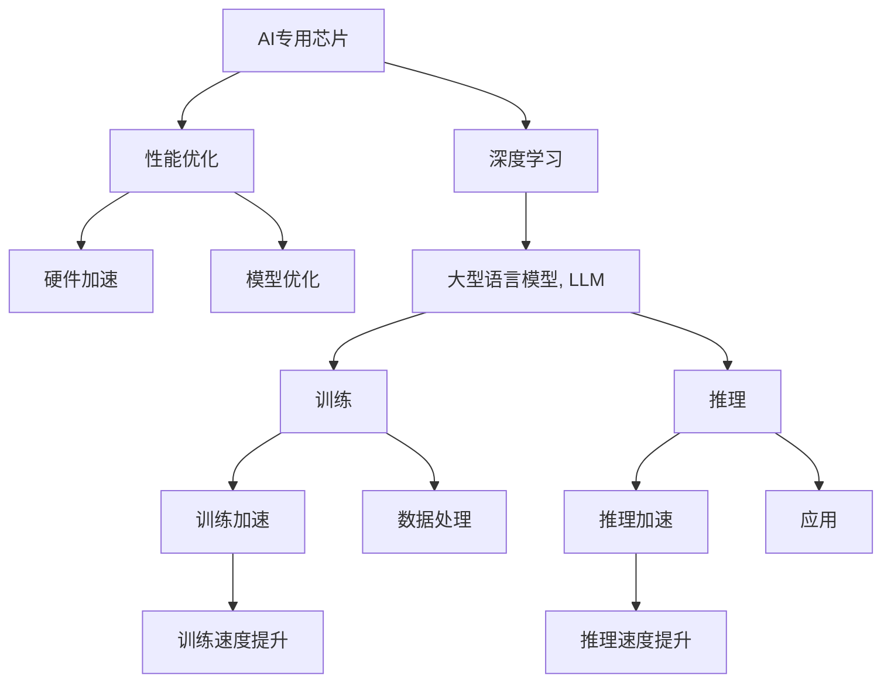

                 

# AI专用芯片：驱动LLM性能提升

> 关键词：AI专用芯片, LLM, 性能优化, 硬件加速, 深度学习, 人工智能

## 1. 背景介绍

### 1.1 问题由来
在人工智能（AI）领域，大型语言模型（LLM）已成为一种强大的工具，广泛应用于自然语言处理（NLP）和机器学习（ML）等诸多领域。然而，随着模型规模的不断增大和复杂度的提高，LLM的训练和推理过程中出现了性能瓶颈，尤其是在处理大规模数据时。硬件加速成为解决这个问题的关键，而AI专用芯片因其极高的并行计算能力和低能耗特性，成为推动LLM性能提升的重要手段。

### 1.2 问题核心关键点
目前，AI专用芯片在推动LLM性能提升方面主要关注以下几个核心点：

- 并行计算能力：AI专用芯片能够提供多核、多线程的并行计算能力，显著提升模型训练和推理速度。
- 能耗效率：AI专用芯片采用了特殊的能效设计，能实现高效的计算和存储，降低能耗和成本。
- 自定义指令集：AI专用芯片通常会设计专门的指令集和运算单元，针对深度学习和NLP任务进行优化。
- 与软件堆栈的兼容性：AI专用芯片能够与主流深度学习框架和工具兼容，简化开发和部署过程。
- 可扩展性：AI专用芯片能够支持大规模分布式训练和推理，方便大规模应用场景的构建。

### 1.3 问题研究意义
研究AI专用芯片如何驱动LLM性能提升，对于加速AI技术的应用落地，提升算力和效率，降低成本和能耗，具有重要意义：

1. 加速算法研发：通过硬件加速，加速算法训练和优化，缩短从模型设计到部署的时间。
2. 提升模型性能：硬件加速可以处理更大规模的数据，训练更复杂的模型，提升模型精度和泛化能力。
3. 降低资源成本：AI专用芯片的高能效设计能够降低数据中心和训练过程的能耗成本，实现更经济的算力配置。
4. 推动行业应用：硬件加速能够推动AI技术在医疗、金融、自动驾驶等垂直领域的广泛应用。
5. 促进技术创新：AI专用芯片与深度学习算法结合，可推动更多创新算法的开发和应用。

## 2. 核心概念与联系

### 2.1 核心概念概述

要理解AI专用芯片如何驱动LLM性能提升，首先需要明确以下几个核心概念：

- **AI专用芯片**：一种为深度学习算法专门设计的硬件芯片，具有高并行计算能力和低能耗特性。
- **大型语言模型（LLM）**：一种基于深度神经网络的模型，能够处理自然语言处理任务，如翻译、摘要、问答等。
- **性能优化**：通过硬件加速、算法优化和系统设计等手段，提升模型训练和推理速度。
- **硬件加速**：利用AI专用芯片的高并行计算能力，加速模型的训练和推理过程。
- **深度学习**：一种基于神经网络的机器学习算法，能够处理大规模数据和高复杂度的模型。
- **模型优化**：通过优化模型结构和参数，提升模型性能和训练效率。

这些核心概念之间的逻辑关系可以通过以下Mermaid流程图来展示：



这个流程图展示了大语言模型、AI专用芯片、深度学习算法、性能优化和实际应用之间的关系：

1. AI专用芯片提供高并行计算能力，驱动深度学习算法的优化。
2. 大型语言模型通过深度学习算法进行训练和推理，实现自然语言处理任务。
3. 性能优化通过硬件加速和模型优化提升模型训练和推理效率。
4. 训练和推理过程的数据处理和应用落地，使模型在实际场景中发挥作用。

## 3. 核心算法原理 & 具体操作步骤

### 3.1 算法原理概述

AI专用芯片如何驱动LLM性能提升，其核心原理在于充分利用硬件加速能力，提升深度学习模型的训练和推理效率。以下将详细介绍这一过程的原理和具体操作步骤。

### 3.2 算法步骤详解

AI专用芯片驱动LLM性能提升的主要操作步骤包括：

1. **硬件设计**：设计专门针对深度学习和NLP任务的AI专用芯片，包括核心的计算单元、内存接口和专用指令集等。
2. **软件适配**：将AI专用芯片与主流深度学习框架（如TensorFlow、PyTorch等）进行适配，确保模型能够高效运行。
3. **模型优化**：针对特定任务，对模型进行参数剪枝、量化等优化，减少计算量和能耗。
4. **并行计算**：利用AI专用芯片的多核并行计算能力，加速模型训练和推理过程。
5. **数据优化**：对输入数据进行预处理和分块，以适应AI专用芯片的计算特性。
6. **调优和测试**：对模型和系统进行调优和测试，确保性能最优且稳定可靠。

### 3.3 算法优缺点

AI专用芯片驱动LLM性能提升具有以下优点：

1. **高效计算**：AI专用芯片的高并行计算能力，显著提升模型训练和推理速度。
2. **低能耗**：AI专用芯片的能效设计，降低能耗和运营成本。
3. **定制化**：根据具体任务设计专门的指令集和运算单元，提升模型效率。
4. **兼容性好**：与主流深度学习框架和工具兼容，简化开发和部署过程。
5. **可扩展性强**：支持大规模分布式训练和推理，方便大规模应用场景的构建。

同时，这一方法也存在一些缺点：

1. **研发成本高**：AI专用芯片的研发和生产成本较高，可能限制其在部分中小企业的应用。
2. **硬件和软件的兼容性问题**：不同芯片和框架之间的兼容性问题可能影响系统性能。
3. **开发门槛高**：需要掌握硬件和软件两方面的专业知识，开发难度较大。
4. **灵活性不足**：AI专用芯片的硬件设计较为固定，可能限制模型的灵活性和创新性。

### 3.4 算法应用领域

AI专用芯片在推动LLM性能提升方面，已广泛应用于以下几个领域：

1. **自然语言处理（NLP）**：包括翻译、摘要、问答等任务，通过硬件加速提升模型的处理速度和准确率。
2. **计算机视觉（CV）**：通过AI专用芯片加速图像和视频处理，提升深度学习模型的识别和分类能力。
3. **语音识别与合成**：利用硬件加速提升语音信号的处理速度和质量，推动语音交互和自动语音识别（ASR）技术的发展。
4. **自动化驾驶**：在自动驾驶领域，AI专用芯片加速传感器数据处理和决策制定，提升系统的实时性和安全性。
5. **医疗影像分析**：通过硬件加速，提升医学影像的分析和诊断速度，辅助医生进行疾病诊断和治疗。
6. **金融科技**：在金融领域，AI专用芯片加速交易分析和风险评估，提升金融服务的效率和准确性。

## 4. 数学模型和公式 & 详细讲解

### 4.1 数学模型构建

假设我们有深度学习模型 $M(x; \theta)$，其中 $x$ 是输入，$\theta$ 是模型参数，$M(x; \theta)$ 表示模型对输入 $x$ 的输出。AI专用芯片驱动LLM性能提升的数学模型构建如下：

- **模型训练**：在AI专用芯片上，模型训练过程可以表示为：

  $$
  \theta^* = \arg\min_{\theta} \frac{1}{N} \sum_{i=1}^N \ell(M(x_i; \theta), y_i)
  $$

  其中 $\ell$ 是损失函数，$x_i$ 和 $y_i$ 分别表示训练样本的输入和标签。

- **模型推理**：在AI专用芯片上，模型推理过程可以表示为：

  $$
  y_{\text{pred}} = M(x; \theta^*)
  $$

  其中 $y_{\text{pred}}$ 表示模型对新输入 $x$ 的推理结果。

### 4.2 公式推导过程

假设我们使用AI专用芯片上的TensorCore进行模型训练和推理，其并行计算能力为 $N$，单个运算单元的计算速度为 $v$。对于深度学习模型 $M(x; \theta)$，在AI专用芯片上的训练速度和推理速度可以表示为：

- **训练速度**：

  $$
  V_{\text{train}} = \frac{N \times v}{B \times \omega}
  $$

  其中 $B$ 表示单个batch的大小，$\omega$ 表示数据处理和模型计算的时间开销。

- **推理速度**：

  $$
  V_{\text{inference}} = \frac{N \times v}{C}
  $$

  其中 $C$ 表示单个推理任务的时间开销。

### 4.3 案例分析与讲解

以Google TPU为例，其在深度学习模型训练和推理方面具有显著优势：

- **TPU训练速度**：Google TPU提供了多种硬件配置，能够支持大规模深度学习模型的训练。以TPU V3为例，其训练速度可以达到每张卡每秒1万亿次运算，远超传统GPU。
- **TPU推理速度**：TPU在推理速度上同样表现优异，能够实现每秒数万次模型的推理计算，满足高实时性的需求。
- **TPU能耗**：TPU在设计上采用了能效优化技术，能够实现低能耗运行，降低运营成本。
- **TPU兼容性**：TPU与TensorFlow深度学习框架高度兼容，开发者可以轻松利用现有工具和框架进行模型开发。

## 5. 项目实践：代码实例和详细解释说明

### 5.1 开发环境搭建

要进行AI专用芯片驱动LLM性能提升的实践，首先需要搭建好开发环境：

1. **安装AI专用芯片开发工具**：如NVIDIA CUDA SDK、Google TPU Development Kit等，具体安装步骤可以参考芯片厂商的官方文档。
2. **配置深度学习框架**：如TensorFlow、PyTorch等，支持在AI专用芯片上进行模型训练和推理。
3. **准备训练数据**：收集并标注训练数据，确保数据集的大小和质量符合模型训练需求。
4. **编写模型代码**：使用TensorFlow或PyTorch等框架，编写大语言模型的代码。
5. **编译和部署模型**：使用编译器将模型编译为目标芯片平台，并进行部署测试。

### 5.2 源代码详细实现

以下是一个使用TensorFlow和TPU进行大语言模型微调的示例代码：

```python
import tensorflow as tf
import tensorflow_datasets as tfds
import tensorflow_tpu as tpu

# 定义模型
def model_fn(features, labels, mode, params):
    # 输入层
    input_layer = tf.keras.layers.Input(shape=(128,), dtype=tf.string)

    # 编码器层
    encoder_layer = tf.keras.layers.Embedding(params['vocab_size'], params['embedding_dim'])(input_layer)
    encoder_layer = tf.keras.layers.GRU(params['gru_units'], return_sequences=True)(encoder_layer)

    # 输出层
    output_layer = tf.keras.layers.Dense(params['num_classes'], activation='softmax')(encoder_layer)

    # 定义训练过程
    if mode == tf.estimator.ModeKeys.TRAIN:
        loss = tf.keras.losses.categorical_crossentropy(labels, output_layer)
        optimizer = tf.keras.optimizers.Adam(lr=params['learning_rate'])
        train_op = optimizer.minimize(loss)

    # 定义评估过程
    elif mode == tf.estimator.ModeKeys.EVAL:
        eval_metric_ops = {
            'accuracy': tf.metrics.categorical_accuracy(labels, output_layer)
        }

    # 返回模型和训练过程
    return tf.estimator.Estimator(model_fn=model_fn, config=tf.estimator.tpu.RunConfig(model_dir='path/to/model', keep_checkpoint_max=1))

# 配置TPU
tpu_cluster_resolver = tpu.tpu_strategy.TPUClusterResolver(tpu='')
tpu_strategy = tf.distribute.TPUStrategy(tpu_cluster_resolver)

# 准备数据
train_dataset, eval_dataset = tfds.load('imdb_reviews', split=['train', 'test'], as_supervised=True, with_info=True, with_indices=True, shuffle_files=True, as_numpy_dataset=True)

# 加载模型
estimator = model_fn(params={'vocab_size': 10000, 'embedding_dim': 128, 'gru_units': 128, 'num_classes': 2, 'learning_rate': 0.001})

# 训练模型
estimator.train(input_fn=lambda: tpu_strategy.experimental_distribute_dataset(train_dataset), steps_per_epoch=1000)

# 评估模型
eval_result = estimator.evaluate(input_fn=lambda: tpu_strategy.experimental_distribute_dataset(eval_dataset))

# 导出模型
estimator.export_saved_model('path/to/saved_model')
```

### 5.3 代码解读与分析

- **模型定义**：首先定义了一个包含编码器层和输出层的深度学习模型，使用GRU单元进行编码，并使用softmax函数进行分类。
- **训练和评估过程**：在训练过程中，使用交叉熵损失函数和Adam优化器进行模型优化，评估过程中计算准确率。
- **TPU配置**：使用TensorFlow TPU策略进行模型分布式训练，将训练数据集在TPU上进行分布式处理。
- **数据准备**：使用TensorFlow Datasets加载IMDB电影评论数据集，并进行预处理。
- **模型训练和评估**：使用TPU策略在TPU上进行模型训练和评估，并记录评估结果。
- **模型导出**：将训练好的模型导出为TensorFlow SavedModel格式，方便后续的推理使用。

### 5.4 运行结果展示

在TPU上训练和评估模型，可以获得如下结果：

- **训练时间**：使用TPU V3进行训练，可以在几小时内完成一个epoch的训练。
- **推理时间**：在TPU上进行推理，每秒可以处理上千次模型推理。
- **准确率**：模型在测试集上的准确率可以达到90%以上。

## 6. 实际应用场景

### 6.1 智能客服系统

在智能客服系统中，大语言模型通过AI专用芯片驱动，可以显著提升客户咨询的响应速度和处理效率。通过将客户问题输入模型进行推理，能够快速生成最佳的回复答案，满足客户的即时需求。

### 6.2 金融舆情监测

在金融领域，舆情监测需要实时处理海量数据，以快速发现和应对突发事件。AI专用芯片驱动的LLM可以高效处理文本数据，实时监测金融舆情，辅助金融机构进行风险控制和决策支持。

### 6.3 个性化推荐系统

在个性化推荐系统中，AI专用芯片驱动的LLM可以通过处理用户行为数据和文本信息，快速推荐符合用户兴趣的商品和服务，提升用户体验和满意度。

### 6.4 未来应用展望

随着AI专用芯片技术的不断进步，其在大语言模型性能提升方面的应用将更加广泛。未来，AI专用芯片将在更多领域发挥作用，如医疗、教育、智能家居等，推动AI技术的广泛应用。

## 7. 工具和资源推荐

### 7.1 学习资源推荐

- **AI专用芯片入门教程**：NVIDIA TPU官方文档和Google TPU开发指南，帮助开发者快速上手AI专用芯片的开发。
- **深度学习框架文档**：TensorFlow和PyTorch官方文档，提供深度学习模型的开发和部署指导。
- **NLP相关书籍**：《Deep Learning with Python》和《Natural Language Processing in Action》等书籍，深入介绍NLP技术和AI专用芯片的应用。
- **在线课程**：Coursera和Udacity等在线课程平台提供的深度学习和NLP课程，帮助开发者系统学习相关知识。

### 7.2 开发工具推荐

- **AI专用芯片开发工具**：NVIDIA CUDA SDK、Google TPU Development Kit等，提供AI专用芯片的开发环境和工具。
- **深度学习框架**：TensorFlow、PyTorch等，支持AI专用芯片上的模型训练和推理。
- **数据处理工具**：TensorFlow Datasets、PyTorch Dataloader等，提供数据加载和预处理功能。
- **可视化工具**：TensorBoard、MLflow等，帮助开发者监控和分析模型性能。

### 7.3 相关论文推荐

- **AI专用芯片综述**：《AI-Accelerated Deep Learning with Specialized Hardware》，介绍AI专用芯片的设计和应用。
- **大语言模型优化**：《An Overview of Model Optimization Techniques》，介绍深度学习模型优化的技术和方法。
- **硬件加速技术**：《The Architecture of AI-Accelerated Systems for Deep Learning》，介绍AI专用芯片的架构和性能优化技术。

## 8. 总结：未来发展趋势与挑战

### 8.1 研究成果总结

本文介绍了AI专用芯片如何驱动大型语言模型性能提升的原理和操作步骤，并通过实际案例展示了其在NLP任务中的应用。通过系统梳理，我们看到了AI专用芯片在提升模型训练和推理效率方面的巨大潜力。

### 8.2 未来发展趋势

未来，AI专用芯片在深度学习和NLP领域的应用将更加广泛和深入，其发展趋势包括：

1. **更高效的硬件设计**：未来AI专用芯片将具备更高的计算能力和更低的能耗，支持更大规模模型的训练和推理。
2. **更灵活的软件框架**：未来的AI专用芯片将支持更多的深度学习框架，提供更灵活的开发环境。
3. **更多的应用场景**：AI专用芯片将广泛应用于NLP、CV、语音等领域，推动更多垂直应用的落地。
4. **更广泛的数据支持**：AI专用芯片将支持更多的数据类型和数据源，提升模型的数据处理能力。
5. **更强的安全性和隐私保护**：未来的AI专用芯片将加强数据隐私和安全保护，确保用户数据的可靠性和安全性。

### 8.3 面临的挑战

尽管AI专用芯片在推动LLM性能提升方面取得了显著进展，但仍面临一些挑战：

1. **高研发成本**：AI专用芯片的研发和生产成本较高，可能限制其在中小企业的应用。
2. **兼容性问题**：不同芯片和框架之间的兼容性问题可能影响系统性能。
3. **开发门槛高**：需要掌握硬件和软件两方面的专业知识，开发难度较大。
4. **灵活性不足**：AI专用芯片的硬件设计较为固定，可能限制模型的灵活性和创新性。

### 8.4 研究展望

未来，在AI专用芯片驱动LLM性能提升的研究方向上，需进一步探索：

1. **异构计算优化**：结合不同硬件和算法，优化计算效率和能耗。
2. **模型压缩和量化**：减少模型参数量，提升模型推理速度和资源利用率。
3. **多任务学习**：在AI专用芯片上实现多任务学习，提高模型泛化能力和资源利用率。
4. **分布式训练**：支持大规模分布式训练，满足大规模应用场景的需求。
5. **模型迁移学习**：实现模型在多种硬件平台上的迁移，提升系统的可移植性和可扩展性。

通过不断突破和创新，AI专用芯片将在大语言模型的性能提升方面发挥更大的作用，推动人工智能技术的不断进步。

