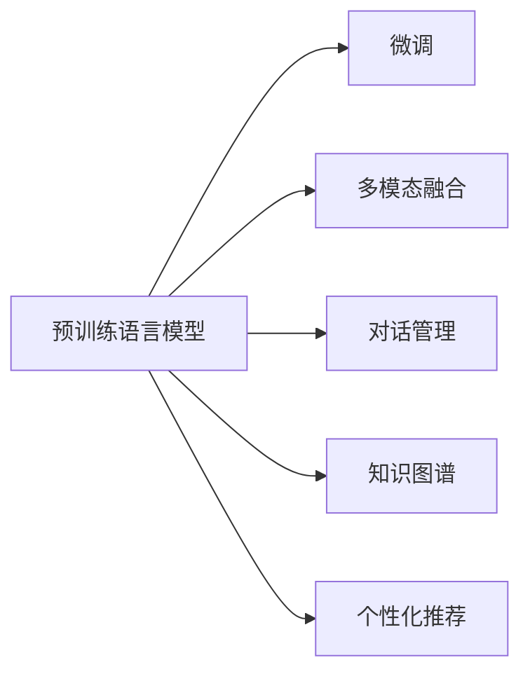

                 

# 第十五章：聊天机器人未来发展

## 1. 背景介绍

### 1.1 问题由来

聊天机器人在过去十年中迅速发展，成为人工智能的重要应用方向之一。从最早的基于规则的专家系统，到基于统计学习的机器翻译系统，再到如今广泛应用的基于深度学习的自然语言处理模型，聊天机器人的技术栈经历了多次变革。随着预训练大模型的出现，聊天机器人进入了一个新的发展阶段。基于预训练大模型的聊天机器人不仅能够生成自然流畅的语言，还能理解复杂的语义和语境，具有更强的交互性和泛化能力。

### 1.2 问题核心关键点

当前，聊天机器人技术仍然面临诸多挑战，包括但不限于以下几点：

- **用户交互的连贯性和真实性**：如何让聊天机器人能够持续进行有意义的对话，而不只是简单地重复预先设定的回复？
- **知识更新的实时性**：如何使聊天机器人能够快速地学习新的知识，并及时更新其知识库？
- **多模态融合的能力**：如何将视觉、听觉等多模态信息与文本信息融合，提升聊天机器人的感知能力？
- **伦理和安全问题**：如何确保聊天机器人输出内容的公正性和安全性，避免有害信息的传播？

### 1.3 问题研究意义

聊天机器人技术的发展，对于提升人机交互体验、推动各行各业的数字化转型具有重要意义。通过聊天机器人，企业能够提供24小时不间断的客户服务，提升客户满意度和品牌忠诚度。在医疗、教育、金融等领域，聊天机器人可以提供专业的咨询和建议，帮助用户解决问题，减少资源浪费。同时，聊天机器人还能够缓解人力短缺问题，提高工作效率。

## 2. 核心概念与联系

### 2.1 核心概念概述

聊天机器人技术涉及多个关键概念，包括但不限于：

- **预训练语言模型**：如BERT、GPT等，通过大规模无标签文本数据进行预训练，学习通用的语言表示。
- **微调**：在预训练模型的基础上，通过有监督学习优化模型，使其适应特定任务。
- **多模态融合**：将视觉、听觉、文本等多模态信息进行融合，提升聊天机器人的感知和理解能力。
- **对话管理**：管理对话上下文，确保对话连贯性和一致性。
- **知识图谱**：构建和更新知识图谱，使聊天机器人具备更丰富的知识储备。
- **个性化推荐**：根据用户的历史行为和偏好，提供个性化的交互体验。

这些概念之间存在紧密的联系，通过预训练语言模型提供通用的语言理解能力，通过微调和对话管理进一步优化模型的特定任务能力，通过多模态融合和知识图谱扩展模型的知识面，通过个性化推荐提升用户的满意度。

### 2.2 核心概念原理和架构的 Mermaid 流程图



## 3. 核心算法原理 & 具体操作步骤

### 3.1 算法原理概述

基于预训练大模型的聊天机器人技术，本质上是通过微调和多模态融合等方法，优化模型的特定任务能力。其核心思想是：将预训练大模型作为初始化参数，通过有监督学习和多模态融合，使得模型能够在特定场景下具备更强的感知和理解能力，从而提供更加自然、连贯和有用的对话服务。

### 3.2 算法步骤详解

1. **数据准备**：收集和标注用于训练聊天机器人的对话数据，包括对话文本、用户意图、上下文信息等。
2. **模型选择**：选择合适的预训练语言模型，如GPT、BERT等，作为聊天机器人的基础模型。
3. **微调**：在收集的对话数据上进行微调，优化模型的特定任务能力。
4. **多模态融合**：将视觉、听觉等多模态信息与文本信息融合，提升聊天机器人的感知能力。
5. **对话管理**：构建对话管理模块，管理对话上下文，确保对话连贯性和一致性。
6. **知识图谱构建**：构建和更新知识图谱，使聊天机器人具备更丰富的知识储备。
7. **个性化推荐**：根据用户的历史行为和偏好，提供个性化的交互体验。
8. **测试和部署**：在测试集上评估聊天机器人的性能，部署到实际应用场景中。

### 3.3 算法优缺点

#### 优点：

- **高效性**：预训练大模型提供了良好的初始化参数，可以在少量标注数据上进行微调，快速获得较好的效果。
- **泛化能力**：通过微调和多模态融合，聊天机器人能够适应不同的对话场景，具备较强的泛化能力。
- **多样性**：多模态融合和知识图谱的引入，使得聊天机器人能够处理更多样化的输入，提供更丰富的服务。

#### 缺点：

- **数据依赖**：微调和多模态融合需要大量的标注数据和多样化的输入，收集和标注成本较高。
- **计算资源需求**：预训练大模型的训练和微调需要强大的计算资源，难以在低成本的环境中实现。
- **知识更新慢**：知识图谱的构建和更新需要大量人力，且更新速度较慢，难以应对快速变化的知识需求。

### 3.4 算法应用领域

基于预训练大模型的聊天机器人技术已经广泛应用于多个领域，包括但不限于：

- **客户服务**：提供24小时不间断的客户服务，提升客户满意度和品牌忠诚度。
- **医疗咨询**：提供医疗咨询和建议，帮助用户解决健康问题。
- **教育培训**：提供个性化的学习辅导和答疑服务，提升学习效果。
- **金融咨询**：提供金融咨询和理财建议，帮助用户做出更好的决策。
- **娱乐互动**：提供智能聊天和互动服务，提升用户体验。

## 4. 数学模型和公式 & 详细讲解 & 举例说明

### 4.1 数学模型构建

基于预训练大模型的聊天机器人，其数学模型可以表示为：

$$
M(x) = M_{\theta}(x) + \Delta M(x)
$$

其中，$M_{\theta}$ 表示预训练大模型的参数，$\Delta M(x)$ 表示微调后的参数更新。

### 4.2 公式推导过程

假设预训练大模型的输入为 $x$，输出为 $M_{\theta}(x)$。在微调过程中，模型的参数更新可以表示为：

$$
\Delta M(x) = \sum_{i=1}^{N} \alpha_i \delta_i(x)
$$

其中，$\alpha_i$ 表示每个样本的权重，$\delta_i(x)$ 表示每个样本对模型的影响。通过梯度下降等优化算法，最小化损失函数 $\mathcal{L}$，使得模型输出逼近真实标签。

### 4.3 案例分析与讲解

以医疗咨询聊天机器人为例，其在微调过程中可以采用以下步骤：

1. **数据准备**：收集和标注用于训练的医疗咨询对话数据，包括问诊和解答。
2. **模型选择**：选择合适的预训练语言模型，如BERT或GPT。
3. **微调**：在医疗咨询对话数据上进行微调，优化模型的医疗咨询能力。
4. **多模态融合**：将患者上传的病历、检查结果等视觉信息与文本对话融合，提升诊断准确性。
5. **对话管理**：构建对话管理模块，管理问诊和解答的上下文，确保对话连贯性和一致性。
6. **知识图谱构建**：构建和更新医学知识图谱，使聊天机器人具备更丰富的医学知识储备。
7. **个性化推荐**：根据患者的历史问诊记录和偏好，提供个性化的医疗咨询服务。
8. **测试和部署**：在测试集上评估聊天机器人的性能，部署到实际医疗咨询场景中。

## 5. 项目实践：代码实例和详细解释说明

### 5.1 开发环境搭建

在开始项目实践前，需要准备好以下开发环境：

1. **安装Python和PyTorch**：
   ```
   conda install python=3.8
   conda install torch torchvision torchaudio -c pytorch
   ```

2. **安装Transformers库**：
   ```
   pip install transformers
   ```

3. **安装其他必要的库**：
   ```
   pip install numpy pandas scikit-learn matplotlib tqdm jupyter notebook ipython
   ```

### 5.2 源代码详细实现

以医疗咨询聊天机器人的微调为例，以下是使用Transformers库进行微调的PyTorch代码实现：

```python
from transformers import BertForSequenceClassification, BertTokenizer, AdamW
import torch
import torch.nn as nn

class MedicalChatbot:
    def __init__(self, model_name='bert-base-cased'):
        self.model = BertForSequenceClassification.from_pretrained(model_name, num_labels=2)
        self.tokenizer = BertTokenizer.from_pretrained(model_name)
        self.device = torch.device('cuda') if torch.cuda.is_available() else torch.device('cpu')
        self.model.to(self.device)
    
    def forward(self, input_ids, attention_mask):
        input_ids = input_ids.to(self.device)
        attention_mask = attention_mask.to(self.device)
        outputs = self.model(input_ids, attention_mask=attention_mask)
        logits = outputs.logits
        return logits
    
    def fine_tune(self, train_data, dev_data, epochs=5, batch_size=16, learning_rate=2e-5):
        optimizer = AdamW(self.model.parameters(), lr=learning_rate)
        train_loader = DataLoader(train_data, batch_size=batch_size, shuffle=True)
        dev_loader = DataLoader(dev_data, batch_size=batch_size)
        for epoch in range(epochs):
            self.model.train()
            train_loss = 0.0
            for batch in train_loader:
                input_ids, attention_mask, labels = batch['input_ids'], batch['attention_mask'], batch['labels']
                logits = self.forward(input_ids, attention_mask)
                loss = nn.CrossEntropyLoss()(logits, labels)
                optimizer.zero_grad()
                loss.backward()
                optimizer.step()
                train_loss += loss.item()
            print(f'Epoch {epoch+1}, Train Loss: {train_loss/len(train_loader)}')
            self.model.eval()
            dev_loss = 0.0
            for batch in dev_loader:
                input_ids, attention_mask, labels = batch['input_ids'], batch['attention_mask'], batch['labels']
                with torch.no_grad():
                    logits = self.forward(input_ids, attention_mask)
                    loss = nn.CrossEntropyLoss()(logits, labels)
                    dev_loss += loss.item()
            print(f'Epoch {epoch+1}, Dev Loss: {dev_loss/len(dev_loader)}')
    
    def predict(self, input_ids, attention_mask):
        input_ids = input_ids.to(self.device)
        attention_mask = attention_mask.to(self.device)
        with torch.no_grad():
            logits = self.forward(input_ids, attention_mask)
        predictions = torch.argmax(logits, dim=1)
        return predictions
```

### 5.3 代码解读与分析

1. **类定义**：定义了一个`MedicalChatbot`类，包含初始化、前向计算、微调、预测等方法。
2. **初始化**：使用`BertForSequenceClassification`初始化模型，并加载预训练的BERT tokenizer。
3. **前向计算**：定义前向计算方法，输入`input_ids`和`attention_mask`，返回模型的预测结果。
4. **微调**：定义微调方法，使用`AdamW`优化器，在训练集上进行有监督学习，输出训练和验证的损失。
5. **预测**：定义预测方法，输入`input_ids`和`attention_mask`，返回模型的预测结果。

## 6. 实际应用场景

### 6.1 智能客服系统

智能客服系统利用聊天机器人技术，提供24小时不间断的客户服务。通过收集和标注历史客服对话数据，使用预训练大模型进行微调，使聊天机器人能够理解用户意图，提供个性化的回答。在实际应用中，智能客服系统可以部署在企业网站、社交媒体等渠道，提升客户满意度和品牌忠诚度。

### 6.2 医疗咨询

医疗咨询聊天机器人可以提供智能问诊服务，收集和标注医学咨询对话数据，使用预训练大模型进行微调，使聊天机器人能够理解医学问题，提供初步诊断和建议。在实际应用中，医疗咨询聊天机器人可以部署在医疗机构网站、移动应用等平台，帮助患者快速获取医疗咨询和建议，减轻医务人员负担。

### 6.3 金融理财

金融理财聊天机器人可以提供智能理财服务，收集和标注金融咨询对话数据，使用预训练大模型进行微调，使聊天机器人能够理解用户理财需求，提供个性化的理财建议。在实际应用中，金融理财聊天机器人可以部署在金融机构的网站、移动应用等平台，提升用户理财体验和满意度。

## 7. 工具和资源推荐

### 7.1 学习资源推荐

1. **《Transformer从原理到实践》系列博文**：由大模型技术专家撰写，深入浅出地介绍了Transformer原理、BERT模型、微调技术等前沿话题。
2. **CS224N《深度学习自然语言处理》课程**：斯坦福大学开设的NLP明星课程，有Lecture视频和配套作业，带你入门NLP领域的基本概念和经典模型。
3. **《Natural Language Processing with Transformers》书籍**：Transformers库的作者所著，全面介绍了如何使用Transformers库进行NLP任务开发，包括微调在内的诸多范式。
4. **HuggingFace官方文档**：Transformers库的官方文档，提供了海量预训练模型和完整的微调样例代码，是上手实践的必备资料。
5. **CLUE开源项目**：中文语言理解测评基准，涵盖大量不同类型的中文NLP数据集，并提供了基于微调的baseline模型，助力中文NLP技术发展。

### 7.2 开发工具推荐

1. **PyTorch**：基于Python的开源深度学习框架，灵活动态的计算图，适合快速迭代研究。
2. **TensorFlow**：由Google主导开发的开源深度学习框架，生产部署方便，适合大规模工程应用。
3. **Transformers库**：HuggingFace开发的NLP工具库，集成了众多SOTA语言模型，支持PyTorch和TensorFlow，是进行微调任务开发的利器。
4. **Weights & Biases**：模型训练的实验跟踪工具，可以记录和可视化模型训练过程中的各项指标，方便对比和调优。与主流深度学习框架无缝集成。
5. **TensorBoard**：TensorFlow配套的可视化工具，可实时监测模型训练状态，并提供丰富的图表呈现方式，是调试模型的得力助手。
6. **Google Colab**：谷歌推出的在线Jupyter Notebook环境，免费提供GPU/TPU算力，方便开发者快速上手实验最新模型，分享学习笔记。

### 7.3 相关论文推荐

1. **Attention is All You Need**：提出了Transformer结构，开启了NLP领域的预训练大模型时代。
2. **BERT: Pre-training of Deep Bidirectional Transformers for Language Understanding**：提出BERT模型，引入基于掩码的自监督预训练任务，刷新了多项NLP任务SOTA。
3. **Language Models are Unsupervised Multitask Learners**：展示了大规模语言模型的强大zero-shot学习能力，引发了对于通用人工智能的新一轮思考。
4. **Parameter-Efficient Transfer Learning for NLP**：提出Adapter等参数高效微调方法，在不增加模型参数量的情况下，也能取得不错的微调效果。
5. **Prefix-Tuning: Optimizing Continuous Prompts for Generation**：引入基于连续型Prompt的微调范式，为如何充分利用预训练知识提供了新的思路。
6. **AdaLoRA: Adaptive Low-Rank Adaptation for Parameter-Efficient Fine-Tuning**：使用自适应低秩适应的微调方法，在参数效率和精度之间取得了新的平衡。

## 8. 总结：未来发展趋势与挑战

### 8.1 总结

本文对基于预训练大模型的聊天机器人技术进行了全面系统的介绍。首先阐述了聊天机器人技术的研究背景和意义，明确了预训练大模型和微调技术在提升聊天机器人性能方面的独特价值。其次，从原理到实践，详细讲解了预训练大模型微调的过程，给出了微调任务开发的完整代码实例。同时，本文还探讨了聊天机器人技术在多个行业领域的应用前景，展示了其广阔的发展空间。

### 8.2 未来发展趋势

展望未来，聊天机器人技术将呈现以下几个发展趋势：

1. **多模态融合**：将视觉、听觉、文本等多模态信息进行融合，提升聊天机器人的感知和理解能力。
2. **知识图谱**：构建和更新知识图谱，使聊天机器人具备更丰富的知识储备。
3. **个性化推荐**：根据用户的历史行为和偏好，提供个性化的交互体验。
4. **实时更新**：通过在线学习，使聊天机器人能够实时更新知识库，适应快速变化的知识需求。
5. **联邦学习**：在保护用户隐私的前提下，通过联邦学习技术，让聊天机器人从分布式设备中学习知识。
6. **跨模态交互**：通过语音识别和自然语言处理技术，实现跨模态的人机交互。

### 8.3 面临的挑战

尽管聊天机器人技术已经取得了显著进展，但在实际应用中仍面临诸多挑战：

1. **数据隐私问题**：如何在保护用户隐私的前提下，收集和利用对话数据进行模型训练。
2. **伦理和安全问题**：如何确保聊天机器人输出内容的公正性和安全性，避免有害信息的传播。
3. **计算资源需求**：预训练大模型的训练和微调需要强大的计算资源，难以在低成本的环境中实现。
4. **知识更新慢**：知识图谱的构建和更新需要大量人力，且更新速度较慢，难以应对快速变化的知识需求。

### 8.4 研究展望

未来研究需要在以下几个方面寻求新的突破：

1. **无监督和半监督学习**：探索无监督和半监督学习范式，摆脱对大量标注数据的依赖。
2. **参数高效微调**：开发更加参数高效的微调方法，在固定大部分预训练参数的同时，只更新极少量的任务相关参数。
3. **跨领域迁移**：研究跨领域迁移学习技术，使聊天机器人能够快速适应不同的应用场景。
4. **多任务学习**：研究多任务学习范式，使聊天机器人能够同时学习多个任务，提高资源利用效率。
5. **解释性增强**：研究聊天机器人的可解释性技术，增强输出解释的因果性和逻辑性。

通过这些研究方向和技术的不断创新，聊天机器人技术必将迈向更高的台阶，为构建更加智能、可靠、安全的人机交互系统提供新的动力。

## 9. 附录：常见问题与解答

**Q1：如何提高聊天机器人的连贯性和真实性？**

A: 提高聊天机器人的连贯性和真实性，可以通过以下方法：

1. **上下文管理**：构建对话管理模块，管理对话上下文，确保对话连贯性和一致性。
2. **多模态融合**：将视觉、听觉等多模态信息与文本信息融合，提升聊天机器人的感知能力。
3. **数据增强**：通过回译、近义替换等方式扩充训练集，提高模型的泛化能力。
4. **对抗训练**：引入对抗样本，提高模型鲁棒性，减少输出噪声。

**Q2：如何实现聊天机器人的实时更新？**

A: 实现聊天机器人的实时更新，可以通过以下方法：

1. **在线学习**：在实际应用中，收集新对话数据，使用在线学习技术，实时更新模型参数。
2. **联邦学习**：通过联邦学习技术，让聊天机器人从分布式设备中学习知识，保持知识库的实时更新。

**Q3：如何保护用户隐私？**

A: 保护用户隐私，可以通过以下方法：

1. **数据匿名化**：对用户对话数据进行匿名化处理，保护用户身份信息。
2. **差分隐私**：使用差分隐私技术，在保护用户隐私的前提下，收集和利用对话数据。
3. **本地计算**：将模型训练和更新过程放在本地设备上进行，减少数据泄露风险。

**Q4：如何确保聊天机器人的输出内容公正和安全？**

A: 确保聊天机器人的输出内容公正和安全，可以通过以下方法：

1. **模型公平性**：在模型训练过程中，引入公平性评估指标，避免模型输出偏见。
2. **伦理约束**：在模型设计中引入伦理约束，确保输出内容的公正性和安全性。
3. **人工审核**：对聊天机器人的输出内容进行人工审核，及时发现和修正有害信息。

**Q5：如何提高聊天机器人的推理效率？**

A: 提高聊天机器人的推理效率，可以通过以下方法：

1. **模型裁剪**：去除不必要的层和参数，减小模型尺寸，加快推理速度。
2. **量化加速**：将浮点模型转为定点模型，压缩存储空间，提高计算效率。
3. **模型并行**：采用模型并行技术，提高计算速度，优化资源利用效率。

**Q6：如何提高聊天机器人的个性化推荐能力？**

A: 提高聊天机器人的个性化推荐能力，可以通过以下方法：

1. **用户画像**：构建用户画像，根据用户的历史行为和偏好，提供个性化的交互体验。
2. **推荐算法**：引入推荐算法，如协同过滤、内容推荐等，提高推荐效果。
3. **多模态融合**：将用户的多模态信息（如搜索历史、浏览记录等）与文本信息融合，提升推荐准确性。

通过这些研究方向和技术的不断创新，聊天机器人技术必将迈向更高的台阶，为构建更加智能、可靠、安全的人机交互系统提供新的动力。

