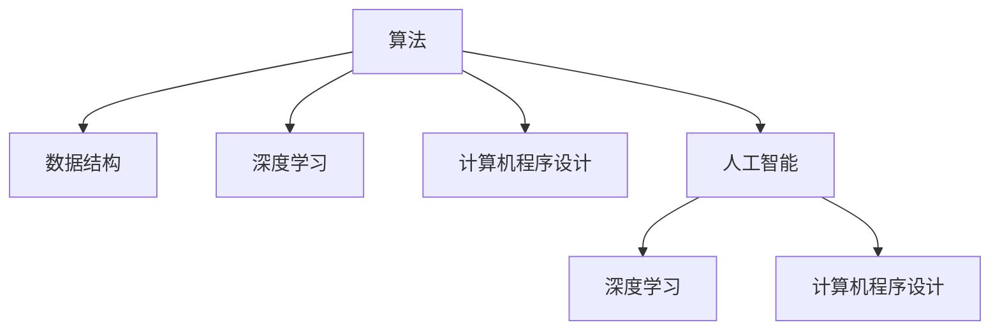

                 

# 算法创新：提高人类计算的效率和精度

> 关键词：算法创新, 高效计算, 精度优化, 计算机程序设计, 人工智能, 数据结构, 机器学习, 深度学习

## 1. 背景介绍

### 1.1 问题由来
在现代社会，计算效率和精度是决定信息技术发展速度的关键因素。无论是科学计算、数据分析、图像处理、智能推理等众多领域，都需要高效、精准的算法作为支撑。然而，随着数据量的指数级增长和计算任务的日趋复杂，传统算法的计算量和存储需求日益增大，计算瓶颈问题日益凸显。

为了应对这些挑战，新一代算法创新成为当前研究的重点方向。本文将探讨一系列创新的算法，涵盖从经典计算机程序设计、数据结构，到人工智能、深度学习的各个方面。这些算法通过采用新颖的技术方法，显著提高了计算效率和精度，为各领域的技术应用提供了新的动力。

### 1.2 问题核心关键点
本文聚焦于算法创新在提高计算效率和精度方面的具体实现。核心关键点包括：

- 数据结构和算法在时间和空间上的优化。
- 人工智能、深度学习等前沿技术在算法上的突破。
- 算法与计算机硬件、软件环境的协同优化。
- 算法创新在不同应用场景中的成功案例。

## 2. 核心概念与联系

### 2.1 核心概念概述

为了更好地理解算法创新，本文将介绍几个核心概念：

- **算法（Algorithm）**：解决问题或执行计算任务的具体步骤，包括数据的输入、处理和输出。
- **数据结构（Data Structure）**：组织和管理数据的规则和方式，直接影响算法的效率。
- **深度学习（Deep Learning）**：利用多层神经网络模拟人脑神经元连接，实现复杂数据模式的高效学习。
- **计算机程序设计（Computer Programming）**：将算法转化为计算机可执行代码的过程，涉及编程语言、编译器、运行环境等。
- **人工智能（Artificial Intelligence, AI）**：通过算法和计算模型，模拟人类智能活动，实现自主决策和行为。

这些核心概念之间的逻辑关系可以通过以下Mermaid流程图来展示：



这个流程图展示了算法与数据结构、深度学习、计算机程序设计以及人工智能之间的联系。算法创新不仅影响计算效率和精度，还涉及多个技术领域的协同进步。

## 3. 核心算法原理 & 具体操作步骤

### 3.1 算法原理概述

算法创新的本质在于采用高效、精准的技术手段，解决计算中存在的瓶颈问题。主要体现在以下几个方面：

- **并行计算**：通过多核、分布式等技术，同时处理多个数据点，提高计算效率。
- **自适应算法**：根据数据特性动态调整算法参数，适应不同计算场景，提升计算精度。
- **压缩算法**：通过数据压缩和稀疏化，减少存储空间，优化计算速度。
- **异构计算**：结合不同硬件特性（如CPU、GPU、FPGA等）的优势，实现更高效的计算。

### 3.2 算法步骤详解

算法创新的具体操作步骤包括：

1. **问题定义**：明确算法要解决的具体问题，如数据存储、计算任务等。
2. **算法设计**：选择或设计适当的算法框架，如深度神经网络、图论算法等。
3. **参数优化**：根据问题特性，调整算法参数，如学习率、迭代次数等。
4. **实现和验证**：将算法转化为代码，并在特定数据集上进行测试和验证。
5. **优化和迭代**：根据测试结果，调整算法设计，进一步优化算法性能。

### 3.3 算法优缺点

算法创新在提高计算效率和精度方面有显著优势，但也存在以下局限性：

- **复杂度高**：创新算法设计往往复杂度较高，实现难度大。
- **依赖硬件**：一些算法创新依赖于特定的硬件环境，可能不适用于所有场景。
- **数据敏感性**：某些算法对数据的敏感性较强，需要大规模、高质量的数据支持。

### 3.4 算法应用领域

算法创新在多个领域中得到了广泛应用，如科学计算、数据分析、图像处理、智能推理等。具体应用包括：

- **科学计算**：在高性能计算领域，如物理模拟、气象预测、金融建模等。
- **数据分析**：在大数据处理、数据挖掘、机器学习等应用中，提高数据处理和分析效率。
- **图像处理**：在计算机视觉、图像识别、视频编解码等任务中，提升图像处理速度和精度。
- **智能推理**：在自然语言处理、语音识别、智能机器人等领域，增强推理和决策能力。

## 4. 数学模型和公式 & 详细讲解 & 举例说明

### 4.1 数学模型构建

算法创新的数学模型构建通常涉及优化问题、统计推断、图论等领域。以深度学习为例，其核心数学模型包括神经网络、损失函数、反向传播算法等。

假设一个二分类任务，输入样本为 $x_i$，对应的标签为 $y_i \in \{0, 1\}$，模型参数为 $\theta$。常见的深度学习模型为全连接神经网络，其损失函数为交叉熵损失：

$$
L(\theta) = -\frac{1}{N}\sum_{i=1}^N [y_i\log\sigma(z_i) + (1-y_i)\log(1-\sigma(z_i))]
$$

其中 $\sigma(z_i) = \frac{1}{1+e^{-z_i}}$ 为sigmoid函数。

### 4.2 公式推导过程

以梯度下降算法为例，其核心步骤为：

1. **前向传播**：计算输入样本 $x_i$ 经过模型 $f_\theta(x_i)$ 的输出 $z_i$。
2. **损失计算**：计算损失函数 $L(\theta)$。
3. **反向传播**：计算梯度 $\nabla_\theta L$。
4. **参数更新**：使用梯度下降公式更新模型参数 $\theta$：

$$
\theta \leftarrow \theta - \eta \nabla_\theta L
$$

其中 $\eta$ 为学习率。

### 4.3 案例分析与讲解

以卷积神经网络（Convolutional Neural Networks, CNN）为例，CNN通过卷积、池化等操作，有效提取图像特征，实现高效分类。其核心在于卷积操作和参数共享，减少了模型参数量，提高了计算效率。例如，LeNet-5模型在手写数字识别任务中，采用两层的卷积和池化操作，取得了较高的精度。

## 5. 项目实践：代码实例和详细解释说明

### 5.1 开发环境搭建

在进行算法创新实践前，需要准备开发环境。以下是使用Python进行TensorFlow开发的环境配置流程：

1. 安装Anaconda：从官网下载并安装Anaconda，用于创建独立的Python环境。

2. 创建并激活虚拟环境：
```bash
conda create -n tf-env python=3.8 
conda activate tf-env
```

3. 安装TensorFlow：根据CUDA版本，从官网获取对应的安装命令。例如：
```bash
conda install tensorflow==2.7.0
```

4. 安装其他依赖包：
```bash
pip install numpy scipy matplotlib
```

完成上述步骤后，即可在`tf-env`环境中开始算法创新实践。

### 5.2 源代码详细实现

下面以卷积神经网络为例，给出TensorFlow代码实现。

```python
import tensorflow as tf
from tensorflow import keras
import numpy as np

# 加载MNIST数据集
mnist = keras.datasets.mnist
(train_images, train_labels), (test_images, test_labels) = mnist.load_data()

# 数据预处理
train_images = train_images / 255.0
test_images = test_images / 255.0

# 定义模型
model = keras.Sequential([
    keras.layers.Flatten(input_shape=(28, 28)),
    keras.layers.Dense(128, activation='relu'),
    keras.layers.Dense(10)
])

# 定义损失函数和优化器
loss_fn = tf.keras.losses.SparseCategoricalCrossentropy(from_logits=True)
optimizer = tf.keras.optimizers.Adam()

# 定义评估指标
accuracy = tf.keras.metrics.SparseCategoricalAccuracy('accuracy')

# 训练模型
model.compile(optimizer=optimizer, loss=loss_fn, metrics=[accuracy])
model.fit(train_images, train_labels, epochs=5, validation_data=(test_images, test_labels))

# 评估模型
model.evaluate(test_images, test_labels)
```

### 5.3 代码解读与分析

让我们再详细解读一下关键代码的实现细节：

**数据加载与预处理**：
- 使用`keras.datasets.mnist.load_data()`加载MNIST手写数字数据集。
- 将图像数据归一化到[0, 1]区间。

**模型定义**：
- 定义一个包含两个密集层的卷积神经网络，其中第一层为全连接层，激活函数为ReLU，输出层为10个神经元，对应10个类别。

**损失函数和优化器**：
- 定义交叉熵损失函数，使用Adam优化器。

**评估指标**：
- 使用稀疏分类准确率作为评估指标。

**模型训练和评估**：
- 使用`model.compile()`进行模型编译，设置优化器、损失函数和评估指标。
- 使用`model.fit()`进行模型训练，设置训练轮数和验证集。
- 使用`model.evaluate()`进行模型评估，输出测试集的精度。

可以看到，TensorFlow提供了高效的工具和库，使得卷积神经网络的实现变得简洁高效。开发者可以进一步探索和改进模型架构，以提升计算效率和精度。

## 6. 实际应用场景

### 6.1 大数据分析

在大数据分析领域，算法创新具有重要应用。例如，Hadoop MapReduce框架通过并行计算，显著提高了大规模数据集的计算效率。此外，Spark等分布式计算框架，采用内存计算和弹性调度等技术，提升了数据处理的实时性和可扩展性。

### 6.2 智能决策支持系统

在智能决策支持系统中，算法创新同样发挥了重要作用。通过深度学习算法，系统能够从海量历史数据中学习决策模式，提供精准的预测和决策建议。例如，金融风险评估系统通过卷积神经网络对市场数据进行特征提取和分类，显著提高了风险评估的准确性。

### 6.3 机器人视觉和导航

在机器人视觉和导航领域，算法创新使得机器人能够准确识别环境和障碍物，实现自主导航和避障。例如，使用深度学习算法训练视觉识别模型，机器人可以实时感知周围环境，做出智能决策。

### 6.4 未来应用展望

未来，算法创新将在更多领域中得到应用，推动人类计算能力的发展。以下是几个潜在方向：

- **量子计算**：量子计算算法通过量子位并行性，实现超高速度的计算。量子算法如Shor算法、Grover算法等，已经在多个领域展示了巨大潜力。
- **边缘计算**：在物联网、智能家居等场景中，边缘计算通过在设备端进行数据处理，减少了网络延迟和带宽需求，提升了计算效率。
- **混合计算**：结合硬件加速和算法优化，实现更高效的计算。例如，使用GPU加速深度学习计算，提升图像识别和自然语言处理的速度和精度。
- **自动化设计**：在机械设计、电路设计等工程领域，通过算法创新实现自动化的设计优化，提升设计和制造效率。

## 7. 工具和资源推荐

### 7.1 学习资源推荐

为了帮助开发者掌握算法创新的理论基础和实践技巧，以下是一些优质的学习资源：

1. **《算法导论》（Introduction to Algorithms）**：经典算法教材，详细介绍了各种经典算法及其应用。
2. **《深度学习》（Deep Learning）**：Ian Goodfellow等著，系统介绍了深度学习的原理和实践。
3. **Coursera和edX**：提供多门关于计算机程序设计、算法、深度学习的在线课程，免费或付费可选。
4. **GitHub**：全球最大的开源代码托管平台，可以找到大量优秀的算法实现和优化方法。
5. **Stack Overflow**：技术问答社区，可以快速获取算法实现和优化问题的解决方案。

### 7.2 开发工具推荐

高效的开发离不开优秀的工具支持。以下是几款用于算法创新开发的常用工具：

1. **Python**：广泛使用的编程语言，拥有丰富的科学计算库和工具支持。
2. **TensorFlow和PyTorch**：领先的深度学习框架，支持高效的神经网络计算和优化。
3. **CUDA和OpenCL**：高性能计算框架，支持GPU加速，提升并行计算效率。
4. **OpenMP和MPI**：并行计算库，支持多核和分布式计算，优化算法效率。
5. **Git**：版本控制系统，支持代码版本管理，方便协作开发。

### 7.3 相关论文推荐

算法创新的研究源于学界的持续探索。以下是几篇奠基性的相关论文，推荐阅读：

1. **《MapReduce: Simplified Data Processing on Large Clusters》**：谷歌发表的MapReduce论文，介绍了分布式计算框架的基本思想和实现方法。
2. **《ImageNet Classification with Deep Convolutional Neural Networks》**：AlexNet论文，展示了卷积神经网络在图像分类任务中的优越性。
3. **《Deep Neural Networks for Acoustic Modeling in Speech Recognition》**：Bahdanau等著，介绍了深度学习在语音识别中的应用。
4. **《AlphaGo Zero: Mastering the Game of Go without Human Knowledge》**：DeepMind发表的AlphaGo Zero论文，展示了强化学习在游戏领域的突破。

## 8. 总结：未来发展趋势与挑战

### 8.1 总结

本文对算法创新在提高计算效率和精度方面的方法进行了全面系统的介绍。首先阐述了算法创新的重要性和现实意义，明确了其对计算性能提升的关键作用。其次，从原理到实践，详细讲解了算法创新的数学模型和实现步骤，给出了具体代码实例。同时，本文还探讨了算法创新在多个行业领域的应用前景，展示了其在推动技术进步中的巨大潜力。

通过对这些理论和方法的学习实践，相信你一定能够更好地理解和应用算法创新，提升计算性能和效率。

### 8.2 未来发展趋势

展望未来，算法创新将在多个领域中继续发挥重要作用。以下是几个主要发展趋势：

- **自动化算法优化**：结合自动化机器学习和算法搜索，实现更高效的算法优化。例如，使用强化学习优化深度学习网络结构。
- **混合算法设计**：将不同算法和模型进行组合，实现更全面、高效的计算方案。例如，结合深度学习和传统优化算法的优势。
- **量子算法应用**：量子计算的兴起将开辟新的算法领域，实现超高速的计算和数据处理。
- **硬件和算法协同优化**：新型硬件（如GPU、FPGA、ASIC等）的开发，与创新算法相结合，提升计算效率和精度。
- **跨领域算法融合**：将不同领域的算法进行融合，实现更广泛的应用。例如，将计算机视觉算法应用于自然语言处理。

这些趋势展示了算法创新在未来发展中的广阔前景，为计算技术的突破提供了新的路径。

### 8.3 面临的挑战

尽管算法创新带来了巨大的计算性能提升，但仍面临着诸多挑战：

- **算法复杂度**：创新算法的复杂度往往较高，需要更强的计算资源支持。
- **数据获取和处理**：算法优化依赖于高质量的数据，但大规模数据的获取和处理成本较高。
- **模型可解释性**：深度学习等复杂模型的决策过程缺乏可解释性，难以满足某些应用的需求。
- **硬件兼容性**：不同算法对硬件资源的要求不同，可能存在兼容性问题。
- **隐私和安全**：算法创新可能涉及大量敏感数据，需要严格的数据隐私和安全保护措施。

这些挑战需要在未来的研究和实践中不断克服，以充分发挥算法创新的潜力。

### 8.4 研究展望

面向未来，算法创新的研究需要在以下几个方面寻求新的突破：

- **算法自动化**：开发自动化算法优化工具，实现更高效的算法设计。
- **混合算法优化**：探索不同算法和模型之间的协同优化方法，提升整体性能。
- **硬件和算法协同设计**：结合新型硬件的特性，开发专门的算法实现。
- **跨领域算法融合**：深入研究不同领域算法的融合技术，实现更广泛的应用。
- **算法伦理和安全**：探索算法的伦理和安全问题，确保算法创新的健康发展。

这些方向的研究将推动算法创新的深入发展，为计算技术的未来提供更多可能性。

## 9. 附录：常见问题与解答

**Q1：算法创新是否适用于所有计算任务？**

A: 算法创新主要适用于计算密集型和数据驱动型的任务，如科学计算、数据分析、机器学习等。对于简单任务，如基本运算，传统的算法可能更为适合。

**Q2：算法创新需要什么样的计算资源？**

A: 算法创新往往需要高性能的计算资源，如GPU、TPU等。此外，需要足够的内存和存储空间来存储大规模数据和中间计算结果。

**Q3：如何评估算法创新的效果？**

A: 算法创新的效果评估通常通过实验对比进行。与传统算法或已有方案进行对比，在相同数据集上评估算法的效率和精度。可以使用基准测试工具，如SPEC、GeoMean等。

**Q4：算法创新有哪些应用场景？**

A: 算法创新在科学计算、数据分析、图像处理、智能推理等领域具有广泛应用。例如，深度学习算法在图像识别、语音识别、自然语言处理中发挥了重要作用。

**Q5：算法创新面临哪些技术挑战？**

A: 算法创新的主要技术挑战包括算法复杂度高、数据敏感性强、模型可解释性不足等。这些挑战需要在未来研究中不断探索和克服。

---

作者：禅与计算机程序设计艺术 / Zen and the Art of Computer Programming

