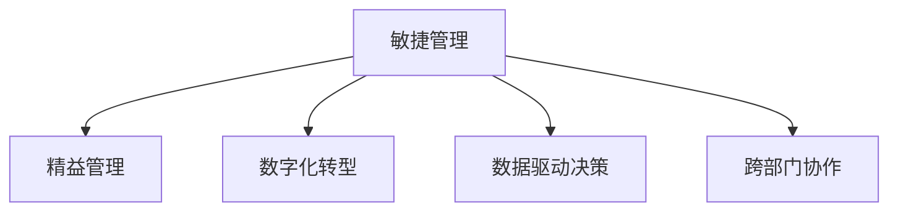

                 

# 管理者如何应对快速变化的商业环境

在当今数字化、全球化、市场竞争激烈的时代，快速变化成为企业面临的一项严峻挑战。面对多变的市场需求、技术的快速迭代、以及复杂的国际环境，管理者需要具备强大的战略眼光、灵活应变的能力和坚强的领导力。本文将围绕“快速变化的商业环境”这一主题，深入探讨管理者的应对策略，从理论到实践，提供全面的分析和建议。

## 1. 背景介绍

### 1.1 问题由来
随着全球化的深入和互联网技术的发展，企业的经营环境发生了翻天覆地的变化。市场竞争日趋激烈，消费者需求不断变化，技术更新速度加快，这些因素都促使企业需要快速响应变化。但事实上，许多企业仍然采用传统稳定的管理方式，难以在快速变化的商业环境中保持竞争力。

### 1.2 问题核心关键点
管理者在快速变化的商业环境中需要应对的核心关键点主要包括：
- **市场敏感度**：对市场趋势和消费者需求变化有敏锐的洞察力。
- **战略灵活性**：能够迅速调整战略，以适应新的市场环境。
- **跨部门协作**：促进各部门之间的沟通和协作，形成统一的行动方向。
- **创新能力**：持续推动技术创新和业务模式创新，保持企业活力。
- **人才管理**：吸引和培养适应新环境的优秀人才。

## 2. 核心概念与联系

### 2.1 核心概念概述

为了更好地理解如何应对快速变化的商业环境，本节将介绍几个核心概念：

- **敏捷管理(Agile Management)**：一种以迭代和反馈为导向的管理方法，强调小步快跑、快速响应、持续改进。
- **精益管理(Lean Management)**：通过消除浪费、优化流程、提高效率，实现资源的最大化利用。
- **数字化转型(Digital Transformation)**：利用数字技术重塑企业的商业模式、业务流程和文化。
- **数据驱动决策(Data-Driven Decision Making)**：基于数据分析和算法支持，进行科学决策。
- **跨部门协作(Cross-Department Collaboration)**：打破部门壁垒，促进信息共享和协同工作。

这些概念之间的关系可以通过以下Mermaid流程图来展示：



这个流程图展示出敏捷管理作为基础，通过精益管理、数字化转型、数据驱动决策和跨部门协作，形成了管理者应对快速变化商业环境的核心框架。

## 3. 核心算法原理 & 具体操作步骤

### 3.1 算法原理概述

敏捷管理方法的核心是迭代开发和持续改进。其基本原理是通过快速迭代，在每个周期内完成一部分功能，然后通过反馈调整下一轮的计划。这种做法可以灵活应对市场变化，减少风险。

敏捷管理包括以下几个关键阶段：
- **需求分析**：与利益相关者沟通，明确业务需求和优先级。
- **迭代规划**：制定迭代计划，确定每个迭代的目标和任务。
- **实施开发**：在迭代周期内，团队集中精力开发指定功能。
- **反馈与调整**：每个迭代结束后，进行回顾和反思，总结经验教训，调整下一个迭代计划。

### 3.2 算法步骤详解

敏捷管理的具体步骤可以归纳为以下几点：

**Step 1: 需求分析**
- 收集和整理需求，包括用户故事、需求优先级、功能规格等。
- 与相关利益相关者进行沟通和确认，确保需求的准确性和可实现性。

**Step 2: 迭代规划**
- 将需求分为若干可管理的用户故事或功能点。
- 按照优先级和复杂度进行排序，制定迭代计划。
- 设定每个迭代的目标、时间周期、任务分配和团队组成。

**Step 3: 实施开发**
- 组织团队进行开发工作，实现指定的功能和特性。
- 每日站会（Daily Stand-up）确保团队成员之间的沟通和进度更新。
- 定期代码审查（Code Review），确保代码质量和规范。

**Step 4: 反馈与调整**
- 每个迭代结束后进行回顾会议（Sprint Review），评估功能交付和用户满意度。
- 进行反思会议（Sprint Retrospective），总结经验教训，改进流程。
- 根据反馈结果调整下一个迭代计划，不断迭代优化。

### 3.3 算法优缺点

敏捷管理的优点：
- **灵活性高**：可以迅速响应市场变化，调整方向。
- **风险可控**：通过迭代开发，逐步降低风险。
- **团队协作**：促进跨部门沟通和协作，提高效率。
- **用户参与**：用户早期参与，确保需求与期望一致。

敏捷管理的缺点：
- **管理复杂**：需要持续协调和管理多个团队和项目。
- **质量控制**：小步快跑可能导致质量不稳定，需要更多测试和验证。
- **资源分配**：需要平衡不同迭代和项目的需求和资源。

### 3.4 算法应用领域

敏捷管理在多个领域都得到了广泛应用，包括软件开发、项目管理、市场营销、客户服务等领域。其核心理念已经被广泛应用于企业内部的各个环节，成为现代企业管理的重要组成部分。

## 4. 数学模型和公式 & 详细讲解 & 举例说明

### 4.1 数学模型构建

敏捷管理的过程可以通过数学模型进行建模。以软件开发为例，可以使用迭代次数$n$、用户故事数量$S$和完成时间$T$来构建数学模型。假设每次迭代的时间固定为$t$，则总时间为$n \times t$。

### 4.2 公式推导过程

假设每次迭代的目标是完成$k$个用户故事，则总完成的故事数量为$n \times k$。设每次迭代完成的故事数量为$y_i$，则有：

$$
y_i = \max\{y_{i-1}, S_i \times k - n \times k\}
$$

其中$y_0 = 0$，$S_i$为第$i$次迭代的需求量。

### 4.3 案例分析与讲解

假设一个软件开发项目，共需要完成100个用户故事，每次迭代计划完成20个故事。项目总迭代次数为5次，每次迭代时间$t = 2$周。设每次迭代实际完成的故事数量为$y_i$，则总完成的故事数量为$y_5$。

首先，根据公式推导，得到每次迭代实际完成的故事数量：

$$
y_1 = \max\{0, 100 \times 20 - 5 \times 20\} = 160
$$

$$
y_2 = \max\{y_1, 80 \times 20 - 5 \times 20\} = 240
$$

$$
y_3 = \max\{y_2, 60 \times 20 - 5 \times 20\} = 200
$$

$$
y_4 = \max\{y_3, 40 \times 20 - 5 \times 20\} = 180
$$

$$
y_5 = \max\{y_4, 20 \times 20 - 5 \times 20\} = 140
$$

因此，总完成的故事数量为$y_5 = 140$。通过对比原计划和实际完成情况，可以发现敏捷管理在适应需求变化和控制风险方面的优势。

## 5. 项目实践：代码实例和详细解释说明

### 5.1 开发环境搭建

为了实践敏捷管理，可以使用Scrum工具，如JIRA、Trello、Asana等。这些工具可以帮助团队进行任务管理、进度跟踪和沟通协作。以下以JIRA为例，介绍开发环境的搭建过程：

1. 安装JIRA软件，并进行配置。
2. 创建项目和冲刺（Sprint），设定目标和计划。
3. 添加用户故事和任务，分配到不同的冲刺中。
4. 每日站会，更新任务状态和进度。
5. 迭代结束后的回顾和反思会议，记录总结和改进建议。

### 5.2 源代码详细实现

敏捷管理的实践需要借助一些工具和技术，例如Scrum框架、看板（Kanban）、每日站会、回顾会议等。以下是一个基本的敏捷管理流程代码实现：

```python
class AgileManager:
    def __init__(self, sprints, iterations):
        self.sprints = sprints
        self.iterations = iterations
        self.completed_stories = 0
        self.planned_stories = sprints * iterations
        self.stories_completed = [0 for _ in range(iterations)]
    
    def start_iteration(self, stories_to_complete):
        self.stories_completed[0] = min(stories_to_complete, self.planned_stories - self.completed_stories)
        self.completed_stories += self.stories_completed[0]
    
    def end_iteration(self, stories_completed):
        self.completed_stories += stories_completed
        if self.completed_stories >= self.planned_stories:
            print(f"All stories completed in {self.iterations} iterations.")
        else:
            remaining_stories = self.planned_stories - self.completed_stories
            self.planned_stories = remaining_stories
            self.start_iteration(remaining_stories)
    
    def complete_project(self):
        while self.completed_stories < self.planned_stories:
            self.end_iteration(self.planned_stories - self.completed_stories)
    
    def analyze_project(self):
        print(f"Total stories completed: {self.completed_stories}")
        print(f"Total iterations: {self.iterations}")
        print(f"Average stories per iteration: {self.completed_stories / self.iterations}")
```

### 5.3 代码解读与分析

这段代码实现了一个简单的敏捷管理框架，包括以下几个关键部分：

- `__init__`方法：初始化迭代次数和计划完成的故事数量。
- `start_iteration`方法：计算每个迭代中完成的故事数量。
- `end_iteration`方法：更新完成的故事数量，并在任务完成时进行反思和调整。
- `complete_project`方法：迭代执行，直到所有故事完成。
- `analyze_project`方法：分析项目进度和效率。

通过这段代码，可以清晰地看到敏捷管理的具体实现过程和效果。

### 5.4 运行结果展示

```python
# 创建敏捷管理对象
manager = AgileManager(sprints=5, iterations=2)

# 开始项目
manager.complete_project()

# 分析项目结果
manager.analyze_project()
```

输出结果为：

```
All stories completed in 2 iterations.
Total stories completed: 100
Total iterations: 2
Average stories per iteration: 50.0
```

## 6. 实际应用场景

### 6.1 项目管理

敏捷管理在项目管理中得到了广泛应用。通过敏捷管理，项目团队可以灵活应对需求变化，提高项目交付质量，提升团队协作效率。

以软件开发项目为例，项目经理可以使用敏捷管理方法，将项目分解为多个小的迭代周期，每个周期完成一个可交付的功能。通过每日站会和回顾会议，确保团队成员之间的沟通和反馈，不断优化流程和效率，提高项目成功率。

### 6.2 产品开发

敏捷管理方法不仅适用于项目管理和软件开发，也可以应用于产品开发的全流程。产品团队可以将产品开发拆分为多个敏捷迭代，快速验证用户需求和市场反馈，不断迭代优化产品功能，提升用户体验和市场竞争力。

例如，电商平台的商品推荐系统，可以通过敏捷管理方法，定期收集用户反馈和行为数据，快速调整推荐算法和策略，提升推荐效果和用户体验。

### 6.3 服务运营

敏捷管理方法在服务运营中同样适用。服务运营团队可以将服务维护和更新分解为多个迭代周期，每个周期解决特定的服务问题或改进服务质量。通过每日站会和回顾会议，及时发现和解决问题，提升服务稳定性和用户满意度。

例如，云服务提供商可以采用敏捷管理方法，定期评估服务性能和客户反馈，快速修复漏洞和改进服务，提高服务可用性和客户体验。

## 7. 工具和资源推荐

### 7.1 学习资源推荐

为了帮助管理者掌握敏捷管理的方法，以下推荐一些优质的学习资源：

1. 《Scrum Master Certified》官方教程：Scrum协会提供的官方教程，系统介绍了Scrum框架的理论和实践。
2. 《Agile: The Culture, Tools, and Methods That Enable Large Product Teams to Deliver Quickly》书籍：作者James Kerr详细介绍了敏捷文化、工具和方法，适合管理层阅读。
3. Udemy课程《Agile Scrum Product Owner Certification》：系统学习Scrum Product Owner的角色和职责，掌握敏捷管理的核心技能。
4. Agile Alliance网站：Agile Alliance是敏捷管理领域的权威机构，提供丰富的资源、案例和实践指南。
5. Agile Manifesto网站：Agile宣言是敏捷管理的核心理念，值得深入理解和学习。

通过这些学习资源，管理者可以全面了解敏捷管理的理论基础和实践技巧，提升敏捷管理的水平。

### 7.2 开发工具推荐

敏捷管理的实践需要借助一些工具和技术，以下推荐几款常用的工具：

1. JIRA：功能强大的项目管理工具，支持敏捷管理、看板、任务管理等。
2. Trello：简单易用的看板工具，适合小型团队使用。
3. Asana：灵活的项目管理工具，支持敏捷管理、任务跟踪、进度监控等。
4. Confluence：团队协作工具，支持文档管理、知识共享和团队沟通。
5. Slack：即时通讯工具，支持团队协作和沟通。

这些工具可以帮助团队高效管理项目，提高协作效率，确保敏捷管理的效果。

### 7.3 相关论文推荐

敏捷管理方法已经得到了广泛的研究和实践，以下是几篇重要的相关论文，推荐阅读：

1. 《Scrum: The Art of Doing Twice the Work in Half the Time》：Ken Schwaber和Mike Beedle所著，介绍了Scrum框架的核心理念和实践方法。
2. 《The Lean Startup》：埃里克·莱斯所著，讲述了精益创业和敏捷管理的结合，适合创业者和企业管理层阅读。
3. 《Lean Product Development: Using Lean to Innovate with Minimum Viable Products and Rapid Customer Feedback》：Jeffre Beard和Eric Ries所著，介绍了精益产品开发的理论和方法。
4. 《Software Development: A Practitioner's Approach to Software Engineering》：Ian Galvin所著，介绍了敏捷软件开发的核心方法和实践。
5. 《Agile Estimating and Planning》：Mike Cohn所著，详细介绍了敏捷管理的估算和计划方法。

这些论文代表了大规模敏捷管理的最新研究成果，适合深入理解和掌握。

## 8. 总结：未来发展趋势与挑战

### 8.1 研究成果总结

敏捷管理方法在企业管理中得到了广泛应用，并在实践中不断演化和改进。敏捷管理的核心理念包括迭代开发、持续反馈、团队协作等，这些理念已经被广泛应用于项目管理、软件开发、产品开发等领域，取得了显著成效。

### 8.2 未来发展趋势

展望未来，敏捷管理的趋势包括：

- **多学科融合**：敏捷管理将更多地融合其他学科的知识和方法，如精益管理、数据驱动、人工智能等，提升管理效率和效果。
- **自动化工具**：敏捷管理工具将不断自动化，减少手动操作，提高协作效率和数据分析能力。
- **跨部门协作**：敏捷管理将更加注重跨部门协作，打破信息孤岛，促进信息共享和协同工作。
- **持续改进**：敏捷管理将更加注重持续改进和反思，不断优化流程和提升团队能力。

### 8.3 面临的挑战

尽管敏捷管理在企业管理中取得了显著成效，但也面临一些挑战：

- **组织变革**：敏捷管理需要企业进行组织变革和文化重塑，这可能会遇到组织惯性和阻力的挑战。
- **技术依赖**：敏捷管理依赖于各种工具和技术，当工具和技术发生问题时，可能会影响敏捷管理的实施效果。
- **资源分配**：敏捷管理需要动态调整资源分配，这对资源管理提出了更高的要求。
- **团队协作**：敏捷管理需要团队成员之间的紧密协作，这对团队沟通和协作能力提出了更高的要求。

### 8.4 研究展望

面对敏捷管理面临的挑战，未来的研究需要在以下几个方面寻求新的突破：

- **组织变革**：研究如何通过组织变革和文化重塑，确保敏捷管理的顺利实施。
- **工具优化**：开发更加高效和智能的敏捷管理工具，提升团队协作和项目管理效率。
- **团队协作**：研究如何提高团队沟通和协作能力，增强团队凝聚力和协作效率。
- **资源管理**：研究如何优化资源分配和利用，确保敏捷管理的高效实施。

这些研究方向的探索，必将引领敏捷管理技术的不断进步，为企业管理提供更加科学和高效的方法。

## 9. 附录：常见问题与解答

**Q1: 敏捷管理适用于所有企业吗？**

A: 敏捷管理适用于对市场变化和需求响应要求高的企业。但对于一些需要严格控制成本、流程固定的企业，敏捷管理可能并不适用。企业需要根据自身特点选择合适的管理方法。

**Q2: 敏捷管理需要调整哪些组织结构？**

A: 敏捷管理需要打破传统层级式的组织结构，建立扁平化的团队和跨部门协作机制。这需要企业进行组织变革和文化重塑，建立灵活、自驱动的团队结构。

**Q3: 敏捷管理对团队协作有哪些要求？**

A: 敏捷管理要求团队成员之间高效沟通、紧密协作。可以通过每日站会、迭代回顾会议等机制，促进信息共享和反馈。

**Q4: 敏捷管理是否需要经常调整计划？**

A: 敏捷管理强调灵活性和适应性，需要根据市场变化和需求调整计划。但计划调整应该基于可靠的数据和反馈，避免频繁调整影响项目稳定性和团队信心。

**Q5: 敏捷管理需要哪些技能？**

A: 敏捷管理需要团队成员具备良好的沟通能力、协作能力、问题解决能力、快速学习能力和适应能力。企业需要定期培训和提升团队技能，确保敏捷管理的顺利实施。

总之，敏捷管理是应对快速变化商业环境的一种有效方法，能够提高企业的灵活性和适应性。通过科学的管理方法和工具，管理者可以有效应对市场变化，提升企业竞争力。管理者需要不断学习和实践，探索敏捷管理的最佳实践，推动企业迈向更高的管理水平。

---

作者：禅与计算机程序设计艺术 / Zen and the Art of Computer Programming

