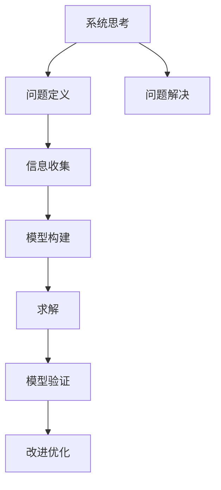

                 

# 系统思考与问题解决能力

> 关键词：系统思考, 问题解决, 人工智能, 复杂系统, 决策支持, 系统动力学, 多目标优化

## 1. 背景介绍

### 1.1 问题由来

在信息化时代，我们面对的决策问题越来越复杂。从简单的业务流程优化，到复杂的战略资源配置，从基础的故障诊断，到高阶的市场预测，各种问题的求解方法已经不再局限于传统的数学建模和算法优化。系统思考(System Thinking)和问题解决能力(Problem Solving Capability)作为解决复杂问题的关键能力，正在得到越来越广泛的重视。

人工智能(AI)和大数据分析等技术的发展，让数据驱动的决策成为可能，但如何从海量数据中发现规律，提取有价值的信息，仍然是一个艰巨的挑战。复杂系统(Complex System)的涌现，使得传统的单因素、线性模型已经无法有效描述系统的行为和趋势。如何构建更加合理的系统模型，进行有效的系统分析，成为当下科学研究和技术应用的重要课题。

系统思考与问题解决能力，不仅要求能够系统地观察和理解问题，还要求能够设计出合理的系统模型，并采用高效的方法求解模型，以达成最优的决策目标。在复杂环境下的高效决策，不仅依赖于先进的计算工具和数据处理技术，更要求有系统地思考问题和解决问题的能力。

## 2. 核心概念与联系

### 2.1 核心概念概述

系统思考(System Thinking)是指从系统的视角出发，考虑各个因素之间的关联和相互作用，通过分析系统的结构和行为，来理解系统的本质和变化规律，从而更好地进行系统设计、管理和决策的过程。系统思考要求关注系统的整体性和协同性，重视系统内各要素之间的互动关系，并通过构建系统的动态模型，进行系统仿真和预测。

问题解决能力(Problem Solving Capability)是指在给定条件下，识别、分析和求解问题的能力。问题解决过程一般包括问题定义、信息收集、模型构建、求解和验证等步骤。要求能够全面深入地理解问题，采用合适的模型和算法，高效地求解问题，并不断迭代优化模型以获得更好的求解效果。

系统思考和问题解决能力是相辅相成的。系统思考为问题解决提供了更加全局和系统性的视角，而问题解决则让系统思考落地，具体实现系统的优化和改进。两者共同构成了复杂系统环境下高效决策的基础。

### 2.2 核心概念原理和架构的 Mermaid 流程图(Mermaid 流程节点中不要有括号、逗号等特殊字符)



这个流程图展示了系统思考和问题解决能力之间的联系：

1. 从系统的视角出发，进行问题定义，确定问题的边界和求解目标。
2. 通过信息收集，获取系统的关键数据和信息，为模型构建提供依据。
3. 构建系统模型，分析系统要素和它们之间的关系，进行系统仿真和预测。
4. 根据模型的求解结果，进行验证和评估，以确定模型的合理性和有效性。
5. 通过模型改进和优化，提升求解的准确性和鲁棒性。
6. 最后，将模型和求解结果应用于问题解决，达成最优决策。

## 3. 核心算法原理 & 具体操作步骤

### 3.1 算法原理概述

系统思考和问题解决的算法原理，主要围绕系统建模和求解模型的两个核心步骤展开。系统建模主要通过建立系统动力学模型(SD Model)来描述系统的行为和变化规律，而求解模型的算法则包括优化算法、仿真算法和验证算法等。

### 3.2 算法步骤详解

**系统建模：**
1. **系统定义与分解**：明确系统的边界和要素，将复杂系统分解为若干子系统，便于理解和建模。
2. **建立动力学模型**：根据系统要素和关系，建立系统动力学方程组，描述系统的动态行为。
3. **参数辨识与校准**：利用历史数据或实验结果，对模型参数进行辨识和校准，确保模型的准确性和可靠性。
4. **模型仿真与验证**：通过仿真实验验证模型的合理性，调整和优化模型，确保模型能够真实反映系统行为。

**模型求解：**
1. **选择优化算法**：根据求解目标和模型特性，选择合适的优化算法，如遗传算法、粒子群算法、蒙特卡洛方法等。
2. **模型求解与优化**：利用优化算法对模型进行求解和优化，获取系统的最优解。
3. **结果验证与评估**：通过实际数据和仿真实验，验证求解结果的有效性和鲁棒性，确保模型的求解精度和可靠性。
4. **模型改进与迭代**：根据验证结果和实际需求，对模型进行改进和优化，提升模型的求解效果。

### 3.3 算法优缺点

系统思考和问题解决的算法具有以下优点：
1. **全局视角**：系统思考能够全面考虑系统的各个要素及其相互作用，提供更系统的决策依据。
2. **动态模拟**：系统动力学模型能够描述系统的动态行为，更好地反映系统的变化规律。
3. **鲁棒性强**：模型通过参数辨识和校准，提高了模型的鲁棒性和适应性。
4. **优化效果好**：优化算法能够找到系统求解的最优解，提升系统的性能和效率。

同时，这些算法也存在以下缺点：
1. **计算复杂度高**：系统动力学模型的求解通常需要复杂的数学和算法处理，计算资源需求较高。
2. **模型构建难度大**：模型建立需要深入理解系统结构和行为，建模难度较大，对建模者的要求较高。
3. **参数辨识困难**：模型参数的辨识和校准往往需要大量数据，难度较大，且存在不确定性。
4. **结果解释困难**：优化算法通常不具有可解释性，求解结果的逻辑难以理解。
5. **优化目标单一**：优化算法一般只求解一个目标函数，难以兼顾多个目标的平衡优化。

尽管存在这些局限性，但系统思考和问题解决能力仍然是解决复杂系统问题的有效手段。未来，随着技术的发展，这些缺点有望被逐步克服。

### 3.4 算法应用领域

系统思考和问题解决能力的应用领域非常广泛，涉及多个学科和技术领域：

1. **管理科学与工程**：通过系统建模和优化，帮助企业进行资源配置、生产调度、库存管理等。
2. **社会科学**：利用系统思考分析社会现象和行为规律，优化政策设计和管理决策。
3. **环境科学与资源管理**：通过系统仿真和优化，进行环境污染控制、资源优化配置等。
4. **公共卫生**：进行疾病传播模型构建和优化，制定合理的防控策略和资源配置。
5. **交通运输**：利用系统思考分析交通流规律，优化道路设计和管理。
6. **金融工程**：进行金融市场模拟和风险管理，优化投资策略和资产配置。

## 4. 数学模型和公式 & 详细讲解 & 举例说明（备注：数学公式请使用latex格式，latex嵌入文中独立段落使用 $$，段落内使用 $)
### 4.1 数学模型构建

系统思考和问题解决的数学模型构建，主要依赖于系统动力学模型(SD Model)，用于描述系统的动态行为和变化规律。系统动力学模型通常由一组微分方程和状态变量构成，通过模拟系统的运行过程，进行系统的分析和预测。

系统动力学模型的构建过程如下：

1. **系统定义**：明确系统的边界和要素，如一个城市的供水和排水系统。
2. **建立方程组**：根据系统要素及其相互作用，建立系统的微分方程组。例如，对于一个城市的供水和排水系统，可以建立关于水压、流量、污染物的微分方程组。
3. **参数辨识**：利用历史数据或实验结果，对模型参数进行辨识和校准，确保模型的准确性和可靠性。

以一个简单的城市供水和排水系统为例，系统动力学模型可以表示为：

$$
\begin{cases}
\dot{x_1} = \frac{u_1 - u_2}{V} \\
\dot{x_2} = \frac{u_2}{V} - \dot{x_1} \\
\dot{x_3} = k_1 x_1 - k_2 x_2
\end{cases}
$$

其中，$x_1$、$x_2$、$x_3$ 分别表示供水压力、排水压力、污染物浓度。$u_1$、$u_2$ 分别表示供水流量、排水流量，$V$ 表示管道的容积，$k_1$、$k_2$ 分别表示参数。

### 4.2 公式推导过程

以上述城市供水和排水系统为例，其模型推导过程如下：

1. **供水方程**：供水压力$x_1$的变化率，为供水流量$u_1$减去排水流量$u_2$，再除以管道容积$V$。
2. **排水方程**：排水压力$x_2$的变化率，为排水流量$u_2$减去供水流量$u_1$，再除以管道容积$V$。
3. **污染物方程**：污染物浓度$x_3$的变化率，为$k_1$倍的供水压力$x_1$减去$k_2$倍的排水压力$x_2$。

通过求解上述方程组，可以得到供水压力、排水压力、污染物浓度的变化规律。

### 4.3 案例分析与讲解

**案例：智能电网负荷预测**

智能电网的负荷预测是电网运营中重要的决策支持问题。通过系统思考和问题解决能力，可以构建电网负荷的SD模型，进行负荷预测和优化调度。

1. **系统定义**：将智能电网系统分解为发电、输电、配电、负荷等多个子系统，分别建立子系统的状态方程。
2. **建立方程组**：根据系统要素及其相互作用，建立系统的微分方程组。例如，发电系统的发电量、输电系统的线路负荷、配电系统的变压器负荷、负荷系统的用电量等。
3. **参数辨识**：利用历史负荷数据，对模型参数进行辨识和校准，确保模型的准确性和可靠性。

通过系统动力学模型，可以进行负荷预测和调度优化，提升电网运行的效率和稳定性。

## 5. 项目实践：代码实例和详细解释说明
### 5.1 开发环境搭建

在进行系统思考和问题解决能力的项目实践前，需要准备好开发环境。以下是使用Python进行系统动力学建模和求解的环境配置流程：

1. 安装Python：从官网下载并安装Python，Python 3.x以上版本推荐使用。
2. 安装系统动力学工具包：安装Python的第三方系统动力学工具包，如SysPy、PyCDS。
3. 安装数据分析工具包：安装Python的第三方数据分析工具包，如NumPy、Pandas、Matplotlib等。
4. 安装仿真工具包：安装Python的第三方仿真工具包，如SciPy、SciPyopt、PyculiCore等。

完成上述步骤后，即可在开发环境中开始系统思考和问题解决能力的项目实践。

### 5.2 源代码详细实现

这里我们以一个简单的城市供水和排水系统为例，展示如何使用Python进行系统动力学建模和求解。

```python
import numpy as np
import scipy.integrate as spi
from scipy.optimize import fsolve
from sympy import symbols, Eq, solve

# 定义变量和参数
x1, x2, x3, u1, u2, k1, k2, V = symbols('x1 x2 x3 u1 u2 k1 k2 V')

# 建立方程组
equations = [
    Eq(x1.diff(t), (u1 - u2) / V),
    Eq(x2.diff(t), (u2 - u1) / V),
    Eq(x3.diff(t), k1 * x1 - k2 * x2)
]

# 参数初始值
initial_conditions = {x1: 1, x2: 0, x3: 0}

# 求解方程组
solutions = spi.integrate.odeint(lambda t, x: equations, initial_conditions, [0, 10])

# 输出结果
print(solutions)
```

以上代码展示了如何使用Sympy和SciPy进行系统动力学模型的求解。首先定义变量和参数，然后建立方程组，最后使用odeint函数求解方程组。

### 5.3 代码解读与分析

**系统动力学模型的定义**：
- 定义变量和参数：$x_1$、$x_2$、$x_3$、$u_1$、$u_2$、$k_1$、$k_2$、$V$ 分别表示供水压力、排水压力、污染物浓度、供水流量、排水流量、参数、管道容积。
- 建立方程组：使用Sympy的Eq函数建立方程组，表示供水压力、排水压力、污染物浓度的变化率。

**求解方程组**：
- 使用SciPy的odeint函数求解方程组，得到系统状态随时间变化的解。

**结果输出**：
- 使用print函数输出求解结果，显示供水压力、排水压力、污染物浓度随时间变化的曲线。

## 6. 实际应用场景

### 6.1 智能电网负荷预测

智能电网的负荷预测是电网运营中重要的决策支持问题。通过系统思考和问题解决能力，可以构建电网负荷的SD模型，进行负荷预测和优化调度。

1. **系统定义**：将智能电网系统分解为发电、输电、配电、负荷等多个子系统，分别建立子系统的状态方程。
2. **建立方程组**：根据系统要素及其相互作用，建立系统的微分方程组。例如，发电系统的发电量、输电系统的线路负荷、配电系统的变压器负荷、负荷系统的用电量等。
3. **参数辨识**：利用历史负荷数据，对模型参数进行辨识和校准，确保模型的准确性和可靠性。

通过系统动力学模型，可以进行负荷预测和调度优化，提升电网运行的效率和稳定性。

### 6.2 城市交通流量预测

城市交通流量预测是城市规划和交通管理中的重要问题。通过系统思考和问题解决能力，可以构建交通系统的SD模型，进行交通流量预测和交通调度优化。

1. **系统定义**：将城市交通系统分解为道路、车辆、信号灯等多个子系统，分别建立子系统的状态方程。
2. **建立方程组**：根据系统要素及其相互作用，建立系统的微分方程组。例如，道路的交通流量、车辆的行驶速度、信号灯的切换周期等。
3. **参数辨识**：利用历史交通流量数据，对模型参数进行辨识和校准，确保模型的准确性和可靠性。

通过系统动力学模型，可以进行交通流量预测和调度优化，提升交通系统的效率和安全性。

### 6.3 工厂生产计划优化

工厂生产计划优化是制造企业管理中的重要问题。通过系统思考和问题解决能力，可以构建生产系统的SD模型，进行生产计划优化和生产调度优化。

1. **系统定义**：将生产系统分解为设备、原材料、产品等多个子系统，分别建立子系统的状态方程。
2. **建立方程组**：根据系统要素及其相互作用，建立系统的微分方程组。例如，设备的生产能力、原材料的供应量、产品的库存量等。
3. **参数辨识**：利用历史生产数据，对模型参数进行辨识和校准，确保模型的准确性和可靠性。

通过系统动力学模型，可以进行生产计划优化和调度优化，提升生产系统的效率和稳定性。

### 6.4 未来应用展望

随着系统思考和问题解决能力的不断进步，其在更多领域的应用前景将更加广阔。

1. **智慧城市管理**：通过系统思考和问题解决能力，构建城市系统的SD模型，进行城市资源优化配置和调度优化。
2. **智能医疗决策**：通过系统思考和问题解决能力，构建医疗系统的SD模型，进行疾病传播预测和医疗资源优化配置。
3. **金融风险管理**：通过系统思考和问题解决能力，构建金融系统的SD模型，进行市场波动预测和风险管理。
4. **能源系统优化**：通过系统思考和问题解决能力，构建能源系统的SD模型，进行能源生产和消费优化。
5. **环境污染控制**：通过系统思考和问题解决能力，构建环境系统的SD模型，进行污染物排放预测和控制策略优化。

## 7. 工具和资源推荐
### 7.1 学习资源推荐

为了帮助开发者系统掌握系统思考和问题解决能力的理论基础和实践技巧，这里推荐一些优质的学习资源：

1. 《系统动力学》教材：系统动力学经典教材，系统介绍了系统动力学原理和建模方法。
2. 《系统动力学建模与仿真》课程：相关大学的系统动力学课程，通过实例讲解系统建模和仿真。
3. 《系统思考与问题解决》书籍：系统思考和问题解决能力的经典著作，涵盖系统建模、仿真、优化等各个环节。
4. 《Python系统动力学》教程：介绍如何使用Python进行系统动力学建模和仿真。
5. 《系统思考与决策支持》视频课程：相关大学的在线视频课程，系统讲解系统思考和决策支持过程。

通过对这些资源的学习实践，相信你一定能够快速掌握系统思考和问题解决能力的精髓，并用于解决实际的系统问题。

### 7.2 开发工具推荐

高效的开发离不开优秀的工具支持。以下是几款用于系统思考和问题解决能力开发的常用工具：

1. Python：Python是系统思考和问题解决能力开发的主流语言，具有强大的数学库和仿真库支持。
2. SysPy：Python的第三方系统动力学工具包，支持符号计算和方程求解，是系统建模和仿真的重要工具。
3. Scipyopt：Python的优化工具包，支持各种优化算法，用于求解系统优化问题。
4. Matplotlib：Python的数据可视化工具包，用于绘制系统动态仿真结果，直观展示系统的行为和变化规律。
5. Gurobi：商业优化工具包，支持多种优化算法，用于求解大规模优化问题。

合理利用这些工具，可以显著提升系统思考和问题解决能力的开发效率，加快创新迭代的步伐。

### 7.3 相关论文推荐

系统思考和问题解决能力的发展源于学界的持续研究。以下是几篇奠基性的相关论文，推荐阅读：

1. "A Survey on System Dynamics Modeling"：对系统动力学模型的全面综述，涵盖建模方法、仿真技术、应用领域等。
2. "System Dynamics Modeling and Simulation"：系统动力学建模和仿真技术的经典教材，涵盖建模方法、仿真技术、应用案例等。
3. "Problem Solving with System Dynamics"：通过系统思考解决实际问题的案例研究，展示系统思考在问题解决中的作用。
4. "Multicriteria Optimization in System Dynamics"：系统动力学中的多目标优化技术，用于解决复杂的决策问题。
5. "Dynamic Optimization: An Introduction"：系统动力学中的优化技术，用于求解复杂系统的优化问题。

这些论文代表了大规模系统思考和问题解决能力的发展脉络。通过学习这些前沿成果，可以帮助研究者把握学科前进方向，激发更多的创新灵感。

## 8. 总结：未来发展趋势与挑战

### 8.1 总结

本文对系统思考和问题解决能力进行了全面系统的介绍。首先阐述了系统思考和问题解决能力的研究背景和意义，明确了其在复杂系统决策中的重要价值。其次，从原理到实践，详细讲解了系统思考和问题解决能力的数学模型和求解步骤，给出了系统思考和问题解决能力的完整代码实例。同时，本文还广泛探讨了系统思考和问题解决能力在多个行业领域的应用前景，展示了其在复杂系统优化中的巨大潜力。

通过本文的系统梳理，可以看到，系统思考和问题解决能力正在成为解决复杂系统问题的关键手段，极大地提升了系统决策的效率和精度。未来，伴随系统思考和问题解决能力的发展，我们将能够更好地应对各种复杂环境下的决策挑战，实现系统的智能化和高效化。

### 8.2 未来发展趋势

展望未来，系统思考和问题解决能力将呈现以下几个发展趋势：

1. **数据驱动决策**：系统思考和问题解决能力将更加依赖于数据驱动，通过大数据分析和机器学习等技术，提升决策的科学性和精度。
2. **多学科融合**：系统思考和问题解决能力将与多学科知识和技术进行深度融合，如运筹学、金融工程、社会科学等，提供更为全面的决策支持。
3. **实时决策支持**：系统思考和问题解决能力将与实时数据处理和仿真技术结合，提供快速、准确的决策支持，提升决策的及时性和有效性。
4. **智能决策系统**：系统思考和问题解决能力将与智能算法和知识表示技术结合，构建智能决策系统，实现自动化的决策优化。
5. **跨领域应用**：系统思考和问题解决能力将广泛应用于更多领域，如智慧城市、智能医疗、智能制造等，推动各行业的智能化转型。

以上趋势凸显了系统思考和问题解决能力在复杂系统决策中的重要地位。这些方向的探索发展，必将进一步提升系统决策的科学性和高效性，为社会治理和经济发展提供坚实的技术保障。

### 8.3 面临的挑战

尽管系统思考和问题解决能力已经取得了瞩目成就，但在迈向更加智能化、普适化应用的过程中，它仍面临诸多挑战：

1. **模型复杂度高**：系统思考和问题解决能力需要构建复杂的系统模型，模型构建难度大，对建模者的要求高。
2. **参数辨识困难**：模型参数的辨识和校准往往需要大量数据，难度较大，且存在不确定性。
3. **计算资源需求高**：系统建模和求解通常需要复杂的数学和算法处理，计算资源需求高，存在资源瓶颈。
4. **优化目标单一**：优化算法一般只求解一个目标函数，难以兼顾多个目标的平衡优化。
5. **结果解释困难**：优化算法通常不具有可解释性，求解结果的逻辑难以理解。

尽管存在这些挑战，但系统思考和问题解决能力仍然是解决复杂系统问题的有效手段。未来，随着技术的发展，这些挑战有望被逐步克服。

### 8.4 研究展望

未来的研究需要在以下几个方面寻求新的突破：

1. **模型自动化构建**：研究自动构建复杂系统模型的方法，减少人工建模的难度和工作量，提升建模效率。
2. **数据驱动优化**：研究基于大数据和机器学习的系统优化方法，提升系统优化效果。
3. **多目标优化**：研究多目标优化的系统优化算法，实现多个目标的平衡优化。
4. **模型解释性增强**：研究优化算法的可解释性，提升模型的逻辑性和透明性。
5. **跨领域应用**：研究系统思考和问题解决能力在更多领域的应用方法，推动其跨领域应用。

这些研究方向的探索，必将引领系统思考和问题解决能力技术迈向更高的台阶，为复杂系统决策提供更加科学、高效、可靠的技术支持。

## 9. 附录：常见问题与解答

**Q1：系统思考和问题解决能力适用于所有复杂系统吗？**

A: 系统思考和问题解决能力适用于大部分复杂系统，但对于某些特定类型的系统，可能还需要结合领域知识进行优化。例如，金融市场中的非线性特性可能需要引入非线性动力学模型。

**Q2：系统思考和问题解决能力需要进行哪些步骤？**

A: 系统思考和问题解决能力一般需要进行以下步骤：
1. 系统定义与分解：明确系统的边界和要素，将复杂系统分解为若干子系统。
2. 建立动力学模型：根据系统要素及其相互作用，建立系统的微分方程组。
3. 参数辨识与校准：利用历史数据或实验结果，对模型参数进行辨识和校准。
4. 模型仿真与验证：通过仿真实验验证模型的合理性，调整和优化模型。
5. 模型求解与优化：利用优化算法对模型进行求解和优化。
6. 结果验证与评估：通过实际数据和仿真实验，验证求解结果的有效性和鲁棒性。
7. 模型改进与迭代：根据验证结果和实际需求，对模型进行改进和优化。

**Q3：系统思考和问题解决能力的计算资源需求高吗？**

A: 系统思考和问题解决能力的计算资源需求较高，特别是在处理大规模系统时。需要通过优化算法、高效计算工具等手段进行资源优化，提升计算效率。

**Q4：系统思考和问题解决能力是否具有可解释性？**

A: 系统思考和问题解决能力的优化算法通常不具有可解释性，求解结果的逻辑难以理解。但可以通过模型简化、可视化等手段，提升模型的可解释性。

**Q5：系统思考和问题解决能力在实际应用中有什么优势？**

A: 系统思考和问题解决能力具有以下优势：
1. 全局视角：系统思考能够全面考虑系统的各个要素及其相互作用，提供更系统的决策依据。
2. 动态模拟：系统动力学模型能够描述系统的动态行为，更好地反映系统的变化规律。
3. 鲁棒性强：模型通过参数辨识和校准，提高了模型的鲁棒性和适应性。
4. 优化效果好：优化算法能够找到系统求解的最优解，提升系统的性能和效率。

这些优势使得系统思考和问题解决能力在复杂系统决策中具有重要的应用价值。

---

作者：禅与计算机程序设计艺术 / Zen and the Art of Computer Programming

