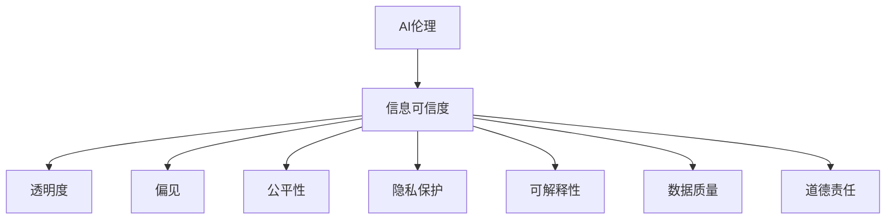

                 

# AI伦理与信息可信度的关系

> 关键词：AI伦理,信息可信度,透明度,偏见,公平性,隐私保护,可解释性,数据质量,道德责任

## 1. 背景介绍

在人工智能(AI)技术快速发展的今天，AI伦理问题引起了广泛关注。AI伦理的核心在于如何在确保技术发展的同时，兼顾人类的尊严、自由和安全。其中，信息可信度（Information Integrity）是AI伦理的关键议题之一，涉及AI系统如何处理和提供信息，以及这些信息是否真实、准确和可信。

信息可信度在AI应用中尤为重要。例如，自动驾驶汽车依赖于道路信息的感知与决策，医疗诊断系统基于医学影像的准确判断，金融风险评估基于数据的精确分析。任何错误或偏见的信息都可能导致严重后果，影响公众信任和社会稳定。

因此，如何构建具有高信息可信度的AI系统，不仅关乎技术的可靠性，更关乎伦理责任和道德规范。本文将从AI伦理的角度出发，探讨信息可信度的重要性和实现路径，为推动AI技术的健康发展提供参考。

## 2. 核心概念与联系

### 2.1 核心概念概述

为了更好地理解AI伦理与信息可信度的关系，本文将介绍几个关键概念：

- **AI伦理**：涉及AI系统在开发、应用和治理过程中，如何遵循伦理原则，保障人权和公正。
- **信息可信度**：指信息内容的真实性、准确性和可信性，是衡量AI系统可靠性的重要指标。
- **透明度**：指AI系统的工作过程和决策依据的公开性和可理解性，是建立公众信任的基础。
- **偏见**：指AI系统由于数据偏差或算法设计失误，导致的不公正决策。
- **公平性**：指AI系统在处理数据和提供服务时，确保不同群体、不同背景用户之间的平等对待。
- **隐私保护**：指在数据收集和处理过程中，保护用户个人信息安全，防止隐私泄露。
- **可解释性**：指AI系统的决策过程可以被解释和理解，以便于诊断和改进。
- **数据质量**：指数据信息的完整性、一致性和真实性，是确保信息可信度的基础。
- **道德责任**：指AI系统开发者和应用者在设计和实施过程中，需对造成的社会影响承担责任。

这些概念之间的逻辑关系可以通过以下Mermaid流程图来展示：



这个流程图展示了信息可信度在AI伦理中的核心地位，以及如何通过透明度、偏见、公平性、隐私保护、可解释性、数据质量和道德责任等多个维度，构建具有高信息可信度的AI系统。

## 3. 核心算法原理 & 具体操作步骤
### 3.1 算法原理概述

AI系统中的信息可信度，依赖于数据的准确性、模型的透明性和公平性。因此，构建高信息可信度的AI系统，需综合考虑以下三个核心算法原理：

- **数据清洗与预处理**：确保数据信息的真实性和一致性，去除噪声和异常值。
- **模型透明度**：设计可解释的模型架构，提供模型决策的解释和可视化。
- **公平性约束**：在模型训练和评估中，引入公平性指标，避免算法偏见。

### 3.2 算法步骤详解

构建高信息可信度的AI系统，一般遵循以下步骤：

1. **数据收集与清洗**：
   - 收集高质量、多样化的数据，去除重复、错误和不完整信息。
   - 进行数据标准化和归一化，确保数据的一致性和完整性。

2. **模型选择与设计**：
   - 选择透明、可解释的模型架构，如决策树、线性回归、逻辑回归等。
   - 设计模型参数和超参数，确保模型具有良好的泛化能力。

3. **公平性约束**：
   - 在模型训练过程中，引入公平性指标，如均衡误差、ROC曲线、F1分数等。
   - 对数据进行再平衡处理，确保不同群体之间的公平性。

4. **模型评估与优化**：
   - 使用多种评估指标，如准确率、召回率、F1分数等，全面评估模型性能。
   - 根据评估结果，优化模型参数和超参数，提升模型性能。

5. **透明度与解释性**：
   - 设计模型可视化工具，展示模型决策过程和关键特征。
   - 提供模型解释报告，解释模型决策依据和推理逻辑。

6. **数据与隐私保护**：
   - 对敏感数据进行加密和匿名化处理，防止隐私泄露。
   - 设计隐私保护机制，如差分隐私、联邦学习等，确保数据安全。

### 3.3 算法优缺点

构建高信息可信度的AI系统，存在以下优点和缺点：

**优点**：
- 提升公众信任：透明和公平的AI系统，能够赢得公众的信任和支持。
- 减少法律风险：通过严格的数据处理和模型评估，降低法律纠纷的风险。
- 优化用户体验：高质量、可解释的AI系统，能够提供更好的用户体验。

**缺点**：
- 数据依赖性强：高质量数据获取和处理成本高，技术难度大。
- 模型复杂度高：透明和可解释的模型，可能更加复杂和耗时。
- 伦理责任重大：AI系统决策错误可能导致严重后果，开发者需承担道德责任。

### 3.4 算法应用领域

高信息可信度的AI系统，在多个领域具有广泛应用，例如：

- **金融领域**：金融风险评估、信用评分、反欺诈检测等。确保数据准确和模型公平，减少金融风险。
- **医疗领域**：疾病诊断、治疗方案推荐、患者风险评估等。确保数据真实和模型透明，提高医疗决策的可靠性。
- **智能交通**：自动驾驶、交通流量预测、交通信号优化等。确保感知数据的准确性和模型透明度，保障行车安全。
- **智能制造**：工业预测维护、质量控制、供应链管理等。确保数据一致性和模型公平性，提高生产效率。
- **智能客服**：聊天机器人、语音助手、问题解答等。确保对话信息的准确性和模型解释性，提升用户体验。

## 4. 数学模型和公式 & 详细讲解 & 举例说明

### 4.1 数学模型构建

为确保AI系统的信息可信度，需构建基于透明、公平和隐私保护原则的数学模型。假设AI系统基于线性回归模型，其数学模型为：

$$ y = \beta_0 + \beta_1x_1 + \beta_2x_2 + \ldots + \beta_nx_n + \epsilon $$

其中，$y$为输出变量，$x_1, x_2, \ldots, x_n$为输入变量，$\beta_0, \beta_1, \beta_2, \ldots, \beta_n$为模型参数，$\epsilon$为误差项。

### 4.2 公式推导过程

对于线性回归模型，其最小二乘法的代价函数为：

$$ \text{Cost}(\theta) = \frac{1}{2m} \sum_{i=1}^m(y_i - \theta^T x_i)^2 $$

其中，$m$为样本数，$\theta = [\beta_0, \beta_1, \ldots, \beta_n]^T$为模型参数向量。

对代价函数求导，得到梯度向量：

$$ \frac{\partial \text{Cost}(\theta)}{\partial \theta} = -\frac{1}{m} \sum_{i=1}^m (y_i - \theta^T x_i) x_i $$

通过梯度下降算法，更新模型参数：

$$ \theta \leftarrow \theta - \eta \frac{\partial \text{Cost}(\theta)}{\partial \theta} $$

其中，$\eta$为学习率。

### 4.3 案例分析与讲解

假设某金融公司使用线性回归模型预测客户的信用评分。模型输入为客户的年收入、债务比例、职业、婚姻状况等变量，输出为客户的信用评分。为确保模型的信息可信度，需进行以下操作：

1. **数据清洗与预处理**：去除异常值和噪声数据，进行数据标准化和归一化。
2. **模型透明度**：选择线性回归模型，提供模型参数解释和决策依据可视化。
3. **公平性约束**：引入公平性指标，如均衡误差、ROC曲线、F1分数等，确保模型对不同群体的公平性。
4. **模型评估与优化**：使用多种评估指标，如准确率、召回率、F1分数等，全面评估模型性能，优化模型参数和超参数。
5. **透明度与解释性**：设计模型可视化工具，展示模型决策过程和关键特征，提供模型解释报告。
6. **数据与隐私保护**：对敏感数据进行加密和匿名化处理，设计隐私保护机制，如差分隐私、联邦学习等，确保数据安全。

## 5. 项目实践：代码实例和详细解释说明

### 5.1 开发环境搭建

进行AI系统开发时，需搭建合适的开发环境。以下是Python环境配置流程：

1. 安装Anaconda：从官网下载并安装Anaconda，用于创建独立的Python环境。
2. 创建并激活虚拟环境：
```bash
conda create -n ai-env python=3.8 
conda activate ai-env
```
3. 安装相关库：
```bash
conda install numpy pandas scikit-learn matplotlib seaborn scikit-optimize
```

### 5.2 源代码详细实现

假设某公司使用线性回归模型预测客户信用评分。代码实现如下：

```python
import pandas as pd
from sklearn.linear_model import LinearRegression
from sklearn.metrics import mean_squared_error, r2_score
from sklearn.model_selection import train_test_split
from sklearn.preprocessing import StandardScaler

# 加载数据
data = pd.read_csv('credit_data.csv')

# 数据清洗与预处理
data = data.dropna()
X = data[['income', 'debt_ratio', 'occupation', 'marital_status']]
y = data['credit_score']

# 标准化和归一化
scaler = StandardScaler()
X = scaler.fit_transform(X)

# 划分训练集和测试集
X_train, X_test, y_train, y_test = train_test_split(X, y, test_size=0.2, random_state=42)

# 构建模型
model = LinearRegression()

# 训练模型
model.fit(X_train, y_train)

# 评估模型
train_pred = model.predict(X_train)
test_pred = model.predict(X_test)

train_mse = mean_squared_error(y_train, train_pred)
test_mse = mean_squared_error(y_test, test_pred)

print(f"Train MSE: {train_mse:.3f}")
print(f"Test MSE: {test_mse:.3f}")

# 可视化
import matplotlib.pyplot as plt

plt.scatter(X_train[:, 0], y_train)
plt.plot(X_train[:, 0], train_pred, color='red')
plt.title('Train Data and Predictions')
plt.show()

plt.scatter(X_test[:, 0], y_test)
plt.plot(X_test[:, 0], test_pred, color='red')
plt.title('Test Data and Predictions')
plt.show()
```

### 5.3 代码解读与分析

代码实现中，首先使用Pandas加载数据，并进行数据清洗和预处理。然后，使用StandardScaler对数据进行标准化处理，使用train_test_split划分训练集和测试集。接着，使用LinearRegression构建线性回归模型，并进行训练和预测。最后，使用均方误差评估模型性能，并使用Matplotlib绘制数据和预测结果的可视化图。

## 6. 实际应用场景

### 6.1 金融风险评估

金融风险评估是AI系统信息可信度应用的重要场景。高质量、准确的金融数据，结合透明、公平的模型，能够有效评估客户的信用风险，防止欺诈行为，保障金融机构的利益。

### 6.2 医疗疾病诊断

医疗疾病诊断是AI系统信息可信度的另一重要应用场景。真实、准确的医疗数据，结合透明、可解释的模型，能够提高诊断准确率，减少误诊和漏诊，提升患者治疗效果。

### 6.3 智能交通管理

智能交通管理是AI系统信息可信度的典型应用。精确的交通数据和透明、公平的模型，能够提高交通流量预测、交通信号优化等决策的准确性，保障行车安全。

### 6.4 未来应用展望

未来，AI系统的信息可信度将有更多应用场景，包括：

1. **智能制造预测维护**：基于设备数据的准确性和模型的透明度，预测设备故障和维护需求，提高生产效率。
2. **智能客服对话系统**：通过对话数据的真实性和模型解释性，提升客服系统的用户体验和满意度。
3. **智能安防监控**：利用视频数据的真实性和模型透明度，提高安防监控系统的准确性和可靠性。
4. **智能农业管理**：通过环境数据的准确性和模型公平性，优化农业生产和管理，提高农作物产量和质量。
5. **智能教育推荐**：基于学生数据的真实性和模型透明度，提供个性化的教育推荐，提升教学效果。

## 7. 工具和资源推荐

### 7.1 学习资源推荐

为深入理解AI伦理与信息可信度的关系，推荐以下学习资源：

1. 《人工智能伦理导论》：全面介绍AI伦理的基本概念和伦理挑战，深入探讨信息可信度的重要性和实现路径。
2. 《机器学习实战》：通过实战项目，深入理解数据清洗、模型选择、公平性约束等关键技术，掌握信息可信度的实现方法。
3. 《Python数据科学手册》：详细讲解数据预处理、模型构建、评估与优化等技能，帮助开发者构建高信息可信度的AI系统。
4. 《深度学习：理论与实践》：介绍深度学习的基础理论和应用实践，强调透明、公平和隐私保护的重要性。
5. 《数据科学与AI伦理》：系统阐述数据隐私、偏见、可解释性等伦理问题，提供构建高信息可信度AI系统的策略。

### 7.2 开发工具推荐

为高效实现AI系统的信息可信度，推荐以下开发工具：

1. Anaconda：用于创建和管理Python环境，确保项目依赖包的隔离和版本控制。
2. Jupyter Notebook：提供交互式编程环境，支持代码实现、数据可视化和模型评估，便于快速迭代和调试。
3. TensorFlow和PyTorch：用于深度学习和模型构建，提供高效的数值计算和模型优化工具。
4. Scikit-learn：用于数据预处理、特征工程和模型选择，提供丰富的机器学习算法和评估工具。
5. Matplotlib和Seaborn：用于数据可视化和模型展示，帮助开发者直观理解模型性能和决策过程。

### 7.3 相关论文推荐

为深入理解AI伦理与信息可信度的关系，推荐以下相关论文：

1. <i>"On the Influence of Fairness Constraints in Machine Learning"</i>：探讨公平性约束对机器学习模型的影响，提供构建公平性AI系统的策略。
2. <i>"Towards a Fair and Transparent AI"：《AI伦理与透明性》</i>：讨论AI伦理的基本原则，强调透明性和可解释性的重要性。
3. <i>"A Survey on the Use of Fairness Constraints in Machine Learning"</i>：综述公平性约束在机器学习中的应用，提供多种公平性指标和方法。
4. <i>"Data Privacy in Machine Learning"</i>：讨论数据隐私保护的方法和工具，强调隐私保护在AI系统中的应用。
5. <i>"Model Interpretability and Explainability in AI"：《模型可解释性与可解释性在AI中的应用》</i>：探讨模型可解释性的重要性和实现方法，提供多种模型可视化工具和解释技术。

## 8. 总结：未来发展趋势与挑战

### 8.1 研究成果总结

本文系统探讨了AI伦理与信息可信度的关系，强调了透明度、偏见、公平性、隐私保护、可解释性和数据质量的重要性。通过构建透明、公平和隐私保护的AI模型，确保信息的真实性和可信性，提升公众信任和系统可靠性。

### 8.2 未来发展趋势

未来，AI系统的信息可信度将呈现以下发展趋势：

1. **透明度提升**：更多的AI模型将实现透明化，提供详细的模型解释和决策依据，增强用户信任。
2. **公平性改进**：引入更多公平性指标和方法，确保不同群体的公平性，减少偏见和歧视。
3. **数据质量优化**：通过数据清洗和预处理技术，提升数据质量，确保模型可靠性和决策准确性。
4. **隐私保护增强**：利用差分隐私、联邦学习等技术，保障数据安全，防止隐私泄露。
5. **模型优化创新**：引入更多的模型架构和优化方法，提升模型效率和性能，降低资源消耗。

### 8.3 面临的挑战

尽管AI系统的信息可信度在不断提升，但仍面临以下挑战：

1. **数据质量**：高质量数据的获取和处理成本高，技术难度大。
2. **模型复杂度**：透明和可解释的模型，可能更加复杂和耗时。
3. **伦理责任**：AI系统决策错误可能导致严重后果，开发者需承担道德责任。
4. **隐私保护**：数据隐私保护技术需不断完善，确保数据安全。
5. **偏见消除**：消除模型中的偏见和歧视，需要更多数据和算法优化。

### 8.4 研究展望

未来，AI系统的信息可信度研究需关注以下几个方面：

1. **数据治理**：建立数据质量标准和治理机制，确保数据来源的多样性和真实性。
2. **模型透明化**：研发更多透明、可解释的模型架构，提高模型的透明度和可解释性。
3. **公平性约束**：引入更多公平性指标和方法，确保模型对不同群体的公平性。
4. **隐私保护技术**：开发更多隐私保护技术，如差分隐私、联邦学习等，确保数据安全。
5. **伦理规范**：制定AI伦理规范和标准，明确AI系统的道德责任和行为准则。

通过持续的技术创新和伦理规范的完善，AI系统的信息可信度将不断提升，推动AI技术向更加可靠、透明和可解释的方向发展。

## 9. 附录：常见问题与解答

### Q1: 什么是AI伦理？

A: AI伦理是指在AI系统的开发、应用和治理过程中，遵循伦理原则，保障人权和公正。AI伦理的核心在于确保技术的可靠性和安全性，避免对社会造成负面影响。

### Q2: 什么是信息可信度？

A: 信息可信度是指信息内容的真实性、准确性和可信性，是衡量AI系统可靠性的重要指标。信息可信度涉及数据的准确性、模型的透明性和公平性。

### Q3: 如何确保AI系统的信息可信度？

A: 确保AI系统的信息可信度，需综合考虑数据清洗与预处理、模型透明度、公平性约束、模型评估与优化、透明度与解释性以及数据与隐私保护等关键环节。

### Q4: 为什么AI系统的信息可信度重要？

A: AI系统的信息可信度直接影响到公众信任和社会稳定。高质量、透明和公平的AI系统，能够赢得公众的信任和支持，降低法律风险，优化用户体验，提升系统可靠性。

### Q5: 未来AI系统的信息可信度将如何发展？

A: 未来，AI系统的信息可信度将通过透明度提升、公平性改进、数据质量优化、隐私保护增强和模型优化创新等方式不断提升。

---
作者：禅与计算机程序设计艺术 / Zen and the Art of Computer Programming

