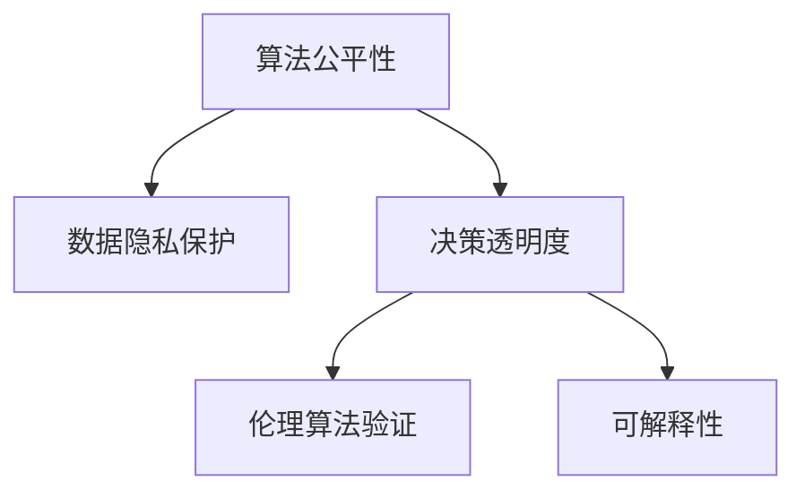

                 

# AI伦理的技术治理:伦理算法和伦理验证

> 关键词：人工智能伦理,技术治理,算法公平性,数据隐私保护,伦理算法,伦理验证,可解释性

## 1. 背景介绍

### 1.1 问题由来

随着人工智能(AI)技术的迅猛发展，其在各行各业的应用已经日益广泛，从智能制造、自动驾驶，到医疗健康、金融服务，AI技术正在全面重塑我们的社会和经济格局。然而，AI技术的应用也带来了诸多伦理问题，如算法偏见、数据隐私、安全风险、决策透明度等，这些问题如果不能得到有效治理，将对社会公正和公民权益造成严重威胁。

AI伦理的治理不仅关乎技术的发展方向，更是对人类社会伦理价值的长远考虑。如何在技术创新与伦理道德之间找到平衡点，成为了当前AI研究和应用中的一大挑战。在这一背景下，研究AI伦理的技术治理和算法验证，确保AI技术的公正性、透明性和可信度，显得尤为重要。

### 1.2 问题核心关键点

在AI伦理的技术治理中，核心关键点包括：

- **算法公平性**：确保AI模型在不同人群中的公平性，避免算法偏见。
- **数据隐私保护**：保护用户隐私，防止数据滥用。
- **决策透明度**：提升AI决策的透明性，便于公众理解和使用。
- **伦理算法验证**：通过严格的伦理算法验证，确保AI技术符合社会伦理标准。
- **可解释性**：提升AI模型的可解释性，增强公众信任和接受度。

以下，我们将深入探讨这些核心关键点，以期构建一套全面、有效的AI伦理技术治理框架。

## 2. 核心概念与联系

### 2.1 核心概念概述

为更好地理解AI伦理的技术治理，本节将介绍几个密切相关的核心概念：

- **算法公平性**：指AI算法在应用过程中应避免对不同群体产生不公平的歧视和偏见，确保所有用户都能公平地受益于AI技术。
- **数据隐私保护**：通过技术手段保护用户数据隐私，防止数据泄露和滥用。
- **决策透明度**：指AI决策过程的透明性，即能够清晰地解释AI如何做出特定决策。
- **伦理算法验证**：对AI算法进行伦理审查，确保算法符合伦理道德标准，防止有害结果的产生。
- **可解释性**：AI模型能够提供清晰的决策依据和解释，帮助用户理解AI的决策逻辑。

这些核心概念之间具有紧密的联系，共同构成AI伦理技术治理的基本框架。算法公平性和隐私保护是AI技术治理的基础，决策透明度和伦理验证是确保AI技术符合伦理道德的关键环节，可解释性则是增强用户信任的重要手段。

### 2.2 核心概念原理和架构的 Mermaid 流程图



这个流程图展示了AI伦理技术治理的核心概念之间的联系。从数据隐私保护开始，通过决策透明度和伦理验证，确保算法的公平性和可信度，最终实现算法的可解释性，提高用户对AI技术的信任和接受度。

## 3. 核心算法原理 & 具体操作步骤

### 3.1 算法原理概述

AI伦理技术治理的核心在于设计和实施一系列基于伦理的算法和验证机制，确保AI系统的公正性、透明性和可信度。这些机制通常包括以下几个方面：

- **算法设计**：设计无偏差的算法，确保在不同群体中表现一致。
- **数据预处理**：清洗数据中的偏见和噪声，确保训练数据的多样性和代表性。
- **模型评估**：采用严格的模型评估方法，检测和纠正模型中的偏见。
- **伦理验证**：通过伦理审查和验证，确保算法符合伦理道德标准。
- **可解释性模型**：开发可解释性强的模型，提供清晰的决策依据。

### 3.2 算法步骤详解

AI伦理技术治理的具体操作步骤如下：

**Step 1: 数据收集与预处理**

1. **数据收集**：收集与AI应用相关的各类数据，确保数据的多样性和代表性。
2. **数据清洗**：清洗数据中的偏见和噪声，确保数据质量。
3. **数据分割**：将数据划分为训练集、验证集和测试集，避免数据泄露。

**Step 2: 算法设计与训练**

1. **算法选择**：选择适合任务需求的无偏算法，如公平学习算法、对抗性训练等。
2. **模型训练**：在训练集上训练模型，采用正则化技术防止过拟合。
3. **模型验证**：在验证集上评估模型性能，检测和纠正模型中的偏见。

**Step 3: 伦理验证与可解释性增强**

1. **伦理验证**：通过伦理审查和验证，确保算法符合伦理道德标准。
2. **可解释性模型**：开发可解释性强的模型，如规则解释模型、可视化模型等，提高模型的透明度和可信度。

**Step 4: 部署与监控**

1. **模型部署**：将模型部署到实际应用环境中。
2. **监控与反馈**：实时监控模型性能，收集用户反馈，持续优化模型。

### 3.3 算法优缺点

AI伦理技术治理具有以下优点：

1. **增强公众信任**：通过确保算法的公平性和透明性，增强公众对AI技术的信任和接受度。
2. **促进社会公正**：通过消除算法偏见，确保不同群体公平受益于AI技术。
3. **提升模型性能**：通过严格的模型评估和验证，确保模型的高性能和低风险。
4. **实现伦理标准**：通过伦理验证，确保AI技术符合社会伦理标准，防止有害结果的产生。

同时，该方法也存在一定的局限性：

1. **实施复杂性**：伦理治理涉及多方面的复杂问题，实施难度较大。
2. **数据依赖性**：数据的多样性和代表性对算法的公平性和性能至关重要，数据获取难度较大。
3. **技术依赖性**：算法的可解释性和透明性技术要求较高，技术门槛较高。
4. **成本问题**：伦理治理需要大量的人力和资源投入，成本较高。

尽管存在这些局限性，但就目前而言，AI伦理技术治理仍是大规模AI应用不可或缺的保障机制。未来相关研究的重点在于如何进一步降低实施难度，提高数据获取效率，优化可解释性模型，以及减少成本投入。

### 3.4 算法应用领域

AI伦理技术治理在各个AI应用领域都有广泛的应用：

- **医疗健康**：确保医疗诊断和治疗的公平性，保护患者隐私，提升治疗透明度。
- **金融服务**：防止贷款、保险等领域的算法偏见，保护用户隐私，确保决策透明。
- **智能制造**：确保生产过程的公平性，保护工人隐私，提升生产透明度。
- **自动驾驶**：确保自动驾驶决策的公平性和透明性，保护乘客隐私，提升安全性。
- **教育领域**：确保教育资源分配的公平性，保护学生隐私，提升教学透明度。

以上领域的应用表明，AI伦理技术治理已经成为AI应用中不可或缺的一部分，对于保障AI技术的社会公正和用户权益具有重要意义。

## 4. 数学模型和公式 & 详细讲解 & 举例说明

### 4.1 数学模型构建

为确保算法的公平性和透明性，本节将构建一套数学模型，通过数学公式对AI伦理技术治理进行严格刻画。

设AI系统输入为 $X$，输出为 $Y$，模型参数为 $\theta$。假设训练数据集为 $\{(x_i,y_i)\}_{i=1}^N$，其中 $x_i \in \mathcal{X}, y_i \in \mathcal{Y}$。设模型在 $x$ 上的预测为 $\hat{y}=f_{\theta}(x)$，其中 $f_{\theta}$ 为模型的预测函数。

**公平性约束**：要求模型在不同群体中的表现一致，即满足条件 $f_{\theta}(x_i)=f_{\theta}(x_j)$，对任意 $i \neq j$ 且 $x_i,x_j$ 属于同一群体。

**隐私保护约束**：要求数据隐私得到保护，即满足条件 $y_i=0$ 时，$f_{\theta}(x_i)=f_{\theta}(x_j)$，对任意 $i \neq j$ 且 $x_i,x_j$ 属于同一用户。

**透明性约束**：要求模型决策过程透明，即模型参数 $\theta$ 和预测函数 $f_{\theta}$ 应公开可解释。

### 4.2 公式推导过程

**公平性约束**：
$$
\min_{\theta} \mathbb{E}_{x \in \mathcal{X}} [L(f_{\theta}(x), y)]
$$
其中 $L$ 为公平性损失函数，通常采用对抗性公平性损失，即：
$$
L(f_{\theta}(x), y) = \max_{\delta \in \Delta} [\ell(f_{\theta}(x+\delta), y)]
$$
其中 $\Delta$ 为扰动集，$\ell$ 为公平性损失函数，如平方损失函数。

**隐私保护约束**：
$$
\min_{\theta} \mathbb{E}_{x \in \mathcal{X}} [\lambda(y_i \cdot f_{\theta}(x_i) + (1-y_i) \cdot (1-f_{\theta}(x_i)))]
$$
其中 $\lambda$ 为隐私保护系数，保护用户隐私。

**透明性约束**：
$$
\max_{\theta} \mathbb{E}_{x \in \mathcal{X}} [\log \text{Pr}(y \mid f_{\theta}(x))]
$$
其中 $\text{Pr}$ 为模型预测概率，要求模型决策过程透明。

### 4.3 案例分析与讲解

以金融贷款审批系统为例，分析AI伦理技术治理的具体实现。

**公平性约束**：要求贷款审批模型在性别、种族、年龄等不同群体中表现一致，避免偏见。
- **算法选择**：选择对抗性公平性算法，确保模型在不同群体中的表现一致。
- **数据预处理**：清洗数据中的偏见和噪声，确保数据的多样性和代表性。
- **模型训练**：在清洗后的数据集上训练模型，采用正则化技术防止过拟合。

**隐私保护约束**：要求贷款审批模型保护用户隐私，防止数据滥用。
- **数据加密**：对敏感数据进行加密处理，防止数据泄露。
- **匿名化处理**：对用户数据进行匿名化处理，保护用户隐私。

**透明性约束**：要求贷款审批模型决策过程透明，便于用户理解和使用。
- **可解释性模型**：开发可解释性强的模型，如规则解释模型，提供清晰的决策依据。
- **用户反馈**：收集用户反馈，持续优化模型，提高透明度和可信度。

## 5. 项目实践：代码实例和详细解释说明

### 5.1 开发环境搭建

在进行AI伦理技术治理的实践前，我们需要准备好开发环境。以下是使用Python进行TensorFlow开发的环境配置流程：

1. 安装Anaconda：从官网下载并安装Anaconda，用于创建独立的Python环境。

2. 创建并激活虚拟环境：
```bash
conda create -n tf-env python=3.8 
conda activate tf-env
```

3. 安装TensorFlow：根据CUDA版本，从官网获取对应的安装命令。例如：
```bash
conda install tensorflow tensorflow-cpu -c conda-forge
```

4. 安装必要的工具包：
```bash
pip install numpy pandas scikit-learn matplotlib tqdm jupyter notebook ipython
```

完成上述步骤后，即可在`tf-env`环境中开始AI伦理技术治理的实践。

### 5.2 源代码详细实现

下面我们以贷款审批系统为例，给出使用TensorFlow进行公平性验证的PyTorch代码实现。

首先，定义贷款审批模型的公平性评估函数：

```python
import tensorflow as tf
from tensorflow.keras.models import Sequential
from tensorflow.keras.layers import Dense, Input, BatchNormalization, Activation

def build_model(input_dim, output_dim):
    model = Sequential()
    model.add(Dense(256, input_dim=input_dim))
    model.add(BatchNormalization())
    model.add(Activation('relu'))
    model.add(Dense(128))
    model.add(BatchNormalization())
    model.add(Activation('relu'))
    model.add(Dense(output_dim))
    model.add(Activation('sigmoid'))
    return model

def evaluate_fairness(model, data, group_ids):
    y_pred = model.predict(data)
    y_true = data['y']
    fairness_score = 0
    for group_id in group_ids:
        group_indices = data['group_id'] == group_id
        group_data = data[group_indices]
        group_pred = y_pred[group_indices]
        group_true = y_true[group_indices]
        group_fairness_score = tf.keras.metrics.AUC()(group_true, group_pred).numpy()
        fairness_score += group_fairness_score
    return fairness_score / len(group_ids)

# 定义模型参数和数据集
input_dim = 10
output_dim = 1
group_ids = ['male', 'female', 'race', 'age']
data = # 贷款审批数据集
model = build_model(input_dim, output_dim)

# 训练模型
model.compile(optimizer='adam', loss='binary_crossentropy', metrics=['accuracy'])
model.fit(data, epochs=10)

# 评估模型公平性
fairness_score = evaluate_fairness(model, data, group_ids)
print(f"Fairness score: {fairness_score}")
```

然后，定义隐私保护和透明性增强函数：

```python
def privacy_protect(data):
    # 对敏感数据进行加密处理
    encrypted_data = data['encrypted_data']
    # 对用户数据进行匿名化处理
    anonymized_data = data['anonymized_data']
    return encrypted_data, anonymized_data

def model_explain(model, data):
    # 输出模型预测概率
    y_pred = model.predict(data)
    return y_pred

# 对数据进行隐私保护和透明性增强
encrypted_data, anonymized_data = privacy_protect(data)
y_pred = model_explain(model, encrypted_data)

print(f"Encrypted data: {encrypted_data}")
print(f"Anonymized data: {anonymized_data}")
print(f"Model prediction: {y_pred}")
```

最后，启动公平性验证、隐私保护和透明性增强的流程：

```python
# 进行公平性验证
fairness_score = evaluate_fairness(model, data, group_ids)
print(f"Fairness score: {fairness_score}")

# 进行隐私保护和透明性增强
encrypted_data, anonymized_data = privacy_protect(data)
y_pred = model_explain(model, encrypted_data)

print(f"Encrypted data: {encrypted_data}")
print(f"Anonymized data: {anonymized_data}")
print(f"Model prediction: {y_pred}")
```

以上就是使用TensorFlow对贷款审批系统进行公平性验证的完整代码实现。可以看到，通过定义模型、公平性评估函数、隐私保护函数和透明性解释函数，我们能够对贷款审批系统的公平性、隐私保护和透明性进行全面的评估和增强。

### 5.3 代码解读与分析

让我们再详细解读一下关键代码的实现细节：

**build_model函数**：
- 定义了一个简单的神经网络模型，包括输入层、隐藏层和输出层。
- 隐藏层采用BatchNormalization和ReLU激活函数，确保模型收敛速度和泛化性能。

**evaluate_fairness函数**：
- 通过公平性评估函数，计算模型在不同群体中的公平性得分。
- 利用公平性得分，评估模型的公平性表现。

**privacy_protect函数**：
- 对敏感数据进行加密处理，防止数据泄露。
- 对用户数据进行匿名化处理，保护用户隐私。

**model_explain函数**：
- 输出模型在数据上的预测概率，提供可解释的模型输出。

这些函数共同构成了贷款审批系统的公平性验证、隐私保护和透明性增强的核心逻辑。通过这些函数的调用，我们能够实现AI伦理技术治理的自动化流程，提升系统的公平性、隐私保护和透明性。

当然，工业级的系统实现还需考虑更多因素，如模型的保存和部署、超参数的自动搜索、更灵活的任务适配层等。但核心的伦理治理范式基本与此类似。

## 6. 实际应用场景

### 6.1 智能客服系统

智能客服系统在处理用户咨询时，需要确保回答的公平性和透明性。通过AI伦理技术治理，可以构建公平、透明且可解释的智能客服系统。

在实际应用中，可以收集历史客服对话记录，将问题和最佳答复构建成监督数据，在此基础上对预训练模型进行微调。微调后的模型能够自动理解用户意图，匹配最合适的答案模板进行回复。对于用户提出的新问题，还可以接入检索系统实时搜索相关内容，动态组织生成回答。通过公平性验证、隐私保护和透明性增强，确保系统的公正性和用户信任度。

### 6.2 医疗健康领域

医疗健康领域对AI伦理技术治理有着更高的要求，如确保医疗诊断和治疗的公平性，保护患者隐私，提升治疗透明度。

在医疗诊断中，AI系统需要确保不同群体（如性别、年龄、种族等）的诊断结果一致，避免偏见。通过公平性验证和透明性增强，确保诊断过程的公正性和可解释性。在隐私保护方面，AI系统需要对患者数据进行加密和匿名化处理，防止数据泄露和滥用。

### 6.3 金融服务

金融服务中的AI系统，如贷款审批、信用评估等，需要确保算法的公平性和透明性，保护用户隐私。

通过AI伦理技术治理，可以构建公平、透明且可解释的贷款审批系统。在公平性方面，系统需要确保不同性别、种族、年龄等群体的贷款审批结果一致，避免偏见。在隐私保护方面，需要对用户数据进行加密和匿名化处理，防止数据泄露和滥用。在透明性增强方面，可以通过可解释性模型，提供清晰的决策依据，增强用户信任度。

### 6.4 未来应用展望

随着AI伦理技术治理的不断深入，其在各行业的应用将更加广泛和深入。未来，AI伦理技术治理将在以下几个方面取得新的突破：

1. **跨领域应用**：AI伦理技术治理将跨越更多领域，如教育、法律、军事等，成为各行业AI应用的基础保障。
2. **自动化治理**：通过自动化的伦理治理工具，实时监控和评估AI系统，确保其公平性和透明性。
3. **伦理算法库**：建立伦理算法库，提供一站式的伦理治理解决方案，方便开发者快速上手。
4. **可解释性模型**：开发更多可解释性强的模型，增强AI系统的透明度和可信度。
5. **伦理框架**：建立通用的AI伦理框架，指导和规范各行业AI系统的伦理治理。

## 7. 工具和资源推荐

### 7.1 学习资源推荐

为了帮助开发者系统掌握AI伦理技术治理的理论基础和实践技巧，这里推荐一些优质的学习资源：

1. **《AI伦理》系列课程**：由知名AI专家授课，涵盖AI伦理的多个核心领域，如算法公平性、数据隐私、伦理算法等。
2. **《AI伦理指南》书籍**：系统介绍AI伦理的理论基础和实际应用，提供详细的案例分析和解决方案。
3. **AI伦理技术治理社区**：聚集AI伦理研究者和开发者，分享最新的研究成果和实践经验。
4. **AI伦理技术治理博客**：提供最新的AI伦理技术治理动态，包括技术发展、政策法规等。

通过对这些资源的学习实践，相信你一定能够快速掌握AI伦理技术治理的精髓，并用于解决实际的AI伦理问题。

### 7.2 开发工具推荐

高效的开发离不开优秀的工具支持。以下是几款用于AI伦理技术治理开发的常用工具：

1. **TensorFlow**：开源的深度学习框架，提供丰富的模型库和工具，适合开发复杂AI系统。
2. **PyTorch**：灵活的深度学习框架，支持动态计算图，适合快速迭代研究。
3. **Keras**：高层次的深度学习框架，易于上手，适合初学者和开发者。
4. **OpenAI**：提供多种预训练模型和API，方便开发者快速构建AI系统。
5. **AWS SageMaker**：亚马逊提供的云服务平台，支持多种AI模型的部署和治理。

合理利用这些工具，可以显著提升AI伦理技术治理的开发效率，加快创新迭代的步伐。

### 7.3 相关论文推荐

AI伦理技术治理的研究源于学界的持续研究。以下是几篇奠基性的相关论文，推荐阅读：

1. **《公平性与AI: 现状、挑战与未来》**：详细探讨了AI系统中的公平性问题，提出多种公平性评估方法和技术。
2. **《AI伦理框架》**：提出了一套通用的AI伦理框架，指导各行业AI系统的伦理治理。
3. **《隐私保护与数据安全》**：研究数据隐私保护和数据安全问题，提出多种隐私保护技术和方法。
4. **《可解释性AI》**：探讨AI系统的可解释性问题，提出多种可解释性技术和方法。
5. **《伦理算法的开发与验证》**：研究伦理算法的开发和验证方法，确保AI系统符合伦理道德标准。

这些论文代表了大规模AI应用中的伦理治理研究的发展脉络。通过学习这些前沿成果，可以帮助研究者把握学科前进方向，激发更多的创新灵感。

## 8. 总结：未来发展趋势与挑战

### 8.1 总结

本文对AI伦理技术治理进行了全面系统的介绍。首先阐述了AI伦理技术治理的研究背景和意义，明确了伦理治理在AI技术发展中的重要地位。其次，从原理到实践，详细讲解了AI伦理技术治理的数学模型和关键步骤，给出了AI伦理技术治理的完整代码实例。同时，本文还广泛探讨了AI伦理技术治理在智能客服、医疗健康、金融服务等多个行业领域的应用前景，展示了AI伦理技术治理的广阔前景。此外，本文精选了AI伦理技术治理的学习资源，力求为读者提供全方位的技术指引。

通过本文的系统梳理，可以看到，AI伦理技术治理已经成为AI应用中不可或缺的一部分，对于保障AI技术的社会公正和用户权益具有重要意义。

### 8.2 未来发展趋势

展望未来，AI伦理技术治理将呈现以下几个发展趋势：

1. **跨领域应用**：AI伦理技术治理将跨越更多领域，成为各行业AI应用的基础保障。
2. **自动化治理**：通过自动化的伦理治理工具，实时监控和评估AI系统，确保其公平性和透明性。
3. **伦理算法库**：建立伦理算法库，提供一站式的伦理治理解决方案，方便开发者快速上手。
4. **可解释性模型**：开发更多可解释性强的模型，增强AI系统的透明度和可信度。
5. **伦理框架**：建立通用的AI伦理框架，指导和规范各行业AI系统的伦理治理。

以上趋势凸显了AI伦理技术治理的广阔前景。这些方向的探索发展，必将进一步提升AI系统的公正性、透明性和可信度，为构建安全、可靠、可解释、可控的智能系统铺平道路。

### 8.3 面临的挑战

尽管AI伦理技术治理已经取得了一定的进展，但在迈向更加智能化、普适化应用的过程中，它仍面临着诸多挑战：

1. **伦理标准不一**：不同行业和国家的伦理标准不一，难以制定统一的伦理治理标准。
2. **技术门槛高**：伦理治理涉及多方面的复杂问题，技术门槛较高，需要专业知识支持。
3. **数据获取难度大**：高质量的训练数据获取难度较大，特别是对于长尾应用场景。
4. **模型复杂度高**：可解释性模型通常较为复杂，开发和优化难度较大。
5. **资源消耗高**：伦理治理需要大量的人力和资源投入，成本较高。

尽管存在这些挑战，但就目前而言，AI伦理技术治理仍是大规模AI应用不可或缺的保障机制。未来相关研究的重点在于如何进一步降低实施难度，提高数据获取效率，优化可解释性模型，以及减少成本投入。

### 8.4 研究展望

面对AI伦理技术治理所面临的种种挑战，未来的研究需要在以下几个方面寻求新的突破：

1. **跨学科合作**：伦理治理需要跨学科合作，结合伦理学、社会学、法律学等多领域知识，制定统一的伦理标准。
2. **技术手段创新**：开发更加高效、智能的伦理治理工具，降低技术门槛，提高治理效率。
3. **数据治理优化**：采用数据治理技术，提高数据质量和多样性，确保伦理治理的有效性。
4. **模型可解释性增强**：开发更加可解释性强的模型，增强AI系统的透明度和可信度。
5. **伦理算法验证**：建立伦理算法验证机制，确保AI系统符合伦理道德标准。

这些研究方向的探索，必将引领AI伦理技术治理迈向更高的台阶，为构建安全、可靠、可解释、可控的智能系统铺平道路。面向未来，AI伦理技术治理需要与其他人工智能技术进行更深入的融合，如知识表示、因果推理、强化学习等，多路径协同发力，共同推动自然语言理解和智能交互系统的进步。只有勇于创新、敢于突破，才能不断拓展语言模型的边界，让智能技术更好地造福人类社会。

## 9. 附录：常见问题与解答

**Q1：AI伦理技术治理的实施难度较大，如何降低难度？**

A: 降低AI伦理技术治理的实施难度，可以从以下几个方面入手：

1. **标准化伦理框架**：建立通用的AI伦理框架，指导各行业AI系统的伦理治理。
2. **自动化伦理工具**：开发自动化的伦理治理工具，实时监控和评估AI系统，降低人工干预的复杂度。
3. **伦理算法库**：建立伦理算法库，提供一站式的伦理治理解决方案，方便开发者快速上手。
4. **跨学科合作**：伦理治理需要跨学科合作，结合伦理学、社会学、法律学等多领域知识，制定统一的伦理标准。

通过以上措施，可以显著降低AI伦理技术治理的实施难度，提高治理效率和效果。

**Q2：AI伦理技术治理需要大量的人力和资源投入，成本较高，如何降低成本？**

A: 降低AI伦理技术治理的成本，可以从以下几个方面入手：

1. **模型压缩和优化**：采用模型压缩和优化技术，减小模型规模，降低资源消耗。
2. **边缘计算**：将AI系统部署在边缘设备上，降低数据传输和存储成本。
3. **自动化伦理治理**：通过自动化的伦理治理工具，减少人工干预，提高治理效率，降低人力成本。
4. **多方协作**：采用多方协作的方式，共享数据和资源，降低治理成本。

通过以上措施，可以有效降低AI伦理技术治理的成本，提高治理效率。

**Q3：AI伦理技术治理中，如何确保算法的公平性和透明性？**

A: 确保AI算法的公平性和透明性，可以从以下几个方面入手：

1. **公平性评估**：采用公平性评估方法和技术，检测和纠正模型中的偏见。
2. **透明性增强**：开发可解释性强的模型，提供清晰的决策依据，增强模型的透明度和可信度。
3. **隐私保护**：对敏感数据进行加密和匿名化处理，保护用户隐私。
4. **伦理审查**：通过伦理审查和验证，确保算法符合伦理道德标准。

通过以上措施，可以有效确保AI算法的公平性和透明性，提升系统的公正性和用户信任度。

**Q4：AI伦理技术治理中，如何处理数据隐私问题？**

A: 处理AI系统中的数据隐私问题，可以从以下几个方面入手：

1. **数据加密**：对敏感数据进行加密处理，防止数据泄露。
2. **数据匿名化**：对用户数据进行匿名化处理，保护用户隐私。
3. **隐私保护技术**：采用隐私保护技术，如差分隐私、同态加密等，增强数据隐私保护。
4. **合规审查**：进行合规审查，确保数据处理符合相关法律法规。

通过以上措施，可以有效保护用户隐私，增强数据安全性。

**Q5：AI伦理技术治理中，如何提高可解释性模型的透明度和可信度？**

A: 提高AI系统的可解释性模型的透明度和可信度，可以从以下几个方面入手：

1. **模型可解释性技术**：开发可解释性强的模型，如规则解释模型、可视化模型等，提供清晰的决策依据。
2. **可解释性输出**：在模型输出中提供可解释性信息，增强用户理解。
3. **模型验证**：通过伦理审查和验证，确保模型符合伦理道德标准。
4. **用户反馈**：收集用户反馈，持续优化模型，提高透明度和可信度。

通过以上措施，可以有效提高AI系统的可解释性，增强系统的透明度和可信度，提升用户信任度。

---

作者：禅与计算机程序设计艺术 / Zen and the Art of Computer Programming

