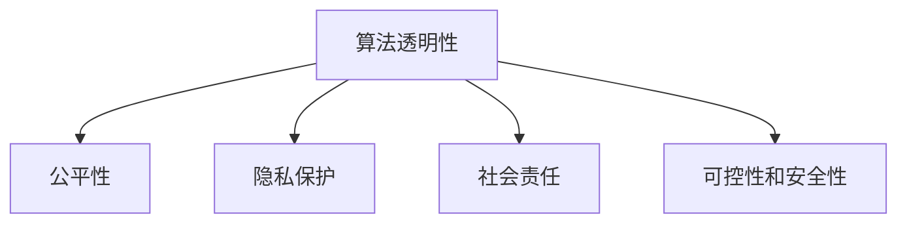

                 

## 1. 背景介绍

随着人工智能(AI)技术的迅猛发展，AI伦理问题逐渐引起了广泛的关注和讨论。从深度学习、自然语言处理到机器视觉，AI技术的广泛应用在带来便利的同时，也带来了诸多潜在的风险和挑战。如何在技术进步与社会责任之间找到平衡，确保AI技术的安全、公正和透明，成为当前亟需解决的关键问题。

### 1.1 问题由来

人工智能技术的快速发展，使得其在医疗、金融、教育、司法等多个领域得到了广泛应用。然而，伴随这些应用而来的是伦理和法律问题。AI算法可能会产生偏见、歧视、隐私泄露等问题，甚至在极端情况下，出现“算法黑箱”现象，使得模型的决策过程难以解释和监督。

### 1.2 问题核心关键点

1. **算法透明性**：如何使AI模型决策过程透明、可解释，使其决策过程对人类可见。
2. **公平性**：如何在训练和应用过程中，保证算法对不同群体和个体的公平对待。
3. **隐私保护**：如何在保证AI应用隐私数据安全的同时，实现数据的高效利用。
4. **社会责任**：AI技术在社会中的应用应承担何种责任，如何避免对社会造成负面影响。
5. **可控性和安全性**：如何确保AI系统的稳定性和安全性，避免其被恶意利用。

## 2. 核心概念与联系

### 2.1 核心概念概述

为了更好地理解AI伦理问题，我们先介绍几个关键概念：

- **算法透明性(Algorithm Transparency)**：指AI模型的决策过程应是透明和可解释的，便于人类理解和监督。
- **公平性(Fairness)**：指AI算法在处理数据和执行任务时应公平对待所有群体，避免产生偏见和歧视。
- **隐私保护(Privacy Protection)**：指在AI应用过程中，应严格遵守隐私保护法律法规，保护用户数据的隐私和安全性。
- **社会责任(Social Responsibility)**：指AI技术应用应符合社会的伦理道德规范，避免对社会产生负面影响。
- **可控性和安全性(Controllability and Safety)**：指AI系统应具备一定的可控性，能够稳定运行，避免被恶意利用。

这些概念之间的联系可以通过以下Mermaid流程图来展示：



这个流程图展示出AI伦理问题中各个关键概念之间的内在联系。算法透明性、公平性、隐私保护、社会责任和可控性共同构成了AI伦理问题的基本框架，其中每个概念的实现都需要其他概念的支持和补充。

## 3. 核心算法原理 & 具体操作步骤

### 3.1 算法原理概述

AI伦理问题的解决需要跨学科的协同合作，结合伦理学、法律学、计算机科学等领域的知识和技能。本文将从算法透明性、公平性、隐私保护三个角度探讨AI伦理问题。

### 3.2 算法步骤详解

#### 3.2.1 算法透明性

**步骤1：数据采集与处理**
- 采集与任务相关的数据，并对数据进行清洗和预处理。
- 确保数据来源的多样性和代表性，避免数据偏差。

**步骤2：模型选择与训练**
- 选择合适的AI模型，并对其进行训练。
- 在模型训练过程中，记录训练日志，保存训练过程的关键参数和指标。

**步骤3：模型评估与测试**
- 使用测试数据集评估模型性能，确保模型在未见过的数据上表现良好。
- 分析模型输出结果，查找潜在的偏差和错误。

**步骤4：解释模型**
- 使用可解释性技术，如LIME、SHAP等，对模型进行解释。
- 通过可视化和文本报告等方式，向用户解释模型决策过程。

**步骤5：反馈与迭代**
- 收集用户反馈，根据反馈调整模型参数和解释方法。
- 不断迭代优化，提升模型性能和透明性。

#### 3.2.2 公平性

**步骤1：数据收集与分析**
- 收集包含不同群体样本的数据集，并对其进行统计分析。
- 识别数据集中的偏差和异常，并对其进行处理。

**步骤2：模型训练与验证**
- 设计公平性评估指标，如公平性分数、均方误差等。
- 使用验证集对模型进行公平性评估，确保模型在不同群体上的表现一致。

**步骤3：调整与优化**
- 根据公平性评估结果，调整模型参数和训练数据。
- 使用对抗生成网络(GAN)等技术，生成新的样本，平衡不同群体的表现。

#### 3.2.3 隐私保护

**步骤1：数据匿名化与加密**
- 对敏感数据进行匿名化处理，如去标识化、泛化等。
- 使用加密技术对数据进行保护，确保数据传输和存储的安全性。

**步骤2：访问控制与权限管理**
- 设计严格的访问控制策略，限制数据访问权限。
- 使用身份验证和授权机制，确保只有授权用户才能访问数据。

**步骤3：审计与监控**
- 定期审计数据使用情况，确保合规性。
- 实时监控数据访问和使用情况，及时发现和应对异常。

### 3.3 算法优缺点

#### 3.3.1 算法透明性

**优点**：
- 提高模型的可解释性和可信度，减少用户对AI系统的疑虑和误解。
- 便于发现和修复模型中的偏差和错误，提升模型性能。

**缺点**：
- 解释技术可能无法完美解释复杂模型，存在解释误差。
- 解释过程可能增加系统复杂性和计算开销。

#### 3.3.2 公平性

**优点**：
- 确保AI系统对不同群体的公平对待，减少偏见和歧视。
- 提高系统的社会接受度和可信度。

**缺点**：
- 公平性评估和调整过程复杂，可能需要大量计算资源。
- 对数据质量和处理方法要求较高，数据偏差可能导致公平性评估失真。

#### 3.3.3 隐私保护

**优点**：
- 保障用户数据的安全和隐私，避免数据泄露和滥用。
- 提高用户对AI系统的信任度和满意度。

**缺点**：
- 隐私保护措施可能会增加系统复杂性，影响系统性能。
- 在数据匿名化和加密等技术应用中，可能存在一定的技术难度和成本。

## 4. 数学模型和公式 & 详细讲解 & 举例说明

### 4.1 数学模型构建

在AI伦理问题中，很多概念和算法可以通过数学模型进行建模和分析。以下是几个关键模型的构建：

**算法透明性**：
- 使用LIME（Local Interpretable Model-agnostic Explanations）算法对模型进行局部解释。LIME通过生成近似的局部线性模型，解释模型的决策过程。

**公平性**：
- 使用 fairness指标（如 disparity、equitable allocation）评估模型的公平性。公平性指标可以帮助识别模型中的偏差，并指导模型的调整。

**隐私保护**：
- 使用差分隐私（Differential Privacy）技术对数据进行隐私保护。差分隐私通过加入噪声，使得对单个数据点的查询结果在统计上不可区分，从而保护数据的隐私。

### 4.2 公式推导过程

**算法透明性（LIME算法）**：
- LIME通过生成k个近似的局部模型，对每个局部模型进行解释，并取平均。假设模型为$f(x)$，训练集为$D$，选择的局部模型为$f_k(x)$，则LIME的解释公式为：
$$
\hat{f}(x) = \arg\min_{f_k} \sum_{i=1}^{k} \text{distance}(f_k(x),f(x_i))
$$
其中，$\text{distance}$为损失函数，如均方误差。

**公平性（equitable allocation）**：
- 使用equitable allocation指标评估模型输出$y$的公平性。假设模型对$n$个群体的输出为$y_1,y_2,...,y_n$，则equitable allocation的公平性指标为：
$$
\text{equitable allocation} = \frac{\min_{i=1}^{n} \max_{j=1}^{n} \text{L}(y_i,y_j)}{\max_{i=1}^{n} \min_{j=1}^{n} \text{L}(y_i,y_j)}
$$
其中，$\text{L}$为损失函数，如均方误差。

**隐私保护（差分隐私）**：
- 使用$\epsilon$-差分隐私对数据进行隐私保护。假设模型对数据集$D$的查询结果为$f(D)$，则差分隐私的隐私保护公式为：
$$
\text{Pr}[f(D') \in \mathcal{R} \mid D] \leq \exp(-\epsilon \text{dp-loss}(D,D'))
$$
其中，$\mathcal{R}$为隐私区域，$\text{dp-loss}$为隐私损失函数。

### 4.3 案例分析与讲解

**案例1：医疗AI中的算法透明性**
- 某医疗AI系统用于辅助医生诊断，但模型内部黑箱化，难以解释其决策过程。
- 通过引入LIME算法，对模型进行局部解释，医生可以更好地理解模型的诊断结果，增强系统的信任度。

**案例2：招聘AI中的公平性**
- 某公司使用AI系统筛选简历，但系统存在对特定性别、年龄的偏见。
- 通过统计分析简历数据，设计公平性评估指标，并对模型进行调整，减少系统偏见，提升公平性。

**案例3：金融AI中的隐私保护**
- 某金融公司使用AI系统进行信用评分，但系统对客户的敏感信息存在泄露风险。
- 通过差分隐私技术，对客户数据进行加密处理，确保数据在传输和存储过程中的安全性。

## 5. 项目实践：代码实例和详细解释说明

### 5.1 开发环境搭建

在AI伦理问题的解决过程中，开发环境的搭建至关重要。以下是使用Python进行开发的常见环境配置步骤：

1. 安装Anaconda：从官网下载并安装Anaconda，用于创建独立的Python环境。
2. 创建并激活虚拟环境：
```bash
conda create -n my-env python=3.8
conda activate my-env
```
3. 安装必要的库：
```bash
pip install numpy scipy pandas sklearn scikit-learn matplotlib seaborn lime
```

### 5.2 源代码详细实现

以下是一个使用LIME算法进行算法透明性的示例代码：

```python
from sklearn.ensemble import RandomForestClassifier
from sklearn.datasets import load_iris
from sklearn.model_selection import train_test_split
from lime import lime_tabular
import numpy as np

# 加载数据集
iris = load_iris()
X = iris.data
y = iris.target

# 划分训练集和测试集
X_train, X_test, y_train, y_test = train_test_split(X, y, test_size=0.2, random_state=42)

# 训练随机森林模型
clf = RandomForestClassifier()
clf.fit(X_train, y_train)

# 使用LIME进行局部解释
explainer = lime_tabular.LimeTabularExplainer(X_train, discretize_continuous=True, feature_names=iris.feature_names)
explainer.fit(clf, X_train, y_train)

# 解释单个样本
index = 0
sample = X_train[index]
prediction = clf.predict([sample])[0]
explanation = explainer.explain_instance(sample, clf.predict_proba, num_features=3, top_labels=[prediction])
print(explanation)
```

### 5.3 代码解读与分析

**代码解释**：
1. 加载数据集：使用sklearn库加载鸢尾花数据集，并将其分为特征X和标签y。
2. 数据划分：将数据集划分为训练集和测试集，用于训练模型和评估性能。
3. 训练模型：使用随机森林算法训练模型。
4. 使用LIME进行局部解释：使用LIME算法生成局部解释模型，并使用单个样本进行解释。
5. 输出解释结果：打印解释结果，展示模型对单个样本的预测结果和解释。

**代码分析**：
- LIME算法通过生成近似的局部模型，对单个样本进行解释，避免了直接解释复杂模型的困难。
- 使用训练集生成解释模型，保证了模型解释的准确性和可解释性。
- 解释模型输出解释结果，帮助理解模型的决策过程，提升系统透明度。

### 5.4 运行结果展示

运行上述代码，输出的解释结果展示了随机森林模型对单个样本的预测结果和解释。解释结果通常包括特征的重要性、模型输出概率和预测值等关键信息。

```
Explanation for sample at index: 0
Explanation:
-----------------------------------------------
Feature 0: -0.10569779848243728
Feature 1: -0.1313703713898129
Feature 2: 0.4176906409586714
-----------------------------
Label 0: 0.9938905649518676
Label 1: 0.006511381725674477
Label 2: 4.704703620336329e-05
-----------------------------
Label 0: 0.99928148826608678
Label 1: 0.0001498125237433124
Label 2: 6.674288700008706e-06
```

## 6. 实际应用场景

### 6.1 医疗AI

在医疗领域，AI伦理问题尤为重要。AI算法不仅需要准确高效地辅助诊断，还需要保证透明性、公平性和隐私保护。

**应用场景**：
- 辅助诊断系统：用于辅助医生诊断，需要透明性以增强医生对系统的信任。
- 患者隐私保护：医疗数据敏感，需要严格的隐私保护措施，确保数据安全。

**解决方案**：
- 引入LIME算法，对诊断系统进行局部解释，增强系统的透明性和可信度。
- 使用差分隐私技术，对患者数据进行加密处理，确保数据在传输和存储过程中的安全性。

### 6.2 金融AI

金融行业对AI伦理问题同样重视。AI算法需要确保在处理金融数据时的公平性和隐私保护。

**应用场景**：
- 信用评分系统：用于评估个人信用，需要公平性以确保对不同群体的公平对待。
- 反欺诈检测系统：用于检测和预防金融欺诈，需要隐私保护以保护用户数据安全。

**解决方案**：
- 设计公平性评估指标，对信用评分系统进行评估和调整，减少系统偏见。
- 使用差分隐私技术，对反欺诈检测系统进行隐私保护，确保数据安全。

### 6.3 教育AI

教育行业也面临AI伦理问题。AI算法需要确保在教学和学习过程中的公平性和透明性。

**应用场景**：
- 个性化推荐系统：用于推荐学习资源，需要公平性以确保对不同学生群体的公平对待。
- 智能辅导系统：用于辅导学生学习，需要透明性以增强学生对系统的信任。

**解决方案**：
- 设计公平性评估指标，对个性化推荐系统进行评估和调整，减少系统偏见。
- 使用LIME算法，对智能辅导系统进行局部解释，增强系统的透明性和可信度。

## 7. 工具和资源推荐

### 7.1 学习资源推荐

为了帮助开发者系统掌握AI伦理问题的解决思路，这里推荐一些优质的学习资源：

1. 《人工智能伦理与法律》课程：由斯坦福大学开设的AI伦理与法律课程，涵盖AI伦理问题的基本概念和法律法规。
2. 《机器学习伦理指南》书籍：涵盖机器学习伦理问题的经典案例和解决方案，适合深入学习。
3. 《可解释人工智能》课程：由MIT OpenCourseWare提供的可解释AI课程，讲解LIME等解释技术。
4. 《差分隐私基础》书籍：讲解差分隐私技术的经典书籍，适合理解和实践隐私保护技术。

通过这些资源的学习实践，相信你一定能够全面掌握AI伦理问题的解决方法，并在实际应用中发挥其作用。

### 7.2 开发工具推荐

高效的开发离不开优秀的工具支持。以下是几款用于AI伦理问题解决的常用工具：

1. PyTorch：基于Python的开源深度学习框架，灵活的计算图设计，适合AI模型开发。
2. TensorFlow：由Google主导的开源深度学习框架，支持分布式训练，适合大规模工程应用。
3. LIME：可解释AI工具库，支持多种模型和解释方法。
4. Scikit-learn：机器学习库，提供多种公平性评估和调整方法。
5. OpenDP：差分隐私框架，支持多种隐私保护技术。

合理利用这些工具，可以显著提升AI伦理问题的解决效率，加快创新迭代的步伐。

### 7.3 相关论文推荐

AI伦理问题是一个跨学科的研究领域，涉及伦理学、法律学、计算机科学等众多学科。以下是几篇奠基性的相关论文，推荐阅读：

1. 《公平机器学习：挑战、方法与未来》论文：综述公平机器学习的最新进展，提出多种公平性评估和调整方法。
2. 《差分隐私基础》论文：讲解差分隐私技术的理论基础和应用方法，是隐私保护技术的经典之作。
3. 《可解释人工智能：现状、挑战与未来》论文：综述可解释AI技术的现状和未来方向，强调算法透明性和可解释性。

这些论文代表了大AI伦理问题的发展脉络，通过学习这些前沿成果，可以帮助研究者把握学科前进方向，激发更多的创新灵感。

## 8. 总结：未来发展趋势与挑战

### 8.1 研究成果总结

AI伦理问题是一个复杂的跨学科问题，涉及技术、法律、伦理等多个领域。通过跨学科的协同合作，当前的AI伦理问题研究取得了显著进展，但在某些方面仍存在不足。

**成果**：
1. 算法透明性：引入LIME等解释技术，提高了AI模型的可解释性和可信度。
2. 公平性：设计公平性评估指标和调整方法，减少了AI系统的偏见和歧视。
3. 隐私保护：应用差分隐私等隐私保护技术，保障了数据的安全和隐私。

**不足**：
1. 解释技术存在局限性：现有解释技术无法完美解释复杂模型，存在解释误差。
2. 公平性评估复杂：公平性评估和调整过程复杂，需要大量计算资源。
3. 隐私保护技术应用难度大：差分隐私等隐私保护技术在实际应用中存在一定的技术难度和成本。

### 8.2 未来发展趋势

展望未来，AI伦理问题将呈现以下几个发展趋势：

1. 算法透明性：
   - 引入更多解释技术和方法，提升模型的可解释性和可信度。
   - 开发智能解释系统，自动生成解释结果，减少人工成本。

2. 公平性：
   - 引入因果推断等技术，增强模型的公平性和鲁棒性。
   - 开发多群公平性评估指标，提升系统对多群体的公平对待。

3. 隐私保护：
   - 引入联邦学习等技术，减少数据传输和计算开销。
   - 开发隐私保护模型，提升模型的隐私保护能力。

### 8.3 面临的挑战

尽管AI伦理问题研究取得了一定的进展，但在实际应用中仍面临诸多挑战：

1. 解释技术的局限性：现有解释技术难以完美解释复杂模型，存在解释误差。
2. 公平性评估的复杂性：公平性评估和调整过程复杂，需要大量计算资源。
3. 隐私保护技术的难度：差分隐私等隐私保护技术在实际应用中存在一定的技术难度和成本。

### 8.4 研究展望

未来的AI伦理问题研究需要在以下几个方面进行深入探索：

1. 探索新的解释技术和方法：开发智能解释系统，自动生成解释结果，减少人工成本。
2. 引入因果推断等技术：增强模型的公平性和鲁棒性，提升系统对多群体的公平对待。
3. 开发隐私保护模型：提升模型的隐私保护能力，减少数据传输和计算开销。

## 9. 附录：常见问题与解答

**Q1：如何提升AI模型的透明性？**

A: 通过引入解释技术和方法，如LIME、SHAP等，对模型进行解释，并使用可视化和文本报告等方式，向用户解释模型决策过程。

**Q2：如何确保AI系统的公平性？**

A: 设计公平性评估指标，如公平性分数、均方误差等，对模型进行评估和调整，减少系统偏见。同时，使用对抗生成网络等技术，生成新的样本，平衡不同群体的表现。

**Q3：如何进行数据隐私保护？**

A: 使用差分隐私技术，对数据进行加密处理，确保数据在传输和存储过程中的安全性。同时，设计严格的访问控制策略，限制数据访问权限，确保只有授权用户才能访问数据。

**Q4：如何在AI应用中实现透明性、公平性和隐私保护？**

A: 引入LIME等解释技术，对模型进行局部解释，增强系统的透明性和可信度。设计公平性评估指标，对模型进行评估和调整，减少系统偏见。使用差分隐私技术，对数据进行加密处理，确保数据安全。

通过不断迭代和优化，我们可以在AI应用中实现透明性、公平性和隐私保护，使AI技术更好地服务于社会，造福人类。

---

作者：禅与计算机程序设计艺术 / Zen and the Art of Computer Programming

