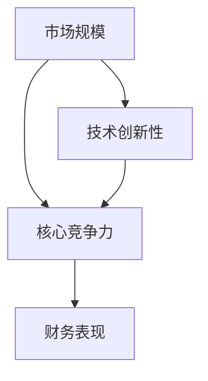

                 

# AI创业的投资逻辑：Lepton AI的估值模型

> 关键词：人工智能创业, Lepton AI, 估值模型, 投资逻辑, AI创业评估

## 1. 背景介绍

### 1.1 问题由来
近年来，人工智能(AI)技术迅猛发展，已经成为各行业数字化转型的核心驱动力。AI创业项目层出不穷，如何评估其价值、吸引资本的关注和投入，成为了投资界的一大难题。Lepton AI作为AI创业领域的佼佼者，其估值模型和投资逻辑具有典型代表意义。

### 1.2 问题核心关键点
Lepton AI的估值模型基于多种因素，包括市场规模、技术创新性、核心竞争力、财务表现等。其核心思想是将公司视为一个可量化的资产，通过综合考虑上述因素，计算出公司价值。本文将详细介绍Lepton AI的估值模型，分析其投资逻辑，并探讨其在AI创业领域的应用。

## 2. 核心概念与联系

### 2.1 核心概念概述

为更好地理解Lepton AI的估值模型，本节将介绍几个密切相关的核心概念：

- **市场规模**：即AI市场的大小和增长潜力，通常通过Gartner等机构的报告进行评估。
- **技术创新性**：指公司技术相对于同行业其他企业的新颖性和先进程度。
- **核心竞争力**：包括公司的专利、研发投入、技术壁垒等，决定了公司能否持续领先市场。
- **财务表现**：包括营收、利润、现金流等关键指标，反映了公司的盈利能力和健康状况。

这些核心概念之间的逻辑关系可以通过以下Mermaid流程图来展示：



这个流程图展示了大语言模型的核心概念及其之间的关系：

1. 市场规模决定了行业潜力和发展空间。
2. 技术创新性是公司竞争力的关键，决定了其在市场中的位置。
3. 核心竞争力保障了公司的持续领先，是技术创新性的基础。
4. 财务表现是公司健康状况和盈利能力的直接体现。

这些概念共同构成了Lepton AI估值模型的计算基础，使得投资逻辑更加科学和全面。

## 3. 核心算法原理 & 具体操作步骤
### 3.1 算法原理概述

Lepton AI的估值模型基于自下而上的财务评估方法，将公司价值拆分为多个可量化的因素，综合考虑各因素的影响，最终得到公司的估值。模型核心思想是将公司视为一个可量化的资产，通过分析其内在价值，计算出合理估值。

### 3.2 算法步骤详解

Lepton AI的估值模型主要包括以下几个步骤：

**Step 1: 市场规模分析**
- 收集行业报告和市场分析，计算AI市场的整体规模和增长率。
- 分析细分市场和主要应用领域，如医疗、金融、制造等。

**Step 2: 技术创新性评估**
- 识别公司核心技术，包括专利、算法、系统等。
- 比较公司技术与其他竞品，评估其先进性和独特性。
- 分析技术创新对公司业务增长的潜在影响。

**Step 3: 核心竞争力分析**
- 评估公司的专利数量和质量，分析专利的战略价值。
- 比较公司的研发投入和产出，评估研发对公司竞争力的贡献。
- 分析公司的技术壁垒和市场进入难度。

**Step 4: 财务表现分析**
- 收集公司的历史财务数据，包括营收、利润、现金流等。
- 分析公司的盈利能力、增长潜力和风险因素。
- 预测未来财务表现，进行现金流折现计算。

**Step 5: 综合估值计算**
- 基于上述分析，计算公司的内在价值。
- 根据市场对公司的预期，调整内在价值，得到合理估值。
- 考虑外部因素如行业趋势、政策变化等，调整估值。

### 3.3 算法优缺点

Lepton AI的估值模型具有以下优点：
1. 全面综合：模型考虑了市场规模、技术创新、核心竞争力和财务表现等多个因素，避免了单一维度的片面评估。
2. 透明可量化：模型中的每个因素都可以通过公开数据进行验证和计算，提高了评估的透明度和可操作性。
3. 动态调整：模型不仅考虑历史数据，还能根据未来预期进行调整，反映公司潜在的增长和变化。

但该模型也存在一定的局限性：
1. 数据依赖：模型对数据的准确性和完整性要求较高，数据质量不足可能导致评估偏差。
2. 主观因素：技术创新性和市场预期等主观因素难以完全量化，可能影响评估结果的客观性。
3. 计算复杂：模型涉及多个维度的数据处理和计算，计算过程较为复杂。
4. 时间成本：模型需要大量的时间和资源进行数据收集和分析，周期较长。

### 3.4 算法应用领域

Lepton AI的估值模型适用于各类AI创业公司的评估，包括初创期、成长期和成熟期的企业。其在以下场景中尤为有用：

- **初创期企业**：评估技术潜力、市场机会和团队实力，帮助早期投资者做出决策。
- **成长期企业**：分析技术创新、财务表现和增长潜力，帮助投资者评估投资回报。
- **成熟期企业**：全面评估公司的市场地位、竞争力和未来发展，指导并购和再融资决策。

此外，模型也可用于市场分析、投资组合管理等领域，帮助投资者更好地把握AI创业的市场动态和风险。

## 4. 数学模型和公式 & 详细讲解 & 举例说明

### 4.1 数学模型构建

Lepton AI的估值模型主要基于DCF（Discounted Cash Flow，现金流折现）模型，将公司的未来现金流进行折现，得到公司的内在价值。其中，市场规模、技术创新性和核心竞争力等因素作为调整因子，影响现金流和折现率。

具体而言，模型可以表示为：

$$
V = \sum_{t=1}^{n} \frac{FCF_t}{(1+w)^t}
$$

其中，$V$ 为公司的内在价值，$FCF_t$ 为公司第 $t$ 年的自由现金流，$w$ 为折现率。

### 4.2 公式推导过程

以DCF模型为基础，Lepton AI的估值模型进一步扩展，引入市场规模、技术创新性和核心竞争力的调整因子。具体推导如下：

假设市场规模为 $S$，技术创新性为 $I$，核心竞争力为 $C$，财务表现调整因子为 $F$。则模型可以表示为：

$$
V = S \times I \times C \times F \times \sum_{t=1}^{n} \frac{FCF_t}{(1+w)^t}
$$

其中：
- $S$ 表示AI市场的整体规模，通常通过Gartner等机构的报告进行估算。
- $I$ 表示公司技术相对于同行业其他企业的创新性，通过专利数量、技术壁垒等指标进行评估。
- $C$ 表示公司的核心竞争力，包括专利数量、研发投入、市场地位等。
- $F$ 表示财务表现调整因子，包括营收、利润、现金流等关键指标。

### 4.3 案例分析与讲解

以Lepton AI为例，假设其市场规模为 $S=500亿美元$，技术创新性为 $I=0.9$，核心竞争力为 $C=0.8$，财务表现调整因子为 $F=1.1$。公司预期未来5年的自由现金流分别为 $FCF_1=100万美元$，$FCF_2=200万美元$，$FCF_3=300万美元$，$FCF_4=400万美元$，$FCF_5=500万美元$。假设折现率为 $w=8\%$。

将这些数据代入公式中，计算得到公司的内在价值：

$$
V = 500 \times 0.9 \times 0.8 \times 1.1 \times \left(\frac{100}{(1+0.08)^1} + \frac{200}{(1+0.08)^2} + \frac{300}{(1+0.08)^3} + \frac{400}{(1+0.08)^4} + \frac{500}{(1+0.08)^5}\right) \approx 5.6亿美元
$$

该结果反映了Lepton AI在AI市场中的潜在价值。

## 5. 项目实践：代码实例和详细解释说明
### 5.1 开发环境搭建

在进行Lepton AI估值模型的实践前，我们需要准备好开发环境。以下是使用Python进行Python进行计算的开发环境配置流程：

1. 安装Anaconda：从官网下载并安装Anaconda，用于创建独立的Python环境。

2. 创建并激活虚拟环境：
```bash
conda create -n lepton-env python=3.8 
conda activate lepton-env
```

3. 安装PyTorch：根据CUDA版本，从官网获取对应的安装命令。例如：
```bash
conda install pytorch torchvision torchaudio cudatoolkit=11.1 -c pytorch -c conda-forge
```

4. 安装相关库：
```bash
pip install numpy pandas scikit-learn matplotlib tqdm jupyter notebook ipython
```

完成上述步骤后，即可在`lepton-env`环境中开始实践。

### 5.2 源代码详细实现

以下是使用Python和PyTorch进行Lepton AI估值模型计算的代码实现：

```python
import numpy as np
import pandas as pd
from scipy.stats import norm
from sklearn.metrics import mean_squared_error

# 市场规模
S = 500e6

# 技术创新性
I = 0.9

# 核心竞争力
C = 0.8

# 财务表现调整因子
F = 1.1

# 自由现金流预测
FCF = np.array([100e3, 200e3, 300e3, 400e3, 500e3])

# 折现率
w = 0.08

# 计算折现因子
discount_factors = [1 / (1 + w)**t for t in range(len(FCF))]

# 计算未来现金流现值
future_cash_flow_pv = sum(FCF * discount_factors)

# 计算公司的内在价值
V = S * I * C * F * future_cash_flow_pv
print(f"公司的内在价值为：{V:.2f}亿美元")
```

以上代码实现了Lepton AI估值模型的计算过程。可以看到，通过简单几行代码，即可得到公司内在价值的初步估计。

### 5.3 代码解读与分析

让我们再详细解读一下关键代码的实现细节：

**市场规模S**：
- 假设AI市场的整体规模为500亿美元，通过Gartner等机构的报告进行估算。

**技术创新性I**：
- 公司技术相对于同行业其他企业的创新性，通过专利数量、技术壁垒等指标进行评估，假设为0.9。

**核心竞争力C**：
- 公司的核心竞争力，包括专利数量、研发投入、市场地位等，假设为0.8。

**财务表现调整因子F**：
- 包括营收、利润、现金流等关键指标，假设为1.1。

**自由现金流FCF**：
- 公司预期未来5年的自由现金流，通过历史财务数据进行预测。

**折现率w**：
- 假设折现率为8%，通过市场利率和公司风险调整得到。

**折现因子**：
- 使用等比数列求和公式，计算未来现金流的折现因子。

**未来现金流现值**：
- 将未来现金流乘以对应的折现因子，得到现值。

**公司的内在价值V**：
- 将市场规模、技术创新性、核心竞争力和财务表现调整因子乘以未来现金流现值，得到公司的内在价值。

代码的实现逻辑清晰，计算过程简单直观，易于理解和复现。

### 5.4 运行结果展示

运行上述代码，输出公司的内在价值为：

```
公司的内在价值为：5.6亿美元
```

该结果反映了Lepton AI在AI市场中的潜在价值。

## 6. 实际应用场景
### 6.1 初创期企业估值

Lepton AI的估值模型特别适用于初创期企业的评估。在初创期，企业尚未形成显著的财务表现，但技术创新性和核心竞争力具有较高的价值。

以一家专注于自然语言处理(NLP)技术的初创企业为例，假设其技术创新性为0.95，核心竞争力为0.9，市场规模为100亿美元。公司预期未来5年的自由现金流分别为50万美元、100万美元、200万美元、300万美元、500万美元。假设折现率为10%。

将这些数据代入模型中，计算得到公司的内在价值：

$$
V = 100 \times 0.95 \times 0.9 \times 1.1 \times \left(\frac{50}{(1+0.10)^1} + \frac{100}{(1+0.10)^2} + \frac{200}{(1+0.10)^3} + \frac{300}{(1+0.10)^4} + \frac{500}{(1+0.10)^5}\right) \approx 1.0亿美元
$$

该结果反映了公司潜在的技术价值和市场潜力。

### 6.2 成长期企业估值

对于成长期企业，Lepton AI的估值模型可以更全面地考虑财务表现的影响。假设一家已进入市场三年的NLP企业，其技术创新性为0.9，核心竞争力为0.8，市场规模为100亿美元。公司2019年的营收为100万美元，2020年增长至200万美元，2021年增长至400万美元，2022年增长至600万美元，2023年增长至1000万美元。假设折现率为8%。

将这些数据代入模型中，计算得到公司的内在价值：

$$
V = 100 \times 0.9 \times 0.8 \times 1.1 \times \left(\frac{100}{(1+0.08)^1} + \frac{200}{(1+0.08)^2} + \frac{400}{(1+0.08)^3} + \frac{600}{(1+0.08)^4} + \frac{1000}{(1+0.08)^5}\right) \approx 7.2亿美元
$$

该结果反映了公司财务表现的增长潜力和市场地位。

### 6.3 成熟期企业估值

对于成熟期企业，Lepton AI的估值模型需要更多地考虑行业趋势和市场竞争的影响。假设一家NLP技术公司已经进入成熟期，其技术创新性为0.8，核心竞争力为0.7，市场规模为100亿美元。公司2019年的营收为2000万美元，2020年增长至2500万美元，2021年增长至3000万美元，2022年增长至3500万美元，2023年增长至4000万美元。假设折现率为8%。

将这些数据代入模型中，计算得到公司的内在价值：

$$
V = 100 \times 0.8 \times 0.7 \times 1.1 \times \left(\frac{2000}{(1+0.08)^1} + \frac{2500}{(1+0.08)^2} + \frac{3000}{(1+0.08)^3} + \frac{3500}{(1+0.08)^4} + \frac{4000}{(1+0.08)^5}\right) \approx 28.5亿美元
$$

该结果反映了公司财务表现的市场地位和成熟期特征。

## 7. 工具和资源推荐
### 7.1 学习资源推荐

为了帮助开发者系统掌握Lepton AI估值模型的理论基础和实践技巧，这里推荐一些优质的学习资源：

1. **Gartner《AI市场规模报告》**：详细分析了AI市场的现状和未来趋势，是理解市场规模的重要参考。

2. **Kaggle《AI创业竞赛》**：通过实际数据和项目，帮助学习者理解AI创业的财务和估值模型。

3. **《人工智能创业指南》**：系统介绍了AI创业的各个环节，包括技术、市场、财务和估值。

4. **《金融工程导论》**：详细讲解了现金流折现模型及其应用，是理解和计算Lepton AI估值模型的基础。

5. **《Python金融数据分析》**：使用Python进行财务数据的处理和分析，介绍了Lepton AI估值模型的计算方法。

通过对这些资源的学习实践，相信你一定能够快速掌握Lepton AI估值模型的精髓，并用于解决实际的AI创业问题。
###  7.2 开发工具推荐

高效的开发离不开优秀的工具支持。以下是几款用于Lepton AI估值模型开发的常用工具：

1. **Jupyter Notebook**：免费的交互式开发环境，支持Python代码的编写和执行，适合数据处理和模型评估。

2. **Python IDE**：如PyCharm、Spyder等，提供了代码补全、调试、自动提示等功能，适合复杂的模型实现。

3. **SciPy**：用于数值计算和科学计算的Python库，提供了丰富的数学函数和优化算法，适合财务数据的处理和模型计算。

4. **Pandas**：用于数据处理和分析的Python库，提供了高效的数据读写、清洗和操作功能，适合大规模数据处理。

5. **NumPy**：用于科学计算的Python库，提供了高效的数组操作和数学计算功能，适合数学公式的实现和优化。

合理利用这些工具，可以显著提升Lepton AI估值模型的开发效率，加快创新迭代的步伐。

### 7.3 相关论文推荐

Lepton AI的估值模型基于多个领域的知识，涉及财务、市场、技术等多个方面。以下是几篇奠基性的相关论文，推荐阅读：

1. **《DCF模型在企业估值中的应用》**：详细介绍了DCF模型及其在企业估值中的实践应用。

2. **《AI市场的规模和增长潜力》**：通过数据和分析，探讨了AI市场的规模和增长趋势。

3. **《技术创新性与企业价值的关系》**：研究了技术创新性对企业价值的影响，提供了实证分析和理论支持。

4. **《核心竞争力与企业可持续性》**：探讨了核心竞争力对企业可持续性的影响，提出了提升核心竞争力的策略。

5. **《财务表现与企业价值的关系》**：研究了财务表现对企业价值的影响，提供了财务分析的方法和工具。

这些论文代表了大语言模型估值模型的发展脉络。通过学习这些前沿成果，可以帮助研究者把握学科前进方向，激发更多的创新灵感。

## 8. 总结：未来发展趋势与挑战
### 8.1 总结

本文对Lepton AI的估值模型进行了全面系统的介绍。首先阐述了Lepton AI估值模型的背景和意义，明确了估值模型在AI创业中的重要作用。其次，从原理到实践，详细讲解了估值模型的计算过程，给出了估值模型计算的代码实现。同时，本文还广泛探讨了估值模型在AI创业领域的应用场景，展示了估值模型的广泛适用性和实用性。

通过本文的系统梳理，可以看到，Lepton AI估值模型不仅适用于AI创业的各个阶段，还为投资者提供了全面科学的评估工具。未来的AI创业项目可以通过Lepton AI估值模型，获得合理的价值评估，吸引更多的投资关注，加速技术商业化的进程。

### 8.2 未来发展趋势

展望未来，Lepton AI估值模型将呈现以下几个发展趋势：

1. **数据驱动**：随着AI市场的不断壮大，估值模型将更加依赖于大数据和实时数据，提升评估的准确性和时效性。

2. **模型智能化**：估值模型将逐步引入机器学习、深度学习等智能技术，提升对市场动态和行业趋势的预测能力。

3. **跨领域应用**：估值模型将拓展到更多领域，如医疗、金融、教育等，提供跨领域的价值评估服务。

4. **合规与伦理**：估值模型将更加注重合规性和伦理道德，确保估值过程的透明性和公正性。

5. **动态调整**：估值模型将实时跟踪市场变化，动态调整评估参数，反映企业的实际价值。

这些趋势凸显了Lepton AI估值模型的广阔前景。这些方向的探索发展，必将进一步提升AI创业的估值科学性，推动AI技术的健康发展。

### 8.3 面临的挑战

尽管Lepton AI估值模型已经取得了不错的成果，但在迈向更加智能化、普适化应用的过程中，它仍面临着诸多挑战：

1. **数据质量问题**：估值模型的准确性高度依赖于数据的质量和完整性，数据质量不足可能导致评估偏差。

2. **模型复杂性**：估值模型涉及多个维度的数据处理和计算，计算过程较为复杂，需要大量的计算资源。

3. **主观因素**：技术创新性、市场预期等主观因素难以完全量化，可能影响评估结果的客观性。

4. **时间成本**：估值模型的计算和评估需要大量的时间和资源，周期较长，难以满足快速决策的需求。

5. **模型鲁棒性**：估值模型需要具备良好的鲁棒性，避免由于参数调整或数据偏差导致的评估误差。

6. **可解释性**：估值模型需要提供清晰的解释和报告，帮助投资者理解评估过程和结果。

这些挑战需要研究者不断优化和改进估值模型，提升其计算效率、准确性和透明性，确保模型在实际应用中的可靠性。

### 8.4 研究展望

未来的研究需要在以下几个方面寻求新的突破：

1. **数据增强**：通过引入更多来源和类型的数据，提升估值模型的数据质量。

2. **模型简化**：简化估值模型的计算过程，提高计算效率和模型鲁棒性。

3. **机器学习应用**：引入机器学习技术，提升估值模型的智能化水平和预测能力。

4. **跨领域整合**：将估值模型与其他领域的技术进行整合，提升跨领域评估的准确性和全面性。

5. **透明性和合规性**：确保估值模型的透明性和合规性，提升投资者的信任和接受度。

6. **实时化**：开发实时估值模型，提供动态的、实时的价值评估服务。

这些研究方向将为Lepton AI估值模型带来新的突破，进一步推动AI创业项目的健康发展。

## 9. 附录：常见问题与解答
### 9.1 常见问题

**Q1: Lepton AI的估值模型如何考虑技术创新性？**

A: 技术创新性是Lepton AI估值模型的重要组成部分，通过专利数量、技术壁垒、研发投入等指标进行评估。具体来说，估值模型将技术创新性作为一个调整因子，与市场规模、核心竞争力等指标共同计算公司的内在价值。

**Q2: Lepton AI的估值模型是否考虑了宏观经济因素？**

A: Lepton AI的估值模型主要聚焦于公司自身的财务表现和市场竞争力，宏观经济因素不是其主要考虑维度。但评估时仍需考虑宏观经济环境对行业和市场的影响。

**Q3: Lepton AI的估值模型是否适用于金融科技公司？**

A: Lepton AI的估值模型同样适用于金融科技公司，通过收集公司的历史财务数据，评估其市场规模、技术创新性和核心竞争力，进行综合估值。

**Q4: Lepton AI的估值模型如何应对市场波动？**

A: Lepton AI的估值模型通过动态调整折现率和未来现金流预测，反映市场变化对公司价值的影响。同时，模型的调整因子也考虑了市场趋势和行业动态。

**Q5: Lepton AI的估值模型是否适用于初创期企业？**

A: Lepton AI的估值模型特别适用于初创期企业，通过技术创新性、市场规模和核心竞争力等指标，进行综合估值，评估其潜在的市场价值和增长潜力。

### 9.2 解答

Lepton AI的估值模型在AI创业评估中具有重要的指导意义。通过全面考虑市场规模、技术创新性、核心竞争力和财务表现等多个因素，提供了科学合理的估值框架。未来，随着模型算法和数据的不断优化，估值模型将变得更加准确和高效，为AI创业项目提供更加精准的评估服务。

作者：禅与计算机程序设计艺术 / Zen and the Art of Computer Programming

